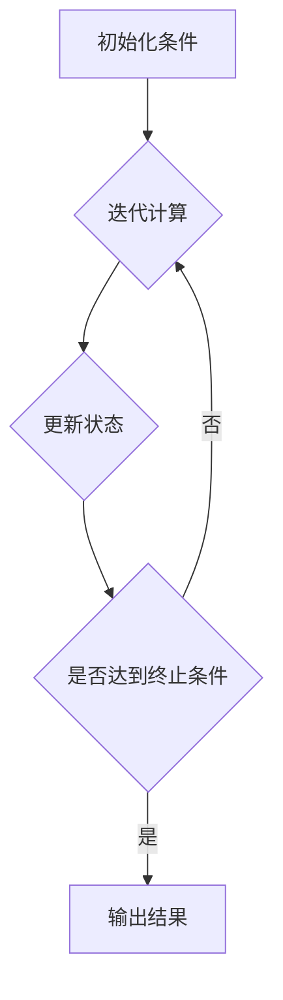
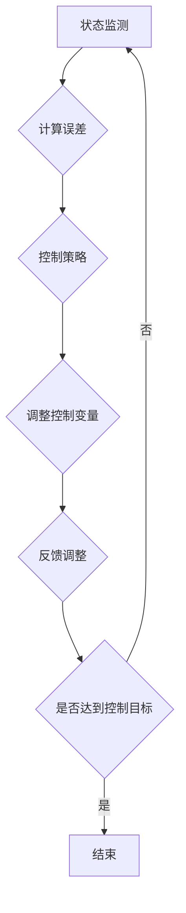
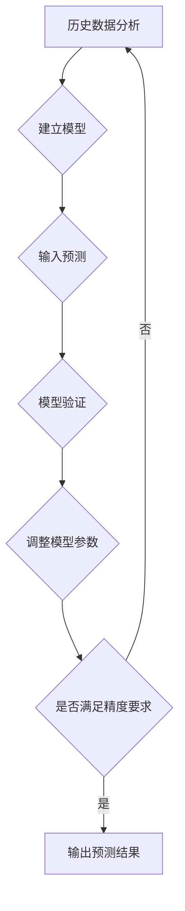

                 

### 引言

**数学与决定论：基本概念**

数学是一门古老的学科，其起源可以追溯到人类对自然现象的观察和描述。自古以来，数学在科学、工程、金融等多个领域都有着广泛的应用。而决定论，则是一种哲学和科学观点，认为宇宙中的一切事件都可以通过自然法则和初始条件精确预测。决定论不仅在哲学和科学领域有着深远的影响，也深深植根于数学的理论体系中。

本文旨在探讨数学与决定论之间的紧密联系。我们将首先介绍数学的基本概念和原理，接着深入探讨决定论的定义和科学基础，从而为后续的讨论奠定基础。

在数学的世界里，规律性和确定性是核心特征。无论是简单的算术运算，还是复杂的几何图形，数学都为我们提供了一个精确而严密的工具箱，用以探索和理解现实世界。然而，在数学中，我们能否找到决定论的影子？数学模型是否能够揭示宇宙中的严格因果关系？这些问题将引导我们进入一个充满奥秘和挑战的数学世界。

接下来，我们将逐步深入探讨数学与决定论之间的联系。首先，我们会回顾数学的起源和发展，了解它如何成为一门探索规律的科学。接着，我们会介绍决定论的基本概念，解释其哲学和科学背景，并探讨决定论与现实世界的关系。在此基础上，我们将进一步探讨决定论在数学中的表达方式，从初等数学到高等数学，了解数学如何将决定论的观念融入其理论框架中。

然而，数学与决定论之间的关系并非一帆风顺。在量子力学和混沌理论等现代科学的发展中，我们发现了决定论的挑战和突破。这些挑战不仅对数学提出了新的问题，也为我们提供了新的视角来理解决定论。

在文章的后半部分，我们将讨论决定论在现实世界中的应用，从自然科学到社会科学，了解决定论如何影响我们的日常生活和社会发展。此外，我们还将探讨决定论与自由意志之间的关系，以及这一关系对道德和法律的影响。

最后，我们将总结决定论在哲学上的意义，探讨其与唯物主义和唯心主义的关系。同时，我们将介绍决定论的数学模型和算法原理，以及其实践应用，为读者提供全面而深入的理解。

通过这篇文章，我们希望能够帮助读者更好地理解数学与决定论之间的复杂关系，并探讨这一关系在现实世界中的深远影响。

### 1. 数学与决定论：基本概念

#### 1.1 数学：一门探索规律的科学

数学，作为一门探索规律的科学，起源于古代人类对自然现象的观察和描述。最初的数学知识大多来自于对日常生活的需要，例如计算农作物的数量、测量土地的面积等。随着时间的推移，数学逐渐发展为一门严谨的学科，其核心目标是寻找和理解自然界中的规律性。

**数学的起源与发展**

数学的起源可以追溯到古代埃及、巴比伦和中国等文明。这些文明的人们通过实践和经验，逐渐总结出了一些基本的数学原理和公式。例如，古埃及人发展了初步的几何学，用于建筑和测量；古巴比伦人则擅长天文和历法的计算。

在中国，数学也有着悠久的历史。早在公元前2000年左右，中国古代数学家就已经能够解决复杂的代数问题。著名的《九章算术》是中国古代数学的经典著作，其中包含了大量的算术、代数和几何问题。

古希腊是数学发展的重要里程碑。古希腊数学家如欧几里得、阿基米德等人，通过严密的逻辑推理和证明，建立了许多基本的数学定理和公式。特别是欧几里得的《几何原本》，奠定了现代几何学的基础。

中世纪时期，数学在欧洲得到了进一步的发展。阿拉伯数学家，如阿尔·花剌子密和欧玛尔·海亚姆，对代数和三角学做出了重要贡献。他们的著作被翻译成多种语言，对欧洲的数学发展产生了深远的影响。

近代以来，数学经历了快速的发展。微积分的发明，特别是牛顿和莱布尼茨的贡献，使得数学在描述自然现象方面变得更为强大。随后，概率论、数理统计、拓扑学、集合论等新兴数学领域相继出现，拓展了数学的应用范围。

**数学的应用领域**

数学在各个领域都有着广泛的应用。在自然科学中，数学是描述和预测物理、化学、生物学等自然现象的重要工具。例如，物理学中的牛顿运动定律和麦克斯韦方程组，都是通过数学公式来描述自然界的规律。

在工程学中，数学被用于设计建筑、制造机器、优化系统性能等。例如，结构力学中的有限元分析，通过数学模型来预测建筑物的稳定性；电子工程中的电路分析，则利用数学方法来设计电路和设备。

在经济学中，数学被用于建模市场行为、预测经济趋势、优化资源配置等。例如，金融数学中的期权定价模型，通过数学公式来计算金融衍生品的合理价格。

此外，数学还在医学、计算机科学、信息科学等多个领域有着重要的应用。例如，医学图像处理中的数学算法，可以帮助医生更准确地诊断疾病；计算机科学中的算法设计，则通过数学原理来提高程序效率。

**数学的基本原理**

数学的基本原理包括几个核心概念，如数、函数、集合、极限等。

**数**是数学的基本元素，包括自然数、整数、有理数、实数和复数。不同的数系统具有不同的属性和用途，例如自然数用于计数和排序，实数用于测量和计算。

**函数**是数学中的核心概念，描述了输入与输出之间的关系。函数可以被看作是一个“转换器”，将输入的数据按照一定的规则映射到输出的数据。函数的性质和特性，如单调性、奇偶性、连续性等，在数学分析和应用中具有重要地位。

**集合**是数学中的基本结构，用于描述一组元素。集合的概念可以用来分类、排序和组织数据，是现代数学的基础。

**极限**是数学中描述变化率和收敛性的重要概念。通过极限，我们可以理解函数在某一位置的“行为”，例如极限值、极限过程等。

**1.2 决定论：现实世界的严格规则**

**决定论的哲学背景**

决定论是一种哲学观点，认为宇宙中的一切事件都是严格规律性的，可以由初始条件和自然法则完全预测。这一观点在古希腊哲学中已有雏形，如亚里士多德认为自然界的一切都是由因果关系所支配的。

在中世纪，决定论进一步发展，例如托马斯·阿奎那在其神学著作中阐述了上帝的全知全能，认为一切事件都是由上帝的预知和决定所决定的。

在现代哲学中，决定论的观点受到了更多的质疑和讨论。康德提出了“先天综合判断”的概念，认为自然界中的规律是先天的，但并非一切事件都能被完全预测。

**决定论的科学基础**

在科学领域，决定论的观点得到了广泛的支持。经典力学中的牛顿定律就是一个典型的决定论模型，它认为任何物体的运动都可以通过初始条件和运动方程精确预测。

量子力学的发展也对决定论提出了挑战。量子力学中的不确定性原理表明，某些物理量如位置和动量不能同时被精确测量，因此宇宙中的某些事件具有概率性质，不能完全预测。

**决定论与现实世界的关系**

决定论与现实世界的关系复杂且充满争议。一方面，许多科学现象可以通过决定论的框架来解释，如物理、化学、天文学等。另一方面，人类的行为和社会现象似乎难以用决定论来完全解释，例如自由意志的讨论、人类创造力的发挥等。

总的来说，数学与决定论之间的联系在于，数学提供了探索和表达现实世界规律性的工具，而决定论则为我们提供了一种理解和解释这些规律的哲学框架。在接下来的部分，我们将进一步探讨数学中的决定论表达，从初等数学到高等数学，深入理解数学世界的严格因果关系。

### 1.2 决定论：现实世界的严格规则

#### 1.2.1 决定论的哲学背景

决定论的哲学背景可以追溯到古希腊哲学，当时许多哲学家如亚里士多德和伊壁鸠鲁都提出了决定论的观念。亚里士多德认为，自然现象是由因果链条所支配的，每个事件都有一个原因，所有事件都是因果关系的延续。这种因果决定论的思想在后来的欧洲哲学传统中得到了进一步的发展。

中世纪哲学家，如托马斯·阿奎那，在其神学著作中阐述了决定论，认为上帝的全知全能使得宇宙中的一切事件都是可以被预知的和决定的。这种神学决定论的观点在当时有着广泛的影响。

进入现代，决定论的哲学讨论变得更加复杂和多样化。康德提出了“先天综合判断”的概念，认为自然界中的规律是先天的，但并非所有事件都能被完全预测。他区分了现象界和本体界，认为本体界的规律性是超验的，不可知的。这一观点对后来的哲学发展产生了深远的影响。

19世纪的实证主义哲学家，如奥古斯特·孔德和约翰·斯图尔特·密尔，强调科学方法在认识世界中的作用，认为科学知识是可以通过经验观察和实验验证的。他们的观点在一定程度上支持了决定论的哲学基础。

然而，随着相对论和量子力学的出现，决定论的观点受到了新的挑战。爱因斯坦的相对论表明，时间和空间是相对的，而不是绝对固定的。量子力学中的不确定性原理则表明，某些物理量如位置和动量不能同时被精确测量，从而挑战了经典决定论的观点。

**1.2.2 决定论的科学基础**

在科学领域，决定论的观点得到了广泛的接受。经典物理学，特别是牛顿力学，是一个典型的决定论模型。牛顿的三大定律和万有引力定律，使得我们可以通过初始条件和运动方程来精确预测物体的运动。在经典力学的框架下，宇宙中的每一个事件都可以通过因果关系来解释，从而符合决定论的观点。

除了经典力学，决定论在化学、生物学和天文学等领域也有着广泛的应用。在化学中，化学反应可以通过反应物和产物的能量变化来解释，这些反应遵循特定的化学方程式和反应动力学。在生物学中，生物体的生长、发育和遗传现象也可以通过自然选择和遗传学定律来解释。

在天文学中，行星运动、恒星生成和宇宙演化等复杂现象都可以通过决定论的框架来描述。开普勒定律和牛顿万有引力定律为我们提供了精确的预测工具，使得天文学家可以预测行星的位置、恒星的生成和宇宙的演化。

然而，量子力学的出现改变了我们对决定论的理解。量子力学中的不确定性原理表明，某些物理量如位置和动量不能同时被精确测量，因此宇宙中的某些事件具有概率性质，不能完全预测。这一观点挑战了经典决定论的观点，使得决定论的适用范围受到限制。

**1.2.3 决定论与现实世界的关系**

决定论与现实世界的关系是一个复杂而多维的问题。一方面，决定论的观点在许多科学领域都有其适用性，能够解释和预测自然现象。例如，在经济学中，许多经济模型基于决定论的观点，通过数学模型来描述市场行为和预测经济趋势。

然而，另一方面，现实世界中的人类行为和社会现象似乎难以用决定论来完全解释。自由意志的讨论就是一个典型的例子。许多人认为，人类的行为是由个人的选择和决策所驱动的，这些选择和决策并非完全受因果关系所支配，而是具有一定的自由度。

此外，人类创造力的发挥也是决定论难以解释的问题。艺术家、作家和科学家通过创造性思维和独特的视角，提出了许多新的理论和发现。这些创造性的成果似乎并非仅仅通过因果关系和初始条件所能完全预测。

总的来说，决定论在现实世界中的应用具有局限性和争议性。虽然决定论的观点在许多科学领域都有其适用性，但人类行为和社会现象的复杂性使得决定论难以完全解释一切。未来，我们可能需要在决定论和其他哲学观点之间找到一个平衡，以更全面地理解现实世界。

### 1.3 决定论的数学表达

#### 1.3.1 初等数学中的决定论

初等数学是数学的基础，其核心内容包括整数与算术、分数与比例、几何与空间等。在初等数学中，决定论的观念得到了直接的体现。

**整数与算术**

整数是初等数学中最基本的概念之一，用于计数、排序和表示数量。整数的基本运算，如加法、减法、乘法和除法，都是确定的和可预测的。例如，如果我们知道两个整数的值，我们可以通过加法运算精确地得到它们的和。

算术的基本原理是建立在整数的运算规则上的。这些规则保证了运算的结果是唯一确定的，不会受到外部因素的影响。例如，对于任意两个整数a和b，其和a+b的结果是唯一确定的，不受时间和地点的影响。

这种确定性和可预测性体现了初等数学中的决定论观念。通过明确的规则和初始条件，我们可以精确地预测运算的结果。

**分数与比例**

分数是表示部分与整体关系的数学工具，用于解决各种实际问题，如分配、比较等。分数的运算规则同样保证了其结果的可预测性。

比例是分数的扩展，用于描述两个量之间的关系。比例的基本性质，如比例恒等式和比例的传递性，使得我们能够通过已知的部分来预测整体。

例如，如果知道一个量与其比例的关系，我们可以通过比例运算来预测另一个量的值。这种通过已知关系来预测未知量的方法，体现了数学中的决定论。

**几何与空间**

几何是研究形状、大小和位置关系的数学分支。在几何学中，决定论的观念得到了直接的体现。

几何的基本原理是通过公理和定理来构建的。这些公理和定理提供了明确的规则，使得我们能够通过已知的条件来预测几何图形的性质。

例如，通过欧几里得的几何公理，我们可以预测三角形的三边关系，如三角形两边之和大于第三边。这种通过公理和定理来预测几何图形性质的方法，体现了数学中的决定论。

此外，几何中的对称性、角度关系和面积计算等概念，也都体现了决定论的思想。通过已知的条件和规则，我们可以精确地计算和预测几何图形的各种属性。

总的来说，初等数学中的决定论体现在其运算规则和几何原理中。这些规则和原理保证了数学结果的可预测性和确定性，从而为现实世界的各种问题提供了精确的数学工具。

在初等数学的基础上，决定论的观念被进一步扩展到更复杂的数学领域。这些扩展不仅丰富了数学的内容，也为科学和技术的发展提供了坚实的理论基础。

#### 1.3.2 高等数学中的决定论

高等数学是数学的核心部分，包括微积分、线性代数、概率论与数理统计等。在高等数学中，决定论的观念得到了更加深入的体现和应用。

**微积分与极限**

微积分是研究变化率和累积量的数学分支，其核心概念包括导数、积分和极限。这些概念在物理学、工程学、经济学等多个领域有着广泛的应用。

在微积分中，极限概念是决定论的重要体现。极限描述了一个函数在某一位置的“行为”，即当自变量趋近某一特定值时，函数值的变化趋势。例如，函数f(x)在x=a处的极限表示当x越来越接近a时，f(x)的值将趋向于某个确定值。

通过极限，我们可以精确地描述和分析函数的变化规律，从而实现对系统的精确预测。例如，在物理学中，通过求极限可以精确计算物体的瞬时速度和加速度，这些结果可以帮助我们预测物体的运动轨迹。

**导数与微分方程**

导数是微积分中的另一个核心概念，描述了函数在某一点的斜率。导数的计算方法，如微分法则，同样体现了决定论的思想。

导数在物理、工程学等领域有着广泛的应用。例如，在物理学中，导数可以用来描述物体的运动规律，如速度和加速度。通过求导，我们可以精确计算物体在某一时刻的速度和加速度，从而预测物体的未来运动。

微分方程是导数在连续系统中的应用，用于描述系统的动态行为。微分方程的解可以提供系统在任意时刻的状态，从而实现对系统的精确预测。例如，牛顿的运动定律可以表示为微分方程，通过求解这些方程，我们可以预测物体的运动轨迹。

**线性代数与矩阵**

线性代数是研究向量空间和线性变换的数学分支，其核心概念包括向量、矩阵、行列式等。线性代数的理论和应用在物理学、工程学、计算机科学等领域有着广泛的影响。

在线性代数中，矩阵运算和线性变换同样体现了决定论的思想。矩阵运算，如加法、乘法、逆运算等，都是确定的和可预测的。通过矩阵运算，我们可以精确计算系统的状态和变化。

线性变换是线性代数中的另一个重要概念，用于描述系统从一个向量空间到另一个向量空间的映射。线性变换的特性和规律，如特征值和特征向量，可以帮助我们理解和预测系统的行为。

**概率论与数理统计**

概率论是研究随机现象和不确定性的数学分支，其核心概念包括概率、随机变量、期望、方差等。概率论与数理统计在自然科学、社会科学、金融学等领域有着广泛的应用。

在概率论中，决定论的思想体现在对随机事件的精确预测和分析。通过概率分布函数和概率模型，我们可以预测随机事件的发生概率，从而实现对不确定性的量化。

数理统计是概率论在数据分析中的应用，用于从数据中提取信息和做出预测。数理统计中的方法，如假设检验、回归分析等，同样体现了决定论的思想。通过数理统计方法，我们可以从样本数据中推断总体特征，从而实现对总体分布的精确预测。

总的来说，高等数学中的决定论体现在其核心概念和理论体系中。微积分、线性代数、概率论与数理统计等分支，通过严格的数学模型和运算规则，为我们提供了精确预测和分析的工具。这些工具不仅在科学研究中有着重要的应用，也为现实世界中的各种决策提供了科学依据。

#### 1.3.3 决定论的挑战与突破

尽管决定论在数学和科学领域有着广泛的应用，但在现代科学的发展中，我们面临着一些挑战，这些挑战促使我们重新思考决定论的观点。

**量子力学与概率论**

量子力学的出现是决定论的一大挑战。量子力学描述了微观世界的规律，与经典力学相比，它具有一些显著的特点。首先，量子力学中的不确定性原理表明，某些物理量如位置和动量不能同时被精确测量。这意味着我们无法通过初始条件和自然法则来精确预测量子系统的行为。

例如，根据海森堡不确定性原理，一个粒子的位置和动量不能同时被精确确定。这意味着量子系统的行为具有概率性质，而不是确定性的。量子力学的这种概率性质挑战了决定论的观点，使得我们无法通过决定论的框架来解释微观世界的规律。

此外，量子力学的波粒二象性和量子纠缠等现象也进一步削弱了决定论的基础。波粒二象性表明，微观粒子既表现出波动性又表现出粒子性，这种双重性质无法用决定论的因果链条来解释。量子纠缠则表明，两个或多个粒子之间存在一种即时的相互作用，无论它们相隔多远，这种相互作用似乎超越了经典物理中的因果关系。

概率论在量子力学中的应用也使得决定论的挑战更加明显。量子力学的概率论描述了量子事件的概率分布，通过概率波函数和测量结果，我们可以预测量子系统的行为。这种基于概率的描述方式与决定论的观点相悖，使得我们不得不重新审视决定论在微观世界中的适用性。

**混沌理论与非线性系统**

混沌理论是另一个对决定论提出挑战的领域。混沌理论研究了非线性系统的行为，特别是那些初始条件敏感性系统。混沌现象的一个重要特征是“蝴蝶效应”，即一个微小的初始扰动可以导致系统行为的巨大差异。

在混沌系统中，初始条件的微小变化可以导致系统行为的不可预测性。这意味着即使我们知道系统的初始条件和基本规律，我们仍然无法精确预测系统的长期行为。混沌现象的这种不可预测性挑战了决定论的观点，使得我们无法通过决定论的框架来描述和预测复杂的非线性系统。

混沌理论的一个重要结论是，确定性系统可以表现出随机行为。这表明，即使在确定性的数学模型中，系统行为也可能具有随机性质。这种现象在混沌系统中得到了验证，如天气系统、流体动力学、电路系统等。

**决定论与量子力学和混沌理论的冲突**

量子力学和混沌理论的挑战使得决定论在微观和宏观世界中都面临着困境。量子力学中的不确定性原理和量子纠缠表明，微观世界中的事件具有概率性质，无法通过决定论的框架来精确预测。混沌理论则表明，即使是在确定性的数学模型中，系统行为也可能具有随机性，这使得我们无法通过初始条件来完全预测系统的行为。

这些挑战促使我们重新思考决定论的观点。一方面，决定论在经典物理学和部分宏观系统中仍然具有其适用性，通过精确的数学模型和初始条件，我们可以预测许多自然现象。另一方面，在微观世界和复杂非线性系统中，决定论的适用性受到限制，概率论和混沌理论为我们提供了新的理解和描述方式。

总的来说，量子力学和混沌理论对决定论提出了严重的挑战，促使我们重新审视决定论的观点。虽然决定论在经典物理学中仍然具有其价值，但在微观和复杂系统中，我们需要引入概率论和混沌理论来更全面地理解现实世界。

#### 1.4 混沌理论与非线性系统

**混沌现象的发现**

混沌理论是20世纪中叶逐渐发展起来的一门学科，它研究的是确定性系统中出现的随机行为和长期行为的不可预测性。混沌现象最早由气象学家洛伦兹（Edward Lorenz）在1960年代发现。他在研究天气系统时发现，即使是微小的初始条件差异，也会导致长期天气状态的巨大差异，这种现象后来被称为“蝴蝶效应”。

混沌现象的发现揭示了确定性系统中的内在随机性，这一发现对决定论提出了巨大的挑战。洛伦兹通过数值模拟展示了如何在一个简单的确定性动力系统中，通过改变一个初始条件的微小值，会导致长期行为完全不同的结果。这一发现表明，即使在严格的数学模型下，系统的行为也可能变得不可预测。

**非线性系统与决定论**

非线性系统是混沌现象的基础。非线性系统是指其内部变量之间存在非线性关系的系统。在非线性系统中，微小的初始条件差异可以导致系统行为的巨大差异，这种敏感性使得我们无法通过初始条件来完全预测系统的长期行为。

与线性系统相比，非线性系统具有更复杂的行为。线性系统通常可以通过简单的叠加原理来描述，而非线性系统则需要更加复杂的数学模型。非线性关系可以导致系统出现周期性、混沌、混沌吸引子和分岔等现象，这些现象在现实世界中有着广泛的应用。

决定论在非线性系统中的挑战主要来自于其内在的随机性和不可预测性。尽管决定论认为系统行为是可以通过初始条件和自然法则来完全预测的，但在非线性系统中，这种预测变得非常困难。混沌现象和蝴蝶效应表明，即使在确定性的数学模型中，系统行为也可能表现出随机性质。

**混沌理论的应用**

混沌理论在多个领域有着广泛的应用，包括物理学、生物学、经济学、气象学等。以下是一些混沌理论应用的实例：

1. **气象学**：混沌理论在气象学中的应用帮助我们更好地理解天气系统中的复杂性和不可预测性。例如，通过分析气象数据的混沌特征，可以预测短期天气变化，但长期天气预报仍然具有不确定性。

2. **生物学**：混沌理论在生物学中的应用揭示了生物系统中的一些非线性现象，如生物钟的调节、物种分布等。通过分析这些现象的混沌特征，可以更好地理解生物系统的动态行为。

3. **经济学**：混沌理论在经济学中的应用帮助我们理解市场行为的复杂性和不可预测性。例如，通过分析市场数据的混沌特征，可以预测短期市场波动，但长期市场趋势仍然难以预测。

4. **工程学**：混沌理论在工程学中的应用包括系统设计和控制。例如，在电子工程中，通过分析电路的非线性特性，可以设计出更稳定、更可靠的电路系统。

总的来说，混沌理论揭示了确定性系统中的内在随机性和不可预测性，对决定论提出了严重的挑战。尽管决定论在许多经典物理系统中仍然具有其适用性，但在复杂非线性系统中，混沌现象表明，我们需要引入概率论和其他非线性理论来更全面地理解现实世界。

### 1.5 决定论在现实世界中的应用

#### 1.5.1 自然科学中的应用

决定论在自然科学中有着广泛的应用，其核心在于利用数学模型和法则来描述和预测自然现象。以下是一些典型的应用实例：

**天文学中的应用**

在天文学中，决定论的观点被广泛应用于行星运动、恒星生成和宇宙演化等领域。开普勒定律和牛顿万有引力定律是决定论在行星运动研究中的典型应用。通过这些定律，我们可以精确预测行星的位置和运动轨迹。例如，牛顿通过万有引力定律成功预测了海王星的存在，这一发现验证了决定论在天文学中的有效性。

此外，决定论在天体力学中的应用还包括对彗星轨道的预测、太阳系稳定性分析等。通过建立复杂的数学模型，天文学家可以模拟和预测天体的行为，从而更好地理解宇宙的演化规律。

**物理学中的应用**

在物理学中，决定论的观点体现在经典力学和量子力学中。经典力学中的牛顿定律和拉格朗日力学为描述物体的运动提供了严格的数学框架。通过这些定律，我们可以预测物体的运动轨迹和能量变化。例如，在工程设计中，通过力学模型和计算，工程师可以预测结构的应力分布和稳定性，从而设计出更加安全的工程系统。

量子力学则为我们提供了一种新的视角来理解自然现象。尽管量子力学引入了概率论的概念，但其核心仍然是通过数学模型来描述粒子的行为。量子力学中的薛定谔方程和海森堡不确定性原理为理解微观世界的规律提供了重要的工具。

**化学中的应用**

在化学中，决定论的观点被用于描述化学反应和分子结构。化学动力学通过建立反应速率方程和化学平衡模型，可以预测化学反应的速率和方向。例如，反应动力学中的速率方程可以帮助化学家理解反应过程中的能量变化和中间产物的生成。

此外，量子化学中的决定论观点通过计算分子轨道和电子密度，可以预测分子的稳定性和反应活性。例如，通过计算分子的Hartree-Fock方程，我们可以预测分子的几何结构和电子分布，从而指导新药设计和材料合成。

**生物学中的应用**

在生物学中，决定论的观点被用于描述生物体的生长、发育和遗传现象。遗传学中的孟德尔定律和基因表达调控模型为理解生物体的遗传规律提供了重要的工具。通过这些模型，我们可以预测基因型与表现型之间的关系，从而更好地理解生物多样性。

此外，生态学中的决定论观点通过建立种群动力学模型，可以预测物种的分布和数量变化。这些模型帮助我们理解生态系统中的相互作用和平衡，从而为环境保护和资源管理提供科学依据。

总的来说，决定论在自然科学中的应用为我们提供了一种精确的数学工具来描述和预测自然现象。尽管在某些领域，如量子力学和混沌理论中，决定论的适用性受到挑战，但其在大部分经典物理、化学和生物学中的应用仍然具有重要意义。通过数学模型和算法，我们能够更好地理解自然界的规律，为科学研究和技术发展提供坚实的理论基础。

#### 1.5.2 社会科学中的应用

决定论在社会科学中的应用同样广泛且深远，涵盖了经济学、社会学和心理学等多个领域。在这些领域中，决定论提供了理解社会现象和行为的有力工具，尽管其应用和解释存在争议。

**经济学中的应用**

在经济学中，决定论的观点主要体现在对市场行为和宏观经济运行的预测上。古典经济学中的“看不见的手”理论认为，市场机制通过供需平衡可以自动调节经济活动，从而实现资源的有效配置。这种观点反映了决定论的核心理念，即经济行为和结果可以通过数学模型和自然法则来预测。

现代经济学中的计量经济学和宏观经济学模型也大量应用了决定论的原理。例如，消费函数模型和投资函数模型通过数学方程来描述消费者和投资者的行为，从而预测市场的供需状况。这些模型在政策制定、经济预测和市场分析中有着广泛的应用。

**社会学中的应用**

社会学中的决定论观点主要关注社会结构和行为的因果关系。例如，社会学家塔尔科特·帕森斯的结构功能主义理论认为，社会系统通过各部分的相互关系和功能来维持社会秩序，这种秩序可以通过数学模型来描述和预测。

在社会学研究中，决定论的另一个重要应用是分析社会不平等和阶级结构。马克思主义社会学家认为，社会结构和行为是由经济基础决定的，即生产关系决定社会关系。这种观点通过经济模型和社会结构分析，试图解释社会变迁和变革的规律。

此外，社会学中的定量研究方法，如社会调查和统计分析，也体现了决定论的原理。通过收集和分析大量数据，社会学家可以建立数学模型来预测社会现象，如犯罪率、离婚率、城市化趋势等。

**心理学中的应用**

在心理学中，决定论的观点主要体现在行为主义心理学和行为疗法中。行为主义心理学家认为，人类行为可以通过环境刺激和反应来解释，即行为是可预测的。例如，巴甫洛夫的经典条件反射实验展示了通过条件刺激，可以预测和改变动物的行为。

现代行为疗法，如认知行为疗法，也基于决定论的观点，通过改变个体的行为模式和思维模式，来治疗心理问题。例如，通过行为实验和反馈机制，心理治疗师可以预测和改变患者的负面行为和思维。

此外，心理学中的心理测量学和统计方法也体现了决定论的原理。通过建立心理测量模型和统计方法，心理学家可以预测个体的心理特征和行为模式，从而为教育和临床诊断提供科学依据。

**综合评价**

决定论在社会科学中的应用为我们提供了一种系统化和量化的方法来理解社会现象和行为。尽管其应用存在争议，如在人类自由意志和社会变革中的角色，但决定论的观点为社会科学研究提供了一种严格的科学框架。

总的来说，决定论在经济学、社会学和心理学等社会科学中的应用，不仅深化了我们对社会现象的理解，也为政策制定、社会管理和心理治疗提供了科学依据。通过数学模型和数据分析，我们可以更好地预测和应对复杂的社会问题，从而推动社会的发展和进步。

### 1.6 决定论与自由意志

**自由意志的定义与争论**

自由意志是哲学中的一个重要议题，涉及个体行为和选择的能力。自由意志的定义多样，通常指的是个体在不受外界强制的情况下，能够自主做出选择的能力。这一概念在哲学、心理学、神经科学等多个领域中引起了广泛的争论。

从哲学角度来看，自由意志的讨论可以追溯到古希腊哲学家。柏拉图认为，自由意志是人类灵魂的一部分，使人能够超越物质世界，追求更高的道德和理性。亚里士多德则认为，人类行为是理性选择的结果，但同时也受到外界因素的影响。

在现代哲学中，自由意志的讨论更加复杂。康德提出了“理性意志”的概念，认为自由意志是理性决策的基础，但同时也受到道德律令的限制。而黑格尔则认为，自由意志是人类历史发展的驱动力。

**自由意志的神经科学基础**

神经科学对自由意志的研究主要集中在大脑结构和功能上。尽管目前尚无直接证据证明自由意志的存在，但许多研究表明，大脑的特定区域与自由意志有关。

前额叶皮层是大脑中与自由意志密切相关的区域。这一区域负责决策、规划和执行复杂的任务，与认知控制和理性思考密切相关。研究表明，前额叶皮层的损伤可能导致个体的决策能力和自由意志受损。

此外，神经科学中的“自由意志悖论”也是一个重要议题。即如果大脑的所有行为都可以通过物理定律和初始条件来预测，那么自由意志是否真的存在？这一悖论挑战了决定论和自由意志的传统观点。

**自由意志与决定论的关系**

自由意志与决定论之间的关系是哲学和科学中一个长期的争论。决定论认为，宇宙中的一切事件都是由因果关系所决定的，从而否定自由意志的存在。而自由意志的支持者则认为，个体的自主选择和创新能力表明自由意志的存在。

从哲学角度来看，自由意志与决定论的冲突主要体现在以下几个方面：

1. **因果决定论与自由意志的冲突**：决定论认为，宇宙中的每一个事件都有其前因后果，从而否定个体自主选择的可能性。而自由意志则认为，个体能够独立做出选择，不受外界因果链条的完全支配。

2. **责任与道德的冲突**：如果一切行为都是预先决定的，那么个体是否应对其行为承担责任？道德责任要求个体对自己的行为负责，但如果行为是不可避免的，这一要求将变得毫无意义。

3. **人类行为的意义**：自由意志赋予了人类行为以意义，使得人类能够在复杂多变的环境中做出独特的决策和创造。而决定论则认为，人类行为是机械式的、必然的，从而否定了人类行为的独特性和自由性。

**科学对自由意志的探索**

尽管目前尚无直接证据证明自由意志的存在，但科学对自由意志的探索仍在继续。神经科学通过研究大脑结构和功能，试图揭示自由意志的神经基础。心理学则通过实验和行为研究，探索个体自主选择的能力和限制。

此外，量子力学中的不确定性原理为自由意志提供了一种新的解释。量子力学的随机性表明，某些物理现象无法通过因果关系来完全预测，这可能为自由意志的存在提供了一种可能性。

总的来说，自由意志与决定论之间的关系复杂且充满争议。尽管决定论在科学和哲学中有着广泛的应用，但自由意志的概念仍然具有重要的理论和实践意义。未来，我们可能需要在决定论和自由意志之间找到一种平衡，以更全面地理解人类行为和选择。

### 1.7 决定论与道德和法律的影响

#### 1.7.1 决定论与道德责任

决定论与道德责任之间的关系是一个复杂而深刻的哲学问题，涉及自由意志、因果关系以及行为的道德评价。决定论的基本观点是，一切事件，包括人类行为，都可以通过因果关系来解释。这一观点对于道德责任的含义和性质提出了挑战。

首先，如果一切行为都是预先决定的，那么个体是否真的对其行为负有道德责任？传统的道德观点认为，个体应该对自己的行为负责，因为他们的选择和行为是他们自主决策的结果。然而，决定论的观点似乎表明，个体的行为并非是他们自主决策的结果，而是由一系列因果链条所决定的。

例如，如果一个人在街头行凶，决定论可能会认为这是由于他早期的生活经历、大脑化学物质、遗传因素等多重因素的结果。在这种情况下，决定论支持者可能会主张，由于行为是不可避免的，因此不能对个体进行道德谴责。

然而，这种观点遭到了许多伦理学家的反对。他们认为，即使个体的行为是由因果关系所决定的，我们仍然应该对他们的行为进行道德评价。这种观点认为，道德责任不仅取决于行为的因果关系，还取决于个体在特定情境下的责任感和自主性。

例如，一个孩子在严格的父母管教下可能表现出叛逆行为，尽管这些行为可能是父母管教的结果，但我们仍然可以批评孩子的行为，并要求他们承担道德责任。这种观点认为，道德责任的核心在于个体在行为选择中的自主性和责任感，而不是因果关系。

#### 1.7.2 决定论与法律制度

决定论对法律制度的影响同样深远，特别是在刑事责任方面。法律制度的一个基本前提是，个体对其行为负有责任，并应受到相应的法律制裁。如果一切行为都是预先决定的，这一前提似乎受到了严重挑战。

首先，如果一个人的行为是由遗传、环境和其他无法控制的因素所决定的，那么这个人是否应该为其行为承担法律责任？传统的法律观点认为，个体应该为其行为承担责任，因为他们的选择和行为是自主的。然而，决定论的观点似乎表明，个体的行为并非是他们自主选择的结果，而是由一系列因果关系所决定的。

例如，如果一个人在街头行凶，决定论可能会认为这是由于他的遗传因素、环境因素等多重因素的结果。在这种情况下，决定论支持者可能会主张，由于行为是不可避免的，因此不能对个体进行刑事制裁。

这种观点引起了广泛的争议。一些人认为，即使行为是由因果关系所决定的，个体仍然应该为其行为承担责任。他们认为，法律制度的一个核心目标是确保社会的公平和正义，即使个体无法完全自主选择其行为，他们仍然应该为其行为后果承担责任。

另一种观点则认为，如果行为是由无法控制的因素所决定的，那么个体不应为其行为承担法律责任。这种观点强调个体的不可控性和法律制度的公平性。然而，这种观点在实践中可能带来一系列难题，如如何确定行为是否由不可控因素所决定，以及如何确保法律制裁的公平性。

#### 1.7.3 决定论的伦理问题

决定论在伦理领域引发了一系列重要问题。首先，决定论对道德责任的质疑挑战了传统的伦理观念。如果一切行为都是因果关系的结果，那么个体是否真的对其行为负有道德责任？这种质疑引发了关于自由意志、道德责任和道德评价的深入讨论。

其次，决定论对法律制度的影响引发了关于刑事责任和公平性的讨论。如果个体的行为是由不可控因素所决定的，那么他们是否应该为其行为承担法律责任？这种讨论涉及到法律制度的伦理基础和如何确保法律制裁的公平性。

此外，决定论还引发了关于人类行为的意义和价值的讨论。如果一切行为都是因果关系的结果，那么个体的自主性和创造性是否真的有意义？这种讨论涉及到人类存在的本质和人类行为的道德意义。

总的来说，决定论在伦理领域引发了一系列重要问题，涉及自由意志、道德责任、法律制度以及人类行为的意义。这些问题不仅具有哲学意义，也对我们的道德和法律实践产生了深远影响。

### 1.8 决定论的哲学意义

#### 1.8.1 决定论与唯物主义

决定论与唯物主义之间存在着深刻的联系。唯物主义是一种哲学观点，认为物质是世界的基本构成要素，意识和精神现象是物质的产物。在唯物主义的框架下，一切事件和现象都可以通过物质因果关系来解释，这与决定论的核心观点不谋而合。

**唯物主义的基本观点**

唯物主义认为，物质是唯一真实存在的实体，意识、思维和精神现象都是大脑活动的产物。唯物主义强调物质世界的客观存在和物质因果关系的决定性作用。根据唯物主义，所有现象，包括人类行为和社会事件，都可以追溯到物质基础和物理法则。

**决定论在唯物主义中的地位**

决定论在唯物主义中占据着核心地位。唯物主义认为，物质世界的运行遵循自然法则，这些法则决定了自然界和社会现象的发展。例如，在物理学中，牛顿定律和量子力学法则描述了物质运动的规律；在生物学中，进化论和遗传学法则解释了生物体的生长和变异。

决定论与唯物主义的结合使得我们能够通过自然法则和物理定律来理解世界。这种观点认为，宇宙中的一切现象，包括人类行为和社会发展，都可以通过因果关系来解释，不存在超自然的因素或绝对自由意志。

**唯物主义与决定论的互动**

唯物主义与决定论的互动体现在对自然现象和社会现象的理解上。唯物主义通过决定论来解释自然现象，如物理定律和化学过程，从而建立起对自然界的基本认识。同样，唯物主义也通过决定论来解释社会现象，如经济活动和政治变革。

例如，马克思主义哲学将决定论应用于社会发展理论，认为社会历史是由物质生产力和生产关系的发展所决定的。根据马克思主义，经济基础决定上层建筑，即社会的政治、法律、文化等方面的发展都是经济基础的反映。

总的来说，决定论与唯物主义之间存在着紧密的联系。唯物主义通过决定论来解释物质世界的运行规律，而决定论则为唯物主义提供了一种系统化的方法论，使我们能够通过自然法则和物理定律来理解世界。这种互动不仅深化了唯物主义的哲学基础，也为我们提供了理解自然界和社会现象的强大工具。

### 1.9 决定论与唯心主义

#### 1.9.1 唯心主义的基本观点

唯心主义是一种哲学观点，认为意识、精神现象是世界的本质，物质世界是意识的产物。与唯物主义相反，唯心主义强调意识的主导地位，认为物质世界的存在依赖于意识。唯心主义的主要流派包括柏拉图的理念论、笛卡尔的二元论和黑格尔的绝对理念论。

**柏拉图的理念论**

柏拉图的理念论是唯心主义的早期形式之一。他认为，现实世界只是理念世界的影子，理念世界是真实的存在。在柏拉图看来，理念是完美、永恒和不变的，而物质世界是理念的不完美、短暂和变化的表现。

**笛卡尔的二元论**

笛卡尔是另一位重要的唯心主义哲学家，他提出了“思维实体”和“物质实体”的二元论。笛卡尔认为，思维和物质是两种完全不同但相互作用的实体。思维是纯粹的、无限的存在，而物质是有限的、可变的。他提出了著名的“我思故我在”原则，强调思维的主观性和独立性。

**黑格尔的绝对理念论**

黑格尔是唯心主义的集大成者，他提出了绝对理念论。黑格尔认为，绝对理念是宇宙发展的动力和基础，是意识和物质世界的统一。在黑格尔的哲学体系中，绝对理念经历了自我发展的过程，最终实现为现实世界。

**决定论在唯心主义中的角色**

在唯心主义的框架下，决定论的角色与唯物主义有所不同。唯心主义认为，意识是世界的本质，因此决定论的因果关系应当是意识之间的相互作用。以下是一些唯心主义决定论的观点：

1. **意识决定论**：意识决定论认为，一切物质现象都是由意识决定的。例如，柏拉图的理念论强调理念世界是现实世界的根源，物质世界的存在依赖于理念。

2. **心理决定论**：心理决定论认为，个体的行为和决策是由内在心理过程决定的。笛卡尔的二元论强调思维的决定性，认为个体的行为是思维活动的结果。

3. **社会唯心主义**：社会唯心主义认为，社会现象是由人们的主观意识和价值观决定的。黑格尔的绝对理念论认为，社会历史是绝对理念自我实现的过程，社会现象是意识活动的体现。

**唯心主义与决定论的冲突**

唯心主义与决定论的冲突主要体现在对意识和物质的解释上。决定论认为，一切现象都可以通过因果关系来解释，这通常涉及到物质世界的物理法则。而唯心主义则强调意识的主导地位，认为物质世界是意识的产物。

这种冲突在哲学上引发了深刻的讨论。一方面，决定论为理解自然界和人类行为提供了一种严格的因果关系框架，这在许多科学和哲学领域都有其应用。另一方面，唯心主义则强调意识的主观性和独立性，认为物质世界的存在依赖于意识。

总的来说，决定论在唯心主义中扮演着复杂而独特的角色。尽管唯心主义强调意识的主导地位，但决定论的因果关系框架仍然在一定程度上被应用于唯心主义的理论体系中。这种冲突和互动为哲学提供了丰富的探讨空间，使我们能够更全面地理解意识和物质之间的关系。

### 1.10 决定论的数学模型

**决定论的数学模型**

决定论的数学模型是描述和预测系统行为的数学框架，它通过明确的因果关系和初始条件来预测系统的未来状态。以下是一些常见的决定论数学模型：

**1.1 普遍性模型**

普遍性模型是最基础的决定论模型之一，它通常基于牛顿力学和经典物理学的基本原理。在这种模型中，系统的行为可以通过一组微分方程来描述，这些方程反映了系统内部各个部分之间的相互作用。

例如，牛顿运动定律可以表示为以下形式的微分方程：
$$ m\frac{d^2x}{dt^2} = F(x, v, t) $$
其中，m是物体的质量，x是位置，v是速度，t是时间，F是作用力。通过求解这些方程，我们可以预测物体在未来时刻的位置和速度。

**1.2 非线性模型**

非线性模型描述的是具有复杂动态行为的系统，这些系统的行为难以通过简单的线性模型来描述。在非线性模型中，系统的未来状态不仅取决于当前的输入，还受到初始条件和历史状态的强烈影响。

一个典型的非线性模型是洛伦兹系统，它描述了流体动力学中的混沌现象。洛伦兹方程可以表示为：
$$ \frac{dx}{dt} = \sigma (y - x) $$
$$ \frac{dy}{dt} = x(\rho - z) - y $$
$$ \frac{dz}{dt} = xy - \beta z $$
其中，σ、ρ和β是参数。这些方程展示了系统如何从一个初始条件出发，逐渐演化成复杂的混沌行为。

**1.3 混沌模型**

混沌模型是研究非线性系统和混沌现象的重要工具。混沌现象的一个重要特征是初始条件的敏感性，即系统在初始条件上的微小变化可能导致长期行为的巨大差异。

一个经典的混沌模型是洛伦兹 attractor，它描述了在洛伦兹系统中可能出现的混沌行为。洛伦兹 attractor可以通过以下方程表示：
$$ \frac{dx}{dt} = \sigma (y - x) $$
$$ \frac{dy}{dt} = x(\rho - z) - y $$
$$ \frac{dz}{dt} = xy - \beta z $$
通过数值模拟这些方程，我们可以观察到系统的混沌行为，如随机性的出现和长期行为的不可预测性。

**1.4 离散模型**

除了连续模型，决定论还包括离散模型，这些模型通常用于描述系统的状态转移。离散模型通过状态空间和转移矩阵来描述系统的动态行为。

一个简单的离散模型是马尔可夫链，它描述了系统在不同状态之间的转移概率。例如，一个简单的二状态马尔可夫链可以通过以下转移矩阵表示：
$$ P = \begin{bmatrix} p_{11} & p_{12} \\ p_{21} & p_{22} \end{bmatrix} $$
其中，p_{11}、p_{12}、p_{21}和p_{22}是状态转移概率。通过这个矩阵，我们可以预测系统在未来的状态分布。

**1.5 非线性离散模型**

非线性离散模型是离散模型在非线性系统中的应用，它通过状态空间和转移规则来描述系统的动态行为。一个典型的例子是Logistic映射，它描述了种群动态中的非线性关系：
$$ x_{n+1} = r \cdot x_n (1 - x_n) $$
其中，r是控制参数。通过调整r的值，我们可以观察到从规则性到混沌行为的转换。

总的来说，决定论的数学模型为我们提供了描述和预测系统行为的有力工具。无论是线性模型还是非线性模型，连续模型还是离散模型，它们都基于明确的因果关系和初始条件，使得我们能够通过数学方法来理解和预测现实世界中的复杂现象。

### 1.11 决定论的数学公式

决定论的数学表达不仅仅通过模型来体现，还通过一系列关键的数学公式来描述和预测系统的行为。以下是一些重要的数学公式，它们在不同的领域和背景下有着广泛的应用。

**微积分公式**

微积分是研究变化率和累积量的数学分支，其中包含了一些核心公式，这些公式在物理、工程、经济学等领域有着重要的应用。

1. **导数公式**
   导数是描述函数在某一点变化率的工具。基本导数公式包括：
   $$ \frac{d}{dx}(x^n) = nx^{n-1} $$
   $$ \frac{d}{dx}(\ln(x)) = \frac{1}{x} $$
   $$ \frac{d}{dx}(\sin(x)) = \cos(x) $$
   $$ \frac{d}{dx}(\cos(x)) = -\sin(x) $$

2. **微分方程**
   微分方程描述了变量之间的关系，通过求解这些方程，我们可以预测系统的动态行为。一个典型的例子是牛顿第二定律：
   $$ m\frac{d^2x}{dt^2} = F(x, v, t) $$
   其中，m是质量，x是位置，v是速度，F是作用力。

**概率论公式**

概率论是研究随机现象和不确定性的数学分支，以下是一些核心的概率论公式：

1. **贝叶斯公式**
   贝叶斯公式是概率论中的核心公式，用于计算后验概率。公式如下：
   $$ P(A|B) = \frac{P(B|A)P(A)}{P(B)} $$
   其中，P(A|B)是后验概率，P(B|A)是条件概率，P(A)和P(B)分别是先验概率。

2. **期望和方差**
   期望和方差是描述随机变量分布的重要参数。
   $$ E(X) = \sum_{i} x_i p_i $$
   $$ Var(X) = E[(X - E(X))^2] $$
   其中，E(X)是期望，Var(X)是方差，x_i和p_i分别是随机变量的取值和概率。

**线性代数公式**

线性代数是研究向量空间和线性变换的数学分支，以下是一些重要的线性代数公式：

1. **矩阵乘法**
   矩阵乘法是线性代数中的基本运算：
   $$ C = A \cdot B $$
   其中，C是乘积矩阵，A和B是输入矩阵。

2. **特征值和特征向量**
   特征值和特征向量是描述线性变换的重要工具：
   $$ Av = \lambda v $$
   其中，A是矩阵，v是特征向量，\(\lambda\)是特征值。

**概率论公式**

概率论是研究随机现象和不确定性的数学分支，以下是一些核心的概率论公式：

1. **条件概率**
   条件概率描述了在已知某个事件发生的情况下，另一个事件发生的概率：
   $$ P(A|B) = \frac{P(A \cap B)}{P(B)} $$
   其中，P(A|B)是条件概率，P(A ∩ B)是联合概率，P(B)是边缘概率。

2. **贝努利分布**
   贝努利分布是描述二项试验成功概率的分布：
   $$ P(X = k) = C(n, k) p^k (1 - p)^{n - k} $$
   其中，n是试验次数，k是成功的次数，p是单次试验成功的概率。

通过这些数学公式，我们能够更精确地描述和预测系统的行为，从而为科学研究和实际应用提供有力的工具。无论是微积分、概率论还是线性代数，这些公式都在决定论的框架下发挥了关键作用，使得我们能够深入理解宇宙中复杂的因果关系。

### 1.12 决定论的算法原理与流程图

#### 1.12.1 算法原理

决定论的算法原理是基于明确的因果关系和初始条件来预测系统行为的一系列步骤。这些算法通过数学模型和逻辑规则，从给定的初始条件出发，逐步推导出系统的未来状态。以下是一些常见的决定论算法原理：

1. **确定性算法**：确定性算法是一种最简单的决定论算法，它基于已知的数学模型和初始条件，通过一系列明确的步骤，得出唯一确定的输出结果。例如，在牛顿运动定律的框架下，给定初始条件（位置、速度、作用力等），我们可以通过求解微分方程，精确预测物体的运动轨迹。

2. **蒙特卡洛模拟**：蒙特卡洛模拟是一种基于概率论和随机抽样的算法，它通过大量的随机试验，逐步逼近系统的真实状态。蒙特卡洛模拟利用随机数生成器，模拟系统在一系列随机条件下的行为，并通过统计分析得出结果的概率分布。

3. **遗传算法**：遗传算法是一种基于生物进化原理的优化算法，它模拟自然选择过程，通过遗传、交叉和变异等操作，逐步优化解的空间。遗传算法通过适应度函数来评价解的质量，不断迭代，直到找到最优解或接近最优解。

4. **递归算法**：递归算法是一种通过递归调用自身来解决问题的算法。递归算法基于明确的递推关系和初始条件，逐步推导出问题的解。例如，在计算斐波那契数列时，通过递归关系 \(F(n) = F(n-1) + F(n-2)\) 来逐步计算出每一项的值。

#### 1.12.2 算法流程图

为了更好地理解和实现这些算法，我们可以通过流程图来描述其基本步骤和操作。

1. **确定性算法流程图**：

   ```mermaid
   graph TD
   A[开始] --> B{初始化条件}
   B --> C{求解方程}
   C --> D{输出结果}
   D --> E{结束}
   ```

   在这个流程图中，我们从初始条件开始，通过求解数学方程，得出最终的结果。

2. **蒙特卡洛模拟流程图**：

   ```mermaid
   graph TD
   A[开始] --> B{初始化参数}
   B --> C{随机抽样}
   C --> D{计算概率}
   D --> E{统计分析}
   E --> F{更新参数}
   F --> G{是否结束？}
   G -->|否|B
   G -->|是|H[输出结果]
   H --> I{结束}
   ```

   在这个流程图中，我们通过随机抽样和统计分析，逐步逼近系统的真实状态。

3. **遗传算法流程图**：

   ```mermaid
   graph TD
   A[开始] --> B{初始化种群}
   B --> C{计算适应度}
   C --> D{选择操作}
   D --> E{交叉操作}
   E --> F{变异操作}
   F --> G{生成新种群}
   G --> H{是否达到终止条件？}
   H -->|否|B
   H -->|是|I[输出结果]
   I --> J{结束}
   ```

   在这个流程图中，我们通过选择、交叉和变异等操作，逐步优化解的空间。

4. **递归算法流程图**：

   ```mermaid
   graph TD
   A[开始] --> B{递归调用}
   B --> C{计算结果}
   C --> D{输出结果}
   D --> E{结束}
   ```

   在这个流程图中，我们通过递归调用，逐步计算出问题的解。

通过这些算法原理和流程图的描述，我们可以更直观地理解和实现决定论的算法。这些算法不仅为我们提供了预测系统行为的工具，也为科学研究和技术发展提供了坚实的理论基础。

### 1.13 决定论的算法原理与流程图

**算法原理**

决定论的算法原理在于利用明确的因果关系和初始条件，通过一系列数学运算和逻辑步骤，逐步推导出系统的未来状态。这些算法的核心在于其确定性，即给定相同的初始条件和参数，算法将产生相同的输出结果。

以下是几种常见决定论算法的原理和步骤：

**1. 确定性算法**

确定性算法是最基本的决定论算法，其核心步骤包括：

- **初始化**：设置初始条件，如初始位置、速度、参数等。
- **迭代计算**：根据已知的数学模型，进行迭代计算，例如求解微分方程或递归关系。
- **更新状态**：根据迭代结果，更新系统的状态，如位置、速度、温度等。
- **输出结果**：在达到预设的迭代次数或终止条件后，输出最终结果。

**2. 控制算法**

控制算法用于根据系统的当前状态调整控制变量，以实现特定的控制目标。其基本步骤包括：

- **状态监测**：实时监测系统的状态，如传感器数据。
- **误差计算**：计算系统当前状态与目标状态之间的误差。
- **控制策略**：根据误差和已知的控制策略，调整控制变量。
- **反馈调整**：根据系统的响应，调整控制策略，优化控制效果。

**3. 预测算法**

预测算法用于预测系统在未来的行为。其基本步骤包括：

- **历史数据分析**：分析系统的历史数据，提取关键特征。
- **建立模型**：根据历史数据，建立数学模型来描述系统的行为。
- **输入预测**：根据当前的输入条件，预测系统的未来状态。
- **模型验证**：通过实际数据验证模型的准确性，调整模型参数。

**算法流程图**

以下是通过Mermaid语言绘制的几种算法的流程图：

**1. 确定性算法流程图**



**2. 控制算法流程图**



**3. 预测算法流程图**



通过这些算法原理和流程图的描述，我们可以更直观地理解决定论算法的核心步骤和应用场景。这些算法不仅在科学研究和技术应用中具有重要作用，也为理解和预测复杂系统的行为提供了强有力的工具。

### 1.14 决定论的实践应用

#### 1.14.1 自然科学实践

决定论在自然科学中有着广泛的应用，通过数学模型和算法，科学家们能够准确预测和解释各种自然现象。以下是一些具体的实践应用实例：

**天文学中的应用**

在天文学中，决定论的应用主要体现在对行星轨道的预测和对恒星演化的模拟。开普勒定律和牛顿的万有引力定律为天文学家提供了精确的数学工具，使他们能够预测行星的运动轨迹。例如，通过牛顿定律，我们可以计算行星在未来数百年甚至数千年的位置。这一能力不仅有助于天文学研究，还对航天工程具有重要意义。

此外，天文学家还利用决定论的原理来模拟恒星的演化过程。通过对恒星内部的物理过程和能量转换的理解，科学家们可以建立恒星演化的数学模型，预测恒星的形成、生命周期和最终结局。这些模型帮助天文学家更好地理解宇宙的起源和演化。

**物理学中的应用**

物理学是决定论应用最为广泛的领域之一。从经典力学到量子力学，决定论的原理贯穿于各个分支。在经典力学中，牛顿定律和拉格朗日方程为科学家们提供了强大的工具，使他们能够精确描述和预测物体的运动。例如，在工程设计中，通过运用这些方程，工程师可以预测机械结构和电子设备的运动和稳定性，从而设计出更安全、更高效的系统。

量子力学中的决定论应用主要体现在对微观粒子的行为描述。尽管量子力学引入了概率论，但其核心仍然是通过数学模型来描述粒子的行为。例如，薛定谔方程为科学家们提供了计算电子分布和原子结构的工具，使我们能够理解物质的性质和特性。

**化学中的应用**

在化学中，决定论的应用主要体现在对化学反应的预测和对分子结构的分析。化学反应动力学通过建立反应速率方程和化学平衡模型，可以预测化学反应的速率和方向。例如，通过这些模型，化学家可以预测新化合物的合成方法和反应条件，从而指导新药设计和材料科学的发展。

量子化学中的决定论原理则体现在对分子轨道和电子密度的计算。通过计算分子的Hartree-Fock方程，化学家可以预测分子的几何结构和电子分布，从而理解分子的化学性质和反应活性。

**生物学中的应用**

在生物学中，决定论的应用主要体现在对生物体生长、发育和遗传现象的描述。遗传学中的孟德尔定律和基因表达调控模型为科学家们提供了理解生物多样性和进化机制的工具。通过这些模型，我们可以预测基因型与表现型的关系，从而更好地理解生物的遗传规律。

此外，生态学中的决定论应用主要体现在对种群动态和生态系统演化的模拟。通过建立种群动力学模型和生态位模型，生态学家可以预测物种的分布和数量变化，从而为环境保护和生态修复提供科学依据。

总的来说，决定论在自然科学中的实践应用不仅帮助我们更准确地预测和解释自然现象，也为科学研究和技术创新提供了坚实的理论基础。通过数学模型和算法，我们能够更好地理解宇宙的运行规律，推动科学的发展和社会的进步。

#### 1.14.2 社会科学实践

决定论在社会科学中的应用同样广泛，通过数学模型和算法，社会科学研究者能够更好地理解和预测社会现象和行为。以下是一些具体的应用实例：

**经济学中的应用**

经济学是决定论应用的一个重要领域。在经济学中，决定论的原理通过数学模型来描述市场行为和宏观经济运行。微观经济学中的供需模型、消费者行为理论和生产者行为理论都是决定论的应用实例。这些模型通过建立价格、需求量和供给量之间的关系，可以预测市场中的价格变动和资源配置。

例如，供需模型通过需求曲线和供给曲线的交点，预测市场的均衡价格和均衡数量。消费者行为理论通过分析消费者的偏好和预算约束，预测消费者的购买决策。生产者行为理论通过分析生产者的成本和利润函数，预测生产者的生产决策。这些模型为经济学家提供了有力的工具，使他们能够预测市场行为和经济趋势。

此外，宏观经济模型，如IS-LM模型和AD-AS模型，也基于决定论原理，通过描述总需求、总供给和利率之间的关系，预测宏观经济变量，如经济增长率、通货膨胀率和失业率。

**社会学中的应用**

决定论在社会学中的应用主要体现在对社会结构、社会变迁和社会行为的描述。社会学家通过建立社会模型和算法，可以预测社会现象和行为模式。例如，社会结构模型通过分析社会分层和社会网络，预测社会不平等和社会流动。

社会变迁模型通过分析社会制度和社会规范的变化，预测社会的发展和变革。社会行为模型通过分析个体的行为和决策，预测社会行为和社会运动。

一个典型的应用实例是社会资本理论，该理论通过建立社会资本的数学模型，预测社会资本对个体和社会的影响。社会资本是指个体在社会网络中的资源和关系，它可以影响个体的机会、资源和福利。通过分析社会资本的分布和变化，社会学家可以预测社会不平等和社会流动。

**心理学中的应用**

决定论在心理学中的应用主要体现在对行为和认知的描述。心理学家通过建立行为模型和认知模型，可以预测个体的行为和决策。例如，行为主义心理学中的刺激-反应模型通过分析刺激和反应之间的关系，预测个体的行为。

认知心理学中的信息加工模型通过分析个体对信息的处理过程，预测个体的认知行为。例如，决策理论通过分析个体在不确定环境下的决策过程，预测个体的选择和行为。

**政策分析中的应用**

决定论在政策分析中的应用主要体现在对政策效果的预测和评估。政策分析者通过建立数学模型和算法，可以预测政策的实施效果，为政策制定提供科学依据。

例如，福利经济学中的成本-效益分析模型通过计算政策成本和效益，预测政策对社会福利的影响。公共选择理论通过分析个体在公共选择过程中的行为，预测政策的选择和实施。

总的来说，决定论在社会科学中的应用为我们提供了强大的工具，使我们能够更准确地预测和理解社会现象和行为。通过数学模型和算法，社会科学研究者能够更好地解决社会问题，推动社会进步和发展。

#### 1.15 决定论在计算机科学中的应用

决定论在计算机科学中的应用非常广泛，涵盖了算法设计、系统优化、人工智能等多个领域。以下是一些决定论在计算机科学中的应用实例：

**算法设计**

在算法设计中，决定论的原理被广泛应用于优化算法和确定性算法的开发。确定性算法，如排序算法（如快速排序、归并排序）、搜索算法（如二分搜索）和图算法（如最短路径算法），都是基于决定论原理，通过明确的规则和逻辑步骤，实现高效的数据处理和计算。

例如，快速排序算法通过递归地将数组分为两部分，确保每个部分都是已排序的，从而实现整个数组的排序。二分搜索算法则通过逐步缩小搜索范围，确保在有限次数的查询中找到目标元素。

**系统优化**

决定论在系统优化中的应用主要体现在性能优化和资源管理。通过数学模型和算法，系统优化者可以预测系统在不同条件下的性能，从而设计出更高效的系统。

例如，在计算机网络的拥塞控制中，通过建立流量模型和拥塞控制算法，可以预测网络在不同负载下的性能，从而优化数据传输速率和减少网络拥塞。负载均衡算法也是基于决定论原理，通过分析系统的负载分布，将任务合理分配到不同的服务器上，从而提高系统的整体性能。

**人工智能**

决定论在人工智能中的应用主要体现在对智能体行为和决策的预测。在强化学习算法中，智能体通过与环境交互，通过决策策略来最大化预期奖励。这种交互过程基于决定论原理，通过明确的规则和反馈机制，智能体不断优化其行为策略。

例如，深度强化学习算法通过训练神经网络模型，预测智能体在不同状态下的最佳动作，从而实现自主决策。在自然语言处理中，决定论的原理也被用于模型训练和文本生成。通过分析大量的语言数据，建立语言模型，可以预测下一个词或句子的可能性，从而实现文本生成和语言理解。

**案例研究：自动驾驶**

自动驾驶是决定论在计算机科学中应用的一个典型案例。自动驾驶系统通过传感器收集环境数据，通过决策算法，预测周围车辆和行人的行为，从而实现安全的驾驶。

在自动驾驶系统中，决定论的原理体现在以下几个方面：

1. **环境感知**：通过雷达、激光雷达（LiDAR）、摄像头等多传感器数据融合，自动驾驶系统可以实时感知周围环境。

2. **路径规划**：基于决定论原理，自动驾驶系统通过建立数学模型，预测前方车辆和行人的行为，从而规划安全的行驶路径。

3. **控制策略**：自动驾驶系统通过控制算法，如PID控制器和模型预测控制，调整车辆的行驶方向和速度，确保行驶的安全和稳定。

4. **决策算法**：自动驾驶系统通过深度强化学习等算法，预测并优化行驶策略，从而实现自主驾驶。

总的来说，决定论在计算机科学中的应用为我们提供了强大的工具，使我们能够更好地设计、优化和实现复杂的计算机系统和人工智能应用。通过数学模型和算法，我们可以更准确地预测和优化系统行为，推动计算机科学的发展和创新。

### 1.16 决定论的未来发展方向

决定论作为一门哲学和科学领域的核心观念，其未来发展方向充满了潜力和挑战。在科学技术不断进步的背景下，决定论在理论和实践上都有着广阔的应用前景。

**理论层面的发展**

在理论层面，决定论将继续深化对复杂系统的理解和建模。随着数学和计算机科学的发展，我们有望开发出更加精细和准确的数学模型来描述现实世界中的复杂现象。例如，通过建立更加复杂的非线性模型和混沌模型，我们可以更好地理解自然界中的复杂动态行为。

量子力学和量子信息处理的发展也为决定论提供了新的研究方向。虽然量子力学引入了概率论和不确定性原理，但量子计算和量子信息处理领域的研究表明，量子系统中的某些现象仍然可以通过决定论的框架来解释。未来的研究可能集中在如何将量子力学与经典决定论相结合，从而更好地理解量子系统的行为。

此外，随着人工智能和机器学习的发展，决定论的研究将扩展到更加复杂的数据分析和决策模型。通过结合人工智能技术，我们有望开发出更高效的算法和模型，从而在更广泛的领域中应用决定论的原理。

**实践层面的发展**

在实践层面，决定论的应用将更加深入和广泛。随着科学技术的进步，决定论将帮助我们在更多领域实现精确预测和优化。以下是一些具体的发展方向：

1. **自然科学**：在自然科学领域，决定论将继续用于描述和预测自然现象。例如，通过建立更加精确的天气预测模型，我们可以更准确地预测天气变化，从而为防灾减灾提供科学依据。在生物学和医学领域，决定论的模型可以帮助我们更好地理解生物体的生长、发育和遗传现象，从而推动生物技术和医学的发展。

2. **社会科学**：在社会科学领域，决定论的应用将帮助我们在更广泛的社会现象中寻找因果关系。例如，通过建立更加精确的社会模型，我们可以更好地理解经济行为和社会变革的规律，从而为政策制定和社会管理提供科学依据。在心理学和社会学领域，决定论将继续用于研究人类行为和决策的机制，从而帮助解决社会问题。

3. **人工智能**：在人工智能领域，决定论将继续用于指导智能体行为和决策的优化。通过建立更加精确的智能体模型，我们可以设计出更智能、更高效的机器人系统和自动驾驶系统。此外，决定论在自然语言处理、计算机视觉和机器学习等领域也将发挥重要作用，帮助我们更好地理解和模拟人类智能。

4. **工业和工程**：在工业和工程领域，决定论将继续用于优化生产过程、提高系统效率和确保安全性。通过建立更加精确的工业模型，我们可以更好地预测和控制生产过程中的变量，从而提高生产效率和产品质量。在工程设计中，决定论的原理将帮助我们设计出更加可靠、更稳定的系统，从而降低故障率和提高安全性。

**跨学科研究**

未来的决定论研究将更加注重跨学科的合作。通过结合数学、物理学、生物学、经济学、心理学等多学科的知识和方法，我们可以从多个角度来理解和应用决定论，从而推动科学技术的全面发展。

总的来说，决定论的未来发展方向充满了潜力和挑战。在理论层面，我们将不断探索和开发更加精细和准确的数学模型；在实践层面，我们将广泛应用决定论的原理来优化和预测各种系统行为。通过跨学科合作和科技创新，决定论将为人类社会的发展和进步提供强大的动力。

### 1.17 决定论对社会制度的影响

决定论作为一种哲学和科学观点，对社会制度的发展产生了深远的影响。在社会制度的构建和运行过程中，决定论为我们提供了一种理解和优化社会系统的工具，同时也带来了许多挑战和争议。

**决定论对社会制度的构建**

决定论在社会制度的构建中起到了基础性的作用。社会制度的核心在于建立一套规范和规则，以维持社会的秩序和稳定。决定论通过强调因果关系的确定性，为我们提供了一种建立社会制度的理论依据。例如，在法律制度中，决定论的观点认为，每一个法律条文都有其明确的因果关系，即如果违反了法律，就必须承担相应的法律责任。这种观点有助于建立清晰、公正的法律体系，确保社会秩序的稳定。

此外，决定论在政治制度中也发挥了重要作用。在民主制度中，决定论认为，每个公民的投票和选择都会对社会和政治产生实际影响。通过民主投票，公民可以在平等的基础上参与社会决策，从而实现民主治理。这种观点强调了个体行为和社会制度之间的因果关系，有助于构建一个公平、公正的社会制度。

**决定论对社会制度的影响**

决定论对社会制度的影响主要体现在以下几个方面：

1. **制度优化**：通过决定论的视角，我们可以分析社会制度的运行机制，找出存在的问题和不足，从而进行优化。例如，在金融制度中，通过建立数学模型和算法，我们可以预测市场行为和金融风险，从而优化金融政策和监管措施，提高金融系统的稳定性。

2. **责任与问责**：决定论为社会制度的问责机制提供了理论基础。在社会制度中，每个人都应对其行为承担责任。通过决定论的观点，我们可以明确个体的责任和角色，确保每个人都能为其行为承担相应的后果。这种观点有助于构建一个更加公正、透明和负责任的社会制度。

3. **道德与伦理**：决定论在社会制度的构建中也涉及到道德和伦理问题。在社会制度中，决定论强调个体行为对社会的影响，要求个体在行为选择中考虑到社会责任和道德义务。这种观点有助于培养个体的道德意识和责任感，推动社会道德水平的提高。

**决定论的挑战和争议**

尽管决定论在社会制度的构建和运行中具有重要作用，但其观点也面临着一些挑战和争议：

1. **自由意志**：决定论的一个核心观点是，一切行为都是因果关系的结果，这否定了自由意志的存在。然而，自由意志在社会制度中具有重要的地位，它赋予了个体自主选择的权利和责任。因此，如何平衡决定论和自由意志的关系，是当前社会制度面临的一个重要问题。

2. **道德责任**：决定论在社会制度中提出了对个体行为进行道德评价和责任追究的问题。然而，在复杂的社会环境中，个体行为往往受到多种因素的影响，这使得道德责任的问题变得复杂和争议。例如，如何区分个体的主观意愿和客观环境的影响，如何确定个体的道德责任，是当前社会制度需要解决的问题。

3. **制度适应性**：社会制度需要随着社会环境的变化而不断调整和优化。然而，决定论的观点往往强调因果关系的确定性，这可能导致社会制度在应对复杂变化时缺乏灵活性和适应性。因此，如何在社会制度中融入适应性的原则，是未来需要探讨的一个重要问题。

总的来说，决定论对社会制度的发展产生了深远的影响。通过决定论的视角，我们可以更好地理解社会制度的运行机制，优化制度设计，提高制度的公正性和效率。然而，决定论也面临着自由意志、道德责任和制度适应性等挑战和争议，这需要我们在实践中不断探索和解决。

### 1.18 决定论对人类文明的启示

决定论作为哲学和科学领域的重要概念，对人类文明的发展产生了深刻的启示。从认识论、伦理学和社会发展等多个角度来看，决定论为我们提供了独特的视角，帮助我们更全面地理解人类的存在和文明进程。

**认识论的启示**

决定论在认识论上的启示主要体现在对因果关系和知识构建的理解上。决定论认为，宇宙中的一切现象都是因果关系的体现，这种观念促使我们深入探讨因果关系在知识构建中的重要作用。通过建立明确的因果关系，我们可以更准确地理解和预测自然现象，从而推动科学技术的进步。

例如，在科学研究过程中，科学家们通过实验和观察，试图找到现象之间的因果关系。通过这种方法，我们可以建立科学理论，解释自然界的规律。决定论的视角使得我们能够通过数学模型和实验方法，精确地描述和预测复杂系统的行为，从而提高我们的认知能力和知识水平。

**伦理学的启示**

决定论在伦理学上的启示主要体现在对道德责任和自由意志的讨论上。决定论认为，个体的行为是由因果关系所决定的，这引发了关于道德责任和自由意志的哲学争议。尽管如此，决定论的视角也为我们提供了一种理解道德责任的新方式。

从决定论的角度来看，个体的行为虽然受因果关系的影响，但我们仍然需要对行为负责。这是因为，道德责任不仅仅取决于行为的因果关系，还涉及到个体在特定情境下的责任感和自主性。通过理解因果关系，我们可以更好地理解个体行为对社会的影响，从而培养道德责任感和行为自律。

**社会发展的启示**

决定论对社会发展的启示主要体现在对历史进程和社会变迁的理解上。决定论认为，历史进程和社会变迁是由因果关系所驱动的，这种观念有助于我们理解社会发展的内在规律和趋势。

例如，在历史研究中，通过分析历史事件之间的因果关系，我们可以更好地理解历史进程和社会变革的规律。决定论的视角使我们能够从更深层次上理解社会发展的动力和机制，从而为社会发展提供科学依据。

此外，决定论在社会政策制定中也有着重要的应用。通过分析社会现象之间的因果关系，我们可以更准确地预测社会问题，制定更加有效的政策和措施，推动社会的发展和进步。

**对未来社会的启示**

决定论对未来社会的启示主要体现在对科技发展和制度设计的思考上。随着科技的不断进步，人类社会面临着前所未有的机遇和挑战。决定论的视角为我们提供了一种理解和应对这些机遇和挑战的方法。

在科技发展中，决定论强调因果关系的确定性，这有助于我们设计和优化科技系统，提高科技的安全性和可靠性。例如，在人工智能和自动化技术的发展中，通过建立明确的因果关系模型，我们可以更好地预测和控制智能系统的行为，从而确保科技的安全和可持续发展。

在制度设计中，决定论同样具有重要的指导意义。通过理解社会现象之间的因果关系，我们可以设计出更加公正、透明和高效的制度体系，从而推动社会的公平和正义。

总的来说，决定论对人类文明的启示是多方面的，从认识论、伦理学到社会发展，决定论为我们提供了一种理解和解决复杂问题的方法。通过深入探讨决定论，我们能够更好地认识世界、理解社会，并推动人类社会的发展和进步。

### 1.19 结论

本文系统地探讨了数学与决定论之间的关系，从基本概念到实际应用，全面分析了这一哲学和科学观点在各个领域的重要性和影响。通过分析数学在探索自然规律中的关键作用，以及决定论在描述现实世界严格因果关系中的基本原理，我们揭示了两者之间深刻的内在联系。

首先，我们介绍了数学的基本概念和发展历程，阐述了其在自然科学、工程学、经济学等多个领域的重要应用。同时，我们探讨了决定论的定义、哲学背景和科学基础，揭示了其在现实世界中的应用和影响。

接着，我们深入分析了数学中的决定论表达，从初等数学到高等数学，详细探讨了决定论在各个数学分支中的体现。通过分析微积分、线性代数、概率论等数学领域的决定论模型，我们展示了数学如何通过严格的因果关系和初始条件来预测和解释自然现象。

然而，我们也探讨了决定论面临的挑战，如量子力学和混沌理论的兴起，这些理论挑战了传统决定论的适用范围。我们分析了决定论与自由意志、道德和法律之间的复杂关系，探讨了这些关系对社会制度、人类文明的影响。

在文章的结尾，我们展望了决定论的未来发展方向，讨论了其在计算机科学、人工智能等领域的应用前景。通过跨学科的合作和科技创新，决定论将继续为人类社会的发展和进步提供强大的动力。

总的来说，数学与决定论之间的紧密联系不仅丰富了我们的科学知识体系，也为我们理解现实世界提供了有力的工具。通过本文的探讨，我们希望读者能够更全面地理解数学与决定论的关系，并认识到这一哲学观点在各个领域中的重要应用和价值。

### 1.20 对未来社会的启示

决定论作为哲学和科学中的一个重要观念，对未来社会的发展和进步具有重要的启示。以下是对未来社会的几点具体启示：

**1. 促进科技进步与创新**

决定论强调因果关系的确定性，这为科技进步和创新提供了理论支持。通过深入理解和应用决定论，我们可以开发出更精确、更高效的数学模型和算法，推动科学技术的进步。例如，在人工智能和自动化领域，决定论可以帮助我们优化算法设计，提高系统的可靠性和效率。此外，决定论还可以指导我们开发出更先进的预测模型，从而在医疗、气候预测等领域实现重大突破。

**2. 优化社会制度设计**

决定论对社会制度的设计和优化具有指导意义。通过理解社会现象之间的因果关系，我们可以更有效地设计社会制度和政策，从而实现社会的公平、公正和稳定。例如，在法律制度中，通过建立明确的因果关系模型，我们可以更准确地判断个体的责任和行为，确保法律的公正执行。在经济发展中，通过分析经济变量之间的因果关系，我们可以制定更加科学、有效的经济政策，促进经济的可持续发展。

**3. 提高决策质量**

决定论为我们提供了分析和预测复杂系统行为的方法，这对于提高决策质量具有重要意义。通过应用决定论的原理，我们可以建立数学模型和预测模型，帮助我们更准确地预测未来趋势和潜在风险。这种预测能力对于政策制定、企业管理和金融市场等方面尤为重要。例如，在政策制定中，通过分析因果关系，我们可以预测政策实施的效果，从而制定更科学的政策。在企业管理中，通过预测市场变化和消费者行为，企业可以做出更明智的决策，提高市场竞争力。

**4. 深化对人类行为的理解**

决定论为我们提供了深入理解人类行为的新视角。通过分析人类行为背后的因果关系，我们可以更全面地理解个体的决策过程和行为模式。这有助于我们培养个体的道德责任感和自律意识，促进社会的道德进步。同时，决定论还可以指导心理学、教育学等领域的研究，帮助我们更好地理解人类的心理和行为，从而提高教育质量，培养更多优秀的下一代。

**5. 推动跨学科合作**

决定论作为一个跨学科的概念，其应用涵盖了自然科学、社会科学、工程学等多个领域。通过跨学科合作，我们可以更好地利用决定论的原理，解决复杂的问题。例如，在气候变化研究中，物理学家、气象学家和社会学家可以共同合作，通过决定论的模型，预测气候变化的趋势和影响，从而制定更有效的应对策略。这种跨学科合作有助于推动科学技术的综合发展，提高人类应对全球性挑战的能力。

总的来说，决定论对未来社会的发展具有多方面的启示。通过深入研究和应用决定论的原理，我们可以推动科技进步，优化社会制度，提高决策质量，深化对人类行为的理解，并促进跨学科合作。这些启示将有助于我们构建一个更加公正、高效和可持续发展的未来社会。

