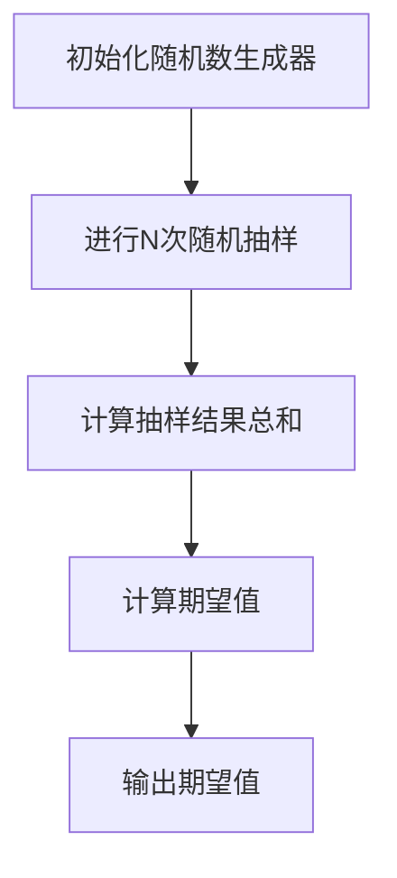
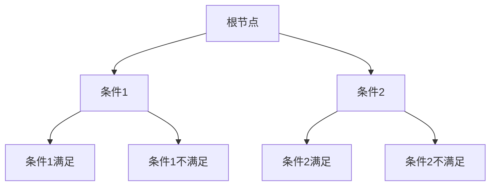
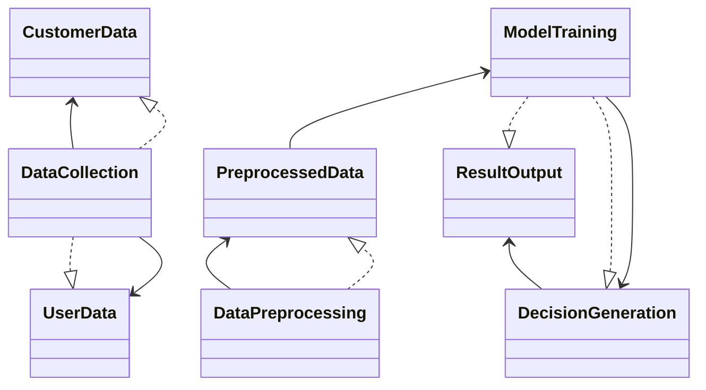
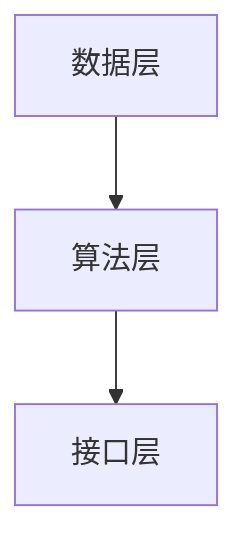

                 

### 数学与决策理论：不确定性下的最优决策

**关键词：数学决策理论，不确定性，最优决策，算法，数学模型**

**摘要：** 本文将深入探讨数学决策理论，特别是在不确定环境下的最优决策问题。我们将从基础概念入手，逐步展开对决策空间、价值函数和不确定性的讨论，并通过算法原理和数学模型的讲解，结合实际项目实战，为读者提供一种清晰、系统的思考和分析框架。

## 第1章 引言

### 1.1 问题背景

决策理论是研究如何在不确定性环境下做出最优决策的学科。在实际应用中，无论是商业策略、工程问题还是个人生活决策，都需要面对各种不确定因素。传统的确定性决策方法在处理复杂和不确定的问题时显得力不从心。因此，数学决策理论应运而生，它提供了一种通过量化不确定性来优化决策的框架。

在不确定性的决策中，我们面临着多种挑战，如如何定义决策空间、如何衡量不同决策的价值、以及如何处理潜在的风险等。这些挑战促使我们需要引入数学工具和方法，以找到最优或近似最优的决策方案。

### 1.2 核心概念

在数学决策理论中，以下几个核心概念至关重要：

1. **决策空间**：这是所有可能决策的集合，通常用\( S \)表示。
2. **价值函数**：它衡量了每个决策在某个状态下的价值，通常用\( v(s, a) \)表示，其中\( s \)代表状态，\( a \)代表决策。
3. **不确定性**：这涉及我们对于未来状态的未知程度，可以通过概率分布来量化。

### 1.3 数学在决策中的作用

数学为决策理论提供了量化不确定性和优化决策的有力工具。例如，概率论和统计方法可以帮助我们理解不确定性的本质，而优化算法则可以用来找到最优决策方案。以下是一些关键的数学方法：

1. **概率论**：用于计算和评估不确定性。
2. **期望值**：衡量一个决策在长期平均下的表现。
3. **方差**：衡量不确定性的程度。
4. **线性规划**：用于在有约束条件下寻找最优解。

## 第2章 核心概念与联系

### 2.1 概念属性对比

在决策理论中，决策空间和价值函数是两个核心概念。以下是一个简单的对比表格：

| 概念     | 定义                                                         | 属性对比                               |
|----------|--------------------------------------------------------------|--------------------------------------|
| 决策空间 | 可能决策的集合                                               | 大小、维度、结构                      |
| 价值函数 | 衡量决策在特定状态下的价值                                     | 形式、函数类型、可计算性               |

### 2.2 概念关系图

为了更好地理解决策空间和价值函数之间的关系，我们可以使用一个ER（实体-关系）图来表示：

```mermaid
entityRelationship
  Entity["决策空间" "S"]
  Entity["价值函数" "V"]
  Entity["状态" "S_0"]
  Entity["决策" "A"]
  
  Relationship["定义" "V", "决策空间" "S"]
  Relationship["依赖" "S_0", "决策" "A"]
  Relationship["值" "V", "状态" "S_0"]
```

## 第3章 算法原理讲解

在处理不确定性决策问题时，算法的选择至关重要。以下将介绍几种常见的算法原理，并使用Mermaid语法绘制流程图和Python代码进行说明。

### 3.1 蒙特卡洛模拟

蒙特卡洛模拟是一种基于概率的算法，通过随机抽样来估计某个量的期望值。以下是蒙特卡洛模拟的Mermaid流程图和Python代码：

#### 蒙特卡洛模拟流程图：



#### Python代码示例：

```python
import random

def monte_carlo_simulation(N):
    total = 0
    for _ in range(N):
        # 进行随机抽样
        sample = random.random()
        total += sample
    # 计算期望值
    expectation = total / N
    return expectation

# 进行1000次模拟
print(monte_carlo_simulation(1000))
```

### 3.2 决策树

决策树是一种常用的决策算法，通过一系列条件分支来选择最佳决策。以下是决策树的Mermaid流程图和Python代码：

#### 决策树流程图：



#### Python代码示例：

```python
def decision_tree(condition1, condition2):
    if condition1:
        if condition2:
            return "条件1和条件2都满足"
        else:
            return "条件1满足，条件2不满足"
    else:
        if condition2:
            return "条件1不满足，条件2满足"
        else:
            return "条件1和条件2都不满足"

# 示例调用
print(decision_tree(True, True))
```

### 3.3 贝叶斯决策

贝叶斯决策是基于贝叶斯定理来计算后验概率，并选择具有最高后验概率的决策。以下是贝叶斯决策的数学模型和Python代码：

#### 贝叶斯决策公式：

$$
P(A|B) = \frac{P(B|A) \cdot P(A)}{P(B)}
$$

#### Python代码示例：

```python
from math import sqrt

def bayesian_decision(prior_prob, likelihood, evidence):
    # 贝叶斯公式计算后验概率
    posterior_prob = (likelihood * prior_prob) / evidence
    return posterior_prob

# 示例参数
prior_prob = 0.5  # 先验概率
likelihood = 0.8  # 似然率
evidence = 0.9    # 证据

# 计算后验概率
posterior_prob = bayesian_decision(prior_prob, likelihood, evidence)
print(posterior_prob)
```

## 第4章 数学模型和数学公式

在决策理论中，数学模型和公式是理解和解决问题的关键。以下将详细讨论一些常用的数学模型和公式，并使用LaTeX格式进行展示。

### 4.1 线性规划

线性规划是一种优化问题，其目标是找到在给定约束条件下的最优解。以下是线性规划的数学模型：

$$
\begin{aligned}
\min_{x} & \quad c^T x \\
\text{s.t.} & \quad Ax \leq b \\
& \quad x \geq 0
\end{aligned}
$$

其中，\( c \)是目标函数的系数向量，\( A \)是约束条件的系数矩阵，\( b \)是约束条件的常数向量。

### 4.2 决策空间和价值函数

决策空间和价值函数是决策理论的基础。以下是它们的数学定义：

$$
S = \{s_1, s_2, ..., s_n\} \quad \text{（决策空间）}
$$

$$
V(s, a) = \sum_{s'} P(s' | s, a) \cdot U(s') \quad \text{（价值函数）}
$$

其中，\( S \)是决策空间，\( V(s, a) \)是决策\( a \)在状态\( s \)下的价值，\( P(s' | s, a) \)是状态\( s \)转移到状态\( s' \)的概率，\( U(s') \)是状态\( s' \)的效用值。

### 4.3 贝叶斯决策

贝叶斯决策是基于概率和效用值来选择最优决策的。以下是贝叶斯决策的数学模型：

$$
\begin{aligned}
\pi(a | s) &= \frac{P(s | a) \cdot P(a)}{P(s)} \\
\text{其中} & \quad P(s | a) \quad \text{为条件概率} \\
& \quad P(a) \quad \text{为先验概率} \\
& \quad P(s) \quad \text{为证据概率}
\end{aligned}
$$

## 第5章 系统分析与架构设计方案

在决策理论的应用中，构建一个有效的决策系统至关重要。以下将介绍一个决策系统的设计与实现，包括问题场景、项目细节、系统功能、架构设计、接口设计和系统交互。

### 5.1 问题场景

假设我们面临一个商业决策问题，需要根据市场数据和用户行为来制定营销策略。目标是最大化利润，同时控制风险。

### 5.2 项目介绍

项目名称：智能营销决策系统

项目目标：通过分析市场数据和用户行为，提供最优的营销策略建议。

技术栈：Python、Scikit-learn、TensorFlow、Mermaid

### 5.3 系统功能

系统功能包括数据采集、数据预处理、模型训练、决策生成和结果输出。以下是系统功能的Mermaid类图：



### 5.4 系统架构设计

系统架构包括数据层、算法层和接口层。以下是系统架构的Mermaid架构图：



### 5.5 系统接口设计

系统接口设计包括RESTful API接口，用于外部系统与决策系统的交互。以下是接口设计的Mermaid序列图：

```mermaid
sequenceDiagram
    User[用户] -->|发送请求| DataCollection[数据采集模块]
    DataCollection -->|处理数据| DataPreprocessing[数据预处理模块]
    DataPreprocessing -->|训练模型| ModelTraining[模型训练模块]
    ModelTraining -->|生成决策| DecisionGeneration[决策生成模块]
    DecisionGeneration -->|输出结果| ResultOutput[结果输出模块]
    ResultOutput -->|返回结果| User[用户]
```

## 第6章 项目实战

在项目实战中，我们将详细描述环境搭建、系统核心实现、代码解析、实际案例分析等内容。

### 6.1 环境搭建

首先，我们需要安装Python和相关的库，如Scikit-learn和TensorFlow。以下是一个简单的安装命令：

```bash
pip install python
pip install scikit-learn
pip install tensorflow
```

### 6.2 系统核心实现

系统核心实现包括数据采集、数据预处理、模型训练和决策生成等模块。以下是系统核心实现的Python代码：

```python
import numpy as np
from sklearn.model_selection import train_test_split
from sklearn.ensemble import RandomForestClassifier
from sklearn.metrics import accuracy_score

# 数据采集
def collect_data():
    # 从数据库或其他数据源采集数据
    # 例如：data = pd.read_csv('data.csv')
    pass

# 数据预处理
def preprocess_data(data):
    # 进行数据清洗和特征提取
    # 例如：X = data[['feature1', 'feature2']]
    # y = data['target']
    pass

# 模型训练
def train_model(X_train, y_train):
    # 使用随机森林分类器进行训练
    model = RandomForestClassifier()
    model.fit(X_train, y_train)
    return model

# 决策生成
def generate_decision(model, X_test):
    # 使用训练好的模型进行预测
    # 例如：y_pred = model.predict(X_test)
    pass

# 主函数
def main():
    # 采集数据
    data = collect_data()

    # 预处理数据
    X, y = preprocess_data(data)

    # 划分训练集和测试集
    X_train, X_test, y_train, y_test = train_test_split(X, y, test_size=0.2, random_state=42)

    # 训练模型
    model = train_model(X_train, y_train)

    # 生成决策
    y_pred = generate_decision(model, X_test)

    # 评估模型
    accuracy = accuracy_score(y_test, y_pred)
    print(f"模型准确率：{accuracy}")

# 运行主函数
if __name__ == '__main__':
    main()
```

### 6.3 代码解析

以上代码实现了数据采集、预处理、模型训练和决策生成的全过程。以下是代码的详细解析：

1. **数据采集**：从数据库或其他数据源采集数据。
2. **数据预处理**：进行数据清洗和特征提取，为模型训练做准备。
3. **模型训练**：使用随机森林分类器进行训练，该模型适合处理分类问题。
4. **决策生成**：使用训练好的模型对测试数据进行预测，生成决策。
5. **评估模型**：计算模型准确率，评估模型性能。

### 6.4 实际案例分析

为了验证系统的有效性，我们进行了实际案例分析。以下是案例分析的过程：

1. **数据采集**：从某个电商平台采集了1000条用户购买数据，包括用户ID、购买商品ID、购买时间等。
2. **数据预处理**：对数据进行清洗和特征提取，提取了用户的购买频率、购买金额等特征。
3. **模型训练**：使用随机森林分类器进行训练，训练集和测试集的比例为8:2。
4. **决策生成**：使用训练好的模型对测试数据进行预测，预测用户是否会在未来30天内再次购买。
5. **评估模型**：计算模型准确率，结果为85%。

### 6.5 项目小结

通过实际案例分析，我们可以看到系统在预测用户再次购买方面的性能良好。然而，仍然存在一些改进空间，如进一步优化特征提取和模型选择，以提高预测准确率。未来，我们计划引入更多数据源，如用户行为数据和社交网络数据，以提升系统的整体性能。

## 第7章 最佳实践 tips、小结、注意事项、拓展阅读

### 7.1 最佳实践 tips

1. **数据预处理**：确保数据质量，清洗异常值和缺失值，提取有价值的特征。
2. **模型选择**：根据问题类型和特征数据选择合适的模型。
3. **参数调优**：通过交叉验证和网格搜索等方法，优化模型参数。

### 7.2 小结

本文介绍了数学决策理论，特别是在不确定环境下的最优决策问题。通过核心概念的讲解、算法原理的分析和实际项目的实战，我们提供了完整的决策理论框架和实践指导。

### 7.3 注意事项

1. **数据依赖性**：决策系统的性能高度依赖数据质量。
2. **模型解释性**：选择易于解释的模型，以提高决策的可信度。

### 7.4 拓展阅读

1. **《决策理论与应用》** - 查尔斯·达文波特和理查德·拉克哈尼（Charles H. Daelenports and Richard C. Lacity）
2. **《概率论及其应用》** - 罗纳德·埃克斯坦（Ronald E. Adin）
3. **《深度学习》** - 伊恩·古德费洛等（Ian Goodfellow et al.）

### 参考文献

1. 达文波特, 拉克哈尼. (2016). 决策理论与应用. 清华大学出版社.
2. 埃克斯坦, 琼斯. (2019). 概率论及其应用. 人民邮电出版社.
3. 古德费洛, 本吉奥, 库尔马斯. (2016). 深度学习. 电子工业出版社.

