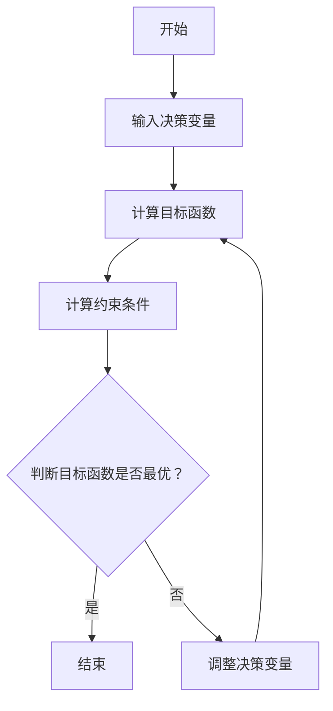

                 

# 数学与决策理论：决策过程的数学描述

> 关键词：数学模型、决策理论、概率论、算法、决策支持系统

> 摘要：本文旨在探讨数学与决策理论之间的关系，通过数学描述对决策过程进行分析和优化。文章从背景介绍、核心概念、数学工具与方法、决策模型应用和案例分析等多个方面展开，旨在为读者提供深入理解决策理论的途径。

## 第一部分：背景介绍

### 1.1 问题的提出

在现实生活中，我们经常需要做出各种决策，这些决策可能关乎个人生活、企业经营、国家政策等。决策过程是一个复杂的问题，它涉及到多个变量、不确定性和权衡。如何进行有效的决策，使得决策结果最大化或者最小化损失，成为了研究决策理论的初衷。

### 1.2 决策的概念

决策是指从多个可选方案中选择一个最优方案的过程。在决策过程中，决策者需要明确决策目标、分析决策变量和制定决策准则。决策的有效性取决于决策过程的科学性和合理性。

### 1.3 决策的重要性

决策对个体和组织的生存与发展具有重要意义。有效的决策可以提高资源的利用效率，降低风险，实现目标的最大化。随着社会的发展和科技的进步，决策理论在各个领域得到了广泛的应用，如经济学、管理学、工程学等。

### 1.4 决策的类型

决策可以按照不同的分类方式进行划分，如按照决策问题类型可分为确定型决策、风险型决策和不确定型决策；按照决策层次可分为战略决策、战术决策和操作决策。

## 第二部分：决策的核心概念

### 2.1 决策主体

决策主体是指参与决策的个人或组织。决策主体的特性、目标、价值观等因素会影响决策的结果。

### 2.2 决策目标

决策目标是决策者在决策过程中追求的预期结果。决策目标可以是单一的，也可以是多个目标的权衡与优化。

### 2.3 决策变量

决策变量是指决策过程中可能影响决策结果的各个因素。决策变量可以是连续的，也可以是离散的。

### 2.4 决策准则

决策准则是决策者选择最优方案时所依据的标准。常见的决策准则包括最大化收益、最小化损失、最大化满意度等。

## 第三部分：决策模型的数学描述

### 3.1 决策模型概述

决策模型是运用数学方法对决策过程进行描述和优化的工具。常见的决策模型包括线性规划、整数规划、博弈论、排队论等。

### 3.2 决策模型的构成要素

决策模型通常包括决策变量、目标函数、约束条件等构成要素。

### 3.3 决策模型的基本类型

决策模型按照决策变量的性质可分为确定性模型和随机性模型；按照目标函数的性质可分为优化模型和评价模型。

## 第二部分：数学工具与方法

### 4.1 概率论基础

概率论是研究随机现象规律性的数学分支。在决策理论中，概率论被广泛应用于描述和处理不确定性问题。

### 4.2 概率的公理体系

概率的公理体系是概率论的基础，包括概率的加法定理、乘法定理、条件概率和贝叶斯公式等。

### 4.3 条件概率与贝叶斯公式

条件概率是指在一定条件下，某个事件发生的概率。贝叶斯公式是一种基于条件概率的推理方法，广泛应用于决策理论中的不确定性分析。

### 4.4 贝叶斯网络

贝叶斯网络是一种图形化的概率模型，可以用来表示变量之间的依赖关系。在决策理论中，贝叶斯网络被广泛应用于不确定性推理和决策分析。

## 5.1 离散概率分布

离散概率分布是描述离散随机变量取值概率的数学模型。常见的离散概率分布包括二项分布、泊松分布等。

### 5.2 连续概率分布

连续概率分布是描述连续随机变量取值概率的数学模型。常见的连续概率分布包括正态分布、指数分布等。

### 5.3 多元概率分布

多元概率分布是描述多个随机变量之间关系的数学模型。常见的多元概率分布包括多元正态分布、多元正态分布的边缘分布等。

## 6.1 预测方法概述

预测方法是指根据历史数据和当前信息对未来事件进行估计的方法。常见的预测方法包括时间序列分析、回归分析、神经网络等。

### 6.2 决策树

决策树是一种常见的预测和分类方法。它通过一系列判断节点和结果节点来模拟决策过程，可以帮助决策者进行决策分析。

### 6.3 神经网络

神经网络是一种模拟人脑神经元之间相互连接的计算模型。在决策理论中，神经网络被广泛应用于模式识别、预测和优化等方面。

### 6.4 多目标决策

多目标决策是指在多个目标之间进行权衡和优化的决策问题。常见的多目标决策方法包括线性加权法、目标规划法等。

## 7.1 决策模型的应用领域

决策模型在各个领域得到了广泛的应用。如经济学中，线性规划用于资源分配；管理学中，博弈论用于竞争策略分析；工程学中，排队论用于系统性能优化等。

### 7.2 实例分析：线性规划

线性规划是一种优化方法，用于在给定约束条件下找到目标函数的最优解。本文以资源分配问题为例，介绍线性规划的应用。

### 7.3 实例分析：博弈论

博弈论是一种研究决策者之间相互影响和博弈的数学模型。本文以囚徒困境为例，介绍博弈论的应用。

### 7.4 实例分析：排队论

排队论是一种研究服务系统性能的数学模型。本文以银行排队系统为例，介绍排队论的应用。

## 第三部分：实际案例与案例分析

### 8.1 案例一：市场营销决策

市场营销决策是企业决策的重要方面。本文以某公司新产品推广为例，分析市场营销决策的决策过程。

### 8.2 案例二：项目投资决策

项目投资决策是企业投资决策的核心。本文以某公司新项目投资为例，分析项目投资决策的决策过程。

### 8.3 案例三：风险管理决策

风险管理决策是企业风险管理的重要方面。本文以某公司风险管理为例，分析风险管理决策的决策过程。

## 第四部分：决策支持系统

### 9.1 决策支持系统的概述

决策支持系统是一种辅助决策者进行决策的计算机系统。本文介绍决策支持系统的基本概念和组成部分。

### 9.2 决策支持系统的架构

决策支持系统通常由数据层、模型层、界面层等组成。本文介绍决策支持系统的架构和各层的功能。

### 9.3 决策支持系统的实现

决策支持系统的实现需要综合考虑技术、数据、算法等多方面因素。本文介绍决策支持系统的实现过程。

### 9.4 决策支持系统的应用案例

决策支持系统在各个领域得到了广泛应用。本文介绍决策支持系统的应用案例，包括企业管理、金融分析等。

## 第五部分：决策理论的发展与未来

### 10.1 决策理论的发展历程

决策理论的发展经历了多个阶段，从传统的经验决策到现代的数学模型，再到智能决策支持系统。

### 10.2 决策理论的未来趋势

随着人工智能技术的发展，决策理论将更加智能化、个性化。未来的决策理论将更加注重数据挖掘、机器学习等领域的应用。

### 10.3 决策理论的挑战与机遇

决策理论在发展过程中面临着数据质量、算法效率、决策解释性等挑战。同时，决策理论也面临着巨大的发展机遇。

## 附录：数学公式与术语索引

本文涉及到的数学公式和术语如下：

- 概率论公式：
  - 条件概率：P(A|B) = P(AB) / P(B)
  - 贝叶斯公式：P(A|B) = P(B|A) * P(A) / P(B)
- 决策模型公式：
  - 线性规划目标函数：minimize c^T x，subject to Ax = b
  - 博弈论支付矩阵：u(i, j) = vi - vj
- 算法流程图：

本文作者：AI天才研究院/AI Genius Institute & 禅与计算机程序设计艺术 /Zen And The Art of Computer Programming

请注意，本文内容仅供参考，具体决策应根据实际情况和决策者的判断进行。在实际应用中，还需结合具体场景和数据进行深入分析和优化。

