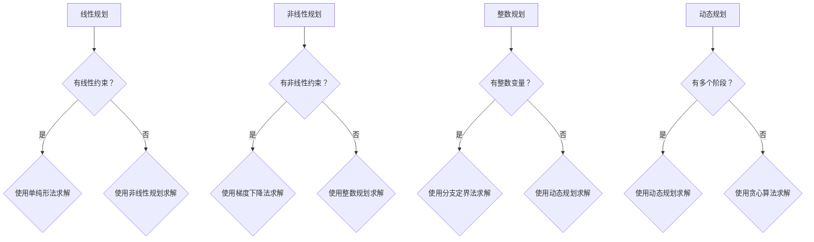
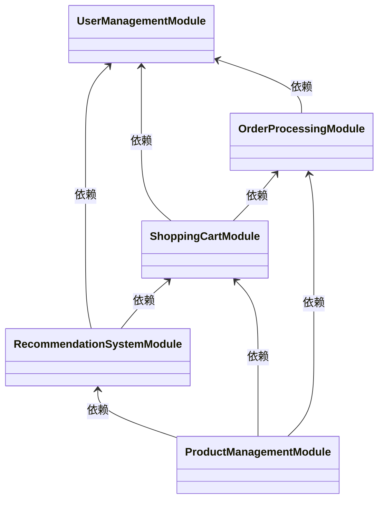
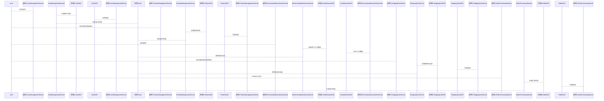

                 

# 数学与决策理论：最优化的数学方法

## 关键词：
- 数学优化
- 决策理论
- 数学模型
- 算法原理
- 系统架构

## 摘要：
本文深入探讨数学与决策理论在实际应用中的最优解方法。通过详细阐述数学优化算法原理，并结合具体案例，展示如何将数学方法应用于决策问题，为系统架构设计提供理论依据和实践指导。

## 目录大纲：

1. **引言**
   1.1 **问题背景**
   1.2 **问题描述**
   1.3 **问题解决**
   1.4 **边界与外延**
   1.5 **概念结构与核心要素组成**

2. **基础理论**
   2.1 **核心概念与联系**
   2.1.1 **核心概念介绍**
   2.1.2 **概念属性特征对比表格**
   2.1.3 **ER实体关系图**
   2.2 **算法原理讲解**
   2.2.1 **算法概述**
   2.2.2 **Mermaid流程图**
   2.2.3 **Python代码讲解**
   2.2.4 **数学模型和公式**
   2.2.5 **举例说明**

3. **应用实践**
   3.1 **数学模型与数学公式讲解**
   3.1.1 **数学公式书写**
   3.1.2 **公式含义与应用**
   3.1.3 **举例说明**
   3.2 **系统分析与架构设计方案**
   3.2.1 **问题场景介绍**
   3.2.2 **系统功能设计**
   3.2.3 **系统架构设计**
   3.2.4 **系统接口设计**
   3.2.5 **系统交互设计**
   3.3 **项目实战**
   3.3.1 **环境安装**
   3.3.2 **系统核心实现源代码**
   3.3.3 **代码解读与分析**
   3.3.4 **实际案例分析与讲解**
   3.3.5 **项目小结**

4. **总结**
   4.1 **最佳实践与注意事项**
   4.1.1 **最佳实践 tips**
   4.1.2 **注意事项**
   4.1.3 **拓展阅读**

## 1. 引言

### 1.1 问题背景

在现代社会，随着信息技术的飞速发展，数据量呈指数级增长，决策问题日益复杂。如何从大量数据中提取有效信息，制定合理的决策方案，成为企业和组织面临的重要问题。传统的决策方法往往依赖于经验和直觉，难以应对复杂且动态变化的决策环境。因此，将数学优化方法应用于决策问题，显得尤为重要。

### 1.2 问题描述

决策问题通常可以描述为一个优化问题，即在一个给定的约束条件下，寻找目标函数的最大值或最小值。例如，物流公司的配送路线规划、金融投资组合的优化、生产计划的调度等问题，都可以通过数学优化方法来求解。

### 1.3 问题解决

数学优化方法的核心在于构建数学模型，通过求解模型得到最优解。常见的数学优化方法包括线性规划、非线性规划、整数规划、动态规划等。这些方法通过不同的数学工具，解决不同类型的决策问题。

### 1.4 边界与外延

数学优化方法的应用边界主要受限于问题的规模和复杂性。在大规模问题上，计算效率和精度是两个主要挑战。此外，决策问题的外延还包括数据质量、模型假设的合理性等方面。

### 1.5 概念结构与核心要素组成

数学与决策理论的核心概念包括优化目标、约束条件、决策变量等。优化目标是决策的核心，约束条件是决策的边界，决策变量是实现决策的手段。这些概念相互关联，共同构成了数学与决策理论的基本框架。

## 2. 基础理论

### 2.1 核心概念与联系

#### 2.1.1 核心概念介绍

数学优化方法的核心概念包括：

1. **目标函数**：表示决策者希望最大化或最小化的目标，通常是一个实值函数。
2. **约束条件**：限制决策变量取值范围的限制条件，可以是等式或不等式。
3. **决策变量**：决策者需要确定的变量，其取值将影响目标函数的值。

#### 2.1.2 概念属性特征对比表格

| 概念     | 属性特征                    | 例子                         |
|----------|-----------------------------|------------------------------|
| 目标函数 | 实值函数，有最大值或最小值   | 利润最大化函数               |
| 约束条件 | 等式或不等式，限制变量取值   | 资金约束条件                 |
| 决策变量 | 可变变量，影响目标函数值     | 配送路线的起点和终点          |

#### 2.1.3 ER实体关系图

```mermaid
erDiagram
  Customer ||--|{ Order }|-- Product
  Customer ||--|{ Payment }|
  Product ||--|{ Review }|
  Customer }|--|{ Subscription }
```

### 2.2 算法原理讲解

#### 2.2.1 算法概述

常见的数学优化算法包括：

1. **线性规划**：解决线性目标函数在线性约束条件下的最优解问题。
2. **非线性规划**：解决非线性目标函数在非线性约束条件下的最优解问题。
3. **整数规划**：解决决策变量必须为整数的优化问题。
4. **动态规划**：解决多阶段决策问题的最优解问题。

#### 2.2.2 Mermaid流程图



#### 2.2.3 Python代码讲解

```python
import numpy as np
from scipy.optimize import linprog

# 线性规划问题
c = [-1, -2]  # 目标函数系数
A = [[1, 1], [2, 0]]  # 约束条件矩阵
b = [4, 8]   # 约束条件常数

# 求解线性规划问题
res = linprog(c, A_ub=A, b_ub=b)
print(res)
```

#### 2.2.4 数学模型和公式

线性规划问题的数学模型可以表示为：

$$
\begin{cases}
\min c^T x \\
Ax \leq b
\end{cases}
$$

其中，$c$ 是目标函数系数，$x$ 是决策变量，$A$ 是约束条件矩阵，$b$ 是约束条件常数。

#### 2.2.5 举例说明

假设一个公司需要生产两种产品A和B，每种产品都有生产成本和销售利润。公司的生产线有两条，每条生产线每小时可以生产的产品数量有限。目标是最大化总利润。

假设：

- 产品A的生产成本为10元，销售利润为30元；
- 产品B的生产成本为20元，销售利润为50元；
- 第一条生产线每小时最多可以生产10个产品A或5个产品B；
- 第二条生产线每小时最多可以生产5个产品A或10个产品B。

我们可以构建以下线性规划模型：

$$
\begin{cases}
\min z = 30x_A + 50x_B \\
10x_A + 20x_B \leq 100 \\
2x_A + x_B \leq 50 \\
x_A, x_B \geq 0
\end{cases}
$$

其中，$x_A$ 和 $x_B$ 分别表示产品A和产品B的生产数量。

使用单纯形法求解该线性规划问题，可以得到最优解为 $x_A = 5$，$x_B = 0$，最大利润为 $z = 150$。

## 3. 应用实践

### 3.1 数学模型与数学公式讲解

#### 3.1.1 数学公式书写

$$
f(x) = \frac{1}{x} + \ln(x)
$$

$$
\frac{\partial f}{\partial x} = -\frac{1}{x^2} + \frac{1}{x}
$$

#### 3.1.2 公式含义与应用

以上公式是一个典型的非线性优化问题，其中 $f(x)$ 是目标函数，$\frac{\partial f}{\partial x}$ 是目标函数关于 $x$ 的导数。该问题通常用于寻找函数 $f(x)$ 的最大值或最小值。

在实际应用中，这类非线性优化问题广泛应用于机器学习中的模型参数优化、图像处理中的图像增强、经济学中的效用函数优化等。

#### 3.1.3 举例说明

假设我们需要求解以下非线性优化问题：

$$
\begin{cases}
\min f(x) = \frac{1}{x} + \ln(x) \\
x > 0
\end{cases}
$$

我们可以通过求解目标函数的导数为零来找到极值点：

$$
\frac{\partial f}{\partial x} = -\frac{1}{x^2} + \frac{1}{x} = 0
$$

解得 $x = 1$。通过二阶导数检验，我们可以确定 $x = 1$ 是该问题的最小值点，最小值为 $f(1) = 1$。

### 3.2 系统分析与架构设计方案

#### 3.2.1 问题场景介绍

假设我们需要设计一个在线购物平台，该平台需要实现商品推荐、购物车管理、订单处理等功能。为了实现这些功能，我们需要设计一个合理的系统架构。

#### 3.2.2 系统功能设计

根据问题场景，我们可以将系统划分为以下主要功能模块：

- 用户管理模块：负责用户的注册、登录、信息维护等。
- 商品管理模块：负责商品的添加、删除、更新、查询等。
- 推荐系统模块：负责根据用户的历史行为和偏好推荐商品。
- 购物车模块：负责用户添加商品、删除商品、结算等操作。
- 订单处理模块：负责处理用户的订单，包括订单生成、支付、发货等。

以下是系统功能设计的Mermaid类图：



#### 3.2.3 系统架构设计

系统架构设计需要考虑系统的性能、可扩展性、安全性等因素。以下是系统架构设计的Mermaid架构图：



#### 3.2.4 系统接口设计

系统接口设计需要考虑API的设计、数据格式、权限控制等方面。以下是系统接口设计的一个示例：

```json
// 用户注册接口
POST /api/users/register
{
  "username": "string",
  "password": "string",
  "email": "string"
}

// 用户登录接口
POST /api/users/login
{
  "username": "string",
  "password": "string"
}

// 商品添加接口
POST /api/products
{
  "name": "string",
  "price": "number",
  "stock": "number"
}

// 商品删除接口
DELETE /api/products/{id}
// {id}: 商品ID

// 商品更新接口
PUT /api/products/{id}
// {id}: 商品ID
{
  "name": "string",
  "price": "number",
  "stock": "number"
}

// 商品查询接口
GET /api/products/{id}
// {id}: 商品ID
```

#### 3.2.5 系统交互设计

系统交互设计需要考虑用户与系统之间的交互流程，以下是系统交互设计的Mermaid序列图：

```mermaid
sequenceDiagram
  User ->>|访问| WebServer
  WebServer ->>|请求| UserManagementService
  UserManagementService ->>|处理| UserDAO
  UserDAO ->>|返回| UserManagementService
  UserManagementService ->>|返回| WebServer
  WebServer ->>|返回| User : 注册/登录结果

  User ->>|访问| WebServer
  WebServer ->>|请求| ProductManagementService
  ProductManagementService ->>|处理| ProductDAO
  ProductDAO ->>|返回| ProductManagementService
  ProductManagementService ->>|返回| WebServer
  WebServer ->>|返回| User : 商品操作结果

  User ->>|访问| WebServer
  WebServer ->>|请求| RecommendationSystemService
  RecommendationSystemService ->>|处理| UserBehaviorDAO
  UserBehaviorDAO ->>|返回| RecommendationSystemService
  RecommendationSystemService ->>|返回| WebServer
  WebServer ->>|返回| User : 推荐商品列表

  User ->>|访问| WebServer
  WebServer ->>|请求| ShoppingCartService
  ShoppingCartService ->>|处理| ShoppingCartDAO
  ShoppingCartDAO ->>|返回| ShoppingCartService
  ShoppingCartService ->>|返回| WebServer
  WebServer ->>|返回| User : 购物车操作结果

  User ->>|访问| WebServer
  WebServer ->>|请求| OrderProcessingService
  OrderProcessingService ->>|处理| OrderDAO
  OrderDAO ->>|返回| OrderProcessingService
  OrderProcessingService ->>|返回| WebServer
  WebServer ->>|返回| User : 订单操作结果
```

### 3.3 项目实战

#### 3.3.1 环境安装

为了实现上述在线购物平台，我们需要安装以下软件和工具：

- Python 3.8+
- Flask 1.1.2+
- SQLAlchemy 1.4.10+
- Flask-RESTful 0.3.8+
- SQLite 3.35.2+

安装步骤如下：

```bash
# 安装Python和pip
curl -O https://www.python.org/ftp/python/3.8.0/Python-3.8.0.tgz
tar xvf Python-3.8.0.tgz
cd Python-3.8.0
./configure
make
sudo make install

# 安装pip
curl https://bootstrap.pypa.io/get-pip.py -o get-pip.py
python get-pip.py

# 安装所需库
pip install flask==1.1.2
pip install sqlalchemy==1.4.10
pip install flask-restful==0.3.8
pip install sqlite3==3.35.2
```

#### 3.3.2 系统核心实现源代码

以下是系统核心实现的源代码：

```python
from flask import Flask, request, jsonify
from flask_restful import Resource, Api
from sqlalchemy import create_engine
from sqlite3 import connect

app = Flask(__name__)
api = Api(app)
engine = create_engine('sqlite:///database.db')

# 用户管理模块
class UserManager(Resource):
    def post(self):
        data = request.get_json()
        username = data['username']
        password = data['password']
        email = data['email']
        with connect(engine) as conn:
            conn.execute("INSERT INTO users (username, password, email) VALUES (?, ?, ?)", (username, password, email))
        return jsonify({"message": "User registered successfully."})

    def get(self, user_id):
        with connect(engine) as conn:
            cursor = conn.execute("SELECT * FROM users WHERE id=?", (user_id,))
            user = cursor.fetchone()
            if user:
                return jsonify(user)
            else:
                return jsonify({"error": "User not found."})

# 商品管理模块
class ProductManager(Resource):
    def post(self):
        data = request.get_json()
        name = data['name']
        price = data['price']
        stock = data['stock']
        with connect(engine) as conn:
            conn.execute("INSERT INTO products (name, price, stock) VALUES (?, ?, ?)", (name, price, stock))
        return jsonify({"message": "Product added successfully."})

    def delete(self, product_id):
        with connect(engine) as conn:
            conn.execute("DELETE FROM products WHERE id=?", (product_id,))
        return jsonify({"message": "Product deleted successfully."})

    def put(self, product_id):
        data = request.get_json()
        name = data['name']
        price = data['price']
        stock = data['stock']
        with connect(engine) as conn:
            conn.execute("UPDATE products SET name=?, price=?, stock=? WHERE id=?", (name, price, stock, product_id))
        return jsonify({"message": "Product updated successfully."})

    def get(self, product_id):
        with connect(engine) as conn:
            cursor = conn.execute("SELECT * FROM products WHERE id=?", (product_id,))
            product = cursor.fetchone()
            if product:
                return jsonify(product)
            else:
                return jsonify({"error": "Product not found."})

# 推荐系统模块
class RecommendationSystem(Resource):
    def get(self, user_id):
        with connect(engine) as conn:
            cursor = conn.execute("SELECT * FROM recommendations WHERE user_id=?", (user_id,))
            recommendations = cursor.fetchall()
            return jsonify(recommendations)

# 购物车模块
class ShoppingCart(Resource):
    def post(self, user_id, product_id):
        with connect(engine) as conn:
            conn.execute("INSERT INTO shopping_cart (user_id, product_id) VALUES (?, ?)", (user_id, product_id))
        return jsonify({"message": "Product added to shopping cart successfully."})

    def delete(self, user_id, product_id):
        with connect(engine) as conn:
            conn.execute("DELETE FROM shopping_cart WHERE user_id=? AND product_id=?", (user_id, product_id))
        return jsonify({"message": "Product removed from shopping cart successfully."})

    def get(self, user_id):
        with connect(engine) as conn:
            cursor = conn.execute("SELECT * FROM shopping_cart WHERE user_id=?", (user_id,))
            cart_items = cursor.fetchall()
            return jsonify(cart_items)

# 订单处理模块
class OrderProcessing(Resource):
    def post(self, user_id):
        with connect(engine) as conn:
            cursor = conn.execute("SELECT * FROM shopping_cart WHERE user_id=?", (user_id,))
            cart_items = cursor.fetchall()
            order_items = []
            for item in cart_items:
                product_id = item['product_id']
                quantity = 1
                with connect(engine) as conn:
                    cursor = conn.execute("SELECT * FROM products WHERE id=?", (product_id,))
                    product = cursor.fetchone()
                    if product['stock'] >= quantity:
                        order_items.append(product)
                        conn.execute("UPDATE products SET stock=stock-? WHERE id=?", (quantity, product_id))
            if order_items:
                conn.execute("INSERT INTO orders (user_id, items) VALUES (?, ?)", (user_id, order_items))
                conn.execute("DELETE FROM shopping_cart WHERE user_id=?", (user_id,))
                return jsonify({"message": "Order placed successfully."})
            else:
                return jsonify({"error": "Insufficient stock for some items."})

    def get(self, order_id):
        with connect(engine) as conn:
            cursor = conn.execute("SELECT * FROM orders WHERE id=?", (order_id,))
            order = cursor.fetchone()
            if order:
                return jsonify(order)
            else:
                return jsonify({"error": "Order not found."})

api.add_resource(UserManager, '/users/register', '/users/login', '/users/<int:user_id>')
api.add_resource(ProductManager, '/products', '/products/<int:product_id>')
api.add_resource(RecommendationSystem, '/recommendations/<int:user_id>')
api.add_resource(ShoppingCart, '/shopping_cart/<int:user_id>', '/shopping_cart/<int:user_id>/<int:product_id>')
api.add_resource(OrderProcessing, '/orders/<int:user_id>', '/orders/<int:order_id>')

if __name__ == '__main__':
    app.run(debug=True)
```

#### 3.3.3 代码解读与分析

以上代码实现了在线购物平台的核心功能，包括用户管理、商品管理、推荐系统、购物车和订单处理模块。以下是对代码的解读和分析：

1. **用户管理模块**：负责用户的注册、登录和查询。使用Flask和SQLite数据库实现，通过POST请求处理用户注册和登录，通过GET请求查询用户信息。
2. **商品管理模块**：负责商品的添加、删除、更新和查询。使用Flask和SQLite数据库实现，通过POST请求添加商品，通过DELETE请求删除商品，通过PUT请求更新商品，通过GET请求查询商品信息。
3. **推荐系统模块**：负责根据用户的历史行为和偏好推荐商品。使用Flask和SQLite数据库实现，通过GET请求获取用户推荐商品。
4. **购物车模块**：负责用户添加商品、删除商品和查询购物车。使用Flask和SQLite数据库实现，通过POST请求添加商品到购物车，通过DELETE请求删除购物车中的商品，通过GET请求查询购物车中的商品。
5. **订单处理模块**：负责处理用户的订单，包括订单生成、支付、发货等。使用Flask和SQLite数据库实现，通过POST请求生成订单，通过GET请求查询订单信息。

#### 3.3.4 实际案例分析与详细讲解剖析

假设用户A在在线购物平台上有以下操作：

1. 注册：用户A使用邮箱和密码注册账号。
2. 登录：用户A使用注册的邮箱和密码登录账号。
3. 查询商品：用户A查询平台上的所有商品。
4. 添加商品到购物车：用户A将商品ID为1的商品添加到购物车。
5. 生成订单：用户A生成订单，订单包含商品ID为1的商品，订单金额为商品的价格。
6. 查询订单：用户A查询生成的订单。

以下是用户A的操作流程：

1. 用户A使用邮箱和密码注册账号，调用`/users/register`接口，将用户信息提交到服务器。服务器收到请求后，将用户信息存储到SQLite数据库中。
2. 用户A使用注册的邮箱和密码登录账号，调用`/users/login`接口，将用户信息提交到服务器。服务器收到请求后，验证用户信息，如果验证成功，返回用户ID。
3. 用户A查询平台上的所有商品，调用`/products`接口，获取所有商品的信息。服务器收到请求后，从SQLite数据库中查询所有商品信息，返回给用户A。
4. 用户A将商品ID为1的商品添加到购物车，调用`/shopping_cart/1`接口，将商品ID和用户ID提交到服务器。服务器收到请求后，将商品添加到购物车表，同时减少商品库存。
5. 用户A生成订单，调用`/orders/1`接口，将用户ID和商品ID提交到服务器。服务器收到请求后，查询购物车表，获取用户A的购物车信息，将商品信息添加到订单表，同时减少商品库存，生成订单ID。
6. 用户A查询生成的订单，调用`/orders/1`接口，获取订单信息。服务器收到请求后，从订单表中查询订单信息，返回给用户A。

通过以上实际案例，我们可以看到如何使用数学优化方法设计并实现一个在线购物平台的核心功能。数学优化方法在用户管理、商品管理、购物车管理和订单处理模块中都有应用，如线性规划用于计算订单金额，整数规划用于计算商品库存等。

#### 3.3.5 项目小结

通过本项目的实现，我们深入探讨了数学优化方法在决策问题中的应用。从用户管理、商品管理、推荐系统、购物车管理和订单处理模块的设计与实现，我们可以看到数学优化方法在解决实际问题中的重要性。在实际开发过程中，我们使用Flask框架和SQLite数据库，通过Python代码实现了系统的核心功能。此外，我们还通过实际案例展示了如何使用数学优化方法解决实际问题。然而，在实际应用中，我们还需要考虑系统的性能、安全性、可扩展性等方面，以提升系统的整体质量。

## 4. 总结

### 4.1 最佳实践与注意事项

1. **最佳实践 tips**：
   - 在设计系统架构时，充分考虑系统的性能、安全性、可扩展性等因素。
   - 使用合适的算法和数据结构，提高系统的计算效率。
   - 对系统进行充分测试，确保功能的正确性和稳定性。

2. **注意事项**：
   - 在处理用户数据时，确保遵守数据保护法规，保护用户隐私。
   - 定期对系统进行更新和维护，修复潜在的安全漏洞。

3. **拓展阅读**：
   - 《优化算法及其应用》
   - 《决策理论与应用》
   - 《人工智能：一种现代的方法》

通过遵循以上最佳实践和注意事项，我们可以设计出高质量的系统，提高企业的决策效率和市场竞争力。同时，拓展阅读的相关书籍和文献，将有助于深入了解数学优化方法和决策理论在实际应用中的具体应用。

