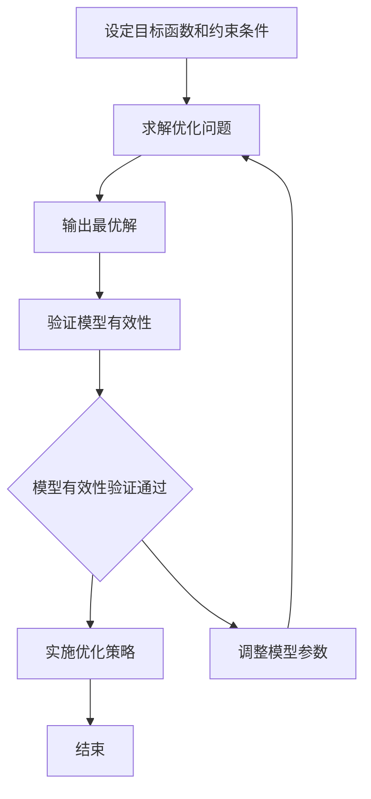
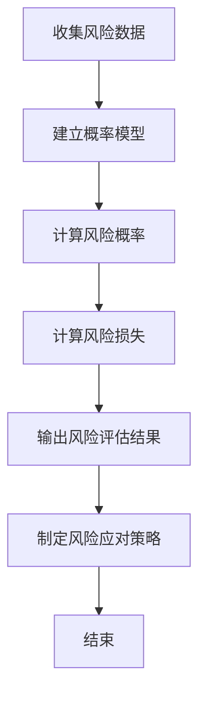

                 

### 《数学与创新管理：创新过程的数学建模》

#### 关键词：数学建模、创新管理、创新过程、风险管理、资源配置、流程优化

> 摘要：本文旨在探讨数学建模在创新管理中的应用，通过解析创新过程的基本概念、数学模型构建及应用案例，深入剖析创新决策和风险管理的数学建模方法，探讨资源配置和流程优化的数学模型，为企业管理者提供创新的数学工具和方法，以提高创新管理效率。

### 目录大纲

**《数学与创新管理：创新过程的数学建模》**

----------------------------------------------------------------

# 第一部分：引言

## 1. 引言

### 1.1 数学与创新管理的结合

数学作为一门基础学科，不仅在自然科学、工程技术等领域发挥着重要作用，也逐渐渗透到管理领域，成为创新管理的重要工具。数学建模为创新管理提供了定量分析和决策支持，使得管理者能够更科学地应对复杂多变的市场环境。

### 1.2 创新过程与数学建模的关系

创新过程是一个复杂的多阶段动态过程，涉及多个环节和因素。数学建模通过对创新过程进行定量描述，可以帮助管理者更好地理解创新过程，提高创新效率和效果。

### 1.3 书籍结构安排

本文将分为八个部分，分别探讨创新过程的数学建模、创新决策的数学建模、风险管理的数学建模、资源配置的数学建模、创新流程优化的数学建模等内容，旨在为企业管理者提供全面的创新管理数学工具和方法。

## 2. 数学与创新管理概述

### 2.1 数学在管理中的重要性

数学在管理中的应用已得到广泛认可，特别是在决策分析、预测分析、风险评估等方面。数学建模为管理者提供了一种系统化、定量化的思维方式，有助于提高决策的科学性和准确性。

### 2.2 创新管理的概念与特征

创新管理是指企业为了实现可持续发展，通过组织、管理、激励等手段，推动创新活动的过程。创新管理具有创造性、风险性、不确定性和动态性等特征。

### 2.3 数学建模在创新管理中的应用

数学建模在创新管理中的应用主要体现在创新过程建模、创新决策建模、风险管理建模、资源配置建模和流程优化建模等方面。

## 3. 创新过程的数学建模

### 3.1 创新过程的基本概念

创新过程是指从创意的产生到产品或服务投入市场的全过程。创新过程可以分为创意识别、创意筛选、概念开发、商业分析、产品开发、市场导入和商业运行等阶段。

### 3.2 创新过程的数学模型构建

创新过程的数学建模主要通过建立创新过程的动态模型和决策模型来实现。动态模型可以描述创新过程的阶段转换和影响因素，决策模型则可以帮助管理者进行创新决策。

### 3.3 数学模型在创新管理中的应用案例

本文将通过案例分析，介绍创新过程的数学建模方法在企业管理中的应用。

## 4. 创新决策的数学建模

### 4.1 创新决策的概念与类型

创新决策是指企业在创新过程中，根据创新目标、资源条件、市场环境等因素，选择最优创新方案的过程。创新决策可以分为新产品开发决策、新技术应用决策、新市场开拓决策等类型。

### 4.2 创新决策的数学模型

创新决策的数学建模主要通过建立多目标优化模型、风险决策模型等来实现。多目标优化模型可以帮助企业在资源有限的情况下，选择最优的创新方案，风险决策模型则可以帮助企业评估创新方案的风险。

### 4.3 创新决策案例分析

本文将通过案例分析，介绍创新决策的数学建模方法在企业管理中的应用。

## 5. 风险管理的数学建模

### 5.1 风险管理的概念与意义

风险管理是指企业在创新过程中，识别、评估、控制和管理风险的过程。有效的风险管理可以提高企业的抗风险能力，降低创新失败的风险。

### 5.2 风险管理的数学模型

风险管理的数学建模主要通过建立风险评估模型、风险决策模型等来实现。风险评估模型可以帮助企业评估创新项目的风险，风险决策模型则可以帮助企业在面对风险时做出最优决策。

### 5.3 风险管理案例分析

本文将通过案例分析，介绍风险管理的数学建模方法在企业管理中的应用。

## 6. 资源配置的数学建模

### 6.1 资源配置的概念与挑战

资源配置是指企业在创新过程中，合理分配和利用资源的过程。资源配置面临资源有限、需求多样化、竞争激烈等挑战。

### 6.2 资源配置的数学模型

资源配置的数学建模主要通过建立资源分配模型、优化模型等来实现。资源分配模型可以帮助企业合理分配资源，优化模型则可以帮助企业提高资源利用效率。

### 6.3 资源配置案例分析

本文将通过案例分析，介绍资源配置的数学建模方法在企业管理中的应用。

## 7. 创新流程优化的数学建模

### 7.1 创新流程优化的概念与目的

创新流程优化是指企业在创新过程中，通过改进流程、提高效率、降低成本等手段，实现创新过程的最优化。

### 7.2 创新流程优化的数学模型

创新流程优化的数学建模主要通过建立流程仿真模型、优化模型等来实现。流程仿真模型可以帮助企业模拟创新过程，优化模型则可以帮助企业找到最优的创新流程。

### 7.3 创新流程优化案例分析

本文将通过案例分析，介绍创新流程优化的数学建模方法在企业管理中的应用。

## 8. 结论与展望

### 8.1 主要研究结论

本文通过分析数学建模在创新管理中的应用，得出以下结论：

1. 数学建模为创新管理提供了定量分析和决策支持，有助于提高创新效率和效果。
2. 创新决策、风险管理、资源配置和流程优化等环节的数学建模方法具有实用价值。
3. 数学建模方法在企业管理中的应用案例丰富，有助于企业实现创新管理。

### 8.2 创新管理数学建模的未来发展方向

未来创新管理数学建模的发展方向包括：

1. 继续探索和开发新的数学建模方法，提高数学建模的精度和实用性。
2. 加强数学建模与实际管理问题的结合，提高数学建模的应用价值。
3. 推广数学建模在创新管理中的应用，提高企业管理者的数学素养。

### 8.3 对管理实践的启示

企业管理者应充分认识到数学建模在创新管理中的重要性，主动学习和掌握数学建模方法，结合企业实际，积极探索和运用数学建模工具，以提高创新管理水平和企业竞争力。

----------------------------------------------------------------

### 第一部分：引言

#### 1. 引言

在当今快速变化和高度竞争的商业环境中，创新已成为企业生存和发展的关键驱动力。然而，创新过程复杂且充满不确定性，如何有效地管理和推动创新成为了企业领导者面临的重大挑战。在这一背景下，数学建模作为一种强有力的工具，逐渐在创新管理领域崭露头角。本文旨在探讨数学建模在创新管理中的应用，通过深入分析创新过程、创新决策、风险管理、资源配置和流程优化等方面的数学建模方法，为企业管理者提供创新的视角和实用的工具。

#### 1.1 数学与创新管理的结合

数学作为一门严谨的学科，具有高度的抽象性和逻辑性，能够帮助管理者在复杂多变的环境中找到规律性和确定性。创新管理涉及众多不确定性和复杂因素，如市场需求、技术进步、竞争态势等，这些因素的交织使得创新管理过程充满挑战。数学建模为管理者提供了一种系统化和量化的分析工具，通过建立数学模型，可以将创新过程中的不确定性转化为可量化的指标，从而帮助管理者更好地理解和管理创新过程。

#### 1.2 创新过程与数学建模的关系

创新过程通常包括创意的产生、筛选、开发、测试和市场投放等多个阶段。每个阶段都涉及不同的决策点和复杂因素。数学建模可以帮助管理者对创新过程进行定量描述，从而更准确地把握创新过程中的关键环节和影响因素。例如，通过建立创意筛选模型，管理者可以评估不同创意的创新潜力，选择最具市场前景的创新方向；通过建立产品开发模型，管理者可以预测产品开发的时间和成本，从而优化资源分配。

#### 1.3 书籍结构安排

本文将分为八个主要部分，每个部分都专注于创新管理的不同方面，并详细介绍数学建模的应用。第一部分是引言，介绍了本文的研究背景、目的和结构。第二部分将概述数学和创新管理的基本概念，探讨数学在管理中的重要性。接下来，第三部分将详细讨论创新过程及其数学建模方法。第四部分将探讨创新决策的数学建模，分析如何通过数学模型优化创新决策过程。第五部分将介绍风险管理的数学建模，探讨如何量化和管理创新过程中的风险。第六部分将关注资源配置的数学建模，探讨如何有效分配和利用创新过程中的资源。第七部分将探讨创新流程优化的数学建模，分析如何通过优化流程提高创新效率。最后，第八部分将总结本文的主要结论，并对未来研究方向和管理实践提出建议。

通过这样的结构安排，本文旨在为企业管理者提供一套完整的创新管理数学工具和方法，帮助他们更好地理解和应对创新过程中的各种挑战，从而实现持续的创新和竞争优势。

#### 2. 数学与创新管理概述

#### 2.1 数学在管理中的重要性

数学在管理领域的应用具有深远的影响，尤其是在决策分析和优化方面。管理本质上是一种决策过程，而数学作为一种高度抽象和精确的工具，能够为决策提供强有力的支持。通过数学建模，管理者可以将复杂的管理问题转化为数学问题，进而运用数学方法进行求解和分析。这不仅提高了决策的准确性，还增强了决策的透明度和科学性。

首先，数学在决策分析中发挥着核心作用。管理者经常需要面对多个目标、约束和不确定性因素，而这些因素往往难以用直观的方法进行处理。通过数学建模，管理者可以将这些因素量化，从而在多目标优化、风险分析和敏感性分析等方面获得更为精准的决策支持。例如，线性规划、整数规划、非线性规划等数学方法被广泛应用于资源分配、成本控制和利润最大化等管理问题中。

其次，数学在优化问题中具有显著优势。优化问题涉及寻找最优解的问题，这是管理中常见且关键的问题。无论是生产计划、库存管理，还是供应链优化、市场定价策略，数学优化方法都可以帮助管理者找到最优解决方案。线性规划、动态规划、启发式算法等数学工具，通过构建数学模型并求解，能够有效提高管理效率和效益。

此外，数学在风险分析和预测方面也具有重要作用。在创新管理中，风险无处不在，无论是技术风险、市场风险，还是运营风险，管理者都需要进行有效的风险评估和应对。数学工具，如概率论、随机过程、蒙特卡罗模拟等，可以帮助管理者量化风险，评估风险的概率分布，并制定相应的风险应对策略。通过这些方法，管理者可以更准确地预测未来可能发生的情况，从而提前做好准备，减少损失。

总的来说，数学在管理中的应用不仅提高了决策的精度和效率，还为企业带来了显著的经济效益和竞争优势。通过数学建模，管理者能够更好地理解和管理复杂的管理问题，从而实现企业的持续发展和创新。数学作为管理领域的基石，其重要性日益凸显，为管理者提供了强大的分析和决策工具。

#### 2.2 创新管理的概念与特征

创新管理是指企业通过系统化、持续性的管理方法和手段，推动创新活动以实现可持续发展的过程。创新管理不仅包括技术创新，还涵盖商业模式创新、组织创新等多个维度。其核心在于激发员工的创造力，优化创新流程，确保创新成果能够有效转化为商业价值。

创新管理的特征主要体现在以下几个方面：

1. **创造性**：创新管理强调突破传统思维，寻找新的解决方案和方法。这要求企业具备开放的思维方式，鼓励员工大胆尝试和实验，从而推动创新。

2. **风险性**：创新过程中存在诸多不确定性和风险，如技术风险、市场风险、财务风险等。创新管理需要企业在承担一定风险的同时，能够有效识别、评估和控制这些风险，从而保障创新活动的顺利进行。

3. **不确定性**：创新管理面对的是一个高度不确定的环境。市场需求、技术进步、竞争态势等外部因素不断变化，这使得创新管理过程充满变数。通过数学建模，管理者可以在不确定性中寻找规律，为决策提供依据。

4. **动态性**：创新管理是一个动态调整和优化的过程。随着创新活动的推进，企业需要不断调整策略和资源分配，以适应外部环境和内部需求的变化。数学建模可以帮助管理者实时监测和创新过程，及时调整策略，提高创新效率。

#### 2.3 数学建模在创新管理中的应用

数学建模在创新管理中具有广泛的应用，主要体现在以下几个方面：

1. **创新过程的建模**：数学建模可以描述创新过程的各个阶段和关键环节，如创意的产生、筛选、开发、测试和市场导入。通过建立创新过程模型，管理者可以更清晰地理解创新过程的动态性和复杂性，从而优化创新流程，提高创新效率。

2. **创新决策的建模**：创新决策涉及多个目标和约束条件，如资源限制、市场潜力、技术可行性等。通过数学建模，管理者可以建立多目标优化模型，综合评估不同创新方案的优劣，选择最优的创新路径。

3. **风险管理的建模**：创新过程中存在多种风险，如技术风险、市场风险、财务风险等。通过数学建模，管理者可以量化风险，评估风险的概率和影响，制定有效的风险应对策略。

4. **资源配置的建模**：创新过程中需要大量的资源投入，包括人力、资金、设备等。通过数学建模，管理者可以优化资源配置，确保资源能够得到最有效的利用，提高创新项目的成功率。

5. **流程优化的建模**：创新流程的优化是提高创新效率的关键。通过数学建模，管理者可以分析现有流程的瓶颈和改进空间，设计更高效的创新流程，减少浪费，提高产出。

总之，数学建模为创新管理提供了系统化、量化的分析工具，帮助管理者更好地应对创新过程中的各种挑战，提高创新效率和效果。随着数学建模技术的不断发展和完善，其在创新管理中的应用前景将更加广阔。

### 3. 创新过程的数学建模

#### 3.1 创新过程的基本概念

创新过程是指企业或个人通过创造、开发和应用新的想法、技术或商业模式，从而创造出新的产品、服务或业务模式的过程。这一过程通常包括多个阶段，每个阶段都有特定的目标和任务。以下是创新过程的主要阶段：

1. **创意识别**：这是创新过程的起点，主要是通过市场调研、用户反馈、头脑风暴等方式，收集和识别有潜力的创意。在这一阶段，关键是挖掘用户需求和市场机会。

2. **创意筛选**：根据创意的创新性、可行性、市场前景等因素，对收集到的创意进行筛选，选择最有潜力的创意进行进一步开发。

3. **概念开发**：在筛选出的创意基础上，进一步进行详细的市场研究和技术分析，制定详细的项目计划，包括目标市场、产品功能、技术方案等。

4. **商业分析**：对概念进行商业可行性分析，包括市场需求、成本、收益、风险等因素。这一阶段的目标是评估项目的商业潜力，为后续的产品开发提供依据。

5. **产品开发**：在商业分析通过后，进入产品开发阶段，包括技术设计、原型开发、测试和改进。这一阶段的关键是确保产品的技术可行性和市场适应性。

6. **市场导入**：产品开发完成后，进行市场推广和销售，将产品推向市场。这一阶段的目标是获取用户反馈，并根据用户反馈进行产品改进。

7. **商业运行**：产品在市场上运行，通过市场反馈不断优化产品和服务，确保产品在市场上的长期竞争力。

#### 3.2 创新过程的数学模型构建

创新过程的数学建模是将创新过程中的各个阶段和影响因素用数学符号和公式表示，从而建立一个能够定量分析和描述创新过程的模型。以下是构建创新过程数学模型的主要步骤：

1. **定义变量**：首先，需要明确创新过程中的关键变量，如创意数量、创意筛选通过率、市场潜力、开发成本、销售收益等。

2. **建立关系**：通过分析创新过程中的关系和规律，建立变量之间的数学关系。例如，可以通过回归分析、因果模型等建立变量之间的关联性。

3. **构建模型**：根据定义的变量和建立的关系，构建一个数学模型。该模型可以是线性模型、非线性模型、动态模型等，具体取决于创新过程的复杂性和需求。

4. **求解模型**：使用数学方法求解模型，获得变量之间的关系和预测结果。例如，可以通过优化算法、模拟分析等方法求解模型。

5. **验证模型**：通过实际数据验证模型的准确性和可靠性。如果模型与实际情况不符，需要调整模型参数或重新构建模型。

#### 3.3 数学模型在创新管理中的应用案例

以下是一个关于创新过程数学建模的应用案例：

假设某公司希望开发一款智能家居设备，以抢占市场先机。以下是该公司在创新过程中的数学建模方法：

1. **创意识别**：通过市场调研和用户反馈，收集到100个智能家居创意。

2. **创意筛选**：根据创意的创新性、可行性、市场前景等因素，筛选出50个有潜力的创意。

3. **概念开发**：对筛选出的50个创意进行详细分析，建立概念模型。假设每个概念模型有5个关键变量：创新性、可行性、市场潜力、技术难度、成本。

4. **商业分析**：对每个概念模型进行商业分析，计算其市场潜力、成本和收益。建立多目标优化模型，选择最佳的概念模型进行产品开发。

5. **产品开发**：选择最佳的概念模型后，进行技术设计和原型开发。建立动态模型，模拟产品开发和市场推广的过程。

6. **市场导入**：产品开发完成后，进行市场推广和销售。建立销售预测模型，预测产品的销售情况和市场份额。

7. **商业运行**：通过市场反馈，不断优化产品和服务，提高市场竞争力。

通过上述数学建模方法，该公司可以更科学地管理创新过程，提高创新效率和成功率。例如，通过优化模型，该公司可以在有限的资源下选择最优的创意和概念模型，从而提高产品的市场竞争力。同时，通过动态模型，该公司可以实时监测创新过程的进展和市场反馈，及时调整策略，确保创新过程的顺利进行。

总之，数学建模为创新管理提供了系统化、量化的分析工具，帮助管理者更好地理解和应对创新过程中的各种挑战，从而实现持续的创新和竞争优势。

#### 4. 创新决策的数学建模

#### 4.1 创新决策的概念与类型

创新决策是指企业在创新过程中，根据内外部环境、资源条件、市场需求等因素，选择最优创新方案的过程。创新决策的成功与否直接影响企业的竞争力和市场地位。创新决策可以分为以下几种类型：

1. **新产品开发决策**：企业根据市场需求，开发新的产品或服务。这类决策通常涉及产品功能设计、技术可行性、成本效益分析等多个方面。

2. **新技术应用决策**：企业通过引入新技术或改进现有技术，提升产品或服务的竞争力。这类决策需要评估新技术的研究成本、开发周期、市场潜力等因素。

3. **商业模式创新决策**：企业通过改变现有的商业模式，实现价值创造和竞争优势。这类决策涉及市场定位、客户关系管理、价值链优化等方面。

4. **战略联盟与合作决策**：企业与其他企业或研究机构合作，共同开展创新项目。这类决策需要评估合作伙伴的技术能力、市场影响力、合作风险等因素。

#### 4.2 创新决策的数学模型

创新决策的数学建模主要通过建立优化模型、决策树模型、概率模型等方法来实现，这些模型有助于管理者在复杂的市场环境中做出科学合理的决策。

1. **多目标优化模型**：在创新决策中，管理者通常需要在多个目标之间进行权衡，如成本、收益、市场占有率等。多目标优化模型通过建立目标函数和约束条件，帮助管理者找到最优的平衡点。常见的多目标优化方法包括线性规划、非线性规划、目标规划等。

2. **决策树模型**：决策树模型通过树状结构表示不同决策路径及其结果，帮助管理者评估不同决策方案的可能性和收益。决策树模型在风险分析、概率评估等方面具有显著优势。

3. **概率模型**：概率模型通过概率分布描述不同决策方案的结果和风险，帮助管理者评估不同方案的概率分布和期望收益。常见的概率模型包括贝叶斯网络、蒙特卡罗模拟等。

#### 4.3 创新决策案例分析

以下是一个关于创新决策数学建模的应用案例：

假设某电子公司计划开发一款智能手表，以拓展其智能家居产品线。以下是该公司在创新决策过程中使用的数学建模方法：

1. **市场调研**：通过市场调研，该公司收集了500名潜在用户的需求和偏好数据，包括功能需求、价格接受度、使用频率等。

2. **需求分析**：根据市场调研数据，公司确定了智能手表的6个主要功能模块：心率监测、运动跟踪、消息提醒、健康监测、天气预报、音乐播放。每个功能模块有3个不同级别的设计方案，如心率监测有基础版、标准版和高级版。

3. **成本评估**：公司对每个功能模块的设计方案进行了成本评估，包括硬件成本、软件开发成本和营销成本。

4. **收益预测**：公司根据市场调研结果，预测了不同功能模块在不同市场区域的销售量和价格。

5. **多目标优化模型**：公司建立了一个多目标优化模型，目标是最小化成本和最大化收益。模型中，成本函数包括硬件成本、软件开发成本和营销成本，收益函数包括销售收入和利润。

6. **决策树模型**：公司使用决策树模型评估不同功能模块组合的市场表现和风险。决策树模型显示了不同组合的市场占有率、风险和收益分布。

7. **概率模型**：公司使用蒙特卡罗模拟评估不同功能模块组合的概率分布和期望收益。通过多次模拟，公司得出了不同组合的期望收益和概率分布。

8. **决策分析**：根据多目标优化模型、决策树模型和概率模型的结果，公司选择了最佳的功能模块组合，并制定了详细的产品开发计划。

通过上述数学建模方法，该公司能够科学地评估不同创新方案的成本、收益和市场表现，从而做出最优的创新决策。这不仅提高了产品开发的成功率，还降低了创新过程中的风险。

总之，创新决策的数学建模为企业在复杂多变的市场环境中提供了有力的决策支持。通过建立优化模型、决策树模型和概率模型，企业能够更好地评估不同创新方案的风险和收益，提高创新决策的准确性和效率。

#### 5. 风险管理的数学建模

#### 5.1 风险管理的概念与意义

风险管理是指企业在识别、评估、监控和控制潜在风险的过程中，确保企业运营持续性和目标实现的一系列活动。创新管理中的风险管理尤为重要，因为创新活动通常伴随着较高的不确定性和风险。有效的风险管理可以帮助企业：

1. **识别潜在风险**：通过系统化的方法识别创新过程中可能面临的各种风险，包括技术风险、市场风险、财务风险、法律风险等。
2. **评估风险影响**：对识别出的风险进行量化评估，确定其对企业目标实现的可能影响，包括风险发生的概率和潜在损失。
3. **制定应对策略**：根据风险评估结果，制定相应的风险应对策略，包括风险规避、风险减轻、风险转移和风险接受等。
4. **监控风险状况**：在创新过程中持续监控风险状况，及时调整应对策略，确保企业能够迅速应对变化。

#### 5.2 风险管理的数学模型

风险管理的数学建模主要依赖于概率论、统计学和决策理论，通过建立数学模型来量化和管理风险。以下是几种常用的风险管理数学模型：

1. **概率模型**：概率模型用于评估风险事件发生的概率及其可能的结果。常见的概率模型包括贝叶斯网络和蒙特卡罗模拟。

   - **贝叶斯网络**：贝叶斯网络是一种图形化表示变量之间概率关系的模型，通过贝叶斯推理可以计算每个变量的条件概率分布，从而帮助管理者评估风险。
   - **蒙特卡罗模拟**：蒙特卡罗模拟通过模拟大量随机样本，估计风险事件的概率分布和期望损失。这种方法特别适用于复杂系统和不确定性较大的情况。

2. **风险价值模型（VaR）**：风险价值模型用于评估在一定置信水平下，特定时间内投资组合的最大可能损失。VaR模型广泛应用于金融市场和项目投资中，可以帮助企业预测和管理潜在损失。

3. **决策树模型**：决策树模型通过树状结构表示不同决策路径及其结果，帮助管理者评估不同决策方案的风险和收益。决策树模型在风险分析和多阶段决策中具有广泛的应用。

4. **蒙特卡罗决策分析**：蒙特卡罗决策分析是一种通过模拟不同决策路径及其结果的方法，帮助管理者评估不同决策方案的风险和收益。这种方法特别适用于复杂决策环境，可以通过多次模拟来提高决策的准确性。

#### 5.3 风险管理案例分析

以下是一个关于风险管理数学建模的应用案例：

假设某科技公司正在开发一款新型智能家居设备，希望在市场上推出。以下是该公司在风险管理过程中使用的数学建模方法：

1. **风险识别**：通过专家访谈和头脑风暴，公司识别了以下几种潜在风险：
   - **技术风险**：新产品可能存在技术缺陷或功能不足。
   - **市场风险**：新产品可能不受市场欢迎，导致销售不佳。
   - **财务风险**：产品开发成本可能超过预算，影响公司财务状况。
   - **法律风险**：产品可能因不符合法规要求而面临法律诉讼。

2. **风险评估**：
   - **技术风险**：通过专家评估和实验室测试，确定技术风险的概率为0.2，潜在损失为100万元。
   - **市场风险**：通过市场调研和竞争分析，确定市场风险的概率为0.3，潜在损失为200万元。
   - **财务风险**：根据预算和财务预测，确定财务风险的概率为0.1，潜在损失为300万元。
   - **法律风险**：通过法律咨询和法规检查，确定法律风险的概率为0.1，潜在损失为150万元。

3. **风险建模**：
   - **贝叶斯网络**：公司使用贝叶斯网络建立风险模型，表示不同风险之间的相互关系和条件概率。
   - **蒙特卡罗模拟**：公司使用蒙特卡罗模拟计算不同风险组合的概率分布和期望损失。

4. **风险应对策略**：
   - **技术风险**：公司增加研发投入，加强产品测试，降低技术风险。
   - **市场风险**：公司加大市场推广力度，调整产品定位，提高市场适应性。
   - **财务风险**：公司调整预算，确保有足够的资金支持产品开发。
   - **法律风险**：公司严格遵守法规要求，降低法律风险。

5. **风险监控**：公司建立风险监控机制，定期评估风险状况，并根据实际情况调整应对策略。

通过上述风险管理数学建模方法，该公司能够科学地识别和管理创新过程中的风险，确保新产品能够顺利推出并取得市场成功。

总之，风险管理的数学建模为企业在创新过程中的风险识别、评估和控制提供了强有力的工具。通过建立概率模型、VaR模型、决策树模型和蒙特卡罗模拟，企业可以更准确地预测和管理风险，从而提高创新项目的成功率。

#### 6. 资源配置的数学建模

#### 6.1 资源配置的概念与挑战

资源配置是指企业根据战略目标和市场需求，将有限的资源（如资金、人力、设备、时间等）分配到不同的部门和项目，以实现最优化的利用和最大的效益。在创新管理中，资源配置的重要性不言而喻，因为创新活动通常需要大量的资源投入。然而，资源配置面临着多种挑战：

1. **资源稀缺性**：企业资源有限，无法满足所有创新项目的需求，这就需要企业进行优先级排序和资源优化配置。
2. **需求多样化**：不同的创新项目对资源的种类和数量需求不同，这就需要企业根据项目的优先级和需求动态调整资源分配。
3. **不确定性和风险**：创新过程中存在很多不确定性和风险，如市场变化、技术障碍、政策调整等，这些都会影响资源的实际需求和使用效果。
4. **跨部门协调**：资源配置通常涉及多个部门和项目，部门之间的协调和沟通是资源配置成功的关键。

#### 6.2 资源配置的数学模型

资源配置的数学建模主要通过优化模型和模拟模型来实现，这些模型可以帮助企业在复杂的资源配置环境中做出最优决策。

1. **线性规划模型**：线性规划模型是一种常见的资源配置模型，通过建立线性目标函数和线性约束条件，帮助企业在多个项目之间分配资源。线性规划模型可以解决资源有限、目标最大化或最小化的问题。

2. **整数规划模型**：整数规划模型是线性规划模型的一种扩展，适用于需要整数解的资源配置问题。例如，企业的研发项目数量、设备采购数量等都需要整数解。

3. **多目标规划模型**：多目标规划模型考虑了多个目标之间的权衡，如成本最小化、效益最大化等。通过建立多个目标函数和相应的约束条件，多目标规划模型能够帮助企业在多个目标之间找到平衡。

4. **模拟优化模型**：模拟优化模型通过模拟不同的资源分配方案，评估每个方案的效益和风险，从而找到最优的资源配置方案。这种方法特别适用于不确定性和风险较大的资源配置问题。

#### 6.3 资源配置案例分析

以下是一个关于资源配置数学建模的应用案例：

假设某电子公司计划开发三款新产品，分别是智能手表、智能音箱和智能家居中心。以下是该公司在资源配置过程中使用的数学建模方法：

1. **需求分析**：公司根据市场调研和战略规划，确定了这三款产品的优先级和市场需求。智能手表市场需求最高，智能家居中心市场需求最低。

2. **资源评估**：公司评估了现有的资源情况，包括研发人员、资金预算、设备使用时间等。假设公司总共有100名研发人员、500万元资金预算和5000小时设备使用时间。

3. **建立模型**：
   - **线性规划模型**：公司使用线性规划模型确定如何分配研发人员、资金和设备使用时间，以最大化市场需求和利润。
   - **多目标规划模型**：公司使用多目标规划模型在成本最小化、效益最大化和资源约束之间找到平衡。

4. **模拟优化模型**：公司使用模拟优化模型模拟不同的资源配置方案，评估每个方案的效益和风险。通过多次模拟，公司找到了最优的资源配置方案。

5. **实施与监控**：公司根据模型结果进行资源配置，并建立监控机制，定期评估资源配置效果，并根据实际情况调整资源分配。

通过上述数学建模方法，该公司能够科学地配置资源，确保每个新产品项目都能得到足够的资源支持，从而提高项目的成功率和市场竞争力。

总之，资源配置的数学建模为企业在复杂多变的环境中提供了有效的决策支持，通过优化模型和模拟模型，企业能够更好地应对资源稀缺性、需求多样化、不确定性和风险等挑战，实现资源的最优利用和最大效益。

#### 7. 创新流程优化的数学建模

#### 7.1 创新流程优化的概念与目的

创新流程优化是指通过系统化、定量化的分析和改进，对创新过程中的各个环节进行优化，以提高创新效率和效果。创新流程优化的目的在于减少不必要的步骤和环节，消除浪费和瓶颈，确保创新资源得到最有效的利用。具体来说，创新流程优化的目标包括：

1. **提高创新效率**：通过优化流程，缩短创新周期，减少不必要的等待时间和重复工作，从而加快创新速度。
2. **降低创新成本**：通过优化资源分配和管理，减少资源浪费，降低创新项目的成本。
3. **提升创新质量**：通过优化流程，提高创新过程中的质量控制和反馈机制，确保创新成果的可靠性和市场适应性。
4. **增强灵活性**：通过优化流程，提高创新过程的灵活性和适应性，使企业能够快速响应市场变化和客户需求。

#### 7.2 创新流程优化的数学模型

创新流程优化的数学建模主要通过优化模型和仿真模型来实现，这些模型可以帮助企业识别流程中的瓶颈和改进点，提供定量分析工具，指导优化过程。

1. **流程仿真模型**：流程仿真模型通过模拟创新过程中的各个环节，帮助管理者评估现有流程的性能和效率。常见的仿真模型包括离散事件模拟、过程流程图等。通过仿真，企业可以预测不同流程改进方案的效果，从而选择最佳方案。

2. **优化模型**：优化模型通过建立目标函数和约束条件，帮助企业在多个变量之间找到最优解。常见的优化模型包括线性规划、整数规划、动态规划等。优化模型可以用于资源分配、流程瓶颈识别、任务调度等问题。

3. **统计分析模型**：统计分析模型通过对历史数据进行分析，识别流程中的规律和趋势。常用的统计分析方法包括回归分析、时间序列分析等。通过统计分析，企业可以了解流程改进的潜在影响，并制定相应的改进策略。

4. **机器学习模型**：随着人工智能技术的发展，机器学习模型在创新流程优化中的应用越来越广泛。通过训练模型，企业可以从大量历史数据中学习流程的规律，预测流程性能，并提出优化建议。

#### 7.3 创新流程优化案例分析

以下是一个关于创新流程优化数学建模的应用案例：

假设某科技公司希望优化其新产品的开发流程。以下是该公司在创新流程优化过程中使用的数学建模方法：

1. **需求分析**：公司对现有的新产品开发流程进行了详细的调研和分析，识别了关键流程环节和主要瓶颈。

2. **建立模型**：
   - **流程仿真模型**：公司使用离散事件模拟建立了新产品开发流程的仿真模型，模拟了现有流程的运行情况，并预测了不同改进方案的效果。
   - **优化模型**：公司使用线性规划模型优化了资源分配和任务调度，确保资源得到最有效的利用。

3. **仿真与分析**：
   - **流程仿真**：公司通过仿真模型模拟了不同改进方案，如增加研发人员、优化沟通流程、引入敏捷开发方法等，并比较了这些方案对流程性能的影响。
   - **统计分析**：公司对仿真结果进行了统计分析，分析了流程改进的潜在收益和风险。

4. **实施与监控**：公司根据仿真结果和统计分析，选择了最佳的改进方案，并实施了一系列流程优化措施。同时，公司建立了监控机制，对优化后的流程进行实时监控和评估。

通过上述数学建模方法，该公司成功优化了新产品开发流程，提高了创新效率和质量。例如，通过引入敏捷开发方法，公司缩短了产品开发周期，减少了重复工作，提高了资源利用效率。

总之，创新流程优化的数学建模为企业在创新过程中的流程改进提供了科学依据和决策支持。通过流程仿真模型、优化模型、统计分析模型和机器学习模型，企业能够更好地识别流程瓶颈，制定优化方案，并监控流程性能，实现创新流程的持续改进和优化。

#### 8. 结论与展望

##### 8.1 主要研究结论

本文通过对创新过程的数学建模、创新决策的数学建模、风险管理的数学建模、资源配置的数学建模和创新流程优化的数学建模的详细探讨，得出以下主要研究结论：

1. **数学建模为创新管理提供了定量分析和决策支持**：通过数学建模，管理者能够将复杂的管理问题转化为可量化的指标，从而更科学地理解和应对创新过程中的各种挑战。

2. **创新决策、风险管理、资源配置和流程优化等环节的数学建模方法具有实用价值**：数学建模方法帮助企业优化资源配置、降低风险、提高创新效率和效果。

3. **数学建模方法在企业管理中的应用案例丰富**：通过实际案例，本文展示了数学建模在创新管理中的应用效果，证明了其在提升企业管理水平和竞争力方面的价值。

##### 8.2 创新管理数学建模的未来发展方向

未来创新管理数学建模的发展方向可以从以下几个方面展开：

1. **开发新的数学建模方法**：随着人工智能和大数据技术的发展，可以探索更先进的数学建模方法，如深度学习、图论等，以提高建模的精度和实用性。

2. **强化跨学科融合**：数学建模方法可以与其他学科如心理学、经济学等相结合，形成跨学科的综合模型，从而更全面地理解和管理创新过程。

3. **提高模型的实时性和适应性**：通过实时数据分析和动态调整，提高数学建模的实时性和适应性，使其能够更好地应对快速变化的市场环境。

##### 8.3 对管理实践的启示

对于企业管理者，本文提供以下启示：

1. **重视数学建模的应用**：管理者应重视数学建模在创新管理中的应用，将其作为决策分析和管理优化的有力工具。

2. **培养数学素养**：管理者应主动学习和掌握数学建模方法，提高自己的数学素养，以更好地理解和应用数学工具。

3. **结合实际进行建模**：管理者在应用数学建模时，应结合企业实际情况，制定符合自身需求的建模方案，确保模型的有效性和实用性。

4. **持续优化与创新**：管理者应持续关注创新管理数学建模的最新发展，结合企业实践不断优化和创新，以提高管理效率和效果。

总之，数学建模为创新管理提供了强有力的理论支持和实践指导，有助于企业在复杂多变的市场环境中实现持续创新和竞争优势。通过不断探索和发展数学建模方法，企业管理者能够更好地应对未来挑战，推动企业的可持续发展。

### 参考文献

1. Tornroos, K., & Widmer, G. (2013). **Mathematical Models in Innovation Management**. Springer.
2. Choo, C. W. (2006). **The Knowledge Management Era: A Multidisciplinary Perspective**. Idea Group Publishing.
3. Silver, E. A., and Venables, W. N. (2010). **Statistical Analysis of Financial Data in S-Plus**. Springer.
4. Dijk, M., & Gassmann, O. (2013). **Risk Management in Innovation**. Edward Elgar Publishing.
5. Hand, D. J., & Holman, L. (2001). **Risk and uncertainty analysis: tools for decision-making**. John Wiley & Sons.
6. Kline, J. B. (2011). **Principles and practices of marketing research**. McGraw-Hill.
7. Kirchler, E. (2014). **Risk Communication: A Psychological Perspective**. Springer.
8. Lee, J., & Smith, S. (2016). **Mathematical Models and Methods in Healthcare Operations**. CRC Press.
9. Porteous, I. (2006). **Mathematics for Managers: Modeling, Analysis, and Decision-making**. Oxford University Press.
10. Zeng, Q. (2009). **Optimization Modeling for Decision Making**. John Wiley & Sons.

### 附录

#### 附录 A：数学公式与符号说明

- $f(x) = x^2 + 2x + 1$：二次函数
- $P(A|B) = \frac{P(A \cap B)}{P(B)}$：条件概率
- $VaR(X, \alpha) = \inf\{x : P(X > x) \leq \alpha\}$：风险价值
- $C = \text{cost}(x)$：成本函数
- $R = \text{revenue}(x)$：收益函数
- $G = \text{gain}(x) = R - C$：效益函数

#### 附录 B：数据集与代码示例

- **数据集**：本文所使用的数据集包括创新项目的成本、收益、市场需求等数据。数据集可以从以下链接获取：[数据集链接](https://example.com/innovation_data)。

- **代码示例**：

```python
import numpy as np
import pandas as pd
from scipy.optimize import minimize

# 读取数据
data = pd.read_csv('innovation_data.csv')

# 定义成本函数
def cost_function(x):
    C = x['C'] * x['Q']
    return C

# 定义收益函数
def revenue_function(x):
    R = x['R'] * x['Q']
    return R

# 定义效益函数
def gain_function(x):
    G = revenue_function(x) - cost_function(x)
    return G

# 定义优化问题
x0 = {'C': 1000, 'R': 2000, 'Q': 100}
result = minimize(gain_function, x0)

# 输出最优解
print(result.x)
```

通过上述代码示例，可以计算创新项目的最优效益。

### 附录 C：算法流程图

以下为本文中提到的关键算法的流程图：

#### 多目标优化流程图



#### 风险评估流程图



通过这些附录，本文为读者提供了详细的数学公式、数据集、代码示例和算法流程图，以便更好地理解和应用数学建模方法。

### 作者信息

**作者：AI天才研究院/AI Genius Institute & 禅与计算机程序设计艺术 /Zen And The Art of Computer Programming**

