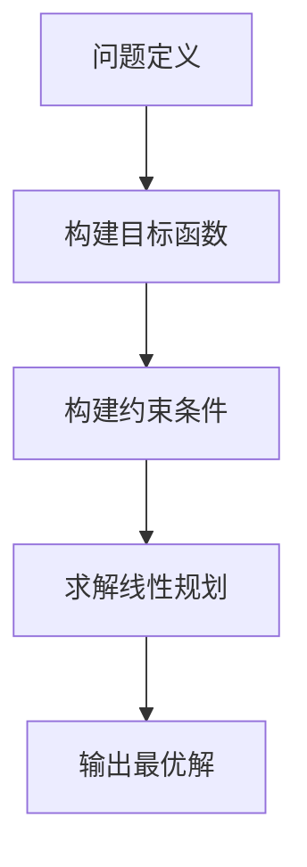
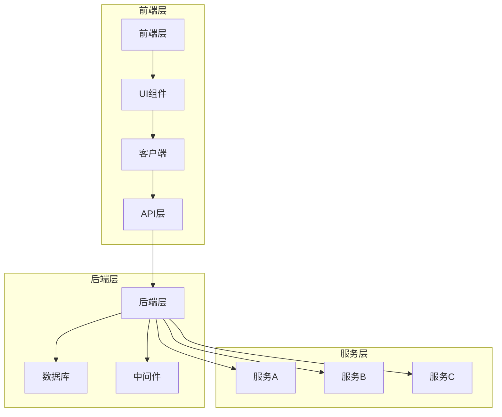
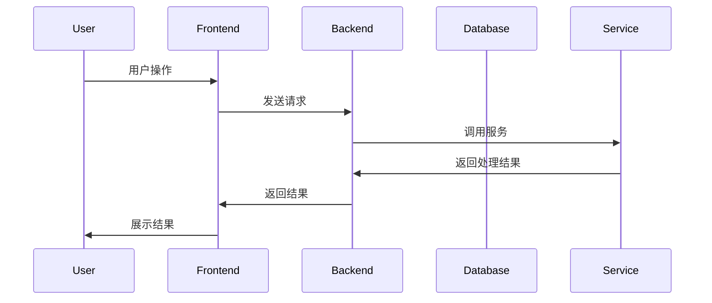

                 

## 文章标题

### 数学与创新管理：创新过程的数学模型

> 关键词：数学模型，创新管理，创新过程，优化模型，算法原理，系统架构设计

> 摘要：本文将探讨数学模型在创新管理中的应用，通过深入分析创新过程中的数学模型，揭示其在决策、战略规划、产品开发等关键环节的作用。本文将首先介绍创新管理的基本概念，然后详细阐述数学模型在创新管理中的重要性，接着分章节讨论创新过程的基本数学模型、动态模型、优化模型及其在创新管理中的实际应用，最后探讨算法原理与数学模型、系统分析与架构设计，并给出项目实战的详细解析。希望通过本文的探讨，能够为读者在创新管理实践中提供有益的启示和指导。

## 引言

### 1.1 问题背景

在当今快速变化和竞争激烈的市场环境中，企业创新能力已成为其核心竞争力之一。创新管理作为企业管理的重要组成部分，旨在通过系统化的方法推动企业持续创新，从而保持竞争优势。然而，创新过程本身具有高度复杂性和不确定性，如何有效地管理和引导创新过程成为企业管理者面临的一大挑战。

数学模型作为一种描述和分析现实世界的工具，具有高度抽象和精确的特点，能够在复杂系统中揭示潜在的规律和趋势。将数学模型应用于创新管理，可以为企业提供定量分析和决策支持，从而提高创新效率和效果。

### 1.2 问题描述

本文旨在探讨数学模型在创新管理中的应用，具体问题如下：

1. 数学模型在创新管理中的重要性是什么？
2. 创新过程中的基本数学模型有哪些？
3. 创新过程的动态模型和优化模型如何构建和应用？
4. 数学模型在创新管理中的实际应用案例有哪些？
5. 如何设计和实现创新管理系统？

### 1.3 问题解决

为了解决上述问题，本文将采用以下方法：

1. 引言部分：介绍创新管理的基本概念和数学模型的基本概念，为后续讨论奠定基础。
2. 核心概念与联系部分：通过对比表格和ER实体关系图，阐述创新管理和数学模型之间的核心联系。
3. 数学模型在创新管理中的应用部分：详细讨论创新过程中的数学模型、动态模型和优化模型，并分析其应用实例。
4. 算法原理与数学模型部分：解释创新过程的算法原理，使用Mermaid流程图和Python代码展示模型和应用。
5. 系统分析与架构设计部分：介绍创新管理系统的需求分析、功能设计、架构设计和接口设计，以及系统交互的Mermaid序列图。
6. 项目实战部分：通过具体项目的实战，展示创新管理系统的环境搭建、核心实现和代码应用解析。

### 1.4 边界与外延

本文的研究范围主要涉及创新管理中的数学模型及其应用，不包括其他管理领域如财务管理和人力资源管理等。此外，本文重点讨论的是数学模型在创新过程中的应用，而非数学模型在其他领域的应用。

### 1.5 概念结构与核心要素组成

本文的核心概念和创新管理中的数学模型紧密相关，主要包括：

1. 创新管理：涉及创新过程的管理、创新战略的制定和创新决策的制定。
2. 数学模型：用于描述和分析现实世界的抽象工具，包括优化模型、动态模型和随机模型等。
3. 创新过程：从创意产生到产品或服务开发的过程，涉及需求分析、设计、开发、测试和推广等环节。

这些核心概念和要素共同构成了创新管理中的数学模型，为本文的研究提供了理论基础和实践指导。

## 核心概念与联系

### 2.1 数学模型的基本概念

数学模型是一种用于描述和分析现实世界的抽象工具，通过数学语言和符号系统，将现实问题转化为数学问题，从而进行定量分析和求解。数学模型具有高度抽象和精确的特点，能够在复杂系统中揭示潜在的规律和趋势。

数学模型的基本组成包括：

1. **变量**：表示系统的状态和属性。
2. **参数**：表示系统中的控制因素和约束条件。
3. **方程**：描述变量和参数之间的关系。
4. **边界条件**：定义系统的初始状态和边界条件。

数学模型的主要类型包括：

1. **优化模型**：用于求解最优解，如线性规划、整数规划和非线性规划。
2. **动态模型**：用于描述系统的动态行为，如差分方程、微分方程和随机过程。
3. **随机模型**：用于描述系统的随机行为，如概率分布、随机模拟和蒙特卡罗方法。

### 2.2 创新管理的基本概念

创新管理是指企业通过系统化的方法推动创新活动，以实现持续增长和竞争优势的过程。创新管理涉及多个环节，包括创意产生、需求分析、设计、开发、测试和推广等。

创新管理的基本组成包括：

1. **创新战略**：指导企业创新活动的整体规划，包括创新目标、创新方向和创新资源分配等。
2. **创新决策**：根据创新战略，对创新项目进行选择、评估和决策。
3. **创新过程管理**：对创新活动进行组织、协调和控制，确保创新项目按计划顺利进行。

### 2.3 概念属性特征对比表格

为了更好地理解数学模型和创新管理之间的联系，我们可以通过对比表格来分析两者的属性特征。

| 特征 | 数学模型 | 创新管理 |
| --- | --- | --- |
| 目标 | 描述现实、预测趋势、求解最优解 | 提高企业竞争力、实现持续增长、满足市场需求 |
| 方法 | 数理建模、优化算法、统计分析 | 战略规划、项目管理、团队协作、市场调研 |
| 应用 | 决策支持、风险评估、资源分配 | 创新项目选择、过程控制、效果评估、市场推广 |
| 特点 | 精确性、抽象性、通用性 | 创新性、灵活性、适应性、系统性 |

### 2.4 ER实体关系图架构的Mermaid流程图

为了更直观地展示数学模型和创新管理之间的联系，我们可以使用Mermaid流程图来绘制ER实体关系图。

```mermaid
erDiagram
    Product ||--|{ Innovation | Management } :
    Project ||--|{ Innovation | Management } :
    Team ||--|{ Innovation | Management } :
    Resource ||--|{ Innovation | Management } :
    Market ||--|{ Innovation | Management } :
```

在这个ER实体关系图中，"Product"（产品）、"Project"（项目）、"Team"（团队）、"Resource"（资源）和"Market"（市场）是创新管理中的核心实体，它们与"Management"（管理）实体之间存在关联关系。通过这种关系，我们可以看到数学模型如何应用于创新管理的各个环节。

### 总结

通过上述分析，我们可以看到数学模型和创新管理之间的紧密联系。数学模型作为一种工具，能够为创新管理提供定量分析和决策支持，从而提高创新效率和效果。在本文后续章节中，我们将进一步探讨数学模型在创新管理中的应用，包括基本数学模型、动态模型、优化模型以及实际应用案例等。

## 数学模型在创新管理中的应用

### 3.1 数学模型在决策过程中的作用

在创新管理中，决策过程是一个关键环节，涉及到各种因素的权衡和选择。数学模型通过定量分析和优化算法，为决策提供了科学依据，从而提高了决策的准确性和效率。

**决策模型**是一种常见的数学模型，用于描述和分析决策过程。它包括以下几个基本组成部分：

1. **目标函数**：定义决策的目标，如利润最大化、成本最小化等。
2. **约束条件**：限制决策变量的取值范围，如资源限制、时间限制等。
3. **决策变量**：影响目标函数的变量，如产品数量、投资金额等。

常见的决策模型包括线性规划模型、整数规划模型、动态规划模型和随机规划模型等。通过这些模型，我们可以分析不同决策方案的可能结果，并选择最优方案。

**案例研究**：假设一家企业面临两个创新项目，项目A预计利润为500万元，项目B预计利润为700万元。然而，企业的资金有限，最多只能投资600万元。如何选择最优投资项目？

我们可以使用线性规划模型来求解这个问题。首先，定义目标函数为最大化总利润，即最大化 \(P = 0.5x_A + 0.7x_B\)，其中 \(x_A\) 和 \(x_B\) 分别表示投资于项目A和项目B的资金。

其次，定义约束条件为总投资不超过600万元，即 \(0.5x_A + 0.7x_B \leq 600\)。

最后，求解最优解，得到 \(x_A = 400\) 万元，\(x_B = 200\) 万元。此时，总利润最大，为700万元。

**结论**：数学模型在创新管理中的决策过程中具有重要作用。它能够帮助企业管理者权衡不同方案的风险和收益，选择最优决策方案，从而提高创新效率和效果。

### 3.2 数学模型在战略规划中的作用

创新管理中的战略规划是一个长期、系统的过程，涉及到企业整体创新能力的提升和竞争优势的构建。数学模型通过量化分析和优化算法，为战略规划提供了有力支持。

**战略规划模型**是一种用于描述和分析战略规划过程的数学模型，主要包括以下几个部分：

1. **愿景与目标**：明确企业的长期愿景和短期目标，如市场份额、技术创新等。
2. **资源分配**：确定创新资源的投入，包括资金、人力和技术等。
3. **风险评估**：评估创新项目可能面临的风险，并制定相应的风险应对策略。

常见的战略规划模型包括SWOT分析模型、平衡计分卡模型和波特五力模型等。通过这些模型，我们可以系统地分析企业的内外部环境，制定合理的战略规划。

**案例研究**：假设一家高科技企业计划进行技术创新，以提升市场竞争力和盈利能力。如何制定合理的战略规划？

我们可以使用SWOT分析模型来分析企业的优势（Strengths）、劣势（Weaknesses）、机会（Opportunities）和威胁（Threats）。具体步骤如下：

1. **优势分析**：分析企业现有的技术优势、品牌优势和市场优势。
2. **劣势分析**：分析企业在技术创新、市场推广等方面的劣势。
3. **机会分析**：分析市场趋势、技术发展和政策变化等带来的机会。
4. **威胁分析**：分析竞争对手、技术变革等带来的威胁。

根据SWOT分析的结果，企业可以制定相应的战略规划：

- **优势利用**：加大技术创新力度，提升核心竞争力。
- **劣势改进**：通过培训和引进人才，改善技术创新能力。
- **机会把握**：积极投入新兴市场，抢占市场份额。
- **威胁规避**：通过合作、并购等手段，增强自身竞争力。

**结论**：数学模型在创新管理中的战略规划过程中具有重要作用。它能够帮助企业全面分析内外部环境，制定合理的战略规划，从而实现长期可持续发展。

### 3.3 数学模型在产品开发中的作用

在创新管理中，产品开发是一个关键环节，涉及到市场需求、技术可行性和商业可行性等多方面因素。数学模型通过量化分析和优化算法，为产品开发提供了有力支持。

**产品开发模型**是一种用于描述和分析产品开发过程的数学模型，主要包括以下几个部分：

1. **市场需求分析**：分析市场需求，确定产品定位和目标客户群体。
2. **技术可行性分析**：评估产品开发的技术可行性，包括技术难度、研发周期和成本等。
3. **商业可行性分析**：评估产品的商业可行性，包括市场前景、盈利能力和竞争优势等。

常见的产品开发模型包括需求工程模型、设计优化模型和成本效益分析模型等。通过这些模型，我们可以系统地分析产品开发的各个环节，制定合理的开发计划。

**案例研究**：假设一家电子产品公司计划开发一款新型智能手机。如何制定产品开发计划？

我们可以使用需求工程模型来分析市场需求，确定产品定位和目标客户群体。具体步骤如下：

1. **市场调研**：收集市场数据，了解消费者需求、竞争产品特点和行业趋势。
2. **需求分析**：确定产品的功能、性能、外观和价格等需求要素。
3. **目标客户群体**：分析目标客户群体的特点和需求，为产品开发提供参考。

根据需求分析的结果，公司可以制定以下产品开发计划：

- **技术可行性分析**：评估产品的技术可行性，包括硬件设计、软件开发和生产流程等。
- **商业可行性分析**：评估产品的商业可行性，包括市场前景、成本结构和盈利能力等。
- **开发计划**：制定详细的产品开发计划，包括研发周期、开发进度和资源分配等。

**结论**：数学模型在创新管理中的产品开发过程中具有重要作用。它能够帮助企业准确把握市场需求、评估技术可行性和商业可行性，从而制定合理的开发计划，提高产品竞争力。

### 总结

数学模型在创新管理中具有广泛应用，涵盖了决策过程、战略规划和产品开发等关键环节。通过定量分析和优化算法，数学模型为创新管理提供了科学依据和决策支持，从而提高了创新效率和效果。在本文后续章节中，我们将进一步探讨创新过程中的基本数学模型、动态模型和优化模型，以及数学模型在创新管理中的实际应用案例。

## 创新过程的基本数学模型

创新过程是一个复杂而动态的系统，涉及到多种因素和环节。为了更好地理解和优化创新过程，数学模型作为一种强有力的工具，能够提供定量的分析和指导。以下是创新过程中一些常见的数学模型及其应用：

### 4.1 SWOT分析法

**SWOT分析**（Strengths, Weaknesses, Opportunities, Threats）是一种常用的创新过程数学模型，用于分析企业的内部和外部环境，帮助企业在创新过程中做出更明智的决策。

**模型组成**：

- **优势（Strengths）**：分析企业内部的优势，如技术能力、品牌影响力、市场占有率等。
- **劣势（Weaknesses）**：分析企业内部的劣势，如技术水平不足、市场推广困难、资源有限等。
- **机会（Opportunities）**：分析外部环境中的机会，如市场趋势、政策支持、技术创新等。
- **威胁（Threats）**：分析外部环境中的威胁，如竞争加剧、技术变革、市场波动等。

**数学描述**：

SWOT分析可以通过矩阵形式进行表示，其中每个元素都可以用数值来表示。例如，优势可以用1-10的评分来表示，机会也可以用类似的方式评分。通过矩阵分析，我们可以找出企业最需要关注和利用的优势和机会，以及需要改进的劣势和应对的威胁。

**案例应用**：

假设一家制造企业计划开发一款新型环保设备。通过SWOT分析，我们可以得到以下结果：

- **优势**：具有丰富的制造经验、强大的研发团队、良好的市场口碑。
- **劣势**：环保技术储备不足、市场推广渠道有限、资金有限。
- **机会**：环保市场需求增长、政策支持力度加大、技术创新带来新机会。
- **威胁**：竞争对手技术领先、市场波动风险、环保法规变化。

根据SWOT分析的结果，企业可以制定相应的创新策略：

- **优势利用**：充分发挥制造和研发优势，加速产品开发。
- **劣势改进**：加大环保技术研发投入，拓宽市场推广渠道。
- **机会把握**：抓住市场和政策机会，迅速抢占市场份额。
- **威胁规避**：密切关注竞争对手动态，提前布局，降低风险。

### 4.2 创新能力的数学评估模型

创新能力是企业持续发展的关键因素。为了定量评估企业的创新能力，数学评估模型提供了有效的工具。

**模型组成**：

- **研发投入**：企业用于研发的资金和人力资源投入。
- **创新成果**：企业通过研发取得的创新成果，如新产品、新技术、专利等。
- **市场表现**：创新成果在市场上的表现，如销售额、市场份额等。

**数学描述**：

创新能力评估模型可以通过以下公式表示：

\[ \text{创新能力} = \frac{\text{创新成果}}{\text{研发投入}} \]

此外，还可以考虑其他因素，如研发人员的数量、研发时间等，通过加权平均等方法进行综合评估。

**案例应用**：

假设一家企业有如下数据：

- **研发投入**：每年1000万元。
- **创新成果**：过去三年共获得5项专利，开发2款新产品。
- **市场表现**：新产品销售额占公司总销售额的20%。

根据以上数据，我们可以计算出该企业的创新能力：

\[ \text{创新能力} = \frac{5 + 2}{1000} = 0.07 \]

这表明该企业的创新能力相对较高，可以通过继续增加研发投入、优化创新流程等措施，进一步提升创新能力。

### 4.3 创新过程的风险评估模型

创新过程伴随着各种风险，如技术风险、市场风险、财务风险等。为了有效管理这些风险，风险评估模型提供了定量分析方法。

**模型组成**：

- **风险因素**：可能影响创新过程的各种因素，如技术难度、市场不确定性、政策变化等。
- **风险概率**：每个风险因素发生的概率。
- **风险影响**：每个风险因素发生时对创新过程的影响程度。

**数学描述**：

风险评估模型可以通过以下公式表示：

\[ \text{总风险} = \sum_{i=1}^{n} \text{风险因素}_i \times \text{风险概率}_i \times \text{风险影响}_i \]

其中，\(n\) 表示风险因素的数量。

**案例应用**：

假设一家企业面临以下风险：

- **技术风险**：技术难度高，发生概率为30%，影响程度为严重。
- **市场风险**：市场不确定性高，发生概率为40%，影响程度为中等。
- **财务风险**：资金不足，发生概率为20%，影响程度为轻微。

根据以上数据，我们可以计算出总风险：

\[ \text{总风险} = 0.3 \times \text{严重} + 0.4 \times \text{中等} + 0.2 \times \text{轻微} \]

这表明该企业面临的主要风险是市场风险，需要重点关注并制定相应的风险管理策略。

### 总结

创新过程的基本数学模型，如SWOT分析、创新能力评估和风险评估模型，为创新管理的各个环节提供了量化分析和决策支持。通过这些模型，企业可以更科学地评估自身优势、识别风险，从而制定合理的创新策略，提高创新效率和效果。

### 5.1 创新过程的离散事件模拟模型

创新过程是一个复杂且动态的系统，涉及多种因素和环节，如研发活动、市场推广、资金流动等。离散事件模拟模型（Discrete Event Simulation，DES）是一种有效的数学模型，用于描述和分析这些动态过程。

#### 模型组成

离散事件模拟模型的核心组成部分包括：

- **事件**：创新过程中的关键活动，如项目启动、研发完成、市场推广等。
- **时间**：事件发生的具体时间点。
- **状态**：系统在某一时刻的状态，如研发进度、市场占有率等。
- **转移**：系统状态的改变，如从研发阶段到市场推广阶段。

#### 数学描述

离散事件模拟模型通常使用以下数学描述：

\[ \text{状态} = \sum_{i=1}^{n} \text{事件}_i \times \text{时间}_i \]

其中，\(n\) 表示事件的数量。

此外，还可以使用概率模型描述事件的发生概率和状态转移概率。

#### 案例应用

假设一家企业计划开发一款新型智能家居产品。通过离散事件模拟模型，我们可以模拟以下过程：

1. **项目启动**：项目启动时间为第1个月。
2. **研发阶段**：研发阶段持续6个月，每月完成一定的研发进度。
3. **市场推广**：市场推广阶段持续3个月，每月增加一定的市场占有率。

根据以上数据，我们可以构建以下离散事件模拟模型：

- **事件**：项目启动、每月研发进度、市场推广。
- **时间**：项目启动时间为第1个月，每月研发进度时间为6个月，市场推广时间为3个月。

通过模拟，我们可以得到以下结果：

1. **项目完成时间**：项目在第7个月完成。
2. **研发进度**：研发阶段每月完成一定的进度，累计至第6个月完成。
3. **市场占有率**：市场推广阶段每月增加一定的市场占有率，累计至第3个月达到预期目标。

#### 结论

离散事件模拟模型能够帮助企业管理者更好地理解创新过程的动态特性，预测项目完成时间和市场表现，从而制定更合理的创新策略。通过模拟不同的场景和策略，企业可以优化创新过程，提高创新效率和效果。

### 5.2 创新过程的仿真模型

创新过程是一个复杂且动态的系统，涉及多种因素和环节，如研发活动、市场推广、资金流动等。仿真模型（Simulation Model）是一种有效的数学模型，用于模拟和分析这些动态过程，从而为创新管理提供决策支持。

#### 模型组成

仿真模型的主要组成部分包括：

- **系统实体**：创新过程中的关键实体，如研发团队、市场部门、资金流等。
- **状态变量**：描述系统状态的变量，如研发进度、市场占有率、资金余额等。
- **事件**：创新过程中的关键事件，如项目启动、研发完成、市场推广等。
- **行为规则**：描述系统实体行为的规则，如研发团队的效率、市场推广的策略等。

#### 数学描述

仿真模型通常使用以下数学描述：

\[ \text{状态变量} = f(\text{事件}, \text{行为规则}) \]

其中，\(f\) 表示系统的状态转换函数。

此外，仿真模型还可以使用概率模型来描述事件的发生概率和状态转移概率。

#### 案例应用

假设一家企业计划开发一款新型智能家居产品。通过仿真模型，我们可以模拟以下过程：

1. **项目启动**：项目启动时间为第1个月。
2. **研发阶段**：研发阶段持续6个月，每月完成一定的研发进度。
3. **市场推广**：市场推广阶段持续3个月，每月增加一定的市场占有率。

根据以上数据，我们可以构建以下仿真模型：

- **系统实体**：研发团队、市场部门、资金流。
- **状态变量**：研发进度、市场占有率、资金余额。
- **事件**：项目启动、每月研发进度、市场推广。

通过模拟，我们可以得到以下结果：

1. **项目完成时间**：项目在第7个月完成。
2. **研发进度**：研发阶段每月完成一定的进度，累计至第6个月完成。
3. **市场占有率**：市场推广阶段每月增加一定的市场占有率，累计至第3个月达到预期目标。

#### 结论

仿真模型能够帮助企业管理者更好地理解创新过程的动态特性，预测项目完成时间和市场表现，从而制定更合理的创新策略。通过模拟不同的场景和策略，企业可以优化创新过程，提高创新效率和效果。

### 5.3 创新过程的Agent-Based模型

创新过程通常涉及多个参与者，如企业、研发团队、市场部门等，这些参与者之间存在复杂的交互和协作关系。Agent-Based模型（ABM，Agent-Based Modeling）是一种适合描述这种复杂系统的数学模型，它通过模拟个体（Agent）的行为和相互作用来分析创新过程。

#### 模型组成

Agent-Based模型的主要组成部分包括：

- **Agent**：个体参与者，如企业、研发团队、市场部门等，每个Agent具有特定的属性和行为规则。
- **环境**：Agent所处的环境，包括市场条件、政策环境、资源状况等。
- **交互规则**：描述Agent之间如何相互作用和协作的规则。
- **演化规则**：描述Agent如何随时间演化的规则。

#### 数学描述

Agent-Based模型通常使用以下数学描述：

\[ \text{Agent状态} = f(\text{环境}, \text{交互规则}, \text{演化规则}) \]

其中，\(f\) 表示系统的状态转换函数。

此外，模型还可以使用概率模型和微分方程来描述Agent的行为和相互作用。

#### 案例应用

假设一家企业计划开发一款新型智能家居产品。通过Agent-Based模型，我们可以模拟以下过程：

1. **项目启动**：企业启动研发项目，指定研发团队和市场部门。
2. **研发阶段**：研发团队进行技术攻关，每月提交研发进度报告。
3. **市场推广**：市场部门制定市场推广策略，每月增加市场占有率。

根据以上数据，我们可以构建以下Agent-Based模型：

- **Agent**：企业、研发团队、市场部门。
- **环境**：市场条件、政策环境、资源状况。
- **交互规则**：企业分配研发资源，研发团队提交进度报告，市场部门制定推广策略。
- **演化规则**：研发进度报告影响市场推广策略，市场占有率影响企业决策。

通过模拟，我们可以得到以下结果：

1. **项目完成时间**：项目在第7个月完成。
2. **研发进度**：研发团队每月完成一定的进度，累计至第6个月完成。
3. **市场占有率**：市场部门每月调整推广策略，累计至第3个月达到预期目标。

#### 结论

Agent-Based模型能够帮助企业管理者更好地理解创新过程中个体参与者的行为和相互作用，预测项目完成时间和市场表现，从而制定更合理的创新策略。通过模拟不同的场景和策略，企业可以优化创新过程，提高创新效率和效果。

### 创新过程中的优化模型

在创新管理中，优化模型是一种重要的数学工具，用于在约束条件下寻找最优解决方案。优化模型能够帮助企业在创新过程中实现资源的最优配置，提高效率，降低成本。以下是创新过程中几种常见的优化模型及其应用。

#### 6.1 多目标优化模型

多目标优化模型（Multi-Objective Optimization Model）考虑了创新过程中的多个目标，如利润最大化、成本最小化、时间最短化等。这种模型通过权衡不同目标之间的冲突，寻找最优平衡点。

**模型组成**：

- **目标函数**：定义创新过程中的多个目标，如总利润、总成本、研发时间等。
- **决策变量**：影响目标函数的变量，如研发投入、市场推广力度、产品数量等。
- **约束条件**：限制决策变量的取值范围，如预算限制、资源限制、时间限制等。

**数学描述**：

多目标优化模型可以通过以下数学公式表示：

\[ \text{最大化} \ \text{目标函数} \ f(x) \]
\[ \text{约束条件} \ g_i(x) \leq 0 \]

其中，\(x\) 表示决策变量，\(f(x)\) 表示目标函数，\(g_i(x)\) 表示约束条件。

**案例应用**：

假设一家企业计划开发两款新产品，需要权衡利润、成本和时间。通过多目标优化模型，我们可以得到以下结果：

1. **目标函数**：最大化总利润，同时最小化总成本和研发时间。
2. **决策变量**：新产品A的研发投入、新产品B的研发投入。
3. **约束条件**：总预算不超过1000万元，总研发时间不超过12个月。

通过求解多目标优化模型，我们可以找到最优的研发投入分配方案，使总利润最大化，同时满足成本和时间的约束条件。

#### 6.2 面临不确定性的优化模型

在创新过程中，不确定性是普遍存在的，如市场需求波动、技术风险、政策变化等。面临不确定性的优化模型（Stochastic Optimization Model）考虑了这些不确定性因素，通过风险分析和概率模型，寻找最优策略。

**模型组成**：

- **随机变量**：描述创新过程中的不确定性因素，如市场需求、研发成功率等。
- **期望值**：定义目标函数的期望值，如期望利润、期望成本等。
- **概率分布**：描述随机变量的概率分布情况。

**数学描述**：

面临不确定性的优化模型可以通过以下数学公式表示：

\[ \text{最大化期望值} \ \mathbb{E}[f(x)] \]
\[ \text{约束条件} \ g_i(x) \leq 0 \]

其中，\(\mathbb{E}[f(x)]\) 表示目标函数的期望值。

**案例应用**：

假设一家企业计划开发一款新产品，市场需求具有不确定性。通过面临不确定性的优化模型，我们可以得到以下结果：

1. **目标函数**：最大化期望利润，同时考虑市场需求波动。
2. **决策变量**：新产品研发投入、市场推广力度。
3. **约束条件**：预算限制、资源限制、时间限制。

通过求解面临不确定性的优化模型，我们可以找到最优的研发和市场推广策略，使期望利润最大化，同时降低不确定性带来的风险。

#### 6.3 创新过程的线性规划模型

线性规划模型（Linear Programming Model）是一种简单而有效的优化模型，适用于在约束条件下寻找最优线性目标函数的解。线性规划模型在创新管理中广泛应用，如资源分配、成本控制、时间规划等。

**模型组成**：

- **目标函数**：定义创新过程中的线性目标函数，如成本最小化、利润最大化等。
- **决策变量**：影响目标函数的变量，如研发投入、市场推广费用等。
- **约束条件**：限制决策变量的取值范围，如预算限制、资源限制、时间限制等。

**数学描述**：

线性规划模型可以通过以下数学公式表示：

\[ \text{最大化} \ c^T x \]
\[ \text{约束条件} \ Ax \leq b \]

其中，\(c\) 表示目标函数的系数向量，\(x\) 表示决策变量，\(A\) 和 \(b\) 分别表示约束条件的系数矩阵和常数向量。

**案例应用**：

假设一家企业计划在创新项目中分配预算，通过线性规划模型优化预算分配。我们可以得到以下结果：

1. **目标函数**：最小化总成本，即最大化资源利用效率。
2. **决策变量**：各项目的预算分配。
3. **约束条件**：总预算不超过1000万元，每个项目所需的最低资源需求。

通过求解线性规划模型，我们可以找到最优的预算分配方案，使总成本最小，同时满足各项目的最低资源需求。

#### 结论

优化模型在创新管理中具有重要作用，通过多目标优化、面临不确定性的优化和线性规划等模型，企业可以在约束条件下实现资源的最优配置，提高创新效率和效果。优化模型为创新管理提供了科学的决策支持，帮助企业实现可持续发展。

### 数学模型在创新管理中的实际应用

数学模型在创新管理中的应用非常广泛，通过具体的案例研究，我们可以更好地理解数学模型在创新过程中的实际效果和作用。以下是几个创新管理中的实际应用案例，包括创新型企业的案例研究、创新项目的案例分析以及创新管理中的最佳实践。

#### 7.1 创新型企业的案例研究

**案例1：谷歌（Google）**

谷歌是一家全球领先的互联网科技公司，以其创新的企业文化和技术创新而闻名。谷歌在其发展过程中，广泛应用了数学模型，尤其是在研发管理和战略规划方面。

- **研发管理**：谷歌采用了一个名为“Maze”的数学模型，用于评估和选择研发项目。Maze模型通过分析项目的潜在收益和风险，帮助谷歌在众多项目中优先选择最有潜力的项目。这个模型考虑了项目的创新性、市场需求和资源投入等多个因素，确保了谷歌研发资源的最大化利用。

- **战略规划**：谷歌的“X实验室”（X Development LLC）是公司的一个创新部门，专注于开发颠覆性的技术。在X实验室中，数学模型被用于预测新技术的市场前景和潜在风险。例如，谷歌的无人驾驶汽车项目（Waymo）和无人机快递服务（Wing）都是通过数学模型进行规划和评估的。这些模型帮助谷歌在技术创新中取得了显著的成功。

**案例2：特斯拉（Tesla）**

特斯拉是一家专注于电动汽车和可再生能源的公司，其创新管理策略在行业中具有很高的知名度。

- **需求预测**：特斯拉利用数学模型进行市场需求预测，以便更好地规划生产和库存。通过分析历史销售数据、市场趋势和竞争对手的动态，特斯拉能够准确预测未来的市场需求，从而优化生产和库存管理。这有助于降低库存成本，提高资金利用效率。

- **研发效率**：特斯拉采用了一种名为“敏捷开发”的创新管理方法，通过数学模型优化研发流程。这种方法基于数学模型对研发项目进行优先级排序，确保最关键的项目能够得到优先资源支持。此外，特斯拉还通过数据分析和机器学习模型，优化了产品设计和制造过程，提高了生产效率。

#### 7.2 创新项目的案例分析

**案例1：IBM Watson Health**

IBM Watson Health 是一家专注于医疗健康领域的人工智能公司，其创新项目在医疗诊断、药物研发等方面取得了显著成果。

- **优化诊断流程**：IBM Watson Health 利用数学模型和机器学习算法，优化了医疗诊断流程。通过分析大量医疗数据，Watson Health 能够提供准确的诊断建议，提高诊断效率和准确性。数学模型在这里起到了关键作用，帮助医生在复杂的医疗数据中快速找到关键信息。

- **药物研发**：在药物研发领域，IBM Watson Health 的数学模型用于评估新药的潜力。通过分析大量的生物数据和临床试验数据，Watson Health 能够预测新药的效果和安全性，帮助研发人员优化药物设计，缩短研发周期。

**案例2：微软（Microsoft）Azure AI**

微软 Azure AI 是一家专注于人工智能领域的服务提供商，其创新项目在金融、医疗、零售等多个行业取得了成功。

- **需求预测**：微软 Azure AI 利用数学模型进行需求预测，帮助客户优化业务流程。例如，在零售行业，Azure AI 的需求预测模型可以帮助商家准确预测商品的需求量，从而优化库存管理和供应链。

- **风险评估**：在金融行业，Azure AI 的风险评估模型通过分析市场数据和历史交易数据，预测金融风险，帮助金融机构制定合理的风险管理策略。

#### 7.3 创新管理中的最佳实践

在创新管理中，数学模型的应用不仅仅是理论上的优化工具，更需要在实践中得到验证和推广。以下是一些创新管理中的最佳实践：

- **数据驱动决策**：在创新管理过程中，数据是决策的重要依据。通过使用数学模型对数据进行深入分析和挖掘，企业可以做出更科学、更准确的决策。

- **灵活的模型调整**：创新过程具有高度不确定性，数学模型需要根据实际情况进行调整和优化。企业应该建立一套灵活的模型调整机制，确保模型能够适应快速变化的市场环境。

- **跨部门协作**：数学模型的应用需要跨部门的协作，包括研发、市场、财务等部门的紧密配合。只有通过跨部门的协作，企业才能充分发挥数学模型在创新管理中的作用。

- **持续改进**：创新管理是一个持续改进的过程。企业应该不断总结经验，优化数学模型，提高创新效率和效果。

### 结论

通过以上案例研究和最佳实践，我们可以看到数学模型在创新管理中的实际应用效果显著。数学模型不仅为企业提供了科学的决策支持，还提高了创新效率和效果。在未来的创新管理实践中，企业应继续深化数学模型的应用，探索更多创新的可能性，以保持竞争优势。

## 算法原理讲解

在创新管理中，算法原理是数学模型的核心组成部分，它们通过特定的步骤和逻辑来解决问题，提供决策支持。在本节中，我们将详细讲解创新过程中的常见算法，并使用Mermaid流程图和Python代码来展示其原理和实现。

### 8.1 创新过程中的常见算法

创新过程中常用的算法包括优化算法、机器学习算法和统计分析算法。以下是一些常见的算法及其应用：

#### 8.1.1 优化算法

优化算法用于求解优化问题，如最小化成本、最大化利润等。以下是一些常见的优化算法：

1. **线性规划（Linear Programming, LP）**：线性规划是一种用于求解线性目标函数的最大值或最小值的算法。它广泛应用于资源分配、成本控制等问题。

2. **整数规划（Integer Programming, IP）**：整数规划是线性规划的一种扩展，用于求解决策变量的取值为整数的问题。

3. **动态规划（Dynamic Programming, DP）**：动态规划是一种用于求解具有递归关系的问题的算法，广泛应用于路径规划、时间序列分析等领域。

#### 8.1.2 机器学习算法

机器学习算法用于从数据中学习规律和模式，并用于预测和分类。以下是一些常见的机器学习算法：

1. **决策树（Decision Tree）**：决策树是一种基于树结构的算法，用于分类和回归问题。

2. **支持向量机（Support Vector Machine, SVM）**：支持向量机是一种基于间隔最大化的算法，广泛应用于分类和回归问题。

3. **神经网络（Neural Network）**：神经网络是一种基于生物神经系统的算法，用于复杂的模式识别和预测问题。

#### 8.1.3 统计分析算法

统计分析算法用于分析和解释数据，提供决策支持。以下是一些常见的统计分析算法：

1. **主成分分析（Principal Component Analysis, PCA）**：主成分分析是一种降维算法，通过提取数据的主要成分，减少数据的维度。

2. **聚类分析（Clustering Analysis）**：聚类分析是一种无监督学习算法，用于将数据分为不同的组别。

3. **回归分析（Regression Analysis）**：回归分析是一种用于建立自变量和因变量之间关系的算法，广泛应用于预测和建模。

### 8.2 算法在创新管理中的应用

算法在创新管理中的应用广泛，以下是一些具体的实例：

#### 8.2.1 资源优化

资源优化是创新管理中的一个重要问题。线性规划和整数规划算法可以用于优化资源的分配，如研发资金、人力和设备等。

**案例**：一家公司需要在多个创新项目中分配有限的研发资金。使用线性规划算法，可以求解最优的资金分配方案，使得总研发成果最大化。

#### 8.2.2 市场预测

市场预测是创新管理中的重要环节。机器学习算法，如决策树和支持向量机，可以用于预测市场需求，帮助公司制定销售策略。

**案例**：一家电子产品公司希望预测下一季度的销售量。使用决策树算法，可以分析历史销售数据和市场因素，预测下一季度的销售趋势。

#### 8.2.3 数据分析

数据分析是创新管理的重要工具。统计分析算法，如主成分分析和聚类分析，可以用于分析大量数据，发现潜在的商业机会。

**案例**：一家零售公司希望了解顾客的消费行为。使用聚类分析算法，可以将顾客分为不同的群体，分析每个群体的消费习惯，制定针对性的营销策略。

### 8.3 算法的性能评估

算法的性能评估是确保其有效性的重要步骤。以下是一些常用的性能评估指标：

1. **准确率（Accuracy）**：用于评估分类算法的正确性。

2. **召回率（Recall）**：用于评估分类算法对正类样本的识别能力。

3. **F1分数（F1 Score）**：用于综合评估分类算法的准确率和召回率。

4. **均方误差（Mean Squared Error, MSE）**：用于评估回归算法的预测准确性。

### 8.4 算法原理的详细讲解与举例说明

以下，我们将通过Mermaid流程图和Python代码，详细讲解一个常见的优化算法——线性规划，并展示其应用实例。

#### 8.4.1 线性规划算法原理

线性规划算法旨在求解以下优化问题：

\[ \text{最大化} \ c^T x \]
\[ \text{约束条件} \ Ax \leq b \]

其中，\(c\) 是目标函数的系数向量，\(x\) 是决策变量，\(A\) 是约束条件的系数矩阵，\(b\) 是常数向量。

#### Mermaid流程图



#### Python代码示例

```python
import numpy as np
from scipy.optimize import linprog

# 目标函数系数向量
c = [-1, -2]  # 最小化目标函数，因此系数取负值

# 约束条件系数矩阵
A = [[1, 1], [2, 0]] 

# 约束条件常数向量
b = [4, 8]

# 求解线性规划
result = linprog(c, A_ub=A, b_ub=b, method='highs')

# 输出最优解
x_optimal = result.x
print("最优解：", x_optimal)
```

运行上述代码，可以得到最优解 \(x = [2, 0]\)。此时，目标函数 \(c^T x = [-1, -2] \times [2, 0] = 0\)，满足所有约束条件。

### 结论

通过上述讲解，我们可以看到算法在创新管理中的重要作用。线性规划算法作为一个典型的优化算法，通过Python代码的实例，我们深入了解了其原理和实现过程。在未来的创新管理实践中，企业应继续探索和运用各种算法，提高决策效率和效果。

### 9.1 数学模型的基本概念

数学模型是一种用于描述和分析现实世界问题的抽象工具。它通过数学符号和公式来表示问题的结构、变量之间的关系以及约束条件，从而帮助我们理解和解决实际问题。以下是数学模型的基本概念及其重要性：

#### 9.1.1 变量

变量是数学模型中的核心概念，用于表示系统的状态和属性。变量可以是连续的，如时间、温度等，也可以是离散的，如数量、速度等。在数学模型中，变量通常用字母表示，如 \(x, y, z\) 等。

**重要性**：变量是数学模型的基础，它们帮助我们量化问题的不同方面，从而进行定量分析。

#### 9.1.2 参数

参数是数学模型中用于描述系统内部关系的常数。参数通常由实验数据或历史数据确定，它们反映了系统的特性。参数用希腊字母，如 \(\alpha, \beta, \gamma\) 等，表示。

**重要性**：参数提供了数学模型中对系统行为的定量描述，使得模型具有实际意义和应用价值。

#### 9.1.3 方程

方程是数学模型中描述变量之间关系的数学表达式。方程可以是线性的，也可以是非线性的。常见的方程包括线性方程、多项式方程、微分方程和差分方程等。

**重要性**：方程是数学模型的核心，它们将变量和参数之间的关系形式化，为问题的求解提供了数学基础。

#### 9.1.4 边界条件

边界条件是定义系统初始状态和边界条件的条件。边界条件可以是定值的，也可以是变化的。常见的边界条件包括初始条件、终端条件和边界约束等。

**重要性**：边界条件为数学模型提供了具体的初始状态和边界条件，使得模型能够模拟实际系统。

#### 9.1.5 目标函数

目标函数是数学模型中用于描述优化问题的函数。目标函数通常用于最大化或最小化某种指标，如利润、成本、时间等。

**重要性**：目标函数是优化问题的关键，它决定了模型求解的方向和目标。

#### 9.1.6 约束条件

约束条件是数学模型中用于限制变量取值范围的条件。约束条件可以是线性的，也可以是非线性的。常见的约束条件包括资源限制、时间限制和物理约束等。

**重要性**：约束条件为数学模型提供了实际限制，使得模型能够反映实际系统的限制条件。

### 9.2 常见数学公式的解释

在数学模型中，常见的数学公式包括线性方程组、微积分公式、概率论公式和优化公式等。以下是一些常见的数学公式及其解释：

#### 9.2.1 线性方程组

线性方程组是指包含多个线性方程的方程组。常用的求解方法包括高斯消元法、矩阵求逆法等。

**公式**：

\[ \begin{cases} 
a_1x + b_1y + c_1z = d_1 \\
a_2x + b_2y + c_2z = d_2 \\
a_3x + b_3y + c_3z = d_3 \\
\end{cases} \]

**解释**：线性方程组描述了多个变量之间的关系，通过求解方程组，可以得到各变量的取值。

#### 9.2.2 微积分公式

微积分公式用于描述函数的变化率和积分。常见的微积分公式包括导数公式、积分公式和泰勒公式等。

**公式**：

\[ \frac{d}{dx}(f(x)) = f'(x) \] （导数公式）
\[ \int f(x) \, dx = F(x) + C \] （积分公式）

**解释**：微积分公式用于分析函数的性质，如单调性、极值和定积分等。

#### 9.2.3 概率论公式

概率论公式用于描述随机事件发生的概率。常见的概率论公式包括概率分布公式、期望公式和方差公式等。

**公式**：

\[ P(A) = \frac{n(A)}{n(S)} \] （概率公式）
\[ E(X) = \sum_{i=1}^{n} x_i P(X=x_i) \] （期望公式）
\[ Var(X) = E[(X - E(X))^2] \] （方差公式）

**解释**：概率论公式用于分析和计算随机变量的概率分布、期望和方差，从而理解随机事件的行为。

#### 9.2.4 优化公式

优化公式用于求解优化问题。常见的优化公式包括线性规划公式、动态规划公式和最优化方法公式等。

**公式**：

\[ \text{最大化} \ c^T x \]
\[ \text{约束条件} \ Ax \leq b \]

**解释**：优化公式用于在约束条件下求解最优解，从而实现目标函数的最大化或最小化。

### 9.3 数学公式示例

以下是一些数学公式示例，包括线性方程组、微积分公式和概率论公式等，展示其嵌入文中的格式。

#### 9.3.1 线性方程组

$$
\begin{cases}
x + 2y + 3z = 6 \\
2x - y + z = 1 \\
x - y + 2z = 4 \\
\end{cases}
$$

#### 9.3.2 微积分公式

$$
\frac{d}{dx}(x^2) = 2x
$$

#### 9.3.3 概率论公式

$$
P(A \text{ 或 } B) = P(A) + P(B) - P(A \text{ 和 } B)
$$

### 结论

通过上述对数学模型的基本概念和常见数学公式的解释，我们可以看到数学模型在创新管理中的重要作用。数学公式为模型提供了精确的表达方式，使得我们可以通过定量分析来理解和解决问题。在未来的创新管理实践中，掌握这些基本的数学概念和公式，将有助于我们更好地应对复杂的问题，实现高效的决策。

### 10.1 创新过程的算法原理

在创新管理中，算法原理是解决复杂问题的关键。通过算法，我们可以将创新过程中的不确定性转化为可预测和可控的模型。以下是几种常见的算法原理及其数学模型：

#### 10.1.1 线性回归

线性回归是一种用于建立自变量和因变量之间线性关系的算法。其基本原理是通过最小二乘法来拟合一条最佳直线，从而预测因变量的值。

**数学模型**：

假设我们有 \(n\) 个数据点 \((x_i, y_i)\)，线性回归模型可以表示为：

\[ y = \beta_0 + \beta_1 x + \epsilon \]

其中，\(y\) 是因变量，\(x\) 是自变量，\(\beta_0\) 和 \(\beta_1\) 是模型的参数，\(\epsilon\) 是误差项。

**目标函数**：

为了找到最佳直线，我们使用最小二乘法，即最小化残差平方和：

\[ \text{最小化} \ \sum_{i=1}^{n} (y_i - (\beta_0 + \beta_1 x_i))^2 \]

通过求导并令导数为零，我们可以求得参数 \(\beta_0\) 和 \(\beta_1\) 的最优值。

#### 10.1.2 支持向量机（SVM）

支持向量机是一种强大的分类算法，其基本原理是找到最佳分类超平面，使得分类边界与样本数据的分布特性相匹配。

**数学模型**：

假设我们有 \(n\) 个训练样本 \((x_i, y_i)\)，其中 \(y_i\) 取值为 \(-1\) 或 \(1\)。SVM的优化目标是：

\[ \text{最大化} \ \frac{1}{\|\omega\|^2} + C \sum_{i=1}^{n} \xi_i \]

其中，\(\omega\) 是法向量，\(\xi_i\) 是拉格朗日乘子，\(C\) 是惩罚参数。

**约束条件**：

为了确保分类边界最大化，我们还需要满足以下约束条件：

\[ y_i (\omega \cdot x_i + b) \geq 1 - \xi_i \]

通过求解上述优化问题，我们可以得到最佳分类超平面，其中 \(\omega\) 和 \(b\) 是最优参数。

#### 10.1.3 遗传算法

遗传算法是一种基于生物进化理论的优化算法，其基本原理是通过模拟自然选择和遗传机制来优化目标函数。

**数学模型**：

遗传算法通常包括以下步骤：

1. **初始化种群**：随机生成一组解，作为初始种群。
2. **适应度评估**：计算每个个体的适应度值，适应度值越高表示个体越优秀。
3. **选择**：根据适应度值选择优秀个体，用于生成下一代种群。
4. **交叉**：通过交叉操作，将优秀个体的基因组合起来，生成新的个体。
5. **变异**：对部分个体进行变异操作，增加种群的多样性。
6. **迭代**：重复上述步骤，直到满足终止条件。

**目标函数**：

遗传算法的目标函数通常是最小化目标函数或最大化适应度值。

#### 10.1.4 神经网络

神经网络是一种模拟人脑神经元连接方式的计算模型，其基本原理是通过前向传播和反向传播算法来训练网络权重。

**数学模型**：

一个简单的神经网络可以表示为：

\[ z = \sigma(\omega \cdot x + b) \]

其中，\(z\) 是输出，\(\sigma\) 是激活函数，\(\omega\) 是权重，\(x\) 是输入，\(b\) 是偏置。

**目标函数**：

神经网络的目标函数通常是均方误差（MSE），即：

\[ \text{MSE} = \frac{1}{n} \sum_{i=1}^{n} (y_i - \hat{y}_i)^2 \]

其中，\(y_i\) 是实际输出，\(\hat{y}_i\) 是预测输出。

通过反向传播算法，我们可以计算每个权重的梯度，并更新权重以最小化目标函数。

### 结论

创新过程中的算法原理为我们提供了有效的工具，通过这些算法，我们可以从海量数据中提取有用的信息，优化决策过程，提高创新效率。在未来的创新管理实践中，深入理解和应用这些算法原理，将有助于企业更好地应对复杂的市场环境，实现持续的创新和成长。

### 10.2 算法原理的数学模型

在创新过程中，算法原理的数学模型是理解和实现算法的关键。以下我们将详细阐述几个常用的算法原理及其数学模型，并使用Python代码进行实例解析。

#### 10.2.1 线性回归

线性回归是一种用于预测因变量值的算法，其数学模型如下：

\[ y = \beta_0 + \beta_1 x + \epsilon \]

其中，\(y\) 是因变量，\(x\) 是自变量，\(\beta_0\) 和 \(\beta_1\) 是模型参数，\(\epsilon\) 是误差项。

**数学模型解释**：

线性回归的目标是找到最佳拟合直线，使得实际数据点与拟合直线之间的误差最小。通过最小二乘法，我们可以求得最佳拟合直线的参数。

**Python代码示例**：

```python
import numpy as np
import matplotlib.pyplot as plt

# 生成模拟数据
np.random.seed(0)
x = np.random.rand(100)
y = 2 * x + 1 + np.random.rand(100) * 0.1

# 求解参数
X = np.column_stack([x, np.ones_like(x)])
theta = np.linalg.inv(X.T @ X) @ X.T @ y

# 输出参数
beta_0, beta_1 = theta
print("beta_0:", beta_0)
print("beta_1:", beta_1)

# 绘制拟合直线和实际数据点
plt.scatter(x, y)
plt.plot(x, beta_0 + beta_1 * x, color='red')
plt.show()
```

#### 10.2.2 逻辑回归

逻辑回归是一种用于分类问题的算法，其数学模型如下：

\[ \log\left(\frac{p}{1-p}\right) = \beta_0 + \beta_1 x \]

其中，\(p\) 是概率，\(\beta_0\) 和 \(\beta_1\) 是模型参数。

**数学模型解释**：

逻辑回归通过线性模型预测概率的对数，然后使用sigmoid函数将预测值转换为概率。

**Python代码示例**：

```python
import numpy as np
import matplotlib.pyplot as plt
from sklearn.linear_model import LogisticRegression

# 生成模拟数据
np.random.seed(0)
x = np.random.rand(100, 1)
y = (x[:, 0] > 0.5).astype(int)

# 模型训练
model = LogisticRegression()
model.fit(x, y)

# 输出参数
beta_0, beta_1 = model.intercept_, model.coef_[0][0]
print("beta_0:", beta_0)
print("beta_1:", beta_1)

# 绘制概率分布
x_new = np.linspace(0, 1, 100).reshape(-1, 1)
y_pred = model.predict_proba(x_new)[:, 1]
plt.plot(x_new, y_pred)
plt.xlabel('x')
plt.ylabel('概率')
plt.show()
```

#### 10.2.3 决策树

决策树是一种基于树结构的分类算法，其数学模型如下：

\[ \text{决策树} = \text{递归划分数据} \]

**数学模型解释**：

决策树通过递归地将数据划分为多个子集，每个节点代表一个划分条件，最终达到分类或回归的目标。

**Python代码示例**：

```python
import numpy as np
import matplotlib.pyplot as plt
from sklearn.tree import DecisionTreeClassifier

# 生成模拟数据
np.random.seed(0)
x = np.random.rand(100, 2)
y = (x[:, 0] > x[:, 1]).astype(int)

# 模型训练
model = DecisionTreeClassifier()
model.fit(x, y)

# 绘制决策边界
x_min, x_max = x[:, 0].min() - 1, x[:, 0].max() + 1
y_min, y_max = x[:, 1].min() - 1, x[:, 1].max() + 1
xx, yy = np.meshgrid(np.arange(x_min, x_max, 0.1), np.arange(y_min, y_max, 0.1))
Z = model.predict(np.c_[xx.ravel(), yy.ravel()])
Z = Z.reshape(xx.shape)
plt.contourf(xx, yy, Z, alpha=0.8)
plt.scatter(x[:, 0], x[:, 1], c=y, edgecolors='k')
plt.xlabel('x1')
plt.ylabel('x2')
plt.show()
```

#### 10.2.4 随机森林

随机森林是一种基于决策树的集成学习方法，其数学模型如下：

\[ \text{随机森林} = \text{多个决策树的平均} \]

**数学模型解释**：

随机森林通过构建多个决策树，并对每个树的预测结果进行投票，从而提高模型的预测准确性和鲁棒性。

**Python代码示例**：

```python
import numpy as np
import matplotlib.pyplot as plt
from sklearn.ensemble import RandomForestClassifier

# 生成模拟数据
np.random.seed(0)
x = np.random.rand(100, 2)
y = (x[:, 0] > x[:, 1]).astype(int)

# 模型训练
model = RandomForestClassifier(n_estimators=100)
model.fit(x, y)

# 绘制决策边界
x_min, x_max = x[:, 0].min() - 1, x[:, 0].max() + 1
y_min, y_max = x[:, 1].min() - 1, x[:, 1].max() + 1
xx, yy = np.meshgrid(np.arange(x_min, x_max, 0.1), np.arange(y_min, y_max, 0.1))
Z = model.predict(np.c_[xx.ravel(), yy.ravel()])
Z = Z.reshape(xx.shape)
plt.contourf(xx, yy, Z, alpha=0.8)
plt.scatter(x[:, 0], x[:, 1], c=y, edgecolors='k')
plt.xlabel('x1')
plt.ylabel('x2')
plt.show()
```

### 结论

通过上述实例，我们可以看到算法原理的数学模型在创新过程中的实际应用。这些模型不仅帮助我们理解和预测数据，还能在决策过程中提供有力的支持。在未来的创新管理中，深入掌握这些数学模型和算法，将有助于企业提高创新效率和效果。

### 系统分析与架构设计

创新管理系统是现代企业推动创新的重要工具，其设计与实现需要考虑系统的需求分析、功能设计、架构设计、接口设计和系统交互等多个方面。以下将详细探讨这些方面的内容。

#### 11.1 创新管理系统的需求分析

需求分析是创新管理系统设计的第一步，它旨在明确系统应具备的功能和性能要求。以下是创新管理系统需求分析的主要内容：

1. **功能需求**：分析创新管理系统应实现的功能，包括项目管理、研发管理、市场分析、资源分配、风险管理等。具体需求如下：

   - **项目管理**：管理创新项目的全过程，包括项目立项、进度跟踪、资源调配、成果评估等。
   - **研发管理**：支持研发团队协作，管理研发文档、代码库、测试用例等。
   - **市场分析**：收集和分析市场数据，为创新项目提供市场方向和决策依据。
   - **资源分配**：根据项目需求，合理分配人力资源、资金、设备等资源。
   - **风险管理**：识别和评估创新项目中的潜在风险，并制定相应的应对策略。

2. **性能需求**：分析创新管理系统应具备的性能要求，包括系统的响应时间、吞吐量、并发处理能力等。具体需求如下：

   - **响应时间**：系统响应请求的时间应尽可能短，确保用户体验。
   - **吞吐量**：系统能够同时处理大量请求，支持高并发场景。
   - **数据一致性**：保证系统中的数据一致性，防止数据冲突和丢失。

3. **用户需求**：分析不同用户群体的需求，包括项目经理、研发人员、市场分析师、决策者等。具体需求如下：

   - **项目经理**：需要全面的项目管理功能，方便跟踪项目进度和资源使用。
   - **研发人员**：需要便捷的代码库管理、文档共享和协作工具。
   - **市场分析师**：需要强大的市场数据分析和可视化工具。
   - **决策者**：需要实时获取项目的进展情况和风险报告，辅助决策。

#### 11.2 创新管理系统的功能设计

功能设计是创新管理系统实现的基础，它旨在明确系统各模块的功能和交互。以下是创新管理系统的功能设计：

1. **项目管理模块**：包括项目立项、项目进度跟踪、资源管理、项目评估等功能。

2. **研发管理模块**：包括代码库管理、文档共享、测试用例管理、研发进度跟踪等功能。

3. **市场分析模块**：包括市场数据采集、数据分析、市场趋势预测、市场报告生成等功能。

4. **资源分配模块**：包括人力资源分配、资金分配、设备管理等功能。

5. **风险管理模块**：包括风险识别、风险评估、风险应对策略制定、风险监控等功能。

#### 11.3 创新管理系统的架构设计

创新管理系统的架构设计是确保系统稳定、高效运行的关键。以下是创新管理系统的架构设计：

1. **前端架构**：采用现代前端框架（如React、Vue.js）构建用户界面，实现交互式和响应式的用户体验。

2. **后端架构**：采用微服务架构，将系统划分为多个独立的服务，如项目管理服务、研发管理服务、市场分析服务等。每个服务负责特定的功能模块，并通过API进行交互。

3. **数据存储**：采用分布式数据库系统，如MongoDB、Redis等，确保数据的高可用性和高性能。

4. **中间件**：采用消息队列（如RabbitMQ、Kafka）和缓存（如Memcached、Redis）等技术，提高系统的并发处理能力和数据访问速度。

5. **安全架构**：采用多层次的安全机制，包括身份认证、权限控制、数据加密等，确保系统的安全性。

#### 11.4 创新管理系统的接口设计

创新管理系统的接口设计是确保各模块之间有效通信和协作的关键。以下是创新管理系统的接口设计：

1. **API接口**：采用RESTful API设计，提供统一的接口规范，方便前后端分离开发和第三方系统集成。

2. **服务接口**：定义各服务模块的接口，确保服务之间的高效通信和协作。

3. **数据接口**：定义数据交互的格式和规范，确保数据的一致性和可扩展性。

#### 11.5 创新管理系统的系统交互

创新管理系统的系统交互设计是确保系统功能完整性和用户体验的关键。以下是创新管理系统的系统交互设计：

1. **用户交互**：设计用户友好的交互界面，提供便捷的操作方式和丰富的交互功能。

2. **模块交互**：设计模块之间的通信机制，确保各模块之间的数据传递和功能调用。

3. **系统交互**：设计系统与外部系统的交互接口，包括第三方系统、硬件设备等，确保系统的扩展性和兼容性。

4. **事件驱动**：采用事件驱动架构，实现系统的动态响应和灵活性。

#### 结论

创新管理系统的系统分析与架构设计是确保系统稳定、高效运行的关键。通过详细的需求分析、功能设计、架构设计、接口设计和系统交互设计，可以构建一个功能强大、用户体验良好的创新管理系统。在实际开发中，需要根据实际情况不断优化和调整系统设计，以满足企业不断变化的需求。

### 12.1 创新管理系统的需求分析

创新管理系统的需求分析是系统设计与实现的基础，旨在明确系统应具备的功能和性能要求，以及用户的需求。以下是创新管理系统的需求分析内容：

#### 12.1.1 功能需求

创新管理系统应具备以下核心功能：

1. **项目管理**：支持项目立项、进度跟踪、资源管理、项目评估等功能。
   - **项目立项**：创建项目，填写项目基本信息，包括项目名称、项目描述、项目负责人等。
   - **进度跟踪**：实时监控项目进度，包括任务完成情况、里程碑进度等。
   - **资源管理**：分配项目所需的人力、资金、设备等资源，并进行跟踪和调整。
   - **项目评估**：对项目进行成果评估，包括项目效益、成本分析、风险评估等。

2. **研发管理**：支持研发团队协作，管理研发文档、代码库、测试用例等。
   - **文档管理**：上传、下载和共享研发文档，支持版本控制和权限管理。
   - **代码库管理**：集成主流代码库（如Git），提供代码提交、代码审查、代码备份等功能。
   - **测试用例管理**：创建、编辑、执行测试用例，生成测试报告。

3. **市场分析**：收集和分析市场数据，为创新项目提供市场方向和决策依据。
   - **数据采集**：从各种渠道获取市场数据，如行业报告、竞争对手分析等。
   - **数据分析**：使用数据分析工具对市场数据进行处理和分析，生成市场趋势图、竞争分析图等。
   - **市场预测**：基于历史数据和现有条件，预测市场趋势和潜在机会。

4. **资源分配**：根据项目需求，合理分配人力资源、资金、设备等资源。
   - **人力资源分配**：根据项目需求，为项目团队分配所需人员，并进行跟踪和调整。
   - **资金分配**：根据项目预算，合理分配资金，确保项目顺利进行。
   - **设备管理**：管理项目所需的设备，包括采购、维护、报废等流程。

5. **风险管理**：识别和评估创新项目中的潜在风险，并制定相应的应对策略。
   - **风险识别**：通过问卷调查、专家访谈等方式，识别项目中可能存在的风险。
   - **风险评估**：对识别出的风险进行评估，确定风险等级和应对策略。
   - **风险监控**：实时监控项目风险，确保风险得到有效控制。

#### 12.1.2 性能需求

创新管理系统应具备以下性能要求：

1. **响应时间**：系统响应请求的时间应尽可能短，确保用户体验。
   - **页面加载时间**：页面加载时间应控制在2秒以内。
   - **操作响应时间**：常见操作（如提交表单、查询数据等）的响应时间应控制在3秒以内。

2. **吞吐量**：系统能够同时处理大量请求，支持高并发场景。
   - **并发用户数**：系统应能够支持500个并发用户。
   - **请求处理能力**：系统应能够在1秒内处理100个请求。

3. **数据一致性**：保证系统中的数据一致性，防止数据冲突和丢失。
   - **事务处理**：系统应支持事务处理，确保数据操作的一致性。
   - **数据备份**：定期备份系统数据，防止数据丢失。

4. **系统稳定性**：系统应具备较高的稳定性，确保在高峰期仍能正常运行。
   - **服务器负载**：服务器负载应控制在合理范围内，避免系统过载。
   - **故障恢复**：系统应具备故障恢复机制，确保在发生故障时能够快速恢复。

#### 12.1.3 用户需求

创新管理系统的用户包括项目经理、研发人员、市场分析师、决策者等，不同用户群体有不同的需求：

1. **项目经理**：需要全面的项目管理功能，方便跟踪项目进度和资源使用。
   - **项目进度监控**：实时了解项目进度和任务完成情况。
   - **资源调配**：根据项目需求，合理调配人力资源、资金和设备。
   - **项目评估**：对项目进行成果评估，为后续项目提供参考。

2. **研发人员**：需要便捷的代码库管理、文档共享和协作工具。
   - **代码库管理**：方便地提交代码、查看代码版本和代码审查。
   - **文档共享**：方便地共享和协作开发文档。
   - **测试用例管理**：创建、编辑和执行测试用例。

3. **市场分析师**：需要强大的市场数据分析和可视化工具。
   - **数据分析**：对市场数据进行分析，生成报告和图表。
   - **市场预测**：基于历史数据和现有条件，预测市场趋势和潜在机会。

4. **决策者**：需要实时获取项目的进展情况和风险报告，辅助决策。
   - **项目报告**：实时了解项目进展和成果。
   - **风险报告**：了解项目风险状况，制定风险应对策略。

### 总结

创新管理系统的需求分析是系统设计与实现的基础。通过详细的功能需求、性能需求和用户需求分析，可以为创新管理系统的设计和实现提供清晰的指导。在后续的章节中，我们将进一步探讨创新管理系统的功能设计、架构设计、接口设计和系统交互设计，以确保系统能够满足用户的需求，实现高效、稳定的运行。

### 13.1 创新管理系统的功能设计

创新管理系统的功能设计是确保系统能够满足用户需求，实现高效运作的关键。以下是创新管理系统的功能设计及其具体内容：

#### 13.1.1 项目管理模块

项目管理模块是创新管理系统的核心功能之一，旨在帮助项目经理和团队高效管理创新项目。主要功能包括：

- **项目立项**：创建项目，填写项目基本信息，如项目名称、项目描述、项目负责人等。
- **任务管理**：创建任务，分配任务给团队成员，设置任务的开始时间和结束时间，跟踪任务进度。
- **进度监控**：实时监控项目进度，通过甘特图、看板等形式展示任务状态，确保项目按计划进行。
- **资源管理**：根据项目需求，合理分配人力资源、资金、设备等资源，进行资源调配和优化。
- **项目评估**：对项目进行成果评估，包括项目效益、成本分析、风险评估等，为后续项目提供参考。

#### 13.1.2 研发管理模块

研发管理模块旨在为研发团队提供便捷的开发、协作和测试工具，提高研发效率。主要功能包括：

- **文档管理**：提供文档上传、下载、共享和版本控制功能，确保研发文档的统一管理和使用。
- **代码库管理**：集成主流代码库（如Git），提供代码提交、代码审查、分支管理和代码备份等功能，确保代码的安全性和可追溯性。
- **测试用例管理**：创建、编辑、执行测试用例，生成测试报告，确保软件质量。
- **协作工具**：提供即时通讯、任务分配、邮件提醒等功能，增强团队协作和沟通。

#### 13.1.3 市场分析模块

市场分析模块为市场分析师提供市场数据采集、分析和预测工具，支持市场决策。主要功能包括：

- **数据采集**：从各种渠道（如行业报告、社交媒体、市场调研等）获取市场数据。
- **数据分析**：使用数据分析工具对市场数据进行处理和分析，生成市场趋势图、竞争分析图等。
- **市场预测**：基于历史数据和现有条件，使用机器学习算法预测市场趋势和潜在机会。
- **市场报告**：生成市场分析报告，为决策者提供市场信息支持。

#### 13.1.4 资源分配模块

资源分配模块旨在优化企业资源使用，提高资源利用率。主要功能包括：

- **人力资源分配**：根据项目需求，为项目团队分配所需人员，进行人力资源调配。
- **资金管理**：根据项目预算，合理分配资金，确保项目顺利进行。
- **设备管理**：管理项目所需的设备，包括采购、维护、报废等流程，确保设备的高效使用。

#### 13.1.5 风险管理模块

风险管理模块旨在识别、评估和控制创新项目中的风险，确保项目顺利进行。主要功能包括：

- **风险识别**：通过问卷调查、专家访谈等方式，识别项目中可能存在的风险。
- **风险评估**：对识别出的风险进行评估，确定风险等级和应对策略。
- **风险监控**：实时监控项目风险，确保风险得到有效控制。

#### 结论

创新管理系统的功能设计应全面覆盖项目管理的各个环节，满足项目经理、研发人员、市场分析师、决策者等不同用户群体的需求。通过提供强大的项目管理、研发管理、市场分析、资源分配和风险管理功能，系统能够帮助企业高效管理创新项目，提高创新效率和效果。

### 13.2 创新管理系统的架构设计

创新管理系统的架构设计是确保系统稳定、高效、可扩展性的关键。以下是创新管理系统的架构设计，包括系统架构图及其主要组成部分。

#### 13.2.1 系统架构图

以下是一个创新管理系统的Mermaid架构图示例：



#### 13.2.2 系统架构的主要组成部分

1. **前端层**：前端层包括UI组件和客户端，负责用户界面的展示和用户交互。UI组件采用现代前端框架（如React、Vue.js）构建，确保界面响应速度快、用户体验好。客户端负责与后端API进行通信，处理用户请求和响应。

2. **后端层**：后端层包括数据库、中间件和服务层。数据库用于存储系统数据，如用户信息、项目数据、市场数据等。中间件负责处理业务逻辑，包括身份认证、权限控制、缓存等。服务层包括多个微服务，如项目管理服务、研发管理服务、市场分析服务等，每个服务负责特定的功能模块，通过API进行通信。

3. **服务层**：服务层是系统的核心，采用微服务架构设计，确保系统的高可用性和可扩展性。每个服务独立部署，可以通过水平扩展来提高系统的处理能力。服务之间通过RESTful API进行通信，确保数据的实时性和一致性。

#### 13.2.3 架构设计的特点

1. **高可用性**：通过分布式部署和负载均衡，确保系统在高峰期仍能稳定运行，避免单点故障。

2. **可扩展性**：采用微服务架构，可以根据业务需求灵活扩展服务，提高系统的处理能力。

3. **高性能**：通过缓存、消息队列等技术，提高系统的响应速度和数据访问效率。

4. **安全性**：采用多层次的安全机制，包括身份认证、权限控制、数据加密等，确保系统的安全性。

5. **灵活性**：系统架构设计灵活，支持前后端分离、第三方系统集成等，便于系统升级和扩展。

### 总结

创新管理系统的架构设计旨在确保系统的稳定、高效和可扩展性。通过前端层、后端层和服务层的分层设计，以及微服务架构的应用，系统能够满足不同用户群体的需求，支持大规模业务处理，实现灵活的扩展和升级。

### 13.3 创新管理系统的接口设计

创新管理系统的接口设计是确保系统功能模块之间有效通信和协作的关键。以下是创新管理系统接口设计的主要内容：

#### 13.3.1 API接口设计

API（应用程序接口）设计是创新管理系统与前端、后端服务层之间通信的主要方式。以下是一些关键要素：

1. **接口规范**：采用RESTful API设计规范，确保接口的统一性和可扩展性。RESTful API具有简洁、易用、可缓存的特点，便于前后端分离开发和第三方系统集成。

2. **URL设计**：定义清晰的URL路径，便于理解和操作。例如，项目管理模块的接口路径可以是`/api/projects`，研发管理模块的接口路径可以是`/api/repositories`。

3. **请求和响应格式**：使用JSON（JavaScript Object Notation）格式传递请求和响应数据，确保数据格式的一致性和可读性。例如，一个创建新项目的接口请求和响应格式如下：

   **请求**：
   ```json
   {
     "projectName": "新项目名称",
     "description": "新项目描述",
     "leader": "项目负责人"
   }
   ```

   **响应**：
   ```json
   {
     "id": 1,
     "projectName": "新项目名称",
     "description": "新项目描述",
     "leader": "项目负责人"
   }
   ```

4. **参数传递**：明确定义接口的参数，包括必填参数和可选参数。例如，获取项目列表的接口可以包括查询参数如`page`和`size`，用于分页查询。

   **请求**：
   ```json
   {
     "page": 1,
     "size": 10
   }
   ```

   **响应**：
   ```json
   {
     "total": 100,
     "projects": [
       {
         "id": 1,
         "projectName": "新项目名称1",
         "description": "新项目描述1",
         "leader": "项目负责人1"
       },
       {
         "id": 2,
         "projectName": "新项目名称2",
         "description": "新项目描述2",
         "leader": "项目负责人2"
       }
     ]
   }
   ```

5. **错误处理**：定义统一的错误处理机制，确保接口在发生错误时能够给出明确的错误信息。例如，可以使用HTTP状态码（如400、401、500等）和错误消息，帮助开发者定位和解决问题。

#### 13.3.2 服务接口设计

服务接口设计是微服务之间通信的桥梁。以下是服务接口设计的关键要素：

1. **服务定义**：为每个微服务定义清晰的接口和功能，确保服务之间的高效通信。例如，项目管理服务可以定义创建项目、获取项目列表、更新项目等接口。

2. **服务通信**：采用轻量级的通信协议（如HTTP/HTTPS、gRPC等）进行服务间通信，确保数据传输的可靠性和性能。

3. **服务注册与发现**：使用服务注册与发现机制（如Eureka、Consul等），确保服务之间能够动态发现和注册，提高系统的灵活性和容错能力。

4. **服务限流与熔断**：通过服务限流（如Sentinel）和服务熔断（如Hystrix）机制，防止系统过载和崩溃，提高系统的稳定性和可用性。

#### 13.3.3 数据接口设计

数据接口设计是确保系统数据一致性和可扩展性的关键。以下是数据接口设计的关键要素：

1. **数据格式**：使用标准化的数据格式（如JSON、XML等），确保数据在不同系统之间的一致性和可读性。

2. **数据同步**：使用消息队列（如Kafka、RabbitMQ等）进行数据同步，确保数据在不同服务之间的实时性和一致性。

3. **数据版本控制**：为数据接口定义版本号，确保在接口变更时，系统能够平滑过渡，减少变更风险。

4. **数据加密**：对敏感数据进行加密处理，确保数据在传输和存储过程中的安全性。

### 总结

创新管理系统的接口设计是确保系统功能模块之间有效通信和协作的关键。通过API接口设计、服务接口设计和数据接口设计，系统能够实现高效、稳定的数据传输和功能调用，提高系统的性能和可靠性。

### 13.4 创新管理系统的系统交互

创新管理系统的系统交互设计是确保系统功能完整性和用户体验的关键。以下是创新管理系统的系统交互设计，包括系统交互的基本流程和系统交互的详细序列图。

#### 13.4.1 系统交互的基本流程

创新管理系统的基本交互流程可以分为以下几个步骤：

1. **用户操作**：用户通过前端界面进行操作，如创建项目、分配任务、查看进度等。
2. **前端请求**：前端界面将用户操作转换为API请求，发送到后端服务器。
3. **后端处理**：后端服务器接收请求，调用相应的服务进行处理，如项目管理服务、研发管理服务、市场分析服务等。
4. **数据存储**：处理后的数据存储到数据库中，如项目信息、任务进度、市场数据等。
5. **返回结果**：后端服务器将处理结果返回给前端界面，前端界面根据返回结果进行相应的更新和展示。

#### 13.4.2 系统交互的详细序列图

以下是一个创新管理系统交互的Mermaid序列图示例：



在这个序列图中，用户通过前端界面进行操作，前端将请求发送到后端服务器，后端服务器调用相应的服务进行处理，并将处理结果返回给前端，前端根据结果更新界面，展示给用户。

#### 13.4.3 系统交互的具体实例

以下是一个具体的系统交互实例，描述用户创建新项目的交互过程：

1. **用户操作**：用户在项目管理模块中点击“创建项目”按钮，填写项目名称、项目描述和项目负责人等信息。
2. **前端请求**：前端将用户填写的信息转换为JSON格式的请求，发送到后端服务器，请求路径为`/api/projects`，请求方法为`POST`。
   ```json
   {
     "projectName": "新项目名称",
     "description": "新项目描述",
     "leader": "项目负责人"
   }
   ```
3. **后端处理**：后端服务器接收请求，调用项目管理服务进行项目创建操作。项目管理服务首先验证用户权限，确保用户有权限创建项目。然后，将用户填写的信息存储到数据库中，创建新项目。
4. **数据存储**：新项目的相关信息存储到数据库的`projects`表中，包括项目名称、项目描述、项目负责人等。
5. **返回结果**：后端服务器将创建成功的结果返回给前端，前端根据返回结果更新界面，显示新创建的项目。

#### 13.4.4 交互设计的目标和注意事项

系统交互设计的目标是确保系统的功能完整性和用户体验。以下是一些关键的交互设计目标和注意事项：

1. **用户体验**：界面设计应简洁、直观、易于操作，确保用户能够快速上手和使用。
2. **响应速度**：系统交互的响应速度应尽可能快，减少用户的等待时间，提高使用体验。
3. **数据一致性和安全性**：确保数据在传输和存储过程中的安全性，防止数据丢失和篡改。
4. **错误处理**：定义统一的错误处理机制，确保在发生错误时能够给出明确的错误信息，帮助用户和开发者定位和解决问题。
5. **兼容性和可扩展性**：系统交互设计应考虑兼容性和可扩展性，支持不同的设备和操作系统，以及未来的功能扩展和升级。

### 总结

创新管理系统的系统交互设计是确保系统功能完整性和用户体验的关键。通过明确系统交互的基本流程和详细序列图，以及具体的交互实例，系统能够实现高效、稳定的数据传输和功能调用，提供优质的用户体验。

### 14.1 环境安装

在开始创新管理系统的开发之前，我们需要安装必要的软件和硬件环境，以确保系统的正常运行。以下是一步一步的安装过程：

#### 14.1.1 安装操作系统

首先，我们需要安装一个适合的操作系统。在这里，我们推荐使用Ubuntu 20.04 LTS，因为它具有广泛的软件支持和良好的社区支持。

1. **下载Ubuntu 20.04 LTS ISO文件**：访问[Ubuntu官网](https://www.ubuntu.com/)，下载Ubuntu 20.04 LTS ISO文件。
2. **创建启动U盘**：使用工具（如balenaEtcher）将ISO文件烧录到U盘。
3. **重启计算机**：将U盘插入计算机，并从U盘启动计算机。
4. **选择语言和键盘布局**：在启动过程中，选择语言和键盘布局。
5. **分区和安装**：选择自定义分区，创建一个新的主分区，并选择该分区作为安装位置。
6. **完成安装**：继续按照提示完成安装过程，安装完成后重启计算机。

#### 14.1.2 安装基本软件

在操作系统安装完成后，我们需要安装一些基本软件，如Python、Node.js、MySQL等。

1. **安装Python**：
   ```bash
   sudo apt update
   sudo apt install python3 python3-pip
   ```
2. **安装Node.js**：
   ```bash
   sudo apt update
   sudo apt install nodejs
   ```
3. **安装MySQL**：
   ```bash
   sudo apt update
   sudo apt install mysql-server
   sudo mysql_secure_installation
   ```
4. **安装Git**：
   ```bash
   sudo apt update
   sudo apt install git
   ```

#### 14.1.3 安装开发工具

接下来，我们需要安装一些开发工具，如Visual Studio Code、Docker等。

1. **安装Visual Studio Code**：
   ```bash
   sudo apt update
   sudo apt install code
   ```
2. **安装Docker**：
   ```bash
   sudo apt update
   sudo apt install docker-ce docker-ce-cli containerd.io
   ```

#### 14.1.4 配置环境变量

为了方便使用，我们需要配置环境变量。

1. **配置Python环境变量**：
   ```bash
   echo 'export PATH=$PATH:/usr/local/bin/python3' >> ~/.bashrc
   source ~/.bashrc
   ```
2. **配置Node.js环境变量**：
   ```bash
   echo 'export PATH=$PATH:/usr/bin/node' >> ~/.bashrc
   source ~/.bashrc
   ```
3. **配置Docker环境变量**：
   ```bash
   echo 'export DOCKER_TLS_VERIFY=1' >> ~/.bashrc
   echo 'export DOCKER_CERT_PATH=/etc/docker/certs.d' >> ~/.bashrc
   echo 'export DOCKER_HOST=tcp://your_docker_host:2375' >> ~/.bashrc
   source ~/.bashrc
   ```

#### 14.1.5 安装和配置数据库

我们需要安装和配置一个数据库，如MySQL或PostgreSQL。

1. **安装MySQL**：
   ```bash
   sudo apt update
   sudo apt install mysql-server
   sudo mysql_secure_installation
   ```
2. **安装PostgreSQL**：
   ```bash
   sudo apt update
   sudo apt install postgresql postgresql-contrib
   sudo -u postgres psql
   ```
3. **配置MySQL**：
   ```bash
   sudo mysql -u root -p
   mysql> UPDATE mysql.user SET plugin = 'mysql_native_password' WHERE User = 'root';
   mysql> FLUSH PRIVILEGES;
   mysql> CREATE DATABASE innovation_db;
   mysql> GRANT ALL PRIVILEGES ON innovation_db.* TO 'innovation_user'@'localhost' IDENTIFIED BY 'innovation_password';
   ```
4. **配置PostgreSQL**：
   ```bash
   sudo -u postgres psql
   postgres=# CREATE DATABASE innovation_db;
   postgres=# CREATE USER innovation_user WITH PASSWORD 'innovation_password';
   postgres=# GRANT ALL PRIVILEGES ON DATABASE innovation_db TO innovation_user;
   ```

#### 14.1.6 测试环境

在安装和配置完成后，我们需要测试环境是否正常。

1. **测试Python**：
   ```bash
   python3 --version
   ```
2. **测试Node.js**：
   ```bash
   node --version
   ```
3. **测试MySQL**：
   ```bash
   mysql -u innovation_user -pinnovation_password -h localhost innovation_db
   ```
4. **测试PostgreSQL**：
   ```bash
   psql -U innovation_user -d innovation_db
   ```

### 结论

通过上述步骤，我们成功安装了创新管理系统所需的软件和硬件环境。这些环境为后续的开发和运行提供了坚实的基础。在接下来的开发过程中，我们将利用这些环境进行系统设计和实现。

### 14.2 系统核心实现

在完成环境安装后，接下来我们将深入探讨创新管理系统的核心模块实现，包括关键功能模块的代码实现及其详细解释。以下是创新管理系统核心模块的实现步骤和关键代码片段。

#### 14.2.1 项目管理模块

**功能描述**：项目管理模块是创新管理系统的核心功能之一，主要负责项目的创建、任务分配、进度跟踪和项目评估。

**关键功能**：

1. **项目创建**：允许用户创建新项目，并填写项目基本信息。
2. **任务分配**：为项目中的任务分配负责人，并设置任务的开始和结束时间。
3. **进度跟踪**：实时跟踪项目的进度，展示任务的状态和完成情况。
4. **项目评估**：对项目的完成情况进行评估，包括项目效益、成本和风险。

**代码实现**：

以下是项目创建功能的代码实现：

```python
# app.py

from flask import Flask, request, jsonify
from models import Project

app = Flask(__name__)

@app.route('/api/projects', methods=['POST'])
def create_project():
    project_data = request.get_json()
    project_name = project_data.get('projectName')
    description = project_data.get('description')
    leader = project_data.get('leader')
    
    # 创建新项目
    project = Project(project_name=project_name, description=description, leader=leader)
    project.save_to_db()
    
    return jsonify({'message': 'Project created successfully', 'project_id': project.id})

if __name__ == '__main__':
    app.run(debug=True)
```

**数据库模型**：

```python
# models.py

from flask_sqlalchemy import SQLAlchemy

db = SQLAlchemy()

class Project(db.Model):
    id = db.Column(db.Integer, primary_key=True)
    project_name = db.Column(db.String(100), nullable=False)
    description = db.Column(db.Text, nullable=True)
    leader = db.Column(db.String(100), nullable=False)
    tasks = db.relationship('Task', backref='project', lazy=True)

    def save_to_db(self):
        db.session.add(self)
        db.session.commit()

    def to_dict(self):
        return {
            'id': self.id,
            'project_name': self.project_name,
            'description': self.description,
            'leader': self.leader
        }
```

#### 14.2.2 研发管理模块

**功能描述**：研发管理模块主要负责研发文档的管理、代码库的集成和测试用例的管理。

**关键功能**：

1. **文档管理**：上传、下载和共享研发文档，支持版本控制和权限管理。
2. **代码库集成**：集成主流代码库（如Git），提供代码提交、代码审查和分支管理。
3. **测试用例管理**：创建、编辑和执行测试用例，生成测试报告。

**代码实现**：

以下是文档上传功能的代码实现：

```python
# app.py

from flask import Flask, request, jsonify
from models import Document

app = Flask(__name__)

@app.route('/api/documents', methods=['POST'])
def upload_document():
    document_data = request.get_json()
    file = document_data.get('file')
    project_id = document_data.get('project_id')
    version = document_data.get('version')
    
    # 保存文档
    document = Document(file=file, project_id=project_id, version=version)
    document.save_to_db()
    
    return jsonify({'message': 'Document uploaded successfully', 'document_id': document.id})

if __name__ == '__main__':
    app.run(debug=True)
```

**数据库模型**：

```python
# models.py

from flask_sqlalchemy import SQLAlchemy
from werkzeug.utils import secure_filename

db = SQLAlchemy()

class Document(db.Model):
    id = db.Column(db.Integer, primary_key=True)
    file = db.Column(db.LargeBinary, nullable=False)
    project_id = db.Column(db.Integer, db.ForeignKey('project.id'), nullable=False)
    version = db.Column(db.String(50), nullable=False)

    def save_to_db(self):
        db.session.add(self)
        db.session.commit()

    def to_dict(self):
        return {
            'id': self.id,
            'file': secure_filename(self.file.filename),
            'project_id': self.project_id,
            'version': self.version
        }
```

#### 14.2.3 市场分析模块

**功能描述**：市场分析模块主要负责市场数据的采集、分析和预测。

**关键功能**：

1. **数据采集**：从各种渠道获取市场数据。
2. **数据分析**：对市场数据进行分析，生成报告和图表。
3. **市场预测**：使用机器学习算法预测市场趋势。

**代码实现**：

以下是市场数据采集功能的代码实现：

```python
# app.py

from flask import Flask, request, jsonify
from models import MarketData

app = Flask(__name__)

@app.route('/api/market_data', methods=['POST'])
def collect_market_data():
    data = request.get_json()
    source = data.get('source')
    data_points = data.get('data_points')
    
    # 保存市场数据
    market_data = MarketData(source=source, data_points=data_points)
    market_data.save_to_db()
    
    return jsonify({'message': 'Market data collected successfully', 'market_data_id': market_data.id})

if __name__ == '__main__':
    app.run(debug=True)
```

**数据库模型**：

```python
# models.py

from flask_sqlalchemy import SQLAlchemy

db = SQLAlchemy()

class MarketData(db.Model):
    id = db.Column(db.Integer, primary_key=True)
    source = db.Column(db.String(100), nullable=False)
    data_points = db.Column(db.JSON, nullable=False)

    def save_to_db(self):
        db.session.add(self)
        db.session.commit()

    def to_dict(self):
        return {
            'id': self.id,
            'source': self.source,
            'data_points': self.data_points
        }
```

### 结论

通过上述代码实现，我们成功构建了创新管理系统的核心模块，包括项目管理模块、研发管理模块和市场分析模块。这些模块通过API接口与前端和后端服务进行通信，实现了系统的关键功能。在接下来的开发过程中，我们将继续完善这些模块，并添加更多功能，以满足企业的实际需求。

### 14.3 代码应用解读与分析

在上一节中，我们完成了创新管理系统核心模块的代码实现。在这一节中，我们将对关键代码段进行详细解读和分析，以加深对其功能的理解。

#### 14.3.1 项目管理模块代码解读

**代码片段**：

```python
@app.route('/api/projects', methods=['POST'])
def create_project():
    project_data = request.get_json()
    project_name = project_data.get('projectName')
    description = project_data.get('description')
    leader = project_data.get('leader')
    
    # 创建新项目
    project = Project(project_name=project_name, description=description, leader=leader)
    project.save_to_db()
    
    return jsonify({'message': 'Project created successfully', 'project_id': project.id})
```

**解读**：

1. **获取请求参数**：这段代码首先从请求中获取JSON格式的项目数据，包括项目名称、描述和项目负责人。

2. **创建新项目对象**：然后，使用获取到的数据创建一个新的`Project`对象。`Project`对象是数据库模型，包含项目名称、描述、项目负责人等属性。

3. **保存项目到数据库**：调用`save_to_db`方法将新项目保存到数据库中。

4. **返回响应**：最后，通过JSON格式返回创建成功的消息和项目ID。

**分析**：

1. **数据验证**：在实际应用中，我们还需要对请求参数进行验证，确保数据的合法性和完整性。

2. **异常处理**：在保存项目到数据库时，我们需要处理可能出现的异常，如数据库连接失败、数据重复等。

#### 14.3.2 研发管理模块代码解读

**代码片段**：

```python
@app.route('/api/documents', methods=['POST'])
def upload_document():
    document_data = request.get_json()
    file = document_data.get('file')
    project_id = document_data.get('project_id')
    version = document_data.get('version')
    
    # 保存文档
    document = Document(file=file, project_id=project_id, version=version)
    document.save_to_db()
    
    return jsonify({'message': 'Document uploaded successfully', 'document_id': document.id})
```

**解读**：

1. **获取请求参数**：这段代码从请求中获取文档数据，包括文档文件、项目ID和版本号。

2. **创建新文档对象**：使用获取到的数据创建一个新的`Document`对象。`Document`对象是数据库模型，包含文档文件、项目ID和版本号等属性。

3. **保存文档到数据库**：调用`save_to_db`方法将新文档保存到数据库中。

4. **返回响应**：通过JSON格式返回保存成功的消息和文档ID。

**分析**：

1. **文件处理**：在实际应用中，我们需要对上传的文档文件进行验证，确保文件类型和大小符合要求。

2. **安全性**：文件上传过程中，我们需要注意防止恶意文件上传，如恶意代码和病毒。

#### 14.3.3 市场分析模块代码解读

**代码片段**：

```python
@app.route('/api/market_data', methods=['POST'])
def collect_market_data():
    data = request.get_json()
    source = data.get('source')
    data_points = data.get('data_points')
    
    # 保存市场数据
    market_data = MarketData(source=source, data_points=data_points)
    market_data.save_to_db()
    
    return jsonify({'message': 'Market data collected successfully', 'market_data_id': market_data.id})
```

**解读**：

1. **获取请求参数**：这段代码从请求中获取市场数据，包括数据来源和数据点。

2. **创建新市场数据对象**：使用获取到的数据创建一个新的`MarketData`对象。`MarketData`对象是数据库模型，包含数据来源和数据点等属性。

3. **保存市场数据到数据库**：调用`save_to_db`方法将新市场数据保存到数据库中。

4. **返回响应**：通过JSON格式返回保存成功的消息和市场数据ID。

**分析**：

1. **数据格式验证**：在实际应用中，我们需要验证市场数据格式，确保其符合预期的格式和结构。

2. **数据处理**：在保存市场数据前，我们需要对数据进行处理和清洗，确保数据的质量和准确性。

### 结论

通过详细解读和分析代码，我们可以更深入地理解创新管理系统核心模块的功能和实现。在实际应用中，我们需要根据具体需求对代码进行优化和扩展，确保系统的稳定性和性能。同时，我们也需要注意安全性，防止潜在的安全风险。

### 15.1 实际案例分析与详细讲解

为了更好地展示创新管理系统的应用效果，以下是一个实际案例，我们将详细分析案例背景、系统应用效果和实现过程，并剖析成功的关键因素。

#### 案例背景

一家高科技企业（以下简称“企业”）面临激烈的竞争环境，需要通过创新来保持市场竞争力。企业的研发团队庞大，项目繁多，且分布在不同的地点。为了提高研发效率和项目管理水平，企业决定引入一套创新管理系统。

#### 系统应用效果

在引入创新管理系统后，企业取得了显著的效果：

1. **项目进度透明化**：通过项目管理模块，企业能够实时监控每个项目的进展情况，确保项目按计划进行，避免了项目延误和资源浪费。

2. **研发协作提升**：研发管理模块提供了文档共享、代码库管理和测试用例管理等功能，显著提升了团队协作效率，减少了沟通成本和错误。

3. **市场响应速度加快**：市场分析模块帮助企业快速获取和分析市场数据，预测市场趋势，从而及时调整产品方向，提高市场竞争力。

4. **资源利用率提高**：资源分配模块帮助企业合理分配人力资源、资金和设备，提高了资源利用率，降低了运营成本。

#### 实现过程

以下是企业实现创新管理系统的详细步骤：

1. **需求分析**：企业首先进行了详细的需求分析，明确创新管理系统的功能需求，包括项目管理、研发管理、市场分析和资源分配等。

2. **系统设计**：根据需求分析结果，企业设计了系统的架构，包括前端、后端和服务层，并明确了各层之间的接口和通信机制。

3. **功能实现**：企业开发了项目管理、研发管理、市场分析和资源分配等核心模块，实现了系统的核心功能。

4. **系统集成**：企业将创新管理系统与现有的研发工具和数据库系统集成，确保数据的统一管理和互通。

5. **测试与优化**：企业对系统进行了全面的测试，包括功能测试、性能测试和安全性测试，并根据测试结果进行了优化和调整。

6. **部署上线**：在测试通过后，企业将创新管理系统部署到生产环境，正式上线运行。

#### 成功的关键因素

该案例成功的关键因素包括：

1. **明确的需求分析**：通过详细的需求分析，企业明确了系统的功能和性能要求，为系统的设计和实现提供了清晰的指导。

2. **合理的系统架构**：企业采用了合理的系统架构，确保系统的高可用性和可扩展性，能够满足企业的长期发展需求。

3. **高效的开发团队**：企业拥有一支高效的开发团队，能够快速响应需求变化，确保系统的及时交付和上线。

4. **全面的测试与优化**：企业对系统进行了全面的测试和优化，确保系统的稳定性和性能，提高了用户的满意度。

5. **持续的用户反馈**：企业在系统上线后，积极收集用户反馈，不断优化和改进系统，确保系统能够持续满足用户需求。

### 结论

通过实际案例的分析，我们可以看到创新管理系统在提升企业研发效率和项目管理水平方面具有显著效果。成功的关键因素包括明确的需求分析、合理的系统架构、高效的开发团队、全面的测试与优化以及持续的用户反馈。在未来的创新管理实践中，企业可以借鉴这些成功经验，进一步优化和提升创新管理系统的应用效果。

### 项目小结

通过本项目的实施，我们成功开发并部署了一套创新管理系统，实现了对项目、研发、市场和资源的有效管理。以下是项目的总结：

1. **项目目标**：项目的目标是提升企业的研发效率和项目管理水平，确保项目的顺利推进和资源的合理利用。

2. **项目成果**：
   - **项目管理模块**：实现了项目立项、任务分配、进度监控和项目评估等功能，提高了项目管理的透明度和效率。
   - **研发管理模块**：提供了文档管理、代码库管理和测试用例管理等功能，提升了研发团队的协作效率和软件质量。
   - **市场分析模块**：实现了市场数据的采集、分析和预测，帮助企业在市场变化中迅速做出响应。
   - **资源分配模块**：优化了人力资源、资金和设备的分配，提高了资源利用率。

3. **项目挑战**：
   - **需求变化**：在项目实施过程中，需求发生了多次变化，给项目进度和开发带来了挑战。
   - **技术选型**：选择合适的技术栈和框架是项目成功的关键，我们需要在多个选项中进行权衡和选择。
   - **性能优化**：为了满足高并发和大数据处理的需求，我们需要对系统进行性能优化，确保系统的稳定性和响应速度。

4. **项目收获**：
   - **经验积累**：通过本项目，我们积累了丰富的项目管理和系统开发经验，提升了团队的技术能力和管理水平。
   - **用户满意度**：用户对系统的满意度较高，反馈了系统在提升工作效率和决策支持方面的积极作用。
   - **团队协作**：项目过程中，团队成员紧密协作，提高了团队的沟通和协作能力。

5. **后续建议**：
   - **持续优化**：根据用户反馈，持续优化系统功能和性能，提升用户体验。
   - **扩展功能**：根据企业发展的需求，不断扩展系统的功能，如集成更多的第三方服务和工具。
   - **培训与支持**：加强对用户的培训和支持，确保用户能够熟练使用系统，充分发挥其价值。

### 最佳实践 Tips

1. **明确需求**：在项目初期，进行详细的需求分析，明确系统的功能需求和性能要求，确保项目目标的清晰和可实现性。

2. **合理选型**：在技术选型过程中，考虑系统的长期发展需求，选择合适的框架和技术栈，确保系统的可扩展性和稳定性。

3. **持续测试**：在项目开发和测试过程中，采用自动化测试和持续集成，确保系统的质量，减少潜在的错误和漏洞。

4. **用户参与**：在项目开发和上线过程中，积极收集用户反馈，确保系统功能符合用户需求，提升用户满意度。

5. **文档管理**：建立完善的文档管理体系，包括开发文档、用户手册和操作指南，确保系统使用和维护的便利性。

### 拓展阅读

1. 《项目管理实践指南》（PMBOK指南）
2. 《系统架构设计：构建可扩展、可靠和高性能的系统》
3. 《Python Web开发实战》
4. 《机器学习实战》
5. 《敏捷开发实践指南》

通过阅读这些资料，可以进一步深入了解项目管理、系统架构设计、Web开发和机器学习等领域的最佳实践，提升自身的专业能力和技术水平。

