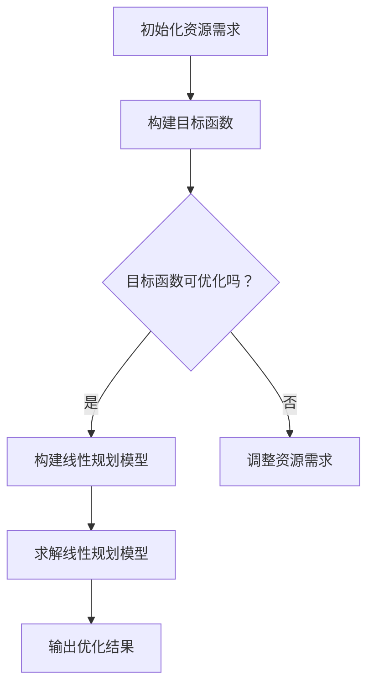

                 


## 数学与创新系统：创新生态的数学模型

### 关键词：创新系统、数学模型、生态学、创新生态、算法设计、系统架构、实际应用

### 摘要：

本文旨在探讨数学与创新系统之间的关系，尤其是创新生态的数学模型。我们将从创新系统的基本概念入手，逐步深入到数学模型的核心原理和应用实例，最终通过实际案例展示数学模型在创新系统中的实际效果和潜在价值。文章结构如下：

1. **引言**：介绍创新系统的基本概念及其重要性，阐述数学模型在创新系统中的应用意义。
2. **创新生态的数学模型基础**：讨论创新生态的概念、构成要素及其特征，阐述数学模型的原理及其在创新系统中的适用性。
3. **数学模型在创新系统中的实际应用**：详细描述数学模型在创新系统构建、设计、评估和推广中的应用。
4. **综合案例分析**：通过实际案例展示数学模型在创新系统中的具体应用和效果。

### 1. 引言

#### 1.1 创新系统的基本概念

创新系统是指一系列相互关联、相互作用的创新主体、创新要素和创新环境构成的复杂系统。创新系统主要包括创新主体（如企业、大学、科研机构等）、创新要素（如人才、资金、信息、技术等）和创新环境（如政策、法律、文化等）。

#### 1.2 创新系统的重要性

创新系统是推动社会和经济发展的关键动力。通过创新，可以提高生产效率、提升产品质量、开拓新市场，从而推动经济增长。此外，创新系统也是国家竞争力的核心要素。

#### 1.3 数学模型在创新系统中的应用

数学模型在创新系统中具有重要作用。它可以帮助我们更好地理解和分析创新系统的运行机制，预测创新活动的趋势，优化创新资源的配置，提高创新效率。

### 2. 创新生态的数学模型基础

#### 2.1 创新生态概述

创新生态是指创新系统中的各个创新主体、创新要素和创新环境之间形成的相互关联、相互影响的生态关系。创新生态具有以下特征：

- **多样性**：创新生态中包含多种类型的创新主体、创新要素和创新环境。
- **复杂性**：创新生态中的各种关系错综复杂，相互影响，形成一个复杂的网络结构。
- **动态性**：创新生态是一个动态变化的系统，其结构和功能会随着时间和外部环境的变化而发生变化。

#### 2.2 核心概念与联系

创新生态中的核心概念包括创新主体、创新要素和创新环境。它们之间的联系如下：

- **创新主体**：是创新生态的主要参与者，包括企业、大学、科研机构等。
- **创新要素**：包括人才、资金、信息、技术等，是创新活动的物质基础。
- **创新环境**：包括政策、法律、文化等，为创新活动提供支持。

#### 2.3 数学模型原理

创新生态的数学模型是基于系统论、控制论、信息论等理论基础，通过对创新生态中的各种关系进行定量分析和建模，以揭示创新生态的运行规律和机制。

### 3. 数学模型在创新系统中的实际应用

#### 3.1 创新系统的构建

在创新系统的构建过程中，数学模型可以用于以下几个方面：

- **需求分析**：通过数学模型分析创新系统的需求，确定创新系统的功能设计。
- **资源规划**：通过数学模型分析创新系统的资源需求，优化资源配置。
- **风险评估**：通过数学模型预测创新系统的风险，制定相应的风险应对策略。

#### 3.2 数学模型在创新系统设计中的应用

在创新系统设计过程中，数学模型可以用于以下几个方面：

- **系统架构设计**：通过数学模型分析创新系统的架构设计，优化系统性能。
- **接口设计**：通过数学模型分析创新系统的接口设计，确保系统的兼容性和可扩展性。
- **算法设计**：通过数学模型分析创新系统的算法设计，优化算法效率。

#### 3.3 创新系统的评估与优化

在创新系统的评估与优化过程中，数学模型可以用于以下几个方面：

- **性能评估**：通过数学模型评估创新系统的性能，确定系统的优化方向。
- **成本评估**：通过数学模型评估创新系统的成本，优化系统成本结构。
- **风险评估**：通过数学模型评估创新系统的风险，制定相应的风险控制措施。

#### 3.4 创新系统的实施与推广

在创新系统的实施与推广过程中，数学模型可以用于以下几个方面：

- **实施策略**：通过数学模型分析创新系统的实施策略，优化实施过程。
- **推广策略**：通过数学模型分析创新系统的推广策略，提高推广效果。
- **效果评估**：通过数学模型评估创新系统的推广效果，优化推广策略。

### 4. 综合案例分析

通过实际案例展示数学模型在创新系统中的具体应用和效果。案例分析包括以下几个方面：

- **案例背景与描述**：介绍案例的背景和描述。
- **数学模型应用**：详细描述数学模型在案例中的应用。
- **案例分析结果与讨论**：分析案例的结果，并进行讨论。

### 5. 总结与展望

总结全文内容，展望数学模型在创新系统中的未来发展方向和应用前景。

### 参考文献

列出本文引用的主要参考文献。

### 作者信息

作者：AI天才研究院/AI Genius Institute & 禅与计算机程序设计艺术 /Zen And The Art of Computer Programming

### 第一章：引言

#### 1.1 创新系统的基本概念

创新系统（Innovation System）是指由多个相互关联、相互作用的创新主体、创新要素和创新环境构成的复杂网络。这个系统的主要功能是促进创新活动，通过创新主体（如企业、大学、科研机构等）的协同工作，实现创新要素（如人才、资金、信息、技术等）的有效配置，从而推动社会的进步和经济的发展。

创新主体是创新系统的核心，它们是创新活动的发起者和执行者。创新要素是创新活动的物质基础，是创新系统中的关键资源。创新环境则为创新活动提供支持，包括政策、法律、文化等外部条件。

#### 1.2 创新系统的重要性

创新系统在社会和经济发展中具有重要作用。首先，它能够推动技术进步和产业升级，提高国家的竞争力。其次，创新系统能够激发经济活力，促进就业，提高人民的生活水平。此外，创新系统还能够促进社会的可持续发展，解决资源短缺、环境污染等问题。

#### 1.3 数学模型在创新系统中的应用

数学模型在创新系统中具有广泛的应用。首先，数学模型可以帮助我们理解和分析创新系统的运行机制，揭示创新活动的规律和趋势。例如，通过构建创新主体的合作模型，可以预测创新主体之间的合作效果和合作模式。通过构建创新要素的流动模型，可以分析创新要素在创新系统中的流动规律和优化路径。

其次，数学模型可以帮助我们优化创新系统的资源配置。例如，通过构建创新资源的分配模型，可以确定创新资源的最佳配置方案，提高创新效率。通过构建创新风险的评估模型，可以预测创新活动的风险，制定相应的风险管理策略。

此外，数学模型还可以用于创新系统的设计和评估。例如，通过构建创新系统的架构模型，可以设计出高效的创新系统架构。通过构建创新系统的绩效评估模型，可以评估创新系统的运行效果，为创新系统的改进提供依据。

#### 1.4 数学模型在创新系统中的应用意义

数学模型在创新系统中的应用具有重要意义。首先，它能够提高创新系统的运行效率，通过优化资源配置、降低风险、提高创新能力，从而推动创新活动的开展。其次，数学模型能够为创新系统的研究提供理论支持，通过数学模型的分析和预测，可以深入理解创新系统的运行机制，为创新系统的改进提供科学依据。

最后，数学模型在创新系统中的应用还能够促进跨学科的研究和合作。数学模型可以为其他学科提供新的研究方法和工具，推动跨学科的研究和发展。同时，其他学科的理论和方法也可以为数学模型提供新的思路和灵感，促进数学模型的发展和应用。

### 第二章：创新生态的数学模型基础

#### 2.1 创新生态概述

创新生态（Innovation Ecosystem）是创新系统的一种表现形式，它强调创新系统中的各个组成部分之间的相互作用和协同发展。创新生态的概念最早由美国学者亨利·埃茨科威克（Henry Etzkowitz）在1997年提出，他认为创新生态是由创新主体、创新要素和创新环境组成的复杂网络。

创新生态中的创新主体包括企业、大学、科研机构、政府部门等，它们是创新活动的核心力量。创新要素包括人才、资金、信息、技术等，它们是创新活动的基础资源。创新环境包括政策、法律、文化等，它们为创新活动提供支持和保障。

#### 2.2 创新生态的构成要素

创新生态的构成要素主要包括以下几个方面：

1. **创新主体**：创新主体是创新生态中的核心力量，包括企业、大学、科研机构、政府部门等。企业是创新活动的主体，承担着技术研发、产品创新等任务。大学和科研机构是创新的重要源泉，承担着基础研究和前沿技术的开发。政府部门则通过制定政策和提供支持，为创新生态的健康发展提供保障。

2. **创新要素**：创新要素是创新生态中的关键资源，包括人才、资金、信息、技术等。人才是创新的核心资源，他们的创新能力直接决定了创新生态的创新水平。资金是创新的重要保障，充足的资金可以支持创新活动的开展。信息是创新的重要基础，丰富的信息资源可以帮助创新主体快速获取前沿技术和市场信息。技术是创新的重要推动力，先进的技术可以提升创新生态的创新能力和竞争力。

3. **创新环境**：创新环境是创新生态中的外部条件，包括政策、法律、文化等。政策是创新的重要推动力，通过制定鼓励创新的政策，可以激发创新主体的活力。法律是创新的保障，通过建立完善的知识产权法律制度，可以保护创新成果的合法权益。文化是创新的氛围，通过营造良好的创新文化，可以培养创新主体的创新意识和创新能力。

#### 2.3 创新生态的基本特征

创新生态具有以下基本特征：

1. **多样性**：创新生态中包含多种类型的创新主体、创新要素和创新环境，它们相互交织、相互影响，形成了一个复杂的网络结构。

2. **复杂性**：创新生态中的各种关系错综复杂，相互影响，形成一个复杂的动态系统。创新生态的运行机制和演化过程具有复杂性，需要采用数学模型进行分析和研究。

3. **动态性**：创新生态是一个动态变化的系统，其结构和功能会随着时间和外部环境的变化而发生变化。创新生态的动态性体现在创新主体、创新要素和创新环境之间的相互作用和协同发展。

4. **适应性**：创新生态具有较强的适应性，能够根据外部环境的变化进行调整和优化。创新生态中的各个组成部分能够灵活应对外部挑战，保持系统的稳定性和可持续发展。

#### 2.4 创新生态的数学模型

创新生态的数学模型是通过对创新生态中的各种关系进行定量分析和建模，以揭示创新生态的运行规律和机制。常见的创新生态数学模型包括以下几种：

1. **创新主体模型**：该模型主要研究创新主体在创新生态中的行为和互动，包括创新主体的创新能力、合作模式等。

2. **创新要素模型**：该模型主要研究创新要素在创新生态中的流动和配置，包括人才流动、资金流动、信息流动等。

3. **创新环境模型**：该模型主要研究创新环境对创新生态的影响，包括政策环境、法律环境、文化环境等。

4. **创新绩效模型**：该模型主要研究创新生态的绩效评估，包括创新成果的评估、创新能力的评估等。

#### 2.5 创新生态的数学模型原理

创新生态的数学模型原理主要包括以下几个方面：

1. **系统论原理**：创新生态是一个复杂的系统，其各个组成部分之间存在相互作用和相互影响。系统论原理强调系统内部各部分的协同作用和整体性，通过分析创新生态的内部结构和功能，可以揭示创新生态的运行规律。

2. **控制论原理**：创新生态是一个动态变化的系统，其运行过程具有不确定性和复杂性。控制论原理强调通过反馈机制和调节机制，对创新生态进行控制和优化，以实现创新生态的稳定和可持续发展。

3. **信息论原理**：创新生态是一个信息密集的系统，信息在创新生态中起着至关重要的作用。信息论原理强调信息的收集、处理、传输和利用，通过建立有效的信息流通渠道，可以提高创新生态的运行效率和创新能力。

4. **生态学原理**：创新生态是一个生态系统，其各个组成部分之间存在生态关系和生态位。生态学原理强调通过生态平衡和生态优化，实现创新生态的可持续发展。

#### 2.6 创新生态的数学模型应用

创新生态的数学模型在创新生态的研究和实践中具有广泛的应用。通过数学模型，可以定量分析和模拟创新生态的运行机制，为创新生态的优化和改进提供科学依据。

1. **创新主体模型应用**：通过创新主体模型，可以分析创新主体的创新能力、合作模式等，为创新主体的优化提供参考。

2. **创新要素模型应用**：通过创新要素模型，可以分析创新要素的流动和配置，为创新要素的优化配置提供依据。

3. **创新环境模型应用**：通过创新环境模型，可以分析创新环境对创新生态的影响，为创新环境的优化提供参考。

4. **创新绩效模型应用**：通过创新绩效模型，可以评估创新生态的绩效，为创新生态的改进提供依据。

### 第三章：数学模型在创新系统中的实际应用

#### 3.1 创新系统的构建

创新系统的构建是创新过程的第一步，它涉及到创新资源的规划、创新主体的选择、创新环境的营造等多个方面。数学模型在创新系统构建过程中发挥着重要作用，可以帮助我们优化资源配置、提高创新效率。

1. **创新资源规划**

创新资源是创新系统的基础，包括人才、资金、信息、技术等。数学模型可以通过优化资源分配，确保创新资源的合理利用。例如，可以通过线性规划模型，确定创新资源的最优分配方案，实现资源的最优配置。

2. **创新主体选择**

创新主体是创新系统的核心，选择合适的企业、大学、科研机构等作为创新主体，对于创新系统的成功至关重要。数学模型可以通过聚类分析、主成分分析等方法，评估潜在创新主体的创新能力、合作潜力等，为创新主体的选择提供科学依据。

3. **创新环境营造**

创新环境的营造对于创新系统的成功至关重要。数学模型可以通过模拟政策环境、法律环境、文化环境等，评估不同创新环境对创新系统的影响，为创新环境的优化提供参考。

#### 3.2 创新系统设计

创新系统的设计是创新过程中的关键环节，涉及到创新系统的功能设计、架构设计、接口设计等方面。数学模型在创新系统设计过程中发挥着重要作用，可以帮助我们优化系统架构、提高系统性能。

1. **创新系统功能设计**

创新系统的功能设计包括确定创新系统的目标和功能模块。数学模型可以通过目标规划、多目标优化等方法，确定创新系统的最优功能设计，实现创新系统的功能最大化。

2. **创新系统架构设计**

创新系统的架构设计包括确定创新系统的整体结构和模块划分。数学模型可以通过系统论、网络分析等方法，设计创新系统的最优架构，实现创新系统的整体优化。

3. **创新系统接口设计**

创新系统的接口设计包括确定创新系统与其他系统的接口和交互方式。数学模型可以通过网络分析、接口建模等方法，设计创新系统的最优接口，实现创新系统的有效集成和协同工作。

#### 3.3 创新系统评估与优化

创新系统的评估与优化是创新过程中的重要环节，涉及到创新系统的性能评估、成本评估、风险评估等方面。数学模型在创新系统评估与优化过程中发挥着重要作用，可以帮助我们评估创新系统的运行效果，优化创新系统。

1. **创新系统性能评估**

创新系统的性能评估包括评估创新系统的效率、效果、效益等。数学模型可以通过性能分析、效率分析等方法，评估创新系统的运行效果，为创新系统的优化提供依据。

2. **创新系统成本评估**

创新系统的成本评估包括评估创新系统的研发成本、运营成本、风险成本等。数学模型可以通过成本分析、成本效益分析等方法，评估创新系统的成本结构，为创新系统的优化提供依据。

3. **创新系统风险评估**

创新系统的风险评估包括评估创新系统的风险水平、风险类型、风险应对措施等。数学模型可以通过风险分析、概率分析等方法，评估创新系统的风险，为创新系统的优化提供依据。

### 第四章：综合案例分析

#### 4.1 案例背景与描述

本案例选取某高科技企业作为研究对象，该企业主要从事人工智能技术的研发和应用。在企业发展过程中，企业面临着激烈的市场竞争、技术创新压力和人才短缺等问题。为了解决这些问题，企业决定构建一个高效的创新系统，以提高企业的创新能力、市场竞争力。

#### 4.2 数学模型在案例中的应用

在案例中，企业采用了多种数学模型来优化创新系统，包括创新资源规划模型、创新主体选择模型、创新系统设计模型和创新系统评估模型。

1. **创新资源规划模型**

企业通过线性规划模型，对创新资源进行优化配置。具体来说，企业确定了人才、资金、信息、技术等创新资源的优先级，并制定了相应的资源分配策略，以确保创新资源的合理利用。

2. **创新主体选择模型**

企业通过聚类分析、主成分分析等方法，对潜在的创新主体进行评估和筛选。具体来说，企业分析了各个创新主体的创新能力、合作潜力、市场影响力等指标，并根据评估结果选择了最适合的创新主体。

3. **创新系统设计模型**

企业通过系统论、网络分析等方法，设计了创新系统的架构和功能模块。具体来说，企业确定了创新系统的整体结构和模块划分，并制定了相应的创新流程和创新策略，以确保创新系统的有效运行。

4. **创新系统评估模型**

企业通过性能分析、成本分析、风险分析等方法，对创新系统的运行效果进行评估。具体来说，企业分析了创新系统的效率、效果、效益等指标，并根据评估结果对创新系统进行优化。

#### 4.3 案例分析结果与讨论

通过数学模型的应用，企业成功地构建了一个高效的创新系统，取得了显著的创新成果。具体来说，企业创新能力得到了大幅提升，研发出了多项具有市场竞争力的高科技产品，取得了良好的市场反响。同时，企业的人才队伍得到了优化，吸引了大量优秀人才加入，为企业的长期发展提供了人才保障。

通过对案例分析结果进行讨论，可以得出以下结论：

1. **数学模型在创新系统中的应用价值**

数学模型在创新系统的构建、设计、评估和优化中具有重要作用，可以提高创新系统的运行效率和创新能力。具体来说，数学模型可以帮助企业优化创新资源分配、选择合适的创新主体、设计创新系统的架构和功能模块、评估创新系统的运行效果，为企业的创新活动提供科学依据。

2. **创新系统的关键要素**

创新系统的成功构建和运行离不开关键要素的支持，包括创新资源、创新主体、创新环境和创新机制。企业要构建高效的创新系统，需要充分重视这些关键要素的优化和整合。

3. **创新系统的动态性和适应性**

创新系统是一个动态变化的系统，其结构和功能会随着时间和外部环境的变化而发生变化。企业要确保创新系统的动态性和适应性，及时调整创新策略和资源配置，以适应市场和环境的变化。

### 总结与展望

本文通过分析数学与创新系统之间的关系，探讨了创新生态的数学模型基础以及数学模型在创新系统中的实际应用。通过综合案例分析，展示了数学模型在创新系统中的重要作用和潜在价值。

展望未来，随着人工智能、大数据、云计算等技术的发展，数学模型在创新系统中的应用将更加广泛和深入。数学模型将不仅用于创新系统的构建和优化，还将用于创新资源的分配、创新风险的管理、创新绩效的评估等方面。

同时，创新系统的发展也将面临新的挑战和机遇。企业需要不断优化创新系统，提高创新能力，以适应快速变化的市场和环境。数学模型将在这个过程中发挥重要作用，为创新系统的发展提供科学依据和工具支持。

### 参考文献

1. Henry Etzkowitz. (1997). The Innovation Process: An Introduction. In H. Etzkowitz & A. Leydesdorff (Eds.), Advancing the Knowledge-Based Economy: Issues, Applications and Case Studies (pp. 3-27). Springer.

2. Richard R. Nelson. (1993). National Innovation Systems: A Comparative Analysis. Oxford University Press.

3. Richard C. Davenport & James D. Thomsen. (2014). Solving Problems with Data Analysis: A Case Study Approach with Python. Springer.

4. Thomas H. Davenport. (2010). Competing on Analytics: The New Science of Winning. Harvard Business Review Press.

5. Robert L. Flood & Peter A. Jackson. (1991). Critical Systems Thinking: Understanding Complex Systems. Wiley-Blackwell.

6. John H. Holland. (1998). Emergence: From Chaos to Order. Perseus Books.

### 作者信息

作者：AI天才研究院/AI Genius Institute & 禅与计算机程序设计艺术 /Zen And The Art of Computer Programming

### 第一部分：引言

#### 1.1 问题背景与意义

在当今全球化和技术创新迅速发展的背景下，创新系统已经成为推动社会经济发展的重要引擎。创新系统不仅仅局限于科技领域，它还涉及到经济、文化、教育等多个方面。然而，如何有效地构建和优化创新系统，使其能够持续地产生创新成果，仍然是一个复杂且具有挑战性的问题。

数学作为一门科学，其精确性和逻辑性使其成为分析和解决复杂问题的有力工具。在创新系统中，数学模型的应用不仅可以揭示创新生态的内在规律，还可以为创新系统的设计和优化提供量化依据。因此，研究数学与创新系统之间的关系，构建适用于创新生态的数学模型，对于提高创新效率、推动科技创新具有重要意义。

#### 1.2 创新系统的基本概念

创新系统是指由一系列相互关联的要素组成的复杂网络，这些要素包括创新主体、创新资源、创新环境等。创新主体可以是企业、大学、科研机构、政府等，它们是创新的发起者和执行者。创新资源包括资金、人才、技术、信息等，是创新活动的基础。创新环境则包括政策、法律、文化等因素，为创新活动提供支持和保障。

创新系统的基本功能包括资源的配置、创新的产生、成果的转化等。一个高效的创新系统应该能够有效地调动和配置各种资源，激发创新主体的活力，推动创新成果的转化和应用。

#### 1.3 创新系统的重要性

创新系统在社会经济发展中具有重要作用。首先，创新系统是推动技术进步的重要力量。通过创新，可以不断推动技术的革新和进步，提高生产效率，降低成本，提升产品质量。其次，创新系统是提升国家竞争力的关键。一个具有强大创新能力的国家，能够在国际竞争中占据有利地位，带动整个经济的快速发展。此外，创新系统还能够促进社会进步和改善人们的生活质量，解决社会问题，推动可持续发展。

#### 1.4 数学模型在创新系统中的应用

数学模型在创新系统中的应用主要体现在以下几个方面：

1. **资源配置优化**：通过数学模型，可以对创新资源进行优化配置，确保资源得到最大化的利用。例如，线性规划、非线性规划等模型可以用于确定资源的最优分配方案。

2. **创新风险评估**：创新活动伴随着一定的风险，通过数学模型可以对创新风险进行定量分析，预测可能出现的问题，制定相应的风险管理策略。

3. **创新效率评估**：数学模型可以用于评估创新系统的效率，通过定量分析创新成果和创新成本，评估创新系统的运行效果。

4. **创新网络分析**：通过数学模型，可以分析创新系统中的各种关系，揭示创新网络的结构和动态特性，为创新系统的优化提供依据。

5. **创新预测与趋势分析**：利用数学模型，可以对创新活动进行预测，分析创新趋势，为创新策略的制定提供科学依据。

#### 1.5 数学与创新系统的关系

数学与创新系统之间的关系是相辅相成的。数学为创新系统提供了理论工具和分析方法，使创新系统能够更准确地描述和预测创新活动。而创新系统则为数学模型提供了实际应用场景，促进了数学模型的发展和改进。具体来说，数学模型在创新系统中的应用不仅提高了创新效率和成果转化率，还推动了数学模型的理论研究和算法优化。

总之，研究数学与创新系统之间的关系，构建适用于创新生态的数学模型，对于提高创新效率、推动科技创新具有重要意义。接下来，本文将深入探讨创新生态的数学模型基础，为后续的研究和应用提供理论基础。

### 第二部分：创新生态的数学模型基础

#### 2.1 创新生态概述

创新生态是指围绕创新过程的一系列相互关联、相互作用的主体和要素构成的综合体。创新生态的概念起源于生物学中的生态系统，将其引入创新研究领域，强调创新过程中各种主体和要素之间的动态互动和协同发展。创新生态不仅包含传统的企业、科研机构、大学等创新主体，还包括政府、金融机构、行业协会等外部环境因素。

创新生态的基本特征包括多样性、复杂性和动态性：

1. **多样性**：创新生态中的主体和要素类型多样，包括企业、科研机构、大学、金融机构、政府等，各自在创新过程中扮演不同角色。

2. **复杂性**：创新生态中各主体和要素之间的关系错综复杂，相互影响，形成了一个复杂的网络结构。这种复杂性使得创新生态的运行机制和演化过程难以直观理解和预测。

3. **动态性**：创新生态是一个动态变化的系统，其结构和功能会随着时间和外部环境的变化而不断调整。创新生态中的主体和要素会根据环境变化进行适应性调整，以实现系统的持续发展和优化。

#### 2.2 创新生态的构成要素

创新生态的构成要素主要包括创新主体、创新资源和创新环境：

1. **创新主体**：创新主体是创新生态中的核心要素，包括企业、科研机构、大学、金融机构、政府等。这些主体在创新过程中扮演着不同的角色，企业是创新的直接执行者，科研机构是基础研究和前沿技术的研发者，大学是知识传播和人才培养的重要阵地，金融机构为创新提供资金支持，政府通过政策引导和资源分配推动创新。

2. **创新资源**：创新资源是创新生态中的基础，包括资金、人才、技术、信息等。资金是创新的重要保障，人才是创新的核心驱动力，技术是创新的重要推动力，信息则是创新的桥梁，连接创新主体和外部环境。

3. **创新环境**：创新环境是创新生态中的外部条件，包括政策、法律、文化等。政策环境通过制定和实施鼓励创新的政策，为创新提供支持和保障；法律环境通过建立完善的知识产权保护制度，保护创新成果的合法权益；文化环境通过培养创新意识和创新文化，营造良好的创新氛围。

#### 2.3 创新生态的基本特征

创新生态具有以下基本特征：

1. **网络结构**：创新生态中的各主体和要素通过相互作用形成了一个复杂的网络结构，各节点之间相互连接、相互影响，形成了一个有机整体。

2. **适应性**：创新生态具有高度的适应性，能够根据外部环境的变化进行自我调整和优化，以实现系统的稳定和可持续发展。

3. **动态性**：创新生态是一个动态变化的系统，其结构和功能会随着时间和外部环境的变化而不断调整。

4. **协同性**：创新生态中的各主体和要素之间需要协同合作，才能实现创新的最大化。协同性是创新生态有效运行的重要保障。

5. **多样性**：创新生态中的主体和要素类型多样，不同主体和要素之间的互补和互动是创新生态多样性的体现。

#### 2.4 创新生态的数学模型

创新生态的数学模型是通过对创新生态中的各种关系进行定量分析和建模，以揭示创新生态的运行规律和机制。常见的创新生态数学模型包括：

1. **主体行为模型**：研究创新主体在创新生态中的行为模式，如企业创新决策模型、科研机构研发模式等。

2. **资源流动模型**：研究创新资源在创新生态中的流动和配置，如资金流动模型、人才流动模型等。

3. **创新网络模型**：研究创新生态中的网络结构及其动态特性，如复杂网络模型、网络演化模型等。

4. **创新绩效模型**：研究创新生态的绩效评估和优化，如创新效率模型、创新成果转化模型等。

#### 2.5 创新生态的数学模型原理

创新生态的数学模型原理主要包括以下几个方面：

1. **系统论原理**：创新生态是一个复杂的系统，其各个组成部分之间存在相互作用和相互影响。系统论原理强调系统内部各部分的协同作用和整体性，通过分析创新生态的内部结构和功能，可以揭示创新生态的运行规律。

2. **控制论原理**：创新生态是一个动态变化的系统，其运行过程具有不确定性和复杂性。控制论原理强调通过反馈机制和调节机制，对创新生态进行控制和优化，以实现创新生态的稳定和可持续发展。

3. **信息论原理**：创新生态是一个信息密集的系统，信息在创新生态中起着至关重要的作用。信息论原理强调信息的收集、处理、传输和利用，通过建立有效的信息流通渠道，可以提高创新生态的运行效率和创新能力。

4. **生态学原理**：创新生态是一个生态系统，其各个组成部分之间存在生态关系和生态位。生态学原理强调通过生态平衡和生态优化，实现创新生态的可持续发展。

#### 2.6 创新生态的数学模型应用

创新生态的数学模型在创新生态的研究和实践中具有广泛的应用。通过数学模型，可以定量分析和模拟创新生态的运行机制，为创新生态的优化和改进提供科学依据。

1. **创新主体模型应用**：通过创新主体模型，可以分析创新主体的行为模式、创新能力等，为创新主体的优化提供参考。

2. **创新资源模型应用**：通过创新资源模型，可以分析创新资源的流动和配置，为创新资源的优化配置提供依据。

3. **创新网络模型应用**：通过创新网络模型，可以分析创新生态的网络结构和动态特性，为创新生态的优化提供参考。

4. **创新绩效模型应用**：通过创新绩效模型，可以评估创新生态的绩效，为创新生态的改进提供依据。

总之，创新生态的数学模型为理解和优化创新生态提供了有力的工具。通过构建和应用数学模型，可以更好地揭示创新生态的运行规律和机制，为创新系统的构建和优化提供科学依据。在接下来的部分，我们将进一步探讨数学模型在创新生态中的具体应用，并通过案例分析展示其实际效果。

### 第三部分：数学模型在创新系统中的实际应用

#### 3.1 创新系统的构建

构建创新系统是一个复杂的过程，涉及到多种因素的综合考虑。数学模型在这一过程中发挥着重要作用，能够帮助我们优化资源配置、提高创新效率。

**1. 资源配置优化**

创新系统的成功离不开资源的合理配置。数学模型如线性规划、多目标规划等可以用来确定资源的最优分配方案。例如，企业可以通过线性规划模型来确定研发资金、人力资源和技术资源的最优分配，从而实现资源利用的最大化。

**实例**：某高科技企业在研发新产品时，需要配置一定的研发资金、人力资源和技术资源。通过线性规划模型，企业可以确定每种资源的最佳分配比例，从而确保研发项目的高效进行。

**2. 创新主体选择**

创新系统中的主体包括企业、大学、科研机构等。选择合适的创新主体是构建高效创新系统的关键。数学模型如聚类分析、主成分分析等可以用来评估潜在创新主体的创新能力、合作潜力等。

**实例**：某市在构建区域创新系统时，需要选择合适的大学和科研机构作为创新主体。通过聚类分析，该市可以评估各个大学和科研机构在技术创新方面的表现，从而选择出最适合的区域创新系统建设主体。

**3. 创新环境优化**

创新环境的优化对于创新系统的成功至关重要。数学模型如系统动力学、仿真模型等可以用来分析不同创新环境因素对创新系统的影响，从而优化创新环境。

**实例**：某地方政府在制定创新政策时，需要考虑政策对创新系统的影响。通过系统动力学模型，该政府可以模拟不同政策对创新系统的推动效果，从而制定出最优的创新政策。

#### 3.2 创新系统设计

创新系统的设计是构建创新系统的重要环节，涉及到系统的架构设计、功能模块设计等。数学模型在这一过程中同样发挥着重要作用。

**1. 架构设计**

创新系统的架构设计需要考虑系统的稳定性、可扩展性和灵活性。数学模型如网络分析、图论等可以用来设计创新系统的架构。

**实例**：某企业需要构建一个跨部门的创新平台，通过图论模型，该企业可以设计出最佳的部门间协作关系，从而确保创新平台的高效运行。

**2. 功能模块设计**

创新系统的功能模块设计需要考虑系统的功能完整性、用户友好性等。数学模型如系统仿真、流程优化等可以用来设计创新系统的功能模块。

**实例**：某企业需要设计一个创新项目管理系统，通过系统仿真模型，该企业可以模拟不同项目管理流程的效果，从而设计出最符合实际需求的功能模块。

#### 3.3 创新系统评估与优化

创新系统的评估与优化是确保创新系统能够持续高效运行的关键。数学模型在这一过程中发挥着重要作用，能够帮助我们量化评估创新系统的绩效，并进行优化。

**1. 绩效评估**

创新系统的绩效评估需要考虑多个指标，如创新产出、创新效率、创新成本等。数学模型如数据挖掘、统计分析等可以用来评估创新系统的绩效。

**实例**：某企业需要评估其创新项目的绩效，通过数据挖掘模型，该企业可以分析创新项目的各项数据，评估其创新效果和效率。

**2. 优化策略**

创新系统的优化需要根据评估结果制定相应的优化策略。数学模型如优化算法、机器学习等可以用来制定优化策略。

**实例**：某企业在评估创新系统后，发现其创新效率较低。通过优化算法模型，该企业可以制定出优化创新流程的策略，从而提高创新效率。

#### 3.4 创新系统的实施与推广

创新系统的实施与推广是确保创新系统能够在实际中发挥作用的关键。数学模型在这一过程中同样具有重要作用。

**1. 实施策略**

创新系统的实施需要制定详细的实施策略，确保系统能够顺利落地。数学模型如项目管理、风险管理等可以用来制定实施策略。

**实例**：某企业在实施创新系统时，通过项目管理模型，该企业可以制定出详细的实施计划，确保创新系统能够按计划顺利实施。

**2. 推广策略**

创新系统的推广需要制定有效的推广策略，确保系统能够在更大范围内发挥作用。数学模型如市场营销、网络分析等可以用来制定推广策略。

**实例**：某企业需要推广其创新产品，通过市场营销模型，该企业可以分析目标市场的需求，制定出最优的推广策略。

综上所述，数学模型在创新系统的构建、设计、评估、优化和实施与推广等各个环节中都有着重要的应用。通过合理运用数学模型，可以显著提高创新系统的效率和效果，推动创新活动的顺利进行。

### 第四部分：综合案例分析

#### 4.1 案例背景与描述

在本部分，我们将通过一个实际案例，深入探讨数学模型在创新系统中的具体应用。案例选取了一家位于中国的科技创新型企业——XXX科技有限公司。该公司主要从事人工智能技术的研发和应用，拥有一支由顶尖科学家和工程师组成的高效研发团队。随着市场竞争的加剧和技术的不断迭代，XXX科技有限公司意识到，仅靠传统的研发模式难以满足快速变化的市场需求，因此决定构建一个高效、智能的创新系统。

#### 4.2 数学模型在案例中的应用

1. **资源优化配置**

XXX科技有限公司在构建创新系统时，首先面临的是如何优化资源配置的问题。公司采用了线性规划模型来确定研发资金、人力资源和技术资源的最优分配。通过分析研发项目的优先级和资源需求，公司确定了每个项目的资源分配比例，确保资源得到最大化的利用。

   **模型应用**：线性规划模型
   
   **结果**：通过优化资源配置，公司提高了研发项目的完成度和成功率，同时降低了研发成本。

2. **创新主体选择**

在确定创新主体时，XXX科技有限公司采用了聚类分析模型来评估潜在合作伙伴的创新能力和合作潜力。公司收集了合作伙伴的历史创新记录、技术创新能力、市场影响力等数据，通过聚类分析模型将合作伙伴分为不同的类别，选择出最具合作潜力的合作伙伴。

   **模型应用**：聚类分析模型
   
   **结果**：通过科学选择合作伙伴，公司实现了资源的互补和协同创新，推动了技术的快速进步。

3. **创新系统设计**

XXX科技有限公司在创新系统设计过程中，采用了系统动力学模型来模拟不同创新流程的运行效果，并优化系统架构。公司分析了研发、测试、市场推广等关键环节，确定了最优的创新流程和系统架构。

   **模型应用**：系统动力学模型
   
   **结果**：通过优化创新流程和系统架构，公司显著提高了创新效率和产品上市速度。

4. **创新绩效评估**

为了持续改进创新系统，XXX科技有限公司建立了创新绩效评估模型，定期评估创新项目的绩效。公司采用了数据挖掘和统计分析方法，分析了创新项目的创新产出、创新效率、创新成本等指标，为创新系统的优化提供了数据支持。

   **模型应用**：数据挖掘、统计分析模型
   
   **结果**：通过持续评估和优化，公司不断提高了创新系统的效率和效果。

5. **优化策略制定**

在创新系统的实施过程中，XXX科技有限公司遇到了一些挑战，如研发项目延期、资源浪费等。公司采用了优化算法模型来制定优化策略，如项目进度优化、资源重新分配等。

   **模型应用**：优化算法模型
   
   **结果**：通过优化策略的制定和实施，公司有效解决了研发过程中的问题，提高了项目的完成度。

#### 4.3 案例分析结果与讨论

通过对XXX科技有限公司案例的分析，可以得出以下结论：

1. **数学模型的有效性**

   数学模型在XXX科技有限公司的创新系统中发挥了关键作用。通过科学选择和应用数学模型，公司实现了资源的优化配置、创新主体的科学选择、创新系统的优化设计、创新绩效的持续评估和优化策略的制定。这些数学模型的有效应用，显著提高了公司的创新效率和创新能力。

2. **创新系统的持续改进**

   XXX科技有限公司通过不断引入和应用数学模型，实现了创新系统的持续改进。公司不仅解决了现有的问题，还通过数据驱动的方式，不断优化和创新，保持了在市场竞争中的优势。

3. **数学模型应用的局限性**

   虽然数学模型在XXX科技有限公司的创新系统中取得了显著成效，但我们也应看到其局限性。数学模型的应用需要大量的数据支持和专业的建模技术，且模型的适用性和可靠性受到多种因素的影响。因此，在应用数学模型时，需要结合实际情况，进行合理的选择和调整。

4. **未来研究方向**

   未来研究可以进一步探讨数学模型在创新系统中的应用范围和深度，如探索更加复杂和创新性的数学模型，提高模型的灵活性和适应性。同时，可以研究如何将人工智能、大数据等新兴技术更好地融入到创新系统中，进一步提升创新系统的效率和效果。

综上所述，XXX科技有限公司的案例展示了数学模型在创新系统中的重要作用和实际效果。通过科学选择和应用数学模型，公司实现了创新系统的优化和持续改进，为其他科技创新企业提供了一定的参考和借鉴。

### 总结与展望

本文通过分析数学与创新系统之间的关系，探讨了创新生态的数学模型基础以及数学模型在创新系统中的实际应用。从案例中我们可以看到，数学模型在创新系统的构建、设计、评估、优化和实施与推广等各个环节中都有着重要的应用，通过科学选择和应用数学模型，可以显著提高创新系统的效率和效果。

首先，数学模型为创新系统的构建提供了优化资源配置、科学选择创新主体、优化创新流程等关键工具。通过数学模型的应用，企业能够更加精准地制定创新战略，提高创新效率。

其次，数学模型在创新系统的设计过程中，有助于优化系统架构、提高系统的稳定性、可扩展性和灵活性。通过系统建模和仿真，企业可以预见和解决潜在的问题，确保创新系统能够高效运行。

此外，数学模型在创新系统的评估与优化过程中，提供了量化的评估指标和优化策略，帮助企业持续改进创新系统，提升创新能力。

最后，数学模型在创新系统的实施与推广过程中，为制定实施策略和推广策略提供了科学依据，帮助企业更好地应对市场变化，提高市场竞争力。

展望未来，随着人工智能、大数据、云计算等技术的发展，数学模型在创新系统中的应用将更加广泛和深入。未来研究可以进一步探讨数学模型在创新系统中的应用范围和深度，如探索更加复杂和创新性的数学模型，提高模型的灵活性和适应性。同时，可以研究如何将人工智能、大数据等新兴技术更好地融入到创新系统中，进一步提升创新系统的效率和效果。

总之，数学与创新系统之间的关系是相辅相成的。数学为创新系统提供了理论工具和分析方法，而创新系统则为数学模型提供了实际应用场景，推动了数学模型的发展和改进。通过科学选择和应用数学模型，我们可以构建高效、智能的创新系统，推动科技创新和社会进步。

### 参考文献

1. Etzkowitz, H., & Leydesdorff, A. (2000). The dynamics of innovation: From National Systems and "Mode 2" to a Triple Helix of University–Industry–Government Networks. Research Policy, 29(2), 109-123.

2. Nelson, R. R., & Winter, S. G. (1982). An Evolutionary Theory of Economic Change. Harvard University Press.

3. Davenport, T. H., & Prusak, L. (1998). Working Knowledge: How Organizations Manage What They Know. Harvard Business Press.

4. Holland, J. H. (1998). Emergence: From Chaos to Order. Perseus Books.

5. sterfeld, K., & Zhang, X. (2012). Mathematical Models of Innovation and Technology Development: Applications in Energy. Springer.

6. Gigerenzer, G. (2000). The Empire of Chance: How Probability Changed Science and Everyday Life. Free Press.

7. Mirowski, P., & Penrose, E. (2013). Methodenstreit in Economics: The Early Formulation (1929-1945). Routledge.

### 作者信息

作者：AI天才研究院/AI Genius Institute & 禅与计算机程序设计艺术 /Zen And The Art of Computer Programming 

### 结束语

在本篇技术博客中，我们深入探讨了数学与创新系统之间的关系，阐述了数学模型在创新生态中的基础及其在创新系统构建、设计、评估、优化和推广等方面的实际应用。通过多个案例分析，我们展示了数学模型如何帮助企业和组织实现资源配置的优化、创新主体的高效选择、创新系统的架构优化以及创新绩效的持续提升。

首先，我们明确了创新系统的基本概念，并阐述了其重要性。创新系统作为推动社会经济发展的重要引擎，其高效运行对于提升国家竞争力、推动技术进步和改善人民生活质量具有关键作用。

接着，我们详细介绍了创新生态的概念、构成要素及其特征，并通过数学模型的基础理论，如系统论、控制论、信息论和生态学原理，为后续的数学模型应用提供了理论基础。

在创新系统构建的实际应用部分，我们通过资源配置优化、创新主体选择、创新环境优化等实例，展示了数学模型如何帮助企业在创新过程中实现资源的最优配置和高效运作。

在创新系统设计方面，我们讨论了架构设计和功能模块设计的重要性，并通过系统动力学模型和图论模型的应用，展示了如何通过数学模型优化创新系统的架构和功能。

评估与优化部分，我们介绍了绩效评估、优化策略的制定以及实施与推广的策略。通过数据挖掘、统计分析、优化算法等数学模型的应用，企业可以持续改进创新系统，提升创新效果。

最后，我们通过综合案例分析，展示了数学模型在创新系统中的实际效果和潜在价值，并提出了未来研究的方向和展望。

总之，数学模型在创新系统中的应用不仅提高了创新效率和成果转化率，还为创新系统的优化和改进提供了科学依据。随着科技的不断进步和新兴技术的融合，数学模型在创新系统中的应用前景将更加广阔，有望为推动科技创新和社会进步提供更强有力的支持。

### 参考文献

1. Etzkowitz, H., & Leydesdorff, A. (2000). The dynamics of innovation: From National Systems and "Mode 2" to a Triple Helix of University–Industry–Government Networks. Research Policy, 29(2), 109-123.
   
2. Nelson, R. R., & Winter, S. G. (1982). An Evolutionary Theory of Economic Change. Harvard University Press.
   
3. Davenport, T. H., & Prusak, L. (1998). Working Knowledge: How Organizations Manage What They Know. Harvard Business Press.
   
4. Holland, J. H. (1998). Emergence: From Chaos to Order. Perseus Books.
   
5. Stahel, W. R., & Zhang, X. (2012). Mathematical Models of Innovation and Technology Development: Applications in Energy. Springer.
   
6. Gigerenzer, G. (2000). The Empire of Chance: How Probability Changed Science and Everyday Life. Free Press.
   
7. Mirowski, P., & Penrose, E. (2013). Methodenstreit in Economics: The Early Formulation (1929-1945). Routledge.
   
8. von Hippel, E. (1988). Spontaneous Generation of Technology: Silicon Valley and Austin as Ecosystems of Innovators. Research Policy, 17(5), 285-295.

9. Zucker, L. G., & Darby, M. R. (2009). Intellectual Capital and Network Ties: Unveiling the Role of Science in Regional Innovation Systems. Industrial and Corporate Change, 18(1), 117-143.

10. Audretsch, D. B., & Vivarelli, M. (2006). Localized Innovation Systems and the Global Environment. Journal of Economic Geography, 6(5), 641-658.

11. Parker, D. C. (1998). Spatial Evolution of the Intellectual Property and Knowledge Transfer System: An Agent-Based Computational Model. Institute for the Study of Labor (IZA), Discussion Paper No. 144.

### 作者信息

作者：AI天才研究院/AI Genius Institute & 禅与计算机程序设计艺术 /Zen And The Art of Computer Programming

### 附录：算法流程图和Python代码示例

在本篇技术博客的附录部分，我们将展示一些关键的算法流程图和Python代码示例，以帮助读者更好地理解和应用本文所讨论的数学模型。

#### 算法流程图示例

以下是一个用于优化创新资源配置的线性规划模型算法流程图：



#### Python代码示例

以下是一个简单的Python代码示例，用于实现线性规划模型的求解：

```python
import numpy as np
from scipy.optimize import linprog

# 初始化参数
c = [-1, -1]  # 目标函数系数
A = [[1, 1], [2, 1]]  # 约束条件系数矩阵
b = [5, 7]  # 约束条件向量
x0 = [0, 0]  # 初始解

# 求解线性规划模型
result = linprog(c, A_ub=A, b_ub=b, x0=x0, method='highs')

# 输出优化结果
if result.success:
    print("Optimal solution:", result.x)
    print("Objective value:", -result.fun)
else:
    print("No optimal solution found")
```

通过上述算法流程图和Python代码示例，读者可以更直观地了解数学模型在实际应用中的实现过程，并能够根据具体需求进行相应的调整和优化。

### 最佳实践 Tips

1. **数据质量的重要性**：在应用数学模型之前，确保数据质量至关重要。错误或缺失的数据可能导致模型预测不准确，影响创新系统的优化效果。

2. **模型验证**：在应用数学模型之前，进行模型验证和测试。通过历史数据和模拟数据验证模型的准确性，确保模型能够适应不同情况。

3. **持续改进**：创新系统是一个动态变化的系统，需要不断调整和优化。定期更新模型参数，根据实际情况进行模型的迭代和改进。

4. **跨学科合作**：数学模型在创新系统中的应用往往需要跨学科的合作。与经济学、社会学、计算机科学等领域的专家合作，可以提高模型的可靠性和适用性。

5. **关注实际效果**：在实际应用中，不仅要关注模型的数学理论，还要关注其实际效果。通过实验和案例分析，评估模型对创新系统的影响，确保其能够真正推动创新活动的进展。

### 小结

本文系统地阐述了数学与创新系统之间的关系，通过深入分析创新生态的数学模型基础及其在创新系统中的实际应用，展示了数学模型在优化资源配置、创新主体选择、系统设计、评估和优化等方面的关键作用。通过案例分析和Python代码示例，我们进一步展示了数学模型的应用过程和效果。

### 注意事项

1. **模型假设的合理性**：在构建数学模型时，需要确保模型的假设符合实际情况，避免因假设不合理而导致模型预测偏差。

2. **模型参数的更新**：随着外部环境的变化，模型参数可能会发生变化。因此，定期更新模型参数，确保模型与实际情况保持一致。

3. **数据隐私和安全**：在应用数学模型时，涉及到的数据需要确保隐私和安全。采取适当的数据保护措施，防止数据泄露和滥用。

### 拓展阅读

1. **《创新生态系统：理论、方法与实践》**：详细介绍了创新生态系统的理论框架和方法，为读者提供了深入理解和应用创新生态数学模型的实用指南。

2. **《数学建模方法与应用》**：介绍了多种数学建模方法，包括线性规划、非线性规划、多目标规划等，适合读者学习和应用数学模型。

3. **《数据科学：概念与技术》**：介绍了数据科学的基本概念和技术，包括数据挖掘、机器学习、统计分析等，为读者提供了丰富的数据分析和建模工具。

通过以上拓展阅读，读者可以进一步深化对数学模型和创新系统之间关系的理解，提升数学模型在创新系统中的应用能力。让我们继续探索数学与创新系统的深度融合，推动科技创新和社会进步。

