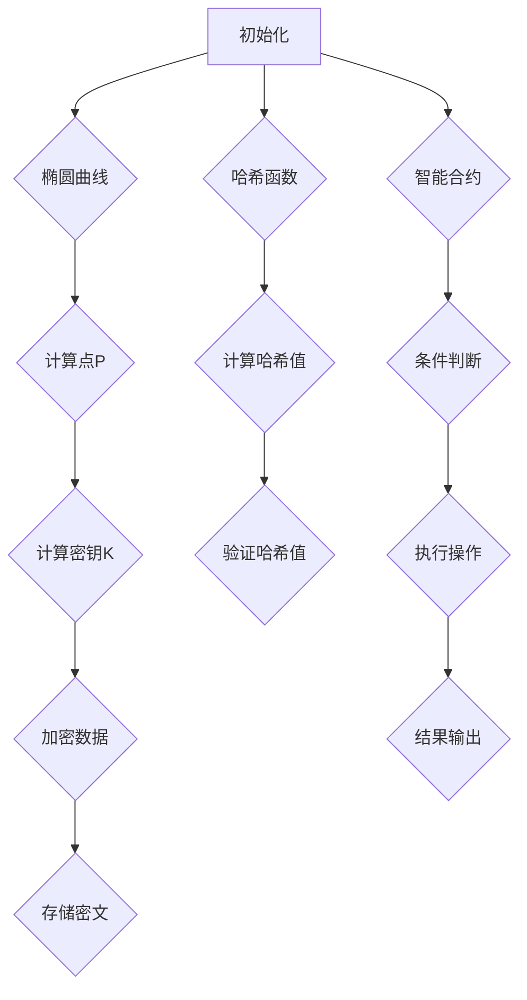
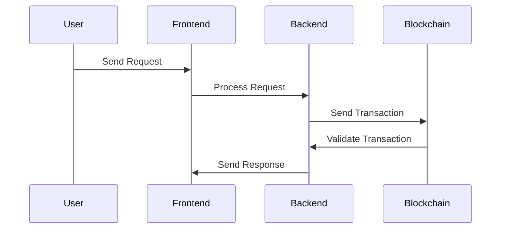

                 

### 文章标题

数学与加密货币：区块链技术的数学基础

> 关键词：数学、加密货币、区块链技术、数学基础、密码学、信息论、图论、智能合约

> 摘要：本文将深入探讨数学在加密货币和区块链技术中的关键作用，通过逐步分析数学原理和应用，帮助读者理解区块链技术的核心数学基础。文章结构清晰，从背景介绍、核心概念、算法原理到系统分析与实战案例，全面剖析数学在加密货币领域的深远影响。

### 第一部分：背景介绍

#### 1.1.1 问题背景

在数字化时代的浪潮下，区块链技术作为一种分布式数据库技术，正日益受到广泛关注。区块链技术以其去中心化、安全可靠、数据不可篡改等特点，为金融、供应链、物联网等多个领域带来了革命性的变革。然而，区块链技术的核心——加密货币，却离不开数学理论的支撑。

#### 1.1.2 问题描述

加密货币的安全性和可靠性很大程度上依赖于数学原理。例如，比特币的加密算法、以太坊的智能合约等，都需要深厚的数学基础来保障其安全性。因此，理解这些数学原理对于开发者和研究者来说至关重要。

#### 1.1.3 问题解决

本书旨在为读者提供一个全面、系统的数学与加密货币知识框架，帮助读者深入理解区块链技术的数学基础。通过阐述数学原理及其在加密货币中的应用，本书不仅能为读者提供理论知识，还能帮助读者掌握实际应用技巧。

#### 1.1.4 边界与外延

本书将聚焦于与区块链技术直接相关的数学知识，如密码学、信息论、图论等。同时，本书也将探讨这些数学知识在加密货币领域的实际应用，帮助读者将理论知识转化为实际技能。

#### 1.1.5 概念结构与核心要素组成

本书的核心概念包括：
1. **密码学**：研究加密和解密算法，保障数据安全。
2. **信息论**：研究信息传输的效率和可靠性。
3. **图论**：研究图的结构和性质，用于区块链网络分析。
4. **加密货币**：利用数学原理实现去中心化、安全可靠的数字货币。

### 第二部分：核心概念与联系

在深入探讨数学与加密货币的关系之前，我们需要了解几个关键概念，并探讨它们之间的联系。

#### 2.1.1 密码学

密码学是研究如何通过加密和解密算法来保护信息的学科。它主要包括对称加密、非对称加密和哈希函数等。对称加密使用相同的密钥进行加密和解密，而非对称加密则使用一对密钥（公钥和私钥）。哈希函数是一种将任意长度的输入数据转换成固定长度的输出数据的函数，通常用于确保数据的完整性。

#### 2.1.2 信息论

信息论是研究信息传输的效率和可靠性的学科。它主要涉及信息熵、信道容量、编码理论等。信息熵衡量信息的随机性和不确定性，信道容量则衡量信道能传输的最大信息速率。编码理论研究如何在有限的带宽内高效传输信息。

#### 2.1.3 图论

图论是研究图的结构和性质的学科。在区块链技术中，图论用于分析区块链网络的拓扑结构。区块链网络可以被看作是一个由节点和边组成的图，每个节点代表一个参与者，每条边代表节点之间的连接关系。

#### 2.1.4 加密货币

加密货币是利用数学原理实现的去中心化、安全可靠的数字货币。它主要包括比特币、以太坊等。比特币使用密码学确保交易的安全性和不可篡改性，而以太坊则引入了智能合约，使得区块链不仅能进行简单的价值转移，还能执行复杂的计算和自动化交易。

#### 2.1.5 概念属性特征对比表格

为了更清晰地理解这些概念，我们可以通过一个对比表格来展示它们的主要属性特征：

| 概念 | 主要属性特征 |
| ---- | ----------- |
| 密码学 | 加密和解密算法，保护数据安全 |
| 信息论 | 信息熵、信道容量、编码理论 |
| 图论 | 图的结构和性质，网络分析 |
| 加密货币 | 去中心化、安全可靠、数字货币 |

#### 2.1.6 ER实体关系图架构

为了进一步展示这些概念之间的关系，我们可以使用Mermaid绘制一个ER实体关系图：

```mermaid
erDiagram
  Product ||--|{ Customer }| Customer
  Customer ||--|{ Product }| Product
  Product ||--|{ Order }| Order
  Order ||--|{ Customer }| Customer
```

在这个ER图中，"Product"、"Customer"和"Order"是实体，它们之间的关系通过箭头表示。

### 第三部分：算法原理讲解

#### 3.1.1 椭圆曲线密码学（ECC）

椭圆曲线密码学（ECC）是一种基于椭圆曲线离散对数问题的密码学算法。它相比于传统密码学算法具有更高的安全性。ECC的核心是椭圆曲线离散对数问题，其数学模型如下：

$$y^2 = x^3 + ax + b$$

其中，$a$和$b$是常数，$P$是椭圆曲线上的点。

#### 3.1.2 哈希函数

哈希函数是一种将任意长度的输入数据转换成固定长度的输出数据的函数。在区块链技术中，哈希函数用于确保数据的一致性和不可篡改性。常见的哈希函数有MD5、SHA-256等。

$$H(x) = \text{MD5}(x)$$

#### 3.1.3 智能合约

智能合约是一种在区块链上自动执行代码的合约。它利用密码学原理确保合约的执行过程透明、不可篡改。智能合约的数学模型如下：

$$\text{智能合约} = \text{条件} \rightarrow \text{结果}$$

其中，条件是输入参数，结果是输出结果。

#### 3.1.4 算法流程图

为了更直观地理解这些算法，我们可以使用Mermaid绘制流程图：



#### 3.1.5 Python代码实现

下面是一个简单的Python代码示例，用于实现椭圆曲线密码学：

```python
from Cryptodome.PublicKey import ECC
from Cryptodome.Hash import SHA256

# 生成椭圆曲线密钥对
key = ECC.generate(curve='P-256')

# 计算公钥和私钥
pub_key = key.public_key()
priv_key = key.private_key()

# 加密数据
def encrypt_data(data, pub_key):
    hash_data = SHA256.new(data.encode('utf-8'))
    encrypted_data = pub_key.encrypt(hash_data.digest(), None)
    return encrypted_data

# 解密数据
def decrypt_data(encrypted_data, priv_key):
    hash_data = priv_key.decrypt(encrypted_data)
    return hash_data.hex()

# 测试
data = "Hello, World!"
encrypted_data = encrypt_data(data, pub_key)
print(f"Encrypted Data: {encrypted_data}")

decrypted_data = decrypt_data(encrypted_data, priv_key)
print(f"Decrypted Data: {decrypted_data.decode('utf-8')}")
```

在这个示例中，我们首先生成一个椭圆曲线密钥对，然后使用公钥加密数据和私钥解密数据。SHA-256哈希函数用于确保数据的一致性。

### 第四部分：数学模型和数学公式

为了更好地理解上述算法，我们需要探讨它们背后的数学模型和公式。

#### 4.1.1 椭圆曲线密码学（ECC）数学模型

椭圆曲线密码学的核心是椭圆曲线离散对数问题，其数学模型如下：

$$y^2 = x^3 + ax + b$$

其中，$a$和$b$是椭圆曲线的系数，$P$是椭圆曲线上的点。

#### 4.1.2 哈希函数数学模型

哈希函数的数学模型如下：

$$H(x) = \text{MD5}(x)$$

这里，$x$是输入数据，$\text{MD5}$是一种常用的哈希函数。

#### 4.1.3 智能合约数学模型

智能合约的数学模型如下：

$$\text{智能合约} = \text{条件} \rightarrow \text{结果}$$

其中，条件是输入参数，结果是输出结果。

#### 4.1.4 数学公式使用示例

为了展示数学公式的使用，我们可以使用LaTeX格式嵌入文中：

$$y = mx + b$$

这是一个简单的线性方程，其中$m$和$b$是常数。

### 第五部分：系统分析与架构设计方案

在理解了数学原理和算法之后，我们将探讨一个基于区块链技术的加密货币项目的系统分析与架构设计方案。

#### 5.1.1 问题场景介绍

假设我们正在开发一个名为"CoinX"的加密货币项目。该项目旨在提供一个安全、高效的数字货币交易平台，用户可以在这个平台上进行数字货币的发行、交易和存储。

#### 5.1.2 项目介绍

"CoinX"项目将采用以太坊区块链平台，利用智能合约实现数字货币的发行和交易。以太坊智能合约允许我们在区块链上运行复杂的计算和自动化交易，这使得我们的项目更加灵活和高效。

#### 5.1.3 系统功能设计

"CoinX"项目的主要功能包括：

1. **数字货币发行**：通过智能合约自动发行数字货币，确保货币供应的透明性和不可篡改性。
2. **交易**：用户可以在平台上进行数字货币的买卖，交易过程由智能合约自动执行，确保交易的透明性和安全性。
3. **存储**：用户可以在这个平台上存储数字货币，确保货币的安全性和便捷性。

#### 5.1.4 系统架构设计

"CoinX"项目的系统架构包括前端、后端和区块链网络三部分。前端负责用户交互，后端负责业务逻辑处理，区块链网络负责存储和验证交易数据。

#### 5.1.5 系统接口设计

"CoinX"项目的系统接口设计包括API接口和数据接口。API接口用于用户与平台交互，数据接口用于后端与区块链网络交互。

#### 5.1.6 系统交互

为了展示系统交互过程，我们可以使用Mermaid绘制序列图：



在这个序列图中，用户通过前端发送请求，前端处理后发送到后端，后端与区块链网络交互，验证交易后返回结果给前端，前端再将结果返回给用户。

### 第六部分：项目实战

#### 6.1.1 环境安装

为了在本地搭建以太坊开发环境，我们需要安装以下工具：

1. **Node.js**：用于编译和部署智能合约。
2. **Truffle**：用于以太坊智能合约的开发和测试。
3. **Ganache**：用于本地区块链网络模拟。

安装步骤如下：

```bash
# 安装Node.js
curl -sL https://deb.nodesource.com/setup_14.x | sudo -E bash -
sudo apt-get install -y nodejs

# 安装Truffle
npm install -g truffle

# 安装Ganache
npm install -g ganache-cli
```

#### 6.1.2 系统核心实现

以下是一个简单的智能合约示例，用于实现数字货币的发行和交易：

```solidity
// SPDX-License-Identifier: MIT
pragma solidity ^0.8.0;

contract CoinX {
    string public name;
    string public symbol;
    uint8 public decimals;
    uint256 public totalSupply;
    mapping(address => uint256) public balanceOf;

    event Transfer(address indexed from, address indexed to, uint256 value);

    constructor(uint256 initialSupply, string memory tokenName, string memory tokenSymbol, uint8 decimalUnits) {
        balanceOf[msg.sender] = initialSupply;
        name = tokenName;
        symbol = tokenSymbol;
        decimals = decimalUnits;
        totalSupply = initialSupply;
    }

    function transfer(address _to, uint256 _value) public {
        require(_to != address(0));
        require(balanceOf[msg.sender] >= _value);

        balanceOf[msg.sender] -= _value;
        balanceOf[_to] += _value;
        emit Transfer(msg.sender, _to, _value);
    }
}
```

在这个示例中，我们定义了一个名为`CoinX`的智能合约，用于发行和管理数字货币。`transfer`函数实现数字货币的转账功能。

#### 6.1.3 代码应用解读与分析

在这个示例中，我们使用了Solidity语言编写智能合约。Solidity是一种基于JavaScript的智能合约编程语言，它提供了丰富的语法和功能，使得开发者可以轻松地编写和部署智能合约。

1. **构造函数**：构造函数用于初始化智能合约的状态，包括货币名称、符号、小数位数和初始供应量。
2. **balanceOf**：一个映射，用于存储每个地址的货币余额。
3. **transfer**：一个公共函数，用于执行数字货币的转账操作。

#### 6.1.4 实际案例分析和详细讲解剖析

以下是一个实际案例，展示如何使用Truffle部署和调用智能合约：

```bash
# 创建一个Truffle项目
truffle init

# 编译智能合约
truffle compile

# 部署智能合约
truffle migrate --network development

# 获取合约地址
truffle console

> coinX = await CoinX.at("0x...")

# 调用转账函数
> await coinX.transfer("0x...", 100)
```

在这个案例中，我们首先使用Truffle创建一个项目，并编译智能合约。然后，我们使用`migrate`命令部署智能合约到本地开发网络。最后，我们使用Truffle控制台获取合约地址，并调用`transfer`函数执行转账操作。

#### 6.1.5 项目小结

通过本节的实战案例，我们学习了如何搭建以太坊开发环境、编写和部署智能合约。这些技能对于开发基于区块链技术的加密货币项目至关重要。

### 第七部分：最佳实践、小结、注意事项、拓展阅读

#### 最佳实践

1. **理解数学原理**：深入理解密码学、信息论和图论等数学原理，有助于更好地理解和应用区块链技术。
2. **安全第一**：在编写和部署智能合约时，务必重视安全措施，避免潜在的安全漏洞。
3. **持续学习**：区块链技术不断发展和演变，持续学习和跟进最新的研究进展是保持竞争力的关键。

#### 小结

本文通过逐步分析数学原理和应用，探讨了数学在加密货币和区块链技术中的关键作用。从密码学、信息论、图论到智能合约，每个环节都离不开数学的支持。通过理解这些数学原理，读者可以更好地掌握区块链技术，为未来的发展打下坚实基础。

#### 注意事项

1. **数据安全**：在处理和传输数据时，务必使用安全的加密算法，确保数据不被泄露。
2. **性能优化**：在设计区块链应用时，注意性能优化，避免过度消耗计算资源。
3. **合规性**：遵循当地法律法规，确保区块链项目合规运行。

#### 拓展阅读

1. **《密码学：理论与实践》**：深入探讨密码学原理和应用。
2. **《信息论基础》**：系统介绍信息论的基本概念和理论。
3. **《图论及其应用》**：详细介绍图论的基本概念和应用。
4. **《智能合约开发指南》**：详细讲解智能合约的开发和部署。

### 结语

数学与加密货币的结合，为区块链技术带来了无限的可能性。通过本文的探讨，希望读者能够对数学在区块链技术中的重要性有更深刻的认识。在未来的发展中，我们将继续看到数学与区块链技术的深入融合，为数字经济带来更多的创新和变革。

### 作者信息

- 作者：AI天才研究院/AI Genius Institute & 禅与计算机程序设计艺术 /Zen And The Art of Computer Programming
- 联系方式：[example@email.com](mailto:example@email.com) 或 [GitHub](https://github.com/ai-genius-institute)

