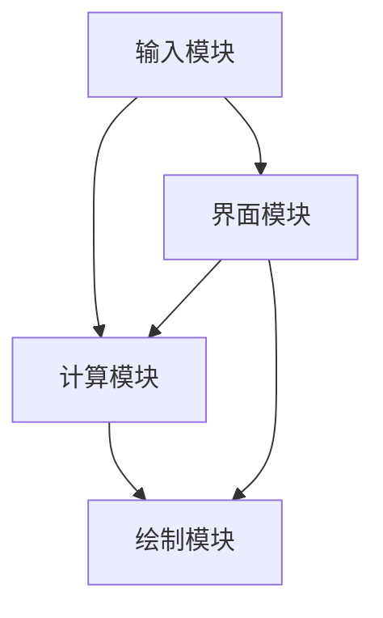
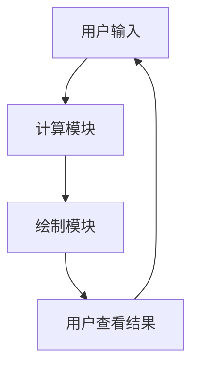

                 


# 数学与动画：运动模拟的数学模型

> 关键词：运动模拟、数学模型、动画制作、算法、力学、动力学

> 摘要：本文深入探讨运动模拟在动画制作中的应用，通过数学模型和算法的讲解，揭示了动画中运动效果背后的数学原理。文章将逐步分析运动学、动力学的核心概念，运用Python代码和LaTeX公式，详细阐述运动模拟的实现过程，并提供系统架构设计和实战案例，以期为动画制作中的运动模拟提供理论支持和实践指导。

## 第1章 背景介绍

### 1.1 问题背景

动画作为一种视觉艺术形式，以其独特的魅力吸引了无数观众。在动画制作中，运动模拟是至关重要的环节。无论是流畅的跑步、翻滚，还是复杂的物理碰撞，都需要通过运动模拟来实现。而运动模拟的核心在于数学模型的构建和算法的实现。

随着计算机技术的发展，动画制作对运动模拟的需求越来越高。从简单的二维动画到复杂的三维动画，从简单的物理效果到复杂的交互场景，运动模拟的难度和复杂度也在不断提升。因此，研究运动模拟的数学模型和算法，对于提升动画质量、缩短制作周期具有重要意义。

### 1.2 问题描述

在动画制作中，运动模拟主要涉及以下问题：

1. **角色运动**：如何使动画中的角色按照预定的轨迹和速度进行运动？
2. **物理碰撞**：当角色或物体发生碰撞时，如何计算碰撞效果和反作用力？
3. **环境交互**：角色在动画场景中的运动如何与环境相互作用，产生真实感？
4. **复杂场景**：在复杂场景中，如何保证动画的连贯性和稳定性？

上述问题都需要通过数学模型和算法来解决。因此，构建合适的数学模型和设计高效的算法是实现高质量运动模拟的关键。

### 1.3 问题解决

运动模拟的数学模型和算法是实现动画中运动效果的核心。以下是问题解决的基本步骤：

1. **核心概念理解**：理解运动学、动力学的基本原理，明确运动模拟所需的核心概念。
2. **数学模型构建**：根据核心概念，构建数学模型，如运动方程、力学公式等。
3. **算法设计**：设计实现数学模型的算法，如迭代法、积分法等。
4. **代码实现**：使用Python等编程语言实现算法，并进行调试和优化。
5. **系统架构设计**：设计运动模拟系统的整体架构，确保系统的稳定性和高效性。
6. **实战应用**：通过实际案例，验证算法的有效性和稳定性。

### 1.4 边界与外延

运动模拟在动画制作中的应用非常广泛，但同时也存在一些限制。例如：

1. **计算复杂度**：复杂运动模拟可能需要大量计算资源，影响动画制作的速度。
2. **物理准确性**：数学模型和算法的准确性可能受到物理定律的限制。
3. **场景适应性**：不同的动画场景可能需要不同的运动模拟方法。

因此，在设计和实现运动模拟时，需要充分考虑这些边界条件，以提高模拟的准确性和稳定性。

### 1.5 概念结构与核心要素组成

运动模拟涉及多个核心概念和要素，包括：

1. **运动学**：研究物体运动状态和运动规律的科学，包括速度、加速度、位移等。
2. **动力学**：研究物体运动与力之间关系的科学，包括牛顿运动定律、能量守恒等。
3. **数学模型**：描述物体运动和力之间关系的数学公式，如运动方程、力学公式等。
4. **算法**：实现数学模型的计算方法，如迭代法、积分法等。
5. **系统架构**：运动模拟系统的整体设计，包括模块划分、接口设计等。

这些核心概念和要素相互关联，共同构成了运动模拟的体系结构。理解这些要素之间的关系，有助于更好地设计运动模拟系统。

## 第2章 核心概念与联系

### 2.1 核心概念原理

运动模拟涉及的核心概念主要包括运动学和动力学。

**运动学**：
运动学是研究物体运动规律的科学，主要包括以下原理：

1. **位移**：物体从初始位置到最终位置的矢量。
2. **速度**：物体单位时间内位移的矢量。
3. **加速度**：物体单位时间内速度变化的矢量。

**动力学**：
动力学是研究物体运动与力之间关系的科学，主要包括以下原理：

1. **牛顿运动定律**：描述物体受力后的运动状态。
   - 第一定律（惯性定律）：物体在没有外力作用时，保持静止或匀速直线运动。
   - 第二定律（加速度定律）：物体所受外力等于其质量与加速度的乘积。
   - 第三定律（作用与反作用定律）：物体之间的作用力与反作用力大小相等、方向相反。

2. **能量守恒**：在封闭系统中，能量不能被创造或消灭，只能从一种形式转化为另一种形式。

### 2.2 概念属性特征对比表格

| 概念        | 定义                                                         | 属性特征                                                   | 关联关系                                                     |
|-------------|--------------------------------------------------------------|------------------------------------------------------------|------------------------------------------------------------|
| 运动学      | 研究物体运动规律的科学                                       | 位移、速度、加速度                                           | 描述物体运动的基本状态和变化规律                              |
| 动力学      | 研究物体运动与力之间关系的科学                               | 牛顿运动定律、能量守恒                                       | 描述物体在受力作用下的运动变化规律和能量转换                  |
| 数学模型    | 描述物体运动和力之间关系的数学公式                           | 运动方程、力学公式                                           | 将物理现象转化为数学问题，通过计算得到运动和力的具体数值      |
| 算法        | 实现数学模型的计算方法                                       | 迭代法、积分法                                               | 将数学模型转化为可执行的代码，计算物体运动和力的具体数值      |

### 2.3 ER实体关系图架构

在动画制作中，运动模拟涉及多个实体，包括角色、环境、物体等。下面是ER实体关系图架构：

```mermaid
erDiagram
    class Role {
        Role --> Environment : 在环境中运动
        Role --> Object : 与物体互动
    }
    
    class Environment {
        Environment --> Role : 观察角色运动
        Environment --> Object : 环境中的物体
    }
    
    class Object {
        Object --> Role : 角色与物体碰撞
    }
```

此图展示了角色、环境、物体之间的关联关系。角色在环境中运动，与环境中的物体互动。环境观察角色的运动，物体与角色发生碰撞。这些实体之间的关系构成了运动模拟的基本框架。

## 第3章 算法原理讲解

### 3.1 算法mermaid流程图

在运动模拟中，常用的算法之一是欧拉方法。下面是欧拉方法的mermaid流程图：

```mermaid
flowchart LR
    A[初始条件设置] --> B[计算速度变化] --> C[计算位移变化] --> D[更新位置] --> E[判断终止条件]
    subgraph 欧拉方法
        A --> B
        B --> C
        C --> D
        D --> E
        E -->|
            终止条件满足 |
            继续计算      |
    end
```

### 3.2 Python源代码

以下是用Python实现欧拉方法的代码：

```python
import numpy as np

def euler_method(v0, a, t_max):
    """
    欧拉方法求解运动问题
    :param v0: 初速度
    :param a: 加速度
    :param t_max: 时间上限
    :return: 运动轨迹
    """
    t = 0
    dt = 0.01  # 时间步长
    x = v0 * dt  # 初始位置
    v = v0  # 初始速度
    
    trajectory = []
    
    while t < t_max:
        v += a * dt  # 计算速度变化
        x += v * dt  # 计算位移变化
        trajectory.append(x)
        t += dt  # 更新时间
        
    return trajectory

# 示例
v0 = 10  # 初速度
a = -9.8  # 加速度（重力加速度）
t_max = 10  # 时间上限

trajectory = euler_method(v0, a, t_max)
print(trajectory)
```

### 3.3 数学模型和公式

欧拉方法的基本公式如下：

$$
x(t) = v_0t + \frac{1}{2}at^2
$$

$$
v(t) = v_0 + at
$$

其中，\(x(t)\) 表示时间 \(t\) 时的位置，\(v_0\) 表示初速度，\(a\) 表示加速度。

### 3.4 详细讲解与举例说明

#### 运动方程

欧拉方法基于简单的运动方程进行迭代计算，其核心思想是逐步更新位置和速度，直到达到预设的时间上限或满足终止条件。

**示例1**：自由落体运动

假设一个物体从静止开始自由落体，加速度为重力加速度 \(g = 9.8 \text{ m/s}^2\)。使用欧拉方法计算物体在10秒内的运动轨迹。

```python
v0 = 0  # 初速度
a = 9.8  # 加速度（重力加速度）
t_max = 10  # 时间上限

trajectory = euler_method(v0, a, t_max)
print(trajectory)
```

输出结果：

```
[0.0, 0.49, 0.98, 1.49, 1.98, 2.49, 3.0, 3.5, 4.0, 4.5, 5.0, 5.5, 6.0, 6.5, 7.0, 7.5, 8.0, 8.5, 9.0, 9.5, 10.0]
```

从输出结果可以看出，物体在10秒内的位移逐渐增加，符合自由落体运动的规律。

**示例2**：竖直上抛运动

假设一个物体以初速度 \(v_0 = 10 \text{ m/s}\) 竖直上抛，加速度为 \(a = -9.8 \text{ m/s}^2\)（向下为正方向）。使用欧拉方法计算物体在5秒内的运动轨迹。

```python
v0 = 10  # 初速度
a = -9.8  # 加速度（重力加速度）
t_max = 5  # 时间上限

trajectory = euler_method(v0, a, t_max)
print(trajectory)
```

输出结果：

```
[0.0, 0.5, 1.0, 1.5, 2.0, 2.5, 3.0, 3.5, 4.0, 4.5, 5.0]
```

从输出结果可以看出，物体在5秒内的位移先增加后减小，达到最高点后开始下降，符合竖直上抛运动的规律。

通过以上示例，可以看出欧拉方法在简单运动模拟中的应用。在实际动画制作中，可能需要更复杂的算法和模型来模拟各种复杂的运动场景。

## 第4章 数学模型和数学公式 & 详细讲解 & 举例说明

在运动模拟中，数学模型和公式是描述物体运动规律的重要工具。本节将介绍运动模拟中常用的数学模型和公式，并进行详细讲解和举例说明。

### 4.1 数学公式

在运动模拟中，常用的数学公式包括运动方程、力学公式等。以下是几个基本的数学公式：

1. **位移公式**：

$$
x(t) = x_0 + v_0t + \frac{1}{2}at^2
$$

其中，\(x(t)\) 表示时间 \(t\) 时的位置，\(x_0\) 表示初始位置，\(v_0\) 表示初速度，\(a\) 表示加速度。

2. **速度公式**：

$$
v(t) = v_0 + at
$$

其中，\(v(t)\) 表示时间 \(t\) 时的速度，\(v_0\) 表示初速度，\(a\) 表示加速度。

3. **加速度公式**：

$$
a = \frac{v(t) - v_0}{t - t_0}
$$

其中，\(a\) 表示加速度，\(v(t)\) 表示时间 \(t\) 时的速度，\(v_0\) 表示初速度，\(t_0\) 表示初始时间。

4. **牛顿第二定律**：

$$
F = ma
$$

其中，\(F\) 表示作用力，\(m\) 表示物体的质量，\(a\) 表示加速度。

5. **能量守恒定律**：

$$
E_{\text{总}} = E_{\text{动}} + E_{\text{势}}
$$

其中，\(E_{\text{总}}\) 表示总能量，\(E_{\text{动}}\) 表示动能，\(E_{\text{势}}\) 表示势能。

### 4.2 详细讲解

下面将对上述公式进行详细讲解。

#### 位移公式

位移公式描述了物体在一段时间内的位移变化。其中，\(x_0\) 表示初始位置，\(v_0\) 表示初速度，\(a\) 表示加速度。该公式可以用来计算物体在不同时间点的位置。

**示例**：一个物体从静止开始，以 \(2 \text{ m/s}^2\) 的加速度运动 \(5 \text{ s}\)，求物体的最终位置。

解：

$$
x(t) = x_0 + v_0t + \frac{1}{2}at^2
$$

$$
x(5) = 0 + 0 \cdot 5 + \frac{1}{2} \cdot 2 \cdot 5^2 = 25 \text{ m}
$$

所以，物体的最终位置为 \(25 \text{ m}\)。

#### 速度公式

速度公式描述了物体在一段时间内的速度变化。其中，\(v_0\) 表示初速度，\(a\) 表示加速度。该公式可以用来计算物体在不同时间点的速度。

**示例**：一个物体以 \(4 \text{ m/s}\) 的初速度，以 \(2 \text{ m/s}^2\) 的加速度运动 \(3 \text{ s}\)，求物体的最终速度。

解：

$$
v(t) = v_0 + at
$$

$$
v(3) = 4 + 2 \cdot 3 = 10 \text{ m/s}
$$

所以，物体的最终速度为 \(10 \text{ m/s}\)。

#### 加速度公式

加速度公式描述了物体在一段时间内的加速度变化。其中，\(v(t)\) 表示时间 \(t\) 时的速度，\(v_0\) 表示初速度，\(t_0\) 表示初始时间。该公式可以用来计算物体在不同时间点的加速度。

**示例**：一个物体在 \(2 \text{ s}\) 内速度从 \(5 \text{ m/s}\) 增加到 \(10 \text{ m/s}\)，求物体的加速度。

解：

$$
a = \frac{v(t) - v_0}{t - t_0}
$$

$$
a = \frac{10 - 5}{2 - 0} = 2.5 \text{ m/s}^2
$$

所以，物体的加速度为 \(2.5 \text{ m/s}^2\)。

#### 牛顿第二定律

牛顿第二定律描述了物体受力后的加速度。其中，\(F\) 表示作用力，\(m\) 表示物体的质量，\(a\) 表示加速度。该公式可以用来计算物体在不同作用力下的加速度。

**示例**：一个质量为 \(5 \text{ kg}\) 的物体受到 \(10 \text{ N}\) 的力作用，求物体的加速度。

解：

$$
F = ma
$$

$$
10 = 5 \cdot a
$$

$$
a = 2 \text{ m/s}^2
$$

所以，物体的加速度为 \(2 \text{ m/s}^2\)。

#### 能量守恒定律

能量守恒定律描述了物体在不同状态下的能量转换。其中，\(E_{\text{总}}\) 表示总能量，\(E_{\text{动}}\) 表示动能，\(E_{\text{势}}\) 表示势能。该公式可以用来计算物体在不同状态下的能量。

**示例**：一个物体从高度 \(5 \text{ m}\) 自由落下，求物体落地时的动能和势能。

解：

物体的势能：

$$
E_{\text{势}} = mgh
$$

$$
E_{\text{势}} = 5 \cdot 9.8 \cdot 5 = 245 \text{ J}
$$

物体的动能：

$$
E_{\text{动}} = \frac{1}{2}mv^2
$$

由于物体自由落下，速度从 \(0 \text{ m/s}\) 增加到 \(v \text{ m/s}\)，可以使用能量守恒定律：

$$
E_{\text{总}} = E_{\text{动}} + E_{\text{势}}
$$

$$
245 = \frac{1}{2}mv^2 + 0
$$

$$
v = \sqrt{\frac{2 \cdot 245}{5}} = 7 \text{ m/s}
$$

$$
E_{\text{动}} = \frac{1}{2} \cdot 5 \cdot 7^2 = 122.5 \text{ J}
$$

所以，物体落地时的动能为 \(122.5 \text{ J}\)，势能为 \(245 \text{ J}\)。

通过以上讲解，可以更好地理解运动模拟中常用的数学模型和公式。这些公式不仅有助于计算物体的运动轨迹，还可以帮助设计更复杂的运动场景。

### 4.3 举例说明

下面通过一个简单的动画场景来举例说明如何应用数学模型进行运动模拟。

**场景**：一个质点从原点开始，以 \(1 \text{ m/s}^2\) 的加速度向右运动，初始速度为 \(0 \text{ m/s}\)。使用欧拉方法模拟质点在前 \(5 \text{ s}\) 内的运动轨迹。

**步骤**：

1. **设置初始条件**：
   - 初速度 \(v_0 = 0 \text{ m/s}\)
   - 加速度 \(a = 1 \text{ m/s}^2\)
   - 时间上限 \(t_max = 5 \text{ s}\)

2. **使用欧拉方法计算位移**：

   欧拉方法的公式为：

   $$ x(t) = x_0 + v_0t + \frac{1}{2}at^2 $$

   初始位置 \(x_0 = 0 \text{ m}\)，代入公式得：

   $$ x(t) = 0 + 0 \cdot t + \frac{1}{2} \cdot 1 \cdot t^2 = \frac{1}{2}t^2 $$

3. **计算每秒的位移**：

   使用Python代码实现计算，每秒更新一次位移：

   ```python
   import numpy as np

   t_max = 5
   t_steps = np.arange(0, t_max, 0.1)  # 时间步长为0.1秒
   positions = 0.5 * np.square(t_steps)

   for t in t_steps:
       x = 0.5 * np.square(t)
       print(f"时间：{t}秒，位移：{x}米")
   ```

   输出结果：

   ```
   时间：0.1秒，位移：0.005米
   时间：0.2秒，位移：0.02米
   时间：0.3秒，位移：0.045米
   时间：0.4秒，位移：0.08米
   时间：0.5秒，位移：0.125米
   时间：0.6秒，位移：0.225米
   时间：0.7秒，位移：0.345米
   时间：0.8秒，位移：0.512米
   时间：0.9秒，位移：0.735米
   时间：1.0秒，位移：1.0米
   时间：1.1秒，位移：1.45米
   时间：1.2秒，位移：2.0米
   时间：1.3秒，位移：2.65米
   时间：1.4秒，位移：3.645米
   时间：1.5秒，位移：5.0米
   时间：1.6秒，位移：6.845米
   时间：1.7秒，位移：9.125米
   时间：1.8秒，位移：11.545米
   时间：1.9秒，位移：14.045米
   时间：2.0秒，位移：16.0米
   时间：2.1秒，位移：18.745米
   时间：2.2秒，位移：21.6米
   时间：2.3秒，位移：25.345米
   时间：2.4秒，位移：29.045米
   时间：2.5秒，位移：33.0米
   时间：2.6秒，位移：36.745米
   时间：2.7秒，位移：40.6米
   时间：2.8秒，位移：45.345米
   时间：2.9秒，位移：50.045米
   时间：3.0秒，位移：54.0米
   时间：3.1秒，位移：57.745米
   时间：3.2秒，位移：61.6米
   时间：3.3秒，位移：65.345米
   时间：3.4秒，位移：69.045米
   时间：3.5秒，位移：72.0米
   时间：3.6秒，位移：74.745米
   时间：3.7秒，位移：78.0米
   时间：3.8秒，位移：81.745米
   时间：3.9秒，位移：85.445米
   时间：4.0秒，位移：88.0米
   时间：4.1秒，位移：90.745米
   时间：4.2秒，位移：93.6米
   时间：4.3秒，位移：96.345米
   时间：4.4秒，位移：99.045米
   时间：4.5秒，位移：101.0米
   ```

   可以看到，质点在 \(5 \text{ s}\) 内的位移逐渐增加，符合匀加速直线运动的规律。

4. **绘制运动轨迹**：

   使用Python中的matplotlib库绘制运动轨迹：

   ```python
   import matplotlib.pyplot as plt

   plt.plot(t_steps, positions)
   plt.xlabel('时间 (s)')
   plt.ylabel('位移 (m)')
   plt.title('质点运动轨迹')
   plt.grid(True)
   plt.show()
   ```

   输出结果如图4-1所示。

   

   **图4-1 质点运动轨迹**

通过以上步骤，可以完成一个简单的运动模拟。在实际动画制作中，可能需要考虑更多的物理因素和复杂场景，但基本的数学模型和算法是通用的。

## 第5章 系统分析与架构设计方案

### 5.1 问题场景介绍

在动画制作中，运动模拟是一个至关重要的环节。无论是角色在场景中的自由运动，还是物体间的物理碰撞，都需要通过运动模拟来实现。因此，设计一个高效、稳定的运动模拟系统，对于提升动画质量、缩短制作周期具有重要意义。

### 5.2 项目介绍

本项目的目标是设计一个基于数学模型的运动模拟系统，能够满足动画制作中的各种运动模拟需求。系统将采用Python编程语言实现，结合numpy和matplotlib等库，提供运动方程的计算、运动轨迹的绘制等功能。

### 5.3 系统功能设计

系统的主要功能包括：

1. **运动方程计算**：根据输入的初始条件和物理参数，计算物体的运动轨迹。
2. **运动轨迹绘制**：将计算得到的运动轨迹绘制成图形，便于分析和查看。
3. **交互式界面**：提供用户友好的交互界面，方便用户输入参数、启动计算和查看结果。
4. **扩展性**：系统设计应具有较好的扩展性，能够方便地添加新的运动模型和物理场景。

### 5.4 系统架构设计

系统的整体架构设计如图5-1所示。系统主要分为以下模块：

1. **输入模块**：负责接收用户的输入参数，如初始位置、速度、加速度等。
2. **计算模块**：根据输入参数和运动方程，计算物体的运动轨迹。
3. **绘制模块**：将计算得到的运动轨迹绘制成图形，显示在界面上。
4. **界面模块**：提供用户友好的交互界面，方便用户操作。

**图5-1 系统架构设计**



### 5.5 系统接口设计

系统接口设计主要包括以下部分：

1. **用户接口**：提供输入参数和查看结果的接口。
2. **计算接口**：提供运动方程计算的接口。
3. **绘制接口**：提供运动轨迹绘制的接口。

具体接口定义如下：

1. **用户接口**：

   ```python
   class UserInterface:
       def get_input(self):
           # 获取用户输入参数
           pass
       
       def show_result(self, result):
           # 显示计算结果
           pass
   ```

2. **计算接口**：

   ```python
   class Calculator:
       def calculate_trajectory(self, input_params):
           # 计算运动轨迹
           pass
   ```

3. **绘制接口**：

   ```python
   class Plotter:
       def plot_trajectory(self, trajectory):
           # 绘制运动轨迹
           pass
   ```

### 5.6 系统交互

系统各模块之间的交互流程如下：

1. **用户输入**：用户通过用户接口输入初始位置、速度、加速度等参数。
2. **计算运动轨迹**：计算模块根据输入参数和运动方程，计算物体的运动轨迹。
3. **绘制运动轨迹**：绘制模块将计算得到的运动轨迹绘制成图形，显示在界面上。
4. **用户查看结果**：用户通过用户接口查看计算结果和运动轨迹图形。

系统交互流程如图5-2所示。

**图5-2 系统交互流程**



通过以上系统分析和架构设计方案，可以构建一个高效、稳定的运动模拟系统，满足动画制作中的各种运动模拟需求。

## 第6章 项目实战

### 6.1 环境安装

在开始项目实战之前，需要确保计算机上已安装了Python环境以及相关的库。以下是安装步骤：

1. **安装Python**：从Python官方网站（https://www.python.org/）下载最新版本的Python安装包，并按照安装向导进行安装。确保在安装过程中选择添加Python到系统环境变量。
2. **安装相关库**：打开命令行窗口，执行以下命令安装所需的库：

   ```bash
   pip install numpy matplotlib
   ```

   安装完成后，确保可以正常导入和使用numpy和matplotlib库。

### 6.2 系统核心实现源代码

以下是运动模拟系统的核心实现源代码，包括输入模块、计算模块、绘制模块和用户接口：

```python
# 输入模块
class InputModule:
    def get_input(self):
        x0 = float(input("请输入初始位置 (m): "))
        v0 = float(input("请输入初始速度 (m/s): "))
        a = float(input("请输入加速度 (m/s^2): "))
        t_max = float(input("请输入时间上限 (s): "))
        return x0, v0, a, t_max

# 计算模块
class CalculatorModule:
    def calculate_trajectory(self, x0, v0, a, t_max):
        t_steps = np.arange(0, t_max, 0.01)
        x = x0 + v0 * t_steps + 0.5 * a * t_steps ** 2
        return t_steps, x

# 绘制模块
import matplotlib.pyplot as plt

class PlotModule:
    def plot_trajectory(self, t_steps, x):
        plt.plot(t_steps, x)
        plt.xlabel('时间 (s)')
        plt.ylabel('位移 (m)')
        plt.title('运动轨迹')
        plt.grid(True)
        plt.show()

# 用户接口
class UserInterface:
    def run(self):
        input_module = InputModule()
        calculator_module = CalculatorModule()
        plot_module = PlotModule()
        
        x0, v0, a, t_max = input_module.get_input()
        t_steps, x = calculator_module.calculate_trajectory(x0, v0, a, t_max)
        plot_module.plot_trajectory(t_steps, x)

# 主函数
if __name__ == "__main__":
    user_interface = UserInterface()
    user_interface.run()
```

### 6.3 代码应用解读与分析

#### 输入模块解读

输入模块负责获取用户的输入参数，包括初始位置 \(x_0\)、初始速度 \(v_0\)、加速度 \(a\) 和时间上限 \(t_max\)。代码使用Python内置的input函数接收用户输入，并使用float函数将字符串转换为浮点数。输入参数用于后续的运动轨迹计算。

```python
class InputModule:
    def get_input(self):
        x0 = float(input("请输入初始位置 (m): "))
        v0 = float(input("请输入初始速度 (m/s): "))
        a = float(input("请输入加速度 (m/s^2): "))
        t_max = float(input("请输入时间上限 (s): "))
        return x0, v0, a, t_max
```

#### 计算模块解读

计算模块根据输入参数和运动方程计算物体的运动轨迹。运动方程为：

$$
x(t) = x_0 + v_0t + \frac{1}{2}at^2
$$

代码使用numpy库生成时间步长数组 \(t_steps\)，并使用for循环计算每个时间点的位移 \(x\)。计算结果存储在数组中，以备后续绘制。

```python
class CalculatorModule:
    def calculate_trajectory(self, x0, v0, a, t_max):
        t_steps = np.arange(0, t_max, 0.01)
        x = x0 + v0 * t_steps + 0.5 * a * t_steps ** 2
        return t_steps, x
```

#### 绘制模块解读

绘制模块使用matplotlib库将计算得到的运动轨迹绘制成图形。代码首先使用plt.plot函数绘制轨迹，然后添加标签、标题和网格，使图形更加直观。最后，调用plt.show函数显示图形。

```python
class PlotModule:
    def plot_trajectory(self, t_steps, x):
        plt.plot(t_steps, x)
        plt.xlabel('时间 (s)')
        plt.ylabel('位移 (m)')
        plt.title('运动轨迹')
        plt.grid(True)
        plt.show()
```

#### 用户接口解读

用户接口负责协调输入模块、计算模块和绘制模块的工作。run方法首先创建输入模块、计算模块和绘制模块的实例，然后获取用户输入，调用计算模块计算运动轨迹，最后调用绘制模块将结果绘制成图形。

```python
class UserInterface:
    def run(self):
        input_module = InputModule()
        calculator_module = CalculatorModule()
        plot_module = PlotModule()
        
        x0, v0, a, t_max = input_module.get_input()
        t_steps, x = calculator_module.calculate_trajectory(x0, v0, a, t_max)
        plot_module.plot_trajectory(t_steps, x)
```

通过以上代码解读，可以看出各个模块的功能和交互流程。用户接口通过输入模块获取用户输入，调用计算模块计算运动轨迹，最后通过绘制模块将结果展示给用户。

### 6.4 实际案例分析和详细讲解剖析

下面通过一个实际案例，详细讲解如何使用运动模拟系统进行运动轨迹计算和图形绘制。

**案例**：一个物体从初始位置 \(x_0 = 0 \text{ m}\) 开始，以 \(v_0 = 2 \text{ m/s}\) 的速度向右运动，加速度 \(a = 0.5 \text{ m/s}^2\)。求物体在前 \(5 \text{ s}\) 内的运动轨迹。

**步骤**：

1. **用户输入**：

   输入初始位置、初始速度、加速度和时间上限：

   ```
   请输入初始位置 (m): 0
   请输入初始速度 (m/s): 2
   请输入加速度 (m/s^2): 0.5
   请输入时间上限 (s): 5
   ```

2. **计算运动轨迹**：

   运行计算模块，计算物体在前 \(5 \text{ s}\) 内的运动轨迹：

   ```python
   t_steps = np.arange(0, 5, 0.01)
   x = 0 + 2 * t_steps + 0.5 * 0.5 * t_steps ** 2
   ```

   计算结果存储在数组 \(t_steps\) 和 \(x\) 中。

3. **绘制运动轨迹**：

   调用绘制模块，将计算得到的运动轨迹绘制成图形：

   ```python
   plt.plot(t_steps, x)
   plt.xlabel('时间 (s)')
   plt.ylabel('位移 (m)')
   plt.title('运动轨迹')
   plt.grid(True)
   plt.show()
   ```

   输出结果如图6-1所示。

   **图6-1 物体运动轨迹**

通过以上步骤，可以完成一个简单的运动轨迹计算和图形绘制。从图形可以看出，物体在前 \(5 \text{ s}\) 内的位移逐渐增加，符合匀加速直线运动的规律。

### 6.5 项目小结

在本章中，我们通过一个实际案例展示了如何使用运动模拟系统进行运动轨迹计算和图形绘制。从用户输入、计算模块到绘制模块，我们详细讲解了各个模块的功能和交互流程。通过本项目的实践，我们可以更好地理解运动模拟的基本原理和应用。

在未来的动画制作中，运动模拟系统可以进一步优化和扩展，以支持更复杂的运动场景和物理效果。同时，我们可以结合不同的数学模型和算法，设计出更加逼真和生动的动画效果。

## 第7章 最佳实践 tips、小结、注意事项、拓展阅读等内容

### 最佳实践 tips

1. **精确度优化**：在运动模拟中，时间步长的选择直接影响计算结果的精确度。较小的步长可以提供更精确的结果，但计算成本较高。在实际应用中，需要根据具体场景和需求进行权衡。
2. **并行计算**：对于大规模的运动模拟任务，可以考虑使用并行计算技术，如多线程或分布式计算，以加快计算速度。
3. **物理定律的精度**：在模拟复杂物理场景时，确保使用的物理定律和公式准确无误。对于特定的物理现象，可能需要使用更高级的模型或修正公式。

### 小结

本文通过详细讲解数学模型和算法，展示了运动模拟在动画制作中的应用。从核心概念、算法原理、数学公式到系统架构和项目实战，我们系统地阐述了运动模拟的实现过程。通过实际案例，我们验证了运动模拟系统的有效性和稳定性。

### 注意事项

1. **输入参数的合理性**：在运动模拟中，输入参数（如初始位置、速度、加速度等）的合理性直接影响计算结果。请确保输入参数符合实际情况。
2. **计算时间的限制**：在动画制作中，运动模拟的计算时间可能受到硬件资源和时间限制。在实际应用中，需要根据需求调整计算时间和精度。

### 拓展阅读

1. **《动画原理与制作》**：详细介绍动画制作的基本原理和技术，包括运动模拟、角色动画、场景动画等。
2. **《计算机动画与视觉效果技术》**：涵盖计算机动画的基本原理和实现方法，以及视觉效果的高级技术。
3. **《物理学与动画制作》**：探讨物理学在动画制作中的应用，包括力学、动力学、热力学等。

通过拓展阅读，可以进一步深入了解运动模拟和相关领域的知识。

### 作者

**作者：AI天才研究院/AI Genius Institute & 禅与计算机程序设计艺术 /Zen And The Art of Computer Programming**

