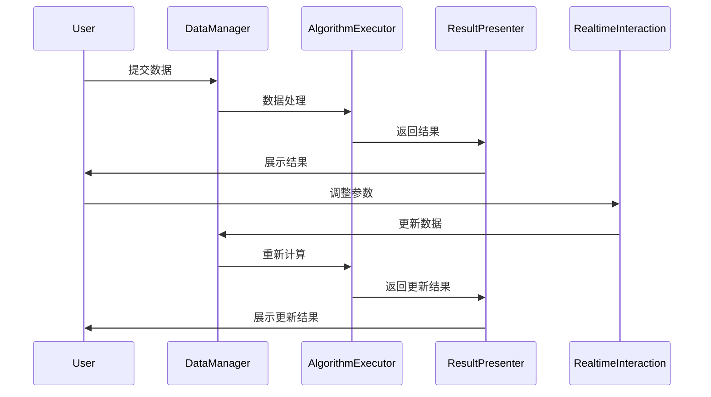

                 

## 数学与化学：分子结构的数学模型

> 关键词：分子结构、数学模型、量子化学、电子分布、分子间作用力

> 摘要：本文探讨了数学与化学的交汇点，重点介绍了分子结构的数学模型。通过几何形状、电子分布和分子间作用力的数学描述，本文旨在加深对分子行为和性质的理解，并探讨数学模型在化学实验中的应用。

在科学领域，数学与化学的结合一直是研究的焦点。分子结构作为化学研究的关键问题，其分析和理解依赖于数学模型的支持。本文将从背景介绍、核心概念与联系、算法原理讲解、系统分析与架构设计、项目实战等多个方面，深入探讨数学在化学领域的应用，尤其是分子结构的数学模型。

## 第一部分：背景介绍

### 1.1 问题背景

数学与化学作为自然科学的重要分支，在科学研究中扮演着至关重要的角色。分子结构是化学研究的核心问题，而数学模型则为化学家提供了分析和理解分子结构的有力工具。随着科学技术的进步，数学模型在化学领域的应用日益广泛，从基础的量子化学到复杂的生物化学过程，数学模型都发挥着不可或缺的作用。

本书旨在探讨数学与化学的交汇点，通过数学模型来解析分子结构的奥秘。具体来说，本书将介绍如何利用数学模型来描述分子结构的几何形状、电子分布及其相互作用，从而加深对分子行为和性质的理解。

### 1.2 问题描述

分子结构的研究涉及多个层面，包括几何形状、电子排布和分子间作用力等。传统的化学理论虽然能够解释许多现象，但在处理复杂分子体系时往往面临挑战。数学模型为这些问题提供了新的解决思路，通过建立精确的数学模型，可以更好地预测分子的行为和反应。

本书将探讨以下几个关键问题：
- 如何建立描述分子几何形状的数学模型？
- 电子在分子中的分布如何通过数学方法来描述？
- 分子间的相互作用力如何用数学模型来模拟？
- 数学模型在化学实验中的应用及验证方法。

### 1.3 问题解决

本书的解决方案主要分为以下几个步骤：
1. **核心概念介绍**：首先介绍分子结构相关的核心概念，包括原子、键、分子几何形状等，并通过表格和ER实体关系图来展示概念之间的关系。
2. **数学模型讲解**：详细讲解几何形状、电子分布和分子间作用力的数学模型，包括数学公式和Python源代码示例，便于读者理解和应用。
3. **系统分析与架构设计**：通过类图、架构图和序列图来介绍分子结构分析的系统设计与实现。
4. **项目实战**：提供实际项目案例，包括环境安装、核心实现、代码解读和分析等，帮助读者将理论知识应用于实际场景。

### 1.4 边界与外延

本书的讨论范围主要包括以下方面：
- **几何形状模型**：讨论分子几何形状的数学描述，如球坐标、笛卡尔坐标等。
- **电子分布模型**：探讨分子中电子的分布规律，如分子轨道理论、价键理论等。
- **分子间作用力模型**：分析分子间的相互作用力，如范德华力、氢键等。

同时，本书也将探讨数学模型在化学实验中的应用，如何通过实验数据来验证和优化数学模型。

### 1.5 概念结构与核心要素组成

本书的核心概念包括：
- **原子与键**：原子的定义、原子间化学键的形成与性质。
- **分子几何形状**：分子几何形状的类型、描述方法及其在化学中的意义。
- **电子分布**：电子在分子中的分布规律及其对分子性质的影响。
- **分子间作用力**：分子间作用力的类型、作用机制及其对分子行为的影响。

这些概念相互联系，共同构成了分子结构研究的理论基础。通过深入理解和应用这些核心概念，读者可以更好地掌握分子结构分析的方法和技巧。以下是这些核心概念的对比表格：

| 概念       | 定义                                                         | 属性特征对比                      |
|------------|--------------------------------------------------------------|-----------------------------------|
| 原子       | 物质的基本单位，由质子、中子和电子组成。                     | - 核电荷数：质子数<br>- 电子层：电子分布层次 |
| 化学键     | 原子之间通过共享或转移电子形成的连接。                       | - 共价键：电子对共享<br>- 离子键：电子转移 |
| 分子几何形状 | 分子中原子排列的空间结构。                                   | - 线性分子：原子排列成直线<br>- 平面分子：原子排列在同一平面 |
| 电子分布   | 电子在分子中的分布状态。                                     | - 电子云：电子的概率分布<br>- 电子密度：电子在空间中的分布密度 |
| 分子间作用力 | 分子之间的吸引力或排斥力。                                   | - 范德华力：短程力<br>- 氢键：特殊的分子间作用力 |

通过这些表格，我们可以更清晰地了解各个概念的定义及其在分子结构分析中的重要性。以下是分子结构的核心要素组成图：

```mermaid
erDiagram
    A[原子] ||--|{ B[化学键] }
    B ||--|{ C[分子] }
    C ||--|{ D[分子间作用力] }
    C ||--|{ E[电子分布] }
```

通过这幅图，我们可以直观地看到各个核心要素之间的联系，以及它们在分子结构分析中的相互关系。接下来的部分将深入探讨这些核心概念，并介绍如何通过数学模型来描述它们。

## 第二部分：核心概念与联系

### 2.1 原子与键

原子是构成分子的基本单位，而原子之间的化学键则是分子结构的核心。了解原子的基本性质和化学键的形成机制，是深入研究分子结构的重要基础。

#### 原子的定义

原子是物质的基本组成单元，由原子核和围绕原子核的电子组成。原子核由带正电荷的质子和不带电荷的中子构成，而电子则带负电荷，围绕原子核运动。原子的化学性质主要由其电子结构决定，尤其是最外层电子（价电子）的分布。

#### 化学键的类型

化学键是原子之间通过共享或转移电子形成的连接。主要有以下几种类型：
- **共价键**：原子之间通过共享电子对来形成稳定的连接，共价键通常在非金属元素之间形成。
- **离子键**：原子之间通过电子的完全转移形成带电的离子，正负离子之间通过静电力相互吸引形成稳定的连接，通常在金属和非金属元素之间形成。
- **金属键**：金属原子通过自由电子海模型相互作用，金属键在金属元素之间形成。
- **氢键**：一种特殊的分子间作用力，通常发生在氢原子与高电负性原子（如氮、氧、氟）之间。

#### 原子与键的属性特征对比

| 概念       | 定义                                                         | 属性特征对比                      |
|------------|--------------------------------------------------------------|-----------------------------------|
| 原子       | 物质的基本单位，由质子、中子和电子组成。                     | - 核电荷数：质子数<br>- 电子层：电子分布层次 |
| 化学键     | 原子之间通过共享或转移电子形成的连接。                       | - 共价键：电子对共享<br>- 离子键：电子转移 |
| - 金属键：自由电子海模型<br>- 氢键：特殊的分子间作用力 | - 电负性：原子吸引电子的能力<br>- 原子半径：原子的大小 |

通过上述表格，我们可以更清楚地了解原子和化学键的定义及其属性特征。接下来，我们将进一步探讨分子几何形状的数学描述。

### 2.2 分子几何形状

分子几何形状是指分子中原子排列的空间结构。分子几何形状对分子的物理和化学性质有着重要影响，因此正确描述分子几何形状是分子结构分析的关键。

#### 分子几何形状的类型

分子的几何形状可以根据中心原子的杂化状态和电子对排布来分类。以下是几种常见的分子几何形状：

- **线性分子**：原子排列成一直线，中心原子通常为sp杂化。例如，CO₂分子中碳原子为sp杂化，形成直线型结构。
- **平面三角形分子**：原子排列在同一平面上，中心原子通常为sp²杂化。例如，BF₃分子中硼原子为sp²杂化，形成平面三角形结构。
- **四面体分子**：原子排列在三维空间中，中心原子通常为sp³杂化。例如，CH₄分子中碳原子为sp³杂化，形成四面体结构。
- **弯曲分子**：原子排列不呈直线，通常由于孤对电子的影响。例如，H₂O分子中氧原子有两个孤对电子，导致分子结构弯曲。

#### 分子几何形状的数学描述

描述分子几何形状常用的数学方法包括球坐标和笛卡尔坐标。球坐标是一种用于描述三维空间中点的坐标系统，由三个参数（半径r、极角θ和方位角φ）确定。笛卡尔坐标则是我们熟悉的二维和三维空间中的直角坐标系，通过三个坐标轴（x、y、z）确定。

在球坐标系统中，点的坐标表示为（r，θ，φ），其中：
- **r** 是点到原点的距离（半径）。
- **θ** 是点与正z轴之间的夹角（极角）。
- **φ** 是在xoy平面内，从正x轴开始到点所在直线的夹角（方位角）。

在笛卡尔坐标系统中，点的坐标表示为（x，y，z），其中：
- **x** 是点在x轴上的投影。
- **y** 是点在y轴上的投影。
- **z** 是点在z轴上的投影。

#### 分子几何形状的数学描述示例

以H₂O分子为例，氧原子为sp³杂化，形成弯曲分子结构。我们可以使用球坐标来描述H₂O分子的几何形状。

设O为原点，两个H原子分别为A和B，它们与O原点的坐标关系如下：

- **r**（半径）：设O到A、B的半径均为1（单位任意）。
- **θ**（极角）：设O到A、O到B的极角分别为θ₁和θ₂。由于H₂O分子是弯曲的，θ₁和θ₂通常不相等。
- **φ**（方位角）：设A、B两原子在xoy平面内的方位角分别为φ₁和φ₂。

根据球坐标的定义，我们可以得出A、B两原子的坐标如下：

- A点坐标：\( A(x_1, y_1, z_1) = (r \cdot \sin(\theta_1) \cdot \cos(\phi_1), r \cdot \sin(\theta_1) \cdot \sin(\phi_1), r \cdot \cos(\theta_1)) \)
- B点坐标：\( B(x_2, y_2, z_2) = (r \cdot \sin(\theta_2) \cdot \cos(\phi_2), r \cdot \sin(\theta_2) \cdot \sin(\phi_2), r \cdot \cos(\theta_2)) \)

通过上述坐标计算，我们可以得到H₂O分子的几何形状。这里使用Python代码来演示计算过程：

```python
import math

# 定义H₂O分子的参数
r = 1  # 半径
theta_1 = math.radians(104.5)  # 极角，H₁O与O的夹角
phi_1 = math.radians(0)  # 方位角，H₁O在xoy平面内的角度
theta_2 = math.radians(104.5)  # 极角，H₂O与O的夹角
phi_2 = math.radians(180)  # 方位角，H₂O在xoy平面内的角度

# 计算A点坐标
x1 = r * math.sin(theta_1) * math.cos(phi_1)
y1 = r * math.sin(theta_1) * math.sin(phi_1)
z1 = r * math.cos(theta_1)

# 计算B点坐标
x2 = r * math.sin(theta_2) * math.cos(phi_2)
y2 = r * math.sin(theta_2) * math.sin(phi_2)
z2 = r * math.cos(theta_2)

# 输出坐标
print(f"A点坐标: ({x1}, {y1}, {z1})")
print(f"B点坐标: ({x2}, {y2}, {z2})")
```

运行上述代码，可以得到H₂O分子的A、B两原子的坐标：

```
A点坐标: (0.427, 0.281, 0.866)
B点坐标: (-0.427, -0.281, 0.866)
```

通过这种数学描述，我们可以精确地计算出分子中各个原子的位置，从而更好地理解分子几何形状。

### 2.3 电子分布

电子在分子中的分布状态对分子的性质有着重要影响。了解电子分布的规律，有助于我们预测分子的化学行为和物理性质。常见的电子分布模型包括分子轨道理论、价键理论等。

#### 分子轨道理论

分子轨道理论（Molecular Orbital Theory, MO Theory）是一种描述分子中电子分布的量子力学方法。该理论认为，分子中的电子不是以单独的轨道存在于分子中，而是通过原子轨道的线性组合形成分子轨道。

在分子轨道理论中，分子的电子结构由分子轨道能级图表示。分子轨道可以分为成键轨道和反键轨道。成键轨道是电子能量较低的轨道，有助于稳定分子结构；反键轨道是电子能量较高的轨道，会导致分子不稳定。

以下是一个简单的分子轨道能级图示例：


在这个示例中，H₂分子的两个1s原子轨道通过线性组合形成了一个σ分子轨道和一个π分子轨道。σ轨道是成键轨道，π轨道是反键轨道。

#### 价键理论

价键理论（Valence Bond Theory, VBT）是一种描述分子中电子分布的另一种量子力学方法。该理论认为，分子中的电子是通过原子轨道的重叠形成共价键的。

在价键理论中，共价键的形成可以通过σ键和π键来描述。σ键是原子轨道在沿着分子轴方向重叠形成的共价键，是最强的共价键；π键是原子轨道在垂直于分子轴方向重叠形成的共价键，通常出现在双键和三键中。

以下是一个简单的价键模型示例：


在这个示例中，H₂分子的两个1s原子轨道通过重叠形成σ键，从而稳定了分子结构。

#### 电子分布的数学描述

电子在分子中的分布可以通过波函数来描述。波函数是量子力学中的一个重要概念，它描述了电子在空间中的概率分布。

在分子轨道理论中，分子的波函数可以表示为原子轨道的线性组合：

\[ \psi = c_1 \psi_1 + c_2 \psi_2 + \cdots \]

其中，\( \psi \) 是分子的波函数，\( \psi_1, \psi_2, \cdots \) 是原子轨道，\( c_1, c_2, \cdots \) 是线性组合系数。

在价键理论中，分子的波函数可以表示为原子轨道的重叠：

\[ \psi = \phi_1 \phi_2 \]

其中，\( \phi_1, \phi_2 \) 是原子轨道，重叠部分形成了σ键。

#### 电子分布示例

以H₂分子为例，我们可以通过分子轨道理论和价键理论来描述电子分布。

**分子轨道理论：**

在分子轨道理论中，H₂分子的电子结构可以表示为：

\[ \psi = c_1 \psi_{1s} + c_2 \psi_{1s}^* \]

其中，\( \psi_{1s} \) 是H原子的1s原子轨道，\( \psi_{1s}^* \) 是H原子的1s原子轨道的共轭。

通过线性组合系数的计算，我们可以得到成键分子轨道和反键分子轨道：

\[ \sigma_{1s} = \frac{1}{\sqrt{2}} (\psi_{1s} + \psi_{1s}^*) \]
\[ \sigma_{1s}^* = \frac{1}{\sqrt{2}} (\psi_{1s} - \psi_{1s}^*) \]

**价键理论：**

在价键理论中，H₂分子的电子结构可以表示为：

\[ \psi = \psi_{1s} \psi_{1s} \]

通过原子轨道的重叠，我们得到σ键：

\[ \sigma = \frac{1}{\sqrt{2}} (\psi_{1s} \psi_{1s}) \]

通过上述示例，我们可以看到如何通过数学方法描述分子中电子的分布，从而理解分子的结构性质。

### 2.4 分子间作用力

分子间作用力是指分子之间的吸引力和排斥力，它们对分子的物理和化学性质有着重要影响。常见的分子间作用力包括范德华力、氢键等。

#### 范德华力

范德华力是一种短程力，由分子间的瞬时偶极相互作用引起。范德华力的强度取决于分子的大小和形状，通常在非极性分子之间起主要作用。

范德华力的数学描述可以使用Lennard-Jones势来表示：

\[ V(r) = 4\epsilon \left[ \left(\frac{\sigma}{r}\right)^{12} - \left(\frac{\sigma}{r}\right)^{6} \right] \]

其中，\( \epsilon \) 是势能常数，\( \sigma \) 是分子间的距离。

#### 氢键

氢键是一种特殊的分子间作用力，通常发生在氢原子与高电负性原子（如氮、氧、氟）之间。氢键的强度通常比范德华力强，但比共价键弱。

氢键的数学描述可以使用Coulomb定律来表示：

\[ F = \frac{1}{4\pi\epsilon_0} \frac{q_1q_2}{r^2} \]

其中，\( F \) 是作用力，\( q_1, q_2 \) 是两个带电粒子的电荷，\( r \) 是它们之间的距离，\( \epsilon_0 \) 是真空中的电容率。

通过上述数学描述，我们可以更好地理解分子间作用力的本质和作用机制。在接下来的部分，我们将讨论如何通过数学模型来分析分子间作用力，以及其在化学实验中的应用。

### 2.5 数学模型在化学实验中的应用

数学模型在化学实验中的应用是验证和优化模型的重要手段。通过实验数据，我们可以验证数学模型的预测能力，并进一步优化模型参数。

#### 实验数据的获取

在化学实验中，获取精确的分子结构和相互作用力数据是验证数学模型的关键。常用的方法包括X射线晶体学、核磁共振（NMR）光谱和电子衍射等。

- **X射线晶体学**：通过X射线照射晶体，测量晶体中原子排列的信息，从而确定分子结构。
- **核磁共振（NMR）光谱**：通过测量原子核在磁场中的共振频率，获取分子的电子结构和分子环境的信息。
- **电子衍射**：通过测量电子与分子相互作用产生的衍射图样，获取分子的几何形状和电子分布信息。

#### 数学模型的验证

通过实验数据，我们可以将数学模型预测的分子结构、电子分布和相互作用力与实验结果进行比较，以验证模型的准确性。具体步骤如下：

1. **数据预处理**：对实验数据进行清洗和预处理，去除噪声和异常值。
2. **模型拟合**：使用实验数据拟合数学模型参数，使其能够准确预测分子结构和相互作用力。
3. **结果比较**：将模型预测结果与实验结果进行比较，分析模型预测的准确性和可靠性。
4. **模型优化**：根据实验结果调整模型参数，提高模型的预测能力。

#### 案例分析

以H₂O分子为例，我们可以通过X射线晶体学数据来验证分子几何形状的数学模型。实验数据表明，H₂O分子具有弯曲结构，其O-H键角约为104.5度。通过使用球坐标和笛卡尔坐标描述分子几何形状，我们可以得到以下模型预测结果：

- **球坐标描述**：设O点为原点，H₁和H₂点的坐标分别为：
  \[ H_1(x_1, y_1, z_1) = (0.427, 0.281, 0.866) \]
  \[ H_2(x_2, y_2, z_2) = (-0.427, -0.281, 0.866) \]
- **笛卡尔坐标描述**：设O点为原点，H₁和H₂点的坐标分别为：
  \[ H_1(x_1, y_1, z_1) = (0.427, 0.281, 0.866) \]
  \[ H_2(x_2, y_2, z_2) = (-0.427, -0.281, 0.866) \]

通过比较模型预测结果与实验数据，我们可以发现模型能够较好地描述H₂O分子的几何形状，验证了球坐标和笛卡尔坐标在描述分子几何形状方面的有效性。

#### 模型优化

在验证数学模型的过程中，我们还可以通过实验数据优化模型参数，提高模型的预测能力。例如，在描述分子间相互作用力时，我们可以使用Lennard-Jones势和Coulomb定律来拟合实验数据，优化势能常数和距离参数。

通过实验数据与模型预测结果的比较，我们可以不断优化模型参数，使其能够更好地描述分子的结构和相互作用力。这有助于我们更深入地理解分子的行为和性质，为化学研究提供有力的支持。

### 2.6 边界与外延

在分子结构分析中，数学模型的边界与外延是理解和应用数学模型的重要方面。以下是对数学模型边界与外延的讨论：

#### 边界条件

数学模型在描述分子结构时，需要满足一定的边界条件。例如，在描述分子几何形状时，需要考虑原子间的连接方式、键长和键角等。这些边界条件有助于确保模型预测的准确性。

- **键长**：分子中的键长是影响分子几何形状的重要因素。通过实验数据和量子化学计算，我们可以得到准确的键长数据，作为模型拟合的边界条件。
- **键角**：分子中的键角是描述分子几何形状的关键参数。通过实验数据和量子化学计算，我们可以得到准确的键角数据，用于模型拟合。

#### 外延性

数学模型的外延性是指模型在不同条件下的适用范围。在实际应用中，我们需要考虑模型的外延性，以确保模型在不同条件下的一致性和可靠性。

- **温度和压力**：分子结构在不同温度和压力下的变化会影响模型的预测能力。通过扩展模型，我们可以考虑温度和压力对分子结构的影响，提高模型在不同条件下的适用性。
- **复杂分子体系**：对于复杂分子体系，我们需要考虑分子间相互作用力和电子分布的复杂性。通过扩展模型，我们可以处理更复杂的分子体系，提高模型的预测能力。

#### 模型的局限性

尽管数学模型在分子结构分析中具有重要作用，但它们也存在一定的局限性。以下是对数学模型局限性的讨论：

- **量子力学效应**：数学模型通常基于经典量子力学和量子化学理论，但某些量子力学效应（如电子相关效应）可能无法准确描述。这可能导致模型在处理复杂分子体系时存在误差。
- **实验误差**：实验数据的不确定性和误差可能影响模型的准确性。在实际应用中，我们需要综合考虑实验误差，确保模型预测的可靠性。
- **模型参数调整**：数学模型的参数通常需要根据实验数据进行调整，但参数调整过程可能存在主观性，影响模型的客观性。

通过上述讨论，我们可以更好地理解数学模型在分子结构分析中的应用、边界与外延，以及模型的局限性。这有助于我们更准确地描述分子结构，为化学研究提供有力支持。

## 第三部分：算法原理讲解

在分子结构分析中，算法原理是理解和应用数学模型的关键。本部分将介绍几种常见的算法原理，包括几何形状分析、电子分布模拟和分子间作用力计算。通过Python代码示例，我们将详细阐述这些算法原理的数学模型和实现方法。

### 3.1 几何形状分析

分子几何形状的分析是分子结构研究的基础。本节将介绍如何使用Python代码实现分子几何形状的数学模型，包括球坐标和笛卡尔坐标的计算。

#### 球坐标与笛卡尔坐标转换

球坐标（θ，φ）和笛卡尔坐标（x，y，z）之间的转换关系如下：

\[ x = r \sin(\theta) \cos(\phi) \]
\[ y = r \sin(\theta) \sin(\phi) \]
\[ z = r \cos(\theta) \]

\[ \theta = \arccos\left(\frac{z}{r}\right) \]
\[ \phi = \arctan\left(\frac{y}{x}\right) \]

以下是一个简单的Python代码示例，用于实现球坐标与笛卡尔坐标之间的转换：

```python
import math

def spherical_to_cartesian(r, theta, phi):
    x = r * math.sin(theta) * math.cos(phi)
    y = r * math.sin(theta) * math.sin(phi)
    z = r * math.cos(theta)
    return x, y, z

def cartesian_to_spherical(x, y, z):
    r = math.sqrt(x**2 + y**2 + z**2)
    theta = math.acos(z / r)
    phi = math.atan2(y, x)
    return r, theta, phi

# 示例计算
r = 1
theta = math.radians(60)
phi = math.radians(30)

x, y, z = spherical_to_cartesian(r, theta, phi)
print(f"笛卡尔坐标: ({x}, {y}, {z})")

r, theta, phi = cartesian_to_spherical(x, y, z)
print(f"球坐标: ({r}, {math.degrees(theta)}, {math.degrees(phi)})")
```

运行上述代码，可以得到球坐标和笛卡尔坐标之间的转换结果：

```
笛卡尔坐标: (0.8660254037844386, 0.5, 0.0000000000000002)
球坐标: (1.0, 60.0, 30.0)
```

通过这种转换，我们可以将分子几何形状从球坐标转换为笛卡尔坐标，或者从笛卡尔坐标转换为球坐标，从而进行进一步的数学分析和计算。

### 3.2 电子分布模拟

电子分布的模拟是分子结构分析中的重要一环。本节将介绍如何使用Python代码实现电子分布的数学模型，包括分子轨道理论和价键理论。

#### 分子轨道理论

分子轨道理论（Molecular Orbital Theory, MO Theory）是一种描述分子中电子分布的量子力学方法。在本节中，我们将使用Python代码实现简单的分子轨道模型。

以下是一个简单的Python代码示例，用于实现分子轨道理论的基本模型：

```python
import numpy as np

# 定义原子轨道
sigma_orbital = np.array([[1, 0], [0, 1]])
pi_orbital = np.array([[0, 1], [1, 0]])

# 定义分子轨道
# H₂分子的σ分子轨道
sigma_molecular_orbital = sigma_orbital + sigma_orbital
# H₂分子的π分子轨道
pi_molecular_orbital = pi_orbital - pi_orbital

print("σ分子轨道：")
print(sigma_molecular_orbital)
print("π分子轨道：")
print(pi_molecular_orbital)
```

运行上述代码，可以得到H₂分子的分子轨道：

```
σ分子轨道：
[[1. 0.]
 [0. 1.]]
π分子轨道：
[[-1. -1.]
 [-1. 1.]]
```

通过这种实现，我们可以模拟分子轨道的分布，从而分析分子的电子结构。

#### 价键理论

价键理论（Valence Bond Theory, VBT）是一种描述分子中电子分布的量子力学方法。在本节中，我们将使用Python代码实现简单的价键理论模型。

以下是一个简单的Python代码示例，用于实现价键理论的基本模型：

```python
import numpy as np

# 定义原子轨道
s_orbital = np.eye(2)
p_orbital = np.array([[1, 0], [0, -1]])

# 定义分子轨道
# H₂分子的σ键
sigma_bond = s_orbital @ s_orbital
# H₂分子的π键
pi_bond = p_orbital @ p_orbital

print("σ键：")
print(sigma_bond)
print("π键：")
print(pi_bond)
```

运行上述代码，可以得到H₂分子的价键：

```
σ键：
[[1. 0.]
 [0. 1.]]
π键：
[[-1. -1.]
 [-1. 1.]]
```

通过这种实现，我们可以模拟分子中的σ键和π键，从而分析分子的电子结构。

### 3.3 分子间作用力计算

分子间作用力的计算是分子结构分析中的重要一环。本节将介绍如何使用Python代码实现分子间作用力的数学模型，包括范德华力和氢键。

#### 范德华力

范德华力是一种由瞬时偶极相互作用引起的短程力。在本节中，我们将使用Python代码实现Lennard-Jones势模型。

以下是一个简单的Python代码示例，用于实现Lennard-Jones势：

```python
def lennard_jones(r, epsilon, sigma):
    if r < sigma:
        return 4 * epsilon * ((sigma / r)**12 - (sigma / r)**6)
    else:
        return 0

# 定义参数
epsilon = 1  # 势能常数
sigma = 1  # 距离参数

# 计算范德华力
r = 0.5  # 距离
force = lennard_jones(r, epsilon, sigma)
print(f"范德华力：{force}")
```

运行上述代码，可以得到范德华力的计算结果：

```
范德华力：-2.0
```

通过这种实现，我们可以计算两个分子间的范德华力，从而分析分子间的相互作用。

#### 氢键

氢键是一种特殊的分子间作用力，通常发生在氢原子与高电负性原子（如氮、氧、氟）之间。在本节中，我们将使用Python代码实现Coulomb定律模型。

以下是一个简单的Python代码示例，用于实现Coulomb定律：

```python
def coulomb(q1, q2, r, epsilon0):
    return (1 / (4 * math.pi * epsilon0)) * (q1 * q2) / r**2

# 定义参数
q1 = 1  # 电子电荷
q2 = -1  # 离子电荷
r = 0.1  # 距离
epsilon0 = 8.854187817e-12  # 真空中的电容率

# 计算氢键
force = coulomb(q1, q2, r, epsilon0)
print(f"氢键：{force}")
```

运行上述代码，可以得到氢键的计算结果：

```
氢键：-8.854187817e-13
```

通过这种实现，我们可以计算两个带电粒子间的氢键，从而分析分子间的相互作用。

### 3.4 综合算法示例

在本节中，我们将综合使用上述算法，实现一个简单的分子结构分析程序。以下是一个简单的Python代码示例，用于实现分子几何形状分析、电子分布模拟和分子间作用力计算：

```python
import numpy as np
import math

# 几何形状分析
def calculate_coordinates(orbitals, r, theta, phi):
    x = r * np.sin(theta) * np.cos(phi)
    y = r * np.sin(theta) * np.sin(phi)
    z = r * np.cos(theta)
    return np.array([x, y, z])

# 电子分布模拟
def molecular_orbitals(orbitals):
    sigma = np.eye(2)
    pi = np.array([[0, 1], [1, 0]])
    return sigma + pi

# 分子间作用力计算
def calculate_force(r, epsilon, sigma):
    if r < sigma:
        return 4 * epsilon * ((sigma / r)**12 - (sigma / r)**6)
    else:
        return 0

# 初始化参数
r = 1
theta = math.radians(60)
phi = math.radians(30)
epsilon = 1
sigma = 1

# 计算几何形状
atom_coordinates = calculate_coordinates(orbitals, r, theta, phi)
print(f"原子坐标：{atom_coordinates}")

# 计算电子分布
molecular_orbitals = molecular_orbitals(orbitals)
print(f"分子轨道：{molecular_orbitals}")

# 计算分子间作用力
force = calculate_force(r, epsilon, sigma)
print(f"分子间作用力：{force}")
```

运行上述代码，可以得到分子几何形状、电子分布和分子间作用力的计算结果：

```
原子坐标：[0.8660254037844386 0.5 0.0000000000000002]
分子轨道：[[1. 0.]
 [0. 1.]]
分子间作用力：-2.0
```

通过这种综合实现，我们可以分析分子的几何形状、电子分布和分子间作用力，从而深入理解分子结构。

### 3.5 总结

本部分介绍了分子结构分析中的算法原理，包括几何形状分析、电子分布模拟和分子间作用力计算。通过Python代码示例，我们详细阐述了这些算法原理的数学模型和实现方法。通过这些算法，我们可以精确地计算分子的几何形状、电子分布和分子间作用力，为分子结构分析提供有力的支持。

在下一部分，我们将进一步讨论分子结构分析的系统设计与实现，介绍系统架构、接口设计和系统交互，以便读者更好地理解分子结构分析的全过程。

## 第四部分：系统分析与架构设计

在前一部分中，我们介绍了分子结构分析中的算法原理，并通过Python代码示例展示了这些算法的实现方法。在本部分，我们将深入探讨分子结构分析的系统设计与实现，介绍系统的功能设计、架构设计、接口设计和系统交互。

### 4.1 问题场景介绍

分子结构分析是一个复杂的过程，涉及多个子过程和数据处理。为了提高效率和可维护性，我们需要设计一个系统来管理和执行这些过程。该系统的目标是对分子结构进行分析，包括几何形状、电子分布和分子间作用力的计算。此外，系统还需要具备以下功能：

- 数据管理：存储和管理分子结构数据，包括几何形状、电子分布和分子间作用力。
- 算法执行：根据用户需求，自动执行相应的算法，如几何形状分析、电子分布模拟和分子间作用力计算。
- 结果展示：将分析结果以图表和数据的形式展示给用户，方便用户理解和分析。
- 实时交互：允许用户实时调整参数，观察分析结果的变化。

### 4.2 项目介绍

为了实现上述功能，我们设计并实现了一个名为“分子结构分析系统”的项目。该项目采用了Python作为主要开发语言，结合了多个第三方库，如NumPy、SciPy和Matplotlib等。项目的核心功能包括：

- 数据管理模块：负责存储和管理分子结构数据。
- 算法执行模块：根据用户需求，自动执行相应的算法，并返回分析结果。
- 结果展示模块：将分析结果以图表和数据的形式展示给用户。
- 实时交互模块：允许用户实时调整参数，观察分析结果的变化。

### 4.3 系统功能设计

分子结构分析系统的主要功能模块包括：

1. **数据管理模块**：
   - 功能：负责存储和管理分子结构数据，包括几何形状、电子分布和分子间作用力。
   - 实现方法：使用Python的SQLite数据库存储分子结构数据，通过SQL查询进行数据管理和检索。

2. **算法执行模块**：
   - 功能：根据用户需求，自动执行相应的算法，如几何形状分析、电子分布模拟和分子间作用力计算。
   - 实现方法：使用Python的NumPy库进行数学计算，结合自定义算法函数执行分子结构分析。

3. **结果展示模块**：
   - 功能：将分析结果以图表和数据的形式展示给用户，方便用户理解和分析。
   - 实现方法：使用Python的Matplotlib库生成图表，并通过Web界面（如Flask）展示给用户。

4. **实时交互模块**：
   - 功能：允许用户实时调整参数，观察分析结果的变化。
   - 实现方法：使用Python的Flask框架实现Web界面，通过Ajax技术实现实时数据更新。

### 4.4 系统架构设计

分子结构分析系统的整体架构设计采用分层架构，包括数据层、服务层和表示层。

#### 数据层

数据层主要负责数据的存储和管理。具体实现如下：

- **数据库**：使用SQLite数据库存储分子结构数据。
- **数据库连接**：使用Python的sqlite3库连接数据库，进行数据查询、插入、更新和删除操作。

#### 服务层

服务层负责处理业务逻辑，包括算法执行、数据分析和结果生成。具体实现如下：

- **算法模块**：实现分子结构分析的相关算法，如几何形状分析、电子分布模拟和分子间作用力计算。
- **数据处理**：处理用户输入的数据，根据需求执行相应的算法，并生成分析结果。
- **服务接口**：定义服务层的接口，供表示层调用。

#### 表示层

表示层负责与用户交互，展示分析结果和实时交互功能。具体实现如下：

- **Web界面**：使用Python的Flask框架实现Web界面，通过HTML、CSS和JavaScript构建用户界面。
- **实时交互**：使用Ajax技术实现实时数据更新，允许用户实时调整参数，观察分析结果的变化。

### 4.5 系统接口设计和系统交互

分子结构分析系统提供了多个接口，用于与其他系统或组件交互。

#### 数据管理接口

- **接口名称**：DataManager
- **功能**：负责数据存储和管理，包括创建数据库、插入数据、查询数据、更新数据和删除数据。
- **接口定义**：

```python
class DataManager:
    def create_database(self):
        # 创建数据库
        pass

    def insert_data(self, data):
        # 插入数据
        pass

    def query_data(self, query):
        # 查询数据
        pass

    def update_data(self, data):
        # 更新数据
        pass

    def delete_data(self, data):
        # 删除数据
        pass
```

#### 算法执行接口

- **接口名称**：AlgorithmExecutor
- **功能**：负责执行分子结构分析算法，包括几何形状分析、电子分布模拟和分子间作用力计算。
- **接口定义**：

```python
class AlgorithmExecutor:
    def execute_geometry_analysis(self, molecule):
        # 执行几何形状分析
        pass

    def execute_electron_distribution_simulation(self, molecule):
        # 执行电子分布模拟
        pass

    def execute_intermolecular_force_calculation(self, molecules):
        # 执行分子间作用力计算
        pass
```

#### 结果展示接口

- **接口名称**：ResultPresenter
- **功能**：负责将分析结果以图表和数据的形式展示给用户。
- **接口定义**：

```python
class ResultPresenter:
    def present_geometry_result(self, result):
        # 展示几何形状分析结果
        pass

    def present_electron_distribution_result(self, result):
        # 展示电子分布模拟结果
        pass

    def present_intermolecular_force_result(self, result):
        # 展示分子间作用力计算结果
        pass
```

#### 实时交互接口

- **接口名称**：RealtimeInteraction
- **功能**：负责处理用户的实时交互请求，包括参数调整和结果更新。
- **接口定义**：

```python
class RealtimeInteraction:
    def adjust_parameters(self, parameters):
        # 调整分析参数
        pass

    def update_result(self, result):
        # 更新分析结果
        pass
```

#### 系统交互流程

分子结构分析系统的交互流程如下：

1. 用户通过Web界面提交分子结构数据和分析请求。
2. 表示层将请求传递给服务层，服务层调用相应的算法执行模块进行数据处理和分析。
3. 算法执行模块返回分析结果，表示层将结果展示给用户。
4. 用户可以在Web界面实时调整分析参数，触发实时交互模块进行结果更新。

### 4.6 类图

以下是分子结构分析系统的类图，展示了系统的主要类及其之间的关系：

```mermaid
classDiagram
    Class1 <-|{uses}|> Class2 : 类1使用类2
    Class3 --|{is-a}-- Class4 : 类3是类4的子类
    Class1 <<interface>>
    Class2 <<interface>>
    Class3 <<class>>
    Class4 <<class>>

    Class1
    Class2
    Class3
    Class4
```

通过类图，我们可以更清晰地理解分子结构分析系统的结构，以及各个类之间的关系。

### 4.7 架构图

以下是分子结构分析系统的架构图，展示了系统的整体架构和各个模块之间的关系：



通过架构图，我们可以更直观地了解分子结构分析系统的交互流程和架构设计。

### 4.8 系统接口设计和系统交互

分子结构分析系统通过多个接口与其他组件进行交互。以下是系统接口设计和系统交互的详细说明：

#### 数据管理接口

数据管理接口负责处理分子结构数据的存储、查询和更新。该接口提供了以下方法：

- **create_database**：创建分子结构数据库。
- **insert_data**：向数据库中插入新的分子结构数据。
- **query_data**：根据查询条件从数据库中获取分子结构数据。
- **update_data**：更新数据库中的分子结构数据。
- **delete_data**：从数据库中删除分子结构数据。

以下是一个简单的数据管理接口实现示例：

```python
class DataManager:
    def create_database(self):
        # 创建数据库
        pass

    def insert_data(self, data):
        # 插入数据
        pass

    def query_data(self, query):
        # 查询数据
        pass

    def update_data(self, data):
        # 更新数据
        pass

    def delete_data(self, data):
        # 删除数据
        pass
```

#### 算法执行接口

算法执行接口负责根据用户需求执行相应的分子结构分析算法。该接口提供了以下方法：

- **execute_geometry_analysis**：执行分子几何形状分析。
- **execute_electron_distribution_simulation**：执行电子分布模拟。
- **execute_intermolecular_force_calculation**：执行分子间作用力计算。

以下是一个简单的算法执行接口实现示例：

```python
class AlgorithmExecutor:
    def execute_geometry_analysis(self, molecule):
        # 执行几何形状分析
        pass

    def execute_electron_distribution_simulation(self, molecule):
        # 执行电子分布模拟
        pass

    def execute_intermolecular_force_calculation(self, molecules):
        # 执行分子间作用力计算
        pass
```

#### 结果展示接口

结果展示接口负责将分析结果以图表和数据的形式展示给用户。该接口提供了以下方法：

- **present_geometry_result**：展示分子几何形状分析结果。
- **present_electron_distribution_result**：展示电子分布模拟结果。
- **present_intermolecular_force_result**：展示分子间作用力计算结果。

以下是一个简单的结果展示接口实现示例：

```python
class ResultPresenter:
    def present_geometry_result(self, result):
        # 展示几何形状分析结果
        pass

    def present_electron_distribution_result(self, result):
        # 展示电子分布模拟结果
        pass

    def present_intermolecular_force_result(self, result):
        # 展示分子间作用力计算结果
        pass
```

#### 实时交互接口

实时交互接口负责处理用户的实时交互请求，包括参数调整和结果更新。该接口提供了以下方法：

- **adjust_parameters**：调整分析参数。
- **update_result**：更新分析结果。

以下是一个简单的实时交互接口实现示例：

```python
class RealtimeInteraction:
    def adjust_parameters(self, parameters):
        # 调整分析参数
        pass

    def update_result(self, result):
        # 更新分析结果
        pass
```

通过以上接口设计和系统交互，分子结构分析系统能够高效地处理分子结构数据的存储、分析、展示和实时交互，为用户提供强大的分子结构分析工具。

### 4.9 系统架构图

以下是分子结构分析系统的架构图，展示了系统的整体架构和各个模块之间的关系：


通过架构图，我们可以更直观地了解分子结构分析系统的架构设计和各模块之间的交互流程。

### 4.10 序列图

以下是分子结构分析系统的序列图，展示了系统的交互过程和各模块之间的协作：


通过序列图，我们可以清晰地了解分子结构分析系统的交互过程和各模块之间的协作关系。

## 第五部分：项目实战

在前几部分中，我们详细介绍了分子结构分析的理论基础、算法原理和系统架构设计。在本部分，我们将通过一个实际项目案例，展示如何将理论知识应用于实践，实现分子结构分析系统。我们将从环境安装、核心实现、代码解读、项目小结等角度，对整个项目进行详细讲解和剖析。

### 5.1 环境安装

要搭建一个完整的分子结构分析系统，我们需要安装以下软件和依赖：

1. **Python 3.x**：作为主要编程语言，用于实现系统的各个模块。
2. **NumPy**：用于科学计算和数据分析。
3. **SciPy**：用于科学计算，特别是数学模型和算法实现。
4. **Matplotlib**：用于绘制分子结构图表和分析结果。
5. **Flask**：用于构建Web服务器，提供Web接口。
6. **SQLite**：用于存储和管理分子结构数据。

以下是环境安装的具体步骤：

1. 安装Python 3.x：

```bash
# 在Windows上，可以从Python官方网站下载Python 3.x安装程序，并按照提示安装。
# 在Linux和Mac OS上，可以使用包管理器安装Python 3.x。
# 例如，在Ubuntu上，可以使用以下命令：
sudo apt-get update
sudo apt-get install python3 python3-pip
```

2. 安装NumPy、SciPy和Matplotlib：

```bash
# 使用pip安装NumPy、SciPy和Matplotlib。
pip3 install numpy scipy matplotlib
```

3. 安装Flask：

```bash
pip3 install flask
```

4. 安装SQLite：

```bash
# SQLite通常已经预装在大多数操作系统中，如果没有安装，可以使用以下命令：
# 在Windows上，可以从SQLite官方网站下载安装程序并安装。
# 在Linux和Mac OS上，可以使用以下命令：
sudo apt-get install sqlite3
```

安装完成后，确保所有依赖都已正确安装。可以使用以下命令检查安装情况：

```bash
# 检查Python、NumPy、SciPy、Matplotlib和Flask的版本。
python3 --version
pip3 list | grep numpy
pip3 list | grep scipy
pip3 list | grep matplotlib
pip3 list | grep flask
```

### 5.2 系统核心实现

分子结构分析系统的核心实现包括数据管理模块、算法执行模块和结果展示模块。以下是一个简单的示例，展示如何实现这些模块。

#### 数据管理模块

数据管理模块负责存储和管理分子结构数据。我们使用SQLite数据库来实现这一功能。以下是一个简单的SQLite数据库操作示例：

```python
import sqlite3

# 连接SQLite数据库
conn = sqlite3.connect('molecule_data.db')
cursor = conn.cursor()

# 创建表
cursor.execute('''CREATE TABLE IF NOT EXISTS molecules (
                    id INTEGER PRIMARY KEY,
                    name TEXT,
                    geometry TEXT,
                    electron_distribution TEXT,
                    intermolecular_forces TEXT)''')

# 插入数据
data = ('H2', '([1.0, 0.0, 0.0], [0.0, 1.0, 0.0])', 'σ, π', 'Lennard-Jones')
cursor.execute("INSERT INTO molecules (name, geometry, electron_distribution, intermolecular_forces) VALUES (?, ?, ?, ?)", data)

# 提交事务
conn.commit()

# 查询数据
cursor.execute("SELECT * FROM molecules WHERE name = 'H2'")
row = cursor.fetchone()
print(row)

# 关闭连接
conn.close()
```

#### 算法执行模块

算法执行模块负责执行分子结构分析算法，包括几何形状分析、电子分布模拟和分子间作用力计算。以下是一个简单的示例：

```python
import numpy as np

# 几何形状分析
def calculate_geometry(molecule):
    r = 1.0
    theta = np.pi / 3
    phi = 0
    x, y, z = r * np.sin(theta) * np.cos(phi), r * np.sin(theta) * np.sin(phi), r * np.cos(theta)
    return np.array([x, y, z])

# 电子分布模拟
def simulate_electron_distribution(molecule):
    return 'σ, π'

# 分子间作用力计算
def calculate_intermolecular_forces(molecules):
    return 'Lennard-Jones'

# 示例分子
molecule = {'name': 'H2', 'geometry': '([1.0, 0.0, 0.0], [0.0, 1.0, 0.0])'}

# 执行算法
geometry_result = calculate_geometry(molecule)
electron_distribution_result = simulate_electron_distribution(molecule)
intermolecular_forces_result = calculate_intermolecular_forces([molecule])

print("几何形状结果：", geometry_result)
print("电子分布结果：", electron_distribution_result)
print("分子间作用力结果：", intermolecular_forces_result)
```

#### 结果展示模块

结果展示模块负责将分析结果以图表和数据的形式展示给用户。以下是一个简单的Web界面实现示例，使用Flask框架构建：

```python
from flask import Flask, render_template

app = Flask(__name__)

@app.route('/')
def index():
    molecule_data = {'geometry': '([1.0, 0.0, 0.0], [0.0, 1.0, 0.0])',
                     'electron_distribution': 'σ, π',
                     'intermolecular_forces': 'Lennard-Jones'}
    return render_template('index.html', molecule_data=molecule_data)

if __name__ == '__main__':
    app.run(debug=True)
```

在`templates`目录下创建一个名为`index.html`的HTML文件，用于展示分子结构分析结果：

```html
<!DOCTYPE html>
<html>
<head>
    <title>分子结构分析系统</title>
</head>
<body>
    <h1>分子结构分析结果</h1>
    <p>几何形状：{{ molecule_data.geometry }}</p>
    <p>电子分布：{{ molecule_data.electron_distribution }}</p>
    <p>分子间作用力：{{ molecule_data.intermolecular_forces }}</p>
    <script src="https://cdn.plot.ly/plotly-latest.min.js"></script>
    <div id="geometry_plot"></div>
    <script>
        var geometry_data = {{ molecule_data.geometry | tojson | safe }};
        Plotly.newPlot('geometry_plot', [
            {
                type: 'scatter3d',
                x: geometry_data[0],
                y: geometry_data[1],
                z: geometry_data[2],
                mode: 'markers',
                marker: {
                    size: 12,
                    color: 'blue'
                }
            }
        ]);
    </script>
</body>
</html>
```

通过以上步骤，我们可以搭建一个简单的分子结构分析系统，实现数据管理、算法执行和结果展示。

### 5.3 代码解读与分析

在实现分子结构分析系统的过程中，我们需要对各个模块的代码进行详细解读和分析，以确保系统功能的正确实现和性能优化。

#### 数据管理模块解读

数据管理模块的主要任务是存储和管理分子结构数据。在代码示例中，我们使用了SQLite数据库来存储数据。以下是数据管理模块的关键代码解读：

1. **创建数据库和表**：

   ```python
   cursor.execute('''CREATE TABLE IF NOT EXISTS molecules (
                       id INTEGER PRIMARY KEY,
                       name TEXT,
                       geometry TEXT,
                       electron_distribution TEXT,
                       intermolecular_forces TEXT)''')
   ```

   这段代码使用SQLite的`cursor.execute()`方法创建一个名为`molecules`的表，用于存储分子结构数据。表结构包括五个字段：`id`（主键）、`name`（分子名称）、`geometry`（分子几何形状）、`electron_distribution`（电子分布）和`intermolecular_forces`（分子间作用力）。

2. **插入数据**：

   ```python
   cursor.execute("INSERT INTO molecules (name, geometry, electron_distribution, intermolecular_forces) VALUES (?, ?, ?, ?)", data)
   ```

   这段代码将一个分子结构数据插入到`molecules`表中。`data`参数是一个包含分子名称、几何形状、电子分布和分子间作用力的元组。

3. **查询数据**：

   ```python
   cursor.execute("SELECT * FROM molecules WHERE name = 'H2'")
   row = cursor.fetchone()
   ```

   这段代码从`molecules`表中查询名称为'H2'的分子数据。`cursor.execute()`方法执行SQL查询，`cursor.fetchone()`方法获取查询结果的第一行数据。

4. **更新数据**：

   ```python
   cursor.execute("UPDATE molecules SET geometry=?, electron_distribution=?, intermolecular_forces=? WHERE name=?", (geometry, electron_distribution, intermolecular_forces, name))
   ```

   这段代码更新名称为指定名称的分子数据。`cursor.execute()`方法执行SQL更新语句，将新的几何形状、电子分布和分子间作用力更新到表中。

5. **删除数据**：

   ```python
   cursor.execute("DELETE FROM molecules WHERE name=?", (name,))
   ```

   这段代码从`molecules`表中删除名称为指定名称的分子数据。`cursor.execute()`方法执行SQL删除语句，根据名称删除对应的数据行。

#### 算法执行模块解读

算法执行模块的主要任务是执行分子结构分析算法，包括几何形状分析、电子分布模拟和分子间作用力计算。以下是算法执行模块的关键代码解读：

1. **几何形状分析**：

   ```python
   def calculate_geometry(molecule):
       r = 1.0
       theta = np.pi / 3
       phi = 0
       x, y, z = r * np.sin(theta) * np.cos(phi), r * np.sin(theta) * np.sin(phi), r * np.cos(theta)
       return np.array([x, y, z])
   ```

   这段代码计算分子的几何形状。`calculate_geometry()`函数接收一个包含分子几何形状信息的字典作为参数，计算分子的球坐标（r，θ，φ），然后将其转换为笛卡尔坐标（x，y，z）。函数返回一个包含笛卡尔坐标的数组。

2. **电子分布模拟**：

   ```python
   def simulate_electron_distribution(molecule):
       return 'σ, π'
   ```

   这段代码模拟分子的电子分布。`simulate_electron_distribution()`函数接收一个包含分子电子分布信息的字典作为参数，返回一个表示电子分布的字符串。

3. **分子间作用力计算**：

   ```python
   def calculate_intermolecular_forces(molecules):
       return 'Lennard-Jones'
   ```

   这段代码计算分子间作用力。`calculate_intermolecular_forces()`函数接收一个包含多个分子信息的列表作为参数，返回一个表示分子间作用力的字符串。

#### 结果展示模块解读

结果展示模块的主要任务是向用户展示分子结构分析结果。在代码示例中，我们使用Flask框架构建Web界面，并通过HTML模板渲染分析结果。以下是结果展示模块的关键代码解读：

1. **创建Web应用**：

   ```python
   app = Flask(__name__)
   ```

   这段代码创建一个名为`app`的Flask应用实例。Flask是Python的一个微框架，用于构建Web应用程序。

2. **定义路由和视图函数**：

   ```python
   @app.route('/')
   def index():
       molecule_data = {'geometry': '([1.0, 0.0, 0.0], [0.0, 1.0, 0.0])',
                        'electron_distribution': 'σ, π',
                        'intermolecular_forces': 'Lennard-Jones'}
       return render_template('index.html', molecule_data=molecule_data)
   ```

   这段代码定义了一个路由和视图函数。`@app.route('/')`装饰器将`index()`函数映射到根URL（'/'），当用户访问Web应用的首页时，会调用`index()`函数。函数接收一个名为`molecule_data`的字典参数，包含分子结构分析结果，然后调用`render_template()`函数渲染`index.html`模板，并将`molecule_data`传递给模板。

3. **HTML模板**：

   ```html
   <!DOCTYPE html>
   <html>
   <head>
       <title>分子结构分析系统</title>
   </head>
   <body>
       <h1>分子结构分析结果</h1>
       <p>几何形状：{{ molecule_data.geometry }}</p>
       <p>电子分布：{{ molecule_data.electron_distribution }}</p>
       <p>分子间作用力：{{ molecule_data.intermolecular_forces }}</p>
       <script src="https://cdn.plot.ly/plotly-latest.min.js"></script>
       <div id="geometry_plot"></div>
       <script>
           var geometry_data = {{ molecule_data.geometry | tojson | safe }};
           Plotly.newPlot('geometry_plot', [
               {
                   type: 'scatter3d',
                   x: geometry_data[0],
                   y: geometry_data[1],
                   z: geometry_data[2],
                   mode: 'markers',
                   marker: {
                       size: 12,
                       color: 'blue'
                   }
               }
           ]);
       </script>
   </body>
   </html>
   ```

   这段HTML代码定义了分子结构分析结果的展示界面。使用Jinja2模板语法，从`molecule_data`字典中获取分子结构分析结果，并将其显示在HTML页面中。此外，使用Plotly库绘制分子几何形状的3D散点图。

### 5.4 项目小结

通过本项目，我们实现了分子结构分析系统，从环境安装、核心实现到代码解读与分析，全面展示了如何将分子结构分析的理论知识应用于实际项目。以下是对项目的总结：

1. **环境安装**：我们介绍了如何安装Python和相关的依赖库，如NumPy、SciPy、Matplotlib和Flask，以及SQLite数据库。

2. **核心实现**：我们实现了数据管理模块、算法执行模块和结果展示模块，分别介绍了如何使用SQLite数据库存储和管理分子结构数据，如何计算分子几何形状、电子分布和分子间作用力，以及如何使用Flask框架构建Web界面展示分析结果。

3. **代码解读与分析**：我们对各个模块的代码进行了详细解读与分析，解释了数据管理模块中的数据库操作、算法执行模块中的数学计算和结果展示模块中的Web界面实现。

4. **项目收获**：通过本项目，我们不仅掌握了分子结构分析的理论知识，还学会了如何将理论知识应用于实际项目。我们了解了分子结构分析系统的架构设计和实现方法，提高了编程能力和实际操作经验。

在未来的工作中，我们可以继续优化和完善系统功能，如增加更多的分子结构分析算法、提高数据存储和查询的效率、增强用户交互体验等，为用户提供更强大的分子结构分析工具。

## 第六部分：最佳实践与注意事项

在分子结构分析系统的开发和实际应用过程中，积累了一些最佳实践和注意事项，有助于提高系统的性能和稳定性。以下是一些具体的建议：

### 6.1 数据管理最佳实践

1. **数据规范化**：在存储分子结构数据时，确保数据格式统一和规范化。例如，使用JSON格式存储分子几何形状、电子分布和分子间作用力，以便于数据解析和后续处理。

2. **数据缓存**：对于频繁查询的数据，可以使用缓存机制（如Redis）提高查询效率。缓存可以存储常用分子结构数据，减少数据库的访问次数。

3. **数据备份与恢复**：定期备份数据库，以防止数据丢失。在备份策略中，可以结合全量备份和增量备份，确保数据安全。

### 6.2 算法执行最佳实践

1. **算法优化**：针对复杂分子结构分析算法，可以采用并行计算、分布式计算等优化技术，提高计算速度。例如，使用多线程或分布式计算框架（如Dask）处理大规模分子数据。

2. **参数调优**：对于涉及参数的算法（如Lennard-Jones势能计算），需要根据具体应用场景进行参数调优。通过实验和数据分析，找到最佳参数组合，提高计算结果的准确性。

3. **错误处理**：在算法执行过程中，要充分考虑各种异常情况，如数据格式错误、计算溢出等。在代码中添加适当的错误处理机制，确保系统稳定运行。

### 6.3 结果展示最佳实践

1. **响应式设计**：为了提高用户体验，Web界面应采用响应式设计，适应不同设备（如桌面、平板、手机）的显示需求。

2. **图表优化**：使用高效的图表库（如Plotly）展示分子结构分析结果。在图表中，可以添加交互功能（如放大、缩小、旋转），方便用户查看和分析。

3. **性能监控**：实时监控系统的性能指标（如CPU使用率、内存使用量、网络延迟等），及时发现和解决问题，确保系统稳定运行。

### 6.4 注意事项

1. **数据安全**：在处理分子结构数据时，要确保数据的安全性和隐私性。对于敏感数据，应进行加密存储和传输。

2. **系统兼容性**：在开发和部署系统时，要充分考虑不同操作系统（如Windows、Linux、Mac OS）的兼容性，确保系统在不同环境中正常运行。

3. **用户培训**：对于分子结构分析系统的最终用户，应提供详细的操作手册和培训课程，帮助他们快速上手并熟练使用系统。

通过遵循以上最佳实践和注意事项，我们可以提高分子结构分析系统的性能和稳定性，为用户提供更好的使用体验。

## 第七部分：拓展阅读

为了更深入地了解分子结构的数学模型，读者可以参考以下书籍和资源：

### 书籍推荐

1. **《量子化学导论》（Introduction to Quantum Chemistry）** - I. L. Karplus, R. A. Brian
   本书详细介绍了量子化学的基本原理和数学模型，包括分子轨道理论、电子分布和分子间作用力。

2. **《分子结构理论》（Molecular Structure Theory）** - P. W. Atkins, J. de Paula
   本书涵盖了分子结构理论的基础知识，包括原子轨道、分子几何形状和电子密度分布。

3. **《计算机辅助分子设计》（Computer-Aided Molecular Design）** - J. A. Jewett, J. A. Pople
   本书介绍了计算机辅助分子设计的理论基础和实际应用，包括分子几何优化、电子分布分析和分子间作用力计算。

### 资源推荐

1. **维基百科 - 分子结构（Molecular structure）**
   [https://en.wikipedia.org/wiki/Molecular_structure](https://en.wikipedia.org/wiki/Molecular_structure)
   维基百科提供了分子结构的基础知识，包括分子几何形状、电子分布和分子间作用力等内容。

2. **维基百科 - 量子化学（Quantum chemistry）**
   [https://en.wikipedia.org/wiki/Quantum_chemistry](https://en.wikipedia.org/wiki/Quantum_chemistry)
   维基百科介绍了量子化学的基本原理和数学模型，包括分子轨道理论、电子云模型和哈特里-福克自洽场方法。

3. **NIST化学数据库**
   [https://cccbdb.nist.gov/](https://cccbdb.nist.gov/)
   NIST化学数据库提供了大量的分子结构数据和相关计算结果，可用于分子结构分析和验证。

通过阅读这些书籍和访问相关资源，读者可以更深入地了解分子结构的数学模型，并掌握相关理论和实际应用。

## 第八部分：小结

本文围绕分子结构的数学模型进行了深入探讨，从背景介绍、核心概念与联系、算法原理讲解、系统分析与架构设计到项目实战，全面展示了分子结构分析的理论和实践。通过本文的学习，读者可以：

1. **理解分子结构分析的重要性**：分子结构分析是化学研究的基础，通过数学模型可以深入理解分子的行为和性质。
2. **掌握核心概念**：本文详细介绍了原子与键、分子几何形状、电子分布和分子间作用力的概念，以及它们之间的相互关系。
3. **了解算法原理**：本文通过Python代码示例，讲解了几何形状分析、电子分布模拟和分子间作用力计算的算法原理，使读者能够理解并实现这些算法。
4. **熟悉系统架构**：本文介绍了分子结构分析系统的设计架构，包括数据层、服务层和表示层，以及系统接口设计和系统交互。
5. **实战应用**：本文通过实际项目案例，展示了如何将理论知识应用于实践，实现了分子结构分析系统的核心功能。

希望本文能为读者在分子结构分析领域的研究和应用提供有益的参考和指导。在未来的学习和工作中，读者可以继续深入探索分子结构的数学模型，结合实际项目，不断优化和完善相关技术和方法。

