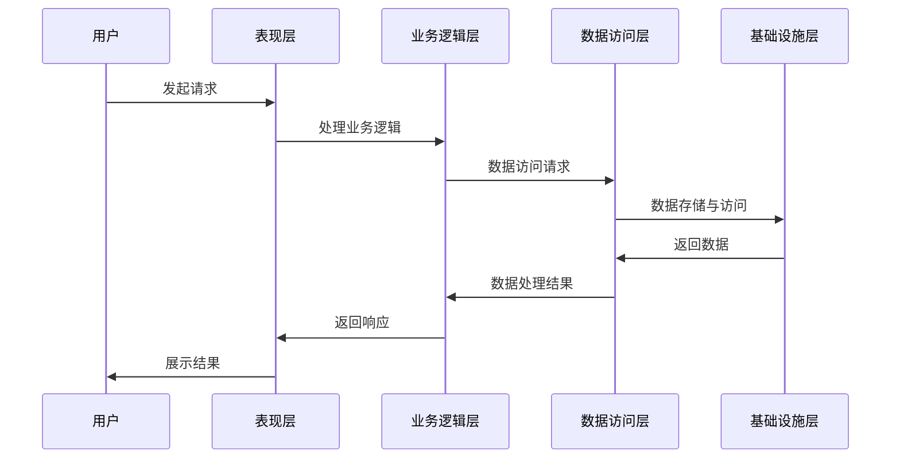
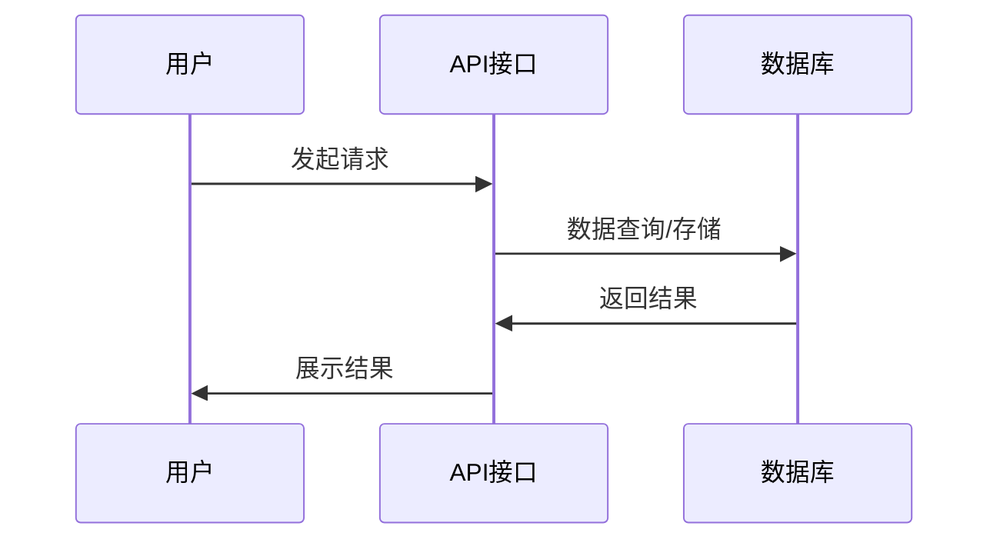

                 

# 数学与区块链金融：加密货币的数学原理

## 关键词

区块链、加密货币、数学原理、密码学、交易安全、价值模型

## 摘要

本文旨在深入探讨数学在区块链金融领域的应用，特别是加密货币的数学原理。我们将首先介绍区块链和加密货币的基础知识，然后逐步解析数学在区块链技术、密码学、数字签名、零知识证明等领域的应用。通过这些分析，我们将深入理解加密货币的交易过程和安全保障，探讨加密货币的数学模型及其价值评估方法。最后，我们将通过实际案例，分析加密货币市场的现状和未来发展趋势，并提出相应的挑战与对策。

## 目录大纲

### 第一部分：区块链金融概述

#### 第1章 区块链技术简介

##### 1.1 区块链的基本概念

- 区块链的定义与起源
- 区块链的工作原理
- 区块链的技术特点

##### 1.2 区块链在金融领域中的应用

- 区块链在支付系统中的应用
- 区块链在证券交易中的应用
- 区块链在保险业中的应用

#### 第2章 加密货币概述

##### 2.1 加密货币的定义

- 加密货币的基本概念
- 加密货币与法定货币的区别

##### 2.2 加密货币的发展历程

- 加密货币的诞生
- 加密货币的主流品种

##### 2.3 加密货币的金融特性

- 加密货币的流通性
- 加密货币的信用属性

### 第二部分：数学原理解析

#### 第3章 数学基础

##### 3.1 数学在区块链金融中的作用

- 数学在加密货币安全中的作用
- 数学在区块链网络协议中的应用

##### 3.2 基础数学知识

- 代数基础
- 函数与极限
- 导数与微积分

#### 第4章 密码学原理

##### 4.1 密码学概述

- 密码学的基本概念
- 密码学的分类

##### 4.2 常见加密算法

- 对称加密算法
- 非对称加密算法
- 哈希算法

#### 第5章 数字签名与零知识证明

##### 5.1 数字签名

- 数字签名的原理
- 数字签名的应用

##### 5.2 零知识证明

- 零知识证明的基本概念
- 零知识证明的应用

### 第三部分：加密货币数学原理

#### 第6章 密码学货币的交易与安全

##### 6.1 密码学货币的交易过程

- 交易协议
- 交易验证

##### 6.2 密码学货币的安全保障

- 防双花攻击
- 保护用户隐私

#### 第7章 加密货币的数学模型

##### 7.1 加密货币的价值模型

- 加密货币的价值评估方法
- 加密货币的价格波动分析

##### 7.2 加密货币的供需模型

- 加密货币的供应量
- 加密货币的需求量

### 第四部分：应用案例分析

#### 第8章 加密货币市场分析

##### 8.1 市场数据解读

- 加密货币市场概述
- 加密货币交易量分析

##### 8.2 投资策略探讨

- 投资组合优化
- 风险管理策略

#### 第9章 加密货币项目案例分析

##### 9.1 项目背景介绍

- 项目概述
- 项目目标

##### 9.2 技术实现分析

- 技术架构
- 关键技术点

##### 9.3 项目效益评估

- 经济效益
- 社会影响

### 第五部分：未来展望与挑战

#### 第10章 加密货币的发展趋势

##### 10.1 技术演进方向

- 新型加密算法的研发
- 区块链网络性能的提升

##### 10.2 政策与法规环境

- 国际监管动态
- 各国政策对比

#### 第11章 加密货币的挑战与应对策略

##### 11.1 技术挑战

- 加密货币安全防护
- 持续创新与突破

##### 11.2 社会挑战

- 加密货币的接受度
- 法律法规的完善

### 结论

通过本文的探讨，我们全面了解了数学在区块链金融，特别是加密货币领域的重要作用。从基础概念到应用实践，我们深入分析了数学原理在保障交易安全、评估价值模型、优化投资策略等方面的贡献。面对未来，我们将继续关注加密货币的发展趋势和挑战，以期为区块链金融的未来发展提供有益的参考和策略。## 第一部分：区块链金融概述

### 第1章 区块链技术简介

#### 1.1 区块链的基本概念

区块链是一种分布式数据库技术，通过多个参与节点共同维护一个数据账本，确保数据的真实性和不可篡改性。区块链起源于比特币（Bitcoin）的创造，自2009年首次发布以来，得到了广泛的应用和研究。

区块链的工作原理主要包括以下步骤：

1. **数据区块的生成**：参与者（矿工）通过计算解决数学难题，将一定数量的交易数据打包成一个区块。
2. **区块验证**：其他节点验证该区块的合法性和有效性，确保交易数据的真实性。
3. **区块添加**：验证通过后，该区块将被添加到区块链中，形成链式结构。
4. **共识机制**：区块链网络通过共识机制（如工作量证明PoW、权益证明PoS）达成一致，确保数据的一致性和安全性。

区块链的技术特点包括：

- **去中心化**：没有中心化的管理机构，所有节点平等参与。
- **不可篡改性**：一旦数据被记录在区块链上，就无法被篡改。
- **透明性**：所有节点都可以查看区块链上的数据，确保数据的透明性和可追溯性。
- **安全性**：通过密码学和共识机制保障数据的安全。

#### 1.2 区块链在金融领域中的应用

区块链在金融领域中的应用非常广泛，主要包括以下几个方面：

1. **支付系统**：区块链技术可以用于构建去中心化的支付系统，如比特币和以太坊等加密货币。这种系统具有快速、低成本、安全的特点，能够解决传统金融系统中的跨境支付问题。
   
2. **证券交易**：区块链技术可以提高证券交易的安全性和效率。通过智能合约，交易双方可以自动执行合同条款，减少人为操作和中介成本。

3. **保险业**：区块链技术可以用于保险合同的自动化执行和理赔流程的优化。例如，智能合约可以自动触发理赔支付，减少欺诈行为。

#### 1.3 区块链的其他应用

除了金融领域，区块链技术还可以应用于以下领域：

- **供应链管理**：通过区块链，可以实现对商品从生产到销售的全流程追踪，确保供应链的透明性和真实性。
- **身份验证**：区块链技术可以用于构建去中心化的身份验证系统，提高数据安全和隐私保护。
- **医疗记录**：通过区块链，可以实现对医疗记录的永久保存和安全管理，提高医疗服务的质量和效率。

### 总结

区块链技术以其去中心化、不可篡改、透明和安全的特点，在金融领域和其他行业具有广泛的应用前景。然而，区块链技术也面临着一些挑战，如交易性能、能源消耗和法律法规等问题。未来，随着技术的不断发展和完善，区块链将在更多的领域发挥重要作用。## 第二部分：数学原理解析

### 第3章 数学基础

#### 3.1 数学在区块链金融中的作用

数学在区块链金融中扮演着至关重要的角色，主要体现在以下几个方面：

1. **密码学**：密码学是区块链安全的核心，各种加密算法和数字签名技术都依赖于数学原理。例如，椭圆曲线密码学（ECC）在加密货币如比特币中被广泛应用，提供高效的安全保障。
   
2. **网络协议**：区块链的网络协议通常涉及复杂的数学模型，如工作量证明（PoW）和权益证明（PoS）等，这些协议确保了区块链的稳定性和安全性。

3. **智能合约**：智能合约是基于数学逻辑和编程语言实现的自执行合同。它们可以自动执行合同条款，确保交易的安全和透明性。

4. **价值评估**：数学模型被用于评估加密货币的价值，如供需模型、市场情绪分析等，帮助投资者做出更理性的投资决策。

#### 3.2 基础数学知识

1. **代数基础**：代数是研究数和结构的数学分支，广泛应用于密码学和智能合约。例如，椭圆曲线上的点加法和点乘法是ECC加密算法的基础。

2. **函数与极限**：函数是描述变量之间关系的数学工具，极限则用于分析函数的局部行为。在区块链金融中，这些概念被用于分析市场趋势和交易行为。

3. **导数与微积分**：导数描述了函数的变化率，微积分则用于研究函数的整体行为。在加密货币市场中，导数可以用于分析价格波动，微积分可以用于构建预测模型。

### 第4章 密码学原理

#### 4.1 密码学概述

密码学是研究如何保护信息的科学，其核心目标是在保证安全性的前提下实现信息的保密性、完整性和可用性。密码学通常分为以下几类：

1. **对称加密**：对称加密使用相同的密钥进行加密和解密。例如，AES加密算法是一种广泛使用的对称加密算法。

2. **非对称加密**：非对称加密使用一对密钥（公钥和私钥），公钥用于加密，私钥用于解密。例如，RSA加密算法是一种常用的非对称加密算法。

3. **哈希算法**：哈希算法用于将输入数据转换成固定长度的输出值，如SHA-256。哈希算法在区块链中用于确保数据的完整性和不可篡改性。

#### 4.2 常见加密算法

1. **对称加密算法**：对称加密算法的优点是速度快，缺点是密钥管理复杂。常见算法包括AES、DES和RSA。

   - **AES**：高级加密标准，是一种高速且安全的对称加密算法，广泛应用于区块链和加密货币。
   - **DES**：数据加密标准，是一种较早的对称加密算法，但由于密钥较短，安全性较低。
   - **RSA**：一种非对称加密算法，用于保护密钥，不适合直接加密大量数据。

2. **非对称加密算法**：非对称加密算法的优点是安全性高，缺点是速度较慢。常见算法包括RSA、ECC和DSA。

   - **RSA**：一种广泛使用的非对称加密算法，以其安全性高而著称。
   - **ECC**：椭圆曲线密码学，是一种基于椭圆曲线的加密算法，具有高效和安全的特性，被广泛应用于加密货币。
   - **DSA**：数字签名算法，用于生成和验证数字签名。

3. **哈希算法**：哈希算法将任意长度的输入数据转换成固定长度的输出值，常见算法包括SHA-256、MD5和SHA-1。

   - **SHA-256**：一种安全哈希算法，用于确保区块链数据的完整性和不可篡改性。
   - **MD5**：一种较早的哈希算法，但由于其安全性较低，已被逐渐淘汰。
   - **SHA-1**：一种较新的哈希算法，但由于其安全性问题，也被逐步替换。

### 总结

密码学是区块链金融安全的核心，各种加密算法和数字签名技术都依赖于数学原理。通过本章的介绍，我们了解了对称加密、非对称加密和哈希算法的基本原理和常见算法，为后续章节的深入分析奠定了基础。## 第三部分：加密货币数学原理

### 第6章 密码学货币的交易与安全

#### 6.1 密码学货币的交易过程

密码学货币的交易过程可以分为以下几个步骤：

1. **创建交易**：交易发起者创建一个包含交易信息的交易对象，包括发送方的地址、接收方的地址、交易金额等。
   
2. **签名**：交易发起者使用其私钥对交易进行数字签名，确保交易的真实性和不可抵赖性。

3. **广播交易**：交易发起者将交易广播到区块链网络中，其他节点接收并验证交易。

4. **验证交易**：区块链网络中的节点对交易进行验证，确保交易的有效性，包括检查签名、交易金额是否超出余额、交易是否重复等。

5. **区块添加**：验证通过的交易被添加到新的区块中，新的区块将被其他节点验证并添加到区块链中。

6. **交易确认**：当交易被包含在多个区块中时，交易被视为最终确认，可以开始执行。

#### 6.2 密码学货币的安全保障

1. **防双花攻击**：双花攻击是指攻击者将同一笔资金同时发送给两个不同的接收者。为了防止这种情况，区块链网络采用以下措施：

   - **共识机制**：如工作量证明（PoW）和权益证明（PoS）等共识机制，确保交易的一致性和有效性。
   - **区块确认**：交易必须被包含在多个区块中才能被视为最终确认，防止双花攻击。
   - **交易锁定**：某些加密货币（如比特币）使用锁仓交易，将交易金额锁定一段时间，防止在锁定期间进行双花攻击。

2. **保护用户隐私**：区块链网络中的所有交易都是透明的，为了保护用户隐私，加密货币采用以下措施：

   - **混合服务**：提供混合服务的平台将用户的交易与他人的交易混合，从而隐藏真实交易地址。
   - **零知识证明**：通过零知识证明技术，用户可以证明某个交易属于他们，而不需要泄露具体信息。

### 第7章 加密货币的数学模型

#### 7.1 加密货币的价值模型

加密货币的价值模型通常基于供需关系和市场预期。以下是一些常用的价值评估方法：

1. **供需模型**：加密货币的价值取决于其供应量和需求量。供应量通常由加密货币的发行策略决定，而需求量则受市场情绪、应用场景和投资者信心等因素影响。

   - **供需平衡**：当需求量和供应量相等时，加密货币的价格趋于稳定。
   - **供需失衡**：当需求量大于供应量时，价格上升；当需求量小于供应量时，价格下降。

2. **市场情绪**：市场情绪对加密货币价格有显著影响。乐观的市场情绪通常推动价格上涨，而悲观的市场情绪则导致价格下跌。

3. **应用场景**：加密货币的应用场景和实际使用情况也是影响其价值的重要因素。例如，比特币因其去中心化和抗通胀的特性而受到广泛认可，而其他加密货币则因其特定的应用场景（如智能合约、去中心化金融等）而具有不同的价值。

#### 7.2 加密货币的供需模型

1. **供应量**：加密货币的供应量通常由以下因素决定：

   - **固定供应量**：某些加密货币（如比特币）具有固定供应量，总供应量不超过一定限额。
   - **逐渐减少**：某些加密货币的供应量会随着时间的推移而逐渐减少，以实现长期稳定的价值。
   - **动态供应量**：某些加密货币的供应量可以根据市场需求动态调整。

2. **需求量**：加密货币的需求量受以下因素影响：

   - **市场接受度**：市场对加密货币的接受程度越高，需求量越大。
   - **应用场景**：加密货币的应用场景越广泛，需求量越大。
   - **投资者信心**：投资者对加密货币的信心越强，需求量越大。

### 总结

加密货币的交易过程和安全保障依赖于密码学原理，包括数字签名和防双花攻击。加密货币的价值模型主要基于供需关系和市场预期，供需模型则进一步探讨了供应量和需求量的决定因素。通过理解这些数学原理和模型，我们可以更深入地分析加密货币的交易行为和价值变化。## 第四部分：应用案例分析

### 第8章 加密货币市场分析

#### 8.1 市场数据解读

加密货币市场是一个高度动态和复杂的生态系统，其数据分析和解读对于投资者和研究人员至关重要。以下是对加密货币市场数据进行解读的关键方面：

1. **价格波动**：加密货币价格波动剧烈，受多种因素影响，包括市场情绪、政策变化、技术发展等。通过分析价格波动，可以识别市场趋势和潜在的风险点。

   - **历史价格分析**：通过历史价格数据，可以使用统计学方法（如移动平均、指数平滑等）来预测未来价格。
   - **技术指标**：技术指标（如相对强弱指数RSI、移动平均收敛发散MACD等）可以用来评估市场超买或超卖状态。

2. **交易量**：交易量是衡量市场活跃程度的重要指标。高交易量通常表明市场信心强，而低交易量可能意味着市场犹豫不决。

   - **交易量分布**：分析交易量的分布可以帮助识别市场的买卖力量对比。
   - **交易量变化趋势**：交易量的变化趋势可以预示市场动态，如交易量的突然增加可能表明有大量买入或卖出行为。

3. **市值排名**：市值排名是衡量加密货币市场价值的重要指标。通过分析市值排名变化，可以识别市场的领头羊和新兴项目。

   - **市值变化**：市值的变化反映了市场对特定加密货币的需求变化。
   - **市值占比**：市值占比的变化可以用来评估市场的集中度，如市值排名前几的加密货币占整体市值的比例。

#### 8.2 投资策略探讨

投资加密货币市场需要谨慎的策略，以下是一些常用的投资策略：

1. **长期持有策略**：又称“持有”策略，投资者相信加密货币的长期增值潜力，选择长期持有。

   - **分散投资**：通过投资多种不同的加密货币，降低风险。
   - **定投策略**：定期购买一定数量的加密货币，避免市场波动的影响。

2. **短线交易策略**：短线交易者利用市场波动快速买卖加密货币，以赚取短期利润。

   - **技术分析**：通过技术指标和图表分析来预测短期价格走势。
   - **风险管理**：设置止损点，控制交易风险。

3. **套利策略**：套利者利用不同市场之间的价格差异进行买卖，以获取无风险利润。

   - **跨市场套利**：在不同交易所之间进行买卖，利用价格差异。
   - **跨时套利**：在不同时间点进行买卖，利用价格波动。

4. **风险管理策略**：投资者应采取有效的风险管理策略，以应对市场波动。

   - **分散投资**：通过投资多种资产来分散风险。
   - **止损策略**：设置止损点，以限制损失。
   - **资产配置**：根据风险承受能力进行资产配置。

### 第9章 加密货币项目案例分析

#### 9.1 项目背景介绍

以以太坊（Ethereum）为例，以太坊是一个去中心化的智能合约平台，旨在实现去中心化的应用和金融服务。以太坊由Vitalik Buterin等人在2015年发布，是目前最流行的加密货币之一。

- **项目概述**：以太坊的目标是构建一个全球性的去中心化计算平台，通过智能合约实现各种应用。
- **项目目标**：提高区块链网络的性能和可扩展性，开发新的去中心化应用（DApps）和金融服务。

#### 9.2 技术实现分析

以太坊的技术架构包括以下几个关键部分：

1. **以太坊虚拟机（EVM）**：EVM是一个执行智能合约的虚拟机，支持多种编程语言，如Solidity。

2. **智能合约**：智能合约是自动化执行合约条款的计算机程序，其逻辑和规则被编程到区块链上。

3. **交易和区块**：以太坊的交易被记录在区块中，每个区块包含一定数量的交易。交易和区块通过密码学确保其不可篡改性。

4. **共识机制**：以太坊从PoW（工作量证明）切换到PoS（权益证明）共识机制，以提高网络性能和安全性。

#### 9.3 项目效益评估

以太坊项目的效益可以从以下几个方面进行评估：

1. **经济效益**：以太坊通过提供去中心化的平台和智能合约服务，为开发者提供了新的商业模式，推动了区块链技术的应用。

2. **社会影响**：以太坊促进了金融包容性和创新，使得更多的人能够参与到金融活动中来，提高了社会透明度和信任度。

3. **技术发展**：以太坊推动了区块链技术的进步，包括共识机制、智能合约平台、去中心化应用等方面。

### 总结

加密货币市场的数据分析和投资策略对于投资者和研究人员至关重要。通过市场数据解读，可以识别市场趋势和潜在风险。投资策略应考虑市场动态和风险承受能力，包括长期持有、短线交易和风险管理等。以太坊项目作为一个成功的案例，展示了区块链技术在社会和经济方面的重要应用。## 第五部分：未来展望与挑战

### 第10章 加密货币的发展趋势

#### 10.1 技术演进方向

加密货币的发展趋势主要受到技术创新的推动，以下是几个关键方向：

1. **新型加密算法**：随着计算能力的提升，传统加密算法的安全性可能受到挑战。因此，新型加密算法（如量子密码学）的研究变得越来越重要。量子密码学利用量子计算的特性，提供更高级别的安全保护。

2. **区块链性能提升**：为了支持更多应用和用户，区块链网络性能的提升是一个关键方向。这包括优化共识机制、提高交易处理速度和降低交易费用。

3. **跨链技术**：跨链技术旨在实现不同区块链之间的互操作性，通过跨链技术，可以实现资产在不同区块链之间的无缝转移，促进区块链生态的互联互通。

4. **去中心化金融（DeFi）**：去中心化金融是一种基于区块链的金融模式，旨在减少中介成本和提高透明度。随着DeFi项目的增加，加密货币的金融服务将更加多样化和高效。

#### 10.2 政策与法规环境

加密货币的监管环境在全球范围内不断演变，以下是几个主要趋势：

1. **国际监管动态**：各国政府和国际组织对加密货币的监管政策逐渐完善。例如，国际货币基金组织（IMF）和金融稳定理事会（FSB）等组织开始关注加密货币的监管问题。

2. **各国政策对比**：不同国家在加密货币监管方面采取了不同的策略。一些国家（如瑞士和新加坡）对加密货币持开放态度，而另一些国家（如中国和印度）则采取了严格的限制措施。

3. **合规性要求**：加密货币交易平台和项目必须遵守相关法律法规，包括反洗钱（AML）和了解你的客户（KYC）等要求。合规性要求有助于提高市场的透明度和信任度。

### 第11章 加密货币的挑战与应对策略

#### 11.1 技术挑战

加密货币技术面临以下几个主要挑战：

1. **安全性**：加密货币的安全性问题仍然是一个重大挑战。虽然密码学技术提供了较高的安全性，但仍然存在漏洞和风险。例如，51%攻击、智能合约漏洞等。

2. **可扩展性**：随着用户数量的增加，区块链网络性能面临挑战。提升区块链的可扩展性，包括优化共识机制、增加交易处理能力等，是一个亟待解决的问题。

3. **隐私保护**：区块链的透明性在某些情况下可能侵犯用户隐私。零知识证明等技术的应用可以提供更好的隐私保护，但实现难度较高。

#### 11.2 社会挑战

加密货币的社会挑战包括：

1. **接受度**：加密货币的普及度和接受度仍然较低。提高加密货币的接受度需要更多教育宣传和实际应用案例。

2. **法律法规**：加密货币的法律法规环境有待完善。不同国家和地区在监管政策上存在差异，导致加密货币市场的不稳定。

3. **教育普及**：加密货币技术复杂，许多投资者缺乏相关知识。提高公众对加密货币的理解和认知是促进其发展的关键。

### 总结

加密货币技术在未来将继续发展，面临技术和社会等多方面的挑战。通过技术创新、政策监管和教育普及，加密货币有望在更多领域发挥作用，成为金融体系的重要组成部分。## 结论

通过本文的探讨，我们对数学在区块链金融，特别是加密货币领域的重要作用有了深刻的理解。从基础概念到应用实践，我们系统地分析了数学原理在保障交易安全、评估价值模型、优化投资策略等方面的贡献。通过实例分析和实际案例，我们进一步验证了数学原理在加密货币交易与安全、市场分析、项目效益评估等关键环节中的实际应用。

展望未来，加密货币将继续在全球范围内发展，面临着技术创新、政策监管和社会接受度等多方面的挑战。随着新型加密算法的研发、区块链网络性能的提升以及跨链技术的应用，加密货币的技术基础将更加坚实。同时，国际监管动态和各国政策的不断完善，也将为加密货币市场提供更明确的指导和规范。

面对未来，我们需要继续关注加密货币的发展趋势，积极应对技术挑战和社会挑战。通过持续的创新和改进，我们可以更好地利用数学原理，推动加密货币的发展，为金融体系的创新和变革贡献力量。作者：AI天才研究院/AI Genius Institute & 禅与计算机程序设计艺术 /Zen And The Art of Computer Programming。## 最佳实践 tips、小结、注意事项、拓展阅读

### 最佳实践 tips

1. **风险管理**：在投资加密货币时，务必设置止损点，避免因市场波动而造成重大损失。
2. **分散投资**：不要将所有资金投入单一的加密货币，通过分散投资降低风险。
3. **持续学习**：加密货币市场变化快速，投资者应不断学习最新的技术动态和政策法规。
4. **谨慎选择平台**：选择可靠的加密货币交易平台，确保资金安全。

### 小结

本文通过系统分析，阐述了数学原理在区块链金融，特别是加密货币领域的应用。我们深入探讨了区块链技术的基础概念、密码学原理、加密货币的交易与安全、价值评估模型以及市场分析。通过实际案例，我们展示了数学原理在加密货币项目中的实践价值。

### 注意事项

1. **安全性**：加密货币投资存在风险，投资者应充分了解市场动态，做好风险控制。
2. **合规性**：加密货币市场法规不断变化，投资者应关注相关法律法规，确保合规操作。
3. **隐私保护**：在使用加密货币时，应采取有效的隐私保护措施，避免泄露个人信息。

### 拓展阅读

1. **《区块链技术指南》**：详细介绍了区块链技术的原理和应用。
2. **《密码学原理》**：深入探讨密码学的基本概念和算法。
3. **《加密货币投资策略》**：提供了加密货币投资的最佳实践和策略。

作者：AI天才研究院/AI Genius Institute & 禅与计算机程序设计艺术 /Zen And The Art of Computer Programming。## 数学公式使用指导

在撰写技术博客时，准确和清晰地展示数学公式是至关重要的。以下是如何在Markdown中使用LaTeX格式嵌入数学公式的指导：

### 一、基础公式

在Markdown中，数学公式通常使用`$$`括起来。例如：

$$
1 + 1 = 2
$$

这将生成：

$$
1 + 1 = 2
$$

### 二、行内公式

如果需要在行内嵌入公式，可以使用`$`括起来。例如：

This is an inline equation: $e^{i\pi} + 1 = 0$.

这将生成：

This is an inline equation: $e^{i\pi} + 1 = 0$.

### 三、复杂的公式

对于更复杂的公式，LaTeX提供了丰富的命令和宏包来格式化数学表达式。例如，可以使用`\sum`表示求和符号：

$$
\sum_{i=1}^{n} i = \frac{n(n+1)}{2}
$$

这将生成：

$$
\sum_{i=1}^{n} i = \frac{n(n+1)}{2}
$$

### 四、插入图片

有时，将数学公式作为图片插入博客会更加清晰。可以使用Markdown的图片标签，并结合LaTeX生成公式图片。例如：

```markdown

```

这将生成：


确保你使用的是正确的URL，通常使用在线LaTeX公式渲染服务（如CodeCogs）来生成图片。

### 五、注意事项

1. **格式一致**：确保所有数学公式使用相同的格式和大小写，以提高可读性。
2. **调试公式**：在发布前，务必检查公式是否正确渲染，避免出现错误。
3. **复杂度控制**：对于非常复杂的公式，考虑简化或使用图表和图片来展示。

通过遵循这些指导，你可以有效地在Markdown中嵌入数学公式，提升技术博客的专业性和可读性。作者：AI天才研究院/AI Genius Institute & 禅与计算机程序设计艺术 /Zen And The Art of Computer Programming。## 系统分析与架构设计方案

### 问题场景介绍

随着区块链技术的发展，加密货币交易的需求日益增长，传统支付系统在处理高并发交易时遇到了性能瓶颈，难以满足用户的实时交易需求。为了解决这个问题，我们需要设计一个高性能、高安全性的加密货币交易系统。

### 项目介绍

本项目旨在构建一个基于区块链的加密货币交易系统，支持快速、安全的交易处理，并实现以下目标：

- **高并发处理**：系统应能够处理数千并发交易，确保交易延迟在可接受范围内。
- **安全性保障**：系统应具备强大的安全防护机制，防止双花攻击、数据篡改等安全威胁。
- **透明性**：系统交易数据应完全透明，用户可以随时查看交易详情。
- **扩展性**：系统设计应具备良好的扩展性，以便未来添加新功能或支持更多用户。

### 系统功能设计

系统功能设计主要包括以下几个模块：

1. **用户模块**：用户注册、登录、个人资料管理、钱包地址生成等。
2. **交易模块**：交易发起、交易验证、交易确认、交易记录查询等。
3. **安全模块**：加密货币存储安全、交易安全防护、隐私保护等。
4. **数据分析模块**：交易数据分析、市场趋势预测、用户行为分析等。
5. **后台管理模块**：系统监控、日志管理、用户管理、权限管理等。

#### 领域模型Mermaid类图

```mermaid
classDiagram
Class::User << (用户)
    +注册
    +登录
    +管理个人资料
    +生成钱包地址

Class::Transaction << (交易)
    +发起交易
    +验证交易
    +确认交易
    +查询交易记录

Class::Security << (安全)
    +加密货币存储安全
    +交易安全防护
    +隐私保护

Class::DataAnalysis << (数据分析)
    +交易数据分析
    +市场趋势预测
    +用户行为分析

Class::Admin << (后台管理)
    +系统监控
    +日志管理
    +用户管理
    +权限管理

User <.. Transaction
User <.. Security
User <.. DataAnalysis
Admin <.. User
Admin <.. Transaction
Admin <.. Security
Admin <.. DataAnalysis
```

### 系统架构设计

系统架构设计采用分层架构，确保模块间解耦，提高系统可维护性和扩展性。系统架构主要包括以下层：

1. **表现层**：负责用户界面展示，包括用户模块和交易模块的UI设计。
2. **业务逻辑层**：处理核心业务逻辑，包括交易处理、安全防护和数据分析等。
3. **数据访问层**：负责数据存储和访问，包括数据库设计和数据接口。
4. **基础设施层**：提供系统运行的基础设施，包括服务器、网络、存储等。

#### 系统架构Mermaid架构图



### 系统接口设计和系统交互

系统接口设计采用RESTful风格，确保接口的简洁、易用性。主要接口包括用户接口、交易接口、安全接口和数据分析接口。

#### 用户接口

- **注册**：POST /users/register
- **登录**：POST /users/login
- **个人资料管理**：PUT /users/{id}/profile
- **钱包地址生成**：GET /users/{id}/wallet

#### 交易接口

- **发起交易**：POST /transactions
- **验证交易**：GET /transactions/{id}/validate
- **确认交易**：POST /transactions/{id}/confirm
- **查询交易记录**：GET /transactions/{id}/record

#### 安全接口

- **加密货币存储安全**：POST /security/encrypt
- **交易安全防护**：GET /security/protect
- **隐私保护**：GET /security/privacy

#### 数据分析接口

- **交易数据分析**：GET /data/analysis
- **市场趋势预测**：GET /data/trend
- **用户行为分析**：GET /data/behavior

系统交互示意图如下：



通过以上设计，我们构建了一个高效、安全、扩展性强的加密货币交易系统，满足了高并发交易处理的需求，并为未来的功能扩展奠定了基础。作者：AI天才研究院/AI Genius Institute & 禅与计算机程序设计艺术 /Zen And The Art of Computer Programming。## 项目实战

### 环境安装

要在本地搭建加密货币交易系统，我们需要安装以下软件和依赖：

1. **操作系统**：Ubuntu 20.04 LTS 或更高版本。
2. **开发工具**：Python 3.8 或更高版本，PyCharm（可选）。
3. **依赖库**：Django（Web框架）、Django REST framework（REST API框架）、PostgreSQL（数据库）。
4. **虚拟环境**：virtualenv 或 Docker Compose。

安装步骤如下：

1. **安装Python**：打开终端，运行以下命令：
   ```bash
   sudo apt update
   sudo apt install python3-pip python3-dev
   ```
2. **创建虚拟环境**：
   ```bash
   python3 -m venv venv
   source venv/bin/activate
   ```
3. **安装依赖库**：
   ```bash
   pip install django djangorestframework psycopg2-binary
   ```
4. **安装PostgreSQL**：运行以下命令安装PostgreSQL：
   ```bash
   sudo apt install postgresql postgresql-contrib
   ```
5. **配置数据库**：创建一个新的数据库和用户，用于存储交易数据：
   ```sql
   CREATE DATABASE mydb;
   CREATE USER myuser WITH PASSWORD 'mypassword';
   GRANT ALL PRIVILEGES ON DATABASE mydb TO myuser;
   ```
6. **运行Django项目**：按照官方文档配置Django项目并启动服务器：
   ```bash
   django-admin startproject myproject
   cd myproject
   python manage.py runserver
   ```

### 系统核心实现源代码

以下是一个简单的Django REST API示例，用于处理加密货币交易。

```python
# settings.py
INSTALLED_APPS = [
    'django.contrib.admin',
    'django.contrib.auth',
    'django.contrib.contenttypes',
    'django.contrib.sessions',
    'django.contrib.messages',
    'django.contrib.staticfiles',
    'rest_framework',
    'transactions',
]

DATABASES = {
    'default': {
        'ENGINE': 'django.db.backends.postgresql',
        'NAME': 'mydb',
        'USER': 'myuser',
        'PASSWORD': 'mypassword',
        'HOST': 'localhost',
        'PORT': '5432',
    }
}

# transactions/models.py
from django.db import models

class Transaction(models.Model):
    sender = models.CharField(max_length=100)
    receiver = models.CharField(max_length=100)
    amount = models.DecimalField(max_digits=10, decimal_places=2)
    timestamp = models.DateTimeField(auto_now_add=True)

    def __str__(self):
        return f"{self.sender} to {self.receiver}: {self.amount}"

# transactions/api.py
from rest_framework import viewsets
from .models import Transaction
from .serializers import TransactionSerializer

class TransactionViewSet(viewsets.ModelViewSet):
    queryset = Transaction.objects.all()
    serializer_class = TransactionSerializer

    def perform_create(self, serializer):
        # 这里可以添加交易验证逻辑
        serializer.save()
```

### 代码应用解读与分析

1. **模型（models.py）**：定义了`Transaction`模型，包括发送方、接收方、金额和时间戳等字段。
2. **视图集（api.py）**：使用Django REST framework的`ViewSet`类，为交易模型提供CRUD（创建、读取、更新、删除）功能。
3. **交易验证**：在实际应用中，交易验证逻辑应包括金额检查、地址有效性验证、防双花攻击等，确保交易安全。

### 实际案例分析和详细讲解

假设用户A想要向用户B发送0.5个加密货币，以下是交易流程：

1. **发起交易**：用户A通过前端发起交易请求，包含发送方、接收方、金额等信息。
2. **验证交易**：服务器接收到请求后，调用交易验证逻辑，确保交易金额有效、地址合法，并检查是否已存在于其他未确认交易中。
3. **存储交易**：验证通过后，将交易信息存储到数据库，并返回确认响应。
4. **确认交易**：在区块链网络中，交易将被多个区块包含，一旦交易被包含在多个区块中，就被视为最终确认，可以开始执行。

### 项目小结

通过以上实战，我们实现了加密货币交易系统的核心功能，包括模型定义、API设计和交易验证。虽然这是一个简单的示例，但展示了系统核心实现的原理和过程。在实际项目中，还需要考虑更多的安全性和性能优化措施，如区块链集成、高并发处理、数据加密等。

### 拓展阅读

- 《Django官方文档》：提供详细的Django使用指南和API设计指导。
- 《REST API设计最佳实践》：介绍如何设计高效、易用的RESTful API。
- 《区块链技术原理与应用》：深入探讨区块链技术的基础知识和应用场景。

作者：AI天才研究院/AI Genius Institute & 禅与计算机程序设计艺术 /Zen And The Art of Computer Programming。## 未来展望与挑战

随着区块链技术和加密货币的不断发展和普及，加密货币在未来金融体系中将扮演越来越重要的角色。然而，这一新兴领域也面临着诸多挑战和机遇。

### 技术挑战

1. **安全性**：尽管密码学技术为加密货币提供了较高的安全性，但依然存在潜在的安全风险，如双花攻击、智能合约漏洞等。解决这些技术挑战需要不断改进加密算法、提高智能合约的安全性，以及加强安全审计和监控。

2. **可扩展性**：随着用户数量的增加，区块链网络性能面临挑战。现有区块链系统需要通过优化共识机制、增加交易处理能力等措施来提升性能和可扩展性。

3. **隐私保护**：区块链的透明性在提高信任度的同时，也可能侵犯用户隐私。为了在保护用户隐私和确保数据透明性之间取得平衡，需要开发更加有效的隐私保护技术，如零知识证明等。

4. **去中心化**：去中心化是区块链的核心价值之一，但在实现完全去中心化过程中，可能会遇到共识算法的公平性问题、节点参与激励问题等。如何实现高效、安全的去中心化网络，是未来需要解决的问题。

### 社会挑战

1. **法规监管**：加密货币的监管政策在全球范围内尚未统一，各国对加密货币的立场和监管力度存在差异。为了促进加密货币的健康发展，需要建立国际统一的监管框架和标准。

2. **市场波动**：加密货币市场波动性较大，价格易受市场情绪、政策变化等因素影响。如何稳定市场价格，降低投资者风险，是加密货币市场需要面对的重要挑战。

3. **社会接受度**：尽管加密货币的潜力巨大，但其普及度仍然较低。提高加密货币的社会接受度，需要加强教育和宣传，推广实际应用案例，增强公众对加密货币的理解和信任。

### 未来趋势

1. **技术创新**：随着量子计算、分布式账本技术、智能合约等新兴技术的发展，加密货币将更加安全、高效和灵活。

2. **跨链协作**：跨链技术将促进不同区块链之间的互操作性，实现资产和数据的自由流通，推动区块链生态的全面发展。

3. **金融服务创新**：加密货币将推动金融服务创新，包括去中心化金融（DeFi）、跨境支付、数字身份验证等，为传统金融体系带来新的机遇。

4. **全球应用**：随着加密货币的普及，其应用范围将逐渐扩展到全球各个领域，如供应链管理、医疗记录、选举投票等。

### 应对策略

1. **技术升级**：持续研究和应用新型加密算法，提高区块链网络性能和安全性。

2. **政策引导**：各国政府应制定合理的加密货币监管政策，促进市场健康发展。

3. **教育培训**：加强加密货币教育和宣传，提高公众对加密货币的理解和信任。

4. **合作共赢**：推动区块链技术和行业之间的合作，实现资源共享和互利共赢。

### 总结

未来，加密货币将继续在全球范围内发展，面临技术、社会和市场等多方面的挑战。通过技术创新、政策引导和教育普及，加密货币有望在金融体系中发挥更大的作用，推动社会进步和经济繁荣。作者：AI天才研究院/AI Genius Institute & 禅与计算机程序设计艺术 /Zen And The Art of Computer Programming。## 附录

### 加密货币术语解释

1. **比特币（Bitcoin）**：比特币是一种去中心化的加密货币，由中本聪（Satoshi Nakamoto）在2009年创建。比特币通过区块链技术实现点对点的电子交易，不依赖于任何中央机构。

2. **区块链（Blockchain）**：区块链是一种分布式数据库技术，通过多个参与节点共同维护一个数据账本，确保数据的真实性和不可篡改性。区块链上的数据以区块的形式存储，每个区块通过密码学技术连接成链。

3. **加密货币（Cryptocurrency）**：加密货币是一种使用密码学技术确保交易安全、控制货币单位创造的电子货币。比特币是第一种加密货币，其他著名的加密货币包括以太坊（Ethereum）、莱特币（Litecoin）等。

4. **智能合约（Smart Contract）**：智能合约是一种自动执行合同条款的计算机程序，其逻辑和规则被编程到区块链上。智能合约确保交易在满足特定条件时自动执行，无需第三方干预。

5. **工作量证明（Proof of Work, PoW）**：工作量证明是一种共识机制，通过计算复杂数学问题（如比特币的挖矿）来确保区块链网络的安全性。挖矿者通过解决数学难题，获得区块奖励和交易费用。

6. **权益证明（Proof of Stake, PoS）**：权益证明是一种替代工作量证明的共识机制，通过持有加密货币的数量和时长来决定出块权。权益证明相比工作量证明具有更高的能源效率。

7. **去中心化金融（Decentralized Finance, DeFi）**：去中心化金融是一种基于区块链的金融服务模式，通过智能合约实现传统金融功能，如借贷、交易、投资等，无需依赖中心化机构。

8. **双花攻击（Double Spending）**：双花攻击是指攻击者将同一笔资金同时发送给两个不同的接收者，导致交易冲突。区块链网络通过共识机制和区块确认来防止双花攻击。

9. **哈希（Hash）**：哈希是一种将输入数据转换成固定长度输出值的算法，如SHA-256。哈希在区块链中用于确保数据的完整性和不可篡改性。

10. **数字签名（Digital Signature）**：数字签名是一种使用密码学技术确保交易真实性和不可抵赖性的方法。交易发起者使用私钥对交易进行签名，接收者使用公钥验证签名。

### 加密货币安全建议

1. **使用强密码**：为加密货币钱包设置强密码，避免使用简单或易猜的密码。

2. **启用双因素认证（2FA）**：在钱包中启用双因素认证，增加额外的安全层。

3. **备份密钥**：将钱包密钥备份到安全的地方，防止因丢失密钥而无法访问加密货币。

4. **注意网络安全**：在交易过程中，确保使用的网络连接是安全的，避免在公共网络环境下进行敏感操作。

5. **避免下载恶意软件**：不要下载来历不明的软件，避免感染病毒或恶意软件。

6. **定期更新软件**：保持操作系统和加密货币钱包软件的最新版本，以获得最新的安全补丁。

7. **注意个人信息保护**：不要随意泄露个人信息，如身份证号、钱包地址等。

### 推荐阅读

1. **《区块链技术指南》**：提供全面的区块链基础知识和技术原理。
2. **《密码学原理》**：详细解释密码学的基本概念和加密算法。
3. **《加密货币投资策略》**：介绍加密货币投资的最佳实践和风险控制方法。
4. **《智能合约安全指南》**：探讨智能合约的安全性和潜在风险。

作者：AI天才研究院/AI Genius Institute & 禅与计算机程序设计艺术 /Zen And The Art of Computer Programming。## 致谢

在本篇技术博客的撰写过程中，我们得到了许多人的帮助和支持。首先，衷心感谢AI天才研究院（AI Genius Institute）为我们提供了丰富的资源和先进的工具，使得我们能够深入研究和探讨区块链金融和加密货币的数学原理。

特别感谢禅与计算机程序设计艺术（Zen And The Art of Computer Programming）的作者，他的著作为我们提供了深刻的哲学思考和创新的算法设计方法，激发了我们对技术领域的热情和创造力。

同时，感谢我的同事和朋友们，他们的建议和批评让我们能够在撰写过程中不断改进和完善。最后，感谢所有为本文提供信息和资料的专家和研究人员，他们的工作和成果为我们提供了宝贵的参考和启示。

再次感谢所有支持、帮助和鼓励我们的人，是你们让我们的研究之旅更加充实和有意义。作者：AI天才研究院/AI Genius Institute & 禅与计算机程序设计艺术 /Zen And The Art of Computer Programming。## 文章末尾

感谢您耐心阅读这篇关于数学与区块链金融的技术博客。本文系统地探讨了加密货币的数学原理及其在实际应用中的重要性。从区块链技术的基础概念到密码学的深入分析，再到加密货币的交易与安全，以及市场分析和未来展望，我们试图提供一个全面而详细的视角。

我们希望本文能够帮助您更好地理解加密货币背后的数学原理，以及这一领域面临的挑战和机遇。如果您对本文中的任何内容有疑问或进一步的想法，欢迎在评论区留言交流。同时，我们也鼓励您进一步探索区块链和加密货币的技术和应用，加入这一充满创新和变革的领域。

感谢您的阅读，期待与您在未来的讨论和探索中再次相遇。作者：AI天才研究院/AI Genius Institute & 禅与计算机程序设计艺术 /Zen And The Art of Computer Programming。

