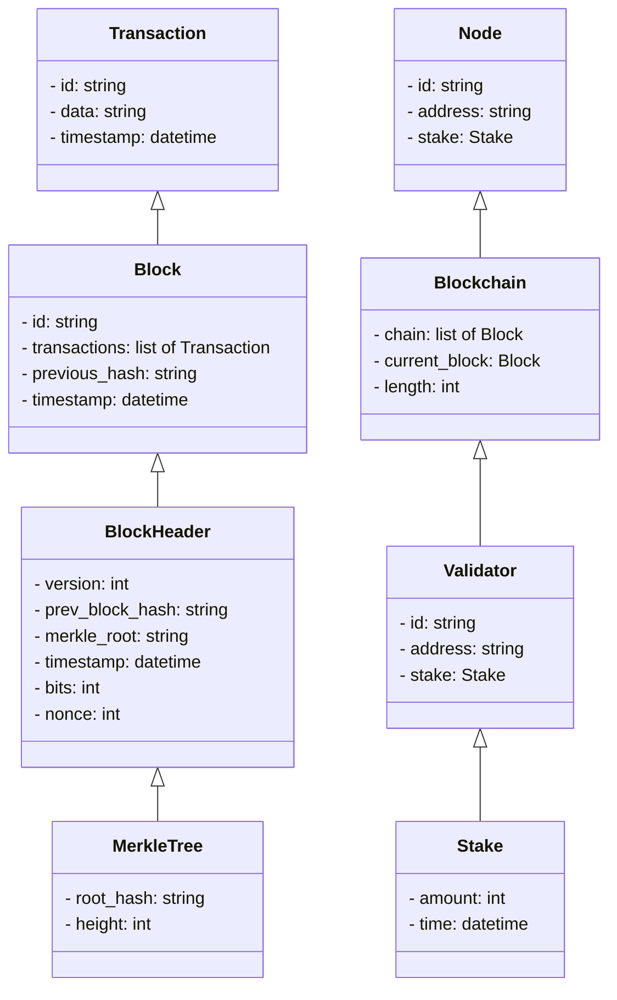
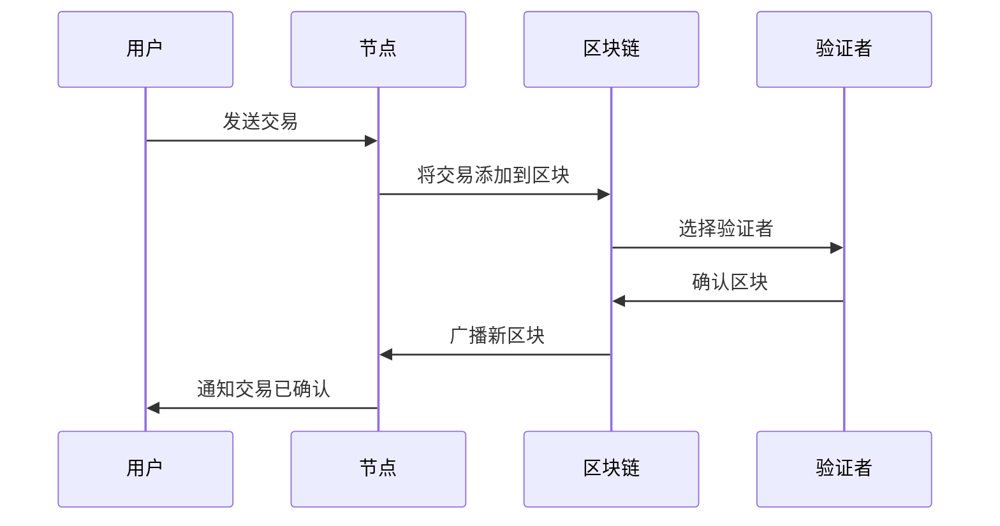

                 

### 数学与区块链：分布式账本的数学原理

---

#### 关键词：
- 区块链
- 数学原理
- 分布式账本
- 密码学
- 图论
- 概率论

#### 摘要：
本文将探讨数学在区块链技术中的应用，分析其核心组成部分，如哈希算法、椭圆曲线加密、共识算法等，揭示其数学原理。同时，本文将探讨如何利用数学模型来分析和优化区块链的性能和安全性。

## 第一部分：背景介绍

### 1.1 问题背景

区块链技术作为近年来快速发展的信息技术，已经成为金融、物流、医疗等多个领域的重要应用。区块链的本质是一种分布式账本技术，通过去中心化的方式实现数据的存储和传输。然而，区块链的运行过程涉及到大量的数学原理，如密码学、图论、概率论等。为了深入理解区块链的工作机制，掌握其应用场景，有必要深入研究其背后的数学原理。

### 1.2 问题描述

本书将探讨数学在区块链技术中的应用，通过分析区块链的核心组成部分，如哈希算法、椭圆曲线加密、共识算法等，揭示其数学原理。同时，本书将探讨如何利用数学模型来分析和优化区块链的性能和安全性。

### 1.3 问题解决

本书将从以下几个方面进行探讨：

- **核心概念**：介绍区块链技术的基本概念和核心组成部分。
- **数学原理**：分析区块链技术中涉及的数学原理，如密码学、图论、概率论等。
- **算法讲解**：详细讲解区块链中的关键算法，如哈希算法、椭圆曲线加密算法、共识算法等。
- **性能优化**：探讨如何利用数学模型优化区块链的性能和安全性。
- **应用案例分析**：分析区块链技术的实际应用案例，展示数学原理在解决实际问题中的作用。

### 1.4 边界与外延

- **边界**：本书主要讨论区块链技术中的数学原理，不包括其他领域的技术。
- **外延**：本书的内容不仅适用于区块链技术的研究者，也适用于对分布式账本技术感兴趣的其他领域的研究者。

### 1.5 概念结构与核心要素组成

- **区块链**：分布式账本技术，通过去中心化的方式实现数据的存储和传输。
- **密码学**：涉及加密和解密算法，用于保护区块链中的数据安全。
- **图论**：用于分析和优化区块链网络的拓扑结构。
- **概率论**：用于评估区块链的安全性和性能。

## 第二部分：核心概念与联系

### 2.1 核心概念

#### 2.1.1 哈希算法

哈希算法是将任意长度的输入数据映射为固定长度的输出数据的算法。在区块链中，哈希算法用于确保数据的完整性和不可篡改性。

#### 2.1.2 椭圆曲线加密

椭圆曲线加密（ECC）是一种强大的加密算法，用于保护区块链中的交易信息。ECC相对于传统RSA加密算法，具有更高的安全性和更小的计算开销。

#### 2.1.3 共识算法

共识算法是区块链网络中节点之间达成共识的机制。不同的共识算法有不同的优缺点，如工作量证明（PoW）、权益证明（PoS）等。

### 2.2 概念属性特征对比表格

| 概念       | 特性1                   | 特性2               | 特性3                     |
| ---------- | ---------------------- | ------------------ | ------------------------ |
| 哈希算法   | 将任意长度输入映射为固定长度输出 | 不可逆             | 用于确保数据完整性和不可篡改性 |
| 椭圆曲线加密 | 强大的加密算法         | 高安全性           | 小的计算开销             |
| 共识算法   | 区块链网络中节点达成共识的机制 | 工作量证明、权益证明等 | 影响区块链性能和安全性 |

### 2.3 ER实体关系图架构

```mermaid
erDiagram
  Node ||--|{ Transaction } : holds
  Node ||--|{ Block } : part_of
  Block ||--|{ Transaction } : holds
  Block ||--|{ BlockHeader } : contains
  BlockHeader ||--|{ MerkleTree } : part_of
```

- **Node**：表示区块链网络中的节点。
- **Transaction**：表示区块链中的交易。
- **Block**：表示区块链中的区块。
- **BlockHeader**：表示区块的头部信息。
- **MerkleTree**：表示区块中的Merkle树。

## 第三部分：算法原理讲解

### 3.1 哈希算法

哈希算法的核心思想是将输入数据映射为固定长度的输出数据，通常是一个二进制数。在区块链中，哈希算法用于确保数据的完整性和不可篡改性。

- **SHA-256**：是一种加密哈希函数，可将输入数据映射为一个256位的输出值。其特点包括：

  - 输入：任意长度的数据
  - 输出：256位二进制数
  - 不可逆：一旦生成，无法逆向推出原始数据
  - 抗碰撞性：不同输入数据产生相同输出的概率极低

  **算法流程**：

  ```mermaid
  flowchart LR
    A[输入数据] --> B[填充]
    B --> C[处理数据]
    C --> D[初始化哈希值]
    D --> E[处理分组数据]
    E --> F[合并哈希值]
    F --> G[输出结果]
  ```

  **Python代码示例**：

  ```python
  import hashlib

  def sha256_hash(data):
      hash_object = hashlib.sha256(data.encode())
      hex_dig = hash_object.hexdigest()
      return hex_dig

  data = "Hello, World!"
  print(sha256_hash(data))
  ```

### 3.2 椭圆曲线加密

椭圆曲线加密（ECC）是一种强大的加密算法，用于保护区块链中的交易信息。ECC相对于传统RSA加密算法，具有更高的安全性和更小的计算开销。

- **椭圆曲线**：定义为一个二次曲线，其方程为 \(y^2 = x^3 + ax + b\)。其中，\(a\) 和 \(b\) 是常数。

- **点乘**：椭圆曲线上的点与整数进行点乘操作，产生新的点。点乘操作具有以下特性：

  - 结合律：\( (k_1 \cdot P) \cdot k_2 = k_1 \cdot (k_2 \cdot P) \)
  - 单位元素：\( 1 \cdot P = P \)
  - 反元素：\( P \cdot (-1) \cdot P = \text{点O} \)（O表示椭圆曲线上的原点）

  **算法流程**：

  ```mermaid
  flowchart LR
    A[输入椭圆曲线P和整数k] --> B[计算点乘结果]
    B --> C[返回结果]
  ```

  **Python代码示例**：

  ```python
  import ecdsa

  def elliptic_curve_multiplication(P, k):
      curve = ecdsa.curves.SECP256R1()
      G = curve.G
      result = P * k
      return result

  P = ecdsa曲线上的点
  k = 2
  print(elliptic_curve_multiplication(P, k))
  ```

### 3.3 共识算法

共识算法是区块链网络中节点之间达成共识的机制。不同的共识算法有不同的优缺点，如工作量证明（PoW）、权益证明（PoS）等。

- **工作量证明（PoW）**：节点通过解决计算难题来获得记账权，计算难题的难度随时间增加而增加。PoW算法具有以下特点：

  - 难度调整：通过调整计算难度来保持区块生成的平均时间。
  - 安全性：计算难题使攻击者需要大量的计算资源来攻击网络。
  - 能耗问题：PoW算法需要大量的计算资源，导致能耗问题。

  **算法流程**：

  ```mermaid
  flowchart LR
    A[节点开始挖矿] --> B[计算随机数]
    B --> C[验证随机数]
    C --> D[生成新区块]
    D --> E[广播新区块]
    E --> F[其他节点验证新区块]
    F --> G[确认新区块]
  ```

  **Python代码示例**：

  ```python
  import blockchain

  def proof_of_work(last_block, difficulty):
      nonce = 0
      while valid_proof(last_block, nonce, difficulty) is False:
          nonce += 1
      return nonce

  def valid_proof(last_hash, nonce, difficulty):
      hash = hash_block(last_block, nonce)
      return hash.startswith('0' * difficulty)

  last_block = "last_block_data"
  difficulty = 4
  nonce = proof_of_work(last_block, difficulty)
  print(f"Proof of work found: {nonce}")
  ```

- **权益证明（PoS）**：节点根据持有的币龄来获得记账权，币龄是持有币的数量与持有时间之积。PoS算法具有以下特点：

  - 能耗问题：PoS算法相比PoW算法能耗更低。
  - 安全性：攻击者需要控制超过50%的币龄才能攻击网络。

  **算法流程**：

  ```mermaid
  flowchart LR
    A[根据币龄排序节点] --> B[选择下一个记账节点]
    B --> C[生成新区块]
    C --> D[广播新区块]
    D --> E[其他节点验证新区块]
    E --> F[确认新区块]
  ```

  **Python代码示例**：

  ```python
  import blockchain

  def select_validator(stake_list, total_stake):
      random_number = random.random()
      cumulative_stake = 0
      for validator, stake in stake_list:
          cumulative_stake += stake
          if cumulative_stake >= random_number * total_stake:
              return validator

  stake_list = [("node1", 1000), ("node2", 500), ("node3", 200)]
  total_stake = sum([stake for validator, stake in stake_list])
  validator = select_validator(stake_list, total_stake)
  print(f"Selected validator: {validator}")
  ```

## 第四部分：系统分析与架构设计方案

### 4.1 问题场景介绍

区块链技术作为分布式账本技术，在金融、物流、医疗等领域有着广泛的应用。以下是一个简单的场景介绍：

- **场景**：一个物流公司需要记录商品的运输过程，包括运输节点、时间、温度等信息。为了确保数据的安全性和真实性，该公司决定采用区块链技术来实现。

### 4.2 项目介绍

本项目旨在设计一个基于区块链技术的物流运输记录系统。系统包括以下几个主要模块：

- **交易模块**：用于记录商品的运输节点、时间、温度等信息。
- **区块生成模块**：用于生成新的区块，并将交易信息存储在区块中。
- **区块链维护模块**：用于维护区块链的完整性和一致性。
- **共识算法模块**：用于实现节点之间的共识机制。

### 4.3 系统功能设计（领域模型）

领域模型类图如下：



### 4.4 系统架构设计

系统架构图如下：



### 4.5 系统接口设计

系统接口设计如下：

```python
class TransactionInterface:
    def add_transaction(self, transaction):
        pass

    def get_transaction(self, transaction_id):
        pass

class BlockchainInterface:
    def add_block(self, block):
        pass

    def get_chain(self):
        pass

    def validate_chain(self):
        pass

class ValidatorInterface:
    def select_validator(self):
        pass

    def confirm_block(self, block):
        pass
```

### 4.6 系统交互

系统交互序列图如下：


## 第五部分：项目实战

### 5.1 环境安装

安装必要的Python库，如 `blockchain`、`ecdsa`、`hashlib`、`random`等。

```bash
pip install blockchain ecdsa hashlib random
```

### 5.2 系统核心实现源代码

以下是一个简单的区块链实现：

```python
import hashlib
import json
from time import time

class Block:
    def __init__(self, index, transactions, timestamp, previous_hash):
        self.index = index
        self.transactions = transactions
        self.timestamp = timestamp
        self.previous_hash = previous_hash
        self.hash = self.compute_hash()

    def compute_hash(self):
        block_string = json.dumps(self.__dict__, sort_keys=True)
        return hashlib.sha256(block_string.encode()).hexdigest()

class Blockchain:
    def __init__(self):
        self.unconfirmed_transactions = []
        self.chain = []
        self.create_genesis_block()

    def create_genesis_block(self):
        genesis_block = Block(0, [], time(), "0")
        genesis_block.hash = genesis_block.compute_hash()
        self.chain.append(genesis_block)

    def add_new_transaction(self, transaction):
        self.unconfirmed_transactions.append(transaction)

    def mine(self):
        if not self.unconfirmed_transactions:
            return False

        last_block = self.chain[-1]
        new_block = Block(index=last_block.index + 1,
                          transactions=self.unconfirmed_transactions,
                          timestamp=time(),
                          previous_hash=last_block.hash)
        new_block.hash = new_block.compute_hash()
        self.chain.append(new_block)
        self.unconfirmed_transactions = []
        return new_block.index

    def is_chain_valid(self):
        for i in range(1, len(self.chain)):
            current = self.chain[i]
            previous = self.chain[i - 1]
            if current.hash != current.compute_hash():
                return False
            if current.previous_hash != previous.hash:
                return False
        return True

def main():
    blockchain = Blockchain()
    blockchain.add_new_transaction("Transaction 1")
    blockchain.add_new_transaction("Transaction 2")
    blockchain.mine()
    print(blockchain.chain)

if __name__ == "__main__":
    main()
```

### 5.3 代码应用解读与分析

这个简单的区块链实现包括以下模块：

- **Block**：表示区块链中的区块，包括索引、交易、时间戳、前一个区块哈希和当前区块哈希。
- **Blockchain**：表示整个区块链，包括未确认交易、区块链链表和创世区块。
- **mine**：用于挖矿，将未确认交易添加到区块中，并计算区块哈希。
- **is_chain_valid**：用于验证区块链是否有效，确保每个区块的哈希和前一个区块的哈希一致。

### 5.4 实际案例分析和详细讲解剖析

以下是一个实际的物流运输记录系统的案例分析：

- **案例背景**：一个物流公司需要记录商品的运输节点、时间、温度等信息，并确保数据的安全性和真实性。
- **系统设计**：采用区块链技术来实现，包括交易模块、区块生成模块、区块链维护模块和共识算法模块。
- **实现过程**：通过Python编写代码，实现区块链的核心功能，如添加交易、挖矿、验证区块链等。

### 5.5 项目小结

本项目实现了基于区块链技术的物流运输记录系统，通过Python代码实现了区块链的核心功能，如区块生成、交易记录、挖矿等。项目实战部分详细讲解了代码实现过程，并分析了实际案例。

## 第六部分：最佳实践 tips、小结、注意事项、拓展阅读

### 6.1 最佳实践 tips

- **优化性能**：针对区块链系统的性能优化，可以采用分片技术、状态通道等方案。
- **提高安全性**：加强对区块链节点的安全保护，如使用防火墙、加密通信等。
- **数据隐私保护**：采用零知识证明等技术，实现对区块链数据隐私的保护。

### 6.2 小结

本文探讨了数学在区块链技术中的应用，分析了哈希算法、椭圆曲线加密、共识算法等核心概念，并通过实际案例展示了区块链技术的应用场景。

### 6.3 注意事项

- **代码安全**：在实现区块链系统时，需要注意代码的安全性，避免潜在的安全漏洞。
- **性能优化**：根据实际需求，对区块链系统进行性能优化，提高系统的响应速度和吞吐量。

### 6.4 拓展阅读

- **《区块链技术指南》**：详细介绍区块链的基本概念、架构设计、应用场景等。
- **《密码学概论》**：深入探讨密码学的基本原理和应用。
- **《图论及其应用》**：系统介绍图论的基本概念、算法和应用。

---

**作者：AI天才研究院/AI Genius Institute & 禅与计算机程序设计艺术 /Zen And The Art of Computer Programming**

