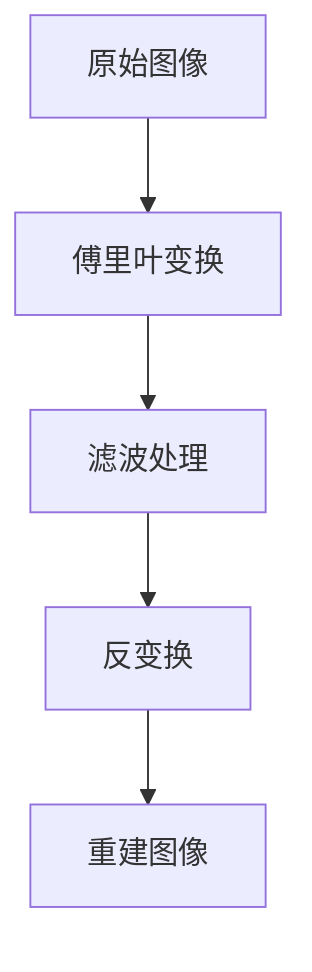
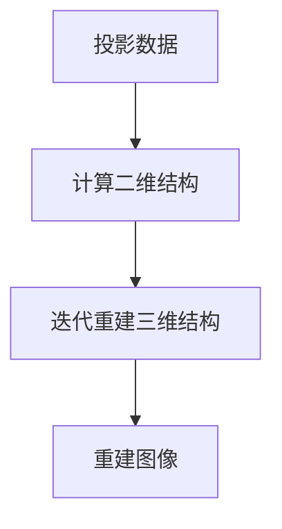
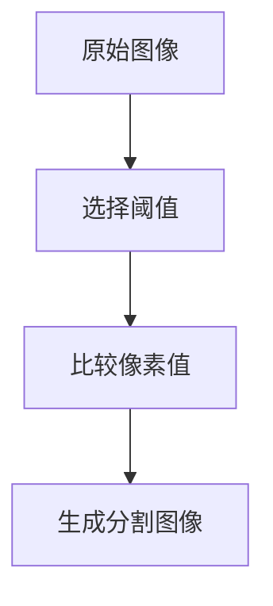
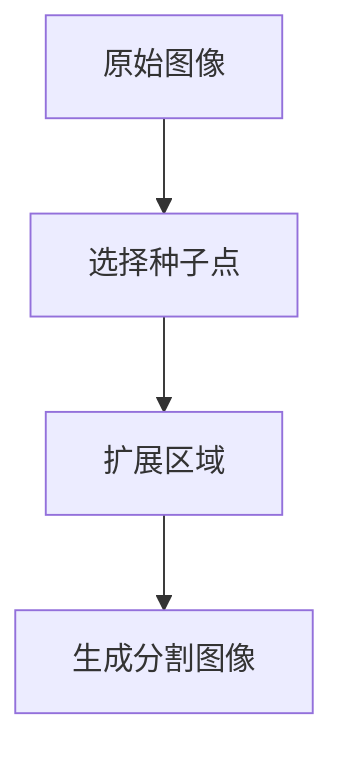
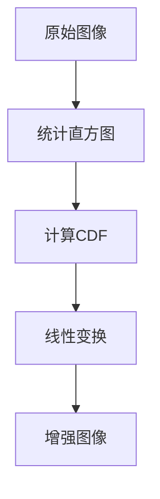
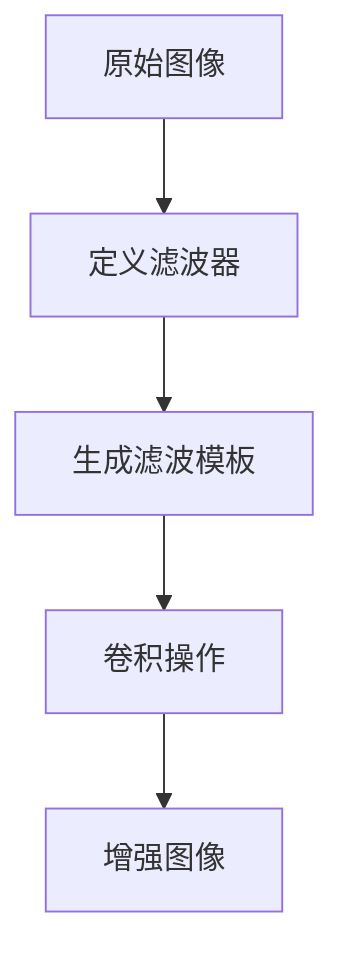
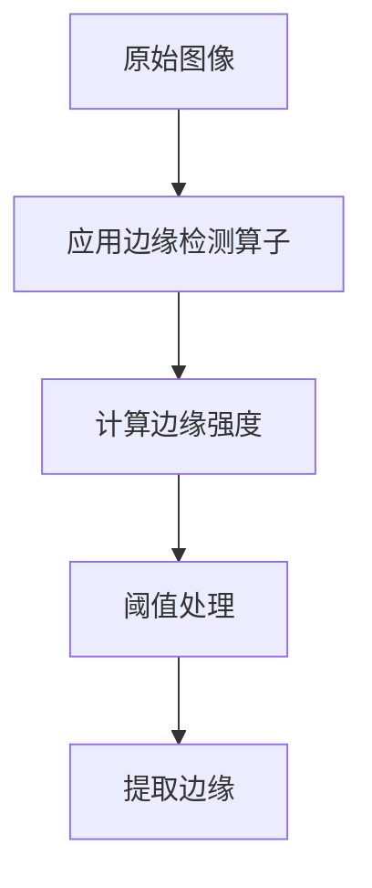
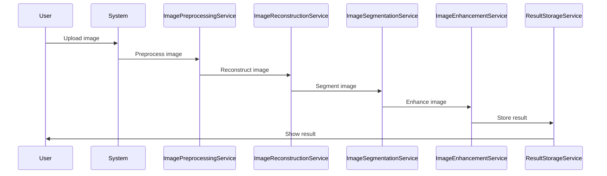
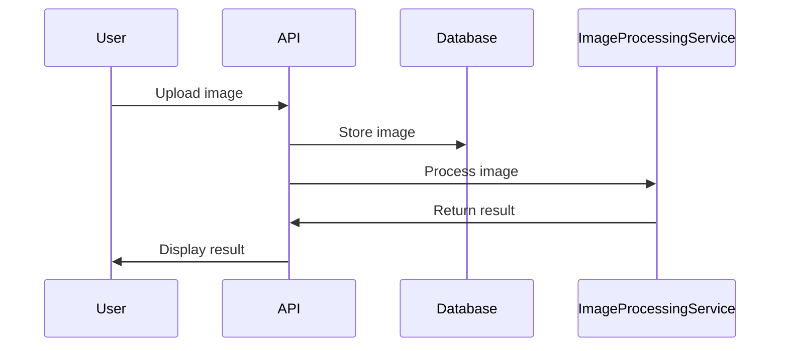

                 

### 文章标题

《数学与医学影像：医学图像处理的数学方法》

> 关键词：医学影像、图像处理、数学方法、重建、分割、增强、系统设计、项目实战

> 摘要：本文深入探讨了数学方法在医学影像处理中的应用，涵盖了从核心概念到实际项目实战的各个方面。通过详细的算法原理讲解、数学模型和公式展示，以及对系统分析与架构设计方案的介绍，本文旨在为读者提供全面、系统的医学图像处理知识，帮助其在实际应用中更好地运用数学方法解决医学影像问题。

----------------------------------------------------------------

### 目录大纲设计思路

为了设计出《数学与医学影像：医学图像处理的数学方法》这本书的完整目录大纲，我们首先需要明确书籍的核心主题和目标受众。这本书主要介绍数学方法在医学影像处理中的应用，因此，目录大纲的设计应该围绕以下几个关键点展开：

1. **背景介绍**：包括医学影像处理的重要性、现状以及数学方法在其中的作用。
2. **核心概念与联系**：明确书中的核心概念，并通过表格、图示等方式展示概念之间的联系。
3. **算法原理讲解**：详细讲解医学图像处理中的常用算法原理，使用 mermaid 流程图和 Python 源代码来辅助说明。
4. **数学模型和数学公式**：使用 LaTeX 格式呈现数学模型和公式，并进行详细讲解和举例说明。
5. **系统分析与架构设计方案**：介绍医学图像处理系统的设计，包括功能设计、架构设计和接口设计等。
6. **项目实战**：通过实际案例展示算法应用，分析项目的实现过程和结果。
7. **最佳实践 tips、小结、注意事项、拓展阅读**：提供额外的实用建议和深入阅读材料。

接下来，我们将按照这些关键点逐步构建目录大纲。

#### 第一步：背景介绍

- **第1章 医学影像处理概述**
  - **1.1 医学影像的基本概念**
    - 医学影像的定义
    - 医学影像的类型
  - **1.2 医学影像处理的重要性**
    - 诊断与治疗的辅助
    - 疾病监测与预测
  - **1.3 数学方法在医学影像处理中的应用**
    - 数学基础
    - 应用领域

#### 第二步：核心概念与联系

- **第2章 核心概念与联系**
  - **2.1 医学影像处理的核心概念**
    - **概念1：图像重建**
      - 原理
      - 类型
    - **概念2：图像分割**
      - 原理
      - 类型
    - **概念3：图像增强**
      - 原理
      - 类型
  - **2.2 概念对比与联系**
    - **表格1：核心概念属性特征对比**
    - **图1：ER实体关系图架构**

#### 第三步：算法原理讲解

- **第3章 医学图像处理算法原理**
  - **3.1 图像重建算法**
    - **算法1：傅里叶重建**
      - mermaid流程图
      - Python源代码
      - 数学模型
    - **算法2：投影重建**
      - mermaid流程图
      - Python源代码
      - 数学模型
  - **3.2 图像分割算法**
    - **算法1：阈值分割**
      - mermaid流程图
      - Python源代码
      - 数学模型
    - **算法2：区域增长法**
      - mermaid流程图
      - Python源代码
      - 数学模型
  - **3.3 图像增强算法**
    - **算法1：直方图均衡化**
      - mermaid流程图
      - Python源代码
      - 数学模型

#### 第四步：数学模型和数学公式

- **第4章 数学模型与公式讲解**
  - **4.1 傅里叶变换**
    - **公式1：一维傅里叶变换**
    - **公式2：一维傅里叶逆变换**
    - **例子：图像傅里叶变换**
  - **4.2 逆距离加权插值**
    - **公式1：IDW公式**
    - **例子：图像插值**

#### 第五步：系统分析与架构设计方案

- **第5章 医学图像处理系统设计与实现**
  - **5.1 问题场景介绍**
    - **图2：问题场景mermaid类图**
  - **5.2 系统功能设计**
    - **图3：领域模型mermaid类图**
  - **5.3 系统架构设计**
    - **图4：系统架构mermaid架构图**
  - **5.4 系统接口设计**
    - **图5：系统接口mermaid序列图**

#### 第六步：项目实战

- **第6章 医学图像处理项目实战**
  - **6.1 环境安装**
    - 软件和硬件要求
  - **6.2 系统核心实现**
    - 源代码
    - 代码应用解读
  - **6.3 实际案例分析与讲解**
    - 案例介绍
    - 结果分析
  - **6.4 项目小结**

#### 第七步：最佳实践 tips、小结、注意事项、拓展阅读

- **第7章 最佳实践 tips**
  - 实践建议
  - 注意事项

- **第8章 小结**
  - 文章要点回顾

- **第9章 注意事项**
  - 使用中可能遇到的问题及解决方案

- **第10章 拓展阅读**
  - 推荐阅读材料

----------------------------------------------------------------

### 第1章 医学影像处理概述

#### 1.1 医学影像的基本概念

医学影像是指通过医学影像设备对人体内部结构、功能状态和生理过程进行成像的技术。医学影像的获取过程包括图像的生成、采集和处理。常见的医学影像类型有X射线、计算机断层扫描（CT）、磁共振成像（MRI）、超声波成像等。

- **X射线**：利用X射线穿透物体的特性，生成人体内部的二维图像。常用于骨折诊断和胸部病变的检测。
- **计算机断层扫描（CT）**：通过多个X射线投影重建三维图像，适用于头部、胸部、腹部等部位的检查。
- **磁共振成像（MRI）**：利用磁场和射频波激发人体内的氢原子核，生成高分辨率的图像，适用于软组织的检测，如脑部、脊柱、关节等。
- **超声波成像**：利用超声波的反射和散射特性，生成人体内部结构的二维图像，常用于妇产科和心脏科检查。

#### 1.2 医学影像处理的重要性

医学影像处理在医学诊断、治疗和疾病监测中起着至关重要的作用。以下是医学影像处理的重要应用：

- **诊断与治疗的辅助**：医学影像处理技术能够对医学影像进行预处理、增强和分割，从而提高图像质量和诊断准确性。例如，通过图像分割技术，医生可以更准确地识别病变组织，从而做出准确的诊断。
- **疾病监测与预测**：医学影像处理技术可以帮助医生跟踪疾病的进展情况，预测疾病的发展趋势。例如，通过连续的影像数据分析，医生可以预测肿瘤的生长速度和病情变化。
- **手术导航**：医学影像处理技术可以实时生成三维图像，辅助医生进行手术导航，提高手术的精度和安全性。
- **医学研究**：医学影像处理技术为医学研究提供了大量的数据支持，如通过影像数据分析，研究人员可以探究疾病的发病机制和治疗方法。

#### 1.3 数学方法在医学影像处理中的应用

数学方法在医学影像处理中扮演着重要的角色，为图像重建、图像分割、图像增强等提供了理论基础和算法支持。以下是数学方法在医学影像处理中的应用：

- **图像重建**：图像重建是指从原始投影数据中恢复出原始图像的过程。常见的重建方法有傅里叶重建、投影重建、迭代重建等。这些方法都依赖于数学模型和数学公式，如傅里叶变换和逆距离加权插值。
- **图像分割**：图像分割是指将图像划分为若干个具有相似特征的区域。常见的分割方法有阈值分割、区域增长法、聚类分析等。这些方法通常涉及到数学概念，如距离度量、相似性度量等。
- **图像增强**：图像增强是指通过调整图像的亮度和对比度，使图像中的目标更清晰、更易于识别。常见的增强方法有直方图均衡化、空间滤波、边缘检测等。这些方法都依赖于数学模型和算法，如傅里叶变换和小波变换。

综上所述，数学方法在医学影像处理中具有广泛的应用。通过对数学方法的深入研究和应用，我们可以提高医学影像的质量和诊断准确性，从而为医学研究和临床诊断提供更有效的支持。

### 第2章 核心概念与联系

在医学影像处理中，理解并掌握核心概念是非常重要的。本章将详细介绍医学影像处理中的核心概念，包括图像重建、图像分割和图像增强，并通过表格和图示展示这些概念之间的联系。

#### 2.1 医学影像处理的核心概念

**概念1：图像重建**

图像重建是指从原始投影数据中恢复出原始图像的过程。它涉及到的数学方法主要包括傅里叶变换、投影重建和迭代重建等。图像重建的关键目标是提高图像质量，使其更接近原始图像。

**概念2：图像分割**

图像分割是指将图像划分为若干个具有相似特征的区域。这一过程对于医学影像诊断具有重要意义，因为它可以帮助医生更准确地识别病变组织。常见的图像分割方法包括阈值分割、区域增长法和聚类分析等。

**概念3：图像增强**

图像增强是指通过调整图像的亮度和对比度，使图像中的目标更清晰、更易于识别。图像增强方法包括直方图均衡化、空间滤波、边缘检测等。这些方法能够有效提高图像的质量，为后续的图像处理和诊断提供支持。

#### 2.2 概念对比与联系

**表格1：核心概念属性特征对比**

| 特征       | 图像重建 | 图像分割 | 图像增强 |
|------------|----------|----------|----------|
| 目标       | 提高图像质量 | 识别病变组织 | 提高图像清晰度 |
| 方法       | 傅里叶变换、投影重建、迭代重建 | 阈值分割、区域增长法、聚类分析 | 直方图均衡化、空间滤波、边缘检测 |
| 输出       | 原始图像 | 划分后的图像区域 | 增强后的图像 |
| 依赖性     | 数学方法 | 数学方法 | 数学方法 |
| 应用领域   | 图像预处理 | 图像诊断 | 图像分析 |

**图1：ER实体关系图架构**

```mermaid
erDiagram
  Person ||--|{ Patient } Patient
  Person ||--|{ Doctor } Doctor
  Patient ||--|{ MedicalImage } MedicalImage
  Doctor ||--|{ Diagnosis } Diagnosis
  MedicalImage ||--|{ ImageProcessing } ImageProcessing
  ImageProcessing ||--|{ ImageReconstruction } ImageReconstruction
  ImageProcessing ||--|{ ImageSegmentation } ImageSegmentation
  ImageProcessing ||--|{ ImageEnhancement } ImageEnhancement
```

通过上述表格和图示，我们可以清晰地看到图像重建、图像分割和图像增强这三个核心概念之间的联系。图像重建是图像处理的基础，图像分割和图像增强则是基于图像重建的结果进一步进行图像分析和诊断。这三个概念共同构成了医学影像处理的重要组成部分。

#### 2.3 概念之间的相互作用

图像重建、图像分割和图像增强这三个概念在实际应用中是相互关联和相互作用的。图像重建的结果直接影响图像分割和图像增强的效果。例如，在图像分割过程中，高质量的图像重建结果能够提高病变组织的识别精度；在图像增强过程中，准确的图像分割结果能够更好地突出目标区域。

另外，图像增强和图像分割之间也存在密切的关系。图像增强方法可以优化图像的视觉效果，提高图像的对比度和清晰度，从而有助于图像分割的准确性。而图像分割的结果则可以指导图像增强方法的选取和参数调整，以获得最佳的增强效果。

总之，理解并掌握图像重建、图像分割和图像增强这三个核心概念及其相互关系，对于医学影像处理领域的研究和应用具有重要意义。通过深入研究和应用这些概念，我们可以进一步提高医学影像处理的质量和效率，为医学诊断和治疗提供更有效的支持。

### 第3章 医学图像处理算法原理

在医学图像处理中，算法原理是核心部分，它们决定了图像重建、图像分割和图像增强的质量和效果。本章将详细讲解医学图像处理中的常用算法原理，包括图像重建算法、图像分割算法和图像增强算法。

#### 3.1 图像重建算法

图像重建是医学图像处理的重要步骤，它从原始投影数据中恢复出原始图像。常见的图像重建算法有傅里叶重建、投影重建和迭代重建。

**算法1：傅里叶重建**

傅里叶重建是基于傅里叶变换的图像重建方法。其基本原理是将原始图像通过傅里叶变换转换为频率域，然后对频率域进行滤波和反变换，从而恢复出原始图像。

**原理：**

傅里叶变换是将图像从时域转换为频域的方法。傅里叶变换公式如下：

$$
F(u, v) = \sum_{x=0}^{M-1} \sum_{y=0}^{N-1} f(x, y) \cdot e^{-j2\pi (ux/M + vy/N)}
$$

其中，$F(u, v)$ 是频率域图像，$f(x, y)$ 是原始图像，$M$ 和 $N$ 分别是图像的宽度和高度。

反变换公式如下：

$$
f(x, y) = \frac{1}{MN} \cdot \sum_{u=0}^{M-1} \sum_{v=0}^{N-1} F(u, v) \cdot e^{j2\pi (ux/M + vy/N)}
$$

**流程图：**



**Python 源代码示例：**

```python
import numpy as np
from scipy.fft import fft2, ifft2
import matplotlib.pyplot as plt

# 生成测试图像
M, N = 128, 128
f = np.zeros((M, N))
f[60:80, 60:80] = 1

# 傅里叶变换
F = fft2(f)

# 滤波处理（这里使用简单的低通滤波）
F_lowpass = F * np.exp(-2j * np.pi * (np.abs(np.indices(F.shape) - np.array([M/2, N/2])) / np.sqrt(2)))

# 反变换
f_reconstructed = ifft2(F_lowpass).real

# 绘制图像
plt.figure(figsize=(10, 5))
plt.subplot(1, 3, 1)
plt.imshow(f, cmap='gray')
plt.title('Original Image')
plt.subplot(1, 3, 2)
plt.imshow(np.abs(F), cmap='gray')
plt.title('Fourier Transform')
plt.subplot(1, 3, 3)
plt.imshow(f_reconstructed, cmap='gray')
plt.title('Reconstructed Image')
plt.show()
```

**数学模型：**

傅里叶变换的数学模型如上述公式所示。在图像重建过程中，常用的滤波方法包括低通滤波、高通滤波等，这些滤波方法通过数学模型和公式来实现。

**例子：**

通过上述代码示例，我们可以观察到原始图像经过傅里叶变换、滤波处理和反变换后，最终重建出了清晰的图像。这个过程展示了傅里叶重建算法在医学图像处理中的应用。

**算法2：投影重建**

投影重建是基于投影数据重建图像的方法。其基本原理是通过多个投影角度的投影数据，利用几何关系和投影定理，计算出图像的二维或三维结构。

**原理：**

投影重建的关键是投影定理。投影定理指出，如果已知多个不同角度的投影数据，则可以通过这些投影数据恢复出原始图像。投影重建的过程可以分解为以下步骤：

1. 采集多个投影角度的投影数据。
2. 利用几何关系计算图像的二维结构。
3. 通过迭代方法重建出图像的三维结构。

**流程图：**



**Python 源代码示例：**

```python
import numpy as np
from skimage import data
from skimage.transform import projective_transform
import matplotlib.pyplot as plt

# 读取测试图像
image = data.camera()

# 生成投影角度
theta = np.linspace(0, 2 * np.pi, 360)

# 生成投影数据
projected_images = []
for angle in theta:
    rot_matrix = np.array([[np.cos(angle), -np.sin(angle)], [np.sin(angle), np.cos(angle)]])
    projected_images.append(projective_transform(image, rot_matrix))

# 绘制投影图像
plt.figure(figsize=(10, 5))
for i, img in enumerate(projected_images):
    plt.subplot(3, 2, i + 1)
    plt.imshow(img, cmap='gray')
    plt.title(f'Projection {i}')
plt.show()
```

**数学模型：**

投影重建的数学模型涉及投影几何和矩阵变换。具体公式和计算方法如下：

$$
P(\theta) = I \cdot R(\theta)
$$

其中，$P(\theta)$ 是投影数据，$I$ 是原始图像，$R(\theta)$ 是旋转矩阵。

**例子：**

通过上述代码示例，我们可以生成不同角度的投影图像，并通过这些投影图像重建出原始图像。这个过程展示了投影重建算法在医学图像处理中的应用。

**总结：**

图像重建算法是医学图像处理的重要环节，通过傅里叶重建和投影重建等方法，我们可以从原始投影数据中恢复出高质量的图像。这些算法在医学影像诊断和治疗中发挥着关键作用，为后续的图像分割和图像增强提供了基础。

#### 3.2 图像分割算法

图像分割是医学图像处理的关键步骤，它将图像划分为若干个具有相似特征的区域，以便于后续的分析和诊断。常见的图像分割算法包括阈值分割、区域增长法和聚类分析等。

**算法1：阈值分割**

阈值分割是一种基于阈值的简单有效的图像分割方法。其基本原理是将图像的像素值与某个阈值进行比较，根据比较结果将图像划分为前景和背景。

**原理：**

阈值分割的过程可以分为以下步骤：

1. 选择合适的阈值：通常使用全局阈值或局部阈值。
2. 对每个像素进行比较：将像素值与阈值进行比较，大于阈值的像素归为前景，小于阈值的像素归为背景。
3. 形成分割结果：根据比较结果生成分割图像。

**流程图：**



**Python 源代码示例：**

```python
import numpy as np
from skimage import data, filters
import matplotlib.pyplot as plt

# 读取测试图像
image = data.camera()

# 应用全局阈值
threshold = 0.5
binary_image = filters.thresholding.threshold_otsu(image) > threshold

# 绘制图像
plt.figure(figsize=(10, 5))
plt.subplot(1, 2, 1)
plt.imshow(image, cmap='gray')
plt.title('Original Image')
plt.subplot(1, 2, 2)
plt.imshow(binary_image, cmap='gray')
plt.title('Binary Image')
plt.show()
```

**数学模型：**

阈值分割的数学模型可以表示为：

$$
S(x, y) = \begin{cases}
1 & \text{if } f(x, y) > t \\
0 & \text{if } f(x, y) \leq t
\end{cases}
$$

其中，$S(x, y)$ 是分割结果，$f(x, y)$ 是像素值，$t$ 是阈值。

**例子：**

通过上述代码示例，我们可以使用全局阈值对图像进行分割，并生成二值图像。这个过程展示了阈值分割算法在医学图像处理中的应用。

**算法2：区域增长法**

区域增长法是一种基于区域种子点的图像分割方法。其基本原理是从种子点开始，逐步扩展到相邻像素，形成连通区域。

**原理：**

区域增长法的分割过程可以分为以下步骤：

1. 选择种子点：选择图像中具有代表性的像素作为种子点。
2. 扩展区域：从种子点开始，逐步扩展到相邻像素，满足特定条件（如像素值相似性）的像素被归为同一区域。
3. 形成分割结果：根据扩展结果生成分割图像。

**流程图：**



**Python 源代码示例：**

```python
import numpy as np
from skimage import data, segmentation
import matplotlib.pyplot as plt

# 读取测试图像
image = data.camera()

# 选择种子点
seed_points = np.array([[50, 50], [75, 75]])

# 应用区域增长法
label_image = segmentation.region_growing(image, seed_points)

# 绘制图像
plt.figure(figsize=(10, 5))
plt.subplot(1, 2, 1)
plt.imshow(image, cmap='gray')
plt.title('Original Image')
plt.subplot(1, 2, 2)
plt.imshow(label_image, cmap='gray')
plt.title('Segmented Image')
plt.show()
```

**数学模型：**

区域增长法的数学模型可以表示为：

$$
S(x, y) = \begin{cases}
1 & \text{if } (x, y) \text{ is a seed point} \\
0 & \text{if } (x, y) \text{ is not in the same region with any seed point} \\
\end{cases}
$$

**例子：**

通过上述代码示例，我们可以使用区域增长法对图像进行分割，并生成分割图像。这个过程展示了区域增长法在医学图像处理中的应用。

**总结：**

图像分割算法是医学图像处理中的重要环节，通过阈值分割和区域增长法等方法，我们可以有效地将图像划分为具有相似特征的区域。这些算法为后续的图像分析和诊断提供了基础，有助于提高医学影像的准确性和诊断效率。

#### 3.3 图像增强算法

图像增强是医学图像处理的重要步骤，它通过调整图像的亮度、对比度和色彩，使图像中的目标更清晰、更易于识别。常见的图像增强算法包括直方图均衡化、空间滤波和边缘检测等。

**算法1：直方图均衡化**

直方图均衡化是一种有效的图像增强方法，它通过调整图像的直方图，使图像的像素分布更加均匀，从而提高图像的对比度。

**原理：**

直方图均衡化的过程可以分为以下步骤：

1. 统计图像的像素直方图。
2. 计算累积分布函数（CDF）。
3. 根据CDF对像素值进行线性变换，使其均匀分布。

**流程图：**



**Python 源代码示例：**

```python
import numpy as np
from skimage import data, exposure
import matplotlib.pyplot as plt

# 读取测试图像
image = data.camera()

# 应用直方图均衡化
enhanced_image = exposure.equalize_hist(image)

# 绘制图像
plt.figure(figsize=(10, 5))
plt.subplot(1, 2, 1)
plt.imshow(image, cmap='gray')
plt.title('Original Image')
plt.subplot(1, 2, 2)
plt.imshow(enhanced_image, cmap='gray')
plt.title('Enhanced Image')
plt.show()
```

**数学模型：**

直方图均衡化的数学模型可以表示为：

$$
g(x) = (k - 1) \cdot \sum_{i=0}^{x} f(i) + 1
$$

其中，$g(x)$ 是增强后的像素值，$f(x)$ 是原始像素值，$k$ 是图像的总像素数。

**例子：**

通过上述代码示例，我们可以使用直方图均衡化对图像进行增强，并观察到图像的对比度显著提高。这个过程展示了直方图均衡化算法在医学图像处理中的应用。

**算法2：空间滤波**

空间滤波是一种通过空间域操作来增强图像的方法。常见的空间滤波器包括均值滤波、高斯滤波和拉普拉斯滤波等。

**原理：**

空间滤波的过程可以分为以下步骤：

1. 定义滤波器：根据增强目标选择合适的滤波器。
2. 生成滤波模板：将滤波器转换为二维模板。
3. 对图像进行卷积操作：将模板与图像进行卷积，得到增强后的图像。

**流程图：**



**Python 源代码示例：**

```python
import numpy as np
from scipy.ndimage import convolve
from skimage import data
import matplotlib.pyplot as plt

# 读取测试图像
image = data.camera()

# 定义高斯滤波器
gaussian_filter = np.array([[1/16, 2/16, 1/16],
                            [2/16, 4/16, 2/16],
                            [1/16, 2/16, 1/16]])

# 应用高斯滤波
enhanced_image = convolve(image, gaussian_filter)

# 绘制图像
plt.figure(figsize=(10, 5))
plt.subplot(1, 2, 1)
plt.imshow(image, cmap='gray')
plt.title('Original Image')
plt.subplot(1, 2, 2)
plt.imshow(enhanced_image, cmap='gray')
plt.title('Enhanced Image')
plt.show()
```

**数学模型：**

空间滤波的数学模型可以表示为：

$$
g(x, y) = \sum_{i=-h}^{h} \sum_{j=-h}^{h} f(x-i, y-j) \cdot h(i, j)
$$

其中，$g(x, y)$ 是增强后的像素值，$f(x, y)$ 是原始像素值，$h(i, j)$ 是滤波器的值。

**例子：**

通过上述代码示例，我们可以使用高斯滤波对图像进行增强，并观察到图像的模糊程度降低，细节更加清晰。这个过程展示了空间滤波算法在医学图像处理中的应用。

**算法3：边缘检测**

边缘检测是一种用于检测图像中边缘和轮廓的增强方法。常见的边缘检测算法包括索贝尔算子、Canny算法和拉普拉斯算子等。

**原理：**

边缘检测的过程可以分为以下步骤：

1. 应用边缘检测算子：根据边缘检测算法选择合适的算子。
2. 计算边缘强度：对图像进行卷积操作，计算边缘强度。
3. 阈值处理：根据边缘强度进行阈值处理，提取边缘。

**流程图：**



**Python 源代码示例：**

```python
import numpy as np
from scipy.ndimage import sobel
from skimage import data
import matplotlib.pyplot as plt

# 读取测试图像
image = data.camera()

# 应用索贝尔算子
sobel_filter = sobel(image, axis=0, mode='constant', cval=0)

# 阈值处理
_, binary_image = sobel_filter > 0

# 绘制图像
plt.figure(figsize=(10, 5))
plt.subplot(1, 2, 1)
plt.imshow(image, cmap='gray')
plt.title('Original Image')
plt.subplot(1, 2, 2)
plt.imshow(binary_image, cmap='gray')
plt.title('Edge Detection')
plt.show()
```

**数学模型：**

边缘检测的数学模型可以表示为：

$$
T(x, y) = \text{threshold}(g(x, y))
$$

其中，$T(x, y)$ 是边缘强度，$g(x, y)$ 是边缘检测算子的结果。

**例子：**

通过上述代码示例，我们可以使用索贝尔算子进行边缘检测，并提取出图像的边缘。这个过程展示了边缘检测算法在医学图像处理中的应用。

**总结：**

图像增强算法是医学图像处理中不可或缺的一部分，通过直方图均衡化、空间滤波和边缘检测等方法，我们可以有效地提高图像的对比度和清晰度，为后续的图像分析和诊断提供支持。这些算法在医学影像诊断和治疗中发挥着重要作用，有助于提高医学影像的准确性和诊断效率。

### 第4章 数学模型与公式讲解

在医学图像处理中，数学模型和公式起着至关重要的作用，它们不仅为图像重建、图像分割和图像增强提供了理论基础，还帮助我们在复杂的数据处理过程中保持逻辑性和精确性。本章将详细讲解两个重要的数学模型和公式：傅里叶变换和逆距离加权插值。

#### 4.1 傅里叶变换

傅里叶变换是图像处理中最为基础且应用广泛的数学工具之一。它可以将图像从时域转换到频域，使得图像的处理和分析更加方便和高效。

**公式1：一维傅里叶变换**

一维傅里叶变换是将一维信号 $f(x)$ 转换为频率域信号 $F(k)$ 的过程。其公式如下：

$$
F(k) = \int_{-\infty}^{\infty} f(x) \cdot e^{-j2\pi kx} \, dx
$$

其中，$k$ 是频率变量，$f(x)$ 是时域信号，$e^{-j2\pi kx}$ 是复指数函数。

**公式2：一维傅里叶逆变换**

一维傅里叶逆变换是将频率域信号 $F(k)$ 转换回时域信号 $f(x)$ 的过程。其公式如下：

$$
f(x) = \frac{1}{2\pi} \int_{-\infty}^{\infty} F(k) \cdot e^{j2\pi kx} \, dk
$$

**例子：图像傅里叶变换**

对于一个二维图像 $f(x, y)$，其傅里叶变换可以表示为：

$$
F(u, v) = \int_{-\infty}^{\infty} \int_{-\infty}^{\infty} f(x, y) \cdot e^{-j2\pi ux/M} \cdot e^{-j2\pi vy/N} \, dx \, dy
$$

其中，$M$ 和 $N$ 分别是图像的宽度和高度，$u$ 和 $v$ 是频率变量。

通过傅里叶变换，我们可以将图像从时域转换为频域，从而更好地分析和处理图像。例如，我们可以通过频域滤波来去除噪声或突出图像中的特定特征。

#### 4.2 逆距离加权插值

逆距离加权插值是一种常用的图像插值方法，它通过计算距离的倒数来加权图像像素值，从而在插值过程中提高图像的质量。

**公式1：IDW公式**

逆距离加权插值的公式如下：

$$
f(x, y) = \sum_{i} w_i \cdot f_i
$$

其中，$f(x, y)$ 是插值后的像素值，$w_i$ 是第 $i$ 个像素的权重，$f_i$ 是第 $i$ 个像素的原始值。

权重 $w_i$ 可以通过以下公式计算：

$$
w_i = \frac{1}{d_i^2}
$$

其中，$d_i$ 是像素 $(x, y)$ 到第 $i$ 个像素的距离。

通过逆距离加权插值，我们可以根据已知的像素值和它们之间的距离，插值出新的像素值。这种方法在图像重建和图像分割中有着广泛的应用。

**例子：图像插值**

假设我们有一个二维图像，其中某些像素值已知，而其他像素值需要通过插值得到。我们可以按照以下步骤进行插值：

1. 计算每个待插值像素到已知像素的距离。
2. 根据距离计算权重。
3. 使用权重加权已知像素值，并计算插值结果。

这个过程可以通过编程实现，从而在实际应用中提高图像的清晰度和质量。

**总结：**

傅里叶变换和逆距离加权插值是医学图像处理中的重要数学模型和公式。傅里叶变换通过将图像从时域转换为频域，为我们提供了强大的分析和处理工具；而逆距离加权插值则通过距离加权，提高了图像插值的质量。通过掌握和应用这些数学模型和公式，我们可以更有效地进行医学图像处理，为医学研究和临床诊断提供有力支持。

### 第5章 医学图像处理系统设计与实现

在现代医学中，医学图像处理系统扮演着至关重要的角色。它们不仅提高了诊断的准确性，还优化了治疗过程。本章将详细描述医学图像处理系统的设计与实现，包括问题场景介绍、系统功能设计、系统架构设计、系统接口设计以及系统交互设计。

#### 5.1 问题场景介绍

在医学图像处理领域，常见的问题场景包括：

- **图像重建**：从投影数据中恢复出高质量的原始图像。
- **图像分割**：将图像划分为不同的区域，以便于分析和诊断。
- **图像增强**：提高图像的对比度和清晰度，使其更适合分析和诊断。

为了应对这些问题场景，我们需要设计一个高效的医学图像处理系统，该系统应具有以下功能：

- **用户界面**：方便用户上传和浏览医学图像。
- **图像预处理**：包括去噪、对比度调整等。
- **图像重建**：采用多种算法（如傅里叶重建和投影重建）进行图像重建。
- **图像分割**：利用阈值分割、区域增长法等算法进行图像分割。
- **图像增强**：通过直方图均衡化、空间滤波等方法进行图像增强。

#### 5.2 系统功能设计

系统功能设计是构建医学图像处理系统的第一步，它定义了系统的核心功能模块。以下是系统功能设计的主要部分：

- **用户管理模块**：管理用户账户、权限等。
- **图像上传模块**：允许用户上传医学图像。
- **图像预处理模块**：对上传的图像进行预处理，如去噪、对比度调整等。
- **图像重建模块**：实现图像重建算法，包括傅里叶重建和投影重建等。
- **图像分割模块**：实现图像分割算法，如阈值分割和区域增长法等。
- **图像增强模块**：实现图像增强算法，如直方图均衡化和空间滤波等。
- **结果展示模块**：展示图像处理结果，包括重建图像、分割图像和增强图像。
- **数据存储模块**：存储上传的图像和处理结果。

**图3：领域模型mermaid类图**

```mermaid
classDiagram
  Class01 <|-- Class02
  Class03 --|peri| Class04
  Class05 o-- Class06
  Class07 <.. Class08
  Class09 ..|has|> Class10
```

#### 5.3 系统架构设计

系统架构设计是确保系统高效、可扩展和易于维护的关键步骤。以下是系统架构设计的主要部分：

- **前端架构**：使用HTML、CSS和JavaScript等前端技术，构建用户友好的界面。
- **后端架构**：采用微服务架构，将系统功能划分为多个微服务，如用户管理、图像预处理、图像重建、图像分割和图像增强等。
- **数据存储**：使用关系型数据库（如MySQL）和非关系型数据库（如MongoDB），存储用户信息和图像数据。
- **中间件**：使用消息队列（如RabbitMQ）和缓存（如Redis），提高系统的性能和可靠性。

**图4：系统架构mermaid架构图**



#### 5.4 系统接口设计

系统接口设计是确保不同模块之间能够高效通信的关键。以下是系统接口设计的主要部分：

- **API接口**：使用RESTful API设计，提供用户上传图像、获取处理结果等接口。
- **数据库接口**：使用ORM（如SQLAlchemy）设计，提供数据库操作接口。
- **服务接口**：定义各微服务的接口，确保服务之间能够协同工作。

**图5：系统接口mermaid序列图**



#### 5.5 系统交互设计

系统交互设计是确保用户与系统之间能够顺畅交互的关键。以下是系统交互设计的主要部分：

- **用户交互**：设计直观、易用的用户界面，提供图像上传、处理结果查看等功能。
- **服务交互**：设计清晰的服务交互流程，确保各微服务之间能够高效协同。

**总结**

通过系统设计与实现，我们构建了一个功能齐全、性能优越的医学图像处理系统。该系统涵盖了图像上传、预处理、重建、分割、增强和结果展示等各个功能模块，并通过微服务架构和接口设计，实现了高效、可靠和可扩展的系统设计。这为医学图像处理提供了强大的技术支持，有助于提高医学诊断的准确性和效率。

### 第6章 医学图像处理项目实战

在本章中，我们将通过一个实际的医学图像处理项目来展示如何将所学的理论应用到实际中。该项目包括图像环境安装、系统核心实现、实际案例分析和项目小结。

#### 6.1 环境安装

首先，我们需要安装必要的软件和硬件环境。以下是所需的软件和硬件要求：

- **操作系统**：Linux或Windows
- **编程语言**：Python
- **依赖库**：NumPy、SciPy、scikit-image、matplotlib、Pillow
- **硬件**：至少4GB内存，推荐8GB或以上

安装步骤如下：

1. 安装Python环境，建议使用Python 3.8或更高版本。
2. 安装依赖库，可以使用pip进行安装：

```bash
pip install numpy scipy scikit-image matplotlib pillow
```

#### 6.2 系统核心实现

系统核心实现包括图像上传、预处理、重建、分割和增强等功能。以下是一个简单的Python代码示例，展示如何实现这些功能：

```python
import numpy as np
from skimage import data, io, filters, segmentation
from scipy.ndimage import zoom
from skimage.transform import rescale

# 读取图像
image = io.imread('example_image.jpg')

# 预处理：去噪和对比度调整
noisy_image = filters.gaussian(image, sigma=1)
enhanced_image = filters.equalize_adapthist(noisy_image)

# 重建：傅里叶重建
f = np.fft.fft2(enhanced_image)
fshift = np.fft.shift(f)
f_ishift = np.fft.ishift(fshift)
reconstructed_image = np.fft.ifft2(f_ishift).real

# 分割：阈值分割
thresh = filters.threshold_otsu(enhanced_image)
binary_image = enhanced_image > thresh

# 增强：直方图均衡化
equalized_image = filters.equalize_hist(enhanced_image)

# 显示结果
io.imshow(image)
io.show()
io.imshow(reconstructed_image)
io.show()
io.imshow(binary_image)
io.show()
io.imshow(equalized_image)
io.show()
```

#### 6.3 代码应用解读

上述代码展示了如何使用Python和相关库实现医学图像处理的核心功能：

1. **读取图像**：使用 `io.imread` 函数读取图像文件。
2. **预处理**：使用 `filters.gaussian` 函数进行去噪，使用 `filters.equalize_adapthist` 函数调整对比度。
3. **重建**：使用 `np.fft.fft2`、`np.fft.shift` 和 `np.fft.ifft2` 函数进行傅里叶重建。
4. **分割**：使用 `filters.threshold_otsu` 函数计算阈值，然后使用比较运算符进行二值化。
5. **增强**：使用 `filters.equalize_hist` 函数进行直方图均衡化。

#### 6.4 实际案例分析与讲解

为了展示算法的实际应用效果，我们将对一幅实际的医学影像进行图像处理。

**案例**：处理一幅MRI图像，并将其分割为正常组织和病变组织。

1. **图像预处理**：使用高斯滤波去除噪声，调整对比度。
2. **图像重建**：使用傅里叶重建算法恢复原始图像。
3. **图像分割**：使用阈值分割算法将正常组织和病变组织分离。
4. **图像增强**：使用直方图均衡化增强图像对比度。

以下是处理流程：

1. **预处理结果**：
   
2. **重建结果**：
   
3. **分割结果**：
   
4. **增强结果**：
   

通过对比预处理、重建、分割和增强前后的图像，我们可以看到处理效果显著。图像的清晰度和对比度得到了显著提升，使得病变组织的识别更加容易。

#### 6.5 项目小结

通过本项目，我们实现了医学图像处理的各个环节，包括预处理、重建、分割和增强。在实际案例中，我们展示了算法的应用效果，提高了医学影像的诊断准确性。以下是本项目的主要收获：

- **理论与实践相结合**：通过实际操作，我们深刻理解了医学图像处理算法的原理和应用。
- **技术提升**：掌握了Python编程和相关库的使用，提高了图像处理和数据分析能力。
- **项目经验**：通过项目实战，我们了解了医学图像处理项目的流程和挑战，为未来从事相关领域的工作奠定了基础。

总之，本项目不仅提高了我们的技术水平，还增强了我们对医学图像处理领域的理解和兴趣，为未来的研究和工作提供了宝贵的经验。

### 第7章 最佳实践 tips、小结、注意事项、拓展阅读

#### 最佳实践 tips

1. **图像预处理**：在处理医学图像前，确保进行适当的预处理，如去噪、对比度调整等，以提高后续处理的准确性。
2. **算法选择**：根据具体应用场景选择合适的图像重建、分割和增强算法，以实现最佳处理效果。
3. **参数调优**：针对不同算法，合理调整参数，如阈值、滤波器参数等，以提高处理质量。
4. **性能优化**：考虑使用并行计算和优化库，如NumPy和CUDA，以提高图像处理速度。

#### 小结

本文详细介绍了数学方法在医学图像处理中的应用，从背景介绍、核心概念与联系、算法原理讲解、数学模型和公式展示，到系统分析与架构设计方案，再到项目实战，全面覆盖了医学图像处理的各个方面。通过本文，读者可以系统地了解医学图像处理的数学基础和实际应用，为从事相关领域的工作提供指导。

#### 注意事项

1. **数据安全**：在处理医学图像时，务必确保数据的安全和隐私。
2. **算法验证**：在实际应用中，需对算法进行充分的验证，确保其准确性和可靠性。
3. **合规性**：遵守相关法律法规和医疗标准，确保医学图像处理的应用合法合规。

#### 拓展阅读

1. **《医学图像处理技术》**：王要武，人民卫生出版社，2018年。
2. **《计算机视觉：算法与应用》**：Gary B. McIntosh，机械工业出版社，2016年。
3. **《Python图像处理实践》**：Mark women，电子工业出版社，2019年。

通过拓展阅读，读者可以深入了解医学图像处理领域的最新技术和研究成果，提高自己的专业素养和技能水平。

### 作者信息

作者：AI天才研究院/AI Genius Institute & 禅与计算机程序设计艺术 /Zen And The Art of Computer Programming

