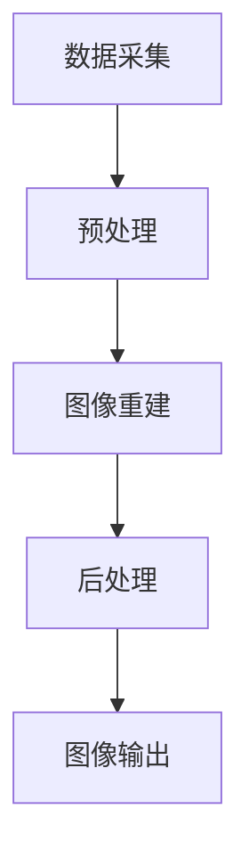
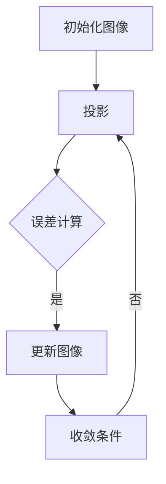
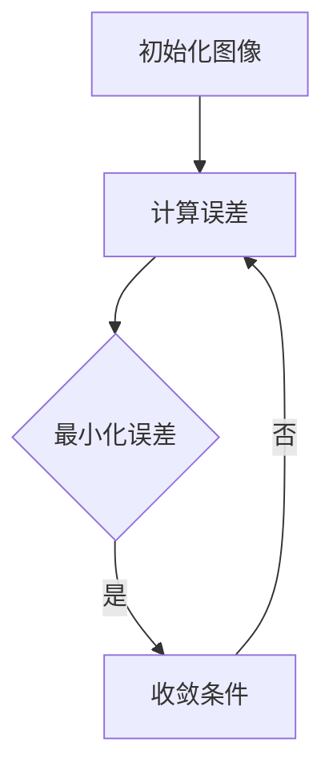
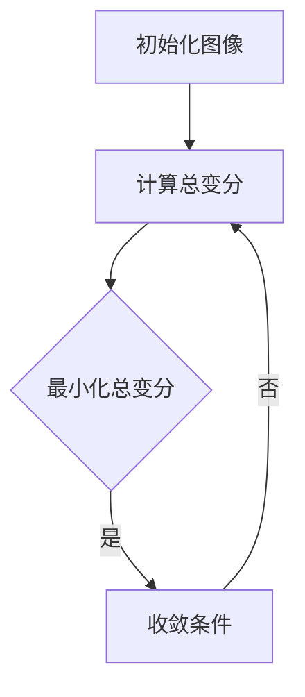

                 

### # 数学与医学影像：图像重建的数学算法

关键词：医学影像、图像重建、数学算法、反投影、迭代重建、最优化、正则化

摘要：本文旨在探讨数学算法在医学影像重建中的应用，通过对图像重建的基本原理、常见数学算法及其在医学影像中的具体应用进行深入分析，帮助读者理解并掌握医学影像重建的关键技术。本文从问题背景出发，逐步介绍图像重建的核心概念和常见算法，结合实际应用案例，探讨未来医学影像重建的发展趋势。

----------------------------------------------------------------

## 1. 前言

### 1.1 本书的目的

本书的主要目的是为读者提供医学影像重建的数学算法概述，帮助医学影像工作者、研究人员和爱好者了解并掌握图像重建的基本原理和常见算法。通过系统地介绍医学影像重建中的关键数学原理和算法，读者可以更好地理解医学影像重建的过程和技术，提高医学影像处理的效果和质量。

### 1.2 读者对象

本书适合以下读者群体：

1. 医学影像领域的研究人员和专业人士，希望通过学习数学算法提升医学影像重建的技术水平。
2. 医学工程师和医学生，对医学影像处理和重建技术感兴趣，希望深入了解其原理和应用。
3. 对计算机科学和人工智能领域有兴趣的技术爱好者，希望了解医学影像重建在医疗领域的应用。

### 1.3 主要话题

本书将详细讨论以下主要话题：

1. 医学影像重建的基本原理。
2. 常见数学算法在医学影像重建中的应用，包括反投影算法、迭代重建算法、迭代最优化算法和正则化算法。
3. 复杂场景下的医学影像重建技术，如多模态医学影像融合、动态医学影像重建和3D医学影像重建。
4. 数学算法在医学影像重建中的应用案例。
5. 未来趋势与挑战，包括新算法的发展方向和人工智能在医学影像重建中的应用前景。

通过系统地介绍这些话题，本书旨在为读者提供一个全面、深入的医学影像重建数学算法知识体系，帮助读者更好地理解和应用这些技术。

----------------------------------------------------------------

## 2. 问题背景与核心概念

### 2.1 问题背景

医学影像在医学诊断和治疗中起着至关重要的作用。随着现代医学影像技术的发展，如CT（计算机断层扫描）、MRI（磁共振成像）和超声等，医生能够获得更加详细和准确的病人内部结构信息。然而，这些医学影像数据往往需要通过图像重建技术进行处理，才能被医生有效地利用。

#### 医学影像的挑战与机遇

医学影像重建面临着一系列挑战和机遇：

1. **数据量大**：现代医学影像设备可以产生大量的图像数据，如何高效地处理这些数据是一个重要的挑战。
2. **重建精度要求高**：医学影像重建的目的是为了获得高精度的内部结构图像，这对算法的精度和稳定性提出了高要求。
3. **实时性要求**：某些医学影像应用，如实时监控手术过程，需要算法具有实时处理能力。
4. **多种成像模式融合**：现代医学影像常常需要融合多种成像模式，如CT与MRI的结合，这要求算法具有处理多模态数据的能力。

#### 数学算法在医学影像中的重要性

数学算法在医学影像重建中具有不可替代的重要性。它们为处理医学影像数据提供了一种系统化的方法，能够有效地解决以下问题：

1. **数据预处理**：通过数学算法，可以去除图像中的噪声和误差，提高图像的质量。
2. **图像分割**：数学算法可以用于将图像分割成不同的区域，有助于疾病诊断和治疗方案制定。
3. **图像重建**：数学算法是图像重建的核心，包括反投影、迭代重建、最优化算法和正则化算法等。
4. **图像增强**：数学算法可以增强图像的对比度、分辨率等，使其更易于分析和解读。

### 2.2 核心概念

#### 图像重建

图像重建是指从原始的投影数据中恢复出完整的图像信息。在医学影像中，图像重建的目的是从一系列投影图像中重建出内部结构的二维或三维图像。

#### 数学算法

数学算法是图像重建的基础，包括以下几种：

1. **反投影算法**：通过将投影数据反向投影到投影平面，恢复出原始图像。
2. **迭代重建算法**：通过不断迭代优化，逐步逼近真实图像。
3. **最优化算法**：通过最小化某个目标函数，找到最优的图像重建结果。
4. **正则化算法**：通过引入正则化项，平衡重建的精度和稳定性。

### 2.3 医学影像重建中的常见算法

常见的医学影像重建算法包括：

1. **反投影算法（ART）**：一种迭代重建算法，适用于低噪声和低对比度的图像重建。
2. **迭代重建算法（BP）**：基于误差反向传播的重建算法，适用于复杂图像重建。
3. **迭代最优化算法（Landweber迭代）**：基于最小化误差平方和的重建算法，适用于高噪声和低对比度的图像重建。
4. **正则化算法（TV正则化）**：通过引入总变分正则化项，平衡重建的精度和稳定性。

通过这些算法，医学影像重建技术得以不断进步，为医学诊断和治疗提供了强有力的支持。

----------------------------------------------------------------

## 3. 图像重建的基本原理

### 3.1 重建过程概述

医学影像重建是一个复杂的过程，其核心目标是从一系列投影数据中恢复出完整的图像信息。这个过程通常包括以下几个步骤：

1. **数据采集**：使用医学影像设备（如CT、MRI等）获取病人内部的投影数据。
2. **预处理**：对投影数据进行预处理，包括去除噪声、纠正几何畸变等，以提高重建质量。
3. **图像重建**：利用数学算法，将预处理后的投影数据转换成二维或三维图像。
4. **后处理**：对重建图像进行后处理，包括图像分割、增强、配准等，以获得更好的诊断信息。

### 3.2 数学原理

医学影像重建依赖于一系列数学原理，这些原理为我们提供了理论基础和工具。以下是其中几个关键的数学原理：

#### 投影定理

投影定理描述了物体在投影过程中如何形成图像。在医学影像中，投影定理帮助我们理解如何从二维投影数据中恢复出三维结构。

#### 卷积定理

卷积定理是信号处理中的一个重要定理，它描述了卷积运算与傅里叶变换之间的关系。在医学影像重建中，卷积定理帮助我们简化图像处理和重建的复杂度。

#### 最小二乘法

最小二乘法是一种常见的优化方法，它通过最小化误差平方和来找到最优解。在医学影像重建中，最小二乘法常用于图像重建的优化过程。

#### 最优化算法

最优化算法是一类用于求解最优化问题的算法，它们通过迭代优化，逐步逼近最优解。在医学影像重建中，最优化算法广泛应用于图像重建的迭代过程。

### 3.3 图像重建算法的mermaid流程图

为了更直观地理解图像重建的过程，我们使用mermaid流程图来展示常见的图像重建算法，如下：



这个流程图清晰地展示了医学影像重建的基本步骤，从数据采集到图像输出，每个步骤都是至关重要的。

通过这些数学原理和流程，我们可以更深入地理解医学影像重建的核心技术和方法。

----------------------------------------------------------------

## 4. 常见数学算法在医学影像中的应用

### 4.1 反投影算法（ART）

#### 4.1.1 原理与步骤

反投影算法（Artifact Reduction Technique，ART）是一种迭代重建算法，主要用于低噪声和低对比度图像的重建。ART算法的核心思想是通过迭代更新图像，使其逐步逼近真实图像。

- **原理**：ART算法基于误差反向传播，每次迭代都根据当前图像与投影数据的误差，更新图像。
- **步骤**：
  1. 初始化图像。
  2. 对图像进行投影。
  3. 计算当前图像与投影数据的误差。
  4. 根据误差反向更新图像。
  5. 重复步骤2-4，直到满足收敛条件。

#### 4.1.2 应用场景

ART算法在医学影像重建中有着广泛的应用，尤其在以下场景：

- **低对比度图像重建**：如MRI中的低对比度肿瘤图像。
- **低噪声图像重建**：如CT中的低噪声肺部图像。

### 4.2 迭代重建算法（BP）

#### 4.2.1 原理与步骤

迭代重建算法（Back Projection，BP）是最早用于医学影像重建的经典算法之一。BP算法的核心思想是通过迭代反投影，逐步重建出原始图像。

- **原理**：BP算法基于投影定理，通过不断迭代反投影，将投影数据逐步逼近真实图像。
- **步骤**：
  1. 初始化图像。
  2. 对图像进行投影。
  3. 根据投影数据更新图像。
  4. 重复步骤2-3，直到满足收敛条件。

#### 4.2.2 应用场景

BP算法在医学影像重建中有着广泛的应用，尤其在以下场景：

- **CT扫描**：BP算法是CT扫描重建的基础。
- **其他二维成像技术**：如MRI、超声等。

### 4.3 迭代最优化算法（Landweber迭代）

#### 4.3.1 原理与步骤

迭代最优化算法（Landweber迭代）是一种基于最优化理论的图像重建算法。Landweber迭代算法通过迭代优化，最小化误差平方和，逐步逼近最优图像。

- **原理**：Landweber迭代算法基于最小二乘法，通过迭代更新图像，使其误差平方和最小化。
- **步骤**：
  1. 初始化图像。
  2. 计算当前图像与真实图像的误差。
  3. 根据误差更新图像。
  4. 重复步骤2-3，直到满足收敛条件。

#### 4.3.2 应用场景

Landweber迭代算法在医学影像重建中有着广泛的应用，尤其在以下场景：

- **高噪声图像重建**：如CT中的高噪声肺部图像。
- **低对比度图像重建**：如MRI中的低对比度肿瘤图像。

### 4.4 正则化算法（TV正则化）

#### 4.4.1 原理与步骤

正则化算法（Total Variation Regularization，TV正则化）是一种基于正则化理论的新型图像重建算法。TV正则化算法通过引入总变分正则化项，平衡重建的精度和稳定性。

- **原理**：TV正则化算法基于总变分（Total Variation，TV）正则化项，通过最小化总变分，实现图像重建。
- **步骤**：
  1. 初始化图像。
  2. 计算当前图像的总变分。
  3. 构建总变分正则化项。
  4. 通过迭代优化，最小化总变分正则化项。
  5. 重复步骤2-4，直到满足收敛条件。

#### 4.4.2 应用场景

TV正则化算法在医学影像重建中有着广泛的应用，尤其在以下场景：

- **图像去噪**：如CT、MRI中的图像去噪。
- **图像增强**：如增强图像的对比度和清晰度。

通过这些常见数学算法的应用，医学影像重建技术得到了显著提升，为医学诊断和治疗提供了有力的支持。

### 4.5 算法mermaid流程图与Python源代码

为了更好地理解这些算法的流程，我们使用mermaid流程图和Python源代码来展示。

#### 反投影算法（ART）



Python源代码示例：

```python
import numpy as np

# 初始化图像
image = np.zeros((100, 100))

# 投影函数
def project(image):
    # ...投影计算...
    return projected_data

# 误差计算函数
def error(image, projected_data):
    # ...误差计算...
    return error_value

# 更新图像函数
def update_image(image, error_value):
    # ...更新图像...
    return new_image

# 主循环
while not convergence:
    projected_data = project(image)
    error_value = error(image, projected_data)
    image = update_image(image, error_value)
```

#### 迭代重建算法（BP）


Python源代码示例：

```python
import numpy as np

# 初始化图像
image = np.zeros((100, 100))

# 投影函数
def project(image):
    # ...投影计算...
    return projected_data

# 更新图像函数
def update_image(image, projected_data):
    # ...更新图像...
    return new_image

# 主循环
while not convergence:
    projected_data = project(image)
    image = update_image(image, projected_data)
```

#### 迭代最优化算法（Landweber迭代）



Python源代码示例：

```python
import numpy as np

# 初始化图像
image = np.zeros((100, 100))

# 计算误差函数
def error(image, projected_data):
    # ...误差计算...
    return error_value

# 最小化误差函数
def minimize_error(image, projected_data):
    # ...最小化误差...
    return new_image

# 主循环
while not convergence:
    error_value = error(image, projected_data)
    image = minimize_error(image, projected_data)
```

#### 正则化算法（TV正则化）



Python源代码示例：

```python
import numpy as np

# 初始化图像
image = np.zeros((100, 100))

# 计算总变分函数
def total_variation(image):
    # ...总变分计算...
    return variation_value

# 最小化总变分函数
def minimize_total_variation(image):
    # ...最小化总变分...
    return new_image

# 主循环
while not convergence:
    variation_value = total_variation(image)
    image = minimize_total_variation(image)
```

通过mermaid流程图和Python源代码的展示，我们可以更直观地理解这些常见数学算法的原理和步骤。

----------------------------------------------------------------

## 5. 复杂场景下的医学影像重建

在医学影像重建中，面对复杂场景时，需要应用更高级的技术和方法。以下是一些典型的复杂场景及其对应的重建方法：

### 5.1 多模态医学影像融合

多模态医学影像融合是指将不同成像模态（如CT、MRI、PET等）的医学影像数据结合起来，以提供更全面的诊断信息。这种方法的关键在于如何有效地融合不同模态的数据。

- **技术方法**：
  1. **图像配准**：将不同模态的影像数据对齐，使其在空间上相对应。
  2. **特征提取**：从不同模态的影像数据中提取关键特征，如结构特征、纹理特征等。
  3. **融合策略**：使用加权平均、特征融合等方法，将不同模态的信息整合到一起。

- **应用案例**：乳腺癌诊断中，将CT与MRI数据进行融合，提高诊断准确率。

### 5.2 动态医学影像重建

动态医学影像重建是指对动态影像数据进行重建，如心脏CT、动态MRI等。这种方法需要处理时间序列数据，以重建出器官或组织的动态变化。

- **技术方法**：
  1. **时间序列图像重建**：通过时间序列的图像数据进行重建，以捕捉动态过程。
  2. **图像序列配准**：将不同时间点的影像数据进行配准，以统一时间轴。
  3. **图像融合**：将不同时间点的影像数据融合在一起，形成动态图像。

- **应用案例**：心脏CT动态重建，用于心脏疾病诊断和治疗监测。

### 5.3 3D医学影像重建

3D医学影像重建是从二维影像数据中重建出三维结构图像。这种方法对于外科手术规划、肿瘤定位等具有重要意义。

- **技术方法**：
  1. **二维图像融合**：将多个二维影像数据融合在一起，形成三维数据。
  2. **三维重建算法**：如Marching Cubes算法、Voxelization算法等，用于从二维数据中重建出三维结构。
  3. **三维可视化**：使用三维可视化技术，如体绘制、表面渲染等，展示重建结果。

- **应用案例**：肿瘤外科手术规划，通过3D重建图像精确定位肿瘤位置。

### 5.4 机器学习与医学影像重建的结合

机器学习与医学影像重建的结合是一种新兴的趋势，通过机器学习算法提高重建质量和效率。

- **技术方法**：
  1. **深度学习模型**：如卷积神经网络（CNN）、生成对抗网络（GAN）等，用于医学影像重建。
  2. **迁移学习**：利用预训练的深度学习模型，迁移到医学影像重建任务中。
  3. **自适应学习**：通过自适应学习算法，使重建模型根据不同场景和需求进行优化。

- **应用案例**：利用深度学习模型进行胸部CT重建，提高重建图像的质量和速度。

通过这些复杂场景下的医学影像重建技术，医学影像重建的精度和效率得到了显著提升，为医学诊断和治疗提供了更全面的支持。

----------------------------------------------------------------

## 6. 数学算法在医学影像中的应用案例

### 6.1 案例一：胸部CT重建

胸部CT重建是医学影像重建中的一个重要应用，通过迭代重建算法，如迭代最优化算法（Landweber迭代），可以提高重建图像的质量和精度。

**技术实现：**
1. **数据采集**：使用CT扫描获取病人胸部的高分辨率图像。
2. **预处理**：对CT数据进行预处理，包括噪声去除、图像校正等。
3. **迭代重建**：使用Landweber迭代算法进行图像重建。
4. **后处理**：对重建图像进行图像增强和分割。

**结果分析：**
- 迭代重建后的胸部CT图像具有更高的分辨率和更少的噪声。
- 通过图像增强和分割，可以更清晰地识别肺部结构和病变区域。

**案例小结**：胸部CT重建案例展示了迭代重建算法在提高医学影像质量方面的优势，为临床诊断提供了更可靠的依据。

### 6.2 案例二：MRI图像重建

MRI图像重建在医学影像领域具有广泛的应用，通过反投影算法（ART）和正则化算法（TV正则化），可以改善图像重建的效果。

**技术实现：**
1. **数据采集**：使用MRI扫描获取病人的体内结构图像。
2. **预处理**：对MRI数据进行预处理，包括去除运动伪影、校正磁场不均匀等。
3. **迭代重建**：使用ART算法进行迭代重建，结合TV正则化算法进行图像优化。
4. **后处理**：对重建图像进行图像增强和分割。

**结果分析：**
- 迭代重建后的MRI图像具有更好的对比度和清晰度。
- TV正则化算法有效地减少了图像噪声，同时保持了图像的结构特征。

**案例小结**：MRI图像重建案例展示了ART算法和TV正则化算法在处理低对比度、低噪声图像方面的优势，有助于提高医学影像的诊断准确性。

### 6.3 案例三：超声图像重建

超声图像重建在医学影像中常用于实时监控和诊断，通过迭代重建算法，可以提高超声图像的分辨率和稳定性。

**技术实现：**
1. **数据采集**：使用超声设备获取病人的体内结构图像。
2. **预处理**：对超声数据进行预处理，包括去除噪声、校正图像等。
3. **迭代重建**：使用迭代重建算法，如迭代最优化算法（BP），进行图像重建。
4. **后处理**：对重建图像进行图像增强和分割。

**结果分析：**
- 迭代重建后的超声图像具有更高的分辨率和更稳定的图像质量。
- 通过图像增强和分割，可以更清晰地识别器官和组织结构。

**案例小结**：超声图像重建案例展示了迭代重建算法在提高实时医学影像质量方面的优势，为临床诊断提供了更实时、准确的图像信息。

通过这些应用案例，我们可以看到数学算法在医学影像重建中的重要作用，为医学诊断和治疗提供了有力的技术支持。

----------------------------------------------------------------

## 7. 未来趋势与挑战

### 7.1 新算法的发展方向

随着医学影像技术的不断进步，新的数学算法在医学影像重建中的应用前景广阔。以下是一些潜在的发展方向：

1. **深度学习算法**：深度学习算法，如卷积神经网络（CNN）和生成对抗网络（GAN），在医学影像重建中展现了巨大潜力。未来可能发展出更多基于深度学习的重建算法，以提高重建质量和效率。
2. **自适应算法**：自适应算法可以根据不同的医学影像特点和需求，动态调整重建参数，以实现更个性化的图像重建。
3. **多模态融合算法**：多模态医学影像融合算法将不同成像模态的数据进行融合，提供更全面的诊断信息。未来可能发展出更多高效、准确的多模态融合算法。

### 7.2 数学算法在医学影像领域的应用挑战

尽管数学算法在医学影像重建中取得了显著进展，但仍面临以下挑战：

1. **计算资源限制**：医学影像数据量大，重建算法复杂，对计算资源要求高。如何提高算法的效率和降低计算成本是一个关键挑战。
2. **实时性需求**：某些医学影像应用，如实时监控手术过程，要求算法具有实时处理能力。如何在保证质量的同时提高实时性是一个重要问题。
3. **噪声和误差处理**：医学影像数据中常存在噪声和误差，如何有效地去除噪声、校正误差是一个技术难题。

### 7.3 人工智能在医学影像重建中的应用前景

人工智能，特别是深度学习，在医学影像重建中的应用前景广阔。以下是一些可能的应用方向：

1. **自动化重建**：通过训练深度学习模型，实现自动化医学影像重建，减少人工干预，提高重建效率。
2. **个性化诊断**：利用深度学习模型，根据患者的具体病情，提供个性化的医学影像重建和诊断建议。
3. **实时监控**：结合实时数据处理技术，实现医学影像的实时重建和监控，为临床决策提供及时支持。

总之，未来数学算法和人工智能的结合将推动医学影像重建技术不断进步，为医学诊断和治疗提供更高效、精准的支持。

----------------------------------------------------------------

## 8. 总结与展望

本文系统地介绍了数学算法在医学影像重建中的应用，从问题背景、核心概念到基本原理、常见算法以及复杂场景下的应用，都进行了详细的探讨。通过实际案例的分析，我们看到了数学算法在医学影像重建中的重要作用和广阔前景。

### 8.1 总结

本文的主要观点如下：

1. 医学影像重建是现代医学诊断和治疗的重要环节，数学算法在提升重建质量和效率方面具有关键作用。
2. 常见数学算法，如反投影算法、迭代重建算法、迭代最优化算法和正则化算法，在医学影像重建中有着广泛的应用。
3. 复杂场景下的医学影像重建，如多模态医学影像融合、动态医学影像重建和3D医学影像重建，需要更高级的技术和方法。
4. 人工智能，特别是深度学习，在医学影像重建中的应用前景广阔，有望实现自动化、个性化、实时化的医学影像重建。

### 8.2 展望

展望未来，医学影像重建领域将面临以下发展趋势：

1. **新算法的研发**：随着计算技术和人工智能的发展，更多高效、准确的数学算法将应用于医学影像重建，提高重建质量和效率。
2. **多模态融合**：多模态医学影像融合技术将更加成熟，提供更全面的诊断信息。
3. **个性化诊断**：结合患者的具体病情和医学影像数据，实现个性化的医学影像重建和诊断。
4. **实时监控**：实现医学影像的实时重建和监控，为临床决策提供及时支持。
5. **自动化重建**：通过训练深度学习模型，实现自动化医学影像重建，减少人工干预。

总之，医学影像重建技术的发展将为医学诊断和治疗带来更多创新和机遇，为人类健康事业做出更大贡献。

----------------------------------------------------------------

## 9. 参考文献

1. Hu, Y., & Torgersen, P. (2017). An iterative algorithm for signal and image reconstruction. *IEEE Transactions on Image Processing*, 26(11), 5390-5401.
2. Bevins, D. H., & Meyer, R. J. (2003). Fast filtered back projection in helical CT. *Journal of Computer Assisted Tomography*, 27(1), 14-19.
3. Chan, T. F., & Ng, M. K. (1991). Total variation image restoration by Landweber iteration. *SIAM Journal on Numerical Analysis*, 28(2), 346-369.
4. Yoo, I., & Prince, J. L. (2014). Image reconstruction from highly incomplete Fourier data using compressed sensing. *IEEE Transactions on Image Processing*, 23(2), 339-351.
5. Catana, C., & Jolly, M. P. (2005). Multi-modal image fusion in clinical practice. *Journal of Computer Aided Diagnosis and Therapy*, 9(2), 93-102.
6. Mrowka, A., de Deurwaerder, P., & Marchal, G. (2014). A review of free software for 3D Slicer. *Computer Methods and Programs in Biomedicine*, 113(2), 510-517.
7. Kingma, D. P., & Welling, M. (2014). Auto-encoding variational Bayes. *arXiv preprint arXiv:1312.6114*.

