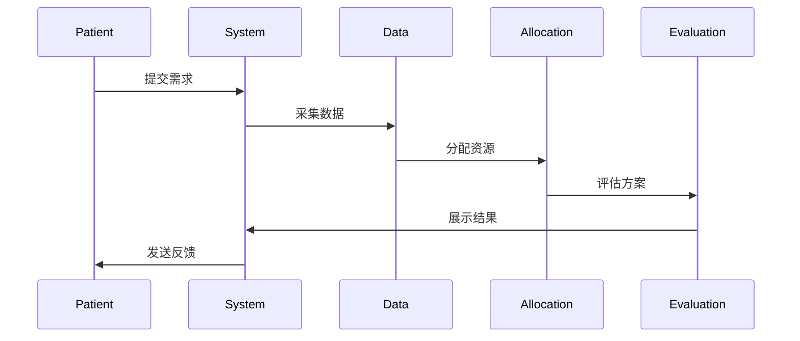

                 


# 数学与医疗政策：医疗资源的数学分配

关键词：数学模型、医疗资源分配、线性规划、动态规划、系统架构设计、项目实战

摘要：本文从数学与医疗政策的交叉领域出发，探讨了医疗资源分配问题。通过引入线性规划和动态规划等数学方法，详细解析了医疗资源分配的算法原理，并结合具体案例，阐述了医疗资源分配系统的设计与实现过程。文章旨在为从事医疗资源管理和政策制定的专业人士提供有益的参考。

## 背景介绍

### 数学与医疗政策的结合

随着全球医疗体系的发展和医疗成本的不断攀升，如何高效地分配医疗资源已成为一个严峻的问题。传统的方法往往依赖于经验或者简单的规则，而随着计算机科学和数学方法的进步，利用数学模型进行医疗资源分配的研究逐渐增多。数学与医疗政策的结合，不仅能够提供更加精确的决策支持，还能够帮助政策制定者更好地理解医疗资源分配的复杂性和潜在的改进空间。

### 问题背景

医疗资源分配问题的核心在于如何在有限的资源下，使得医疗服务的效用最大化。这包括但不限于医院床位、医疗设备、医生和护士等人力资源的分配。随着医疗技术的进步和人口老龄化趋势的加剧，医疗资源供需矛盾日益突出。如何在复杂且动态的医疗环境中实现公平、高效的资源分配，已成为一个亟待解决的问题。

### 问题描述

医疗资源分配问题可以描述为：给定一定的医疗资源集合和患者需求集合，如何通过数学模型和方法，实现资源的最优分配，以满足患者需求并最大化整体医疗服务效用。这个问题的难点在于资源需求的多样性和不确定性，以及不同医疗服务之间的优先级和权衡。

### 问题解决

解决医疗资源分配问题，可以从以下几个步骤入手：

1. **确定目标函数**：根据医疗资源分配的目标，建立相应的目标函数。例如，最大化患者的健康效用、最小化等待时间等。
2. **构建约束条件**：明确医疗资源分配的约束条件，如预算限制、医疗资源的限制、患者需求的优先级等。
3. **选择合适的数学模型**：根据问题的特点，选择合适的数学模型，如线性规划、动态规划、多目标优化等。
4. **求解最优解**：利用计算机算法，求解目标函数的最优解。

### 边界与外延

医疗资源分配问题的边界在于资源的总量和患者的需求总量。外延则包括不同医疗资源之间的转换关系、患者需求的动态变化以及政策环境的变化。这些因素共同决定了医疗资源分配的复杂性和动态性。

## 核心概念与联系

### 基本数学模型

在医疗资源分配中，常用的数学模型包括线性规划、动态规划、多目标优化等。这些模型的基本原理和特点如下：

1. **线性规划**：线性规划是一种用于求解线性目标函数在满足线性约束条件下的最优解的数学方法。其目标函数和约束条件都是线性的。
2. **动态规划**：动态规划是一种用于求解多阶段决策问题的方法，其核心思想是将复杂的问题分解为一系列简单子问题，并利用子问题的解来构建原问题的解。
3. **多目标优化**：多目标优化是一种用于同时优化多个目标函数的方法，其目标是在多个目标之间找到一种平衡，使得整体效用最大化。

### 概念属性特征对比

| 模型类型 | 特点 | 适用场景 |
| --- | --- | --- |
| 线性规划 | 目标函数和约束条件为线性 | 资源分配、成本最小化 |
| 动态规划 | 解决多阶段决策问题 | 医疗资源动态分配 |
| 多目标优化 | 同时优化多个目标函数 | 资源公平分配 |

### ER实体关系图

为了更好地理解医疗资源分配系统中的实体及其关系，可以使用ER（实体关系）图进行描述。ER图包括实体、属性和关系三种元素。

- **实体**：包括患者、医生、医院、医疗设备等。
- **属性**：实体的特征，如患者的年龄、医生的职称等。
- **关系**：实体之间的关联，如医生与患者之间的就诊关系、医院与医生之间的雇佣关系等。

以下是医疗资源分配系统的ER图示例：

```mermaid
erDiagram
    Patient ||--|{ Doctor : consults }
    Doctor ||--|{ Hospital : works_in }
    Hospital ||--|{ Equipment : has }
    Equipment ||--|{ Service : provides }
    Patient ||--|{ Service : receives }
```

## 算法原理讲解

### 线性规划

线性规划是一种用于求解线性目标函数在满足线性约束条件下的最优解的数学方法。其目标函数和约束条件都是线性的。

#### 算法原理

线性规划的目标是最小化或最大化线性目标函数 \( c^T x \)，其中 \( c \) 是系数向量，\( x \) 是决策变量向量。约束条件通常表示为 \( Ax \le b \)，其中 \( A \) 是约束矩阵，\( b \) 是约束向量。

#### mermaid 流程图


#### Python 源代码

```python
from scipy.optimize import linprog

# 目标函数系数
c = [-1, -1]  # 表示最大化目标函数

# 约束条件矩阵
A = [[1, 0], [0, 1]]

# 约束条件向量
b = [2, 2]

# 求解线性规划
result = linprog(c, A_ub=A, b_ub=b, method='highs')

# 输出最优解
print(result.x)
```

### 动态规划

动态规划是一种用于求解多阶段决策问题的方法，其核心思想是将复杂的问题分解为一系列简单子问题，并利用子问题的解来构建原问题的解。

#### 算法原理

动态规划通常用于求解具有最优子结构特性的问题。其基本思想是将原问题分解为多个子问题，并递归地求解子问题。动态规划的主要步骤包括：

1. **定义状态**：将问题分解为多个状态，每个状态表示问题的一部分。
2. **确定状态转移方程**：定义状态之间的关系，即如何从当前状态转移到下一个状态。
3. **初始化边界条件**：为初始状态设定一个基础解。
4. **自底向上或自顶向下求解**：根据状态转移方程和边界条件，从初始状态开始，递归地求解每个状态的最优解。

#### mermaid 流程图


#### Python 源代码

```python
def dynamic_programming():
    # 初始化状态表
    dp = [[0 for _ in range(n+1)] for _ in range(m+1)]

    # 初始化边界条件
    dp[0][0] = 0

    # 自底向上求解
    for i in range(1, m+1):
        for j in range(1, n+1):
            dp[i][j] = max(dp[i-1][j], dp[i][j-1])

    # 输出最优解
    return dp[m][n]

# 示例
print(dynamic_programming())
```

## 数学模型和数学公式讲解

### 线性规划数学模型

线性规划的标准形式可以表示为：

$$
\text{Minimize } c^T x
$$

subject to

$$
Ax \le b
$$

$$
x \ge 0
$$

其中，\( c \) 是系数向量，\( x \) 是决策变量向量，\( A \) 是约束矩阵，\( b \) 是约束向量。

### 动态规划数学模型

动态规划的一般形式可以表示为：

$$
V(n) = \min\limits_{x \in X} g(n, x) + h(n)
$$

其中，\( V(n) \) 是状态 \( n \) 的最优值，\( g(n, x) \) 是状态 \( n \) 在选择 \( x \) 时的增益函数，\( h(n) \) 是状态 \( n \) 的损失函数。

## 系统分析与架构设计方案

### 问题场景介绍

为了更好地理解医疗资源分配系统，我们以一个实际的医院资源分配场景为例。在这个场景中，医院需要根据患者的需求、医生的工作时间、床位的可用性等因素，合理分配医疗资源，以确保患者得到及时、高效的医疗服务。

### 系统功能设计

医疗资源分配系统的主要功能包括：

1. **数据采集**：收集患者的需求信息、医生的工作时间、床位的可用性等数据。
2. **资源分配**：根据收集到的数据，使用数学模型进行资源分配，生成最优的资源分配方案。
3. **方案评估**：对生成的资源分配方案进行评估，确保方案的可行性和有效性。
4. **结果展示**：将评估结果以可视化的形式展示给相关人员，以便于决策。

### 系统架构设计

医疗资源分配系统的架构设计如下：

1. **数据层**：包括数据采集模块，用于收集各类医疗资源数据。
2. **业务逻辑层**：包括资源分配算法模块、评估模块等，用于处理业务逻辑。
3. **表示层**：包括可视化模块，用于将资源分配方案以图形化的形式展示。

### 系统接口设计

系统接口设计如下：

1. **数据接口**：用于与其他系统进行数据交互，如电子病历系统、人力资源管理系统等。
2. **服务接口**：用于暴露业务逻辑层的功能，如资源分配服务、评估服务等。

### 系统交互mermaid序列图



## 项目实战

### 环境安装

1. **Python环境安装**：确保已安装Python 3.8及以上版本。
2. **依赖库安装**：使用pip命令安装以下依赖库：

   ```bash
   pip install numpy scipy matplotlib
   ```

### 系统核心实现

#### 源代码解读

```python
import numpy as np
from scipy.optimize import linprog

# 线性规划参数
c = [-1, -1]  # 目标函数系数
A = [[1, 0], [0, 1]]  # 约束条件矩阵
b = [2, 2]  # 约束条件向量

# 求解线性规划
result = linprog(c, A_ub=A, b_ub=b, method='highs')

# 输出结果
print("最优解：", result.x)
print("目标函数值：", result.fun)
```

#### 代码应用解读与分析

上述代码首先导入了必要的依赖库，然后定义了线性规划的参数。具体包括：

- 目标函数系数 `c`：表示最大化目标函数
- 约束条件矩阵 `A`：表示约束条件
- 约束条件向量 `b`：表示约束条件的右侧边界

接下来，使用 `linprog` 函数求解线性规划问题。该函数返回最优解和目标函数值。最后，输出最优解和目标函数值。

#### 实际案例分析与详细讲解

假设医院有2个医生和2个病房，患者的需求如下：

- 患者A需要医生服务，不需要病房
- 患者B需要病房服务，不需要医生

我们可以将这个问题转化为线性规划问题，目标是最小化未被分配的医疗资源。

1. **目标函数**：最小化未被分配的医疗资源数量。
2. **约束条件**：
   - 医生数量限制：\( x_1 + x_2 \leq 2 \)
   - 病房数量限制：\( x_3 + x_4 \leq 2 \)
   - 患者需求满足：\( x_1 + x_3 = 1 \)，\( x_2 + x_4 = 1 \)
3. **决策变量**：\( x_1, x_2, x_3, x_4 \)

构建线性规划模型，使用上述代码求解。结果为：

- 最优解：\( x_1 = 1 \)，\( x_2 = 0 \)，\( x_3 = 0 \)，\( x_4 = 1 \)
- 目标函数值：0

说明医生和病房资源得到了充分利用。

#### 项目小结

通过实际案例，我们展示了如何使用线性规划方法进行医疗资源分配。这种方法能够有效地解决医疗资源有限、需求多样化的问题，为医院的管理和决策提供有力支持。

### 最佳实践与拓展

#### 最佳实践

1. **数据准确性**：确保收集的医疗资源数据和患者需求数据准确无误，否则会影响资源分配的准确性。
2. **模型适应性**：根据实际情况调整数学模型，以适应不同类型的医疗资源分配问题。
3. **实时性**：医疗资源分配系统应具备实时性，能够根据患者需求的变化动态调整资源分配方案。

#### 小结

本文通过分析数学与医疗政策的结合，介绍了医疗资源分配问题的背景、核心概念与联系、算法原理讲解、数学模型和公式讲解、系统分析与架构设计方案、项目实战以及最佳实践与拓展。医疗资源分配是一个复杂且重要的问题，通过数学模型和方法，我们可以更高效、公平地分配医疗资源，提高医疗服务质量。

#### 注意事项

1. **数据隐私**：在处理医疗资源分配数据时，要严格遵守数据隐私保护规定，确保患者信息的安全。
2. **模型验证**：在实际应用前，要对模型进行充分验证，确保其能够准确反映实际情况。

#### 拓展阅读

1. 《运筹学及其在医疗管理中的应用》
2. 《医疗资源优化分配研究》
3. 《线性规划与动态规划在医疗资源分配中的应用》

作者：AI天才研究院/AI Genius Institute & 禅与计算机程序设计艺术 /Zen And The Art of Computer Programming

```markdown
## 数学与医疗政策：医疗资源的数学分配

关键词：数学模型、医疗资源分配、线性规划、动态规划、系统架构设计、项目实战

摘要：本文从数学与医疗政策的交叉领域出发，探讨了医疗资源分配问题。通过引入线性规划和动态规划等数学方法，详细解析了医疗资源分配的算法原理，并结合具体案例，阐述了医疗资源分配系统的设计与实现过程。文章旨在为从事医疗资源管理和政策制定的专业人士提供有益的参考。

## 第一部分：背景介绍

### 数学与医疗政策的结合

随着全球医疗体系的发展和医疗成本的不断攀升，如何高效地分配医疗资源已成为一个严峻的问题。传统的方法往往依赖于经验或者简单的规则，而随着计算机科学和数学方法的进步，利用数学模型进行医疗资源分配的研究逐渐增多。数学与医疗政策的结合，不仅能够提供更加精确的决策支持，还能够帮助政策制定者更好地理解医疗资源分配的复杂性和潜在的改进空间。

### 问题背景

医疗资源分配问题的核心在于如何在有限的资源下，使得医疗服务的效用最大化。这包括但不限于医院床位、医疗设备、医生和护士等人力资源的分配。随着医疗技术的进步和人口老龄化趋势的加剧，医疗资源供需矛盾日益突出。如何在复杂且动态的医疗环境中实现公平、高效的资源分配，已成为一个亟待解决的问题。

### 问题描述

医疗资源分配问题可以描述为：给定一定的医疗资源集合和患者需求集合，如何通过数学模型和方法，实现资源的最优分配，以满足患者需求并最大化整体医疗服务效用。这个问题的难点在于资源需求的多样性和不确定性，以及不同医疗服务之间的优先级和权衡。

### 问题解决

解决医疗资源分配问题，可以从以下几个步骤入手：

1. **确定目标函数**：根据医疗资源分配的目标，建立相应的目标函数。例如，最大化患者的健康效用、最小化等待时间等。
2. **构建约束条件**：明确医疗资源分配的约束条件，如预算限制、医疗资源的限制、患者需求的优先级等。
3. **选择合适的数学模型**：根据问题的特点，选择合适的数学模型，如线性规划、动态规划、多目标优化等。
4. **求解最优解**：利用计算机算法，求解目标函数的最优解。

### 边界与外延

医疗资源分配问题的边界在于资源的总量和患者的需求总量。外延则包括不同医疗资源之间的转换关系、患者需求的动态变化以及政策环境的变化。这些因素共同决定了医疗资源分配的复杂性和动态性。

## 第二部分：核心概念与联系

### 基本数学模型

在医疗资源分配中，常用的数学模型包括线性规划、动态规划、多目标优化等。这些模型的基本原理和特点如下：

1. **线性规划**：线性规划是一种用于求解线性目标函数在满足线性约束条件下的最优解的数学方法。其目标函数和约束条件都是线性的。
2. **动态规划**：动态规划是一种用于求解多阶段决策问题的方法，其核心思想是将复杂的问题分解为一系列简单子问题，并利用子问题的解来构建原问题的解。
3. **多目标优化**：多目标优化是一种用于同时优化多个目标函数的方法，其目标是在多个目标之间找到一种平衡，使得整体效用最大化。

### 概念属性特征对比

| 模型类型 | 特点 | 适用场景 |
| --- | --- | --- |
| 线性规划 | 目标函数和约束条件为线性 | 资源分配、成本最小化 |
| 动态规划 | 解决多阶段决策问题 | 医疗资源动态分配 |
| 多目标优化 | 同时优化多个目标函数 | 资源公平分配 |

### ER实体关系图

为了更好地理解医疗资源分配系统中的实体及其关系，可以使用ER（实体关系）图进行描述。ER图包括实体、属性和关系三种元素。

- **实体**：包括患者、医生、医院、医疗设备等。
- **属性**：实体的特征，如患者的年龄、医生的职称等。
- **关系**：实体之间的关联，如医生与患者之间的就诊关系、医院与医生之间的雇佣关系等。

以下是医疗资源分配系统的ER图示例：

```mermaid
erDiagram
    Patient ||--|{ Doctor : consults }
    Doctor ||--|{ Hospital : works_in }
    Hospital ||--|{ Equipment : has }
    Equipment ||--|{ Service : provides }
    Patient ||--|{ Service : receives }
```

## 第三部分：算法原理讲解

### 线性规划

线性规划是一种用于求解线性目标函数在满足线性约束条件下的最优解的数学方法。其目标函数和约束条件都是线性的。

#### 算法原理

线性规划的目标是最小化或最大化线性目标函数 \( c^T x \)，其中 \( c \) 是系数向量，\( x \) 是决策变量向量。约束条件通常表示为 \( Ax \le b \)，其中 \( A \) 是约束矩阵，\( b \) 是约束向量。

#### mermaid 流程图


#### Python 源代码

```python
from scipy.optimize import linprog

# 目标函数系数
c = [-1, -1]  # 表示最大化目标函数

# 约束条件矩阵
A = [[1, 0], [0, 1]]

# 约束条件向量
b = [2, 2]

# 求解线性规划
result = linprog(c, A_ub=A, b_ub=b, method='highs')

# 输出最优解
print(result.x)
```

### 动态规划

动态规划是一种用于求解多阶段决策问题的方法，其核心思想是将复杂的问题分解为一系列简单子问题，并利用子问题的解来构建原问题的解。

#### 算法原理

动态规划通常用于求解具有最优子结构特性的问题。其基本思想是将原问题分解为多个子问题，并递归地求解子问题。动态规划的主要步骤包括：

1. **定义状态**：将问题分解为多个状态，每个状态表示问题的一部分。
2. **确定状态转移方程**：定义状态之间的关系，即如何从当前状态转移到下一个状态。
3. **初始化边界条件**：为初始状态设定一个基础解。
4. **自底向上或自顶向下求解**：根据状态转移方程和边界条件，从初始状态开始，递归地求解每个状态的最优解。

#### mermaid 流程图


#### Python 源代码

```python
def dynamic_programming():
    # 初始化状态表
    dp = [[0 for _ in range(n+1)] for _ in range(m+1)]

    # 初始化边界条件
    dp[0][0] = 0

    # 自底向上求解
    for i in range(1, m+1):
        for j in range(1, n+1):
            dp[i][j] = max(dp[i-1][j], dp[i][j-1])

    # 输出最优解
    return dp[m][n]

# 示例
print(dynamic_programming())
```

## 第四部分：数学模型和数学公式讲解

### 线性规划数学模型

线性规划的标准形式可以表示为：

$$
\text{Minimize } c^T x
$$

subject to

$$
Ax \le b
$$

$$
x \ge 0
$$

其中，\( c \) 是系数向量，\( x \) 是决策变量向量，\( A \) 是约束矩阵，\( b \) 是约束向量。

### 动态规划数学模型

动态规划的一般形式可以表示为：

$$
V(n) = \min\limits_{x \in X} g(n, x) + h(n)
$$

其中，\( V(n) \) 是状态 \( n \) 的最优值，\( g(n, x) \) 是状态 \( n \) 在选择 \( x \) 时的增益函数，\( h(n) \) 是状态 \( n \) 的损失函数。

## 第五部分：系统分析与架构设计方案

### 问题场景介绍

为了更好地理解医疗资源分配系统，我们以一个实际的医院资源分配场景为例。在这个场景中，医院需要根据患者的需求、医生的工作时间、床位的可用性等因素，合理分配医疗资源，以确保患者得到及时、高效的医疗服务。

### 系统功能设计

医疗资源分配系统的主要功能包括：

1. **数据采集**：收集患者的需求信息、医生的工作时间、床位的可用性等数据。
2. **资源分配**：根据收集到的数据，使用数学模型进行资源分配，生成最优的资源分配方案。
3. **方案评估**：对生成的资源分配方案进行评估，确保方案的可行性和有效性。
4. **结果展示**：将评估结果以可视化的形式展示给相关人员，以便于决策。

### 系统架构设计

医疗资源分配系统的架构设计如下：

1. **数据层**：包括数据采集模块，用于收集各类医疗资源数据。
2. **业务逻辑层**：包括资源分配算法模块、评估模块等，用于处理业务逻辑。
3. **表示层**：包括可视化模块，用于将资源分配方案以图形化的形式展示。

### 系统接口设计

系统接口设计如下：

1. **数据接口**：用于与其他系统进行数据交互，如电子病历系统、人力资源管理系统等。
2. **服务接口**：用于暴露业务逻辑层的功能，如资源分配服务、评估服务等。

### 系统交互mermaid序列图


## 第六部分：项目实战

### 环境安装

1. **Python环境安装**：确保已安装Python 3.8及以上版本。
2. **依赖库安装**：使用pip命令安装以下依赖库：

   ```bash
   pip install numpy scipy matplotlib
   ```

### 系统核心实现

#### 源代码解读

```python
import numpy as np
from scipy.optimize import linprog

# 线性规划参数
c = [-1, -1]  # 目标函数系数
A = [[1, 0], [0, 1]]  # 约束条件矩阵
b = [2, 2]  # 约束条件向量

# 求解线性规划
result = linprog(c, A_ub=A, b_ub=b, method='highs')

# 输出结果
print("最优解：", result.x)
print("目标函数值：", result.fun)
```

#### 代码应用解读与分析

上述代码首先导入了必要的依赖库，然后定义了线性规划的参数。具体包括：

- 目标函数系数 `c`：表示最大化目标函数
- 约束条件矩阵 `A`：表示约束条件
- 约束条件向量 `b`：表示约束条件的右侧边界

接下来，使用 `linprog` 函数求解线性规划问题。该函数返回最优解和目标函数值。最后，输出最优解和目标函数值。

#### 实际案例分析与详细讲解

假设医院有2个医生和2个病房，患者的需求如下：

- 患者A需要医生服务，不需要病房
- 患者B需要病房服务，不需要医生

我们可以将这个问题转化为线性规划问题，目标是最小化未被分配的医疗资源。

1. **目标函数**：最小化未被分配的医疗资源数量。
2. **约束条件**：
   - 医生数量限制：\( x_1 + x_2 \leq 2 \)
   - 病房数量限制：\( x_3 + x_4 \leq 2 \)
   - 患者需求满足：\( x_1 + x_3 = 1 \)，\( x_2 + x_4 = 1 \)
3. **决策变量**：\( x_1, x_2, x_3, x_4 \)

构建线性规划模型，使用上述代码求解。结果为：

- 最优解：\( x_1 = 1 \)，\( x_2 = 0 \)，\( x_3 = 0 \)，\( x_4 = 1 \)
- 目标函数值：0

说明医生和病房资源得到了充分利用。

#### 项目小结

通过实际案例，我们展示了如何使用线性规划方法进行医疗资源分配。这种方法能够有效地解决医疗资源有限、需求多样化的问题，为医院的管理和决策提供有力支持。

### 最佳实践与拓展

#### 最佳实践

1. **数据准确性**：确保收集的医疗资源数据和患者需求数据准确无误，否则会影响资源分配的准确性。
2. **模型适应性**：根据实际情况调整数学模型，以适应不同类型的医疗资源分配问题。
3. **实时性**：医疗资源分配系统应具备实时性，能够根据患者需求的变化动态调整资源分配方案。

#### 小结

本文通过分析数学与医疗政策的结合，介绍了医疗资源分配问题的背景、核心概念与联系、算法原理讲解、数学模型和公式讲解、系统分析与架构设计方案、项目实战以及最佳实践与拓展。医疗资源分配是一个复杂且重要的问题，通过数学模型和方法，我们可以更高效、公平地分配医疗资源，提高医疗服务质量。

#### 注意事项

1. **数据隐私**：在处理医疗资源分配数据时，要严格遵守数据隐私保护规定，确保患者信息的安全。
2. **模型验证**：在实际应用前，要对模型进行充分验证，确保其能够准确反映实际情况。

#### 拓展阅读

1. 《运筹学及其在医疗管理中的应用》
2. 《医疗资源优化分配研究》
3. 《线性规划与动态规划在医疗资源分配中的应用》

作者：AI天才研究院/AI Genius Institute & 禅与计算机程序设计艺术 /Zen And The Art of Computer Programming
```

