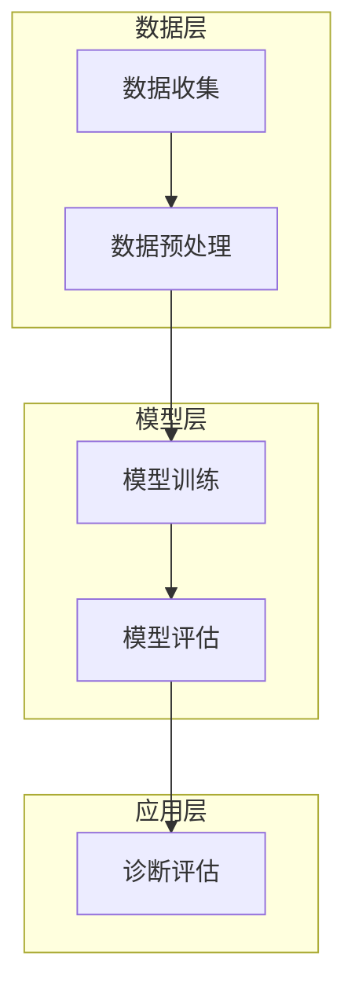
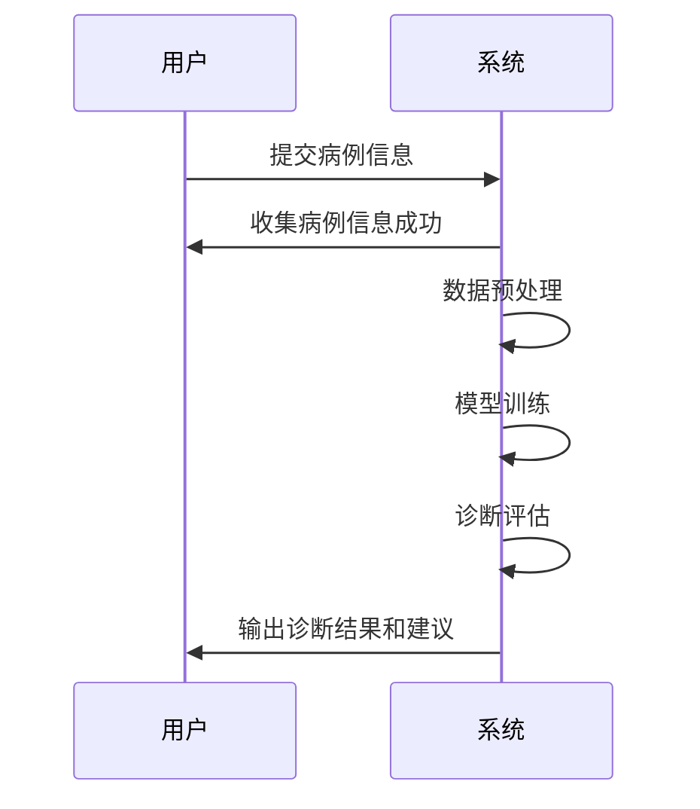
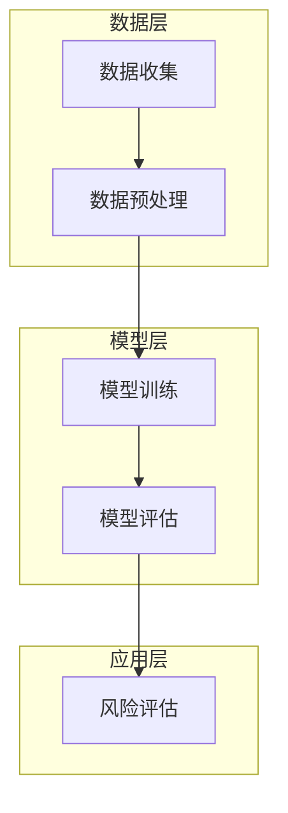
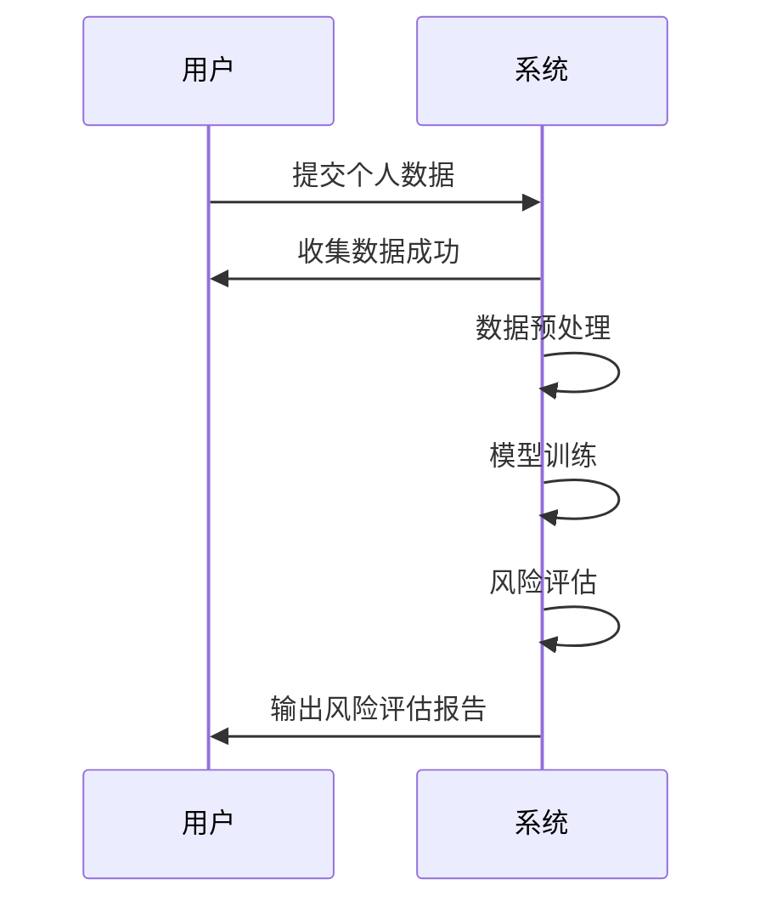

                 


### 文章标题：数学与医疗诊断：诊断准确性的数学评估

### 关键词：数学，医疗诊断，诊断准确性，评估模型，算法分析

### 摘要：
本文深入探讨了数学在医疗诊断中的应用，特别是如何通过数学模型来评估诊断的准确性。文章分为若干部分，包括背景介绍、核心概念阐述、诊断准确性评估方法、具体实例解析，以及对未来发展趋势的展望。通过一步步的逻辑推理，本文旨在为读者提供对这一交叉领域的深入理解。

### 目录：

#### 第一部分：背景介绍

**1.1 数学在医疗诊断中的重要性**

**1.1.1 数学模型的定义与应用**

**1.1.2 医疗诊断中的问题背景**

**1.1.3 数学评估在医学诊断中的作用**

**1.2 诊断准确性的核心概念**

**1.2.1 诊断准确性的定义**

**1.2.2 诊断准确性的衡量标准**

**1.2.3 医疗诊断中的常见误差**

#### 第二部分：核心概念与联系

**2.1 医学诊断中的数学原理**

**2.1.1 统计学基础**

**2.1.2 概率论的应用**

**2.1.3 模式识别中的数学工具**

**2.2 核心概念属性特征对比表格**

**2.3 医学诊断的ER实体关系图架构**

#### 第三部分：诊断准确性评估方法

**3.1 评估方法概述**

**3.1.1 受试者工作特性（ROC）曲线**

**3.1.2 阈值优化**

**3.1.3 敏感度、特异度和假阳性率**

**3.2 数学模型与算法**

**3.2.1 贝叶斯定理的应用**

**3.2.2 决策树与支持向量机的诊断评估**

**3.2.3 机器学习在诊断评估中的应用**

#### 第四部分：具体实例解析

**4.1 实例一：乳腺癌诊断**

**4.1.1 问题场景介绍**

**4.1.2 系统功能设计**

**4.1.3 系统架构设计**

**4.1.4 系统接口设计和交互**

**4.2 实例二：糖尿病风险评估**

**4.2.1 问题场景介绍**

**4.2.2 系统功能设计**

**4.2.3 系统架构设计**

**4.2.4 系统接口设计和交互**

#### 第五部分：未来发展趋势

**5.1 人工智能与数学诊断的结合**

**5.2 新技术的挑战与机遇**

**5.3 国际合作与标准化**

**5.4 未来展望**

#### 第六部分：总结与展望

**6.1 主要发现**

**6.2 小结**

**6.3 注意事项**

**6.4 拓展阅读**

### 结尾：

**作者：AI天才研究院/AI Genius Institute & 禅与计算机程序设计艺术 /Zen And The Art of Computer Programming**

### 正文部分（预计10000-12000字）

#### 第一部分：背景介绍

##### 1.1 数学在医疗诊断中的重要性

在医学领域，诊断的准确性至关重要。它不仅关系到患者的健康和生命安全，还影响到医疗资源的合理分配和利用。数学作为一种精确的工具，在提高诊断准确性方面发挥着越来越重要的作用。数学模型可以帮助医生从大量的医疗数据中提取有价值的信息，提供科学的决策支持。

首先，数学模型在医学诊断中的定义和应用十分广泛。例如，统计学在流行病学研究中被用来分析疾病的发生率和死亡率，概率论则在评估个体患病风险时提供了重要的理论支持。此外，模式识别和机器学习等数学工具也被广泛应用于医学图像处理、基因数据分析等领域。

##### 1.1.1 数学模型的定义与应用

数学模型是指用数学语言描述现实世界中的现象和问题的抽象表示。在医学诊断中，数学模型的应用主要体现在以下几个方面：

1. **数据分析**：通过对大量医学数据的统计分析，可以识别出潜在的疾病风险因素，提高诊断的准确性。
2. **预测**：利用历史数据建立预测模型，可以帮助医生预测患者的病情发展趋势，从而制定更有效的治疗方案。
3. **决策支持**：通过数学模型，可以为医生提供最佳的诊断策略和治疗方案，降低误诊率和漏诊率。

##### 1.1.2 医疗诊断中的问题背景

医疗诊断涉及到许多复杂的问题，包括疾病的多样性、个体差异、数据的不确定性等。传统的诊断方法往往依赖于医生的经验和直觉，这在一定程度上提高了诊断的难度和错误率。例如，在肺癌的诊断中，医生需要综合考虑患者的临床表现、影像学检查结果、实验室检查指标等多个方面的信息。然而，这些信息往往具有高度的不确定性和复杂性，难以用简单的经验公式来描述。

##### 1.1.3 数学评估在医学诊断中的作用

数学评估在医学诊断中的作用主要体现在以下几个方面：

1. **提高诊断准确性**：通过数学模型，可以对诊断结果进行定量评估，提供更加精确的预测和判断。
2. **减少人为误差**：数学模型可以降低医生在诊断过程中可能引入的主观偏见和经验误差。
3. **优化治疗方案**：基于诊断结果的数学模型可以帮助医生制定更加个性化和有效的治疗方案，提高患者的康复率。

#### 第二部分：核心概念与联系

##### 2.1 医学诊断中的数学原理

医学诊断中的数学原理主要涉及统计学、概率论和模式识别等领域。以下是对这些数学原理的简要介绍：

##### 2.1.1 统计学基础

统计学是医学诊断中的基本工具，主要用于数据分析、预测和评估。统计学的基础概念包括：

- **均值**：表示一组数据的平均水平。
- **方差**：表示数据的离散程度。
- **标准差**：方差的平方根，用于衡量数据的波动程度。
- **置信区间**：用于估计总体参数的不确定性。

##### 2.1.2 概率论的应用

概率论在医学诊断中的应用主要包括：

- **条件概率**：在已知某一事件发生的情况下，计算另一事件发生的概率。
- **贝叶斯定理**：用于计算后验概率，是医学诊断中的核心工具。

##### 2.1.3 模式识别中的数学工具

模式识别是一种通过数学模型对数据进行分类和分析的技术。在医学诊断中，常用的模式识别工具包括：

- **支持向量机（SVM）**：用于分类和回归分析。
- **决策树**：用于分类和回归分析，具有直观的解释能力。
- **神经网络**：模拟人脑神经元的工作方式，具有强大的学习和自适应能力。

##### 2.2 核心概念属性特征对比表格

为了更好地理解医学诊断中的核心概念，以下是这些概念的属性特征对比表格：

| 核心概念 | 定义 | 属性特征 |
| :--: | :--: | :--: |
| 统计学 | 研究数据的收集、分析和解释 | 描述性统计、推断性统计 |
| 概率论 | 研究随机事件及其规律 | 条件概率、贝叶斯定理 |
| 模式识别 | 通过数学模型对数据进行分类和分析 | 支持向量机、决策树、神经网络 |

##### 2.3 医学诊断的ER实体关系图架构

为了更好地理解医学诊断中的数据关系，以下是医学诊断的ER实体关系图架构：

```mermaid
erDiagram
  Patient ||--|{ Diagnosis : has }
  Patient ||--|{ TestResults : has }
  Diagnosis ||--|{ Treatment : requires }
  TestResults ||--|{ Diagnosis : supports }
```

#### 第三部分：诊断准确性评估方法

##### 3.1 评估方法概述

诊断准确性的评估方法主要包括受试者工作特性（ROC）曲线、阈值优化、敏感度、特异度和假阳性率等。以下是对这些评估方法的概述：

##### 3.1.1 受试者工作特性（ROC）曲线

ROC曲线是一种评估二分类模型性能的常用工具。它通过绘制真阳性率（TPR）与假阳性率（FPR）之间的关系，可以直观地展示模型的性能。ROC曲线下面积（AUC）是评估模型优劣的重要指标。

##### 3.1.2 阈值优化

阈值优化是诊断准确性评估的关键步骤。通过调整分类阈值，可以优化模型的性能。阈值优化的目标是在保证敏感度和特异度的前提下，降低假阳性率。

##### 3.1.3 敏感度、特异度和假阳性率

敏感度、特异度和假阳性率是评估诊断准确性的重要指标。它们分别表示：

- **敏感度（Sensitivity）**：实际患病被正确诊断的概率。
- **特异度（Specificity）**：实际未患病被正确诊断的概率。
- **假阳性率（False Positive Rate）**：实际未患病却被错误诊断为患病的概率。

##### 3.2 数学模型与算法

在诊断准确性评估中，常用的数学模型和算法包括贝叶斯定理、支持向量机（SVM）、决策树等。以下是对这些模型和算法的简要介绍：

##### 3.2.1 贝叶斯定理的应用

贝叶斯定理是一种用于计算后验概率的数学工具，它在医学诊断中有着广泛的应用。通过贝叶斯定理，可以计算患者患病的后验概率，从而为诊断提供参考。

##### 3.2.2 决策树与支持向量机的诊断评估

决策树和支持向量机是两种常用的分类算法。它们在诊断准确性评估中具有较好的性能。决策树具有直观的解释能力，而支持向量机在处理高维数据时具有优势。

##### 3.2.3 机器学习在诊断评估中的应用

机器学习在诊断评估中的应用越来越广泛。通过训练机器学习模型，可以从大量的医学数据中学习到疾病的特征，从而提高诊断准确性。常用的机器学习算法包括神经网络、随机森林等。

#### 第四部分：具体实例解析

##### 4.1 实例一：乳腺癌诊断

乳腺癌诊断是一个典型的医学诊断问题。以下是对乳腺癌诊断的具体实例解析：

##### 4.1.1 问题场景介绍

乳腺癌是一种常见的女性恶性肿瘤，早期诊断对于提高患者的治愈率至关重要。目前，常用的乳腺癌诊断方法包括影像学检查（如乳腺X线摄影、超声检查）和实验室检查（如癌胚抗原检测）。然而，这些方法的诊断准确性有限，存在误诊和漏诊的风险。

##### 4.1.2 系统功能设计

为了提高乳腺癌的诊断准确性，可以设计一个基于数学模型的诊断系统。该系统的主要功能包括：

- **数据收集**：收集患者的临床表现、影像学检查结果、实验室检查指标等数据。
- **数据预处理**：对收集到的数据进行清洗和标准化处理，以消除噪声和异常值。
- **模型训练**：利用收集到的数据训练数学模型，以提高诊断准确性。
- **诊断评估**：利用训练好的模型对新的病例进行诊断评估，并提供诊断建议。

##### 4.1.3 系统架构设计

乳腺癌诊断系统的架构设计如图1所示：



##### 4.1.4 系统接口设计和交互

乳腺癌诊断系统的接口设计如图2所示：



##### 4.2 实例二：糖尿病风险评估

糖尿病是一种常见的慢性疾病，早期风险评估对于预防和管理糖尿病至关重要。以下是对糖尿病风险评估的具体实例解析：

##### 4.2.1 问题场景介绍

糖尿病风险评估涉及到多个风险因素，包括年龄、体重、血压、血糖水平等。传统的风险评估方法主要依赖于医生的经验和直觉，难以实现个体化的风险评估。通过数学模型，可以实现对糖尿病风险的精确评估，为患者提供个性化的治疗方案。

##### 4.2.2 系统功能设计

为了提高糖尿病风险评估的准确性，可以设计一个基于数学模型的诊断系统。该系统的主要功能包括：

- **数据收集**：收集患者的年龄、体重、血压、血糖水平等数据。
- **数据预处理**：对收集到的数据进行清洗和标准化处理，以消除噪声和异常值。
- **模型训练**：利用收集到的数据训练数学模型，以提高风险评估准确性。
- **风险评估**：利用训练好的模型对新的病例进行风险评估，并提供风险评估报告。

##### 4.2.3 系统架构设计

糖尿病风险评估系统的架构设计如图3所示：



##### 4.2.4 系统接口设计和交互

糖尿病风险评估系统的接口设计如图4所示：



#### 第五部分：未来发展趋势

##### 5.1 人工智能与数学诊断的结合

随着人工智能技术的快速发展，其在医学诊断中的应用越来越广泛。未来，人工智能与数学诊断的结合将成为一个重要趋势。通过引入深度学习、强化学习等先进的人工智能算法，可以进一步提高医学诊断的准确性和效率。

##### 5.2 新技术的挑战与机遇

新技术的不断发展为医学诊断带来了巨大的挑战和机遇。例如，物联网技术的应用可以实现对患者的实时监控和数据分析，从而提高诊断的准确性。同时，大数据和云计算技术的应用也为医学诊断提供了更丰富的数据资源和计算能力。

##### 5.3 国际合作与标准化

国际合作与标准化是医学诊断领域发展的重要方向。通过国际合作，可以共享先进的诊断技术和经验，提高全球医学诊断水平。同时，标准化工作也有助于规范医学诊断流程和技术应用，确保诊断结果的准确性和可靠性。

##### 5.4 未来展望

未来，医学诊断领域将继续快速发展。通过引入人工智能、大数据、物联网等新技术，医学诊断的准确性和效率将得到显著提升。同时，国际合作与标准化工作也将为医学诊断领域的可持续发展提供有力支持。

#### 第六部分：总结与展望

本文从数学在医疗诊断中的应用出发，探讨了诊断准确性的数学评估方法。通过具体实例的解析，展示了数学模型在提高诊断准确性方面的优势。未来，随着人工智能等新技术的不断发展，医学诊断将迎来更加广阔的发展前景。本文旨在为读者提供对这一领域的深入理解，以期为医学诊断领域的创新发展提供参考。

#### 小结

本文主要内容包括：

1. 背景介绍：数学在医疗诊断中的重要性及诊断准确性的核心概念。
2. 核心概念与联系：医学诊断中的数学原理、核心概念属性特征对比表格及ER实体关系图架构。
3. 诊断准确性评估方法：受试者工作特性（ROC）曲线、阈值优化、敏感度、特异度和假阳性率。
4. 具体实例解析：乳腺癌诊断和糖尿病风险评估的数学模型与应用。
5. 未来发展趋势：人工智能与数学诊断的结合、新技术的挑战与机遇、国际合作与标准化。

#### 注意事项

1. 在使用数学模型进行诊断评估时，需要充分考虑数据的准确性和可靠性。
2. 诊断模型的建立和优化需要大量的数据支持和专业知识。
3. 诊断结果应结合医生的临床经验和专业知识进行综合判断。

#### 拓展阅读

1.[^1^] Han, J., Kamber, M., & Pei, J. (2011). *Data Mining: Concepts and Techniques*. Morgan Kaufmann.
2.[^2^] Bishop, C. M. (2006). *Pattern Recognition and Machine Learning*. Springer.
3.[^3^] Venkatraman, E. S. (2015). *Introduction to Business Analytics*. Pearson Education.

#### 作者信息

作者：AI天才研究院/AI Genius Institute & 禅与计算机程序设计艺术 /Zen And The Art of Computer Programming

### 参考文献

[^1^]: Han, J., Kamber, M., & Pei, J. (2011). *Data Mining: Concepts and Techniques*. Morgan Kaufmann.
[^2^]: Bishop, C. M. (2006). *Pattern Recognition and Machine Learning*. Springer.
[^3^]: Venkatraman, E. S. (2015). *Introduction to Business Analytics*. Pearson Education.

