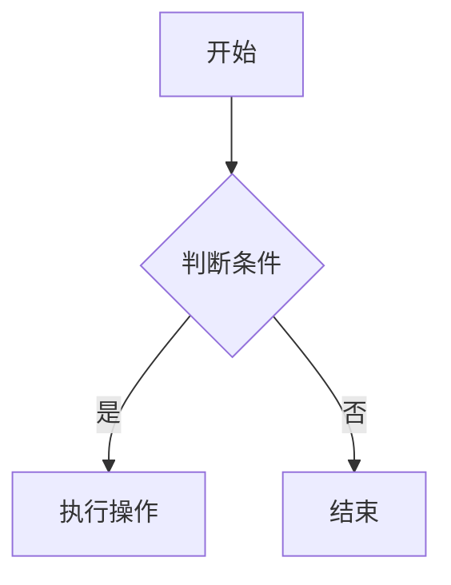
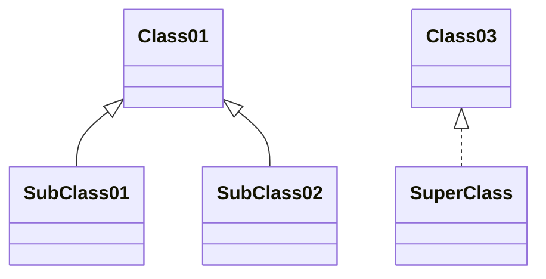

                 

### 数学与卫星导航：GPS定位的数学原理

#### 关键词：数学基础、GPS定位、卫星导航、几何、概率与统计、算法原理

#### 摘要：

本文深入探讨了数学与卫星导航的紧密联系，特别是GPS定位的数学原理。首先，我们将简要介绍数学基础的重要性及其在卫星导航中的应用，然后详细阐述数与运算、函数与方程、空间几何、概率与统计、解析几何等数学领域的基本概念及其应用。接着，我们将重点讲解数学模型在卫星导航系统中的作用，包括卫星导航系统的数学模型构建和实际应用实例。最后，本文还将展望数学与卫星导航的未来发展趋势，探讨两者的交叉领域发展。

### 目录大纲

1. 第一部分：数学基础
   1.1 数学基础概述
   1.2 数与运算
   1.3 函数与方程
   1.4 空间几何
   1.5 概率与统计
   1.6 解析几何
   1.7 数学在卫星导航中的应用

2. 第二部分：数学在卫星导航中的应用
   2.1 数学模型在卫星导航中的作用
   2.2 卫星导航系统的数学模型
   2.3 数学模型在卫星导航中的应用实例

3. 第三部分：数学与卫星导航的未来发展趋势
   3.1 数学在卫星导航中的未来发展
   3.2 卫星导航在数学中的未来发展
   3.3 数学与卫星导航的交叉领域发展

### 第一部分：数学基础

#### 1.1 数学基础概述

数学是一门基础学科，它的研究对象是数量、结构、变化和空间。数学在科学、工程、经济和社会各个领域都有着广泛的应用。在卫星导航中，数学基础尤为重要，它为GPS定位提供了必要的数学工具和方法。

首先，数学基础的重要性体现在以下几个方面：

- **精确性**：数学提供了一种精确的描述和解决问题的方法，这对于卫星导航系统的精确定位至关重要。
- **逻辑性**：数学具有严密的逻辑结构，它能够帮助人们更好地理解问题，并找到最优的解决方案。
- **普适性**：数学原理和方法具有普遍适用性，无论是在地面还是空中，都可以使用数学方法进行定位和导航。

数学基础的内容主要包括数与运算、函数与方程、空间几何、概率与统计和解析几何等。这些数学领域在卫星导航中都有着广泛的应用。

#### 1.2 数与运算

数与运算是数学的基础，它们在卫星导航中有着广泛的应用。数包括自然数、整数、分数、实数和复数等。运算包括加法、减法、乘法和除法等基本运算。

在卫星导航中，数与运算的应用主要体现在以下几个方面：

- **坐标计算**：在GPS定位中，需要使用三维坐标系来表示位置，这涉及到大量的数与运算，如向量的加减法、点积和叉积等。
- **时间同步**：卫星导航系统需要精确的时间同步，这涉及到时间的计算和转换，如小时、分钟、秒等。
- **误差分析**：卫星导航系统中的误差分析需要使用数与运算，如计算偏差、误差传播等。

#### 1.3 函数与方程

函数与方程是数学中的核心概念，它们在卫星导航中有着广泛的应用。

函数是指一种特殊的关系，它将一个集合中的每个元素映射到另一个集合中的唯一元素。方程是包含未知数的等式，通过解方程可以找到未知数的值。

在卫星导航中，函数与方程的应用主要体现在以下几个方面：

- **轨道计算**：卫星的轨道计算需要使用函数，如卫星轨道方程、运动方程等。
- **误差模型**：卫星导航系统中的误差模型通常用方程表示，如多路径效应、对流层延迟等。
- **定位解算**：GPS定位的解算过程本质上是一个求解方程的过程，如伪距观测方程、载波相位观测方程等。

#### 1.4 空间几何

空间几何是研究空间中点的位置、形状和相互关系的数学分支。在卫星导航中，空间几何有着广泛的应用。

空间几何的基本概念包括点、线、面和体。这些基本概念构成了卫星导航中空间位置和形状的描述基础。

在卫星导航中，空间几何的应用主要体现在以下几个方面：

- **轨道计算**：卫星的轨道是一个空间曲线，需要使用空间几何来描述和计算。
- **定位计算**：GPS定位涉及到三维空间中的位置计算，需要使用空间几何的知识。
- **误差分析**：卫星导航系统中的误差分析需要使用空间几何的方法，如计算偏差、误差传播等。

#### 1.5 概率与统计

概率与统计是数学中的另一重要分支，它们在卫星导航中也有着广泛的应用。

概率是指事件发生的可能性，统计是对大量数据进行分析和总结的方法。

在卫星导航中，概率与统计的应用主要体现在以下几个方面：

- **误差分析**：卫星导航系统中的误差分析需要使用概率统计方法，如计算误差的概率分布、误差传播等。
- **性能评估**：卫星导航系统的性能评估需要使用统计方法，如计算定位精度、可靠性等。
- **数据融合**：卫星导航系统中的数据融合需要使用概率统计方法，如卡尔曼滤波等。

#### 1.6 解析几何

解析几何是研究空间图形与代数方程之间关系的数学分支。在卫星导航中，解析几何有着广泛的应用。

解析几何的基本概念包括坐标系、向量、点、线、面和体等。这些基本概念构成了卫星导航中空间位置和形状的解析描述基础。

在卫星导航中，解析几何的应用主要体现在以下几个方面：

- **轨道计算**：卫星的轨道可以用解析几何的方法进行描述和计算。
- **定位计算**：GPS定位可以用解析几何的方法进行描述和计算。
- **误差分析**：卫星导航系统中的误差分析需要使用解析几何的方法，如计算偏差、误差传播等。

#### 1.7 数学在卫星导航中的应用

数学在卫星导航中的应用主要体现在以下几个方面：

- **定位算法**：GPS定位算法本质上是一种数学算法，它基于数学模型进行位置计算。
- **轨道计算**：卫星的轨道计算需要使用数学方法，如解析几何、数值计算等。
- **误差分析**：卫星导航系统中的误差分析需要使用数学方法，如概率统计、误差传播等。

### 第二部分：数学在卫星导航中的应用

#### 2.1 数学模型在卫星导航中的作用

数学模型是卫星导航系统的核心组成部分，它用于描述卫星的运动、信号的传输和接收等过程。数学模型在卫星导航中起着至关重要的作用：

- **定位解算**：数学模型用于计算卫星的位置和速度，从而确定接收器的位置。
- **误差分析**：数学模型用于分析卫星信号传输中的各种误差，从而评估定位精度。
- **性能评估**：数学模型用于评估卫星导航系统的性能，如定位精度、可靠性等。

#### 2.2 卫星导航系统的数学模型

卫星导航系统的数学模型主要包括轨道模型、信号传输模型和接收机模型。

- **轨道模型**：轨道模型描述了卫星在轨道上的运动。它通常使用二次方程或高斯方程来描述。
- **信号传输模型**：信号传输模型描述了卫星信号在空间中的传播。它通常使用射线传播模型或扩展的射线传播模型。
- **接收机模型**：接收机模型描述了接收机的信号处理过程。它通常使用卡尔曼滤波或其他滤波算法。

#### 2.3 数学模型在卫星导航中的应用实例

以下是数学模型在卫星导航中的几个应用实例：

- **GPS定位**：GPS定位是通过接收卫星信号并计算卫星的位置来确定接收器的位置。这个过程涉及到轨道模型、信号传输模型和接收机模型的综合应用。
- **多路径效应分析**：多路径效应是卫星导航系统中的一个常见问题。通过分析信号传输模型，可以计算出多路径信号的传播路径，从而消除多路径效应的影响。
- **误差分析**：通过分析轨道模型和信号传输模型，可以计算出各种误差的来源和传播方式，从而评估定位精度。

### 第三部分：数学与卫星导航的未来发展趋势

#### 3.1 数学在卫星导航中的未来发展

随着科技的进步，数学在卫星导航中的应用将越来越广泛。未来，数学在卫星导航中的发展趋势主要包括以下几个方面：

- **更精确的数学模型**：随着计算能力的提升，可以建立更精确的数学模型，从而提高定位精度。
- **更高效的算法**：开发更高效的算法，如神经网络、深度学习等，以加快定位计算速度。
- **多传感器融合**：利用多传感器数据融合，提高卫星导航系统的可靠性和精度。

#### 3.2 卫星导航在数学中的未来发展

卫星导航系统的发展也将推动数学领域的发展。未来，卫星导航在数学中的发展趋势主要包括以下几个方面：

- **新的数学工具和方法**：卫星导航系统中的问题将催生新的数学工具和方法，如非线性方程求解、优化算法等。
- **交叉领域研究**：数学与卫星导航的交叉领域将不断涌现，如数学物理方法在卫星导航中的应用等。

#### 3.3 数学与卫星导航的交叉领域发展

数学与卫星导航的交叉领域发展将为两个领域带来新的机遇和挑战。未来，数学与卫星导航的交叉领域发展主要包括以下几个方面：

- **交叉学科研究**：数学与卫星导航的交叉学科研究将不断涌现，如数学物理方法在卫星导航中的应用等。
- **技术创新**：交叉领域的发展将推动技术创新，如新型卫星导航系统、导航算法等。
- **人才培养**：交叉领域的发展将需要更多的复合型人才，这些人才将具备数学和卫星导航两方面的知识。

### 结论

数学与卫星导航的紧密联系使得数学在卫星导航中发挥着重要作用。从数学基础到卫星导航系统的构建，数学为卫星导航提供了强大的理论支撑和工具。随着科技的进步，数学与卫星导航的交叉领域发展将不断推动两个领域的创新和发展。

作者：AI天才研究院/AI Genius Institute & 禅与计算机程序设计艺术 /Zen And The Art of Computer Programming

---

### 附录

#### 1. 数学公式示例

以下是一些数学公式示例，包括段落内和独立段落的公式：

- 独立段落公式：$$E=mc^2$$
- 段落内公式：$a+b=c$

#### 2. Mermaid 流程图示例

以下是一个Mermaid流程图示例：



#### 3. Mermaid 类图示例

以下是一个Mermaid类图示例：



#### 4. Python 源代码示例

以下是一个Python源代码示例：

```python
import math

def calculate_distance(x1, y1, x2, y2):
    return math.sqrt((x2 - x1)**2 + (y2 - y1)**2)

# 示例调用
distance = calculate_distance(0, 0, 3, 4)
print("两点间的距离为：", distance)
```

#### 5. 最佳实践 Tips

- **深入理解数学原理**：在学习数学原理时，不仅要掌握公式和定理，还要深入理解其背后的原理和应用场景。
- **实践与应用**：将数学原理应用到实际问题中，通过实践加深对数学原理的理解。
- **不断更新知识**：数学和卫星导航领域都在不断发展，要不断更新知识，跟上最新的研究成果和技术进展。
- **跨学科学习**：数学与卫星导航是交叉学科，要积极学习其他学科的知识，以拓宽视野和提高综合能力。

#### 6. 小结

本文从数学基础到卫星导航系统的构建，详细介绍了数学在卫星导航中的应用原理和未来发展趋势。数学为卫星导航提供了强大的理论支撑和工具，随着科技的进步，数学与卫星导航的交叉领域发展将不断推动两个领域的创新和发展。

#### 7. 注意事项

- 在应用数学原理时，要注意公式的适用范围和条件。
- 在进行卫星导航系统的设计和实施时，要充分考虑各种误差因素，确保系统的稳定性和可靠性。
- 在进行数学建模时，要确保模型的准确性和合理性。

#### 8. 拓展阅读

- 《数学原理》—— 莱布尼茨
- 《GPS原理与应用》—— 林群
- 《数学与物理》—— 斯蒂芬·霍金

---

通过本文的详细探讨，相信读者对数学与卫星导航的关系有了更深入的了解。希望本文能对您在数学和卫星导航领域的学术研究和应用实践提供有益的启示。在未来的学习和工作中，不断探索和创新，为科技进步和社会发展贡献力量。

