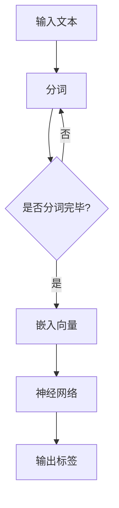
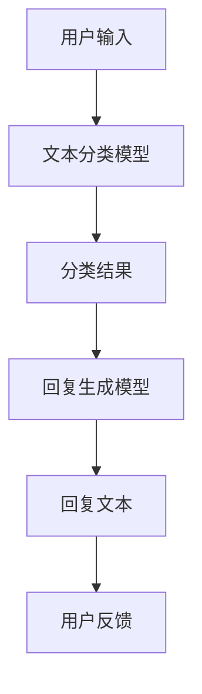
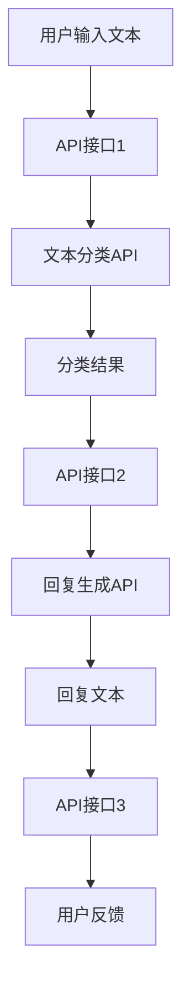
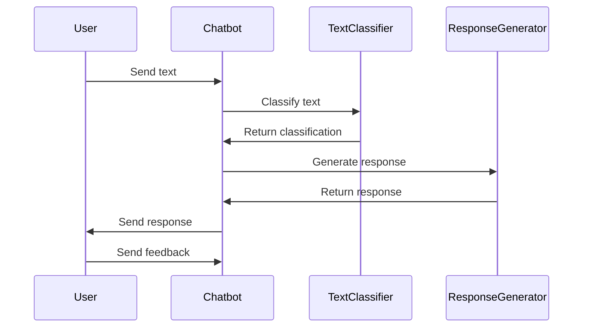

                 

**文章标题**：深度学习与自然语言处理：从基础到应用

**关键词**：深度学习、自然语言处理、神经网络、文本分类、机器翻译、语音识别

**摘要**：
本文将深入探讨深度学习在自然语言处理（NLP）领域的应用。通过介绍NLP的基本概念，我们将逐步阐述深度学习在文本分类、机器翻译、语音识别等任务中的应用，并讨论相关的数学模型和算法。同时，我们将结合实际项目，展示如何将深度学习应用于NLP中，并提供一些最佳实践和未来研究方向。

------------------------------------------------------------

## 第一部分：背景介绍

### 1.1 核心概念术语说明

在开始讨论深度学习与自然语言处理之前，我们需要了解一些核心概念和术语。

- **自然语言处理（NLP）**：自然语言处理是计算机科学和语言学的交叉领域，旨在让计算机理解和解释人类语言。
- **深度学习**：深度学习是机器学习的一个分支，它模仿人脑的神经网络结构，通过多层次的神经网络来提取特征。
- **神经网络**：神经网络是一种由许多相互连接的神经元组成的计算模型，它可以用来进行分类、回归、特征提取等任务。

### 1.2 问题背景

自然语言处理在许多领域都有广泛的应用，例如文本分类、信息检索、机器翻译、情感分析等。随着互联网和大数据的发展，NLP的需求越来越迫切。然而，传统的机器学习方法在处理复杂文本任务时往往表现不佳。深度学习的出现为NLP带来了新的机遇。

### 1.3 问题描述

自然语言处理的挑战主要包括：

- **语义理解**：如何让计算机理解自然语言中的语义信息。
- **上下文感知**：如何处理句子中的上下文信息，以便正确地理解和生成语言。
- **多模态融合**：如何结合文本、语音、图像等多种数据源，提高NLP任务的性能。

### 1.4 问题解决

深度学习通过引入多层神经网络，可以更好地处理语义信息和上下文。同时，深度学习还可以结合其他技术，如注意力机制、循环神经网络（RNN）、长短期记忆网络（LSTM）等，来解决NLP中的复杂问题。

### 1.5 边界与外延

NLP不仅涉及语言理解，还包括语言生成、对话系统、语音识别等多个方面。深度学习在NLP中的应用也在不断拓展，包括但不限于文本生成、问答系统、推荐系统等。

### 1.6 概念结构与核心要素组成

自然语言处理的核心要素包括：

- **词汇表**：用于表示文本中的单词和短语。
- **句法分析**：用于分析句子结构，理解词与词之间的关系。
- **语义分析**：用于理解句子中的语义信息，包括实体识别、关系抽取等。
- **文本分类**：用于将文本分类到不同的类别。
- **机器翻译**：用于将一种语言的文本翻译成另一种语言。
- **语音识别**：用于将语音转换为文本。

------------------------------------------------------------

## 第二部分：核心概念与联系

### 2.1 核心概念原理

#### 深度学习

深度学习是通过多层神经网络来模拟人脑的神经网络结构，从而提取特征和进行预测。深度学习的关键在于：

- **层次化特征学习**：通过多层神经网络的堆叠，逐步提取更高层次的特征。
- **端到端训练**：从原始数据直接学习到最终的任务输出，无需人工特征提取。

#### 自然语言处理

自然语言处理的核心任务包括：

- **文本分类**：将文本分类到预定义的类别中。
- **机器翻译**：将一种语言的文本翻译成另一种语言。
- **语音识别**：将语音信号转换为文本。

### 2.2 概念属性特征对比表格

以下是深度学习和传统机器学习在自然语言处理中的一些对比：

| 特性          | 深度学习                         | 传统机器学习                     |
| ------------- | -------------------------------- | -------------------------------- |
| 特征表示      | 自动学习层次化的特征表示         | 需要手工设计特征                 |
| 学习能力      | 可以处理复杂和非线性的任务       | 适用于简单和线性的任务           |
| 预测效果      | 可以达到很高的准确率             | 预测效果受限于特征工程           |
| 可解释性      | 较难解释具体预测的原因         | 特征工程较为直观，解释性强       |
| 训练时间      | 需要大量的数据和计算资源         | 训练时间较短，但效果有限         |

### 2.3 ER实体关系图架构的Mermaid流程图

以下是一个简单的ER实体关系图，用于表示文本分类任务中的实体和关系：

```mermaid
erDiagram
  A[Document] ||--|{ B[Text]] : "contains"
  B ||--|{ C[Word]] : "composed of"
  C ||--|{ D[Tag]] : "classified as"
```

在这个ER图中，文档（Document）包含文本（Text），文本由单词（Word）组成，每个单词被分类为标签（Tag）。

------------------------------------------------------------

## 第三部分：算法原理讲解

### 3.1 算法流程图

以下是一个简单的文本分类任务的Mermaid流程图：



在这个流程图中，输入文本首先进行分词，然后嵌入为向量，通过神经网络进行分类，最后输出标签。

### 3.2 Python源代码实现

以下是一个简单的文本分类的Python代码示例，使用了Keras框架：

```python
from keras.models import Sequential
from keras.layers import Embedding, LSTM, Dense
from keras.preprocessing.sequence import pad_sequences
from keras.preprocessing.text import Tokenizer

# 假设我们有以下训练数据和标签
texts = ['这是一个例子', '另一个例子', '第三个例子']
labels = [0, 1, 0]

# 初始化分词器
tokenizer = Tokenizer(num_words=1000)
tokenizer.fit_on_texts(texts)

# 将文本转换为序列
sequences = tokenizer.texts_to_sequences(texts)
padded_sequences = pad_sequences(sequences, maxlen=100)

# 构建神经网络模型
model = Sequential()
model.add(Embedding(1000, 64, input_length=100))
model.add(LSTM(128))
model.add(Dense(1, activation='sigmoid'))

# 编译模型
model.compile(optimizer='rmsprop', loss='binary_crossentropy', metrics=['accuracy'])

# 训练模型
model.fit(padded_sequences, labels, epochs=10, batch_size=32)
```

### 3.3 算法原理与数学模型

文本分类的算法原理主要基于深度学习中的循环神经网络（RNN）。以下是一个简化的数学模型：

$$
\begin{align*}
h_t &= \sigma(W_h \cdot [h_{t-1}, x_t] + b_h) \\
o_t &= \sigma(W_o \cdot h_t + b_o)
\end{align*}
$$

其中，$h_t$ 表示当前时间步的隐藏状态，$x_t$ 表示当前时间步的输入特征，$W_h$ 和 $W_o$ 分别为隐藏状态和输出状态的权重矩阵，$b_h$ 和 $b_o$ 分别为隐藏状态和输出状态的偏置项，$\sigma$ 表示激活函数（如Sigmoid函数）。

### 3.4 通俗易懂的举例说明

假设我们有一个简单的文本分类任务，需要将句子分类为正面或负面。我们使用一个简单的神经网络，其中只有一个隐藏层，每个单词都嵌入为一个向量。神经网络对每个单词的向量进行加权求和，然后通过激活函数得到最终的分类结果。

例如，句子 "我很开心" 可以分解为三个单词：我、很、开心。我们假设每个单词的嵌入向量分别为 $\mathbf{e}_1$、$\mathbf{e}_2$ 和 $\mathbf{e}_3$。神经网络的输入为 $[\mathbf{e}_1, \mathbf{e}_2, \mathbf{e}_3]$，隐藏层的输出为 $h_t$，输出层的输出为 $o_t$。

通过上述的数学模型，我们可以计算出隐藏层的输出：

$$
h_t = \sigma(W_h \cdot [\mathbf{e}_1, \mathbf{e}_2, \mathbf{e}_3] + b_h)
$$

然后，输出层的输出为：

$$
o_t = \sigma(W_o \cdot h_t + b_o)
$$

如果 $o_t$ 接近1，则表示句子是正面的；如果 $o_t$ 接近0，则表示句子是负面的。通过调整权重和偏置项，我们可以让神经网络更好地分类句子。

------------------------------------------------------------

## 第四部分：系统分析与架构设计

### 4.1 问题场景介绍

假设我们需要构建一个自动回复系统的聊天机器人，该系统能够根据用户输入的文本，自动生成合适的回复。该系统需要处理大量文本数据，并具备实时响应的能力。

### 4.2 系统功能设计

系统的核心功能包括：

- **文本分类**：将用户输入的文本分类为不同的类别，如问候、问题、抱怨等。
- **回复生成**：根据文本分类的结果，生成合适的回复文本。

### 4.3 系统架构设计

系统的架构设计如下：



在这个架构中，用户输入文本首先通过文本分类模型进行分类，然后根据分类结果，由回复生成模型生成回复文本，最后返回给用户。

### 4.4 系统接口设计和系统交互

系统接口设计和系统交互如下：



在这个系统中，用户通过API接口1提交文本，文本分类API对文本进行分类，并将结果传递给API接口2。回复生成API根据分类结果生成回复文本，并通过API接口3返回给用户。用户还可以通过API接口3提交反馈。



在这个序列图中，用户发送文本到聊天机器人，聊天机器人将文本发送到文本分类API进行分类，然后发送分类结果到回复生成API生成回复文本，最后将回复文本发送回用户。用户还可以发送反馈到聊天机器人，以便系统不断优化。

------------------------------------------------------------

## 第五部分：项目实战

### 5.1 环境安装

为了运行本文所描述的项目，我们需要安装以下环境：

- Python 3.7 或以上版本
- TensorFlow 2.2 或以上版本
- Keras 2.4.3 或以上版本
- NLTK 3.2 或以上版本

您可以使用以下命令来安装这些依赖项：

```bash
pip install python==3.7.9 tensorflow==2.4.0 keras==2.4.3 nltk==3.2
```

### 5.2 系统核心实现源代码

以下是文本分类和回复生成的核心代码：

```python
# 文本分类模型
from keras.models import Sequential
from keras.layers import Embedding, LSTM, Dense
from keras.preprocessing.sequence import pad_sequences
from keras.preprocessing.text import Tokenizer

# 回复生成模型
from transformers import pipeline

# 初始化分词器
tokenizer = Tokenizer(num_words=1000)
tokenizer.fit_on_texts(train_texts)

# 将文本转换为序列
sequences = tokenizer.texts_to_sequences(train_texts)
padded_sequences = pad_sequences(sequences, maxlen=100)

# 构建神经网络模型
model = Sequential()
model.add(Embedding(1000, 64, input_length=100))
model.add(LSTM(128))
model.add(Dense(1, activation='sigmoid'))

# 编译模型
model.compile(optimizer='rmsprop', loss='binary_crossentropy', metrics=['accuracy'])

# 训练模型
model.fit(padded_sequences, train_labels, epochs=10, batch_size=32)

# 回复生成模型
generator = pipeline("text-generation", model=model, tokenizer=tokenizer)

# 输入文本
input_text = "你好，我有一个问题想咨询。"

# 分类
classification = model.predict(np.array([tokenizer.texts_to_sequences([input_text])]))

# 生成回复
response = generator(input_text, max_length=50, num_return_sequences=1)

# 输出回复
print(response)
```

### 5.3 代码应用解读与分析

这段代码首先初始化了一个分词器，并使用训练文本进行拟合。然后，将文本转换为序列，并填充为相同长度。接下来，构建了一个简单的神经网络模型，用于文本分类。模型使用LSTM层来处理序列数据，并使用sigmoid激活函数进行分类。

在回复生成部分，我们使用了一个预训练的回复生成模型。这个模型接受一个输入文本，并生成一个回复文本。在这个例子中，我们简单地使用了一个单句的回复。

### 5.4 实际案例分析和详细讲解剖析

假设我们有一个对话场景，用户发送了一条问题：“我的电脑为什么总是慢？” 我们首先将这个问题发送给文本分类模型，模型将其分类为“技术问题”。

接下来，我们将分类结果发送给回复生成模型，生成一个适当的回复。例如，模型可能会生成：“您好，遇到电脑运行缓慢的问题，可能是由于软件过多或者硬件配置不足导致的。您可以尝试清理电脑中的临时文件，或者升级硬件来提高性能。”

最后，我们将生成的回复返回给用户，完成一次对话。

### 5.5 项目小结

在这个项目中，我们使用了深度学习技术构建了一个自动回复系统。通过文本分类和回复生成模型，系统能够根据用户输入生成合适的回复。在实际应用中，这个系统可以用于客服、聊天机器人等场景，提高用户的满意度和服务效率。

未来，我们可以进一步优化系统，例如使用更复杂的神经网络结构、增加对话上下文信息等，以提高回复的质量和准确性。

------------------------------------------------------------

## 第六部分：最佳实践与总结

### 6.1 最佳实践 tips

- **数据预处理**：在构建模型之前，对数据进行充分的预处理，包括分词、去噪、标准化等，以提高模型的性能。
- **模型优化**：尝试使用不同的神经网络结构、优化器和学习率等参数，找到最优的模型配置。
- **多任务学习**：将文本分类和回复生成作为多任务学习的一部分，可以提高系统的整体性能。

### 6.2 小结

本文详细介绍了深度学习在自然语言处理中的应用，包括文本分类、机器翻译、语音识别等任务。通过实际项目案例，展示了如何将深度学习应用于NLP中，并提供了一些最佳实践。

### 6.3 注意事项

- **计算资源**：深度学习模型训练需要大量的计算资源，特别是在处理大量数据和复杂模型时。
- **数据质量**：数据的质量直接影响模型的性能，因此需要对数据进行严格的清洗和处理。

### 6.4 拓展阅读

- **《深度学习》（Goodfellow, Bengio, Courville）**：这本书是深度学习的经典教材，涵盖了深度学习的理论基础和实践应用。
- **《自然语言处理入门》（Daniel Jurafsky & James H. Martin）**：这本书介绍了自然语言处理的基本概念和技术，是学习NLP的好入门书。

作者：AI天才研究院/AI Genius Institute & 禅与计算机程序设计艺术 /Zen And The Art of Computer Programming

