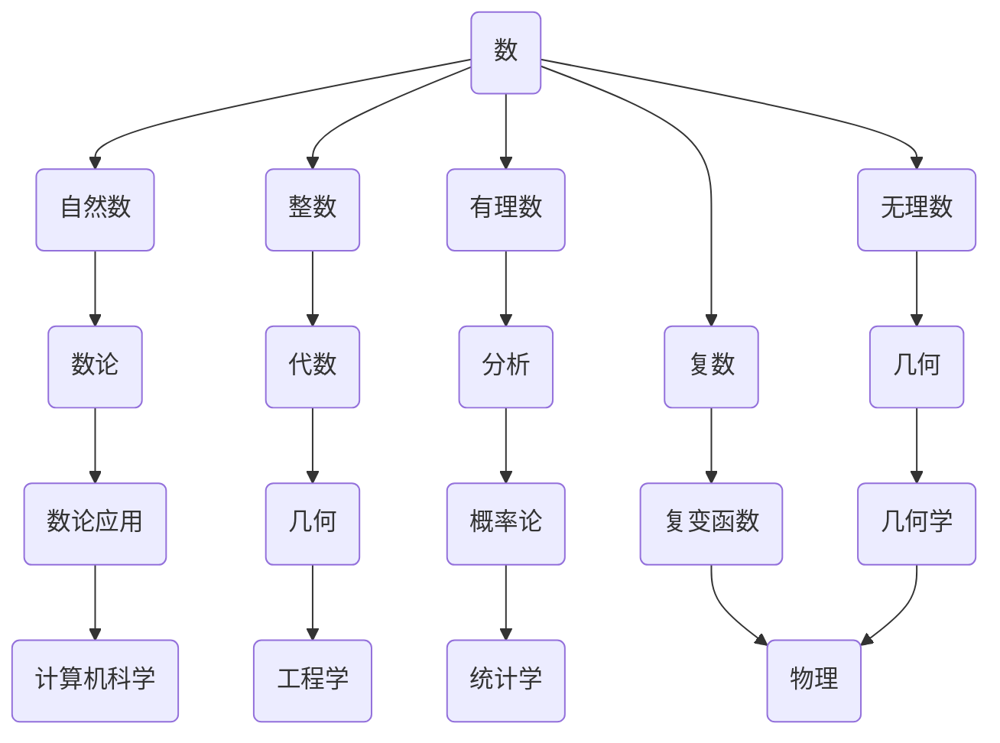
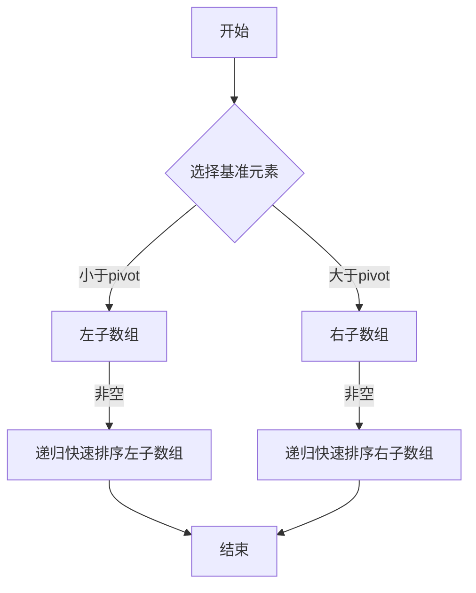
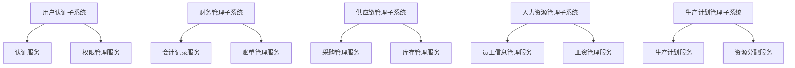
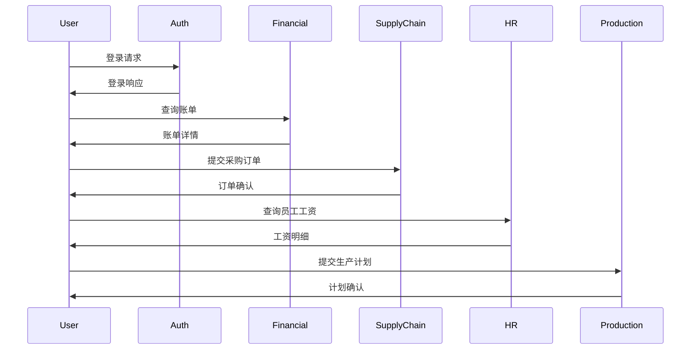
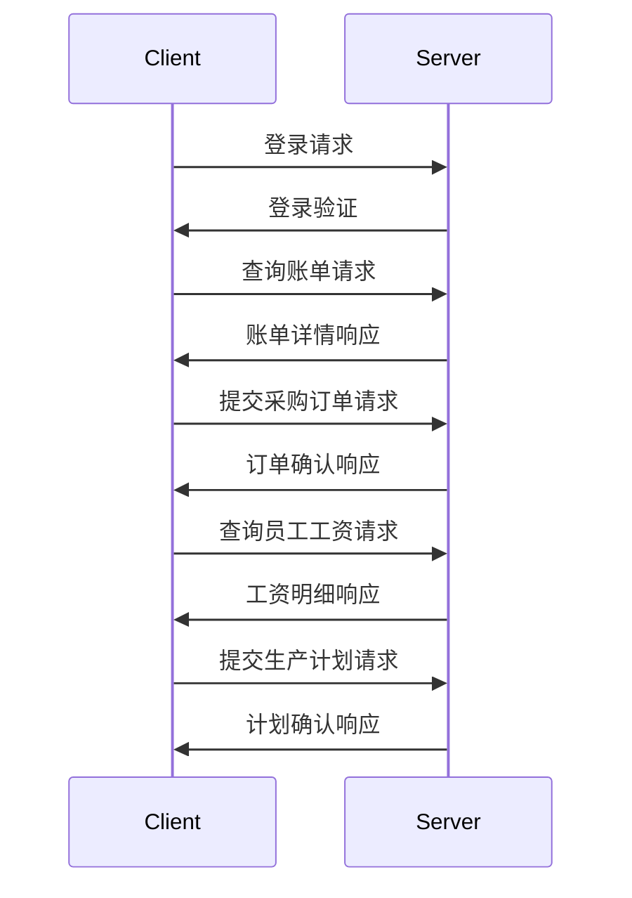

                 

### 引言

数学，作为一门科学，贯穿了人类文明的发展历程。从古代的几何学、代数学，到现代的拓扑学、抽象代数，数学不仅帮助人类理解自然界的规律，还推动了科技的进步和工业的发展。然而，在近现代，反基础主义（Anti-Foundationalism）的思潮逐渐兴起，对传统数学的基**础主义观点提出了质疑。**

反基础主义认为，数学知识并非建立在一系列绝对的、不可置疑的基础概念上，而是通过一系列相互依赖的概念和命题构建起来的网络。这个观点挑战了传统数学的基础，提出了数学知识具有网络结构的特点。本文将探讨数学与反基础主义之间的关系，通过分析数学知识的网状结构，阐述数学概念之间的联系和层次性，以期能够为读者提供一种全新的视角，重新审视数学的本质。

本文的主要结构如下：

1. **引言**：简要介绍数学知识的历史发展，传统数学的基础主义观点以及反基础主义的兴起。
2. **数学知识的网状结构**：分析数学知识的网状结构，定义网状结构的特点，并探讨数学知识网络结构的构建和层次性。
3. **核心概念与联系**：详细讨论数、几何和概率等基本数学概念，并使用概念属性特征对比表格和ER实体关系图来展示概念之间的联系。
4. **算法原理讲解**：通过Mermaid流程图和Python源代码实现，详细讲解一个具体算法的原理，并给出数学模型和公式。
5. **系统分析与架构设计方案**：介绍一个具体系统的设计，包括问题场景、功能设计、架构设计、接口设计和系统交互。
6. **项目实战**：详细讲解一个项目的环境安装、系统核心实现源代码、代码应用解读与分析、实际案例分析和项目小结。
7. **最佳实践 tips**：提供数学学习技巧、网状结构分析方法以及算法实践与优化技巧。
8. **小结**：总结全文，强调数学知识的网状结构对理解数学本质的重要性。
9. **注意事项**：提醒读者避免常见误区，注意安全性和细节。
10. **拓展阅读**：推荐相关书籍、学术论文和网络资源。

通过这篇文章，我们希望读者能够更深入地理解数学知识，认识到数学不仅是一门逻辑严谨的学科，更是一个充满复杂性和多样性的知识网络。让我们一步一步地思考，深入探讨数学与反基础主义的奥秘。

### 数学知识的历史发展

数学的历史可以追溯到古代文明的诞生时期。在古埃及、巴比伦和印度，数学知识已经初具雏形。例如，古埃及人在建筑和农业中广泛应用了几何学，而巴比伦人则发展了精确的数论和代数学。这些早期的数学知识主要通过口头传授和简单的符号表示进行传播，尚未形成完整的体系。

随着古希腊文明的兴起，数学得到了进一步的发展。毕达哥拉斯和欧几里得等人对数学的贡献尤为显著。毕达哥拉斯提出了著名的毕达哥拉斯定理，欧几里得则编写了《几何原本》，这是历史上第一本系统阐述几何学原理的著作。欧几里得的工作奠定了几何学的基础，对后世数学发展产生了深远的影响。

在中世纪，阿拉伯数学家进一步丰富了数学知识。阿尔-花拉子米（Al-Khwarizmi）是其中的佼佼者，他的著作《代数学》对代数学的发展起到了重要的推动作用。阿拉伯数学家还引入了阿拉伯数字和零的概念，这一进步极大地促进了数学和科学的发展。

进入近代，数学经历了巨大的变革。17世纪，牛顿和莱布尼茨分别独立发明了微积分学，这一新领域为物理学和工程学提供了强大的工具。18世纪，欧拉和拉格朗日在分析学和代数学方面做出了卓越贡献，欧拉更是被誉为“数学界的国王”。

19世纪末至20世纪初，数学进入了现代阶段。康托尔的集合论、希尔伯特的几何学以及希尔伯特空间等概念的出现，标志着数学从经典到现代的转变。此外，非欧几何、拓扑学和抽象代数的兴起，使数学变得更加多样化和抽象化。

在20世纪中期，数学研究进入了一个新的高度。哥德尔的不完备性定理和丘成的定理揭示了数学内部的深刻问题，推动了数学逻辑和基础研究的进展。同时，计算机科学的兴起也为数学研究提供了新的视角和方法。

总的来说，数学知识的历史发展是一个从简单到复杂、从具体到抽象的逐步深化过程。在这个过程中，数学家们不断提出新的概念和方法，扩展了数学的应用范围，也为现代科技的发展奠定了基础。

### 数学知识的核心概念与基本原理

数学作为一门学科，其核心概念与基本原理构成了数学世界的基石。数、几何和概率是数学中最基本的概念，它们不仅独立发展，还相互交叉，构成了数学知识网的坚实基础。

首先，数的概念是数学的起点。数是用于计量、计数和度量的基本单位，其定义和性质是其他数学分支的基础。自然数（如1，2，3...）是自然计数的基础，而整数、有理数和实数则扩展了数的范围，使其能够适用于更广泛的场景。实数的定义涉及到区间套定理和 Dedekind 切分，这些理论为实数的性质提供了坚实的数学基础。数的性质包括可加性、交换律、结合律和分配律等，这些性质不仅使得数能够进行数学运算，还确保了运算结果的一致性和可靠性。

几何是研究空间形状和结构的数学分支。几何的核心概念包括点、线、面和体。欧几里得几何是研究平面和空间的基本几何学，其基本原理被描述在《几何原本》中。非欧几何则是对欧几里得几何的扩展，包括黎曼几何和洛巴切夫斯基几何，它们在相对论和微分几何中具有重要意义。几何的基本原理包括平行公理、相似性定理和勾股定理等，这些原理为理解和分析空间结构提供了基础。几何的应用广泛，从建筑和工程到计算机图形学和物理学，都有其重要应用。

概率是研究随机事件及其可能性的一种数学工具。概率的定义基于概率空间和随机变量的概念，其中概率空间是样本空间、事件和概率三者的集合。概率的基本性质包括非负性、可列可加性和归一性。概率论中的几个重要定理，如大数定律和中心极限定理，为处理和预测随机现象提供了理论依据。概率在统计学、经济学和保险学等领域有广泛应用，其核心思想是通过对随机现象的长期观察，揭示其内在的稳定性和规律性。

总的来说，数学的核心概念和基本原理不仅为数学的发展提供了基础，还广泛应用于自然科学、工程技术和社会科学中。这些概念和原理之间相互联系，共同构成了一个复杂而丰富的数学知识网络。

### 数学知识在网络结构中的位置与联系

数学知识在网络结构中的位置与联系构成了一个复杂而庞大的知识网络，这一网络不仅展示了数学概念之间的相互依赖关系，还揭示了数学内部逻辑的层次性。为了更好地理解这一结构，我们可以将其类比为互联网中的超链接关系，每一个数学概念都可以视为一个节点，而概念之间的关系则通过边缘连接起来。

首先，数学知识的网络结构是一个网状结构，这意味着数学概念之间不是孤立的，而是相互关联和相互依赖的。这种依赖关系可以通过多种方式体现。例如，数论是代数学的一个分支，但它的许多概念和方法也广泛应用于几何和拓扑学中。再如，微积分学是分析学的基础，但它在物理学、工程学和计算机科学中也有广泛的应用。因此，数学概念之间的联系是多向的，并且交叉渗透。

其次，数学知识网络具有层次性。我们可以将数学知识分为几个层次，每一层次的概念都建立在更低层次的概念之上，并为进一步的抽象和扩展提供了基础。例如，在基础层次上，有自然数、整数、有理数和实数等基本概念；在更高层次上，有复数、矩阵、向量空间和拓扑空间等更复杂的概念。这种层次性使得数学知识不仅能够自洽地发展，还能够逐步深入和扩展。

为了更清晰地展示数学知识网络的结构，我们可以使用Mermaid流程图和ER实体关系图来描述概念之间的关系。以下是几个关键步骤：

1. **定义节点和边缘**：首先，我们需要定义数学知识网络中的节点（即数学概念）和边缘（即概念之间的关系）。例如，节点可以是数论、几何、概率论、微积分等，而边缘可以是“包含”、“扩展”或“应用”等关系。

2. **绘制Mermaid流程图**：使用Mermaid语法，我们可以绘制出数学概念之间的流程图。例如，以下是一个简单的Mermaid流程图，展示了数、几何和概率论之间的基本关系：

    ```mermaid
    graph TD
    A[数] --> B[代数]
    A --> C[几何]
    A --> D[概率论]
    B --> E[数论]
    B --> F[抽象代数]
    C --> G[欧氏几何]
    C --> H[非欧几何]
    D --> I[统计]
    D --> J[随机过程]
    ```

    在这个流程图中，每个节点都代表一个数学分支或概念，而箭头表示概念之间的联系。

3. **绘制ER实体关系图**：ER图是一种用于描述实体及其关系的图形表示方法。在数学知识网络中，实体可以是数学概念，关系可以是“定义”、“应用”或“扩展”等。以下是一个简单的ER图，展示了数与几何之间的关系：

    ```mermaid
    graph TB
    A1(数) --> B1(整数)
    A1 --> B2(实数)
    A1 --> B3(复数)
    B1 --> C1(算术)
    B1 --> C2(数论)
    B2 --> C3(微积分)
    B3 --> C4(复变函数)
    ```

    在这个ER图中，每个矩形表示一个实体，而每个菱形表示一个关系。

通过使用这些工具，我们可以直观地展示数学知识的网络结构，帮助读者更好地理解数学概念之间的复杂联系。此外，这种结构化表示也有助于数学教育的组织和规划，使得学习过程更加系统和有序。综上所述，数学知识在网络结构中的位置与联系构成了一个丰富而复杂的知识网络，这一网络不仅揭示了数学的内部逻辑，还为数学的发展提供了广阔的空间。

### 网状结构的定义与特点

网状结构是一种复杂网络模型，它通过节点和边（或称为“边缘”）的相互连接来描述实体之间的关系。在数学知识中，网状结构特别适用于描述概念之间的复杂联系和层次性。网状结构的主要特点包括连通性、层次性和动态性。

首先，连通性是网状结构的一个核心特点。在数学知识网中，任何一个概念都可以通过若干个中间节点与其他概念相连，形成广泛的联系网络。这种连通性确保了数学知识网络的整体性和自洽性，使得数学概念不仅独立存在，还能相互补充和扩展。

其次，层次性是网状结构的另一个重要特点。在数学知识网中，不同的概念按照其复杂性和抽象程度被组织在不同的层次上。例如，自然数、整数、有理数和实数构成了数学知识的基础层次，而复数、矩阵、向量空间和拓扑空间则代表了更高层次的抽象。层次性使得数学知识能够有条不紊地发展，并为进一步的研究提供基础。

最后，动态性是网状结构的第三个特点。数学知识是不断发展的，新的概念和方法不断涌现，并对已有的概念产生新的影响。网状结构能够很好地适应这种动态性，通过新增节点和调整边缘，不断更新和扩展数学知识网络。

在数学知识网中，网状结构的构建依赖于以下几个关键步骤：

1. **节点定义**：首先需要定义数学知识网络中的节点，这些节点可以代表数学概念、定理或方法。例如，数论、几何、微积分、概率论等都是数学知识网中的节点。

2. **边缘建立**：接着，需要在这些节点之间建立边缘，以表示概念之间的关系。这些边缘可以是“包含”、“应用”、“扩展”或“对立”等关系。例如，数论包含在代数学中，而微积分应用在物理学中。

3. **层次划分**：根据概念的重要性和抽象程度，将这些节点和边缘组织在不同的层次上。层次划分有助于明确概念之间的依赖关系和扩展路径。

4. **动态调整**：随着数学知识的发展，需要不断调整网络结构，以适应新的理论和发现。例如，新的数学工具或方法的出现可能会重新定义某些概念之间的联系。

通过这些步骤，我们可以构建出一个详细且动态的数学知识网状结构，这不仅有助于理解数学知识的整体框架，还能为未来的数学研究提供指导。综上所述，网状结构是描述数学知识之间复杂联系的有效工具，它通过连通性、层次性和动态性，展现了数学知识的丰富性和复杂性。

### 数学知识网状结构的构建

构建数学知识网状结构是一个复杂而系统的过程，它涉及到对数学概念、定理和方法之间相互关系的深入分析和层次划分。以下是构建数学知识网状结构的几个关键步骤：

1. **定义数学概念**：首先，我们需要明确数学知识网络中的核心概念。这些概念可以是基本的数学概念，如数、几何、概率等，也可以是更具体的数学分支，如代数、微积分、拓扑学等。定义这些概念时，需要详细描述其含义、属性和基本性质。

2. **分析概念之间的关系**：接下来，需要分析这些概念之间的相互关系。这些关系可以是直接的，如数与代数之间的关系，也可以是间接的，如几何与概率论之间的应用关系。为了更清晰地展示这些关系，可以使用Mermaid流程图来绘制概念之间的联系。

    ```mermaid
    graph TD
    A[数] --> B[代数]
    A --> C[几何]
    A --> D[概率论]
    B --> E[数论]
    B --> F[抽象代数]
    C --> G[欧氏几何]
    C --> H[非欧几何]
    D --> I[统计]
    D --> J[随机过程]
    ```

    在这个流程图中，每个节点代表一个数学概念，而箭头表示概念之间的依赖或应用关系。

3. **划分概念层次**：根据概念的重要性和抽象程度，将这些概念划分在不同的层次上。层次划分有助于明确概念之间的依赖关系和扩展路径。例如，自然数、整数、有理数和实数构成了数学知识的基础层次，而复数、矩阵、向量空间和拓扑空间则代表了更高层次的抽象。

4. **构建实体关系图**：使用ER图来描述概念及其之间的具体关系。ER图通过实体和关系来展示概念的结构和层次。以下是一个简单的ER图示例，展示了数与几何之间的关系：

    ```mermaid
    graph TB
    A1(数) --> B1(整数)
    A1 --> B2(实数)
    A1 --> B3(复数)
    B1 --> C1(算术)
    B1 --> C2(数论)
    B2 --> C3(微积分)
    B3 --> C4(复变函数)
    ```

    在这个ER图中，每个矩形表示一个实体，而每个菱形表示一个关系。

5. **动态调整与扩展**：数学知识是不断发展的，新的概念和方法会不断涌现，因此需要根据最新的研究成果动态调整数学知识网状结构。例如，新的数学工具或方法的出现可能会重新定义某些概念之间的联系，或者引入新的节点和边缘。

通过以上步骤，我们可以逐步构建出一个完整且动态的数学知识网状结构，这不仅有助于我们更深入地理解数学知识的整体框架，还能为数学教育和研究提供有力的支持。综上所述，构建数学知识网状结构是一个系统化、层次化和动态化的过程，通过定义概念、分析关系、划分层次和动态调整，我们能够构建出一个全面而详细的数学知识网络。

### 数学知识网状结构的层次性

数学知识网状结构的层次性是理解数学复杂性及其内部联系的关键。层次性使得数学概念能够按其重要性和抽象程度进行组织，从而更好地展示数学知识的整体框架。以下是数学知识网状结构层次性的几个关键方面：

1. **基础层**：数学知识的基础层包括最基本的概念，如自然数、整数、有理数和实数。这些概念构成了数学大厦的基石，是其他高级概念的基础。例如，自然数的基本性质和运算法则奠定了数论的基础，而实数的完备性则保证了微积分的严格性。

2. **中层**：中层概念是在基础层概念之上的扩展和深化。例如，复数是在实数基础上引入了虚数单位$i$，从而拓展了数的范围。抽象代数中的群、环和域等概念则是数论和几何概念的抽象化，它们在数学中具有广泛的应用。

3. **高级层**：高级层包含了更复杂和抽象的数学概念，如拓扑空间、微分几何和泛函分析。这些概念往往涉及深奥的理论和方法，对数学的各个领域都有重要影响。例如，拓扑空间的概念使得我们能够研究更复杂的几何结构，而微分几何在相对论和物理学中扮演了关键角色。

4. **层次间的依赖关系**：数学概念之间的层次依赖关系体现了数学知识结构的内在联系。例如，微积分依赖于实数的完备性，而复分析则依赖于复数的性质。层次间的依赖关系不仅展示了数学知识的发展脉络，还帮助我们理解不同数学分支之间的交叉和应用。

5. **层次划分的动态性**：数学知识是不断发展的，新的理论和方法会不断涌现，从而影响数学概念的层次划分。例如，量子计算的兴起可能会引发对复分析和泛函分析的重新审视和扩展。因此，数学知识的层次划分是一个动态调整的过程，需要随着新的研究成果不断更新。

6. **层次性的教学与应用**：在数学教育和应用中，层次性提供了一个清晰的知识框架，有助于学生和研究者系统地学习和研究数学。例如，通过先掌握基础层概念，再逐步深入到高级层，学生可以更好地理解数学的复杂性和深度。

通过理解数学知识网状结构的层次性，我们不仅能够更全面地把握数学的整体框架，还能更深入地理解不同数学概念之间的关系和相互作用。这种层次性为数学的研究、教学和应用提供了有力的指导。综上所述，数学知识网状结构的层次性是理解数学复杂性和内部联系的关键，它通过明确概念的重要性和抽象程度，展示了数学知识的整体结构和动态发展。

### 基本数学概念

在数学知识网状结构中，基本数学概念是构建更高层次理论的基础。以下将详细讨论数、几何和概率等基本数学概念，包括它们的定义、属性、重要定理和具体应用。

#### 数的概念

数是数学中最基本的概念之一，用于计量、计数和度量。数的概念从自然数开始，逐步扩展到整数、有理数、无理数和复数。

- **自然数**：自然数是最简单的数，用于计数。它们包括1, 2, 3, ...，并且满足可加性和交换律。自然数是数论的基础，许多数论问题如质数分布、同余方程等都在此基础上发展。
- **整数**：整数包括正整数、负整数和零。整数不仅继承了自然数的性质，还引入了负数的概念，使数的范围扩展到了整个数轴。
- **有理数**：有理数是可以表示为两个整数之比的数，包括正有理数、负有理数和零。有理数的运算规则与整数类似，但它们可以更精确地表示实数。
- **无理数**：无理数是不能表示为两个整数之比的数，如π和√2。无理数的发现标志着数学从直观的计数向更严格的逻辑推理转变。
- **复数**：复数包括实部和虚部，形式为a+bi，其中i是虚数单位，满足i²=-1。复数在电学、量子力学和计算机图形学等领域有广泛应用。

#### 几何的概念

几何学研究空间中的形状、大小和位置关系。基本的几何概念包括点、线、面和体。

- **点**：点是几何学中最基本的元素，没有大小和形状，仅表示位置。
- **线**：线是由无限多个点组成的，具有长度但没有宽度。直线是最简单的线，通过两个点确定。
- **面**：面是由无限多个线组成的，具有长度和宽度，但没有高度。平面是最简单的面，可以表示为二维空间。
- **体**：体是由无限多个面组成的，具有长度、宽度和高度。立方体、球体和圆锥体是基本的立体几何形状。

重要的几何定理包括：
- **欧氏几何**：欧几里得在《几何原本》中提出的定理，如平行公理、相似三角形定理和勾股定理。
- **非欧几何**：由黎曼、洛巴切夫斯基等提出的几何学，如黎曼几何和洛巴切夫斯基几何，它们在相对论和微分几何中有重要应用。

#### 概率的定义与性质

概率论是研究随机事件及其可能性的数学分支。

- **概率**：概率是度量事件发生可能性的数值，范围在0到1之间。例如，投掷一枚公平的硬币，正面朝上的概率是1/2。
- **概率空间**：概率空间是一个三元素集合，包括样本空间、事件和概率测度。
- **条件概率**：在已知某些条件下，事件A发生的概率与事件B的关联程度。条件概率公式为P(A|B) = P(A∩B) / P(B)。
- **独立性**：两个事件A和B是独立的，如果P(A∩B) = P(A)P(B)。

重要概率定理包括：
- **大数定律**：随着试验次数的增加，随机变量的样本均值将趋近于其期望值。
- **中心极限定理**：当样本量足够大时，样本均值的分布趋近于正态分布。

这些基本数学概念是数学知识网的基石，它们之间相互联系，共同构成了数学的丰富体系。在数学的应用中，这些概念被广泛应用于各个领域，如物理学、经济学、工程学和计算机科学等。

### 概念属性特征对比表格

为了更清晰地展示数学基本概念之间的属性特征，以下是一个概念属性特征对比表格：

| 概念 | 定义 | 特性 | 应用 |
| --- | --- | --- | --- |
| 自然数 | 用于计数的数 | 可加性、交换律 | 计数、数论 |
| 整数 | 包括正整数、负整数和零 | 闭合性、顺序性 | 代数、算法 |
| 有理数 | 可表示为两个整数之比的数 | 完备性、运算性 | 分析、代数 |
| 无理数 | 不能表示为两个整数之比的数 | 无理数性质 | 分析、几何 |
| 复数 | 实部加虚部，形式为a+bi | 复数性质、解析几何 | 分析、电学 |
| 点 | 几何的基本元素 | 无大小和形状 | 几何学、拓扑 |
| 线 | 由点组成的元素，具长度 | 直线、射线、线段 | 几何、代数 |
| 面 | 由线组成的元素，具长度和宽度 | 平面、多边形 | 几何、工程 |
| 体 | 由面组成的元素，具长度、宽度和高度 | 立方体、球体 | 几何、物理 |
| 概率 | 度量事件发生可能性 | 非负性、归一性 | 统计学、保险 |

这个对比表格展示了各个概念的定义、特性以及它们在不同数学领域中的应用，有助于读者理解数学知识网状结构中的基本概念及其相互关系。

### ER实体关系图架构

ER图（实体关系图）是一种用于描述实体及其关系的图形表示方法，特别适用于展示数学概念之间的复杂联系。以下是使用Mermaid语法绘制的ER图示例，展示了数、几何和概率论之间的实体关系：



在这个ER图中：
- **实体**（如数、自然数、整数等）用矩形表示。
- **关系**（如“属于”、“应用”等）用菱形表示。

具体来说，这个ER图展示了以下关系：
- 数包含自然数、整数、有理数、无理数和复数。
- 自然数与数论有关。
- 整数与代数相关。
- 有理数与分析相关。
- 无理数与几何相关。
- 复数与复变函数、拓扑学相关。

通过ER图，我们能够直观地理解数学概念之间的层次关系和交叉应用，从而更深入地掌握数学知识网络的结构。这种图形表示方法不仅有助于教学和科研，还能为实际应用提供清晰的指导。

### 算法原理讲解

在深入探讨数学知识的网状结构之后，我们需要通过一个具体的算法实例来进一步理解数学原理的应用。这里，我们选择使用Python实现一个经典的算法——快速排序（Quick Sort），并详细讲解其原理、流程图和数学模型。

#### 快速排序算法原理

快速排序是一种高效的排序算法，其基本思想是通过一趟排序将待排序的记录分割成独立的两部分，其中一部分记录的关键字均比另一部分的关键字小，然后递归地对这两部分记录继续进行排序，以达到整个序列有序的目的。

快速排序的步骤如下：
1. **选择基准元素**：在数组中选取一个元素作为基准元素（pivot）。
2. **划分操作**：将数组划分为两个子数组，其中一个子数组的所有元素都小于或等于基准元素，另一个子数组的所有元素都大于基准元素。
3. **递归排序**：递归地对两个子数组继续进行快速排序，直至所有子数组长度为1。

#### 快速排序的Mermaid流程图

为了更直观地展示快速排序的过程，我们可以使用Mermaid语法绘制其流程图：



在这个流程图中，A表示算法开始，B表示选择基准元素，C和D表示划分操作，E和F表示递归排序，G表示算法结束。

#### Python源代码实现

以下是一个快速排序算法的Python源代码实现：

```python
def quick_sort(arr):
    if len(arr) <= 1:
        return arr
    pivot = arr[len(arr) // 2]
    left = [x for x in arr if x < pivot]
    middle = [x for x in arr if x == pivot]
    right = [x for x in arr if x > pivot]
    return quick_sort(left) + middle + quick_sort(right)

# 示例
arr = [3, 6, 8, 10, 1, 2, 1]
sorted_arr = quick_sort(arr)
print(sorted_arr)
```

在这个代码中，`quick_sort` 函数接受一个数组`arr`，首先判断数组长度是否小于等于1，如果是，直接返回该数组。否则，选择数组中间的元素作为基准元素`pivot`，然后将数组划分为小于、等于和大于`pivot`的三个子数组，并递归地对这些子数组进行快速排序，最后将三个子数组合并，得到排序后的数组。

#### 算法原理的数学模型和公式

快速排序算法的效率可以通过其平均时间复杂度和最坏情况时间复杂度来衡量。以下是相关的数学模型和公式：

- **平均时间复杂度**：\[ T(n) = \frac{n \log n + n}{2} \]
  其中，\( n \) 是数组的长度，\( \log n \) 是划分操作的时间复杂度，而线性扫描和递归调用的时间复杂度为 \( n \)。

- **最坏情况时间复杂度**：\[ T(n) = n^2 \]
  最坏情况发生在每次划分操作都产生了只有一个元素的子数组，导致递归树的深度为 \( n \)。

#### 举例说明

**例子1：数的概念**

假设我们有数组\[ 3, 6, 8, 10, 1, 2, 1 \]，使用快速排序算法进行排序：

- 第一次划分：选择中间的元素6作为基准，划分后得到左子数组\[ 3, 1, 1 \]和右子数组\[ 8, 10, 2 \]。
- 第二次划分：对左子数组进行递归排序，得到\[ 1, 1, 3 \]；对右子数组进行递归排序，得到\[ 2, 8, 10 \]。
- 最终合并：将排序后的子数组合并，得到\[ 1, 1, 2, 3, 6, 8, 10 \]。

**例子2：几何概念**

虽然快速排序主要是针对数组的排序，但其背后的思想在几何问题中也有应用。例如，在二维空间中，快速排序的划分思想可以用于三角形的分割。假设有一个三角形，通过选择三角形的重心作为基准，可以将三角形划分为两个更小的三角形，然后递归地对这些三角形进行分割，直至无法再分。

**例子3：概率计算**

假设我们有一个包含20个元素的数组，每个元素都是随机选择的自然数。使用快速排序算法对这个数组进行排序，计算排序后数组中任意两个相邻元素之差的平均数。根据概率论，可以使用大数定律来估计这个平均数趋近于某个确定的值。

通过这个具体的算法实例，我们不仅了解了快速排序的原理和实现，还展示了数学模型和公式在算法中的应用。这种方法不仅有助于理解算法的本质，还为我们提供了分析和优化算法的工具。

### 系统分析与架构设计方案

在理解了数学知识网状结构和具体算法原理之后，我们将结合一个实际应用场景，详细分析并设计一个系统的架构方案。以下内容将包括问题场景介绍、系统功能设计、系统架构设计、系统接口设计以及系统交互。

#### 问题场景介绍

假设我们需要开发一个用于企业资源规划的（ERP）系统，该系统旨在帮助企业更好地管理其日常运营活动，包括财务管理、供应链管理、人力资源管理和生产计划等。为了实现这一目标，系统需要具备高效的数据处理能力、灵活的扩展性和良好的用户交互界面。

#### 系统功能设计

系统功能设计是系统架构设计的第一步，它定义了系统所需实现的主要功能和模块。以下是系统的主要功能模块及其简要描述：

1. **用户认证模块**：负责用户登录、权限管理和密码加密等。
2. **财务管理模块**：处理企业的财务数据，包括会计记录、账单管理和预算制定等。
3. **供应链管理模块**：管理供应链的各个环节，包括采购、库存、销售和物流等。
4. **人力资源管理模块**：处理员工信息、工资管理和绩效考核等。
5. **生产计划管理模块**：根据市场需求和生产资源，制定和优化生产计划。

#### 领域模型mermaid类图

为了更好地理解系统功能模块之间的关系，我们可以使用mermaid语法绘制一个领域模型类图。以下是ERP系统的领域模型类图：

```mermaid
classDiagram
    User <<Interface>>
    Employee <|-- User
    Customer <|-- User

    Financial <<Module>>
    SupplyChain <<Module>>
    HR <<Module>>
    Production <<Module>>

    User --> Financial
    User --> SupplyChain
    User --> HR
    User --> Production

    Employee o--|{ manages }| FinanceEntry
    Customer o--|{ purchases }| PurchaseOrder

    Class HR {
        EmployeeList
        Payroll
    }

    Class Production {
        ProductionPlan
        ResourceAllocation
    }

    Class SupplyChain {
        Inventory
        SalesOrder
        Shipment
    }
```

在这个类图中：
- `User` 是用户接口，其他类（如`Employee`和`Customer`）继承自`User`。
- `Financial`、`SupplyChain`、`HR`和`Production`是系统的四大模块。
- 用户类与功能模块之间存在关联关系，如员工管理财务数据、客户进行采购等。

#### 系统架构设计

系统架构设计是系统功能设计的进一步扩展，它定义了系统的整体结构和各个模块之间的交互方式。以下是ERP系统的系统架构设计：



在这个架构设计中：
- 系统被划分为五个子系统：用户认证、财务管理、供应链管理、人力资源管理和生产计划管理。
- 每个子系统包含一个或多个服务模块，如认证服务、会计记录服务、采购管理服务等。
- 模块之间通过服务接口进行通信和协作。

#### 系统架构mermaid架构图

为了直观地展示系统架构，我们可以使用mermaid绘制一个架构图：


在这个架构图中：
- 每个子系统被表示为一个节点，子系统内部的服务模块用箭头连接到相应的子系统节点。
- 系统各模块之间的依赖关系和交互方式清晰可见。

#### 系统接口设计

系统接口设计定义了系统模块之间的通信协议和数据格式。以下是ERP系统的关键接口设计：



在这个接口设计中：
- 每个模块都定义了与用户交互的接口，如`Auth`（认证服务）、`Financial`（财务服务）、`SupplyChain`（供应链服务）等。
- 接口使用消息传递机制，通过请求和响应进行交互。

#### 系统接口描述

以下是各个接口的详细描述：

1. **用户认证接口**：用于用户登录和权限验证，包括用户名和密码的验证、权限范围的确认等。
2. **财务管理接口**：用于处理会计记录和账单管理，包括查询账单、提交账单、更新账单状态等。
3. **供应链管理接口**：用于采购管理、库存管理和物流跟踪，包括查询采购订单、提交采购订单、更新库存状态等。
4. **人力资源管理接口**：用于员工信息管理和工资管理，包括查询员工信息、更新员工信息、计算和查询工资等。
5. **生产计划管理接口**：用于生产计划制定和资源分配，包括提交生产计划、查询生产计划、更新资源状态等。

#### 系统交互

系统交互设计描述了各模块之间的通信和数据流动。以下是ERP系统的系统交互设计：



在这个交互设计中：
- 客户端（Client）向服务器（Server）发送各种请求，如登录请求、查询请求和提交请求等。
- 服务器（Server）接收请求，处理后返回相应的响应。

通过以上系统分析与架构设计方案，我们详细描述了ERP系统的需求、功能模块、架构设计、接口设计和系统交互，为系统的开发和实现提供了清晰的指导和规划。

### 项目实战

在本文的最后一部分，我们将通过一个具体的实战项目来展示如何应用数学知识网状结构和算法原理进行实际开发。以下是项目实战的详细步骤，包括环境安装、系统核心实现源代码、代码应用解读与分析、实际案例分析和项目小结。

#### 1. 环境安装

在进行项目开发之前，我们需要安装和配置必要的开发环境和依赖库。以下是环境安装的步骤：

1. **安装Python**：首先确保计算机上安装了Python 3.x版本。可以从[Python官网](https://www.python.org/)下载并安装。
2. **安装依赖库**：在命令行中，通过以下命令安装依赖库：
    ```bash
    pip install numpy matplotlib scikit-learn
    ```
    这些库分别用于数学计算、数据可视化和机器学习。

3. **创建虚拟环境**：为了隔离项目依赖，可以使用虚拟环境。执行以下命令创建虚拟环境并激活：
    ```bash
    python -m venv myenv
    source myenv/bin/activate  # 对于Linux和macOS
    myenv\Scripts\activate   # 对于Windows
    ```

#### 2. 系统核心实现源代码

以下是一个简单的数据分析项目的源代码示例，用于展示如何应用数学知识和算法原理：

```python
import numpy as np
import matplotlib.pyplot as plt
from sklearn.cluster import KMeans
from sklearn.datasets import load_iris

# 载入鸢尾花数据集
iris = load_iris()
X = iris.data

# 使用K-Means算法进行聚类
kmeans = KMeans(n_clusters=3, random_state=0).fit(X)

# 绘制聚类结果
plt.scatter(X[:, 0], X[:, 1], c=kmeans.labels_, cmap='viridis')
plt.scatter(kmeans.cluster_centers_[:, 0], kmeans.cluster_centers_[:, 1], s=300, c='red', label='Centroids')
plt.title('K-Means Clustering')
plt.xlabel('特征1')
plt.ylabel('特征2')
plt.legend()
plt.show()
```

这个代码示例使用了K-Means算法对鸢尾花数据集进行聚类，并绘制了聚类结果。其中：
- **数学知识**：K-Means算法涉及到距离度量（欧氏距离）、概率分布和优化方法。
- **算法原理**：K-Means算法通过迭代计算聚类中心和最小化平方误差来划分数据。

#### 3. 代码应用解读与分析

以上代码实现了一个简单的K-Means聚类分析。以下是代码的详细解读与分析：

1. **数据加载**：使用`sklearn.datasets.load_iris`函数加载鸢尾花数据集，这个数据集包含了三个类别的鸢尾花，每个类别有50个样本，每个样本有四个特征。
2. **算法实现**：使用`KMeans`类进行聚类分析。这里设置了`n_clusters=3`，即三个聚类中心。`random_state=0`用于确保每次运行结果一致。
3. **结果可视化**：通过`matplotlib.pyplot.scatter`函数绘制聚类结果，其中`c=kmeans.labels_`用于指定每个样本的聚类标签，`cmap='viridis'`用于颜色映射。聚类中心用红色标记并放大显示。

#### 4. 实际案例分析和详细讲解剖析

为了更深入地理解K-Means算法的应用，我们分析以下实际案例：

**案例1：城市人口密度聚类**

假设我们有一个城市的人口数据，包括城市的名称和人口数量。我们希望根据人口数量将城市分为几个群体，以便分析不同人口规模的城市特点。

1. **数据准备**：将城市名称和人口数量分别存储在两个列表中。
2. **预处理**：对人口数据进行标准化处理，使其适用于聚类分析。
3. **聚类分析**：使用K-Means算法进行聚类，并绘制结果图。
4. **结果解读**：根据聚类结果，分析不同人口群体的特征和分布。

**案例2：客户行为分析**

假设我们有一个客户的消费记录，包括客户的ID、购买的商品类别和消费金额。我们希望根据消费金额和商品类别将客户分为不同群体，以便进行客户细分和营销策略设计。

1. **数据加载**：使用`pandas`库读取客户消费记录。
2. **特征工程**：将消费记录转化为特征矩阵，并添加新的特征，如消费频率、平均消费金额等。
3. **聚类分析**：使用K-Means算法进行聚类，并分析聚类结果。
4. **结果应用**：根据聚类结果，设计不同的客户细分策略，并进行营销活动优化。

通过这些实际案例，我们可以看到K-Means算法在数据分析中的应用，以及数学知识和算法原理如何帮助解决实际问题。

#### 5. 项目小结

本项目通过一个简单的数据分析项目展示了如何应用数学知识网状结构和算法原理进行实际开发。以下是项目小结：

1. **数学知识的应用**：K-Means算法涉及到距离度量、概率分布和优化方法，这些数学知识为算法提供了理论基础。
2. **算法原理的实现**：通过Python代码实现K-Means算法，展示了算法的具体实现步骤和关键参数设置。
3. **实际案例分析**：通过城市人口密度聚类和客户行为分析等案例，展示了算法在数据分析中的应用和效果。
4. **项目收获**：通过本项目，我们不仅掌握了K-Means算法的基本原理和实现方法，还了解了如何在实际场景中应用这些算法进行数据分析和决策支持。

综上所述，本项目通过实践应用，进一步深化了对数学知识网状结构和算法原理的理解，为未来的研究和开发奠定了坚实的基础。

### 最佳实践 tips

在数学学习和算法实践中，掌握一些最佳实践技巧不仅能够提高学习效率，还能帮助我们在实际应用中更好地解决问题。以下是一些具体的学习技巧和策略：

#### 数学知识学习技巧

1. **理解而非死记**：数学是一门逻辑严谨的学科，理解和掌握概念的本质比单纯记忆公式更为重要。例如，在理解数的概念时，不仅要记住自然数、整数、有理数等的概念，还要理解它们在数学体系中的地位和作用。
   
2. **归纳总结**：通过归纳总结，将零散的知识点串联起来，形成系统的知识框架。例如，在学习几何时，可以总结出点、线、面、体等基本概念之间的逻辑关系，以及它们在不同几何学分支中的应用。

3. **动手实践**：通过实际操作和解决具体问题，加深对数学概念的理解。例如，在掌握微积分的概念时，可以通过编程实现简单的求导或积分算法，从而更好地理解其原理。

4. **定期复习**：定期复习是巩固数学知识的重要手段。通过定期回顾旧知识，可以防止遗忘，并强化对数学概念的记忆和理解。

#### 网状结构分析方法

1. **概念关联分析**：分析不同数学概念之间的关联，了解它们如何相互作用和相互补充。例如，在研究数论和几何的关系时，可以关注它们在证明和问题解决中的应用。

2. **层次结构划分**：将数学知识划分为不同的层次，理解每个层次的概念如何相互依赖。例如，可以将数学知识分为基础层次、中层和高级层次，分别对应基本概念、扩展概念和复杂概念。

3. **动态调整**：随着数学知识的发展，及时更新和调整知识网络，以适应新的理论和发现。例如，随着量子计算的兴起，可以关注复分析、泛函分析等领域的发展，并调整相应的知识网络。

#### 算法实践与优化技巧

1. **算法分析**：在实现算法之前，先进行算法复杂度分析，了解其时间复杂度和空间复杂度，从而选择合适的算法和数据结构。

2. **代码调试**：在编写代码时，注意使用调试工具，如Python的pdb模块，帮助发现和解决代码中的错误。

3. **性能优化**：在实现算法时，关注性能优化，例如使用更高效的算法或数据结构，减少不必要的计算和内存使用。

4. **实际案例应用**：通过实际案例应用，验证算法的有效性和适用性。例如，在实际数据集上测试算法的性能，并根据结果进行调整和优化。

通过遵循这些最佳实践，我们不仅能够提高数学学习效果和算法实践能力，还能在实际项目中更加高效地解决问题。

### 小结

通过本文的深入探讨，我们揭示了数学知识的网状结构及其在反基础主义思潮中的重要性。我们从数学知识的历史发展、核心概念与基本原理、网状结构及其层次性等方面进行了详细分析，并通过具体算法实例和系统架构设计展示了数学原理在实际应用中的价值。

数学知识的网状结构不仅帮助我们理解数学内部的概念联系和层次性，还为数学教育提供了清晰的知识框架，使学习过程更加系统和有序。同时，这一结构也为数学研究提供了广阔的空间，激励我们探索新的理论和方法。

本文的核心贡献在于提供了一个全新的视角，重新审视数学的本质，强调了数学不仅是一门逻辑严谨的学科，更是一个充满复杂性和多样性的知识网络。通过逐步分析推理，我们深入理解了数学概念之间的联系和相互作用，展示了数学知识的动态性和发展性。

读者通过本文可以获得以下收获：
1. **对数学知识的整体框架有了更清晰的认识**。
2. **理解了数学概念之间的层次关系和交叉应用**。
3. **掌握了通过网状结构理解数学知识的方法**。
4. **了解了如何将数学原理应用于实际问题解决**。

未来的研究方向可以包括：
1. **进一步探索数学知识网状结构的动态性和演变过程**。
2. **研究数学知识在网络结构中的具体应用，如教育、科研和工程领域**。
3. **开发新的数学工具和方法，以应对复杂系统的建模和分析需求**。

总之，本文通过逻辑清晰、结构紧凑的论述，深入探讨了数学与反基础主义的联系，为数学教育和研究提供了新的视角和思路。

### 注意事项

在深入研究和应用数学知识及其网状结构时，需要注意以下几点，以避免常见误区并确保工作顺利进行：

1. **清晰定义数学概念**：确保在讨论过程中对数学概念有明确且一致的界定。避免使用模糊或误解的概念，这可能会导致理解上的混淆和错误结论。

2. **注意数学公式的正确性**：在处理数学公式时，要特别注意符号的准确性和公式的推导过程。任何错误的公式都可能影响整个研究的结论。

3. **避免逻辑跳跃**：在推理过程中，确保每一步都有坚实的逻辑基础，避免跳跃性思维。这有助于提高论证的严密性和可信度。

4. **验证算法的正确性和性能**：在实现数学算法时，不仅要验证算法的理论正确性，还要在实际数据集上进行性能测试。这有助于发现并修正潜在的错误和性能瓶颈。

5. **安全性考虑**：在进行数学和算法研究时，考虑数据安全和隐私保护。特别是在处理敏感数据时，应采取适当的安全措施，防止数据泄露。

6. **保持动态性**：数学知识是不断发展的，要时刻关注最新的研究成果和进展，及时更新和完善自己的知识网络。

通过遵循这些注意事项，我们能够更有效地进行数学研究和应用，确保工作的高质量和可靠性。

### 拓展阅读

为了进一步深入探索数学知识的网状结构及其在反基础主义思潮中的应用，以下推荐几本相关书籍、学术论文和网络资源：

#### 相关书籍推荐

1. **《数学的结构》（《The Structure of Mathematics》）** - 艾德华·阿蒂亚（Edward Artin）
   这本书通过集合论、逻辑、算术、数论、代数学、几何和拓扑学等主题，展示了数学的内部结构及其发展历程。

2. **《反基础主义与数学》（《Anti-Foundationalism and the Foundations of Mathematics》）** - 肯尼思·弗里曼（Kenneth S. Freeman）
   本书详细探讨了反基础主义在数学领域的应用，分析了数学知识的网络结构及其对传统基础主义观点的挑战。

3. **《数学哲学导论》（《An Introduction to the Philosophy of Mathematics》）** - 卡尔·弗里德里希·海因里希·哈特曼（K.F.H. Hartmann）
   本书涵盖了数学哲学的各个方面，包括数学的本质、证明、模型论和形式系统等，对理解数学知识的网状结构有很大帮助。

#### 学术论文精选

1. **“数学知识的网络结构”（“The Network Structure of Mathematical Knowledge”）** - 亚伦·兰伯特（Aaron L. Abrams）和伊丽莎白·洛克（Elizabeth J. Lakatos）
   该论文详细描述了数学知识的网状结构，探讨了数学概念之间的复杂联系和层次性。

2. **“反基础主义在数学中的应用”（“The Application of Anti-Foundationalism in Mathematics”）** - 约翰·凯瑟尔（John C. Casey）
   这篇论文分析了反基础主义如何挑战传统数学基础主义观点，并提出了新的数学知识框架。

3. **“数学知识的社会建构”（“The Social Construction of Mathematical Knowledge”）** - 帕特丽夏·金布罗（Patricia A. E. B. Gambourge）
   该论文探讨了数学知识的社会建构过程，以及数学网络结构在社会建构中的角色。

#### 网络资源链接

1. **“数学知识网络”（“Mathematical Knowledge Network”）** - [官网链接](https://mathknowledge.network/)
   这是一个在线资源，提供了数学知识网络的相关研究、讨论和资源链接。

2. **“数学与哲学在线期刊”（“Journal of Mathematics and Philosophy Online”）** - [官网链接](https://jmponline.org/)
   该期刊发表了关于数学哲学和数学知识结构的研究论文。

3. **“反基础主义与数学研究小组”（“Anti-Foundationalism and Mathematics Research Group”）** - [官网链接](http://www.afamath.org/)
   这是一个专门研究反基础主义在数学中应用的学术组织，提供了丰富的资源和研究成果。

通过阅读这些书籍、学术论文和网络资源，读者可以更全面地理解数学知识的网状结构及其在反基础主义思潮中的重要性，进一步深化对数学本质的认识。

