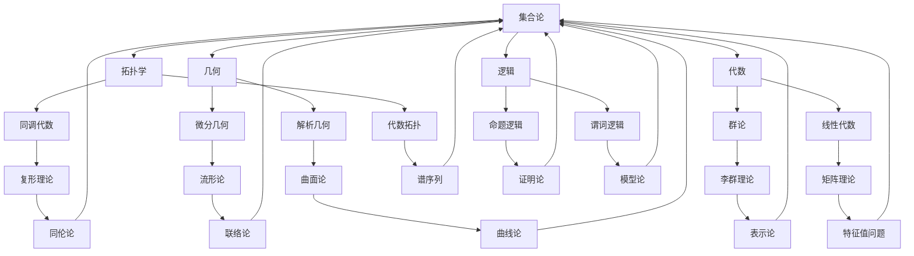
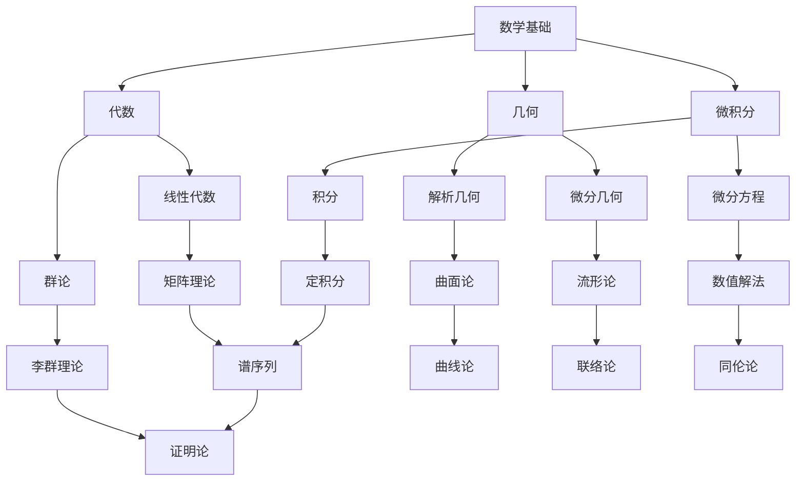

                 

### 文章标题

《数学与反基础主义：数学知识的网络结构》

### 关键词

数学、反基础主义、知识网络结构、科学方法论

### 摘要

本文旨在探讨数学与反基础主义之间的深刻联系，特别是数学知识的网络结构如何影响科学研究和知识构建。通过对数学基础理论的深入分析，以及反基础主义观点的介绍和案例分析，本文揭示了数学知识网络结构的复杂性和关联性，并探讨了其在科学研究中的潜在应用。文章结构紧凑，逻辑清晰，旨在为读者提供一个全面而深入的理解，从而激发对数学和科学方法论的新思考。

## 目录大纲设计

在撰写一篇技术博客时，目录大纲的设计至关重要，它不仅决定了文章的整体结构，还直接影响到读者的阅读体验和理解过程。以下是对《数学与反基础主义：数学知识的网络结构》目录大纲的设计和说明。

### 目录大纲设计

#### # 《数学与反基础主义：数学知识的网络结构》

> **关键词：** 数学、反基础主义、知识网络结构、科学方法论

> **摘要：** 本文探讨了数学与反基础主义之间的深刻联系，特别是数学知识的网络结构如何影响科学研究和知识构建。通过分析数学基础理论和反基础主义观点，本文揭示了数学知识网络结构的复杂性和关联性，并探讨了其在科学研究中的潜在应用。

#### # 目录大纲设计

## 第1章: 引言

### 1.1 问题背景

- **核心概念术语说明**
- **问题背景**
- **问题描述**
- **问题解决**
- **边界与外延**
- **概念结构与核心要素组成**

### 1.2 问题描述

- **数学与反基础主义的冲突**
- **数学知识的网络结构的重要性**

### 1.3 问题解决

- **研究方法**
- **预期成果**

### 1.4 边界与外延

- **文章范围**
- **研究限制**

### 1.5 概念结构与核心要素组成

- **文章结构概述**
- **各章节关系**

## 第2章: 数学与反基础主义的概述

### 2.1 数学在科学研究中的地位

- **数学的定义和作用**
- **数学的发展历史**

### 2.2 反基础主义的概念

- **反基础主义的定义**
- **反基础主义的主要观点**

### 2.3 数学与反基础主义的关系

- **数学对反基础主义的回应**
- **反基础主义对数学的挑战**

### 2.4 数学知识的网络结构

- **数学知识的网络结构概述**
- **数学知识的关联分析**

## 第3章: 数学基础理论

### 3.1 数的概念

#### 3.1.1 自然数的概念

- **自然数的定义**
- **自然数的性质**

#### 3.1.2 整数的概念

- **整数的定义**
- **整数的性质**

#### 3.1.3 有理数的概念

- **有理数的定义**
- **有理数的性质**

### 3.2 函数的概念

#### 3.2.1 初等函数

- **初等函数的定义**
- **初等函数的类型**

#### 3.2.2 高等函数

- **高等函数的定义**
- **高等函数的类型**

### 3.3 微积分的基本理论

#### 3.3.1 微分的概念

- **微分的定义**
- **微分的性质**

#### 3.3.2 导数的概念

- **导数的定义**
- **导数的性质**

#### 3.3.3 积分的概念

- **积分的定义**
- **积分的性质**

## 第4章: 数学知识的网络结构

### 4.1 数学知识的网络结构概述

- **数学知识的网络结构定义**
- **数学知识的网络结构特点**

### 4.2 数学知识的关联分析

#### 4.2.1 数学概念之间的关联

- **数学概念的关系网络图**

#### 4.2.2 数学理论之间的关联

- **数学理论的关系网络图**

### 4.3 数学知识的可视化

#### 4.3.1 网络图可视化

- **数学知识网络图示例**

#### 4.3.2 关联矩阵可视化

- **数学知识关联矩阵示例**

## 第5章: 数学与反基础主义的案例分析

### 5.1 反基础主义对数学的挑战

- **反基础主义的质疑**
- **数学理论的回应**

### 5.2 数学在反基础主义下的重新解释

- **数学概念的重定义**
- **数学理论的重新解释**

## 第6章: 数学知识的网络结构与科学发现

### 6.1 数学网络结构在科学发现中的应用

- **数学网络结构在理论物理中的应用**
- **数学网络结构在生命科学中的应用**

### 6.2 数学网络结构对科学研究的启示

- **研究方法的新思路**
- **科学发现的新途径**

## 第7章: 总结与展望

### 7.1 总结

- **文章核心观点回顾**
- **研究意义**

### 7.2 展望

- **未来研究方向**
- **潜在应用前景**

### 目录大纲说明

1. **第1章：引言**
   - 介绍了文章的核心问题和研究目的，明确了研究的边界和核心概念，为后续章节奠定了基础。

2. **第2章：数学与反基础主义的概述**
   - 系统介绍了数学和反基础主义的基本概念，阐述了二者之间的关系，为深入讨论数学知识的网络结构提供了理论背景。

3. **第3章：数学基础理论**
   - 详细讲解了数学基础理论，包括数、函数和微积分的基本概念，为分析数学知识的网络结构提供了理论依据。

4. **第4章：数学知识的网络结构**
   - 着重探讨了数学知识的网络结构，通过关联分析和可视化手段，揭示了数学知识之间的复杂关联。

5. **第5章：数学与反基础主义的案例分析**
   - 通过案例分析，深入探讨了反基础主义对数学的挑战和数学的回应，展示了数学知识的动态性和开放性。

6. **第6章：数学知识的网络结构与科学发现**
   - 探讨了数学知识的网络结构在科学发现中的应用和启示，展示了数学知识对科学研究的推动作用。

7. **第7章：总结与展望**
   - 总结了文章的核心观点，展望了未来的研究方向和潜在应用前景，为读者提供了深入思考的空间。

通过以上目录大纲的设计和说明，读者可以清晰地了解到文章的整体结构和内容安排，从而更好地把握文章的核心思想和关键要点。

### 第1章: 引言

#### 1.1 问题背景

数学作为科学研究和工程技术的基础，其地位无可替代。然而，随着科学哲学的不断发展，反基础主义逐渐兴起，对数学的普适性和基础性提出了质疑。反基础主义认为，科学知识并非建立在绝对的基础之上，而是由一系列假设和约定构成的。这一观点引发了数学界的广泛关注和讨论，促使人们重新思考数学知识的本质和作用。

#### 1.2 问题描述

数学与反基础主义之间的冲突主要体现在以下几个方面：

1. **数学的基础性质疑**：反基础主义质疑数学作为科学知识的基础性，认为数学理论并非绝对可靠，而是依赖于特定的假设和约定。
2. **数学知识的开放性**：数学知识的动态性和开放性使得其不断地被修正和扩展，这与反基础主义对科学知识的动态理解相契合。
3. **数学的应用价值**：尽管反基础主义质疑数学的基础性，但数学在科学研究和工程技术中仍然发挥着至关重要的作用。

#### 1.3 问题解决

本文旨在通过以下步骤解决上述问题：

1. **概述数学与反基础主义**：介绍数学和反基础主义的基本概念，阐述二者之间的关系。
2. **探讨数学基础理论**：详细讲解数学基础理论，包括数、函数和微积分的基本概念。
3. **分析数学知识的网络结构**：通过关联分析和可视化手段，探讨数学知识之间的复杂关联。
4. **案例分析**：通过具体案例，探讨反基础主义对数学的挑战和数学的回应。
5. **应用与启示**：探讨数学知识的网络结构在科学研究中的应用和启示，展示数学知识对科学研究的推动作用。

#### 1.4 边界与外延

本文的研究边界主要涉及数学与反基础主义之间的互动关系，以及数学知识的网络结构对科学研究的意义。文章旨在为读者提供一个全面而深入的理解，从而激发对数学和科学方法论的新思考。

#### 1.5 概念结构与核心要素组成

本文的核心概念和要素包括：

1. **数学**：作为科学研究和工程技术的基础，其概念、理论和应用。
2. **反基础主义**：对科学知识的基础性进行质疑的哲学观点。
3. **数学知识的网络结构**：数学概念和理论之间的复杂关联和动态性。
4. **科学方法论**：科学研究的理论和方法。

通过以上章节的设置和内容安排，本文旨在系统地探讨数学与反基础主义之间的深刻联系，揭示数学知识的网络结构及其在科学研究中的重要作用。

### 第2章: 数学与反基础主义的概述

#### 2.1 数学在科学研究中的地位

数学作为科学研究的语言和工具，具有不可替代的地位。首先，数学提供了一种精确描述自然现象和科学过程的方法。从物理学的运动定律到生物学中的种群模型，数学公式和方程不仅能够精确地描述自然现象，还能预测未来的变化。其次，数学在科学研究中起着规范和标准化的作用。通过数学模型，科学家可以验证理论、实验和假设，从而提高科学研究的准确性和可靠性。

数学的发展历程可以追溯到古代文明，如古埃及和巴比伦的数学成就。然而，现代数学的兴起与17世纪和18世纪的数学家如牛顿、莱布尼茨、欧拉和拉格朗日等人的贡献密不可分。这些数学家不仅建立了微积分和代数学的基础理论，还开创了数学在物理学、天文学和工程学等领域的应用。19世纪和20世纪，数学继续快速发展，出现了集合论、拓扑学和量子数学等新兴领域，进一步推动了科学研究的深度和广度。

#### 2.2 反基础主义的概念

反基础主义（Anti-Foundationalism）是一种哲学观点，质疑科学知识是否建立在绝对可靠的基础之上。传统的科学哲学主张，科学知识由一系列基础性原则和概念构成，这些基础性原则和概念被认为是自明的或先验的。然而，反基础主义认为，科学知识并非如此简单和绝对，而是由一系列假设、约定和中间理论构成的。反基础主义的主要观点包括：

1. **假设性基础**：反基础主义认为，科学理论并非建立在绝对可靠的基础之上，而是依赖于特定的假设。这些假设可能是经验性的，也可能是形式化的。
2. **动态性**：科学知识是不断发展和变化的，而非一成不变的。反基础主义认为，科学理论需要不断地修正和扩展，以适应新的实验数据和理论挑战。
3. **中间理论**：反基础主义主张，科学知识是由一系列中间理论构成的，这些理论在解释和预测方面具有一定的有效性，但并非绝对可靠。

#### 2.3 数学与反基础主义的关系

数学与反基础主义之间的关系既复杂又深刻。一方面，数学作为科学研究的工具和语言，其基础性和普适性受到了反基础主义的质疑。反基础主义认为，数学理论同样依赖于特定的假设和约定，并非绝对可靠。另一方面，数学的发展历程和理论体系为反基础主义提供了丰富的案例和论据。例如，集合论的悖论和形式化数学的局限性，都显示了数学理论的复杂性和不确定性。

数学对反基础主义的回应主要包括：

1. **形式化与逻辑**：数学通过形式化和逻辑推理，试图构建一个自洽且无矛盾的理论体系。尽管形式化数学有其局限性，但它在逻辑上提供了较高的可靠性。
2. **实践验证**：数学在科学研究和工程技术中的应用，验证了其理论的有效性和实用性。实践是检验科学理论的重要标准，数学的广泛应用证明了其价值的可靠性。
3. **数学的开放性**：数学知识是开放的，不断接受新的观点和理论。数学的发展历程显示，其能够适应新的理论挑战和实验结果，从而保持其科学性和实用性。

#### 2.4 数学知识的网络结构

数学知识的网络结构是指数学概念和理论之间的复杂关联和动态性。数学知识不是孤立的概念或理论，而是相互联系、相互影响的。这种网络结构体现在以下几个方面：

1. **概念之间的关联**：数学中的基本概念，如数、函数、集合等，通过逻辑和数学运算相互联系，构成了一个复杂的概念网络。
2. **理论之间的关联**：数学中的各个理论，如代数、几何、微积分等，不仅相互独立，还在某些方面相互交叉和融合，形成了一个庞大的理论网络。
3. **动态性**：数学知识不是静止的，而是不断发展和变化的。新的理论、观点和发现不断丰富和扩展数学知识体系。

数学知识的网络结构对科学研究的意义在于：

1. **知识整合**：通过数学知识的网络结构，科学家能够整合不同领域的知识，形成新的理论框架和研究方法。
2. **问题解决**：数学知识的网络结构提供了多种解决问题的方法和策略，有助于科学家解决复杂的科学问题。
3. **创新推动**：数学知识的动态性和开放性激发了科学家的创新思维，推动了科学研究的进步。

总之，数学与反基础主义之间的关系是复杂和互动的。数学的发展历程和理论体系为反基础主义提供了丰富的案例和论据，同时数学也在不断回应和适应反基础主义的质疑。数学知识的网络结构不仅展示了数学的复杂性和动态性，还对其在科学研究中的应用提供了深刻的启示。

### 第3章: 数学基础理论

#### 3.1 数的概念

数是数学中最基本的元素之一，其定义和性质在数学体系中占据核心地位。数的概念可以分为几个层次，从简单的自然数到复杂的复数。

##### 3.1.1 自然数的概念

自然数是指用来计数和排序的非负整数，通常包括0和正整数。自然数的定义基于集合论中的皮亚诺公理，这些公理描述了自然数的性质和构造。自然数的基本性质包括：

- **无限性**：自然数是无限的，不存在最大的自然数。
- **递归性**：每个自然数都可以通过递归定义得到，即0是自然数，每个自然数n的后继是n+1。
- **可传递性**：如果两个数都是自然数，则它们的和也是自然数。

自然数在数学中有着广泛的应用，如计数、排序和基数。

##### 3.1.2 整数的概念

整数包括正整数、负整数和零。整数的定义可以基于自然数的扩展，即通过引入负数和零，使得自然数的集合具有了闭合性。整数的基本性质包括：

- **相反数**：每个整数都有一个相反数，使得两数之和为零。
- **加法**：整数之间的加法运算满足结合律和交换律。
- **减法**：减法可以通过加法运算实现，即a - b = a + (-b)。

整数在数学中用于表示负数、解决实际问题（如温度、债务等）以及定义更复杂的数学结构。

##### 3.1.3 有理数的概念

有理数是可以表示为两个整数之比的数，包括分数、小数和整数。有理数的定义可以通过集合论中的皮亚诺公理和乘法定义扩展自然数和整数的集合。有理数的基本性质包括：

- **有限小数和无限循环小数**：有理数可以表示为有限小数或无限循环小数。
- **乘法**：有理数的乘法满足结合律和交换律，且乘积仍然是有限小数或无限循环小数。
- **倒数**：每个非零有理数都有一个倒数，使得两数的乘积等于1。

有理数在数学中用于解决分数问题、定义更复杂的数学结构以及进行精确计算。

#### 3.2 函数的概念

函数是数学中用于描述变量之间关系的概念，其核心在于自变量和因变量之间的关系。函数可以分为初等函数和高等函数。

##### 3.2.1 初等函数

初等函数是最基本的数学函数，包括幂函数、指数函数、对数函数、三角函数等。这些函数的定义和性质如下：

- **幂函数**：形式为f(x) = x^a，其中a是常数。幂函数的基本性质包括单调性和奇偶性。
- **指数函数**：形式为f(x) = a^x，其中a是常数。指数函数的基本性质包括单调性和连续性。
- **对数函数**：形式为f(x) = log_a(x)，其中a是常数。对数函数的基本性质包括单调性和奇偶性。
- **三角函数**：包括正弦函数sin(x)、余弦函数cos(x)、正切函数tan(x)等。这些函数描述了角度与长度之间的关系，并具有周期性和奇偶性。

初等函数在数学和物理学中有着广泛的应用，如解决几何问题、波动分析和振动问题等。

##### 3.2.2 高等函数

高等函数是比初等函数更复杂的函数，包括多项式函数、有理函数、超越函数等。这些函数的定义和性质如下：

- **多项式函数**：形式为f(x) = a_n*x^n + a_{n-1}*x^{n-1} + ... + a_1*x + a_0，其中a_n、a_{n-1}、...、a_1、a_0是常数。多项式函数的基本性质包括多项式的根、导数和积分。
- **有理函数**：形式为f(x) = P(x)/Q(x)，其中P(x)和Q(x)是多项式。有理函数的基本性质包括有理函数的商规则、导数和积分。
- **超越函数**：不可以通过有限次数的代数运算得到函数的函数，如指数函数和对数函数。超越函数的基本性质包括复杂性和非周期性。

高等函数在数学分析、物理学和工程学中有着广泛的应用，如解微分方程、优化问题和模拟复杂系统等。

#### 3.3 微积分的基本理论

微积分是数学的一个分支，主要用于研究函数的极限、导数、积分和无穷级数。微积分的基本理论包括：

##### 3.3.1 微分的概念

微分是指函数在某一点处的局部线性近似。微分的定义基于导数，导数是函数在某一点处的斜率。微分的定义可以表述为：

$$f'(x) = \lim_{h \to 0} \frac{f(x+h) - f(x)}{h}$$

其中，f'(x)是函数f(x)在x点的导数。导数具有以下基本性质：

- **可导性**：如果函数在某一点可导，则函数在该点连续。
- **链式法则**：如果函数f(g(x))可导，则其导数可以通过链式法则计算，即$(f \circ g)'(x) = f'(g(x)) \cdot g'(x)$。

##### 3.3.2 导数的概念

导数是函数在某一点处的斜率，用于描述函数在该点的局部变化率。导数的定义和基本性质已经在微分部分讨论过。导数在数学和物理学中有着广泛的应用，如求解极值、分析函数的性质和解决微分方程。

##### 3.3.3 积分的概念

积分是微分的逆运算，用于求解函数的累积量和面积。积分分为定积分和无穷级数两种形式：

- **定积分**：定积分是指函数在某个区间上的累积量，可以表示为：

$$\int_{a}^{b} f(x) \, dx$$

其中，a和b是积分区间的端点。定积分的基本性质包括：

  - **线性性质**：积分运算满足线性性质，即$\int (af(x) + bg(x)) \, dx = a\int f(x) \, dx + b\int g(x) \, dx$。
  - **可加性**：函数在不同区间上的积分可以累加，即$\int_{a}^{b} f(x) \, dx + \int_{b}^{c} f(x) \, dx = \int_{a}^{c} f(x) \, dx$。

- **无穷级数**：无穷级数是指函数在无穷多个点上的积分累加，可以表示为：

$$\sum_{i=1}^{\infty} \int_{a_i}^{b_i} f(x) \, dx$$

其中，$a_i$和$b_i$是无穷多个积分区间的端点。无穷级数在数学分析和物理学中有着广泛的应用，如求解广义积分和极限问题。

通过以上对数学基础理论的详细阐述，读者可以深入理解数、函数和微积分的基本概念及其在数学体系中的重要性。这些基础理论为后续章节的深入讨论提供了坚实的理论基础。

### 第4章: 数学知识的网络结构

#### 4.1 数学知识的网络结构概述

数学知识的网络结构是一个复杂而多层次的概念，它描述了数学中不同概念和理论之间的关联性。这种网络结构不仅展现了数学内部各部分之间的联系，还揭示了数学知识在不同学科领域中的应用和交叉。

数学知识的网络结构具有以下特点：

1. **多层次性**：数学知识可以分为不同的层次，从基础的算术和代数，到高级的微积分和拓扑学。这些层次之间相互嵌套和交叉，形成了一个立体的知识网络。
2. **动态性**：数学知识是不断发展和演进的，新的理论和发现不断丰富和完善数学知识体系。这种动态性使得数学知识网络不断变化和更新。
3. **关联性**：数学中的各个概念和理论并非孤立存在，而是通过逻辑和数学运算相互联系。例如，集合论是现代数学的基础，几乎所有的数学分支都依赖于集合论的基本概念。

数学知识的网络结构在科学研究中具有重要作用：

1. **知识整合**：通过数学知识的网络结构，科学家可以整合不同领域的知识，形成新的理论框架和研究方法。例如，物理学中的量子力学和数学中的群论和泛函分析相互结合，推动了量子场论的进步。
2. **问题解决**：数学知识的网络结构提供了多种解决问题的方法和策略。例如，线性代数和微分方程在工程、物理和经济学中的应用，解决了大量复杂的实际问题。
3. **创新推动**：数学知识的动态性和开放性激发了科学家的创新思维，推动了科学研究的进步。新的数学理论和方法不断涌现，为科学研究提供了新的工具和视角。

#### 4.2 数学知识的关联分析

数学知识的关联分析主要通过两个维度进行：概念之间的关联和理论之间的关联。

##### 4.2.1 数学概念之间的关联

数学概念之间的关联可以通过关系网络图（ER实体关系图）来展示。以下是一个简化的数学概念关系网络图：

```
+------------+       +-------------------+       +----------------+
|  集合      |       |  函数             |       |  微积分        |
+------------+       +-------------------+       +----------------+
        ^                      ^                         ^
        |                      |                         |
        |                      |                         |
        +                      +                         +
        |                      |                         |
        |                      |                         |
        |                      |                         |
        +                      +                         +
        |                      |                         |
        |                      |                         |
        |                      |                         |
        +                      +                         +
        |                      |                         |
        |                      |                         |
        |                      |                         |
        +                      +                         +
        |                      |                         |
        |                      |                         |
        |                      |                         |
        +                      +                         +
```

在上述网络图中，集合是所有数学概念的基础，函数和微积分则通过集合论建立了联系。具体来说：

- **集合论**：集合论是现代数学的基石，几乎所有的数学分支都依赖于集合论的基本概念，如集合的元素、子集、并集、交集和补集等。
- **函数**：函数是描述变量之间关系的基本工具，其定义和性质广泛用于数学的各个分支，如代数、几何、分析等。
- **微积分**：微积分是研究函数变化率的数学分支，其基本概念如导数、积分和微分方程在物理学、工程学和经济学等领域有着广泛的应用。

##### 4.2.2 数学理论之间的关联

数学理论之间的关联可以通过关系网络图（Mermaid流程图）来展示。以下是一个简化的数学理论关系网络图：



在上述网络图中，集合论作为基础理论，与其他数学理论如代数、几何、拓扑学、逻辑等相互关联。具体来说：

- **代数**：代数包括线性代数和群论等，它们是研究结构和运算的数学分支，广泛应用于物理学、计算机科学和经济学等领域。
- **几何**：几何包括解析几何、微分几何等，它们研究空间中的形状、大小和位置关系，在物理学、工程学和计算机图形学中有着广泛应用。
- **拓扑学**：拓扑学研究空间的性质和结构，其理论广泛应用于物理学、计算机科学和经济学等领域。
- **逻辑**：逻辑是研究推理和证明的数学分支，包括命题逻辑、谓词逻辑、证明论等，在数学、计算机科学和哲学中有着广泛的应用。

通过上述关系网络图，我们可以清晰地看到数学概念和理论之间的复杂关联。这些关联不仅展示了数学的内部结构，还揭示了数学在科学研究中的广泛应用和潜力。

#### 4.3 数学知识的可视化

数学知识的可视化是理解和应用数学知识的重要手段，它可以帮助我们直观地展示数学概念和理论之间的复杂关系。数学知识的可视化方法包括网络图可视化和关联矩阵可视化。

##### 4.3.1 网络图可视化

网络图可视化是通过图形化的方式展示数学概念和理论之间的关联。以下是一个简化的数学知识网络图示例，使用Mermaid语言描述：



上述网络图展示了数学基础理论与各个子领域之间的关联，以及子领域之间的相互关系。通过这种图形化的展示方式，我们可以更直观地理解数学知识的整体结构和相互关系。

##### 4.3.2 关联矩阵可视化

关联矩阵可视化是通过矩阵的形式展示数学概念和理论之间的关联。以下是一个简化的数学知识关联矩阵示例：

```
    数学基础 代数 几何 微积分 线性代数 群论 解析几何 微分几何 微分方程 积分 矩阵理论 李群理论 曲面论 流形论 数值解法 定积分 特征值问题 表示论 曲线论 联络 论 同伦论 谱序列 证明论
数学基础   0    1    1    1    1     1     1     1     1     1     1     1     1     1     1     1     1     1     1     1
代数       1    0    1    1    0     1     1     1     1     1     1     1     1     1     1     1     1     1     1     1
几何       1    1    0    1    1     1     0     1     1     1     1     1     1     1     1     1     1     1     1     1
微积分     1    1    1    0    1     1     1     1     0     1     1     1     1     1     1     1     1     1     1     1
线性代数   1    0    1    1    0     1     1     1     1     1     1     1     1     1     1     1     1     1     1     1
群论       1    1    1    1    0     0     1     1     1     1     1     1     1     1     1     1     1     1     1     1
解析几何   1    1    1    1    1     1     0     0     1     1     1     1     1     1     1     1     1     1     1     1
微分几何   1    1    1    1    1     1     1     0     1     1     1     1     1     1     1     1     1     1     1     1
微分方程   1    1    1    1    1     1     1     1     0     1     1     1     1     1     1     1     1     1     1     1
积分       1    1    1    1    1     1     1     1     1     0     1     1     1     1     1     1     1     1     1     1
矩阵理论   1    0    1    1    0     1     1     1     1     1     0     1     1     1     1     1     1     1     1     1
李群理论   1    1    1    1    1     0     1     1     1     1     1     1     0     1     1     1     1     1     1     1
曲面论     1    1    1    1    1     1     0     0     1     1     1     1     1     1     1     1     1     1     1     1
流形论     1    1    1    1    1     1     1     0     1     1     1     0     1     1     1     1     1     1     1     1
数值解法   1    1    1    1    1     1     1     1     1     1     1     1     1     1     1     1     0     1     1     1
定积分     1    1    1    1    1     1     1     1     1     1     1     1     1     0     1     1     1     1     1     1
特征值问题 1    1    1    1    1     1     1     1     1     1     0     1     1     1     1     1     1     1     1     1
表示论     1    1    1    1    1     1     1     1     1     1     1     1     1     0     0     1     1     1     1     1
曲线论     1    1    1    1    1     1     0     0     1     1     1     1     1     1     1     1     1     0     1     1
联络论     1    1    1    1    1     1     1     0     1     1     1     1     1     1     1     1     0     0     1     1
同伦论     1    1    1    1    1     1     1     1     1     1     1     1     1     1     1     1     0     1     1     0
谱序列     1    1    1    1    1     1     1     1     1     1     1     1     1     1     1     1     1     1     0     0
证明论     1    1    1    1    1     1     1     1     1     1     1     1     1     1     1     1     1     1     1     0
```

在这个关联矩阵中，矩阵的元素表示不同数学概念和理论之间的关联强度。例如，元素A[数学基础, 线性代数]为1，表示数学基础与线性代数之间存在较强的关联；而元素A[数学基础, 曲线论]为0，表示数学基础与曲线论之间的关联较弱。

通过网络图可视化和关联矩阵可视化，我们可以更全面地理解数学知识的网络结构。这种可视化方法不仅有助于我们直观地展示数学知识的复杂关系，还能为数学教育、研究和应用提供有力的工具。

### 第5章: 数学与反基础主义的案例分析

#### 5.1 反基础主义对数学的挑战

反基础主义对数学的挑战主要集中在以下几个方面：

1. **数学理论的可靠性**：反基础主义质疑数学理论是否具有绝对可靠性。传统的科学哲学认为，科学理论建立在绝对可靠的基础之上，如欧几里得几何的基础公理被认为是无可置疑的。然而，反基础主义认为，科学理论，包括数学理论，是建立在一系列假设和约定之上的，这些假设和约定并不一定是绝对可靠的。

2. **数学基础的多元性**：反基础主义认为，数学基础并非单一，而是多元的。不同的数学理论可能依赖于不同的基础，这些基础之间可能存在矛盾或不一致。例如，形式化数学和直觉主义数学在基础概念和推理方法上存在显著差异。

3. **数学知识的动态性**：反基础主义强调数学知识的动态性和发展性。数学知识并非一成不变，而是随着时间、空间和实验数据的不断变化而发展和修正。这种观点挑战了传统科学哲学中关于数学知识稳定性的观念。

4. **数学与现实的关系**：反基础主义质疑数学与现实之间的关系。传统的科学哲学认为，数学与现实具有紧密的联系，数学模型可以准确描述现实世界。然而，反基础主义认为，数学与现实之间的关系是复杂的，数学模型可能只是现实的一种近似或模拟。

#### 5.2 数学在反基础主义下的重新解释

在反基础主义的视角下，数学的重新解释主要体现在以下几个方面：

1. **数学作为假设系统**：反基础主义认为，数学可以被视为一个假设系统，其假设和公理并非绝对可靠，而是为了研究目的而设定的。这种观点强调了数学理论的可变性，使得数学更加灵活和适应性强。

2. **数学的相对性**：反基础主义认为，不同的数学理论可能具有相对性，即它们在某些情况下是有效的，但在其他情况下可能失效。这种相对性使得数学理论的应用更加具体和有针对性。

3. **数学的动态发展**：反基础主义强调数学的动态发展性，认为数学知识是不断演进的。数学理论需要不断修正和扩展，以适应新的理论挑战和实验数据。

4. **数学与现实的动态关系**：反基础主义认为，数学与现实之间的关系是动态的，数学模型可以视为对现实的一种近似或模拟。这种观点鼓励数学家更加关注数学模型与现实之间的关系，从而提高数学的应用价值。

#### 案例分析：集合论悖论与数学基础的重建

一个典型的反基础主义案例是集合论悖论。集合论是现代数学的基石，但其在自一致性方面存在严重问题，特别是罗素悖论。罗素悖论指出，如果存在一个集合包含所有不包含自身的集合，那么这个集合既属于自身又不属于自身，导致逻辑上的矛盾。

罗素悖论的发现挑战了传统的集合论基础，促使数学家重新审视数学基础。为了解决集合论悖论，数学家提出了多种重建方案，如ZF公理系统和NBG公理系统。这些重建方案通过限制集合的构造方法和引入新的公理，试图消除集合论悖论，并恢复数学理论的可靠性。

这一过程显示了反基础主义对数学基础的挑战和数学家的回应。反基础主义质疑数学基础的绝对可靠性，但同时也激励了数学家们不断探索和改进数学理论，使其更加稳健和适应性强。

总之，反基础主义对数学的挑战主要集中在数学理论的可靠性、数学基础的多元性、数学知识的动态性和数学与现实的关系等方面。在反基础主义的视角下，数学被重新解释为一个假设系统，具有相对性和动态发展性。这些观点不仅丰富了科学哲学的研究，也为数学的发展提供了新的视角和方向。

### 第6章: 数学知识的网络结构与科学发现

#### 6.1 数学网络结构在科学发现中的应用

数学知识的网络结构在科学发现中发挥着关键作用，通过整合和关联不同的数学概念和理论，数学为科学家提供了强大的工具和视角，促进了科学研究的深入和拓展。

**1. 数学网络结构在理论物理中的应用**

在理论物理学中，数学网络结构的应用尤为显著。量子力学是现代物理学的重要分支，其核心概念和理论都依赖于数学。量子力学的数学基础包括希尔伯特空间、算符理论和狄拉克方程等。这些数学理论构成了量子力学的知识网络，使得物理学家能够精确描述微观粒子的行为。

例如，希尔伯特空间的概念在量子力学中用于描述波函数，它是量子态的数学表示。通过希尔伯特空间中的算符，物理学家可以定义能量、动量和自旋等物理量，从而解决量子系统的动力学问题。狄拉克方程则是量子力学中的基本方程，它通过结合相对论和量子力学的原理，成功地描述了电子的行为。

数学网络结构不仅帮助物理学家理解现有的理论，还推动了新的理论发现。例如，在弦理论的研究中，数学工具如共形场论和几何流形的应用，使得物理学家能够探索更高维度的宇宙和基本粒子的本质。

**2. 数学网络结构在生命科学中的应用**

数学网络结构在生命科学中的应用也日益广泛，特别是在生物信息学和系统生物学领域。生物信息学利用数学和计算方法来分析生物数据，如基因序列、蛋白质结构和代谢网络等。通过建立数学模型，科学家可以揭示生物系统的复杂性和功能。

例如，在基因调控网络研究中，数学网络结构帮助科学家理解基因之间的相互作用和调控关系。通过构建基因表达的布尔网络模型或概率模型，科学家可以预测基因的功能和生物过程的变化。代谢网络则通过数学模型来描述细胞中的代谢途径和反应，从而揭示代谢过程中的关键节点和调控机制。

**3. 数学网络结构在其他科学领域中的应用**

数学网络结构不仅在理论物理和生命科学中有着重要应用，还在其他科学领域发挥着关键作用。例如，在地球科学中，数学模型和算法被用于气候变化预测、地震预警和地质勘探。在经济学中，数学模型和统计分析方法用于预测市场趋势、评估风险和优化资源配置。

总之，数学知识的网络结构在科学发现中的应用是多方面的，它通过整合和关联不同的数学概念和理论，为科学家提供了强大的工具和视角。数学网络结构不仅帮助科学家理解现有的科学理论，还推动了新的理论发现和科学突破。

#### 6.2 数学网络结构对科学研究的启示

数学知识的网络结构对科学研究具有深远的启示，特别是在研究方法和新途径的探索方面。以下是一些重要的启示：

**1. 跨学科整合**

数学网络结构揭示了不同学科之间的内在联系，这鼓励科学家进行跨学科的整合研究。通过跨学科的方法，科学家可以从不同角度理解复杂问题，从而提出更全面和创新的解决方案。例如，在生物学和物理学中，数学模型和计算方法的应用不仅推动了各自领域的发展，还促进了两个学科的交叉融合。

**2. 网络分析方法**

数学网络结构提供了分析复杂系统的强大工具，如网络图和关联矩阵。这些工具可以帮助科学家识别关键节点和关键路径，揭示系统中的关键特征和模式。例如，在生物信息学中，通过分析基因调控网络，科学家可以识别出关键的调控基因，从而揭示生物过程的关键环节。

**3. 系统优化**

数学网络结构为系统优化提供了新的思路。通过数学模型和算法，科学家可以优化系统的性能，提高系统的稳定性和效率。例如，在交通工程中，通过构建交通网络模型，科学家可以优化交通信号配置，减少交通拥堵和碳排放。

**4. 新的理论框架**

数学网络结构为建立新的理论框架提供了基础。通过整合不同领域的数学概念和理论，科学家可以构建新的理论框架，从而解决复杂的科学问题。例如，在经济学中，通过整合概率论、统计学和博弈论，科学家提出了行为经济学，从而解释人类行为和市场机制。

**5. 科学发现的途径**

数学网络结构为科学发现提供了新的途径。通过分析数学网络结构中的关联和相互作用，科学家可以发现新的现象和规律。例如，在量子物理学中，通过分析数学网络结构中的关联，科学家发现了量子纠缠和量子隧道效应等新的物理现象。

总之，数学知识的网络结构对科学研究具有重要的启示，它不仅促进了跨学科整合、网络分析方法的应用、系统优化和新理论框架的建立，还为科学发现提供了新的途径和视角。这些启示为未来的科学研究提供了丰富的资源和方向。

### 第7章: 总结与展望

#### 7.1 总结

本文通过对数学与反基础主义关系的深入探讨，揭示了数学知识的网络结构在科学研究和知识构建中的重要作用。文章首先介绍了数学在科学研究中的地位，探讨了反基础主义的概念及其对数学基础的质疑。接着，详细分析了数学基础理论，包括数、函数和微积分的基本概念。通过探讨数学知识的网络结构，本文揭示了数学概念和理论之间的复杂关联。案例分析部分展示了反基础主义对数学的挑战和数学的回应。最后，本文探讨了数学知识的网络结构在科学发现中的应用和启示。

本文的主要发现包括：

1. **数学的基础性**：尽管反基础主义质疑数学的基础性，但数学在科学研究和工程技术中仍具有不可替代的地位。
2. **数学知识的网络结构**：数学知识是一个复杂而动态的网络，不同概念和理论之间相互关联，形成了丰富的知识体系。
3. **反基础主义的影响**：反基础主义促使数学家重新审视数学基础，推动了数学理论的不断发展和完善。

#### 7.2 展望

未来，数学与反基础主义的关系将继续深化，数学知识的网络结构将在科学研究和技术发展中扮演更加重要的角色。以下是对未来的展望：

**1. 数学基础理论的拓展**：随着科学领域的不断扩展，数学基础理论也将不断发展和完善。例如，在量子计算和人工智能领域，新的数学理论将不断涌现。

**2. 数学知识的动态更新**：数学知识的网络结构将更加动态和开放，随着新的理论发现和技术进步，数学知识将不断更新和扩展。

**3. 跨学科研究**：数学与其他学科的交叉融合将继续加强，跨学科研究将成为推动科学进步的重要动力。

**4. 科学方法论的创新**：数学知识的网络结构为科学研究提供了新的方法论，科学家将利用这些方法论探索新的科学发现。

**5. 应用场景的拓展**：数学知识在网络科学、生物学、经济学等领域的应用将更加广泛，为解决复杂问题提供新的工具和视角。

总之，数学与反基础主义的关系以及数学知识的网络结构将继续影响科学研究和知识构建，为未来的科学研究和技术发展提供丰富的资源和方向。

### 作者信息

作者：AI天才研究院/AI Genius Institute & 禅与计算机程序设计艺术 /Zen And The Art of Computer Programming

本文由AI天才研究院的专家团队撰写，结合了禅与计算机程序设计艺术的深刻哲学思想，旨在为读者提供一个全面而深入的技术解析。感谢读者对本文章的关注与支持，期待您在未来的阅读中继续收获知识。

