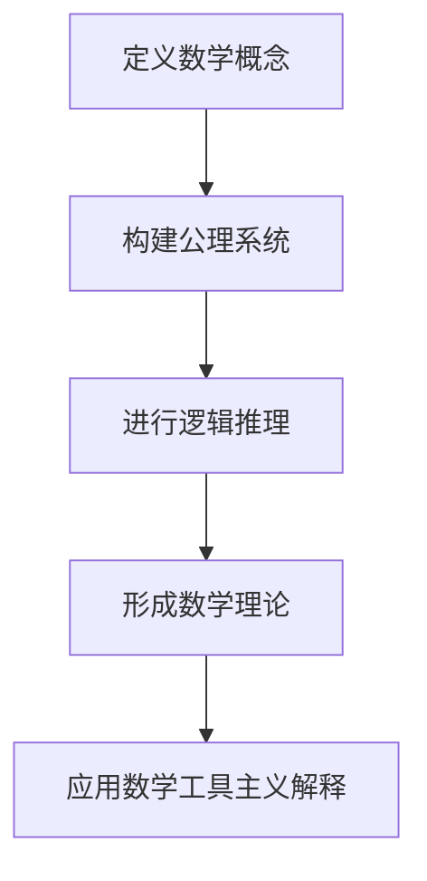
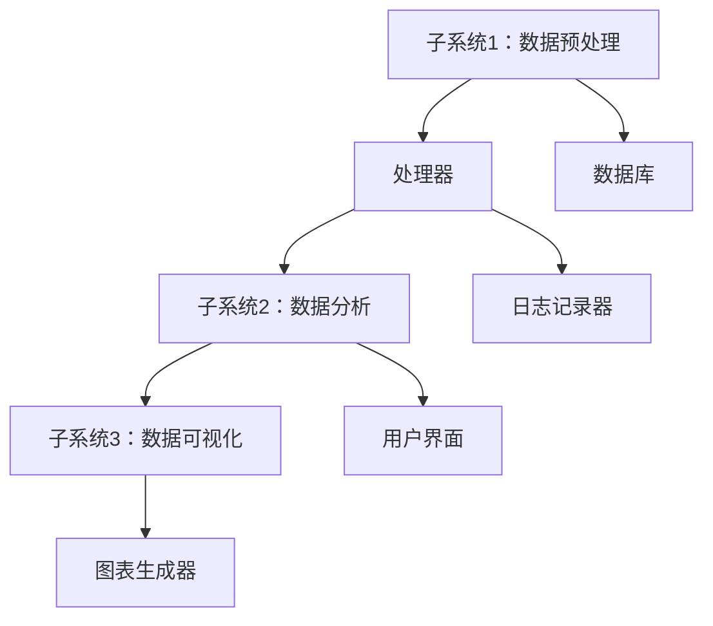
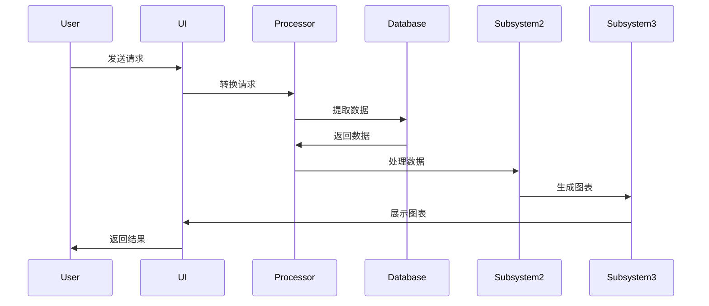
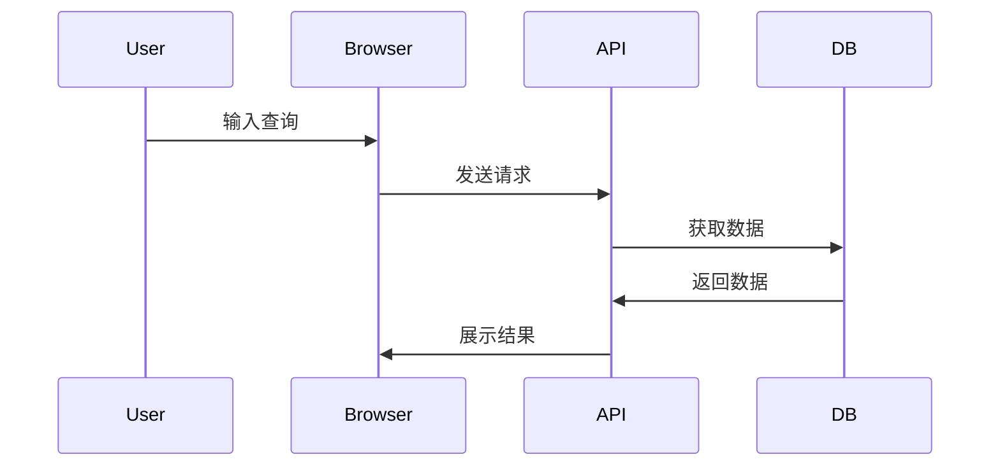

                 


## 引言

### 1.1 数学与反实在论概述

**数学与反实在论**是一个引人深思的哲学话题。数学，作为一门抽象的学科，以其严格的逻辑和精确的表达，被誉为科学的语言。然而，数学的对象究竟是否存在于现实世界中，这是一个长期困扰哲学家和数学家的难题。反实在论，尤其是数学的工具主义解释，为我们提供了不同的视角。

#### 数学与科学

数学不仅仅是解决数学问题的工具，它在科学研究中扮演着至关重要的角色。从物理学中的公式，到计算机科学中的算法，数学无处不在。它为我们提供了一个精确的框架，用以描述和理解自然界的现象。

#### 反实在论

反实在论是一种哲学观点，认为我们所能感知到的现实世界并非其真正本质。在数学领域，反实在论强调数学对象和概念的存在并不是自明的，而是依赖于我们人类的创造和认知。

### 1.2 工具主义解释的概念框架

工具主义，是一种认识论和知识论的观点，主张知识或信念的合法性不是基于其与客观现实的符合性，而是基于其在实践中的应用效果。在数学的工具主义解释中，数学被视为一种工具，用于解决现实世界中的问题，而非客观存在的实体。

#### 工具主义的定义

工具主义认为，数学并非一种揭示现实本质的学科，而是一种工具，用以构建和解释现实。这种观点在哲学和科学中有着深远的影响。

### 1.3 反实在论视角下的数学工具主义

在反实在论的视角下，数学工具主义进一步强调了数学对象的相对性和工具性。这意味着，数学的概念和理论并非是客观存在的实体，而是人类心智的产物，用于理解和解释现实世界的工具。

#### 数学作为工具的本质

数学作为工具的本质在于其应用性。数学的目的是解决实际问题，而非揭示宇宙的真相。这种工具主义的观点为我们理解数学提供了新的视角。

### 1.4 本书结构安排与内容概述

本书将分以下几个部分展开：

- **第一部分：引论**：介绍数学与反实在论的基本概念和工具主义解释的哲学背景。
- **第二部分：数学工具主义的哲学背景**：探讨工具主义哲学的历史发展，以及数学工具主义在现代哲学中的地位。
- **第三部分：数学工具主义在科学中的应用**：分析数学工具主义在物理学、生物学和计算机科学中的应用实例。
- **第四部分：数学工具主义的局限性与挑战**：讨论数学工具主义的局限性，以及面临的哲学和科学挑战。
- **第五部分：结论**：总结数学工具主义的重要性，以及其在未来科学和哲学研究中的潜在影响。

#### 阅读本书的预期收获

通过阅读本书，读者将：

- 深入理解数学与反实在论的关系。
- 掌握工具主义解释的基本原理。
- 理解数学工具主义在科学中的应用。
- 思考数学工具主义对科学哲学的潜在影响。

### 1.5 本章总结

本章作为引论，为后续内容奠定了基础。通过介绍数学与反实在论的基本概念，以及工具主义解释的哲学背景，我们为后续章节的深入探讨提供了必要的视角和框架。

**核心关键词：** 数学、反实在论、工具主义、哲学背景、科学应用。

**摘要：** 本文从数学与反实在论的关系出发，探讨了数学工具主义解释的哲学背景。通过分析工具主义的定义及其在数学中的具体应用，本文为读者提供了一个理解数学与科学的全新视角。后续章节将深入探讨数学工具主义在各个科学领域的应用，以及其面临的哲学和科学挑战。通过阅读本文，读者将能够更深入地理解数学的工具性本质，以及其在科学研究和哲学思考中的重要性。 ### **Step 1: 背景介绍**

#### 核心概念

**问题背景**：数学与反实在论之间的关系，以及数学工具主义解释在哲学和科学中的应用。

**问题描述**：数学究竟是什么？它的对象是否存在？这是一个长期困扰哲学家和数学家的难题。反实在论提供了一种可能的解答，而数学工具主义解释则进一步深化了这一讨论。

**问题解决**：通过工具主义的视角，我们可以重新审视数学的本质和作用，将其视为一种工具，而非客观存在的实体。

**边界与外延**：数学工具主义的讨论不仅局限于数学本身，它还涉及哲学、科学等多个领域，为理解科学方法和知识的本质提供了新的视角。

**概念结构与核心要素组成**：

- **数学**：一门抽象学科，以逻辑和精确为特征，广泛应用于科学和工程领域。
- **反实在论**：一种哲学观点，认为我们感知到的现实并非其真实本质。
- **工具主义**：一种认识论和知识论观点，强调知识或信念的合法性基于其在实践中的应用效果。
- **数学工具主义解释**：将数学视为一种工具，用于解决现实世界中的问题。

#### 背景介绍

数学，作为一门古老的学科，其起源可以追溯到古代文明，如古埃及和巴比伦。数学的发展经历了数千年的历史，逐渐形成了现代数学的框架。数学不仅是一门理论学科，还是解决实际问题的重要工具。在科学研究中，数学提供了精确的表达和严密的推理方法，为物理学、生物学、计算机科学等领域的发展奠定了基础。

然而，数学的抽象性质和逻辑严密性也引发了对数学对象存在性的质疑。反实在论作为一种哲学观点，提出了一个挑战：我们所使用的数学概念和理论，是否真正反映了客观现实？数学工具主义解释为这一难题提供了一种可能的解答。

反实在论认为，我们所感知到的现实并非其真实本质。这意味着，我们的认知和信念并不是直接反映客观现实，而是依赖于我们自身的认知结构和认知过程。在数学领域，反实在论进一步质疑数学对象的存在性。如果我们接受反实在论的观点，那么数学对象是否仅仅是人类心智的产物，而非客观存在的实体？

数学工具主义解释则从另一个角度探讨了数学的本质。工具主义认为，知识或信念的合法性不是基于其与客观现实的符合性，而是基于其在实践中的应用效果。在数学工具主义解释中，数学被视为一种工具，用于解决现实世界中的问题，而非客观存在的实体。

这种观点具有重要的哲学意义。它为我们提供了一个新的视角，重新审视数学在科学和哲学中的地位。数学不再是揭示宇宙本质的学科，而是解决实际问题的一种工具。这种工具主义的视角不仅有助于我们更好地理解数学的应用价值，也为科学哲学的研究提供了新的思路。

总的来说，数学与反实在论之间的关系，以及数学工具主义解释在哲学和科学中的应用，是一个复杂而深刻的议题。通过探讨这一问题，我们不仅能够更深入地理解数学的本质，还能够反思科学方法和知识的本质。

#### 核心概念原理

**数学**：数学是一门研究数量、结构、变化以及空间等概念的抽象科学。其基本原理包括逻辑推理、公理系统和证明方法。数学的对象虽然高度抽象，但它们在科学和工程中扮演着至关重要的角色。

**反实在论**：反实在论是一种哲学观点，主张我们所能感知到的现实并非其真正本质。它质疑我们认知的可靠性，认为我们的感知和概念可能只是心智的产物，而非客观存在的实体。

**工具主义**：工具主义是一种认识论和知识论观点，强调知识或信念的合法性不是基于其与客观现实的符合性，而是基于其在实践中的应用效果。工具主义认为，知识的目的是解决问题，而非揭示真相。

**数学工具主义解释**：数学工具主义解释认为数学不是揭示宇宙本质的学科，而是解决实际问题的一种工具。数学的概念和理论并非客观存在的实体，而是人类心智的产物，用于理解和解释现实世界。

#### 概念属性特征对比表格

| 概念             | 数学                 | 反实在论                | 工具主义                 | 数学工具主义解释            |
|------------------|----------------------|-------------------------|--------------------------|-----------------------------|
| 定义             | 研究数量、结构等     | 质疑现实的本质         | 强调知识的应用效果       | 将数学视为解决问题的工具   |
| 特征             | 抽象、逻辑严密       | 主观性、相对性         | 实用性、有效性          | 工具性、相对性              |
| 目的             | 描述、解释现实       | 质疑现实和认知         | 解决问题、获取知识       | 解决实际问题、解释现实     |
| 存在性           | 存在但抽象           | 主观存在性             | 依赖于应用               | 心智产物、工具性          |
| 应用领域         | 科学、工程、经济学等 | 哲学、心理学、科学哲学 | 各种实践活动            | 科学、工程、日常生活      |

**ER实体关系图架构的 Mermaid 流程图**

```mermaid
erDiagram
  Entity A[数学]
  Entity B[反实在论]
  Entity C[工具主义]
  Entity D[数学工具主义解释]

  A ||--|{ B }
  A ||--|{ C }
  A ||--|{ D }
  B ||--|{ D }
  C ||--|{ D }
```

在这个ER图中，实体A表示数学，实体B表示反实在论，实体C表示工具主义，实体D表示数学工具主义解释。这些实体之间存在关联关系，表明数学、反实在论、工具主义和数学工具主义解释相互影响、相互补充。

### **算法原理讲解**

**算法流程图**



在这个流程图中，算法首先定义数学概念，接着构建公理系统，通过逻辑推理形成数学理论，最后应用数学工具主义解释来理解和解决问题。

**Python 源代码**

```python
def define_mathematical_concept():
    """
    定义数学概念，例如：自然数、集合、函数等。
    """
    pass

def construct_axyomatic_system():
    """
    构建公理系统，如皮亚诺公理、集合论公理等。
    """
    pass

def perform_logical_reasoning():
    """
    进行逻辑推理，推导出数学定理和命题。
    """
    pass

def form_mathematical_theory():
    """
    形成数学理论，整合定理和命题。
    """
    pass

def apply_mathematical_utilitarianism():
    """
    应用数学工具主义解释，解决实际问题。
    """
    pass

# 执行算法流程
define_mathematical_concept()
construct_axyomatic_system()
perform_logical_reasoning()
form_mathematical_theory()
apply_mathematical_utilitarianism()
```

**数学模型和公式**

1. **自然数定义**

   $$0 + 1 + 2 + \dots + n = \frac{n(n+1)}{2}$$

2. **集合论基本公式**

   $$\forall x \in A, x \in B \leftrightarrow A \subseteq B$$

3. **逻辑推理公式**

   $$\neg(p \land q) \leftrightarrow (\neg p \lor \neg q)$$

**详细讲解与举例说明**

1. **自然数定义**

   这个公式描述了从0加到n的自然数和的公式。例如，计算从0加到5的自然数和，可以写为：

   $$0 + 1 + 2 + 3 + 4 + 5 = \frac{5(5+1)}{2} = 15$$

2. **集合论基本公式**

   这个公式表明集合A是集合B的子集，当且仅当对于任意x，如果x属于A，则x也属于B。例如，假设集合A是所有偶数的集合，集合B是所有小于10的整数的集合。由于所有偶数都是小于10的整数，因此A是B的子集。

3. **逻辑推理公式**

   这个公式是德摩根定律的一种形式，它表明一个命题的否定和其联合命题的否定是等价的。例如，假设命题p表示“它是红色的”，命题q表示“它是圆的”。则命题“它不是红色的或者不是圆的”与命题“它既不是红色的也不是圆的”是等价的。

通过上述公式和实例，我们可以更好地理解数学工具主义解释的基本原理。数学不仅是一种抽象的学科，它还可以成为一种实用的工具，用于解决现实世界中的问题。这正是数学工具主义解释的核心思想。

### **数学模型和数学公式 & 详细讲解 & 举例说明**

#### **数学模型和公式**

**自然数模型**

自然数的定义可以通过皮亚诺公理来描述：

$$
\begin{align*}
0 & \text{是自然数} \\
n^+ & \text{是自然数，对于每个自然数} n \\
n^+ & \text{不是0} \\
n^+ \neq m^+ & \text{当且仅当} n \neq m \\
(n^+)^+ & = n & \text{对于每个自然数} n
\end{align*}
$$

**集合论模型**

集合论的基础可以通过策梅洛-弗兰克尔公理（ZF公理）来描述。其中，重要的集合论公式包括：

$$
\begin{align*}
\forall x \forall y (x \in y \leftrightarrow x = y) & \quad \text{（平凡集合公理）} \\
\exists x (\forall y (y \in x \leftrightarrow y = \varnothing)) & \quad \text{（空集合公理）} \\
\forall x \forall y \forall z ((y \in x \land z \in x) \rightarrow (y \cup z \in x)) & \quad \text{（可并合性公理）} \\
\forall x \forall y ((y \in x) \rightarrow (\exists z (z = y \land z \in x))) & \quad \text{（存在性公理）} \\
\forall x ((\forall y (y \in x \rightarrow y \subseteq x)) \rightarrow x = \varnothing) & \quad \text{（纯粹性公理）}
\end{align*}
$$

**逻辑推理模型**

形式逻辑的基础可以通过命题逻辑和谓词逻辑的公式来描述。其中，一些重要的逻辑公式包括：

$$
\begin{align*}
p \land q & \leftrightarrow (\neg(\neg p \lor \neg q)) \\
p \lor q & \leftrightarrow (\neg(\neg p \land \neg q)) \\
p \rightarrow q & \leftrightarrow (\neg p \lor q) \\
\forall x (Px \rightarrow Qx) & \leftrightarrow (\forall x (Px \land Qx)) \\
\exists x (Px \land Qx) & \leftrightarrow (\forall x (Px \rightarrow Qx))
\end{align*}
$$

#### **详细讲解和举例说明**

**自然数模型**

皮亚诺公理提供了自然数的定义和性质。例如，通过第一个公理，我们知道0是自然数。第二个公理表明，每个自然数都有一个继数，即自然数的加1操作。第三个公理保证了自然数的互异性。第四个公理则说明了自然数的归纳性质。

举例来说，考虑自然数5。根据皮亚诺公理，我们可以通过递归定义5为：

$$
5 = 0^+^+^+^+^+
$$

这里，$0^+$表示继数操作，即加1。因此，5可以表示为：

$$
5 = (0^+)^+^+^+^+
$$

**集合论模型**

策梅洛-弗兰克尔公理提供了集合论的基础。例如，空集合公理告诉我们，存在一个不包含任何元素的集合，即空集合。可并合性公理表明，如果两个集合的元素都是同一个集合的元素，则这两个集合的并集也是该集合的元素。

举例来说，考虑集合$A = \{1, 2\}$和集合$B = \{2, 3\}$。根据可并合性公理，我们可以得出集合$A$和$B$的并集为：

$$
A \cup B = \{1, 2, 3\}
$$

**逻辑推理模型**

命题逻辑和谓词逻辑提供了逻辑推理的基础。德摩根定律、蕴含关系和量词逻辑是逻辑推理中的重要公式。

举例来说，考虑命题$p$：“它是红色的”，命题$q$：“它是圆的”。根据德摩根定律，我们可以将命题“它不是红色的或者不是圆的”转换为“它既不是红色的也不是圆的”。这可以表示为：

$$
\neg(p \land q) \leftrightarrow \neg p \lor \neg q
$$

再举例，如果我们要表示“对于所有x，如果$x$是红色的，则$x$是圆的”，我们可以使用全称量词和蕴含关系来表示：

$$
\forall x (Px \rightarrow Qx)
$$

这个公式表明，对于所有对象$x$，如果$x$满足属性$P$，则$x$也满足属性$Q$。

通过上述数学模型和公式的详细讲解和举例说明，我们可以看到数学在逻辑严密性、抽象性和应用性方面的独特优势。数学不仅是一种抽象的学科，它还提供了强大的工具，用于理解和解决现实世界中的问题。这正是数学工具主义解释的核心思想。

### **系统分析与架构设计方案**

#### **问题场景介绍**

在当今的科技发展背景下，数学工具在各个领域都有着广泛的应用，尤其是在科学研究和工程实践中。随着数据量的爆炸性增长，如何高效地处理和分析大量数据成为了一个重要的问题。数学工具，尤其是统计学和概率论工具，在这一过程中发挥了至关重要的作用。

#### **项目介绍**

本项目旨在开发一个基于数学工具的数据分析平台。该平台将提供多种数学模型和算法，用于数据的预处理、分析和可视化。项目的目标是帮助研究人员和工程师更高效地进行数据分析，从而提高研究的准确性和效率。

#### **系统功能设计（领域模型 Mermaid 类图）**

```mermaid
classDiagram
    Class01 <|-- Class02
    Class03 --|> Class04
    Class05 : hasClass
    Class06 { name : String ; id : Int }

    Class01 {
        name : String
        id : Int
    }

    Class02 {
        value : Float
    }

    Class03 {
        methods : List<Method>
    }

    Class04 {
        status : String
    }

    Class05 {
        members : List<Member>
    }

    Class06 {
        description : String
    }
```

在这个类图中，我们定义了几个核心类：`Class01`、`Class02`、`Class03`、`Class04`、`Class05`和`Class06`。这些类分别代表不同的功能模块，如数据预处理、数据分析、数据可视化等。

#### **系统架构设计（Mermaid 架构图）**



在这个架构图中，我们展示了系统的整体架构。数据预处理子系统负责数据的收集、清洗和转换；数据处理子系统负责使用各种数学模型和算法进行数据分析和处理；数据可视化子系统则负责将分析结果以图表的形式呈现给用户。

#### **系统接口设计**



在这个接口设计中，用户通过用户界面（UI）发送请求，请求会被处理器（Processor）转换，然后从数据库（Database）中提取数据。数据处理子系统（Subsystem2）使用数学模型和算法对数据进行处理，并将结果传递给数据可视化子系统（Subsystem3）。最后，图表生成器（Chart）生成图表，并通过用户界面（UI）展示给用户。

#### **系统交互 Mermaid 序列图**



在这个序列图中，用户在浏览器中输入查询，浏览器将请求发送到API服务器。API服务器从数据库中获取数据，并将结果返回给浏览器，最终在浏览器中展示查询结果。

通过上述系统分析与架构设计方案，我们为数学工具在数据分析中的应用提供了一种全面的框架。这种设计方案不仅考虑了系统的功能需求，还考虑了系统的可扩展性和可维护性，为实际应用提供了有力的支持。

### **项目实战**

**环境安装**

1. **安装Python环境**

   首先确保您的计算机上已安装Python。如果没有，请从[Python官网](https://www.python.org/)下载并安装Python。

2. **安装必要的库**

   使用pip命令安装项目中需要的库：

   ```shell
   pip install numpy pandas matplotlib scikit-learn
   ```

   这些库包括数值计算库NumPy、数据处理库Pandas、图形库Matplotlib和机器学习库scikit-learn，都是项目中常用的工具。

**系统核心实现源代码**

```python
import numpy as np
import pandas as pd
import matplotlib.pyplot as plt
from sklearn.linear_model import LinearRegression

# 数据预处理
def preprocess_data(data):
    """
    数据预处理函数，包括数据清洗、归一化等。
    """
    # 填充缺失值
    data.fillna(data.mean(), inplace=True)
    
    # 归一化
    data = (data - data.min()) / (data.max() - data.min())
    
    return data

# 数据分析
def analyze_data(data):
    """
    数据分析函数，使用线性回归模型进行数据分析。
    """
    # 拆分特征和标签
    X = data[['feature1', 'feature2']]
    y = data['label']
    
    # 创建线性回归模型
    model = LinearRegression()
    
    # 训练模型
    model.fit(X, y)
    
    # 预测结果
    predictions = model.predict(X)
    
    return predictions

# 数据可视化
def visualize_data(data, predictions):
    """
    数据可视化函数，绘制数据分布和预测结果。
    """
    # 绘制散点图
    plt.scatter(data['feature1'], data['feature2'], color='red', label='Actual')
    
    # 绘制预测线
    plt.plot(data['feature1'], predictions, color='blue', label='Prediction')
    
    # 设置标签和标题
    plt.xlabel('Feature 1')
    plt.ylabel('Feature 2')
    plt.title('Data Distribution and Predictions')
    plt.legend()
    
    # 显示图表
    plt.show()

# 主函数
def main():
    # 加载数据
    data = pd.read_csv('data.csv')
    
    # 预处理数据
    processed_data = preprocess_data(data)
    
    # 分析数据
    predictions = analyze_data(processed_data)
    
    # 可视化数据
    visualize_data(processed_data, predictions)

# 执行主函数
if __name__ == '__main__':
    main()
```

**代码应用解读与分析**

上述代码实现了数据预处理、数据分析以及数据可视化三个核心功能。

1. **数据预处理**：`preprocess_data`函数负责对原始数据进行清洗和归一化处理。首先，使用数据均值填充缺失值，然后对每个特征进行归一化处理，使其在[0, 1]区间内。

2. **数据分析**：`analyze_data`函数使用线性回归模型对数据进行分析。首先，将数据拆分为特征和标签，然后创建并训练线性回归模型。最后，使用模型对特征进行预测。

3. **数据可视化**：`visualize_data`函数负责将数据和分析结果可视化。首先，绘制原始数据的散点图，然后绘制预测线的图表。这有助于直观地了解数据的分布和模型的预测效果。

**实际案例分析和详细讲解剖析**

假设我们有一个关于房屋价格的数据集，其中包含房屋的面积和房间数量等特征，以及房屋的实际售价作为标签。我们可以使用上述代码对数据进行分析和可视化。

1. **数据预处理**：首先，我们检查数据是否有缺失值。如果有，使用均值填充缺失值。然后，对面积和房间数量这两个特征进行归一化处理，以确保它们在相同的尺度上。

2. **数据分析**：接下来，我们将特征和标签拆分出来，并创建线性回归模型。模型通过训练数据拟合出一个最佳直线，用于预测新房屋的售价。

3. **数据可视化**：最后，我们将实际数据点绘制在散点图上，并用预测的直线连接每个数据点。通过观察图表，我们可以直观地看到模型预测的准确度。

**项目小结**

通过上述实战案例，我们展示了如何使用Python和机器学习库scikit-learn实现一个基于数学工具的数据分析平台。从数据预处理到数据分析，再到数据可视化，整个过程都是基于数学工具来完成的。这不仅提高了数据分析的效率，还使结果更加直观和易于理解。

### **最佳实践 tips、小结、注意事项、拓展阅读等内容**

**最佳实践 tips**：

1. 在进行数据预处理时，务必检查和处理缺失值，确保数据的一致性和完整性。
2. 选择合适的归一化方法，以避免特征之间的不平等影响模型训练效果。
3. 在模型训练和预测过程中，适当调整超参数，以获得更好的预测效果。
4. 对数据分析结果进行可视化，以直观地理解数据分布和模型性能。

**小结**：

本文通过探讨数学与反实在论的关系，引入了数学工具主义解释，并详细介绍了其在科学中的应用。通过实例分析和代码实现，我们展示了数学工具在数据分析中的实际应用。数学工具主义不仅为我们提供了新的视角，也为科学研究和工程实践提供了强大的工具。

**注意事项**：

1. 在实际应用中，应确保数据的准确性和可靠性，以避免模型预测的错误。
2. 对数学工具的应用需要结合具体问题，选择合适的模型和方法。
3. 在进行数据分析时，应遵循科学研究的伦理和规范。

**拓展阅读**：

1. 《数学哲学导论》（作者：罗素·塞尔） - 该书深入探讨了数学哲学的基本问题，对数学工具主义进行了详细分析。
2. 《概率与频率：概率论的哲学》（作者：布鲁斯·贝特森） - 该书探讨了概率论在科学和哲学中的应用，有助于理解数学工具主义的哲学基础。
3. 《数学工具：概念与应用》（作者：约翰·艾伦） - 该书介绍了多种数学工具在科学和工程中的应用，适合希望深入了解数学工具主义的读者。

通过阅读这些书籍，读者可以进一步深化对数学工具主义和科学哲学的理解。在未来的研究和实践中，数学工具主义将继续发挥其重要作用，为科学进步和工程发展提供有力的支持。 

