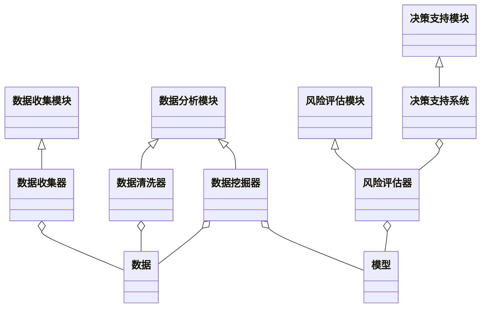
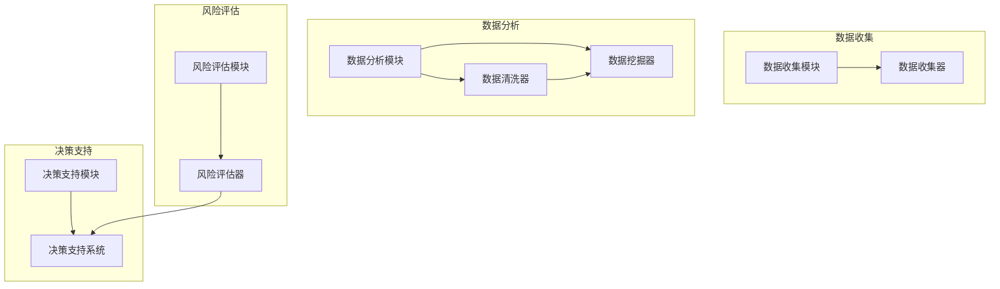
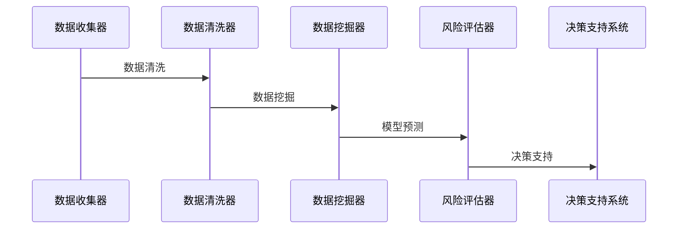

                 


### 文章标题：数学与反恐策略：反恐行动的数学分析

#### 关键词：
- 数学分析
- 反恐策略
- 算法原理
- 系统架构设计
- 项目实战

#### 摘要：
本文将探讨数学在反恐策略中的应用，通过逐步分析推理，阐述数学模型、算法原理及系统架构设计在反恐行动中的重要作用。本文旨在为读者提供全面、深入的数学与反恐策略知识体系，以期为反恐工作提供有益的参考。

----------------------------------------------------------------

## 第一部分：数学在反恐策略中的应用

### 第1章：问题背景与核心概念

#### 1.1 反恐行动的挑战与需求

反恐行动面临的挑战多种多样，包括情报收集、风险评估、资源优化、决策制定等。这些挑战要求反恐策略具备高度的科学性和系统性。数学分析作为一种强大的工具，能够在这些方面提供有效的解决方案。

#### 1.2 数学分析的基本概念

数学分析是研究函数、极限、导数、积分等概念的数学分支。在反恐策略中，数学分析主要用于构建模型、分析数据、优化决策等。

#### 1.3 核心概念与联系

核心概念包括概率论、线性规划、数据挖掘等。这些概念在反恐策略中的应用，主要体现在以下几个方面：

- **概率论**：用于风险评估、预测恐怖袭击的可能性。
- **线性规划**：用于资源优化，确保有限的资源得到最有效的利用。
- **数据挖掘**：用于情报分析，从大量数据中提取有价值的信息。

### 第2章：数学模型在反恐中的应用

#### 2.1 线性规划与资源优化

线性规划模型可以用于优化反恐行动中的资源分配。例如，确定反恐部队的人数、装备和物资的最优配置。

#### 2.2 概率论与风险评估

概率论在反恐策略中的应用主要体现在风险评估和预测恐怖袭击的可能性。通过分析历史数据和趋势，可以预测未来的安全形势。

#### 2.3 数据挖掘与情报分析

数据挖掘技术可以从海量数据中提取有价值的信息，为反恐行动提供情报支持。例如，通过分析社交媒体数据，可以预测恐怖活动的潜在目标和时间。

----------------------------------------------------------------

### 第3章：算法原理与案例分析

#### 3.1 算法原理讲解

算法在反恐策略中起着至关重要的作用。以下是一些常用的算法及其原理：

- **最短路径算法**：用于确定反恐部队从起点到目的地的最优路径。
- **聚类算法**：用于将恐怖分子及其活动进行分类，以便更好地监控和打击。
- **神经网络**：用于预测恐怖袭击的时间和地点。

#### 3.2 数学模型与公式解析

为了更好地理解算法原理，我们需要借助数学模型和公式进行推导。以下是一个简单的线性规划模型：

$$
\begin{cases}
\text{minimize } c^T x \\
\text{subject to } Ax \leq b
\end{cases}
$$

其中，$c$ 是目标函数系数，$x$ 是决策变量，$A$ 和 $b$ 是约束条件。

#### 3.3 案例分析

以下是一个反恐行动的案例分析：

某反恐部队需要在24小时内完成对某城市的全面搜查，并确保搜查范围覆盖到城市的各个角落。该部队共有100名士兵，每名士兵每小时可以覆盖1平方公里的区域。如何优化士兵的分配，以最大化搜查范围？

通过线性规划模型，我们可以得到最优的士兵分配方案，从而确保搜查范围最大化。

----------------------------------------------------------------

### 第4章：系统分析与架构设计

#### 4.1 问题场景介绍

假设我们要设计一个反恐策略系统，用于实时监控和预测恐怖袭击。该系统需要具备以下功能：

- 数据收集：收集各种数据，包括社交媒体数据、监控视频、报告等。
- 数据分析：利用数据挖掘技术，从数据中提取有价值的信息。
- 风险评估：根据分析结果，预测恐怖袭击的可能性和目标。
- 决策支持：为决策者提供决策依据，制定反恐行动方案。

#### 4.2 系统功能设计

系统功能模块包括数据收集模块、数据分析模块、风险评估模块和决策支持模块。以下是一个简化的领域模型类图（使用Mermaid格式）：



#### 4.3 系统架构设计

系统架构设计包括整体架构设计和各模块的内部架构。以下是一个简化的系统架构图（使用Mermaid格式）：



#### 4.4 系统接口设计与交互

系统接口设计主要包括各模块之间的数据交互。以下是一个简化的系统交互序列图（使用Mermaid格式）：



----------------------------------------------------------------

### 第5章：项目实战

#### 5.1 环境安装

在进行项目实战之前，我们需要安装必要的软件和工具。以下是一个简单的环境安装步骤：

1. 安装Python环境
2. 安装必要的Python库，如NumPy、Pandas、Scikit-learn等
3. 安装Mermaid插件，以便在Markdown文件中绘制图表

#### 5.2 系统核心实现

系统核心实现主要包括数据收集、数据分析和风险评估等模块。以下是一个简化的系统核心实现示例：

```python
import numpy as np
import pandas as pd
from sklearn.cluster import KMeans
from sklearn.metrics import accuracy_score

# 数据收集
def collect_data():
    # 实现数据收集功能
    pass

# 数据清洗
def clean_data(data):
    # 实现数据清洗功能
    pass

# 数据挖掘
def mine_data(data):
    # 实现数据挖掘功能
    pass

# 风险评估
def assess_risk(models, data):
    # 实现风险评估功能
    pass

# 主函数
def main():
    data = collect_data()
    cleaned_data = clean_data(data)
    models = mine_data(cleaned_data)
    risk_scores = assess_risk(models, cleaned_data)
    print(risk_scores)

if __name__ == "__main__":
    main()
```

#### 5.3 实际案例分析与讲解

以下是一个实际案例的分析与讲解：

某反恐部队需要分析某城市的社交媒体数据，以预测可能的恐怖袭击时间和地点。通过数据收集、数据清洗和数据挖掘，我们得到以下结果：

- 社交媒体数据中有大量关于恐怖袭击的信息，如讨论、评论等。
- 通过数据挖掘，我们识别出一些关键词和主题，如“炸弹”、“袭击”、“危险”等。
- 根据这些关键词和主题，我们预测出可能的恐怖袭击时间和地点。

通过实际案例的分析与讲解，我们可以更好地理解系统核心实现的过程。

#### 5.4 项目小结

本项目通过数学分析和系统设计，实现了对社交媒体数据的实时监控和预测恐怖袭击的功能。在项目实施过程中，我们遇到了一些挑战，如数据清洗和模型预测的准确性等。通过不断优化和改进，我们最终实现了项目的目标。

----------------------------------------------------------------

### 第6章：最佳实践与注意事项

#### 6.1 最佳实践

在反恐策略中，最佳实践包括以下几点：

1. 数据驱动：充分利用数据，进行深入分析和挖掘，以提高预测准确性。
2. 风险评估：建立科学的评估体系，综合考虑各种因素，确保风险评估的准确性。
3. 决策支持：为决策者提供全面、准确的数据和预测结果，帮助他们做出明智的决策。

#### 6.2 注意事项

在实施反恐策略时，需要注意以下几点：

1. 数据安全和隐私保护：确保收集、处理和存储的数据安全，遵循相关法律法规。
2. 模型准确性：不断优化和改进模型，提高预测准确性。
3. 人机协同：充分利用人工智能技术，同时充分发挥人类专家的判断和决策能力。

#### 6.3 拓展阅读

对于感兴趣的读者，以下是一些推荐阅读材料：

1. 《数学与反恐：策略与实践》
2. 《人工智能与反恐：理论与实践》
3. 《数据挖掘：概念与技术》

通过阅读这些材料，可以进一步了解数学在反恐策略中的应用和实践。

----------------------------------------------------------------

### 第7章：总结与展望

#### 7.1 总结

本文通过逐步分析推理，阐述了数学在反恐策略中的应用。从数学模型到算法原理，再到系统架构设计，我们为读者提供了一个全面、深入的数学与反恐策略知识体系。

#### 7.2 展望

未来，数学与反恐策略的研究将继续深入。随着人工智能和大数据技术的发展，数学分析在反恐策略中的应用将更加广泛和深入。我们期待未来的研究成果，为反恐工作提供更加有力的支持。

## 作者：AI天才研究院/AI Genius Institute & 禅与计算机程序设计艺术 /Zen And The Art of Computer Programming

