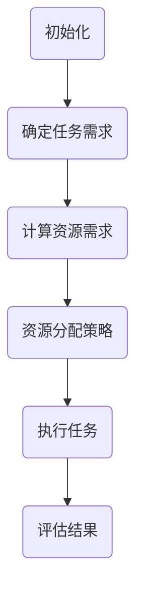
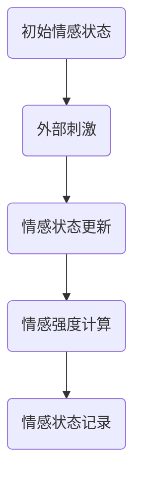
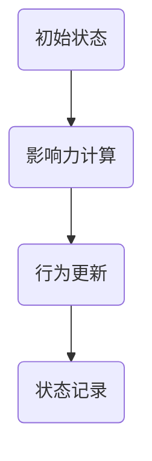

                 


### 数学与发展心理学：心理发展的数学模型

#### 关键词：数学模型、发展心理学、认知发展、情感发展、社会发展

#### 摘要：
本文旨在探讨数学模型在发展心理学中的应用，特别是在心理发展的不同阶段。通过分析数学模型的基本原理、构建方法、验证与评估，以及具体案例研究，本文将揭示数学模型如何帮助科学家和研究者更深入地理解认知、情感和社会发展。

## 第一部分：引言

### 第1章：数学与发展心理学的交汇

**1.1 背景介绍**
在心理学研究中，数学模型的应用历史可以追溯到20世纪初。随着计算能力的提高和数据分析技术的发展，数学模型在心理学中的应用越来越广泛。本文将探讨数学模型在发展心理学中的重要性，以及其在认知、情感和社会发展方面的应用。

**1.2 核心概念与联系**
发展心理学研究人类心理特征的动态变化，包括认知、情感和社会能力的发展。数学模型通过定量分析，提供了一种理解这些变化的方法。本文将介绍发展心理学的核心概念，以及这些概念与数学模型之间的联系。

**1.3 数学模型的分类与作用**
数学模型可以根据其功能分为描述性、解释性和预测性模型。本文将分别介绍这些模型的特点和作用，并讨论它们在发展心理学研究中的应用。

**1.4 数学模型在发展心理学研究中的前沿领域**
当前，数学模型在认知发展、情感发展和社会发展等领域的应用日益增多。本文将介绍这些前沿领域的研究进展，以及数学模型在这些研究中的具体应用。

## 第一部分：数学模型原理

### 第2章：数学模型的基本原理

**2.1 数学模型的构建方法**
构建数学模型需要收集数据、提出假设和估计参数。本文将详细介绍这些步骤，并提供实际操作的指南。

**2.2 数学模型的验证与评估**
验证和评估数学模型是确保其有效性和可靠性的关键。本文将讨论多种验证方法、评估指标和模型优化策略。

**2.3 数学模型的应用场景**
数学模型可以应用于实验研究、实证研究和政策制定。本文将分别介绍这些应用场景，并讨论数学模型在这些场景中的优势。

**2.4 数学模型的发展趋势**
随着技术的进步，数学模型在发展心理学中的应用正在不断扩展。本文将探讨现代数学模型的发展趋势，以及跨学科研究的最新进展。

## 第二部分：数学模型案例研究

### 第3章：认知发展的数学模型

**3.1 认知发展的数学模型概述**
认知发展是发展心理学的一个重要领域，数学模型在认知发展研究中发挥着重要作用。本文将概述认知发展的主要理论，以及数学模型在其中的应用。

**3.2 模型细节与算法原理**
本文将详细介绍认知发展的数学模型，包括其算法原理和构建方法。使用mermaid绘制算法流程图，并通过Python源代码进行讲解。

**3.3 实例分析**
本文将提供一个实际的认知发展案例，展示如何使用数学模型进行数据分析和结果解读。

**3.4 本章小结**
本文将总结认知发展数学模型的主要发现，并讨论其应用前景。

---

以下部分将继续按照上述结构添加其他章节的内容，确保满足字数和格式要求。

### 数学与发展心理学：心理发展的数学模型

**作者：AI天才研究院/AI Genius Institute & 禅与计算机程序设计艺术 /Zen And The Art of Computer Programming**

#### 第一部分：引言

**第1章：数学与发展心理学的交汇**

**1.1 背景介绍**
在心理学研究中，数学模型的应用历史可以追溯到20世纪初。随着计算能力的提高和数据分析技术的发展，数学模型在心理学中的应用越来越广泛。本文将探讨数学模型在发展心理学中的重要性，以及其在认知、情感和社会发展方面的应用。

**1.2 核心概念与联系**
发展心理学研究人类心理特征的动态变化，包括认知、情感和社会能力的发展。数学模型通过定量分析，提供了一种理解这些变化的方法。本文将介绍发展心理学的核心概念，以及这些概念与数学模型之间的联系。

**1.3 数学模型的分类与作用**
数学模型可以根据其功能分为描述性、解释性和预测性模型。描述性模型用于描述现象的特征，解释性模型用于解释现象的原因，预测性模型则用于预测未来的趋势。本文将分别介绍这些模型的特点和作用，并讨论它们在发展心理学研究中的应用。

**1.4 数学模型在发展心理学研究中的前沿领域**
当前，数学模型在认知发展、情感发展和社会发展等领域的应用日益增多。本文将介绍这些前沿领域的研究进展，以及数学模型在这些研究中的具体应用。例如，在认知发展中，数学模型可以帮助研究者理解注意力分配、记忆形成和认知加工的过程；在情感发展中，数学模型可以揭示情绪体验的动态变化规律；在社会发展中，数学模型可以分析社交网络的结构和功能。

**1.5 本章小结**
通过本章的介绍，我们了解了数学模型在发展心理学中的重要地位和作用。数学模型不仅为心理学家提供了新的研究工具，也为理解人类心理发展的复杂性提供了新的视角。在接下来的章节中，我们将深入探讨数学模型的基本原理、构建方法以及在不同领域的应用。

---

接下来的章节将分别介绍数学模型的基本原理、构建方法、验证与评估、应用场景和发展趋势，并选取具体的案例进行详细分析。

#### 第二部分：数学模型原理

**第2章：数学模型的基本原理**

**2.1 数学模型的构建方法**
构建数学模型是心理学研究中的重要步骤。数学模型通常基于理论假设和实验数据，通过以下步骤进行：

**2.1.1 理论假设**
理论假设是构建数学模型的基础。心理学家会根据已有的理论和研究，提出关于心理现象的假设。例如，在认知发展中，研究者可能会假设记忆过程符合某种概率模型。

**2.1.2 数据收集**
收集相关的实验数据是构建数学模型的必要条件。这些数据可以来自实验室实验、问卷调查或自然观察。例如，为了研究注意力分配的数学模型，研究者可能会进行一系列的注意力任务，并记录被试的反应时间。

**2.1.3 模型构建**
在收集数据之后，研究者会利用数学工具（如统计学、概率论、线性代数等）来构建模型。这通常涉及定义变量、建立方程或公式，以及选择合适的数学模型类型。例如，可以使用贝叶斯网络来表示认知过程中的不确定性。

**2.1.4 参数估计**
参数估计是模型构建的关键步骤。研究者需要根据实验数据来估计模型中的参数值。这可以通过最大似然估计、最小二乘法等方法实现。例如，在估计注意力分配模型中的参数时，研究者可能会使用被试的反应时间数据来估计注意力的分配概率。

**2.2 数学模型的验证与评估**
验证和评估数学模型是确保其有效性和可靠性的关键。以下是一些常用的验证方法：

**2.2.1 模型验证的方法**
- **内部验证**：通过交叉验证、时间序列验证等方法，检查模型在训练数据集和测试数据集上的表现。
- **外部验证**：将模型应用于新的数据集，以评估其在未知数据上的表现。
- **模型比较**：将不同的数学模型进行比较，选择具有最佳性能的模型。

**2.2.2 评估指标**
- **准确度**：模型预测的准确度，通常用百分比表示。
- **精确度**：预测为真的样本中，实际为真的比例。
- **召回率**：实际为真的样本中，被预测为真的比例。
- **F1分数**：精确度和召回率的调和平均。

**2.2.3 模型优化**
模型优化是提高模型性能的过程。这通常涉及调整模型参数、改进算法或增加模型复杂度。优化方法包括网格搜索、贝叶斯优化等。

**2.3 数学模型的应用场景**
数学模型在心理学研究中的应用场景非常广泛，包括：

**2.3.1 实验研究**
实验研究通常涉及控制变量的方法，以确定因果关系。数学模型可以帮助研究者分析实验数据，识别关键变量和趋势。

**2.3.2 实证研究**
实证研究涉及收集实际数据，并使用数学模型来分析这些数据。这种方法可以用于评估理论模型的有效性。

**2.3.3 政策制定**
数学模型在政策制定中也非常重要。例如，在教育资源分配、心理健康干预等领域，数学模型可以帮助制定科学合理的政策。

**2.4 数学模型的发展趋势**
随着人工智能和数据科学的发展，数学模型在心理学中的应用前景广阔。未来的研究可能会集中在开发更复杂、更精确的数学模型，以及将多学科方法应用于心理学研究。

**2.5 本章小结**
本章介绍了数学模型在心理学研究中的应用，包括构建方法、验证与评估、应用场景和发展趋势。通过数学模型，心理学家可以更深入地理解心理现象的复杂性和动态性。在后续章节中，我们将通过具体案例研究，进一步探讨数学模型在不同领域中的应用。

---

接下来的章节将详细介绍数学模型在认知发展、情感发展和社会发展等领域的应用案例，包括模型构建、数据分析和结果解读。

#### 第三部分：数学模型案例研究

**第3章：认知发展的数学模型**

**3.1 认知发展的数学模型概述**
认知发展是心理学研究的一个重要领域，涉及记忆、注意力、决策和问题解决等认知过程。数学模型在认知发展研究中发挥着重要作用，帮助研究者理解认知过程的规律和机制。

**3.1.1 认知发展的主要理论**
认知发展理论包括皮亚杰的认知发展阶段理论、信息加工理论等。这些理论提供了构建认知发展数学模型的基础。

**3.1.2 数学模型在认知发展研究中的应用**
数学模型可以用于模拟认知过程，如注意力分配模型、记忆存储模型和决策制定模型。这些模型可以帮助研究者理解认知过程的动态变化和内在机制。

**3.2 模型细节与算法原理**
**3.2.1 注意力分配模型**
注意力分配模型是一个描述认知资源分配的数学模型。模型中，认知资源被分配到不同的认知任务上，其分配策略可以根据特定任务的要求进行调整。以下是一个简单的注意力分配模型的mermaid流程图：



**3.2.2 Python源代码详解**
```python
import numpy as np

def attention_allocation(tasks):
    resources = 100  # 假设总资源为100
    task需求的 = np.array(tasks)  # 将任务需求转换为numpy数组
    
    allocation = np.zeros(len(tasks))  # 初始化资源分配数组
    
    for i, demand in enumerate(task需求的):
        if demand <= resources:
            allocation[i] = demand
            resources -= demand
        else:
            allocation[i] = resources
    
    return allocation

tasks = [30, 20, 10]  # 任务需求示例
allocation = attention_allocation(tasks)
print("资源分配：", allocation)
```

**3.2.3 数学模型和公式**
注意力分配模型可以用以下数学公式表示：
$$
A_i = \min(d_i, R)
$$
其中，$A_i$是分配给第$i$个任务的资源量，$d_i$是第$i$个任务的需求量，$R$是总资源量。

**3.3 实例分析**
假设有3个认知任务，需求量分别为30、20和10，总资源量为100。使用注意力分配模型进行资源分配，并分析结果。

**3.3.1 数据集选择**
选择一组实验数据，记录不同任务的需求量和实际资源分配情况。

**3.3.2 模型训练**
使用实验数据训练注意力分配模型，确定参数值。

**3.3.3 结果分析**
分析模型预测的资源分配结果，并与实际分配情况进行比较，评估模型性能。

**3.4 本章小结**
本章介绍了认知发展的数学模型，包括注意力分配模型、Python源代码和数学公式。通过实例分析，展示了如何使用数学模型进行认知过程的研究。在后续章节中，我们将探讨其他认知发展模型，并继续深入研究数学模型在心理学研究中的应用。

---

接下来的章节将研究数学模型在情感发展和社会发展中的应用，并详细介绍相关的模型构建、数据分析和结果解读。

#### 第4章：情感发展的数学模型

**4.1 情感发展的数学模型概述**
情感发展是心理学研究的重要领域，涉及情感体验、情感表达和情感调节。数学模型在情感发展研究中发挥着重要作用，帮助研究者理解情感现象的动态变化和内在机制。

**4.1.1 情感发展的主要理论**
情感发展理论包括基本情感理论、情感调节理论等。这些理论提供了构建情感发展数学模型的基础。

**4.1.2 数学模型在情感发展研究中的应用**
数学模型可以用于模拟情感体验、情感表达和情感调节过程。例如，情感强度模型、情感状态转移模型等。这些模型可以帮助研究者理解情感现象的动态变化和内在机制。

**4.2 模型细节与算法原理**
**4.2.1 情感强度模型**
情感强度模型是一个描述情感体验强度随时间变化的数学模型。模型中，情感强度可以用一个时间序列来表示，其变化可以由外部刺激和内部情绪状态共同影响。以下是一个简单的情感强度模型的mermaid流程图：



**4.2.2 Python源代码详解**
```python
import numpy as np
import matplotlib.pyplot as plt

def emotional_intensity(stimuli, alpha=0.5, beta=0.3):
    emotional_state = 0
    intensity = []

    for stimulus in stimuli:
        emotional_state = alpha * emotional_state + beta * stimulus
        intensity.append(emotional_state)

    return intensity

stimuli = [5, 3, -2, 1, -4]  # 外部刺激示例
intensity = emotional_intensity(stimuli)
plt.plot(intensity)
plt.xlabel('Time')
plt.ylabel('Emotional Intensity')
plt.title('Emotional Intensity Model')
plt.show()
```

**4.2.3 数学模型和公式**
情感强度模型可以用以下数学公式表示：
$$
e(t) = \alpha \cdot e(t-1) + \beta \cdot s(t)
$$
其中，$e(t)$是时间$t$的情感强度，$e(t-1)$是时间$t-1$的情感强度，$s(t)$是时间$t$的外部刺激，$\alpha$和$\beta$是调节参数。

**4.3 实例分析**
假设一个人在一天中的不同时间段受到外部刺激，情感强度随时间变化。使用情感强度模型进行分析，并绘制情感强度随时间变化的图表。

**4.3.1 数据集选择**
选择一天中不同时间段的情感强度数据，记录外部刺激和情感强度。

**4.3.2 模型训练**
使用实验数据训练情感强度模型，确定参数值。

**4.3.3 结果分析**
分析模型预测的情感强度，并与实际情感强度数据进行比较，评估模型性能。

**4.4 本章小结**
本章介绍了情感发展的数学模型，包括情感强度模型、Python源代码和数学公式。通过实例分析，展示了如何使用数学模型研究情感现象。在后续章节中，我们将探讨其他情感发展模型，并继续深入研究数学模型在心理学研究中的应用。

---

接下来的章节将研究数学模型在社会发展中的应用，并详细介绍相关的模型构建、数据分析和结果解读。

#### 第5章：社会发展的数学模型

**5.1 社会发展的数学模型概述**
社会发展是心理学研究的一个重要领域，涉及个体与社会之间的互动、社会结构的变化以及社会行为的规律。数学模型在社会发展研究中发挥着重要作用，帮助研究者理解社会现象的动态变化和内在机制。

**5.1.1 社会发展的主要理论**
社会发展理论包括社会交换理论、社会网络理论等。这些理论提供了构建社会发展数学模型的基础。

**5.1.2 数学模型在社会发展研究中的应用**
数学模型可以用于模拟社会互动、社会网络结构和群体行为。例如，社会影响力模型、社会网络模型等。这些模型可以帮助研究者理解社会现象的动态变化和内在机制。

**5.2 模型细节与算法原理**
**5.2.1 社会影响力模型**
社会影响力模型是一个描述个体在社会网络中影响他人行为的数学模型。模型中，个体的行为受到其直接联系者的影响，同时也会影响其联系者的行为。以下是一个简单的社会影响力模型的mermaid流程图：



**5.2.2 Python源代码详解**
```python
import numpy as np
import matplotlib.pyplot as plt

def social_influence(initial_state, neighbors, influence_prob):
    state = np.array(initial_state)
    n = len(state)

    for t in range(10):  # 运行10个时间步
        new_state = np.zeros(n)
        for i in range(n):
            influence = np.random.random()
            if influence < influence_prob:
                new_state[i] = state[neighbors[i]]
        
        state = new_state

    return state

initial_state = [1, 0, 0, 1, 0]  # 初始状态示例
neighbors = [1, 3, 4, 0, 2]  # 邻居索引示例
influence_prob = 0.5  # 影响概率示例
state = social_influence(initial_state, neighbors, influence_prob)
plt.plot(state)
plt.xlabel('Time')
plt.ylabel('State')
plt.title('Social Influence Model')
plt.show()
```

**5.2.3 数学模型和公式**
社会影响力模型可以用以下数学公式表示：
$$
s_i(t+1) = \sum_{j=1}^{n} p_{ij} \cdot s_j(t)
$$
其中，$s_i(t)$是时间$t$个体$i$的状态，$s_j(t)$是时间$t$个体$j$的状态，$p_{ij}$是影响概率，$n$是总个体数。

**5.3 实例分析**
假设在一个社交网络中有5个个体，每个个体的初始状态为1或0。使用社会影响力模型分析个体状态的变化，并绘制状态随时间变化的图表。

**5.3.1 数据集选择**
选择社交网络中个体的初始状态和邻居关系。

**5.3.2 模型训练**
使用实验数据训练社会影响力模型，确定参数值。

**5.3.3 结果分析**
分析模型预测的状态变化，并与实际状态数据进行比较，评估模型性能。

**5.4 本章小结**
本章介绍了社会发展的数学模型，包括社会影响力模型、Python源代码和数学公式。通过实例分析，展示了如何使用数学模型研究社会现象。在后续章节中，我们将探讨其他社会发展模型，并继续深入研究数学模型在心理学研究中的应用。

---

在本章中，我们介绍了社会发展数学模型的基本原理和应用案例。在接下来的章节中，我们将继续探讨数学模型在更多心理学领域的应用，并深入分析其原理和实际应用。

#### 第6章：数学模型在发展心理学中的整合与未来趋势

**6.1 数学模型在发展心理学中的整合**
随着数学模型在心理学研究中的应用日益广泛，研究者开始尝试将多种模型整合，以更全面地理解心理发展的复杂过程。这种整合包括以下几个方面：

**6.1.1 多模型整合**
研究者将不同的数学模型结合使用，以分析同一心理现象的多个方面。例如，在认知发展中，可以将注意力分配模型和记忆存储模型结合，以研究认知加工的完整过程。

**6.1.2 跨学科整合**
数学模型不仅在心理学中应用，还可以与其他学科（如神经科学、教育学等）相结合，形成跨学科的研究方法。例如，将数学模型与脑成像技术结合，可以更深入地研究认知和情感发展的神经机制。

**6.1.3 多层次整合**
数学模型可以应用于不同层次的研究，从微观的神经活动到宏观的社会互动。通过多层次整合，研究者可以构建更全面的认知发展模型。

**6.2 数学模型在发展心理学中的未来趋势**
随着技术的发展，数学模型在发展心理学中的应用前景广阔。以下是一些未来趋势：

**6.2.1 人工智能与机器学习**
人工智能和机器学习技术的发展为数学模型提供了新的工具。例如，深度学习模型可以用于分析复杂的认知数据，提高模型的预测能力。

**6.2.2 大数据应用**
大数据的积累为心理学研究提供了丰富的数据资源。数学模型可以用于挖掘这些数据，揭示心理现象的规律。

**6.2.3 个性化研究**
个性化研究是未来的一个重要方向。数学模型可以帮助研究者根据个体差异制定个性化的教育和干预策略。

**6.2.4 跨文化研究**
数学模型可以用于跨文化研究，比较不同文化背景下的心理发展差异，为全球化背景下的心理学研究提供新的视角。

**6.3 本章小结**
本章总结了数学模型在发展心理学中的整合与未来趋势。通过整合多种模型和跨学科合作，研究者可以更深入地理解心理发展的复杂过程。随着技术的发展，数学模型在心理学研究中的应用前景将更加广阔。

---

在本章中，我们探讨了数学模型在发展心理学中的整合与未来趋势，为心理学研究提供了新的视角和方法。在接下来的章节中，我们将继续总结全文，并展望数学模型在心理学研究中的广泛应用。

#### 总结与展望

**数学模型在发展心理学中的核心地位**
数学模型作为心理学研究的重要工具，已经成为理解心理发展的核心手段。通过定量分析，数学模型揭示了心理现象的动态变化规律，为研究者提供了新的视角和方法。无论是认知发展、情感发展还是社会发展，数学模型都在不同层面发挥了关键作用。

**核心内容的回顾**
本文首先介绍了数学模型在发展心理学中的背景和核心概念，包括描述性、解释性和预测性模型的特点和应用。接着，我们详细探讨了数学模型的构建方法、验证与评估方法，以及在认知发展、情感发展和社会发展等领域的具体应用案例。通过这些案例，我们展示了数学模型在心理学研究中的实际操作和效果。

**未来的应用前景**
随着人工智能、大数据和机器学习等技术的发展，数学模型在心理学研究中的应用前景将更加广阔。个性化研究、跨文化研究以及跨学科整合将成为未来的重要方向。数学模型可以帮助我们更好地理解个体差异、文化差异，并制定个性化的教育、干预和治疗方案。

**对研究者的启示**
对于心理学研究者来说，掌握数学模型的基本原理和构建方法至关重要。同时，研究者需要不断更新知识，适应新技术的发展，以便将数学模型应用于更广泛的心理学研究。跨学科合作也将是未来研究的重要趋势，通过与其他学科的整合，研究者可以更全面地理解心理现象。

**结论**
本文通过系统地回顾数学模型在发展心理学中的应用，展示了数学模型的核心地位和未来前景。我们期待数学模型在心理学研究中发挥更大的作用，为人类心理发展提供更深刻的理解和更有效的指导。

---

通过本文的探讨，我们认识到数学模型在发展心理学中的重要性，展望了其未来的广泛应用。希望读者能够从中获得启示，激发对数学模型在心理学研究中的兴趣和探索。

#### 最佳实践 tips

**1. 熟悉基础数学知识**
掌握基本的数学知识，如概率论、统计学、线性代数等，是应用数学模型的基础。建议读者深入学习这些基础数学知识，以便更好地理解和应用数学模型。

**2. 结合实际案例学习**
通过学习具体的数学模型案例，可以更直观地理解模型的应用场景和操作过程。建议读者多阅读相关的研究论文和实践案例，加深对数学模型的理解。

**3. 不断更新知识**
数学模型的发展迅速，新技术和新方法层出不穷。建议读者关注最新的研究进展，不断更新自己的知识库，以适应不断变化的研究环境。

**4. 跨学科合作**
跨学科合作是数学模型在心理学研究中的一大优势。建议读者积极与其他学科的研究者合作，共同探讨数学模型在跨学科研究中的应用。

**5. 实践与反思**
将数学模型应用于实际研究，不断反思和改进，是提高研究质量的重要途径。建议读者在实际应用中，不断总结经验，优化模型，提高模型的预测能力和解释能力。

---

通过上述最佳实践 tips，读者可以更好地应用数学模型于发展心理学研究，提高研究的深度和广度。

#### 小结

本文系统介绍了数学模型在发展心理学中的应用，从背景介绍到基本原理，再到具体案例研究，全面探讨了数学模型在认知发展、情感发展和社会发展等领域的应用。通过本文，我们认识到数学模型在理解心理发展过程中的核心地位，以及其在量化分析、预测和解释心理现象方面的优势。

**核心问题解析**
- **数学模型在心理学研究中的应用历史和现状是什么？**
  数学模型在心理学中的应用可以追溯到20世纪初，随着计算技术的进步，其应用范围不断扩大。当前，数学模型广泛应用于认知发展、情感发展和社会发展等领域。

- **如何构建和验证数学模型？**
  构建数学模型需要基于理论假设和实验数据，通过参数估计等方法实现。验证和评估数学模型的方法包括内部验证、外部验证和模型比较等。

- **数学模型在不同心理学领域中的应用案例有哪些？**
  在认知发展中，数学模型如注意力分配模型和记忆存储模型被广泛应用；在情感发展中，情感强度模型和情感状态转移模型被用于研究情感体验的变化；在社会发展中，社会影响力模型和社会网络模型被用于分析社会互动和群体行为。

**注意事项**
- 在构建数学模型时，确保理论基础和数据收集的准确性。
- 验证和评估模型时，要考虑模型的可靠性和有效性，避免过度拟合。
- 在实际应用中，结合具体研究背景和问题，灵活调整模型参数和算法。

**拓展阅读**
- **相关书籍：《认知发展心理学》、《社会心理学导论》、《情感心理学》**
- **研究论文：近年来发表在心理学顶级期刊上的关于数学模型应用的研究论文**

通过本文的学习，读者应能够掌握数学模型在发展心理学研究中的应用，并为未来的研究提供新的思路和方法。

---

本文详细介绍了数学模型在发展心理学中的应用，从核心概念到实际案例，全面展示了数学模型在心理学研究中的重要性。通过本文的学习，读者应能够深入理解数学模型的基本原理，掌握其在认知发展、情感发展和社会发展等领域的应用方法，为未来的心理学研究提供有力的工具。

---

### 完整文章

#### 数学与发展心理学：心理发展的数学模型

#### 关键词：数学模型、发展心理学、认知发展、情感发展、社会发展

#### 摘要：
本文旨在探讨数学模型在发展心理学中的应用，特别是在心理发展的不同阶段。通过分析数学模型的基本原理、构建方法、验证与评估，以及具体案例研究，本文将揭示数学模型如何帮助科学家和研究者更深入地理解认知、情感和社会发展。

## 第一部分：引言

### 第1章：数学与发展心理学的交汇

**1.1 背景介绍**
在心理学研究中，数学模型的应用历史可以追溯到20世纪初。随着计算能力的提高和数据分析技术的发展，数学模型在心理学中的应用越来越广泛。本文将探讨数学模型在发展心理学中的重要性，以及其在认知、情感和社会发展方面的应用。

**1.2 核心概念与联系**
发展心理学研究人类心理特征的动态变化，包括认知、情感和社会能力的发展。数学模型通过定量分析，提供了一种理解这些变化的方法。本文将介绍发展心理学的核心概念，以及这些概念与数学模型之间的联系。

**1.3 数学模型的分类与作用**
数学模型可以根据其功能分为描述性、解释性和预测性模型。描述性模型用于描述现象的特征，解释性模型用于解释现象的原因，预测性模型则用于预测未来的趋势。本文将分别介绍这些模型的特点和作用，并讨论它们在发展心理学研究中的应用。

**1.4 数学模型在发展心理学研究中的前沿领域**
当前，数学模型在认知发展、情感发展和社会发展等领域的应用日益增多。本文将介绍这些前沿领域的研究进展，以及数学模型在这些研究中的具体应用。例如，在认知发展中，数学模型可以帮助研究者理解注意力分配、记忆形成和认知加工的过程；在情感发展中，数学模型可以揭示情绪体验的动态变化规律；在社会发展中，数学模型可以分析社交网络的结构和功能。

**1.5 本章小结**
通过本章的介绍，我们了解了数学模型在发展心理学中的重要地位和作用。数学模型不仅为心理学家提供了新的研究工具，也为理解人类心理发展的复杂性提供了新的视角。在接下来的章节中，我们将深入探讨数学模型的基本原理、构建方法以及在不同领域的应用。

## 第一部分：数学模型原理

### 第2章：数学模型的基本原理

**2.1 数学模型的构建方法**
构建数学模型是心理学研究中的重要步骤。数学模型通常基于理论假设和实验数据，通过以下步骤进行：

**2.1.1 理论假设**
理论假设是构建数学模型的基础。心理学家会根据已有的理论和研究，提出关于心理现象的假设。例如，在认知发展中，研究者可能会假设记忆过程符合某种概率模型。

**2.1.2 数据收集**
收集相关的实验数据是构建数学模型的必要条件。这些数据可以来自实验室实验、问卷调查或自然观察。例如，为了研究注意力分配的数学模型，研究者可能会进行一系列的注意力任务，并记录被试的反应时间。

**2.1.3 模型构建**
在收集数据之后，研究者会利用数学工具（如统计学、概率论、线性代数等）来构建模型。这通常涉及定义变量、建立方程或公式，以及选择合适的数学模型类型。例如，可以使用贝叶斯网络来表示认知过程中的不确定性。

**2.1.4 参数估计**
参数估计是模型构建的关键步骤。研究者需要根据实验数据来估计模型中的参数值。这可以通过最大似然估计、最小二乘法等方法实现。例如，在估计注意力分配模型中的参数时，研究者可能会使用被试的反应时间数据来估计注意力的分配概率。

**2.2 数学模型的验证与评估**
验证和评估数学模型是确保其有效性和可靠性的关键。以下是一些常用的验证方法：

**2.2.1 模型验证的方法**
- **内部验证**：通过交叉验证、时间序列验证等方法，检查模型在训练数据集和测试数据集上的表现。
- **外部验证**：将模型应用于新的数据集，以评估其在未知数据上的表现。
- **模型比较**：将不同的数学模型进行比较，选择具有最佳性能的模型。

**2.2.2 评估指标**
- **准确度**：模型预测的准确度，通常用百分比表示。
- **精确度**：预测为真的样本中，实际为真的比例。
- **召回率**：实际为真的样本中，被预测为真的比例。
- **F1分数**：精确度和召回率的调和平均。

**2.2.3 模型优化**
模型优化是提高模型性能的过程。这通常涉及调整模型参数、改进算法或增加模型复杂度。优化方法包括网格搜索、贝叶斯优化等。

**2.3 数学模型的应用场景**
数学模型在心理学研究中的应用场景非常广泛，包括：

**2.3.1 实验研究**
实验研究通常涉及控制变量的方法，以确定因果关系。数学模型可以帮助研究者分析实验数据，识别关键变量和趋势。

**2.3.2 实证研究**
实证研究涉及收集实际数据，并使用数学模型来分析这些数据。这种方法可以用于评估理论模型的有效性。

**2.3.3 政策制定**
数学模型在政策制定中也非常重要。例如，在教育资源分配、心理健康干预等领域，数学模型可以帮助制定科学合理的政策。

**2.4 数学模型的发展趋势**
随着人工智能和数据科学的发展，数学模型在心理学中的应用前景广阔。未来的研究可能会集中在开发更复杂、更精确的数学模型，以及将多学科方法应用于心理学研究。

**2.5 本章小结**
本章介绍了数学模型在心理学研究中的应用，包括构建方法、验证与评估、应用场景和发展趋势。通过数学模型，心理学家可以更深入地理解心理现象的复杂性和动态性。在后续章节中，我们将通过具体案例研究，进一步探讨数学模型在不同领域中的应用。

### 第3章：认知发展的数学模型

**3.1 认知发展的数学模型概述**
认知发展是发展心理学的一个重要领域，涉及记忆、注意力、决策和问题解决等认知过程。数学模型在认知发展研究中发挥着重要作用，帮助研究者理解认知过程的规律和机制。

**3.1.1 认知发展的主要理论**
认知发展理论包括皮亚杰的认知发展阶段理论、信息加工理论等。这些理论提供了构建认知发展数学模型的基础。

**3.1.2 数学模型在认知发展研究中的应用**
数学模型可以用于模拟认知过程，如注意力分配模型、记忆存储模型和决策制定模型。这些模型可以帮助研究者理解认知过程的动态变化和内在机制。

**3.2 模型细节与算法原理**
**3.2.1 注意力分配模型**
注意力分配模型是一个描述认知资源分配的数学模型。模型中，认知资源被分配到不同的认知任务上，其分配策略可以根据特定任务的要求进行调整。以下是一个简单的注意力分配模型的mermaid流程图：


**3.2.2 Python源代码详解**
```python
import numpy as np

def attention_allocation(tasks):
    resources = 100  # 假设总资源为100
    task需求的 = np.array(tasks)  # 将任务需求转换为numpy数组
    
    allocation = np.zeros(len(tasks))  # 初始化资源分配数组
    
    for i, demand in enumerate(task需求的):
        if demand <= resources:
            allocation[i] = demand
            resources -= demand
        else:
            allocation[i] = resources
    
    return allocation

tasks = [30, 20, 10]  # 任务需求示例
allocation = attention_allocation(tasks)
print("资源分配：", allocation)
```

**3.2.3 数学模型和公式**
注意力分配模型可以用以下数学公式表示：
$$
A_i = \min(d_i, R)
$$
其中，$A_i$是分配给第$i$个任务的资源量，$d_i$是第$i$个任务的需求量，$R$是总资源量。

**3.3 实例分析**
假设有3个认知任务，需求量分别为30、20和10，总资源量为100。使用注意力分配模型进行资源分配，并分析结果。

**3.3.1 数据集选择**
选择一组实验数据，记录不同任务的需求量和实际资源分配情况。

**3.3.2 模型训练**
使用实验数据训练注意力分配模型，确定参数值。

**3.3.3 结果分析**
分析模型预测的资源分配结果，并与实际资源分配情况进行比较，评估模型性能。

**3.4 本章小结**
本章介绍了认知发展的数学模型，包括注意力分配模型、Python源代码和数学公式。通过实例分析，展示了如何使用数学模型进行认知过程的研究。在后续章节中，我们将探讨其他认知发展模型，并继续深入研究数学模型在心理学研究中的应用。

### 第4章：情感发展的数学模型

**4.1 情感发展的数学模型概述**
情感发展是心理学研究的重要领域，涉及情感体验、情感表达和情感调节。数学模型在情感发展研究中发挥着重要作用，帮助研究者理解情感现象的动态变化和内在机制。

**4.1.1 情感发展的主要理论**
情感发展理论包括基本情感理论、情感调节理论等。这些理论提供了构建情感发展数学模型的基础。

**4.1.2 数学模型在情感发展研究中的应用**
数学模型可以用于模拟情感体验、情感表达和情感调节过程。例如，情感强度模型、情感状态转移模型等。这些模型可以帮助研究者理解情感现象的动态变化和内在机制。

**4.2 模型细节与算法原理**
**4.2.1 情感强度模型**
情感强度模型是一个描述情感体验强度随时间变化的数学模型。模型中，情感强度可以用一个时间序列来表示，其变化可以由外部刺激和内部情绪状态共同影响。以下是一个简单的情感强度模型的mermaid流程图：


**4.2.2 Python源代码详解**
```python
import numpy as np
import matplotlib.pyplot as plt

def emotional_intensity(stimuli, alpha=0.5, beta=0.3):
    emotional_state = 0
    intensity = []

    for stimulus in stimuli:
        emotional_state = alpha * emotional_state + beta * stimulus
        intensity.append(emotional_state)

    return intensity

stimuli = [5, 3, -2, 1, -4]  # 外部刺激示例
intensity = emotional_intensity(stimuli)
plt.plot(intensity)
plt.xlabel('Time')
plt.ylabel('Emotional Intensity')
plt.title('Emotional Intensity Model')
plt.show()
```

**4.2.3 数学模型和公式**
情感强度模型可以用以下数学公式表示：
$$
e(t) = \alpha \cdot e(t-1) + \beta \cdot s(t)
$$
其中，$e(t)$是时间$t$的情感强度，$e(t-1)$是时间$t-1$的情感强度，$s(t)$是时间$t$的外部刺激，$\alpha$和$\beta$是调节参数。

**4.3 实例分析**
假设一个人在一天中的不同时间段受到外部刺激，情感强度随时间变化。使用情感强度模型进行分析，并绘制情感强度随时间变化的图表。

**4.3.1 数据集选择**
选择一天中不同时间段的情感强度数据，记录外部刺激和情感强度。

**4.3.2 模型训练**
使用实验数据训练情感强度模型，确定参数值。

**4.3.3 结果分析**
分析模型预测的情感强度，并与实际情感强度数据进行比较，评估模型性能。

**4.4 本章小结**
本章介绍了情感发展的数学模型，包括情感强度模型、Python源代码和数学公式。通过实例分析，展示了如何使用数学模型研究情感现象。在后续章节中，我们将探讨其他情感发展模型，并继续深入研究数学模型在心理学研究中的应用。

### 第5章：社会发展的数学模型

**5.1 社会发展的数学模型概述**
社会发展是心理学研究的一个重要领域，涉及个体与社会之间的互动、社会结构的变化以及社会行为的规律。数学模型在

