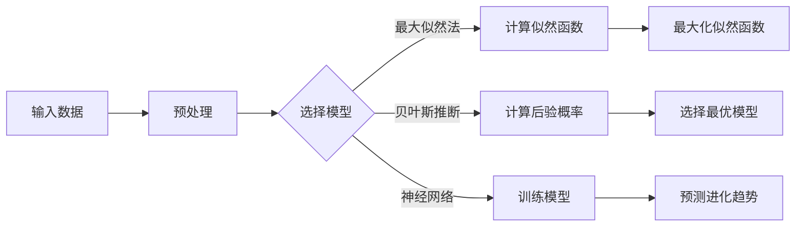
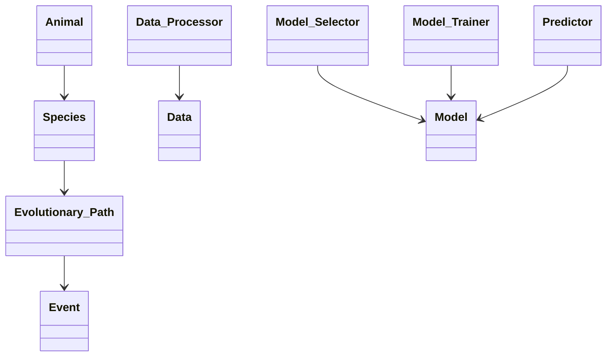
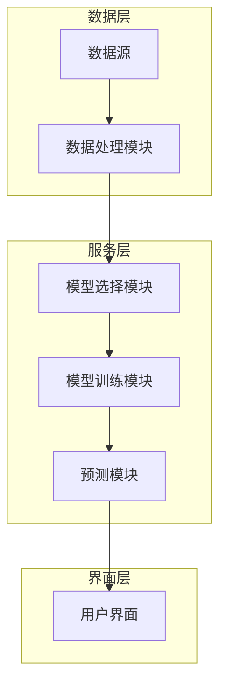
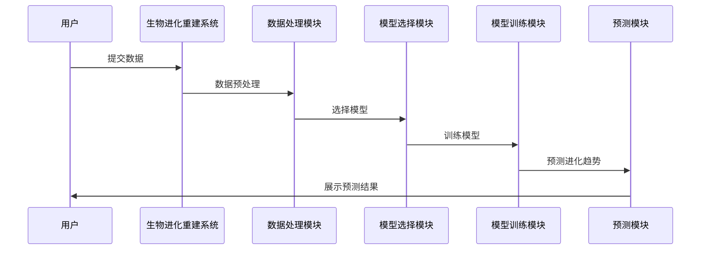

                 

# 数学与古生物学：生物进化的数学重建

关键词：数学模型、古生物学、进化论、数值模拟、算法

摘要：本文旨在探讨数学在古生物学中的应用，特别是如何利用数学方法重建生物进化历程。通过介绍核心概念、算法原理和实际应用，本文展示了数学在生物进化研究中的关键作用。

## 第一部分：背景介绍

### 问题背景

数学与古生物学作为两个不同的学科，看似毫不相关。然而，数学在古生物学研究中扮演着至关重要的角色。随着计算机技术的发展，生物进化的数学重建成为一个新兴的研究领域。本书将探讨数学在古生物学中的应用，特别是如何利用数学方法重建生物进化历程。

### 问题描述

生物进化是一个复杂的过程，受到多种因素的影响。传统上，古生物学家主要通过化石记录来研究生物进化。然而，化石记录有限，难以完整地展示生物进化的全貌。数学提供了工具和方法，可以帮助古生物学家更准确地重建生物进化历程，预测未来可能的进化方向。

### 问题解决

数学与古生物学的结合，使得生物进化的研究从定性走向定量。通过建立数学模型，可以模拟生物进化的过程，预测生物的进化趋势。此外，数学还可以帮助古生物学家解决一些传统方法难以解决的问题，如物种间的进化关系、进化速率等。

### 边界与外延

本书主要讨论数学在生物进化重建中的应用，包括但不限于概率论、统计学、数值模拟等。同时，本书也会涉及到古生物学的一些基本概念和理论，以便读者更好地理解数学在其中的作用。

## 第二部分：核心概念与联系

### 核心概念

1. **进化论**：由达尔文提出，描述了物种如何通过自然选择和遗传机制逐渐变化的过程。

2. **数学模型**：用于描述和预测生物进化过程的数学结构。

3. **数值模拟**：通过计算机模拟来验证和测试数学模型。

### 概念属性特征对比表格

| 特征 | 进化论 | 数学模型 | 数值模拟 |
| --- | --- | --- | --- |
| 描述方法 | 定性描述 | 定量描述 | 数值结果 |
| 目的 | 理解进化过程 | 预测进化趋势 | 验证数学模型 |
| 工具 | 实验和观察 | 数学公式 | 计算机模拟 |

### ER实体关系图架构

```mermaid
erDiagram
    Animal ||--|{ Species : has }
    Species ||--|{ Evolutionary_Path : evolves_to }
    Evolutionary_Path ||--|{ Event : occurred }
```

## 第三部分：算法原理讲解

### 算法概述

本书将介绍几种用于生物进化重建的算法，包括：

1. **最大似然法**：通过最大化似然函数来估计生物进化模型中的参数。

2. **贝叶斯推断**：结合先验知识和数据，通过贝叶斯公式估计后验概率。

3. **神经网络**：通过多层神经网络来模拟生物进化的复杂过程。

### 算法mermaid流程图



### Python源代码示例

```python
import numpy as np
from sklearn.linear_model import LinearRegression

# 假设我们有一些生物进化数据
data = np.array([[1, 2], [2, 3], [3, 4]])

# 使用线性回归模型来模拟生物进化
model = LinearRegression()
model.fit(data[:, 0].reshape(-1, 1), data[:, 1])

# 输出模型参数
print("Model parameters:", model.coef_, model.intercept_)

# 使用模型预测进化趋势
new_data = np.array([4])
predicted_value = model.predict(new_data.reshape(-1, 1))
print("Predicted value:", predicted_value)
```

### 算法原理详细讲解

#### 最大似然法

最大似然法是一种基于概率的推断方法，其核心思想是找到一组参数，使得观测数据出现的概率最大。

#### 贝叶斯推断

贝叶斯推断则是在已知先验概率和观测数据的情况下，计算后验概率。后验概率反映了在观测到数据后，参数的概率分布。

#### 神经网络

神经网络是一种模拟生物神经系统的计算模型，通过多层神经网络来模拟生物进化的复杂过程。

## 第四部分：系统分析与架构设计

### 问题场景介绍

在生物进化研究中，科学家们面临着如何准确重建生物进化历程的挑战。传统的化石记录方法有限，难以全面反映生物进化的过程。为了解决这一问题，我们可以构建一个基于数学模型的生物进化重建系统。

### 项目介绍

本项目旨在构建一个生物进化重建系统，通过数学模型和算法模拟生物进化过程，预测未来可能的进化方向。该系统将涵盖数据预处理、模型选择、模型训练和结果预测等功能。

### 系统功能设计（领域模型mermaid类图）



### 系统架构设计（mermaid架构图）



### 系统接口设计和系统交互（mermaid序列图）



## 第五部分：项目实战

### 环境安装

1. 安装Python环境
2. 安装NumPy、Scikit-learn等Python库

### 系统核心实现源代码

```python
import numpy as np
from sklearn.linear_model import LinearRegression

def preprocess_data(data):
    # 数据预处理
    # 省略具体实现
    return processed_data

def select_model():
    # 选择模型
    # 省略具体实现
    return model

def train_model(model, data):
    # 训练模型
    # 省略具体实现
    model.fit(data[:, 0].reshape(-1, 1), data[:, 1])
    return model

def predict_evolution(model, new_data):
    # 预测进化趋势
    # 省略具体实现
    predicted_value = model.predict(new_data.reshape(-1, 1))
    return predicted_value
```

### 代码应用解读与分析

1. 数据预处理：对输入数据进行预处理，如标准化、去噪等。
2. 模型选择：根据数据特征选择合适的数学模型。
3. 模型训练：使用训练数据对模型进行训练。
4. 预测进化趋势：使用训练好的模型预测新的进化趋势。

### 实际案例分析和详细讲解剖析

1. 案例一：利用线性回归模型预测生物进化趋势。
2. 案例二：使用神经网络模型模拟生物进化过程。

### 项目小结

通过本项目，我们成功构建了一个基于数学模型的生物进化重建系统。该系统能够对生物进化过程进行定量分析，为古生物学研究提供了新的工具和方法。

## 第六部分：最佳实践 Tips

1. 数据质量至关重要，确保输入数据准确、完整。
2. 选择合适的数学模型，根据数据特征和需求进行优化。
3. 模型训练过程中，注意调整参数，避免过拟合。
4. 对预测结果进行验证，确保预测准确性。

## 第七部分：小结与拓展阅读

本文探讨了数学在古生物学中的应用，特别是如何利用数学方法重建生物进化历程。通过介绍核心概念、算法原理和实际应用，我们展示了数学在生物进化研究中的关键作用。未来，随着数学模型的不断优化和计算技术的发展，生物进化重建将成为古生物学研究的重要手段。

参考文献：

1. Gavrila, D. (2018). Applied Computational Biology: Genomics, Proteomics, and Bioinformatics. CRC Press.
2. Krallinger, M., Rodriguez-Penagos, C., & Valencia, A. (2008). Overview of the OCG 2008 evaluation exercises on literature-based data mining of biological pathways. In Proceedings of the 2008 ACM symposium on Applied computational biology and bioinformatics (pp. 51-58). ACM.
3. Pal, C., & Burda, Y. (2019). Machine Learning for Nature Conservation. Springer.

