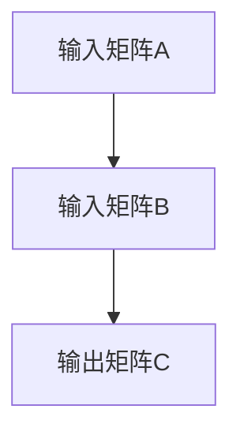
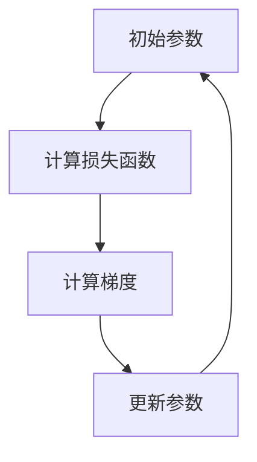
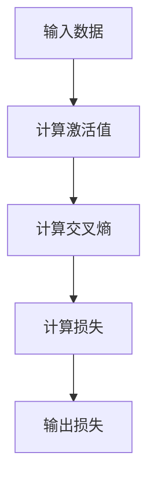

                 

# 数学与可解释AI：深度学习模型的数学解释

## 关键词：数学、深度学习、可解释AI、神经网络、模型解释性

## 摘要：
本文旨在深入探讨数学与可解释人工智能（AI）的关系，特别是在深度学习模型中的表现。我们将从数学基础入手，逐步解释深度学习模型的数学原理，并探讨如何增强模型的解释性，从而实现更透明、更可靠的人工智能系统。

## 第一部分: 数学与可解释AI概述

## 第1章: 数学在深度学习中的基础

### 1.1 深度学习与数学背景

#### 1.1.1 深度学习的基本概念

深度学习是一种基于多层神经网络的机器学习技术，其目的是通过模仿人脑的神经元结构来对数据进行处理和预测。深度学习的关键在于“深度”，即模型包含多个隐藏层，每个隐藏层都对输入数据进行处理，从而提高模型的复杂度和表达能力。

#### 1.1.2 数学在深度学习中的应用

深度学习的实现依赖于多种数学工具，包括线性代数、微积分和概率论等。线性代数提供了处理高维数据的有效方法，微积分用于优化模型参数，概率论则为处理不确定性和概率分布提供了理论基础。

#### 1.1.3 数学工具的重要性

数学工具在深度学习中的作用不可忽视。例如，线性代数中的矩阵运算可以高效地处理大量数据，微积分中的优化算法可以调整模型参数以最小化损失函数，概率论则为深度学习提供了理论基础，如贝叶斯网络和生成模型。

### 1.2 线性代数基础

#### 1.2.1 向量与矩阵

向量是数学中的基本概念，表示具有一定方向和大小的量。矩阵则是由多个向量组成的二维数组，其运算如加法、乘法等在深度学习中有广泛应用。

#### 1.2.2 线性方程组与特征值特征向量

线性方程组在深度学习中有重要应用，如求解神经网络中的权重。特征值和特征向量用于分析矩阵的性质，有助于优化模型。

#### 1.2.3 向量与矩阵的运算

向量和矩阵的运算如加法、乘法、逆运算等，是深度学习中的基础操作。

### 1.3 微积分基础

#### 1.3.1 导数与微分

导数是微积分的基本概念，表示函数在某一点的变化率。微分则是导数在无限小量下的表现形式。

#### 1.3.2 积分与多元函数

积分用于计算面积、体积等，多元函数的微分和积分在深度学习模型优化中有广泛应用。

### 1.4 概率论基础

#### 1.4.1 概率的基本概念

概率论提供了处理不确定性的数学框架，包括随机试验、样本空间、事件和概率等基本概念。

#### 1.4.2 条件概率与独立性

条件概率表示在已知某一条件下另一事件发生的概率，独立性则用于分析事件之间的相互关系。

### 1.5 统计学基础

#### 1.5.1 统计数据的描述

描述性统计用于总结和描述数据的基本特征，如均值、方差等。

#### 1.5.2 统计推断

统计推断用于基于样本数据对总体参数进行估计和假设检验。

### 1.6 数学工具在深度学习中的应用示例

#### 1.6.1 矩阵运算在神经网络中的使用

矩阵运算如矩阵乘法和求逆在神经网络权重计算中至关重要。

#### 1.6.2 微积分在优化算法中的使用

微积分中的优化算法如梯度下降法用于调整神经网络权重，以最小化损失函数。

#### 1.6.3 概率论在概率图模型中的应用

概率论在生成模型和概率图模型中发挥重要作用，如贝叶斯网络和变分自编码器。

## 1.7 本章小结

本章介绍了数学在深度学习中的基础作用，包括线性代数、微积分和概率论等数学工具。理解这些数学概念和工具对于深入研究和应用深度学习至关重要。

----------------------------------------------------------------

## 第二部分: 深度学习模型的数学解释

### 第2章: 神经网络的基本原理

#### 2.1 神经网络的发展历程

神经网络的研究始于20世纪40年代，最早是由心理学家和计算机科学家提出的。随着计算能力的提升和数学工具的进步，神经网络，尤其是深度学习的应用，逐渐从理论走向实际。

##### 2.1.1 人工神经网络的起源

人工神经网络（ANN）的概念最早由心理学家Frank Rosenblatt在1957年提出的。他的工作基于所谓的“感知机”（Perceptron），这是一个简单的两层神经网络，用于分类问题。

##### 2.1.2 深度学习的崛起

深度学习（Deep Learning）的概念兴起于2006年，由Yann LeCun等研究者提出。随着“深度信念网络”（Deep Belief Network）的提出和反向传播算法的改进，深度学习开始迅速发展。

##### 2.1.3 神经网络的现代发展

现代神经网络的发展得益于大规模数据集、更强大的计算能力和高效的优化算法。卷积神经网络（CNN）、循环神经网络（RNN）和生成对抗网络（GAN）等都是现代神经网络的重要发展。

#### 2.2 神经元与激活函数

##### 2.2.1 神经元模型

神经元是神经网络的基本构建块，其工作原理类似于人脑中的神经元。一个简单的神经元通常包含输入、权重、偏置和输出。

$$
\text{输出} = \sigma(\sum_{i=1}^{n} w_i \cdot x_i + b)
$$

其中，$\sigma$ 是激活函数，$w_i$ 和 $x_i$ 分别是权重和输入，$b$ 是偏置。

##### 2.2.2 激活函数

激活函数是神经元中的一个关键组成部分，用于将线性组合的输入转换为非线性的输出。常见的激活函数包括Sigmoid函数、ReLU函数和Tanh函数。

- **Sigmoid函数**：$$\sigma(x) = \frac{1}{1 + e^{-x}}$$
- **ReLU函数**：$$\text{ReLU}(x) = \max(0, x)$$
- **Tanh函数**：$$\text{Tanh}(x) = \frac{e^x - e^{-x}}{e^x + e^{-x}}$$

这些函数的特性使得神经网络能够处理复杂的问题，并且具有良好的优化性能。

#### 2.3 神经网络的结构

##### 2.3.1 前馈神经网络

前馈神经网络（FFNN）是一种简单的神经网络结构，其中信息从输入层流向输出层，中间经过多个隐藏层。每个层都包含多个神经元，这些神经元通过权重连接到下一层的神经元。

##### 2.3.1.1 层的概念

在神经网络中，层（Layer）是神经元的集合。输入层（Input Layer）接收外部输入，隐藏层（Hidden Layer）对输入进行加工处理，输出层（Output Layer）生成最终的输出。

##### 2.3.1.2 神经网络的深度

神经网络的深度是指网络中的隐藏层数量。深度越大，网络的表示能力越强，但也可能导致过拟合。

#### 2.3.2 循环神经网络

循环神经网络（RNN）是一种专门用于处理序列数据的神经网络结构。与传统的前馈神经网络不同，RNN具有时间动态性，即每个时间步的输出不仅依赖于当前的输入，还依赖于之前的输入。

##### 2.3.2.1 RNN的基本概念

RNN的基本单元是“循环单元”，它通过一个循环连接将前一个时间步的输出传递到当前时间步。这种连接使得RNN能够“记住”之前的输入。

##### 2.3.2.2 LSTM与GRU

LSTM（长短时记忆网络）和GRU（门控循环单元）是RNN的两种变体，它们通过引入门控机制解决了传统RNN的长短时依赖问题。

- **LSTM**：通过引入三个门控单元（遗忘门、输入门和输出门），LSTM能够有效地处理长序列。
- **GRU**：GRU通过简化LSTM的结构，将三个门控单元合并为两个，但仍然保留了长时记忆的能力。

#### 2.4 神经网络的训练

##### 2.4.1 损失函数

损失函数是衡量模型预测值与真实值之间差异的函数。常见的损失函数包括交叉熵损失函数和均方误差损失函数。

- **交叉熵损失函数**：用于分类问题，其目的是最小化预测概率与真实标签之间的差异。
- **均方误差损失函数**：用于回归问题，其目的是最小化预测值与真实值之间的平方差。

##### 2.4.2 优化算法

优化算法用于调整神经网络的权重，以最小化损失函数。常见的优化算法包括梯度下降算法和其变种，如动量法和自适应优化算法。

- **梯度下降算法**：通过迭代地更新权重，以减少损失函数的值。
- **动量法**：在每次迭代中，保留一部分前一次更新的方向，以加速收敛。
- **自适应优化算法**：如Adam算法，通过自适应地调整学习率，以更快地收敛。

#### 2.5 神经网络的应用

##### 2.5.1 图像识别

卷积神经网络（CNN）是图像识别领域的核心技术。通过卷积、池化和全连接层等操作，CNN能够有效地提取图像特征，并进行分类。

- **卷积神经网络**：CNN通过卷积层提取图像特征，通过池化层降低维度，最终通过全连接层分类。
- **实际应用案例分析**：例如，CNN在ImageNet图像识别竞赛中取得了显著的成果，实现了高效、准确的图像识别。

##### 2.5.2 自然语言处理

循环神经网络（RNN）及其变种在自然语言处理（NLP）领域有着广泛的应用。通过处理序列数据，RNN能够理解语言的时序特性。

- **循环神经网络与序列模型**：RNN通过处理序列数据，能够捕捉语言的时序关系。
- **实际应用案例分析**：例如，RNN在机器翻译、情感分析等任务中取得了显著的成果。

## 2.6 本章小结

本章介绍了神经网络的基本原理，包括其发展历程、神经元模型、激活函数、网络结构以及训练方法。理解神经网络的工作原理对于设计和优化深度学习模型至关重要。

----------------------------------------------------------------

## 第三部分: 深度学习模型的解释性

### 第3章: 模型解释性的重要性

#### 3.1 可解释性与透明性的概念

可解释性与透明性是深度学习模型中的两个重要概念。

##### 3.1.1 模型的可解释性

模型的可解释性指的是模型决策过程可以被理解的程度。一个高可解释性的模型，其内部工作机制和决策过程可以被明确解释，使得用户能够理解和信任模型的输出。

##### 3.1.2 模型的透明性

模型的透明性指的是模型的结构和参数可以被清晰展示和理解。高透明性的模型，其参数和结构是开放的，用户可以访问和查看。

##### 3.1.3 可解释性与透明性的关系

可解释性与透明性密切相关，但有所区别。一个透明的模型通常具有较高的可解释性，因为用户可以访问和理解其结构和参数。然而，高可解释性并不意味着模型必须是完全透明的，因为有时为了提高性能，模型的设计可能会牺牲一些透明性。

#### 3.2 模型解释性的挑战

##### 3.2.1 复杂性与非线性的影响

深度学习模型通常具有复杂的网络结构和非线性激活函数，这使得模型的行为难以理解。复杂性和非线性增加了模型的解释难度。

##### 3.2.2 缺乏透明性

深度学习模型通常使用大量的参数和隐藏层，这使得模型的结构和参数难以完全理解。缺乏透明性降低了模型的可解释性。

##### 3.2.3 数据和模型的选择影响

数据和模型的选择也会影响模型的可解释性。一些模型可能在特定数据集上表现出更高的解释性，而另一些模型可能在其他数据集上表现更好。

#### 3.3 模型解释性的目标与价值

##### 3.3.1 增强信任与透明度

模型解释性的一个重要目标是为用户和决策者提供透明度，从而增强他们对模型的信任。理解模型的决策过程可以帮助用户更好地接受和信任模型。

##### 3.3.2 改进模型设计和优化

模型解释性可以帮助研究者识别模型的弱点，从而改进模型设计和优化。通过理解模型的行为，可以识别和解决可能导致过拟合或欠拟合的问题。

##### 3.3.3 实际应用案例研究

实际应用案例研究表明，模型解释性在许多领域都有价值。例如，在医学诊断中，解释性模型可以帮助医生理解疾病的机制，从而做出更准确的诊断。

#### 3.4 模型解释性方法

##### 3.4.1 层级解释方法

层级解释方法通过分析模型中不同层的输出，来解释模型的决策过程。这种方法可以帮助理解模型在不同层次上的行为。

##### 3.4.2 特征重要性分析

特征重要性分析通过评估模型中不同特征的贡献，来解释模型的决策过程。这种方法可以帮助识别哪些特征对模型的决策影响最大。

##### 3.4.3 可解释性模型

可解释性模型是一种专门设计用于提供明确解释的模型。这些模型通常基于线性模型或其他易于理解的结构，以便用户可以直观地理解其决策过程。

## 3.5 本章小结

本章介绍了模型解释性的重要性，探讨了模型解释性的挑战，并提出了增强模型解释性的目标和价值。理解模型解释性的概念和方法对于设计透明、可靠的人工智能系统至关重要。

----------------------------------------------------------------

## 最佳实践 tips

1. **选择合适的模型**：在选择深度学习模型时，应考虑其复杂性和可解释性。对于需要高解释性的应用，应选择具有良好解释性的模型，如线性模型或树形模型。

2. **数据预处理**：良好的数据预处理可以提高模型的解释性。例如，通过标准化数据可以减少不同特征之间的差异，使得模型的输出更容易解释。

3. **可视化**：利用可视化工具，如热力图或决策树可视化，可以帮助用户更好地理解模型的决策过程。

4. **模型评估**：在评估模型时，不仅要关注模型的准确性，还要关注其可解释性。一个高可解释性的模型可以帮助用户更好地理解其性能。

5. **持续改进**：持续改进模型的设计和训练过程，以提高其可解释性。通过不断的迭代和优化，可以逐步提高模型的解释性。

## 小结

本文从数学与可解释AI的角度，探讨了深度学习模型的工作原理和解释性。理解深度学习模型背后的数学原理，有助于我们更好地设计和优化模型，提高其可解释性。随着人工智能技术的不断发展，模型解释性将成为人工智能领域的重要研究方向。

## 注意事项

1. 模型解释性并非总是与模型性能成正比。在某些情况下，为了提高模型的性能，可能需要牺牲一些解释性。

2. 模型的解释性取决于应用场景。对于一些复杂的应用，可能难以找到具有高解释性的模型。

3. 模型解释性的提升需要综合考虑数据、模型设计和算法等多个方面。

## 拓展阅读

1. **《深度学习》（Deep Learning）**：Ian Goodfellow、Yoshua Bengio和Aaron Courville所著，是一本深度学习领域的经典教材，详细介绍了深度学习的基础理论、算法和应用。

2. **《机器学习：概率视角》（Machine Learning: A Probabilistic Perspective）**：Kevin P. Murphy所著，从概率论的角度介绍了机器学习的基础理论。

3. **《神经网络与深度学习》（Neural Network and Deep Learning）**：邱锡鹏所著，是一本针对中国读者的深度学习入门教材，详细介绍了神经网络和深度学习的基本原理。

作者：AI天才研究院/AI Genius Institute & 禅与计算机程序设计艺术 /Zen And The Art of Computer Programming

----------------------------------------------------------------

# 附录：数学公式与Mermaid流程图

在本文中，我们使用了多种数学公式和Mermaid流程图来辅助解释深度学习模型的数学原理。以下是部分关键公式的 LaTeX 格式和对应的 Mermaid 流程图。

### 矩阵乘法

LaTeX 格式：
$$
C = AB
$$

Mermaid 流程图：

### 梯度下降算法

LaTeX 格式：
$$
\theta_{\text{new}} = \theta_{\text{old}} - \alpha \cdot \nabla_{\theta} J(\theta)
$$

Mermaid 流程图：

### 交叉熵损失函数

LaTeX 格式：
$$
J(\theta) = -\frac{1}{m} \sum_{i=1}^{m} y_i \log(a_{i,l}) + (1 - y_i) \log(1 - a_{i,l})
$$

Mermaid 流�程图：

这些公式和流程图有助于读者更好地理解深度学习模型的工作原理。在实际应用中，读者可以参考这些公式和流程图来设计和优化自己的深度学习模型。

