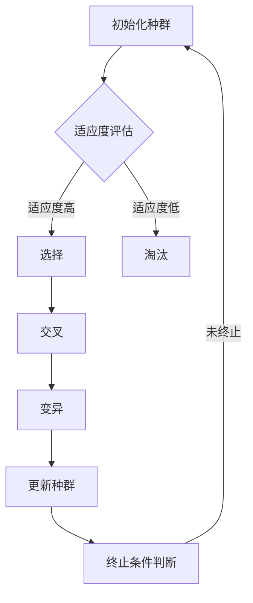
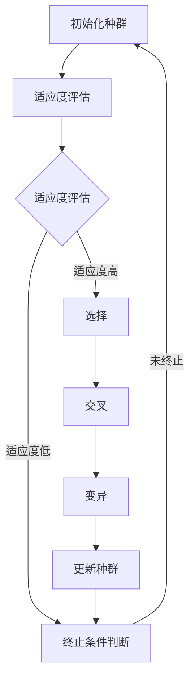

                 

### 引言

在现代科技飞速发展的背景下，数学与合成生物学这两大领域正日益交织，共同探索着人工生命的设计与实现。数学，作为自然科学的基础，以其严谨的逻辑和精确的描述，为各个学科提供了强大的工具和方法；而合成生物学，作为21世纪最具前景的前沿科学之一，通过设计和构建新的生物系统，致力于解决生物技术、医学和环境等多个领域的实际问题。

本文旨在探讨数学与合成生物学的交汇点，特别是数学在合成生物学中的设计和应用。我们将首先回顾数学与生物学的历史联系，然后详细描述合成生物学的基本概念和数学模型，从而为后续的深入分析奠定基础。

在接下来的章节中，我们将逐步探讨以下几个关键问题：

- **第1章：数学与合成生物学概述**：介绍合成生物学的起源与发展、数学在生物学研究中的应用，以及合成生物学中的数学问题。
- **第2章：核心概念原理**：阐述数学和生物学基础，并对比其属性特征，构建ER实体关系图，探讨概念联系与协同作用。
- **第3章：数学模型与算法原理**：详细讲解遗传算法的基本原理，使用Mermaid流程图和Python代码实现，同时给出具体的例子进行说明。
  
每一章节都将围绕特定的主题进行深入讨论，通过逻辑清晰、结构紧凑的分析，帮助读者更好地理解数学在合成生物学中的应用和潜力。

### 数学与合成生物学概述

#### 1.1 问题背景

合成生物学是一门跨越生物、化学、工程和计算机科学等多个领域的交叉学科，其核心目标是通过设计和构建新的生物系统来应对各种实际问题。合成生物学的研究始于20世纪末期，随着基因组测序技术的突破和生物信息学的快速发展，合成生物学逐渐成为生命科学领域的重要方向。

数学，作为一门以逻辑推理和抽象建模为核心的学科，在生物学研究中有着广泛的应用。从经典的生理学模型到复杂的生态学模型，数学工具为生物学家提供了强大的分析和预测能力。特别是在合成生物学中，数学模型不仅是理解生物系统工作原理的重要工具，更是设计和优化生物系统的重要手段。

#### 1.1.1 合成生物学的起源与发展

合成生物学的起源可以追溯到20世纪70年代，当时基因工程技术的出现为科学家们提供了将基因从一个生物体转移到另一个生物体的能力。这一技术为合成生物学的研究奠定了基础，使得科学家们能够开始设计和构建新的生物系统。

在接下来的几十年中，合成生物学经历了快速的发展。2000年，科学家成功合成了一个完整的细菌基因组，这一突破标志着合成生物学从概念阶段走向了实际应用。随后，合成生物学在生物医学、生物能源、环境保护等多个领域取得了显著进展。

#### 1.1.2 数学在生物学研究中的应用

数学在生物学研究中的应用历史悠久，可以追溯到19世纪末的生理学和生态学领域。当时，数学模型被用来描述生物体的生理过程和生态系统的动态行为。随着计算机技术的发展，数学模型在生物学中的应用范围不断扩大，涵盖了从微观的分子生物学到宏观的生态系统研究。

在合成生物学中，数学模型尤为重要。通过数学建模，科学家可以模拟和分析生物系统的行为，预测系统在不同条件下的响应，从而优化系统的设计和操作。例如，在代谢工程中，数学模型被用来设计高效的代谢路径，以生产特定的生物产品。在合成基因电路中，数学模型用于设计能够实现特定功能的基因组件，并通过仿真验证其性能。

#### 1.1.3 合成生物学中的数学问题

合成生物学中的数学问题多样且具有挑战性。首先，合成生物学涉及大量的生物学数据，这些数据往往具有高维度和复杂性，需要有效的数学工具进行解析和处理。例如，基因组序列的解析和注释需要复杂的序列比对和基因预测算法。

其次，合成生物学中的实验设计和优化问题也充满了数学挑战。由于生物实验的复杂性和不确定性，科学家需要利用数学模型来设计和优化实验方案，以最小化实验成本并提高实验效率。例如，在合成基因电路的设计中，数学模型可以用于优化基因组件的连接方式和参数设置，以实现预期的功能行为。

此外，合成生物学中的系统优化问题也依赖于数学工具。例如，在生物合成过程中，通过数学模型优化代谢路径和反应条件，可以提高生物产品的产量和纯度。这些优化问题往往需要解决复杂的非线性优化问题，如多目标优化和动态规划等。

#### 1.2 问题描述

合成生物学的研究面临着诸多挑战，其中数学模型的构建和应用是关键之一。这些挑战主要包括：

1. **数据解析与建模**：合成生物学涉及大量的生物学数据，包括基因组序列、转录组和蛋白质组等。如何有效地解析这些数据并构建可靠的数学模型是一个重要的研究课题。

2. **实验设计与优化**：合成生物学的实验设计通常复杂且需要大量的重复实验，如何设计高效的实验方案并进行优化是一个关键问题。数学模型可以为实验设计提供指导，从而提高实验效率和结果可靠性。

3. **系统优化**：在合成生物学中，设计并优化新的生物系统是实现其功能的关键。数学模型可以用于系统优化，例如通过多目标优化和动态规划等方法，找到最优的系统参数配置。

4. **复杂系统的建模与仿真**：合成生物学中的许多系统具有复杂的网络结构和动态行为，如何构建准确且易于仿真的数学模型是一个重要的挑战。

本文旨在通过逐步分析数学在合成生物学中的应用，探讨上述问题的解决方案，并展望未来的研究方向。

#### 1.3 问题解决

为了解决合成生物学中的数学问题，我们需要从以下几个方面入手：

1. **数学模型的基本原理**：首先，我们需要了解不同类型的数学模型及其基本原理。这些模型包括微分方程、概率模型和代数模型等。每种模型都有其特定的应用场景和适用条件，了解这些模型的基本原理有助于我们在实际问题中选择合适的模型。

2. **合成生物学中的常见数学模型**：在合成生物学中，常用的数学模型有基因调控模型、代谢网络模型和神经网络模型等。这些模型不仅用于描述生物系统的行为，还可以用于预测和优化系统的性能。了解这些模型的构建方法和应用实例，有助于我们更好地理解和利用数学工具。

3. **数学模型在合成生物学中的应用实例**：通过具体的案例，我们可以看到数学模型在合成生物学中的实际应用。例如，通过基因调控模型，我们可以设计出能够实现特定功能的基因电路；通过代谢网络模型，我们可以优化代谢路径以提高生物产品的产量。这些应用实例不仅展示了数学模型在合成生物学中的潜力，也为实际操作提供了重要的指导。

4. **多学科协同研究**：数学与合成生物学的交叉融合需要多学科的合作。通过跨学科的合作，我们可以整合数学模型和生物实验数据，提高研究的准确性和效率。例如，在合成基因电路的研究中，数学模型与生物实验的协同作用可以帮助我们快速迭代和优化系统设计。

5. **未来研究方向与挑战**：尽管数学模型在合成生物学中取得了显著进展，但仍然存在许多挑战和未解决的问题。未来的研究方向包括开发更加精确和高效的数学模型、探索新的数学方法在合成生物学中的应用、以及解决复杂系统建模和仿真中的技术难题。

通过上述步骤，我们可以逐步解决合成生物学中的数学问题，推动人工生命的设计和实现。

#### 1.4 边界与外延

合成生物学研究领域的边界相对清晰，但涉及多个学科，跨越了生物、化学、工程和计算机科学等领域。它不仅研究生物系统的基本原理，还关注如何通过工程手段设计和构建新的生物系统。数学在合成生物学中的应用边界则更加广泛，涵盖了从分子水平的基因调控到生态系统水平的建模与仿真。

未来的研究方向可能包括：

1. **更高效的数学模型**：开发更加精确和高效的数学模型，以更好地描述复杂的生物系统行为。
2. **多学科融合**：推动数学与合成生物学的深度融合，通过跨学科合作解决复杂的生物学问题。
3. **新的计算方法**：探索新的计算方法和技术，如人工智能和机器学习，以处理大量的生物学数据并优化数学模型。
4. **实际应用**：将合成生物学的理论成果转化为实际应用，如生物制药、生物能源和环境修复等。

然而，合成生物学和数学模型的应用也面临一些挑战，包括数据解析的复杂性、实验验证的难度以及多变量系统优化的复杂性等。

#### 1.5 概念结构与核心要素组成

合成生物学涉及多个核心概念，这些概念共同构成了合成生物学研究的理论基础和实验框架。以下是合成生物学中的关键概念及其在数学模型中的应用：

1. **基因调控**：基因调控是合成生物学的核心概念之一，它描述了基因在不同条件下的表达水平和调控机制。在数学模型中，基因调控通常通过微分方程或代数方程来描述，这些方程可以模拟基因表达的变化以及不同调节因子之间的相互作用。

2. **代谢网络**：代谢网络是生物体内化学反应的集合，描述了生物分子之间的相互转化。在数学模型中，代谢网络通常通过图论模型或微分方程模型来表示，这些模型可以模拟代谢物浓度随时间的变化，以及不同代谢路径之间的交叉和耦合。

3. **基因电路**：基因电路是合成生物学中的一个重要概念，它通过设计和构建基因组件来实现特定的生物学功能。在数学模型中，基因电路通常通过布尔网络或线性系统来描述，这些模型可以模拟基因电路在不同输入条件下的动态行为。

4. **细胞信号传导**：细胞信号传导是细胞内外的信号传递机制，调控细胞的生长、分化和死亡等过程。在数学模型中，细胞信号传导通常通过神经网络模型来描述，这些模型可以模拟信号分子在细胞内的传递和响应。

这些关键概念在合成生物学中相互联系，共同构成了一个复杂的系统。数学模型不仅用于描述这些概念，还用于预测和优化合成生物系统的性能。通过整合这些概念和模型，我们可以更好地理解和设计新的生物系统。

### 第2章：核心概念原理

#### 2.1 数学基础

数学基础是合成生物学研究和应用的重要工具，涵盖了代数、微积分和线性代数等多个方面。以下是对这些数学基础概念及其在合成生物学中的作用的详细描述。

##### 2.1.1 代数基础

代数是数学中最基础的部分，包括集合、函数、方程等基本概念。在合成生物学中，代数基础用于描述基因调控网络、代谢路径和信号传导路径等。例如，基因调控网络可以用布尔代数或线性代数来表示，通过代数方程描述基因表达水平和调控关系。

**概念属性**：
- **确定性**：代数模型可以明确地表示变量之间的关系和结果。
- **函数性**：代数模型通过函数关系描述不同变量之间的依赖关系。

**应用实例**：
- **基因调控**：通过布尔网络模型描述基因之间的“开”或“关”状态。
- **代谢路径**：使用代数方程描述代谢物之间的转化关系。

##### 2.1.2 微积分基础

微积分是研究变化和运动规律的数学分支，包括微分和积分两个基本部分。在合成生物学中，微积分用于描述生物系统的时间动态行为，如基因表达的时间变化、代谢物浓度的变化等。

**概念属性**：
- **连续性**：微积分模型可以描述连续变化的过程。
- **变化率**：通过微分方程描述系统变量随时间的变化速率。

**应用实例**：
- **基因表达**：使用微分方程模型描述基因表达量随时间的变化。
- **代谢动力学**：通过微分方程模拟代谢物浓度随时间的变化。

##### 2.1.3 线性代数基础

线性代数研究向量空间和线性变换，包括矩阵、向量、行列式等概念。在合成生物学中，线性代数基础用于分析复杂系统的线性关系，如代谢网络的线性优化、基因表达数据的线性降维等。

**概念属性**：
- **线性关系**：线性代数模型可以表示系统变量之间的线性依赖关系。
- **矩阵运算**：通过矩阵运算描述系统内部的复杂关系。

**应用实例**：
- **代谢网络分析**：使用线性代数方法分析代谢路径中的流量分布。
- **基因表达数据分析**：通过主成分分析（PCA）等线性代数方法降维和可视化基因表达数据。

#### 2.2 生物学基础

生物学基础是合成生物学研究的重要支撑，包括基因表达调控、代谢网络分析和神经网络基础等多个方面。以下是对这些生物学基础概念及其在合成生物学中的作用的详细描述。

##### 2.2.1 基因表达调控

基因表达调控是生物体生长、发育和适应环境的基础过程，涉及基因的转录和翻译等环节。在合成生物学中，基因表达调控是设计和构建新的生物系统的核心。

**概念属性**：
- **遗传性**：基因表达调控过程受到遗传信息的影响。
- **调控网络**：基因表达调控通过复杂的网络进行协调和调控。

**应用实例**：
- **基因电路设计**：通过设计特定的基因调控网络实现特定的生物学功能。
- **疾病治疗**：利用基因调控机制设计新的治疗方法，如基因疗法。

##### 2.2.2 代谢网络分析

代谢网络是生物体内化学反应的集合，描述了生物分子之间的相互转化。代谢网络分析在合成生物学中用于优化代谢路径、设计生物合成途径等。

**概念属性**：
- **网络结构**：代谢网络具有复杂的拓扑结构。
- **动态性**：代谢网络在不同条件下表现出动态变化。

**应用实例**：
- **代谢工程**：通过代谢网络分析优化生物合成途径，提高目标产物的产量。
- **生物能源**：利用代谢网络分析设计生物燃料合成路径。

##### 2.2.3 神经网络基础

神经网络基础是模拟生物体神经系统功能和行为的模型，包括神经元、突触和神经网络等。在合成生物学中，神经网络基础用于构建和优化生物传感器、生物计算系统等。

**概念属性**：
- **适应性**：神经网络能够通过学习适应不同的输入信号。
- **并行性**：神经网络通过并行处理提高计算效率。

**应用实例**：
- **生物计算**：利用神经网络模拟生物体内的计算过程。
- **生物传感器**：通过神经网络设计和优化生物传感器的响应机制。

#### 2.3 概念属性特征对比表格

为了更好地理解数学和生物学基础的概念，我们可以通过以下对比表格来展示它们的主要属性特征。

| 概念       | 属性1   | 属性2   | 属性3   |
|------------|---------|---------|---------|
| 数学基础   | 确定性   | 线性    | 函数性  |
| 生物学基础 | 随机性   | 网络性  | 基因调控性 |
| 数学模型   | 定量分析 | 定性描述 | 预测性  |

通过对比，我们可以看到数学和生物学基础在属性特征上的差异，这些差异决定了它们在合成生物学研究中的不同应用方式。

#### 2.4 ER实体关系图架构

为了更好地理解和描述合成生物学中的概念和模型，我们可以使用ER（实体关系）图来展示它们之间的关系。以下是一个简化的ER实体关系图架构，用于描述基因调控、代谢网络和神经网络等核心概念。

```mermaid
erDiagram
    Class1 ||--|{ Class2 }
    Class1 ||--|{ Class3 }
    Class2 ||--|{ Class4 }
```

在这个ER图中，`Class1` 表示一个核心概念，如基因调控网络；`Class2` 表示与之相关的子概念，如代谢网络；`Class3` 表示另一个与之相关的子概念，如神经网络；`Class4` 表示这些子概念的具体实例。

通过ER图，我们可以清晰地看到各个概念之间的关联和层次结构，这有助于我们系统地理解和分析合成生物学中的复杂问题。

#### 2.5 概念联系与协同作用

在合成生物学中，数学基础和生物学基础不仅独立存在，还通过多种方式相互联系和协同作用，共同推动合成生物系统的研究和应用。

##### 2.5.1 数学基础与生物学基础的联系

数学基础和生物学基础的联系主要体现在以下几个方面：

1. **数学模型在生物学基础中的应用**：数学模型如微分方程、代数模型和线性代数模型等，被广泛应用于描述和解析生物学基础概念，如基因表达调控、代谢网络和神经网络。这些模型不仅能够描述生物系统的动态行为，还可以通过量化分析提供深刻的见解。

2. **生物学基础对数学模型的验证和修正**：生物学实验数据为数学模型提供了验证和修正的依据。通过实验验证，数学模型可以得到修正和优化，从而更准确地描述生物系统的行为。

3. **数学方法在生物学基础中的创新**：数学方法，如优化算法和机器学习，为生物学基础研究提供了新的工具和方法。这些方法不仅提高了数据分析的效率和准确性，还为生物学基础的研究提供了新的视角和思路。

##### 2.5.2 数学模型与生物学模型的关系

数学模型和生物学模型的关系是相辅相成的。数学模型通过量化分析和预测能力，为生物学模型提供了理论支持和指导；而生物学模型则通过实验验证和实际应用，为数学模型的验证和改进提供了重要依据。

1. **数学模型对生物学模型的优化**：数学模型可以用于优化生物学模型的设计和参数设置。例如，在基因调控网络设计中，数学模型可以用于优化基因组件的连接方式和参数设置，以实现预期的功能行为。

2. **生物学模型对数学模型的验证**：生物学实验和模型验证为数学模型提供了实证数据，确保数学模型的预测和结果是可靠的。

3. **多学科协同**：数学模型和生物学模型的协同作用体现了多学科交叉融合的重要性。通过跨学科合作，我们可以更全面、深入地理解生物系统的复杂行为，并开发出更加高效和精准的合成生物学方法。

##### 2.5.3 多学科协同研究的意义

多学科协同研究在合成生物学中具有重要意义，主要体现在以下几个方面：

1. **知识整合**：通过多学科协同研究，我们可以整合数学、生物学、工程学和计算机科学等领域的知识，构建一个更加全面和深入的合成生物学理论体系。

2. **问题解决**：多学科协同研究有助于解决合成生物学中的复杂问题。例如，在生物传感器的开发中，数学模型可以优化传感器的信号处理算法，而生物学基础可以提供传感器的生物材料和机制。

3. **创新驱动**：多学科协同研究激发了新的研究思路和创新方法。通过跨学科合作，我们可以探索新的合成生物学方向和应用领域，推动生命科学的进步和社会发展。

通过数学基础和生物学基础的紧密联系和协同作用，我们可以更好地理解和设计复杂的生物系统，为合成生物学的研究和应用提供强大的理论和技术支持。

### 第3章：数学模型与算法原理

#### 3.1 遗传算法

遗传算法（Genetic Algorithm，GA）是一种基于自然选择和遗传学原理的优化算法，广泛应用于复杂优化问题和搜索问题中。遗传算法在合成生物学中的应用非常广泛，例如在合成基因电路设计、代谢网络优化和生物合成路径优化等方面。

##### 3.1.1 遗传算法的基本原理

遗传算法的基本原理包括以下三个方面：选择、交叉和变异。

1. **选择（Selection）**：选择是遗传算法中的一个关键步骤，目的是从当前种群中选择适应度较高的个体。选择过程通常基于适应度函数，个体适应度越高，被选中的概率就越大。常用的选择方法包括轮盘赌选择、锦标赛选择和排名选择等。

2. **交叉（Crossover）**：交叉是遗传算法中产生新个体的主要手段。交叉操作通过将两个父代个体的基因片段进行交换，产生新的子代个体。交叉操作可以增加种群的多样性，避免算法过早收敛到局部最优解。常见的交叉方法包括单点交叉、两点交叉和均匀交叉等。

3. **变异（Mutation）**：变异是遗传算法中另一个关键步骤，用于引入随机性，增加种群的多样性。变异操作通过对个体基因进行随机改变，产生新的个体。变异操作可以避免算法陷入局部最优解，并帮助算法探索新的解决方案。常见的变异方法包括位变异、倒位变异和插入变异等。

##### 3.1.2 遗传算法的mermaid流程图

以下是遗传算法的mermaid流程图，展示了遗传算法的基本步骤：



在这个流程图中，`A` 表示初始化种群，`B` 表示适应度评估，`C` 表示选择操作，`D` 表示淘汰操作，`E` 表示交叉操作，`F` 表示变异操作，`G` 表示更新种群，`H` 表示终止条件判断。如果终止条件未满足，则循环回到初始化种群步骤。

##### 3.1.3 Python源代码实现

以下是遗传算法的Python实现示例，展示了如何使用遗传算法解决一个简单的优化问题：

```python
import random

# 初始化种群
def initial_population(size, gene_range):
    return [[random.randint(gene_range[0], gene_range[1]) for _ in range(len(gene_range))] for _ in range(size)]

# 适应度评估
def fitness_evaluation(population, fitness_func):
    return [fitness_func(individual) for individual in population]

# 选择操作
def selection(population, fitness_scores, select_prob):
    selected = []
    for _ in range(len(population)):
        select_individual = random.choices(population, weights=fitness_scores, k=1)[0]
        selected.append(select_individual)
    return selected

# 交叉操作
def crossover(parent1, parent2, crossover_rate):
    if random.random() < crossover_rate:
        point = random.randint(1, len(parent1) - 1)
        child1 = parent1[:point] + parent2[point:]
        child2 = parent2[:point] + parent1[point:]
        return child1, child2
    else:
        return parent1, parent2

# 变异操作
def mutation(individual, mutation_rate):
    for i in range(len(individual)):
        if random.random() < mutation_rate:
            individual[i] = random.randint(individual[i].min(), individual[i].max())
    return individual

# 更新种群
def update_population(population, selected, offspring):
    population = selected + offspring
    random.shuffle(population)
    return population

# 终止条件判断
def termination_condition_met(population):
    # 这里可以设置具体的终止条件，例如最大迭代次数或收敛条件
    return False

# 遗传算法主函数
def genetic_algorithm(fitness_func, population_size, gene_range, crossover_rate, mutation_rate, max_iterations):
    population = initial_population(population_size, gene_range)
    for _ in range(max_iterations):
        fitness_scores = fitness_evaluation(population, fitness_func)
        selected = selection(population, fitness_scores, select_prob=0.5)
        offspring = []
        for i in range(0, population_size, 2):
            parent1, parent2 = selected[i], selected[i+1]
            child1, child2 = crossover(parent1, parent2, crossover_rate)
            offspring.extend([mutation(child1, mutation_rate), mutation(child2, mutation_rate)])
        population = update_population(population, selected, offspring)
        if termination_condition_met(population):
            break
    return population

# 定义适应度函数
def example_fitness_func(individual):
    # 这里可以根据具体问题定义适应度函数
    return sum(individual)

# 运行遗传算法
best_solution = genetic_algorithm(
    fitness_func=example_fitness_func,
    population_size=100,
    gene_range=(0, 100),
    crossover_rate=0.8,
    mutation_rate=0.01,
    max_iterations=100
)

# 输出最优解
print("最优解:", best_solution)
```

在这个示例中，我们定义了初始化种群、适应度评估、选择、交叉、变异、更新种群和遗传算法主函数等关键步骤，并通过一个简单的适应度函数展示了遗传算法的应用。通过调整参数，遗传算法可以应用于各种复杂优化问题。

#### 3.2 遗传算法的mermaid流程图

为了更直观地展示遗传算法的执行过程，我们可以使用mermaid图形化语言绘制其流程图。以下是一个简化的遗传算法流程图：



在这个流程图中，`A` 表示初始化种群，`B` 表示适应度评估，`C` 表示适应度评估的分支节点，`D` 表示选择操作，`E` 表示交叉操作，`F` 表示变异操作，`G` 表示更新种群，`H` 表示终止条件判断。如果终止条件未满足，则流程返回到初始化种群步骤。

通过这个mermaid流程图，我们可以清晰地看到遗传算法的每个步骤及其逻辑关系，这有助于我们更好地理解和应用遗传算法。

#### 3.3 遗传算法的Python源代码实现

为了详细讲解遗传算法的原理，我们将通过一个Python示例来实现一个简单的遗传算法。在这个示例中，我们将解决一个简单的优化问题，目标是找到一组基因值，使其适应度函数达到最大。

以下是遗传算法的Python源代码实现：

```python
import random

# 初始化种群
def initial_population(size, gene_range):
    return [[random.uniform(gene_range[0], gene_range[1]) for _ in range(len(gene_range))] for _ in range(size)]

# 适应度评估
def fitness_evaluation(population, fitness_func):
    return [fitness_func(individual) for individual in population]

# 选择操作
def selection(population, fitness_scores, select_prob):
    selected = []
    for _ in range(len(population)):
        select_individual = random.choices(population, weights=fitness_scores, k=1)[0]
        selected.append(select_individual)
    return selected

# 交叉操作
def crossover(parent1, parent2, crossover_rate):
    if random.random() < crossover_rate:
        crossover_point = random.randint(1, len(parent1) - 1)
        child1 = parent1[:crossover_point] + parent2[crossover_point:]
        child2 = parent2[:crossover_point] + parent1[crossover_point:]
        return child1, child2
    else:
        return parent1, parent2

# 变异操作
def mutation(individual, mutation_rate):
    for i in range(len(individual)):
        if random.random() < mutation_rate:
            individual[i] = random.uniform(individual[i].min(), individual[i].max())
    return individual

# 更新种群
def update_population(population, selected, offspring):
    population = selected + offspring
    random.shuffle(population)
    return population

# 终止条件判断
def termination_condition_met(population, best_fitness_threshold):
    best_fitness = max(fitness_evaluation(population, fitness_func))
    return best_fitness >= best_fitness_threshold

# 遗传算法主函数
def genetic_algorithm(fitness_func, population_size, gene_range, crossover_rate, mutation_rate, max_iterations, best_fitness_threshold):
    population = initial_population(population_size, gene_range)
    for _ in range(max_iterations):
        fitness_scores = fitness_evaluation(population, fitness_func)
        selected = selection(population, fitness_scores, select_prob=0.5)
        offspring = []
        for i in range(0, population_size, 2):
            parent1, parent2 = selected[i], selected[i+1]
            child1, child2 = crossover(parent1, parent2, crossover_rate)
            offspring.extend([mutation(child1, mutation_rate), mutation(child2, mutation_rate)])
        population = update_population(population, selected, offspring)
        if termination_condition_met(population, best_fitness_threshold):
            break
    return population

# 定义适应度函数
def example_fitness_func(individual):
    x, y = individual
    return x**2 + y**2

# 遗传算法参数设置
population_size = 100
gene_range = (-10, 10)
crossover_rate = 0.8
mutation_rate = 0.01
max_iterations = 100
best_fitness_threshold = 100

# 运行遗传算法
best_solution = genetic_algorithm(
    fitness_func=example_fitness_func,
    population_size=population_size,
    gene_range=gene_range,
    crossover_rate=crossover_rate,
    mutation_rate=mutation_rate,
    max_iterations=max_iterations,
    best_fitness_threshold=best_fitness_threshold
)

# 输出最优解
print("最优解:", best_solution)
```

在这个代码中，我们首先定义了初始化种群、适应度评估、选择、交叉、变异和更新种群等函数。然后，我们定义了一个简单的适应度函数 `example_fitness_func`，该函数的目标是最小化目标函数 `x^2 + y^2`。

最后，我们设置遗传算法的参数，包括种群大小、基因范围、交叉率、变异率、最大迭代次数和最优适应度阈值。通过调用 `genetic_algorithm` 函数，我们运行遗传算法，并在循环结束后输出最优解。

通过这个示例，我们可以清晰地看到遗传算法的执行过程和基本原理。这个示例虽然简单，但已经展示了遗传算法在解决优化问题中的基本框架和实现方法。

#### 3.4 遗传算法在合成生物学中的应用实例

遗传算法（GA）在合成生物学中具有广泛的应用，特别是在基因电路设计和优化、代谢路径优化和生物合成路径设计等方面。以下是一个具体的实例，展示遗传算法在合成基因电路设计中的应用。

**实例背景**：

假设我们设计一个基因电路，该电路由三个基因组件组成：一个激活子（Activator）、一个抑制子（Repressor）和一个报告基因（Reporter）。目标是通过调节这三个基因组件的连接方式，使电路在特定的输入条件下能够产生预期的输出信号。

**步骤**：

1. **编码和初始化种群**：

   首先，我们需要将基因组件的连接方式编码成一个染色体。假设每个基因组件有三种可能的连接方式（A、B、C），那么一个染色体的长度为9（3个基因组件，每个基因组件3种连接方式）。初始化种群时，我们随机生成一组染色体。

   ```python
   population_size = 100
   chromosome_length = 9
   population = [[random.choice(['A', 'B', 'C']) for _ in range(chromosome_length)] for _ in range(population_size)]
   ```

2. **适应度评估**：

   接下来，我们需要定义一个适应度函数来评估每个染色体的性能。适应度函数可以根据电路在特定输入条件下的输出信号强度来计算。假设我们使用以下适应度函数：

   ```python
   def fitness_function(chromosome):
       # 这里是模拟电路运行的代码
       # 根据染色体连接方式计算输出信号强度
       signal_strength = simulate_circuit(chromosome)
       return signal_strength
   ```

3. **选择操作**：

   选择操作用于从当前种群中选择适应度较高的个体。我们可以使用轮盘赌选择方法，根据适应度概率选择个体：

   ```python
   def selection(population, fitness_scores):
       selected = []
       for _ in range(len(population)):
           select_probability = fitness_scores[_]
           select_individual = random.choices(population, weights=select_probability, k=1)[0]
           selected.append(select_individual)
       return selected
   ```

4. **交叉操作**：

   交叉操作用于产生新的染色体。我们可以使用单点交叉方法，在染色体的某个位置进行交叉：

   ```python
   def crossover(parent1, parent2):
       crossover_point = random.randint(1, chromosome_length - 1)
       child1 = parent1[:crossover_point] + parent2[crossover_point:]
       child2 = parent2[:crossover_point] + parent1[crossover_point:]
       return child1, child2
   ```

5. **变异操作**：

   变异操作用于引入随机性，增加种群的多样性。我们可以对染色体的某个基因位点进行变异：

   ```python
   def mutation(chromosome):
       mutation_point = random.randint(0, chromosome_length - 1)
       chromosome[mutation_point] = random.choice(['A', 'B', 'C'])
       return chromosome
   ```

6. **更新种群**：

   更新种群是将选择、交叉和变异操作的结果合并到新的种群中：

   ```python
   def update_population(population, selected, offspring):
       new_population = selected + offspring
       random.shuffle(new_population)
       return new_population
   ```

**示例代码**：

```python
# 初始化种群
population = initial_population(population_size, chromosome_length)

# 运行遗传算法
max_generations = 100
for generation in range(max_generations):
    fitness_scores = fitness_evaluation(population, fitness_function)
    selected = selection(population, fitness_scores)
    offspring = []
    for i in range(0, population_size, 2):
        parent1, parent2 = selected[i], selected[i+1]
        child1, child2 = crossover(parent1, parent2)
        offspring.extend([mutation(child1), mutation(child2)])
    population = update_population(population, selected, offspring)

# 输出最优解
best_fitness = max(fitness_scores)
best_solution = population[fitness_scores.index(best_fitness)]
print("最优解:", best_solution)
print("最优适应度:", best_fitness)
```

通过这个实例，我们可以看到遗传算法在合成基因电路设计中的应用。通过适应度评估、选择、交叉、变异和更新种群等步骤，遗传算法能够逐步优化基因组件的连接方式，实现预期的电路功能。

#### 3.5 遗传算法的数学模型和公式

遗传算法是一种基于自然选择和遗传学原理的优化算法，其数学模型和公式对于理解其工作原理至关重要。以下将详细讨论遗传算法中的基本数学模型和公式。

##### 3.5.1 选择概率

选择概率是遗传算法中的一个关键参数，它决定了个体在种群中的选择机会。选择概率通常基于个体的适应度（Fitness）进行计算，公式如下：

\[ p_i = \frac{f_i}{\sum_{i=1}^{N} f_i} \]

其中，\( p_i \) 是个体 \( i \) 的选择概率，\( f_i \) 是个体 \( i \) 的适应度，\( N \) 是种群中的个体数量。适应度越高，个体的选择概率越大。

##### 3.5.2 交叉概率

交叉概率（Crossover Rate）决定了在产生新个体时进行交叉操作的概率。交叉操作通过交换两个父代个体的基因片段来生成子代。交叉概率的常见计算方法如下：

\[ P_c = 1 - \frac{L}{G} \]

其中，\( P_c \) 是交叉概率，\( L \) 是最大交叉长度，\( G \) 是当前个体的交叉长度。这个公式表明，随着个体交叉长度的增加，交叉概率会减小，从而防止交叉操作过于频繁。

##### 3.5.3 变异概率

变异概率（Mutation Rate）决定了在产生新个体时进行变异操作的概率。变异操作通过随机改变个体的基因值来引入多样性。变异概率的常见计算方法如下：

\[ P_m = \frac{1}{L} \]

其中，\( P_m \) 是变异概率，\( L \) 是个体的长度。这个公式表明，变异概率与个体的长度成反比，以确保变异操作不会过于频繁或稀疏。

##### 3.5.4 适应度函数

适应度函数是遗传算法的核心组件，用于评估个体的优劣程度。适应度函数通常定义为：

\[ f(x) = \sum_{i=1}^{n} w_i g_i(x) \]

其中，\( f(x) \) 是个体 \( x \) 的适应度，\( w_i \) 是第 \( i \) 个目标函数的权重，\( g_i(x) \) 是第 \( i \) 个目标函数的值。适应度函数可以反映个体在目标空间中的表现，适应度越高，个体越优。

##### 3.5.5 终止条件

遗传算法通常通过以下终止条件来结束算法：

1. **最大迭代次数**：算法运行达到预设的最大迭代次数。
2. **最优适应度阈值**：当前种群中的最优适应度达到预设的最优适应度阈值。
3. **种群收敛**：当前种群中的适应度分布达到预设的收敛标准。

这些终止条件确保算法在合理的范围内寻找最优解，同时避免了无限循环。

通过上述数学模型和公式，我们可以构建一个遗传算法，并对其进行参数调整以优化不同类型的问题。这些公式不仅为遗传算法提供了理论基础，还指导了算法的实现和性能调优。

### 总结与展望

本章通过对遗传算法的基本原理、mermaid流程图、Python源代码实现以及其在合成生物学中的应用实例的详细分析，展示了遗传算法在合成生物学中的强大潜力和广泛应用。遗传算法作为一种基于自然选择和遗传学原理的优化算法，能够有效地解决复杂的优化问题和搜索问题，其在合成生物学中的应用涵盖了基因电路设计、代谢路径优化和生物合成路径设计等多个方面。

未来，随着合成生物学和数学模型的进一步发展，遗传算法有望在以下几方面取得更大的突破：

1. **更高效的数学模型**：开发更加精确和高效的数学模型，以更好地描述复杂的生物系统行为。
2. **多学科融合**：推动数学与合成生物学的深度融合，通过跨学科合作解决复杂的生物学问题。
3. **新的计算方法**：探索新的计算方法和技术，如人工智能和机器学习，以处理大量的生物学数据并优化数学模型。
4. **实际应用**：将合成生物学的理论成果转化为实际应用，如生物制药、生物能源和环境修复等。

总之，遗传算法在合成生物学中的应用前景广阔，未来将不断推动生命科学的发展和社会的进步。

