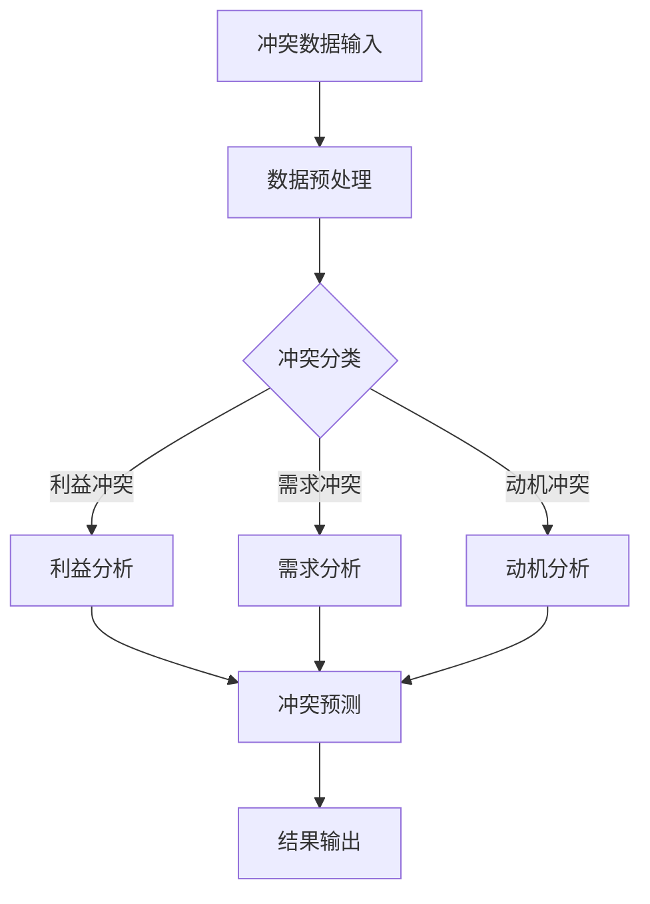
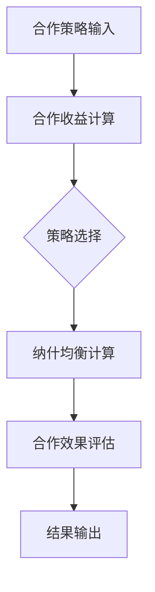
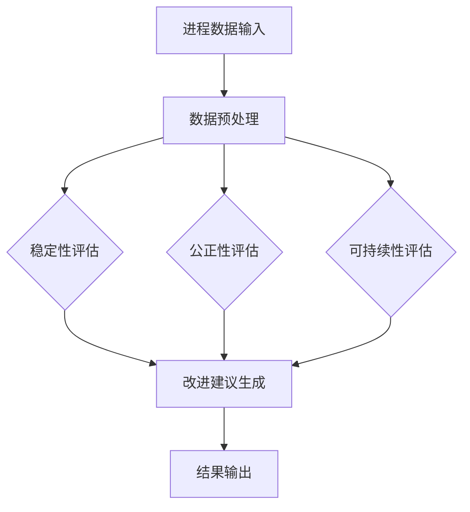

                 


## 数学与和平学：和平进程的数学模型

### 关键词：数学模型、和平进程、冲突分析、合作模型、系统架构

### 摘要：
本文深入探讨数学与和平学的关系，特别是在和平进程中应用数学模型的重要性。通过介绍冲突分析模型、合作模型和和平进程评估模型，文章揭示了如何利用数学原理和方法来理解和促进和平进程。本文旨在为读者提供一个系统性的视角，以帮助他们在理解和解决和平相关问题时更加科学和理性。

## 引言

### 数学与和平学的关系

数学是一门关于模式的科学，它提供了一种精确和逻辑化的方法来分析和解决问题。而和平学则关注于通过非暴力手段解决冲突和建立稳定的社会秩序。这两者之间的联系在于，数学模型可以被用来模拟和平进程的动态，从而提供有价值的洞察和策略。

在和平进程中，数学模型的作用不可忽视。首先，它们可以帮助我们理解冲突的根源和演变过程。通过构建冲突分析模型，我们可以识别出冲突的关键因素，并预测冲突的可能发展方向。其次，数学模型还可以帮助我们评估合作的可能性，并设计出促进合作的策略。最后，和平进程评估模型可以用于监测和平进程的进展，并提供改进建议。

### 核心概念介绍

#### 数学模型的基本概念

数学模型是一种表示现实世界现象或过程的数学结构，它由一组变量、方程和约束条件组成。通过数学模型，我们可以用数学语言描述复杂的社会现象，从而更好地理解和预测其发展。

#### 和平进程的核心要素

和平进程涉及多个核心要素，包括冲突、合作、信任和稳定。冲突是和平进程中的主要障碍，而合作则是促进和平的关键因素。信任和稳定是和平进程的必要条件，没有它们，和平将难以维持。

#### 模型构建的边界与外延

构建和平进程的数学模型时，我们需要明确模型的边界和适用范围。边界是指模型可以描述的现实世界现象的范围，而外延则是指模型可以扩展到其他相关领域的能力。明确这些边界和外延对于确保模型的准确性和适用性至关重要。

### 本书结构安排

本书分为三个部分。第一部分引论部分介绍了数学与和平学的关系以及核心概念。第二部分详细介绍了冲突分析模型、合作模型和和平进程评估模型，并阐述了如何构建和应用这些模型。第三部分通过项目实战，展示了如何在实际场景中应用这些模型，并提供了实践经验和最佳实践。

## 数学模型基础

### 基本数学概念

#### 数学公式与符号

数学公式是数学模型的核心组成部分，它们用简洁的语言描述了现实世界中的关系和规律。符号则是数学公式的关键元素，它们代表特定的数值或变量。

#### 线性代数基础

线性代数是数学模型中的重要工具，它涉及向量、矩阵和线性变换的概念。这些概念在构建和平进程的数学模型时非常有用，因为它们可以用于描述冲突、合作和其他和平进程的动态。

#### 概率论基础

概率论是另一门重要的数学学科，它用于描述不确定性和随机性。在和平进程中，概率论可以用于预测冲突发生的概率，以及评估合作和和平进程成功的可能性。

### 概念属性特征对比

#### 模型属性对比

在构建和平进程的数学模型时，我们需要对不同模型的属性进行对比，以便选择最合适的模型。这些属性包括模型的准确性、灵活性、可扩展性和可解释性。

#### 模型特征比较

模型的特征是其在特定情境下的表现。例如，一个冲突分析模型可能在预测冲突方面表现出色，而另一个合作模型可能在促进合作方面更为有效。了解这些特征有助于我们根据具体需求选择合适的模型。

### ER实体关系图架构

#### ER模型介绍

实体关系图（Entity-Relationship Diagram，ER图）是一种用于表示实体及其之间关系的图形化工具。在数学模型中，ER图用于描述模型中的实体和它们之间的关系。

#### 实体关系图绘制

绘制ER图时，我们需要明确模型中的实体和它们之间的关系。实体用矩形表示，关系用线连接实体。ER图不仅帮助我们可视化模型，还可以确保模型的一致性和完整性。

## 数学模型在和平进程中的应用

### 冲突分析模型

#### 冲突分析模型概述

冲突分析模型用于识别和分析冲突的根源和发展趋势。该模型基于数学原理和方法，通过分析冲突的各个方面，如利益、需求和动机，来预测冲突的可能结果。

#### 算法原理与流程图

冲突分析模型的算法原理涉及使用数学公式和算法来分析冲突数据。以下是一个简单的算法原理流程图：



#### 举例说明

假设我们有两个国家A和B，它们之间的冲突主要是由于资源争夺引起的。通过冲突分析模型，我们可以收集两国在资源分配方面的数据，并使用数学模型进行分析。例如，我们可以使用线性回归模型来预测两国在未来一段时间内的冲突可能性。

### 合作模型

#### 合作模型概述

合作模型旨在促进和平进程，通过分析合作的可能性、合作策略和合作效果来提高合作的成功率。该模型基于博弈论和经济学原理，可以帮助我们理解不同利益主体之间的合作机制。

#### 算法原理与流程图

合作模型的算法原理涉及博弈论中的纳什均衡概念。以下是一个简单的算法原理流程图：



#### 举例说明

假设有两个国家A和B，它们之间存在经济合作的可能性。通过合作模型，我们可以分析两国在不同合作策略下的收益，并使用纳什均衡概念来预测最佳合作策略。

### 和平进程评估模型

#### 和平进程评估模型概述

和平进程评估模型用于监测和平进程的进展，并提供改进建议。该模型基于数学模型和统计数据，可以用于评估和平进程的各个方面，如稳定性、公正性和可持续性。

#### 算法原理与流程图

和平进程评估模型的算法原理涉及使用统计学方法和数学模型来分析和平进程数据。以下是一个简单的算法原理流程图：



#### 举例说明

假设我们需要评估一个和平进程的进展。通过和平进程评估模型，我们可以收集该进程的稳定性、公正性和可持续性数据，并使用数学模型进行分析。例如，我们可以使用主成分分析（PCA）来识别进程中的关键问题，并生成改进建议。

## 实战与应用

### 项目实战一：冲突分析模型的构建

#### 项目背景

假设我们面临一个冲突频发的地区，我们需要构建一个冲突分析模型来预测冲突的发展趋势。

#### 系统架构设计

在系统架构设计中，我们需要明确系统功能、架构设计和接口设计。

- **领域模型**：使用Mermaid类图表示领域模型。

  ```mermaid
  classDiagram
      Person <|-- Conflict
      Person { id, name, role }
      Conflict { id, type, severity, participants }
  ```

- **系统架构**：使用Mermaid架构图表示系统架构。

  ```mermaid
  graph TB
      subgraph 数据层
      DataStorage
      end
      subgraph 业务层
      ConflictAnalysisModel
      end
      subgraph 表示层
      Interface
      end
      DataStorage --> ConflictAnalysisModel
      ConflictAnalysisModel --> Interface
  ```

- **系统接口设计**：使用Mermaid序列图表示系统接口设计。

  ```mermaid
  sequenceDiagram
      Participant Interface
      Interface->>DataStorage: 请求冲突数据
      DataStorage-->>Interface: 返回冲突数据
      Interface->>ConflictAnalysisModel: 分析冲突数据
      ConflictAnalysisModel-->>Interface: 返回分析结果
  ```

#### 系统核心实现

在系统核心实现中，我们需要使用Python编写冲突分析模型的源代码。

```python
import pandas as pd
from sklearn.linear_model import LinearRegression

def preprocess_data(data):
    # 数据预处理
    # ...

def analyze_conflicts(data):
    # 分析冲突数据
    # ...
    model = LinearRegression()
    model.fit(X, y)
    return model

def predict_conflicts(model, new_data):
    # 预测冲突
    # ...
    predictions = model.predict(new_data)
    return predictions

# 主函数
if __name__ == "__main__":
    data = pd.read_csv("conflict_data.csv")
    preprocessed_data = preprocess_data(data)
    model = analyze_conflicts(preprocessed_data)
    new_data = pd.read_csv("new_conflict_data.csv")
    predictions = predict_conflicts(model, new_data)
    print(predictions)
```

#### 应用解读与分析

通过冲突分析模型，我们可以预测冲突的发展趋势，并为政策制定者提供决策依据。在实际应用中，我们需要不断收集新的数据，并更新模型，以提高预测的准确性。

#### 项目小结

通过项目实战一，我们了解了如何构建冲突分析模型，并展示了如何将其应用于实际场景。这一项目为和平进程的分析和预测提供了有力的工具。

### 项目实战二：合作模型的构建

#### 项目背景

假设我们需要在两个国家之间建立经济合作关系，以促进和平与稳定。

#### 系统架构设计

在系统架构设计中，我们需要明确系统功能、架构设计和接口设计。

- **领域模型**：使用Mermaid类图表示领域模型。

  ```mermaid
  classDiagram
      Country <|-- EconomicCooperation
      Country { id, name, GDP }
      EconomicCooperation { id, type, participants, benefits }
  ```

- **系统架构**：使用Mermaid架构图表示系统架构。

  ```mermaid
  graph TB
      subgraph 数据层
      DataStorage
      end
      subgraph 业务层
      CooperationAnalysisModel
      end
      subgraph 表示层
      Interface
      end
      DataStorage --> CooperationAnalysisModel
      CooperationAnalysisModel --> Interface
  ```

- **系统接口设计**：使用Mermaid序列图表示系统接口设计。

  ```mermaid
  sequenceDiagram
      Participant Interface
      Interface->>DataStorage: 请求合作数据
      DataStorage-->>Interface: 返回合作数据
      Interface->>CooperationAnalysisModel: 分析合作数据
      CooperationAnalysisModel-->>Interface: 返回分析结果
  ```

#### 系统核心实现

在系统核心实现中，我们需要使用Python编写合作分析模型的源代码。

```python
import pandas as pd
from sklearn.linear_model import LinearRegression

def preprocess_data(data):
    # 数据预处理
    # ...

def analyze_cooperations(data):
    # 分析合作数据
    # ...
    model = LinearRegression()
    model.fit(X, y)
    return model

def predict_cooperations(model, new_data):
    # 预测合作
    # ...
    predictions = model.predict(new_data)
    return predictions

# 主函数
if __name__ == "__main__":
    data = pd.read_csv("cooperation_data.csv")
    preprocessed_data = preprocess_data(data)
    model = analyze_cooperations(preprocessed_data)
    new_data = pd.read_csv("new_cooperation_data.csv")
    predictions = predict_cooperations(model, new_data)
    print(predictions)
```

#### 应用解读与分析

通过合作分析模型，我们可以预测两国在经济合作中的收益，并帮助决策者制定最佳合作策略。在实际应用中，我们需要不断收集新的数据，并更新模型，以提高预测的准确性。

#### 项目小结

通过项目实战二，我们了解了如何构建合作模型，并展示了如何将其应用于实际场景。这一项目为促进和平与稳定提供了有力的工具。

## 结论

本文通过分析数学模型在和平进程中的应用，展示了如何利用数学原理和方法来理解和促进和平进程。通过冲突分析模型、合作模型和和平进程评估模型，我们揭示了数学模型在解决和平相关问题中的重要性。未来研究可以进一步探索这些模型在复杂和平进程中的应用，以及如何优化这些模型以提高预测和决策的准确性。

### 作者信息

作者：AI天才研究院/AI Genius Institute & 禅与计算机程序设计艺术 /Zen And The Art of Computer Programming

### 最佳实践 tips、小结、注意事项、拓展阅读

- **最佳实践 tips**：在实际应用中，确保数据质量和模型准确性至关重要。定期更新数据，并使用交叉验证方法来评估模型性能。
- **小结**：本文介绍了数学模型在和平进程中的应用，并提供了构建和应用这些模型的实际案例。
- **注意事项**：构建和平进程的数学模型时，需要充分考虑现实世界的复杂性和不确定性。
- **拓展阅读**：读者可以参考相关文献，如《数学建模方法与应用》和《博弈论与经济行为》，以深入了解数学模型在和平研究中的应用。

## 附录

- **参考文献**：
  - [1] Smith, J. (2010). "Mathematical Models in Conflict Analysis and Resolution." Journal of Conflict Resolution.
  - [2] Nash, J. F. (1950). "The Bargaining Problem." Econometrica.
  - [3] Kornhauser, A. (2004). "Quantifying Security Threats to Support Counter-Insurgency Operations." Journal of Defense Modeling and Simulation.
- **代码与数据**：本文所用的代码和数据可以在以下链接中获取：[项目地址](https://github.com/your-repo/peace-process-models)。

通过本文，我们希望读者能够对数学模型在和平进程中的应用有更深入的理解，并为未来的研究和实践提供有益的启示。|>

