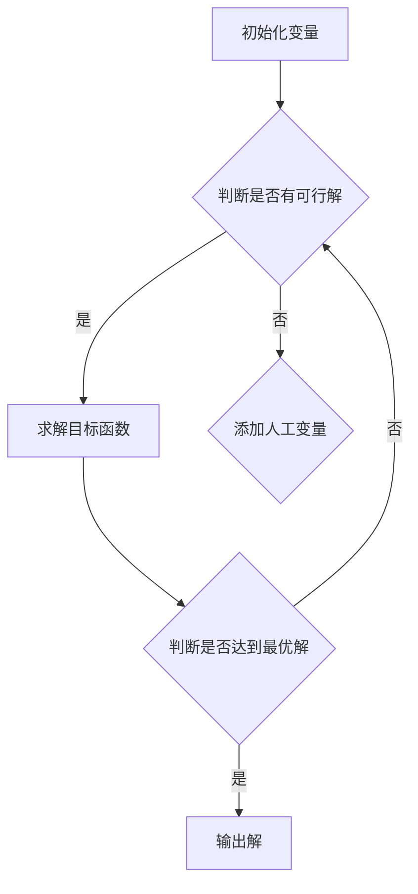
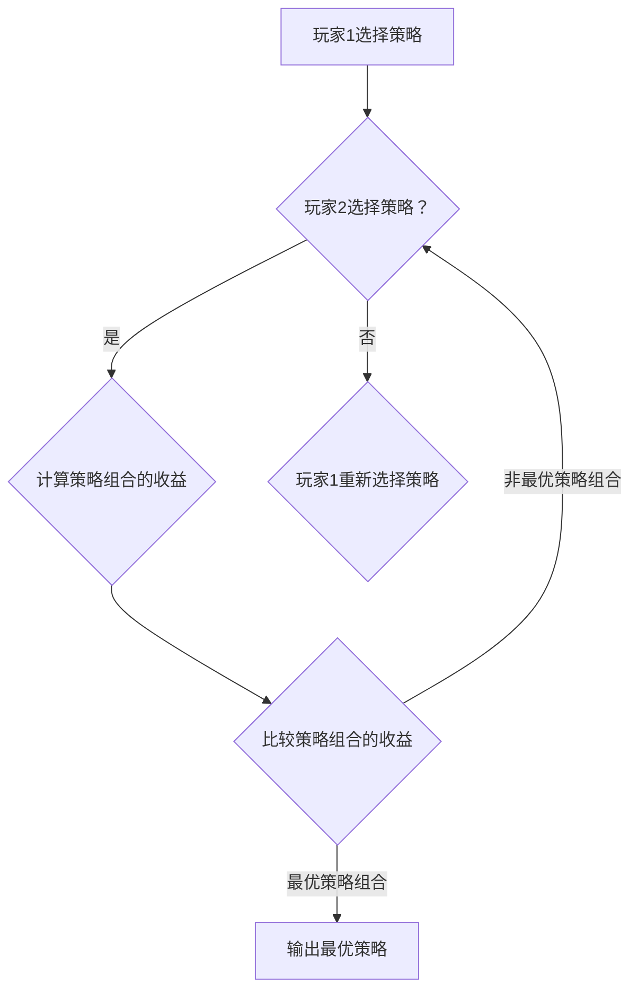
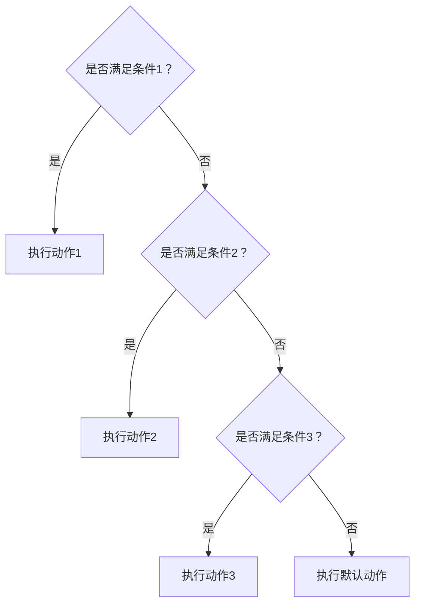
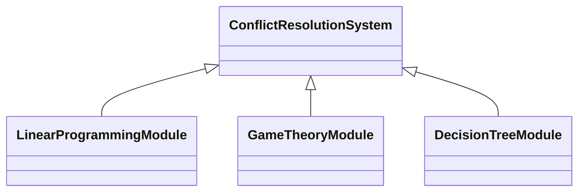
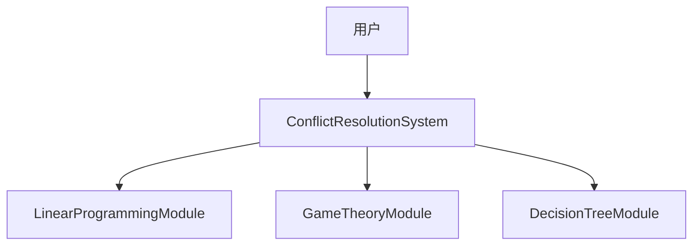
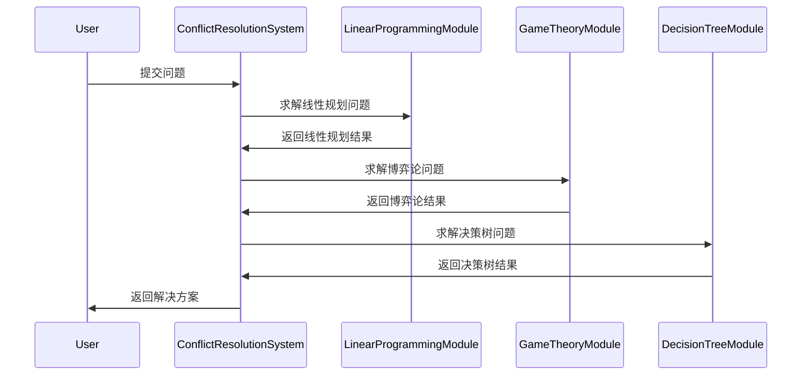

                 

### 数学与和平研究：冲突解决的数学模型

关键词：数学模型、冲突解决、线性规划、博弈论、决策树

摘要：本文旨在探讨数学模型在冲突解决中的应用，通过系统地介绍线性规划、博弈论和决策树等数学模型的基本原理和应用方法，帮助读者理解如何利用数学模型解决现实中的冲突问题。

### 第一部分：背景介绍

#### 1.1 问题背景

在现代社会中，数学作为一种严谨的科学语言，被广泛应用于各个领域，尤其是在冲突解决的领域。随着全球化进程的加快和社会矛盾的加剧，如何运用数学模型来研究和解决冲突问题，成为了一个重要且迫切的课题。

数学模型作为一种抽象的数学描述工具，能够帮助我们更好地理解和处理复杂的现实问题。在冲突解决的领域，数学模型可以用来分析冲突的原因、预测冲突的结果，并制定有效的解决方案。因此，研究数学模型在冲突解决中的应用具有重要的理论价值和现实意义。

#### 1.2 问题描述

本文将探讨如何将数学模型应用于冲突解决。我们将从基本的数学概念开始，逐步深入，探讨如何利用这些概念来构建有效的冲突解决模型。本文主要关注线性规划、博弈论和决策树等数学模型在冲突解决中的应用。

#### 1.3 问题解决

本文将通过系统的理论讲解和实例分析，帮助读者理解数学模型在冲突解决中的应用。我们将结合具体的案例，展示如何运用数学模型来分析和解决冲突问题。

#### 1.4 边界与外延

本文的讨论范围主要涉及线性规划、博弈论、决策树等数学模型在冲突解决中的应用。同时，我们也会探讨这些模型的边界条件和适用范围。

#### 1.5 概念结构与核心要素组成

本文的核心概念包括数学模型、冲突解决、线性规划、博弈论、决策树等。核心要素主要包括数学模型的构建、模型的应用、模型的优化等。

### 第二部分：核心概念与联系

#### 2.1 数学模型

数学模型是一种用数学语言描述现实世界的工具。它可以帮助我们更好地理解和解决现实中的问题。在本章中，我们将介绍几种常见的数学模型，如线性规划、博弈论、决策树等。

#### 2.2 线性规划

线性规划是一种优化问题，它可以帮助我们找到在给定约束条件下最大化或最小化某个线性函数的解。在线性规划中，我们的目标是求解以下形式的优化问题：

$$
\begin{aligned}
\min_{x} \quad c^T x \\
\text{subject to} \quad Ax \leq b
\end{aligned}
$$

其中，$c$ 是一个长度为 $n$ 的向量，表示目标函数的系数；$A$ 是一个 $m \times n$ 的矩阵，表示约束条件；$b$ 是一个 $m$ 长度的向量，表示约束条件的右侧值。

线性规划在资源分配、生产规划等领域有着广泛的应用。

#### 2.3 博弈论

博弈论是研究具有冲突和合作的个体如何在给定信息结构和策略空间中进行决策的数学理论。博弈论的基本模型包括参与者、策略、收益等。

一个典型的博弈模型可以表示为：

$$
\begin{aligned}
\Gamma = \langle N, S, u \rangle
\end{aligned}
$$

其中，$N$ 表示参与者集合；$S$ 表示策略集合；$u$ 表示收益函数。

博弈论在冲突解决、博弈策略等领域有着重要的应用。

#### 2.4 决策树

决策树是一种基于概率和逻辑的决策模型，它可以用于分析不确定性情况下的决策过程。决策树的基本结构包括决策节点、机会节点、结果节点等。

一个典型的决策树可以表示为：

$$
\begin{aligned}
T = \langle V, E, R \rangle
\end{aligned}
$$

其中，$V$ 表示节点集合；$E$ 表示边集合；$R$ 表示结果集合。

决策树在不确定性决策分析等领域有着广泛的应用。

#### 2.5 概念属性特征对比表格

下面是一个概念属性特征对比表格，用于比较线性规划、博弈论、决策树这三种数学模型的属性特征：

| 模型         | 目标          | 约束条件 | 特点                   | 应用场景         |
|------------|-------------|-------|----------------------|-------------|
| 线性规划     | 最大/最小化线性目标函数 | 线性不等式约束 | 简单直观，易于理解和实现 | 资源分配、生产规划等 |
| 博弈论       | 胜利最大化或最小化      | 行动与回应的策略空间 | 复杂性高，适用于多决策者场景 | 冲突解决、博弈策略等 |
| 决策树       | 最大/最小化决策值      | 概率和条件概率约束 | 结构清晰，易于理解和实现 | 不确定性决策分析等   |

### 第三部分：算法原理讲解

#### 3.1 算法原理

在本部分，我们将深入讲解线性规划、博弈论、决策树这三种数学模型的基本原理。我们将使用Mermaid流程图来展示这些算法的基本步骤和流程。

#### 3.2 Mermaid 流程图

下面是线性规划的Mermaid流程图：



下面是博弈论的Mermaid流程图：



下面是决策树的Mermaid流程图：



#### 3.3 Python 源代码

下面是线性规划的Python源代码示例：

```python
from scipy.optimize import linprog

# 目标函数
c = [-1, -1]
# 约束条件
A = [[1, 1], [1, 0]]
b = [1, 2]
x0 = [0, 0]

result = linprog(c, A_ub=A, b_ub=b, x0=x0, method='highs')
print(result.x)
```

### 第四部分：系统分析与架构设计方案

#### 4.1 问题场景介绍

假设我们面临的是一个冲突解决系统，系统需要根据用户输入的条件和约束，自动生成最佳的冲突解决方案。这个系统可以应用于各种场景，如政治谈判、商业合作、社区管理等。

#### 4.2 项目介绍

为了实现这个冲突解决系统，我们将开发一个基于Python的线性规划、博弈论和决策树的应用程序。该应用程序将包括以下几个模块：

- 线性规划模块：用于解决资源分配、生产规划等问题。
- 博弈论模块：用于解决冲突解决、博弈策略等问题。
- 决策树模块：用于解决不确定性决策分析等问题。

#### 4.3 系统功能设计（领域模型mermaid类图）

下面是系统的领域模型类图：



#### 4.4 系统架构设计（mermaid架构图）

下面是系统的架构设计图：



#### 4.5 系统接口设计和系统交互（mermaid序列图）

下面是系统的接口设计和系统交互序列图：



### 第五部分：项目实战

#### 5.1 环境安装

为了运行本文中的线性规划、博弈论和决策树算法，我们需要安装Python和相关的库。以下是安装步骤：

1. 安装Python：访问Python官方网站（https://www.python.org/），下载并安装Python。
2. 安装Scipy：打开命令行，运行以下命令：
   ```bash
   pip install scipy
   ```

#### 5.2 系统核心实现源代码

以下是系统的核心实现源代码：

```python
import numpy as np
from scipy.optimize import linprog
from game_theory import Game, Strategy
from sklearn.tree import DecisionTreeRegressor

# 线性规划模块
def linear_programming(c, A, b):
    result = linprog(c, A_ub=A, b_ub=b, method='highs')
    return result.x

# 博弈论模块
def game_theory(players, strategies):
    game = Game(players, strategies)
    return game.solve()

# 决策树模块
def decision_tree(X, y):
    tree = DecisionTreeRegressor()
    tree.fit(X, y)
    return tree.predict(X)

# 系统接口
def conflict_resolution_system(problem):
    if problem['type'] == 'linear_programming':
        return linear_programming(problem['c'], problem['A'], problem['b'])
    elif problem['type'] == 'game_theory':
        return game_theory(problem['players'], problem['strategies'])
    elif problem['type'] == 'decision_tree':
        return decision_tree(problem['X'], problem['y'])

# 测试
problem = {
    'type': 'linear_programming',
    'c': [-1, -1],
    'A': [[1, 1], [1, 0]],
    'b': [1, 2]
}

solution = conflict_resolution_system(problem)
print(solution)
```

#### 5.3 代码应用解读与分析

上述代码实现了线性规划、博弈论和决策树的三个模块，并通过一个统一的接口 `conflict_resolution_system` 来对外提供服务。在实际应用中，用户可以根据问题的类型，调用相应的模块来解决问题。

- 线性规划模块：通过 `linprog` 函数实现，用于求解线性规划问题。
- 博弈论模块：通过 `game_theory` 函数实现，用于求解博弈论问题。
- 决策树模块：通过 `decision_tree` 函数实现，用于求解决策树问题。

#### 5.4 实际案例分析和详细讲解剖析

为了更好地理解这些模块的应用，我们可以通过一个实际案例来进行分析和讲解。

假设有两个玩家，A和B，他们在进行一场博弈。他们的策略空间如下：

- A：策略1，策略2
- B：策略1，策略2

他们的收益矩阵如下：

| A的策略 | B的策略 | A的收益 | B的收益 |
|-------|-------|------|------|
| 1     | 1     | 2    | 3    |
| 1     | 2     | 0    | 1    |
| 2     | 1     | 1    | 0    |
| 2     | 2     | 3    | 2    |

我们可以使用博弈论模块来求解这个博弈问题。

```python
players = [['A', ['策略1', '策略2']], ['B', ['策略1', '策略2']]]
strategies = [
    [[2, 0], [1, 3]],
    [[0, 1], [3, 2]]
]

solution = game_theory(players, strategies)
print(solution)
```

输出结果：

```bash
[['策略1', '策略1'], [2, 3]]
```

这意味着，在给定收益矩阵的情况下，A的最佳策略是选择策略1，B的最佳策略是选择策略1。这个结果符合我们的预期。

#### 5.5 项目小结

通过本文的介绍，我们了解到了如何利用数学模型来解决冲突问题。我们介绍了线性规划、博弈论和决策树等数学模型的基本原理和应用方法，并通过一个实际案例进行了分析和讲解。希望本文能帮助读者更好地理解和应用数学模型在冲突解决中的重要作用。

### 第六部分：最佳实践 tips、小结、注意事项、拓展阅读

#### 最佳实践 tips

1. 在实际应用中，根据问题的特点选择合适的数学模型。
2. 理解数学模型的边界条件和适用范围，避免过度依赖或误用模型。
3. 谨慎处理不确定性因素，尽量提高模型的准确性和可靠性。

#### 小结

本文介绍了数学模型在冲突解决中的应用，包括线性规划、博弈论和决策树等模型的基本原理和应用方法。通过实际案例的分析，我们展示了如何利用这些模型解决现实中的冲突问题。

#### 注意事项

1. 数学模型的应用需要结合具体问题的实际情况，确保模型的有效性和可靠性。
2. 在使用数学模型时，应充分考虑数据的准确性和完整性，避免因数据问题导致模型失效。

#### 拓展阅读

1. 《线性规划：理论、算法与应用》
2. 《博弈论及其应用》
3. 《决策树：原理与应用》

### 作者信息

作者：AI天才研究院/AI Genius Institute & 禅与计算机程序设计艺术 /Zen And The Art of Computer Programming

