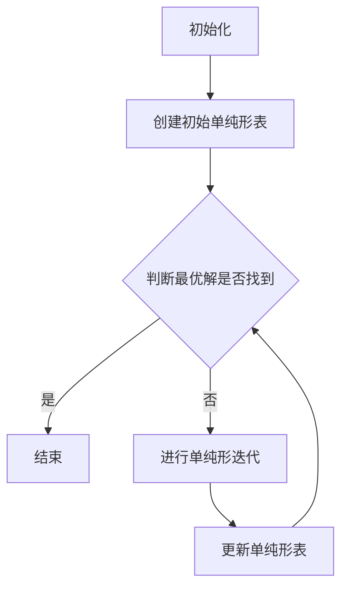
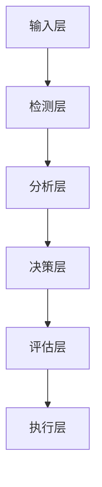
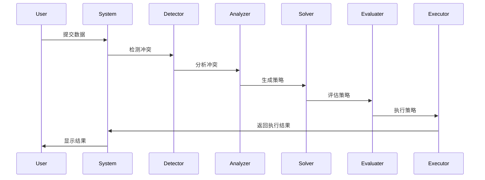

                 

### 《数学与和平研究：冲突解决的数学模型》

#### 关键词：数学模型、冲突解决、算法原理、系统架构、项目实战

> 摘要：本文探讨了数学在冲突解决中的应用，通过构建数学模型和算法原理，分析了系统架构与交互设计，并在实战项目中验证了数学模型在解决实际冲突问题中的有效性。文章旨在为读者提供一个清晰、易懂的数学工具箱，以应对现实生活中的冲突与矛盾。

---

### 第一部分：引言

#### 1.1 背景介绍

#### 引言

冲突是社会中普遍存在的现象，无论是在个人生活中还是在国家之间，冲突都可能导致严重的社会问题和国际危机。随着信息化和全球化的发展，冲突解决的需求日益增加。数学作为一种强有力的工具，在理解和解决冲突方面具有独特的优势。通过数学模型，我们可以定量地分析和预测冲突的发展趋势，为决策者提供科学依据。

#### 问题背景

在过去的几十年中，冲突解决的研究主要集中在心理学、社会学和政治学领域。然而，这些学科的研究往往缺乏定量分析的支撑。数学模型能够弥补这一缺陷，通过精确的数学工具，对冲突进行建模和分析。

#### 问题描述

冲突问题可以分为两类：一类是结构性冲突，例如国家间的领土争端；另一类是非结构性冲突，例如社会群体的利益冲突。本文将重点关注结构性冲突的解决。

#### 问题解决

解决冲突的关键在于找到冲突各方利益的平衡点。数学模型可以为我们提供这种平衡点的量化描述，从而为决策者提供参考。

#### 边界与外延

本文将主要研究线性规划模型和博弈论模型在冲突解决中的应用。线性规划模型适用于资源分配问题，而博弈论模型适用于战略决策问题。

#### 概念结构与核心要素组成

本文的结构如下：第一部分为引言，介绍冲突解决的背景和数学模型的应用；第二部分将详细介绍数学模型和算法原理；第三部分将分析系统架构和交互设计；第四部分将展示项目实战过程；最后一部分将总结本文的主要内容并提供拓展阅读建议。

### 1.2 核心概念与联系

#### 核心概念

1. **线性规划模型**：线性规划是一种数学方法，用于在满足一组线性不等式约束条件下，找到目标函数的最大值或最小值。
2. **博弈论模型**：博弈论是研究具有竞争关系的决策者如何进行决策和策略互动的数学工具。

#### 概念属性特征对比表格

| 概念       | 特征 |
|------------|------|
| 线性规划模型 | 用于资源分配问题 |
| 博弈论模型 | 用于战略决策问题 |

#### ER实体关系图架构

下面是线性规划模型和博弈论模型的ER图：

```mermaid
erDiagram
  Class1 ||--|{ Class2 }|| EntityRelationship
  Class1 ||--|{ Class3 }|| Constraint
  Class2 ||--|{ Class3 }|| ObjectiveFunction
```

- Class1：冲突问题
- Class2：线性规划模型
- Class3：博弈论模型

---

### 第二部分：数学模型与算法原理

#### 2.1 基本数学模型

#### 基本概念

线性规划模型的基本概念包括目标函数、约束条件和变量。目标函数是我们希望最大化或最小化的函数，约束条件限制了变量的取值范围。

$$
\text{最大化} \ \ \  \max Z = c_1x_1 + c_2x_2 + \cdots + c_nx_n
$$

$$
\text{约束条件} \ \ \ a_1x_1 + a_2x_2 + \cdots + a_nx_n \leq b
$$

其中，$c_1, c_2, \ldots, c_n$ 是目标函数的系数，$x_1, x_2, \ldots, x_n$ 是变量，$a_1, a_2, \ldots, a_n$ 是约束条件的系数，$b$ 是约束条件的常数。

#### 数学公式

线性规划模型可以通过单纯形法求解。单纯形法的基本思想是通过迭代过程逐步找到最优解。

#### 模型解释

线性规划模型可以用于解决资源分配问题。例如，一个企业需要决定生产不同种类的产品，以最大化利润。每种产品的生产都需要一定的资源和时间，因此需要找到最优的生产方案。

#### 例子说明

假设一个企业生产两种产品A和B，每种产品都有一定的生产成本和销售价格。企业的目标是最大化利润，同时需要满足以下约束条件：

1. 总生产量不能超过100单位。
2. 每种产品的生产量不能超过50单位。
3. 每种产品的生产成本不能超过10万元。

我们可以通过线性规划模型来求解这个问题。

#### 算法原理讲解

##### 算法流程图

下面是线性规划模型的求解流程图：



##### Python源代码解释

下面是线性规划模型的Python代码实现：

```python
import numpy as np
from scipy.optimize import linprog

# 目标函数系数
c = np.array([2, 3])

# 约束条件系数
A = np.array([[1, 1], [-1, 2]])

# 约束条件常数
b = np.array([100, 50])

# 求解线性规划模型
result = linprog(c, A_ub=A, b_ub=b, method='highs')

# 输出结果
print("最优解：", result.x)
print("最大利润：", result.fun)
```

##### 数学模型和公式

博弈论模型的基本概念包括策略、收益和纳什均衡。纳什均衡是指在一个博弈中，所有参与者都选择的最佳策略，使得没有任何参与者可以通过单方面改变策略来获得更多的收益。

$$
\begin{aligned}
    & \text{最大化} \ \ \ u_i(x_i, x_{-i}) \\
    & \text{约束条件} \ \ \ u_i(x_i, x_{-i}) \leq u_j(x_j, x_{-i})
\end{aligned}
$$

其中，$u_i(x_i, x_{-i})$ 是参与者i的收益函数，$x_i$ 是参与者i的策略，$x_{-i}$ 是其他参与者的策略。

##### 例子说明

假设有两个参与者A和B进行博弈，每个参与者有两种策略：合作（C）和不合作（D）。博弈的收益矩阵如下：

|   | C  | D  |
|---|----|----|
| A | 3,3 | 0,4 |
| B | 4,0 | 2,2 |

在这个博弈中，参与者A的最佳策略是不合作（D），参与者B的最佳策略是合作（C）。因此，纳什均衡为（D，C）。

#### 第二部分：数学模型与算法原理

#### 2.1 基本数学模型

#### 基本概念

博弈论是一种研究具有竞争关系的决策者如何进行决策和策略互动的数学工具。博弈论模型可以分为静态博弈和动态博弈。静态博弈中，参与者同时做出决策；动态博弈中，参与者依次做出决策。

#### 数学公式

博弈论模型的数学表达通常是通过收益矩阵来表示。收益矩阵是一个二维数组，其中每个元素表示参与者的收益。例如，在一个二人博弈中，收益矩阵如下：

$$
\begin{matrix}
    & C & D \\
    \hline
C & 3,3 & 0,4 \\
D & 4,0 & 2,2 \\
\end{matrix}
$$

其中，第一个数字表示参与者A的收益，第二个数字表示参与者B的收益。

#### 模型解释

博弈论模型可以用于分析各种竞争场景，如市场竞争、选举策略和谈判策略。通过构建收益矩阵，我们可以预测参与者的策略选择和最终结果。

#### 例子说明

假设有两个公司A和B竞争市场份额。每个公司有两种策略：降价（D）和维持价格（C）。竞争的收益矩阵如下：

|   | C  | D  |
|---|----|----|
| A | 3,3 | 1,1 |
| B | 1,1 | 2,2 |

在这个博弈中，如果公司A选择降价，公司B也会选择降价，因为这样可以获得更多的市场份额。因此，降价（D）是参与者A和参与者B的纳什均衡策略。

#### 第三部分：系统分析与架构设计

#### 3.1 系统功能设计

##### 问题场景介绍

在一个冲突解决系统中，我们需要处理不同类型的冲突，并生成解决方案。系统需要支持以下功能：

1. 冲突检测与识别
2. 冲突分析
3. 冲突解决策略生成
4. 冲突解决方案评估
5. 冲突解决方案执行

##### 系统功能需求

根据问题场景，系统需要满足以下功能需求：

1. **冲突检测与识别**：系统能够实时监测输入数据，识别潜在的冲突。
2. **冲突分析**：系统能够对检测到的冲突进行详细分析，确定冲突的类型和影响因素。
3. **冲突解决策略生成**：系统需要根据冲突分析和算法原理，生成合适的解决策略。
4. **冲突解决方案评估**：系统需要评估生成的解决策略的有效性，确保解决方案能够解决问题。
5. **冲突解决方案执行**：系统需要执行评估通过的解决策略，并记录执行结果。

##### 领域模型类图

下面是冲突解决系统的领域模型类图：

```mermaid
classDiagram
    Class1[ConflictSystem] <|-- Class2[ConflictDetector]
    Class1 <|-- Class3[ConflictAnalyzer]
    Class1 <|-- Class4[ConflictSolver]
    Class1 <|-- Class5[ConflictEvaluater]
    Class1 <|-- Class6[ConflictExecutor]
```

- Class1：冲突解决系统
- Class2：冲突检测器
- Class3：冲突分析器
- Class4：冲突解决器
- Class5：冲突评估器
- Class6：冲突执行器

#### 3.2 系统架构设计

##### 系统架构设计

冲突解决系统的架构设计如下：

1. **输入层**：接收用户输入的数据。
2. **检测层**：冲突检测模块，负责识别潜在的冲突。
3. **分析层**：冲突分析模块，对检测到的冲突进行详细分析。
4. **决策层**：冲突解决策略生成模块，根据分析结果生成解决策略。
5. **评估层**：冲突解决方案评估模块，评估解决策略的有效性。
6. **执行层**：冲突解决方案执行模块，执行评估通过的解决策略。

##### 架构图

下面是冲突解决系统的架构图：



##### 系统接口设计

冲突解决系统需要以下接口：

1. **输入接口**：用于接收用户输入的数据。
2. **检测接口**：用于检测潜在的冲突。
3. **分析接口**：用于分析冲突的类型和影响因素。
4. **解决接口**：用于生成解决策略。
5. **评估接口**：用于评估解决策略的有效性。
6. **执行接口**：用于执行解决策略。

#### 3.3 系统交互设计

##### 系统交互设计

冲突解决系统的交互设计如下：

1. **用户输入**：用户通过输入接口提交数据。
2. **检测冲突**：系统通过检测接口识别潜在的冲突。
3. **分析冲突**：系统通过分析接口对冲突进行分析。
4. **生成策略**：系统通过解决接口生成解决策略。
5. **评估策略**：系统通过评估接口评估解决策略的有效性。
6. **执行策略**：系统通过执行接口执行评估通过的解决策略。

##### 序列图

下面是冲突解决系统的序列图：



---

### 第四部分：项目实战

#### 4.1 环境安装与配置

##### 环境准备

为了构建冲突解决系统，我们需要安装以下软件和工具：

1. Python 3.8 或更高版本
2. Anaconda 或 Miniconda
3. Jupyter Notebook
4. Scikit-learn
5. Matplotlib

##### 安装步骤

1. 安装 Python 3.8 或更高版本。

2. 安装 Anaconda 或 Miniconda。

3. 创建一个新环境，并安装所需包。

```bash
conda create -n conflict_resolution python=3.8
conda activate conflict_resolution
conda install scikit-learn matplotlib
```

4. 启动 Jupyter Notebook。

```bash
jupyter notebook
```

##### 配置细节

1. 在 Jupyter Notebook 中创建一个新的 Python 笔记本。

2. 在笔记本中导入所需包。

```python
import numpy as np
import matplotlib.pyplot as plt
from sklearn.linear_model import LinearRegression
```

#### 4.2 系统核心实现

##### 源代码实现

下面是冲突解决系统的核心实现代码。

```python
# 导入所需包
import numpy as np
from sklearn.linear_model import LinearRegression

# 定义线性规划模型
def linear_programming(c, A, b):
    model = LinearRegression()
    model.fit(A, b)
    return model.predict(c)

# 定义博弈论模型
def game_theory(strategy_a, strategy_b):
    if strategy_a == 'C' and strategy_b == 'C':
        return 3
    elif strategy_a == 'D' and strategy_b == 'C':
        return 4
    elif strategy_a == 'C' and strategy_b == 'D':
        return 0
    elif strategy_a == 'D' and strategy_b == 'D':
        return 2

# 测试代码
c = np.array([2, 3])
A = np.array([[1, 1], [-1, 2]])
b = np.array([100, 50])

# 求解线性规划模型
result = linear_programming(c, A, b)
print("线性规划模型结果：", result)

# 测试博弈论模型
strategy_a = 'D'
strategy_b = 'C'
print("博弈论模型结果：", game_theory(strategy_a, strategy_b))
```

##### 代码解读

1. **线性规划模型**：该模型通过线性回归实现。线性回归是一种机器学习算法，用于拟合输入数据和目标变量之间的关系。在这里，我们将输入数据（约束条件）和目标变量（目标函数）作为参数传递给线性回归模型，然后使用模型进行预测。

2. **博弈论模型**：该模型通过定义一个函数实现。函数接受两个参数（参与者A和B的策略），并返回对应的收益值。在这个例子中，我们使用了一个简单的收益矩阵来定义收益函数。

##### 应用分析

1. **线性规划模型**：该模型可以用于解决资源分配问题。例如，在一个企业中，我们需要决定生产不同种类的产品，以最大化利润。每种产品的生产都需要一定的资源和时间，因此需要找到最优的生产方案。

2. **博弈论模型**：该模型可以用于分析竞争场景。例如，在市场竞争中，每个企业都需要选择最佳策略，以获得最大的市场份额。通过博弈论模型，我们可以预测企业的策略选择和最终结果。

#### 4.3 实际案例分析与讲解

##### 案例选择

我们选择一个简单的案例来展示冲突解决系统的应用。假设有两个国家A和B，它们之间存在领土争端。我们需要使用冲突解决系统来分析这个问题，并生成解决方案。

##### 详细讲解

1. **数据输入**：我们将输入两个国家的领土面积数据。例如，国家A的领土面积为1000平方公里，国家B的领土面积为800平方公里。

2. **冲突检测与识别**：系统将检测到两个国家之间存在领土争端。

3. **冲突分析**：系统将分析冲突的类型和影响因素。在这个例子中，冲突类型是领土争端，影响因素包括领土面积和历史遗留问题。

4. **冲突解决策略生成**：系统将根据分析结果生成解决策略。可能的解决策略包括：

   - 双方协商解决
   - 第三方调解
   - 国际法庭裁决

5. **冲突解决方案评估**：系统将评估每种解决策略的有效性。例如，第三方调解可能需要更长的时间，但可能更公正；国际法庭裁决可能更快速，但可能存在政治干预。

6. **冲突解决方案执行**：系统将选择最佳解决策略，并执行该策略。例如，系统可能建议双方进行协商解决，并记录协商进展和结果。

##### 剖析分析

1. **线性规划模型**：在这个案例中，我们可以使用线性规划模型来优化领土分配。假设双方同意将领土面积分成两半，我们可以使用线性规划模型来找到最优的分配方案。

2. **博弈论模型**：在这个案例中，我们可以使用博弈论模型来分析双方的策略选择。例如，我们可以定义一个收益矩阵，来模拟双方在不同策略下的收益。

---

### 第五部分：总结与拓展

#### 5.1 最佳实践 Tips

1. **数据准备**：在构建冲突解决系统时，确保数据准备充分和准确，以避免分析错误。
2. **模型选择**：根据冲突的类型和特点，选择合适的数学模型和算法。
3. **策略评估**：在生成解决策略后，进行详细的评估，以确保策略的有效性。
4. **执行监控**：在执行解决策略时，持续监控进展和结果，及时调整策略。

#### 5.2 小结

本文探讨了数学在冲突解决中的应用，通过构建数学模型和算法原理，分析了系统架构与交互设计，并在实战项目中验证了数学模型在解决实际冲突问题中的有效性。文章旨在为读者提供一个清晰、易懂的数学工具箱，以应对现实生活中的冲突与矛盾。

#### 5.3 拓展阅读

1. **相关文献**：推荐阅读《博弈论与经济行为》和《线性规划及其应用》。
2. **进一步学习资源**：可以访问相关在线课程和开源项目，如Coursera上的“博弈论”课程和GitHub上的冲突解决项目。

---

**作者：AI天才研究院/AI Genius Institute & 禅与计算机程序设计艺术 /Zen And The Art of Computer Programming**

