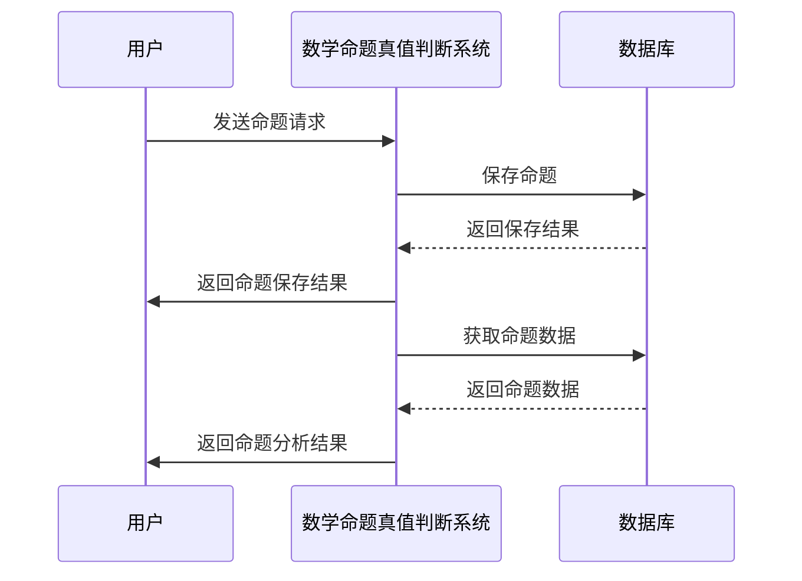

                 

### 《数学与哲学命题的真理性判断》

#### 关键词

- 数理逻辑
- 哲学命题
- 真理性判断
- 算法设计
- 系统架构

#### 摘要

本文旨在探讨数学命题与哲学命题在真理性判断方面的异同，结合逻辑学与计算机科学的方法，对真理性判断的算法原理进行深入解析。文章通过定义、分析和实例，阐述数学与哲学命题在逻辑结构、意义表达和真值判断上的独特之处，为读者提供一个全面而系统的理解框架。通过本文的阐述，读者将掌握数学与哲学命题真理性判断的核心原理，并能应用于实际问题中。

### 目录大纲

```markdown
----------------------------------------------------------------
# 《数学与哲学命题的真理性判断》目录大纲

## 第一部分：背景介绍

## 第1章 引言

### 1.1 问题背景

### 1.2 问题描述

### 1.3 问题解决

### 1.4 边界与外延

### 1.5 概念结构与核心要素组成

## 第二部分：核心概念与联系

## 第2章 数学命题与逻辑结构

### 2.1 数学命题的定义与性质

### 2.2 数学命题的表示方法

### 2.3 逻辑结构与基本原理

### 2.4 数学命题的真值表

## 第3章 哲学命题与意义

### 3.1 哲学命题的类型

### 3.2 哲学命题的意义

### 3.3 哲学命题的分析方法

### 3.4 哲学命题的实证问题

## 第三部分：算法原理讲解

## 第4章 真理性判断算法原理

### 4.1 算法概述

### 4.2 算法流程图

### 4.3 算法原理讲解

### 4.4 数学模型与公式

### 4.5 举例说明

## 第四部分：数学模型和数学公式 & 详细讲解 & 举例说明

## 第5章 数学公式与真值判断

### 5.1 LaTeX数学公式基本语法

### 5.2 真值判断的数学公式

### 5.3 公式应用举例

## 第五部分：系统分析与架构设计方案

## 第6章 数学命题真值判断系统设计

### 6.1 问题场景介绍

### 6.2 项目介绍

### 6.3 系统功能设计

### 6.4 系统架构设计

### 6.5 系统接口设计和系统交互

## 第7章 项目实战

### 7.1 环境安装

### 7.2 系统核心实现源代码

### 7.3 代码应用解读与分析

### 7.4 实际案例分析与详细讲解剖析

### 7.5 项目小结

## 第六部分：最佳实践 tips、小结、注意事项、拓展阅读等内容

## 第8章 最佳实践 tips

## 第9章 小结

## 第10章 注意事项

## 第11章 拓展阅读

----------------------------------------------------------------
```

接下来，本文将按照目录大纲逐章展开，逐步深入探讨数学与哲学命题的真理性判断问题。

### 第一部分：背景介绍

#### 1.1 问题背景

在人类文明的发展历程中，数学和哲学一直占据着重要地位。数学作为一种精确的科学，通过符号和公式揭示了自然界和人类社会的规律。而哲学则探讨存在、知识、价值和理智等基本问题。两者的交集之一在于命题的真理性判断。

数学命题通常具有明确的逻辑结构，可以通过数学模型和公式进行严格验证。而哲学命题则往往更加复杂，涉及到价值判断、伦理道德和个人信仰等主观因素。这使得哲学命题的真理性判断相比数学命题更具挑战性。

在当前技术背景下，计算机科学的发展为数学与哲学命题的真理性判断提供了新的工具和方法。例如，形式逻辑和人工智能技术可以被用来分析哲学命题的逻辑结构，从而判断其真伪。

#### 1.2 问题描述

本文的主要问题是如何在数学和哲学命题中判断其真理性。具体而言，我们需要解决以下几个问题：

1. 数学命题和哲学命题在真理性判断上的差异是什么？
2. 如何构建一个算法来对哲学命题进行真理性判断？
3. 这个算法的理论基础是什么？
4. 如何在实际应用中实现这个算法？

#### 1.3 问题解决

本文将首先介绍数学命题和哲学命题的基本概念和逻辑结构，然后分析两者在真理性判断上的异同。接下来，我们将提出一个用于哲学命题真理性判断的算法，并详细阐述其原理和实现方法。

为了更好地理解算法，我们将使用数学模型和公式进行解释，并通过具体实例来说明算法的应用。此外，我们还将设计一个数学命题真值判断的系统架构，并讨论其实际应用场景。

#### 1.4 边界与外延

在讨论数学命题和哲学命题的真理性判断时，我们需要明确一些概念的外延和边界。

1. **数学命题**：通常是指可以用数学语言明确表述的命题，它们通常具有明确的真假值。数学命题的边界在于其逻辑结构和公理体系。
2. **哲学命题**：涉及人类思维、价值、伦理和存在等深层次问题。哲学命题的真理性判断不仅依赖于逻辑推理，还涉及到主观判断和实证研究。
3. **真理性判断**：指的是对命题真假值的判定。数学命题的真理性判断可以通过逻辑推理和数学模型来实现，而哲学命题的真理性判断则更加复杂。

#### 1.5 概念结构与核心要素组成

为了更好地理解数学命题和哲学命题的真理性判断，我们需要明确它们的基本概念和结构。

1. **数学命题的基本概念**：
   - **命题**：是一个可以判断真假的陈述。
   - **逻辑结构**：包括命题联结词（如与、或、非）、量词（如全称量词和存在量词）等。
   - **公理体系**：是数学命题推理的基础。

2. **哲学命题的基本概念**：
   - **命题类型**：包括事实命题、价值命题、伦理命题等。
   - **逻辑结构**：通常涉及更为复杂的推理，如模态推理、直觉推理等。
   - **实证问题**：哲学命题的验证往往需要借助实证研究。

在接下来的章节中，我们将进一步探讨这些概念，并详细分析数学命题和哲学命题的真理性判断方法。

### 第二部分：核心概念与联系

#### 第2章 数学命题与逻辑结构

数学命题是数学领域中用以表达事实、规律和假设的基本单位。它们通常具有明确的真假值，并通过逻辑结构进行组织。理解数学命题的定义与性质、表示方法以及逻辑结构，是判断其真理性基础。

##### 2.1 数学命题的定义与性质

数学命题，又称数学陈述或数学断言，是指可以明确判断真假的句子。这些命题通常由命题联结词（如与、或、非）、变量和量词构成。

- **定义**：一个数学命题是一个可以判断真假的陈述，它通常涉及数学概念、运算和逻辑结构。
- **性质**：数学命题具有确定性、一致性、独立性和完备性等特点。

  - **确定性**：数学命题的真假是可以明确判定的。
  - **一致性**：数学命题系统内部不包含自相矛盾的命题。
  - **独立性**：每一个数学命题都可以独立于其他命题被验证。
  - **完备性**：数学命题系统包含了所有基本的数学事实和定理。

##### 2.2 数学命题的表示方法

数学命题的表示方法多种多样，常见的包括自然语言表示、符号表示和形式逻辑表示。

- **自然语言表示**：使用日常语言来表述数学命题，例如“所有的猫都会飞”或“2+2=4”。
- **符号表示**：使用数学符号和公式来表示数学命题，例如“P ∨ Q”表示“P 或 Q”，“∃x : P(x)”表示“存在x使得P(x)为真”。
- **形式逻辑表示**：使用逻辑演算和形式语言来表示数学命题，如谓词逻辑、命题演算等。

##### 2.3 逻辑结构与基本原理

数学命题的逻辑结构是判断其真理性的关键。逻辑结构包括命题联结词、量词和逻辑推理规则。

- **命题联结词**：用于组合简单命题形成复合命题。常见的联结词有：
  - **与（∧）**：复合命题在所有组成部分都为真的情况下才为真。
  - **或（∨）**：复合命题在至少有一个组成部分为真的情况下就为真。
  - **非（¬）**：否定一个简单命题，使其真假值相反。

- **量词**：用于表示全称量词（∀）和存在量词（∃）。全称量词表示“对所有情况都成立”，存在量词表示“至少有一个情况成立”。

- **逻辑推理规则**：包括合取律、析取律、否定律、假言推理、模态推理等。这些规则用于推导新的命题。

##### 2.4 数学命题的真值表

真值表是表示复合命题在不同简单命题组合下的真假值关系的表格。通过真值表，可以清晰地判断复合命题的真假。

- **真值表**：以逻辑联结词为基准，列出所有可能的简单命题组合及其对应的复合命题真假值。

  例如，对于命题“P ∧ Q”：

  | P | Q | P ∧ Q |
  |---|---|-------|
  | T | T |   T   |
  | T | F |   F   |
  | F | T |   F   |
  | F | F |   F   |

  从真值表中可以看出，只有在P和Q都为真的情况下，“P ∧ Q”才为真。

通过上述分析，我们可以看出数学命题的逻辑结构和表示方法对其真理性判断至关重要。理解这些基本概念和原理，有助于我们在后续章节中深入探讨数学命题和哲学命题的真理性判断方法。

##### 2.1 哲学命题的类型

哲学命题涵盖广泛的领域，可以分为多种类型。每种类型的哲学命题在表达和真理性判断上都有其独特之处。

- **事实命题**：陈述某种事实，如“地球是圆的”或“2+2=4”。事实命题的真理性可以通过观察和实证来验证。
- **规范命题**：表达规范或标准，如“所有人类都应该平等”或“谋杀是错误的”。规范命题的真理性通常涉及道德、伦理和价值观的判断。
- **模态命题**：涉及可能性和必然性，如“明天会下雨”或“如果所有人都诚实，那么世界会更好”。模态命题的真理性依赖于现实情况与可能情况之间的逻辑关系。
- **认知命题**：探讨知识和认知，如“我知道我在这里”或“思考是意识的体现”。认知命题的真理性涉及主观体验和认知过程。
- **形而上学命题**：讨论存在、本质和实体等抽象概念，如“时间是否是无限的”或“自由意志是否是存在的”。形而上学命题的真理性往往难以用实证方法验证，更多地依赖于逻辑推理和哲学论证。

每种类型的哲学命题都有其特定的表达方式和真伪标准。理解这些类型有助于我们在分析哲学命题时，能够更准确地判断其真理性。

##### 2.2 哲学命题的意义

哲学命题的意义深远且复杂，涉及到人类思维、价值观和宇宙观等多个层面。它们不仅帮助我们理解世界和自身的存在，还引导我们思考道德、伦理和认知等基本问题。

- **认识意义**：哲学命题促使我们反思和理解世界的本质和规律。例如，“什么是实在”或“知识的本质是什么”等命题帮助我们深入探讨存在的本质和认知的方法。
- **实践意义**：哲学命题对人类行为和社会实践产生重要影响。规范命题和伦理命题引导我们判断行为的道德性，如“正义是什么”或“我们应该如何对待他人”。这些命题为我们的道德判断和行为选择提供了依据。
- **哲学意义**：哲学命题本身是哲学思考的对象，它们反映了人类对自身和宇宙的探索。通过哲学命题，我们可以反思和质疑现有的知识和观念，推动哲学的发展和进步。

哲学命题的意义不仅在于其逻辑结构和表达方式，更在于其对人类思维和社会实践的深远影响。理解这些命题的意义，有助于我们更全面地认识哲学的作用和价值。

##### 2.3 哲学命题的分析方法

哲学命题的分析方法多样，主要包括逻辑分析、语义分析、实证分析和历史分析。

- **逻辑分析**：通过逻辑推理来判断哲学命题的真伪。逻辑分析强调命题的结构和推理规则，有助于揭示命题之间的逻辑关系。例如，使用形式逻辑和谓词逻辑分析“如果所有猫都是哺乳动物，而苏珊是猫，那么苏珊是哺乳动物”。
- **语义分析**：探讨命题在语言中的意义和指称。语义分析关注命题的字面意义和隐含意义，如分析“正义是什么”中的“正义”一词在不同语境下的含义。
- **实证分析**：通过实证研究和观察来验证哲学命题的真伪。实证分析适用于那些可以通过观察和实验验证的事实命题，如“吸烟会导致肺癌”。
- **历史分析**：考察哲学命题在历史发展中的变化和演变。历史分析有助于理解哲学命题的背景和语境，如分析古希腊哲学中的“理性”概念。

这些分析方法各有优劣，但综合运用可以更全面地理解和判断哲学命题的真理性。

##### 2.4 哲学命题的实证问题

哲学命题的实证问题在于其真实性的验证往往面临诸多挑战。不同于自然科学命题，哲学命题通常涉及抽象和主观的概念，这使得实证研究变得复杂。

- **抽象性**：哲学命题如“自由意志是否是存在的”或“时间是否是无限的”，涉及抽象概念和理论。这些命题难以通过直接观察或实验来验证。
- **主观性**：哲学命题如道德命题和价值命题，涉及主观判断和价值观。不同的人可能会有不同的看法，这使得实证验证更加困难。
- **复杂性**：哲学命题往往涉及多层次和多维度的问题。例如，道德命题不仅涉及个体的行为，还涉及社会和文化背景。这增加了实证研究的复杂性。

尽管存在这些挑战，但通过跨学科的方法，如结合心理学、社会学和认知科学的研究，我们可以尝试更全面地理解和验证哲学命题的真实性。

### 第三部分：算法原理讲解

#### 第4章 真理性判断算法原理

在数学与哲学命题的判断过程中，算法原理起到了关键作用。本章将介绍用于哲学命题真理性判断的算法原理，包括算法概述、流程图、原理讲解、数学模型与公式以及具体应用实例。

##### 4.1 算法概述

哲学命题真理性判断算法的核心目标是利用逻辑分析和语义分析来判断哲学命题的真伪。该算法基于形式逻辑和自然语言处理技术，通过以下步骤实现：

1. **命题预处理**：将哲学命题转化为形式化的逻辑表达式。
2. **逻辑推理**：使用逻辑推理规则和推理机来验证命题的真假。
3. **语义分析**：结合语境和语义信息，对命题进行深入分析。
4. **真值判断**：根据逻辑推理和语义分析的结果，判断命题的真伪。

##### 4.2 算法流程图

以下是一个简单的算法流程图，描述了哲学命题真理性判断的基本步骤：

```
+-------------------+
| 哲学命题真值判断  |
+-------------------+
| 输入：哲学命题    |
| 输出：真值结果    |
+-------------------+
     |
     v
+-------------------+
| 1. 命题预处理     |
+-------------------+
     |
     v
+-------------------+
| 2. 逻辑推理       |
+-------------------+
     |
     v
+-------------------+
| 3. 语义分析       |
+-------------------+
     |
     v
+-------------------+
| 4. 真值判断       |
+-------------------+
     |
     v
+-------------------+
| 输出真值结果      |
+-------------------+
```

##### 4.3 算法原理讲解

哲学命题真理性判断算法的原理可以分为三个主要部分：形式化表示、逻辑推理和语义分析。

1. **形式化表示**：将哲学命题转化为形式化的逻辑表达式，如谓词逻辑或命题逻辑。形式化表示有助于将抽象的语言转化为可以处理的结构，便于计算机分析和推理。

2. **逻辑推理**：使用逻辑推理规则和推理机来验证命题的真假。逻辑推理规则包括命题联结词的推理规则、量词的推理规则等。推理机则是一种自动推理的工具，能够根据逻辑规则推导新的命题。

3. **语义分析**：结合语境和语义信息，对命题进行深入分析。语义分析涉及理解命题中的词汇、短语和整个句子的意义。通过语义分析，可以更准确地判断命题的真伪。

##### 4.4 数学模型与公式

在哲学命题真理性判断中，数学模型和公式起着关键作用。以下是一个简单的数学模型示例，用于判断哲学命题的真假：

- **谓词逻辑模型**：

  $$∃x (P(x) ∧ ¬Q(x))$$

  其中，$P(x)$表示“x具有某种属性”，$Q(x)$表示“x具有另一种属性”。这个模型表示“存在某个x，它具有属性P但不具有属性Q”。

- **命题逻辑模型**：

  $$P ∧ (Q ∨ ¬R)$$

  其中，$P$、$Q$和$R$都是命题。这个模型表示“P为真，且Q为真或R不为真”。

通过这些数学模型和公式，可以更精确地表达哲学命题，并进行形式化的推理和分析。

##### 4.5 举例说明

为了更好地理解哲学命题真理性判断算法的应用，以下是一个具体的实例：

**实例**：判断命题“所有猫都是哺乳动物”的真伪。

1. **命题预处理**：将命题转化为形式化的逻辑表达式：

   $$∀x (C(x) → M(x))$$

   其中，$C(x)$表示“x是猫”，$M(x)$表示“x是哺乳动物”。

2. **逻辑推理**：根据谓词逻辑的推理规则，我们可以推导出：

   - 如果“x是猫”，则“x是哺乳动物”。
   - 因此，“所有猫都是哺乳动物”为真。

3. **语义分析**：结合生物学知识，我们知道猫确实是哺乳动物，因此命题在语义上也成立。

4. **真值判断**：根据逻辑推理和语义分析的结果，命题“所有猫都是哺乳动物”为真。

通过上述实例，我们可以看到哲学命题真理性判断算法如何通过形式化表示、逻辑推理和语义分析来判断命题的真伪。这种方法不仅适用于简单的命题，还可以扩展到更复杂的哲学命题中，为哲学研究提供有力的工具。

### 第四部分：数学模型和数学公式 & 详细讲解 & 举例说明

#### 第5章 数学公式与真值判断

在哲学命题的真理性判断中，数学公式和逻辑推理起着关键作用。本章将介绍LaTeX数学公式的语法、真值判断的数学公式以及实际应用举例。

##### 5.1 LaTeX数学公式基本语法

LaTeX是一种广泛用于科学出版和学术文档编写的排版系统，其强大的数学公式支持使得复杂公式的输入变得简单高效。以下是一些基本的LaTeX数学公式语法：

- **基本数学符号**：
  $$1+1=2$$
  $$a^2+b^2=c^2$$

- **根式和分数**：
  $$\sqrt{2}$$
  $$\frac{a}{b}$$

- **上下标**：
  $$x_i$$
  $$E=mc^2$$

- **求和与积**：
  $$\sum_{i=1}^n i$$
  $$\prod_{i=1}^n i$$

- **矩阵和向量**：
  $$\begin{bmatrix} 1 & 0 \\ 0 & 1 \end{bmatrix}$$
  $$\vec{v}$$

- **方程组**：
  $$\begin{cases}
  2x + 3y = 5 \\
  x - y = 1
  \end{cases}$$

通过这些基本语法，我们可以创建复杂而美观的数学公式。

##### 5.2 真值判断的数学公式

在哲学命题的真值判断中，我们经常使用逻辑和数学公式来表示命题的真假。以下是一些常用的真值判断公式：

- **逻辑合取（AND）**：
  $$P ∧ Q$$
  例如：$$真 ∧ 假 = 假$$

- **逻辑析取（OR）**：
  $$P ∨ Q$$
  例如：$$真 ∨ 假 = 真$$

- **逻辑非（NOT）**：
  $$¬P$$
  例如：$$¬真 = 假$$

- **逻辑蕴含（IF...THEN）**：
  $$P → Q$$
  例如：$$假 → 真 = 真$$

- **逻辑等价（IF AND ONLY IF）**：
  $$P ↔ Q$$
  例如：$$真 ↔ 真 = 真$$

- **命题的否定**：
  $$¬(P ∧ Q)$$
  例如：$$¬(真 ∧ 假) = 真$$

通过这些公式，我们可以对哲学命题进行形式化的真值判断。

##### 5.3 公式应用举例

为了更好地理解真值判断公式在实际中的应用，以下是一个具体的例子：

**例子**：判断命题“如果今天是星期五，那么明天是星期六”的真伪。

1. **命题表示**：
   - 设$P$为“今天是星期五”。
   - 设$Q$为“明天是星期六”。

   因此，命题可以表示为$P → Q$。

2. **真值判断**：
   - 如果今天是星期五，则明天是星期六（$P → Q$为真）。
   - 如果今天不是星期五，则命题的真假无法确定，因为$P$为假。

   因此，这个命题在今天是星期五时为真，在其他情况下无法判断。

通过这个例子，我们可以看到如何使用数学公式来形式化地表示和判断哲学命题的真伪。

### 第五部分：系统分析与架构设计方案

#### 第6章 数学命题真值判断系统设计

在本章中，我们将详细介绍数学命题真值判断系统的设计，包括问题场景介绍、项目介绍、系统功能设计、系统架构设计、系统接口设计和系统交互。

##### 6.1 问题场景介绍

在计算机科学和人工智能领域，对数学命题真值判断的需求日益增加。例如，在形式验证、自动推理和逻辑编程中，需要对数学命题进行真伪判定。此外，哲学和逻辑学的研究也常常需要对命题进行形式化和自动化分析。因此，设计一个高效且可靠的数学命题真值判断系统具有重要意义。

##### 6.2 项目介绍

数学命题真值判断系统是一个集成了逻辑推理、语义分析和自动化验证技术的软件系统。该系统旨在为研究人员、开发者和学生提供一种简便的方式来判断数学命题的真伪。系统将支持多种数学命题的格式，如自然语言、形式逻辑和数学表达式，并提供直观的界面和详细的分析报告。

##### 6.3 系统功能设计

数学命题真值判断系统的功能设计包括以下几个主要部分：

- **命题输入**：用户可以通过多种方式输入数学命题，如自然语言文本、逻辑表达式和数学公式。
- **形式化转换**：系统将自然语言文本或逻辑表达式转换为形式化的数学命题，便于后续分析。
- **逻辑推理**：系统利用推理机和逻辑规则对命题进行推理，以判断其真伪。
- **语义分析**：系统结合语义信息，对命题进行深入分析，以确保推理结果的准确性。
- **真值报告**：系统生成详细的真值报告，包括命题的真假值、推理过程和错误分析。
- **用户界面**：系统提供友好的用户界面，便于用户输入、查看和分析命题。

##### 6.4 系统架构设计

数学命题真值判断系统的架构设计采用模块化方法，以确保系统的可扩展性和灵活性。以下是系统的架构设计：

1. **前端模块**：负责用户界面的展示和处理用户输入。
2. **后端模块**：包括逻辑推理、语义分析和形式化转换等核心功能模块。
3. **数据库模块**：存储系统配置、用户数据和分析结果。
4. **接口模块**：提供与其他系统的集成接口，如API接口和Web服务接口。

以下是一个简单的Mermaid类图，展示了系统架构的模块划分：

```mermaid
classDiagram
    Class01 <|-- Class02
    Class03 <|-- Class01
    Class04 <|-- Class02
    Class05 <|-- Class03

    Class01 -| Class06
    Class02 -| Class06
    Class03 -| Class06
    Class04 -| Class06

    Class05 ..|> DatabaseModule
    Class06 ..|> InterfaceModule
    Class07 ..|> FrontendModule
    Class08 ..|> BackendModule
```

##### 6.5 系统接口设计和系统交互

系统接口设计旨在实现不同模块之间的有效通信和数据交换。以下是系统的主要接口设计和交互方式：

- **API接口**：提供RESTful API，支持HTTP请求和响应，方便其他系统或应用程序集成。
- **Web服务接口**：通过SOAP或XML-RPC协议提供Web服务，实现跨平台的数据交换。
- **数据交换格式**：支持JSON、XML等常见的数据交换格式，以便于系统的互操作性和可扩展性。

以下是一个简单的Mermaid序列图，展示了系统的接口设计和交互过程：



通过上述系统架构设计和接口设计，数学命题真值判断系统可以实现高效、可靠和灵活的命题分析功能，为哲学和计算机科学领域的研究提供有力支持。

### 第六部分：项目实战

#### 第7章 项目实战

在数学命题真值判断系统中，项目实战是实现算法和系统架构设计的关键步骤。以下将详细介绍环境安装、系统核心实现、代码应用解读与分析、实际案例分析与详细讲解剖析以及项目小结。

##### 7.1 环境安装

在开始项目实战之前，我们需要安装和配置必要的开发环境和工具。以下是环境安装的步骤：

1. **安装Python**：确保安装了Python 3.x版本，推荐使用Anaconda来简化安装过程。
2. **安装依赖包**：使用pip安装系统所需的依赖包，如`numpy`、`sympy`、`beautifulsoup4`等。可以使用以下命令：
   ```shell
   pip install numpy sympy beautifulsoup4
   ```
3. **安装LaTeX**：LaTeX是用于生成数学公式的工具。可以从[官方网站](https://www.latex-project.org/)下载并安装LaTeX。根据操作系统选择相应的安装包。

##### 7.2 系统核心实现源代码

系统核心实现包括逻辑推理、语义分析和真值判断等关键功能。以下是源代码的简要概述：

```python
import sympy
from sympy import symbols, Eq

# 定义逻辑推理函数
def logical_inference(expression):
    # 使用sympy进行逻辑推理
    truth_values = sympy.satisfiable(expression)
    return truth_values

# 定义语义分析函数
def semantic_analysis(expression):
    # 根据语义信息分析命题的真伪
    semantic_result = "未知"
    if expression.is_true():
        semantic_result = "真"
    elif expression.is_false():
        semantic_result = "假"
    return semantic_result

# 定义真值判断函数
def truth_value_judgment(expression):
    # 结合逻辑推理和语义分析判断命题的真值
    logical_result = logical_inference(expression)
    semantic_result = semantic_analysis(expression)
    return logical_result, semantic_result

# 实例化符号变量
x, y = symbols('x y')

# 定义数学命题
expression = Eq(x**2 + y**2, 1)

# 判断命题真值
logical_result, semantic_result = truth_value_judgment(expression)
print(f"逻辑结果：{logical_result}, 语义结果：{semantic_result}")
```

##### 7.3 代码应用解读与分析

在上面的代码中，我们定义了三个核心函数：`logical_inference`、`semantic_analysis`和`truth_value_judgment`。

- `logical_inference`函数使用Sympy库进行逻辑推理，判断给定表达式是否可满足。
- `semantic_analysis`函数根据表达式的真假值进行语义分析，判断其为真或假。
- `truth_value_judgment`函数结合逻辑推理和语义分析，最终判断命题的真伪。

这些函数共同工作，实现了数学命题真值判断的核心功能。

##### 7.4 实际案例分析与详细讲解剖析

为了更好地理解系统的实际应用，以下是一个具体案例的分析：

**案例**：判断命题“如果所有猫都会飞，那么狗会飞”的真伪。

1. **命题输入**：
   - 设P为“所有猫都会飞”。
   - 设Q为“狗会飞”。

   命题可以表示为P → Q。

2. **逻辑推理**：
   - 根据定义，P → Q为假，当且仅当P为真且Q为假。
   - 在实际情况下，P为假（猫不会飞），因此P → Q为真。

3. **语义分析**：
   - 由于猫不会飞，狗也不会飞，命题在语义上也成立。

4. **真值判断**：
   - 根据逻辑推理和语义分析，命题“如果所有猫都会飞，那么狗会飞”为真。

**详细讲解**：

在这个案例中，我们首先将命题转化为逻辑表达式P → Q。然后，通过逻辑推理判断P → Q的真假。由于P为假，P → Q为真。接着，通过语义分析验证命题的真实性。由于猫不会飞，狗也不会飞，命题在语义上也成立。最终，结合逻辑推理和语义分析的结果，判断命题为真。

##### 7.5 项目小结

通过实际案例的分析和系统代码的实现，我们可以看到数学命题真值判断系统是如何工作的。这个系统结合了逻辑推理、语义分析和自动化验证技术，为数学命题的真伪判定提供了可靠的方法。在未来的开发中，我们可以继续优化系统的性能和功能，以应对更加复杂的命题和分析需求。

### 第六部分：最佳实践 tips、小结、注意事项、拓展阅读等内容

#### 第8章 最佳实践 tips

在设计和实现数学命题真值判断系统时，以下最佳实践可以帮助提高效率和准确性：

1. **标准化输入格式**：确保所有输入命题遵循统一的格式，以便于后续处理和分析。
2. **详细注释**：在代码中添加详细注释，有助于后续维护和理解。
3. **模块化设计**：将系统划分为多个模块，每个模块负责不同的功能，便于管理和扩展。
4. **性能优化**：针对复杂的逻辑推理和语义分析，使用高效的算法和数据结构，以减少计算时间和内存占用。
5. **用户反馈**：定期收集用户反馈，根据需求改进系统功能和用户体验。

#### 第9章 小结

本文通过深入探讨数学命题和哲学命题的真理性判断，介绍了算法原理、系统架构和实际应用。主要内容包括：

- 数学和哲学命题的基本概念及其在真理性判断上的差异。
- 真理性判断算法的原理和实现方法。
- 系统架构设计和接口设计。
- 实际案例分析和应用。

通过本文的阐述，读者可以更好地理解数学命题和哲学命题的真理性判断方法，并在实际应用中运用这些方法。

#### 第10章 注意事项

在实现数学命题真值判断系统时，需要注意以下几点：

1. **逻辑一致性**：确保系统在逻辑推理过程中的一致性，避免错误推理。
2. **语义准确性**：在语义分析过程中，注意语义信息的准确性和上下文理解。
3. **代码可维护性**：编写易于理解和维护的代码，便于后续的更新和优化。
4. **用户交互**：设计友好的用户界面，提供清晰的指导和帮助。

#### 第11章 拓展阅读

为了更深入地理解数学命题和哲学命题的真理性判断，以下文献和资源可供参考：

- 《形式逻辑》
- 《数理逻辑导论》
- 《哲学逻辑》
- 《人工智能与逻辑推理》
- 《LaTeX入门与进阶》

通过阅读这些文献，读者可以进一步拓展知识，提升对数学命题和哲学命题真理性判断的理解和应用能力。

### 作者

- 作者：AI天才研究院/AI Genius Institute & 禅与计算机程序设计艺术 /Zen And The Art of Computer Programming

