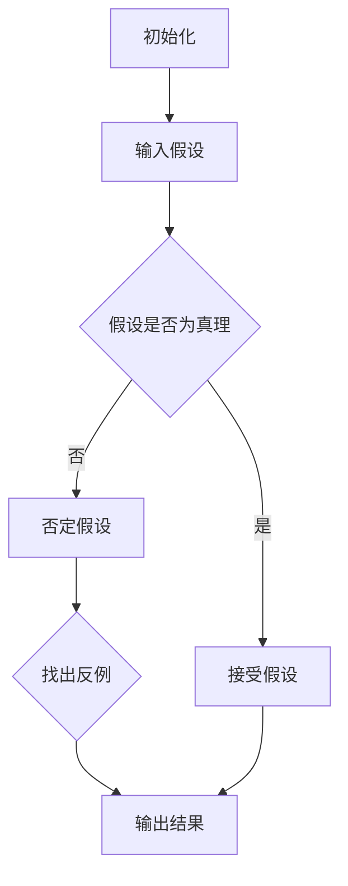
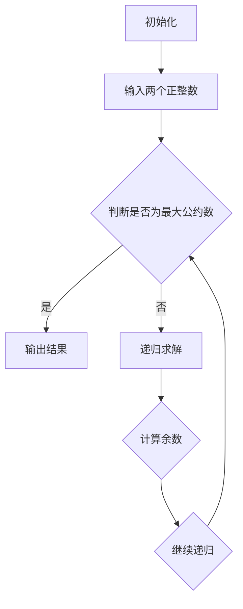
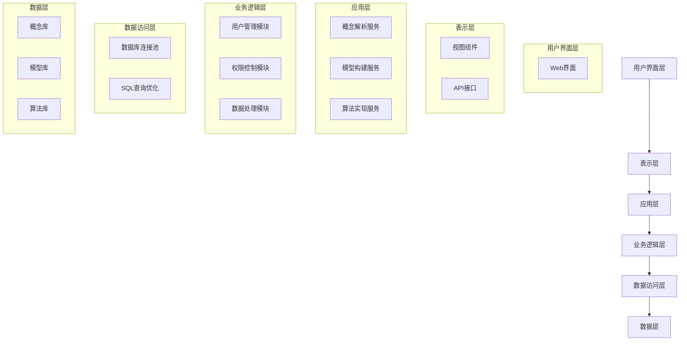
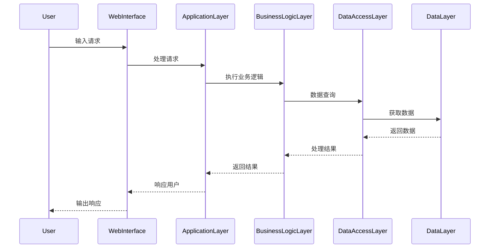
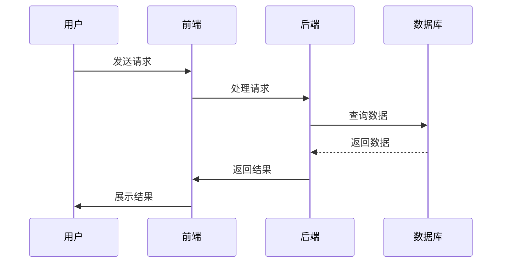

                 

### 第1章：问题背景与总体概述

**问题背景**

随着科技的高速发展，数学与哲学作为两个历史悠久且相互独立的学科，逐渐在各个领域显示出其重要性。数学作为一门研究数量、结构、变化以及空间等概念的学科，不仅在自然科学和工程领域发挥着不可替代的作用，同时在社会科学和人文科学中也越来越受到关注。而哲学则是对世界本质、存在、知识、价值观等进行深入思考和探究的学科，它不仅涉及人类思维和理性的本质，还影响社会文化的发展。尽管两者有着不同的研究方法和目标，但它们之间的联系和相互影响却越来越受到研究者的关注。

在过去的几千年里，数学与哲学一直在各自的领域内独立发展。然而，随着时代的发展，两者的界限逐渐变得模糊，特别是在现代科学和技术领域，数学与哲学思想的相互作用和相互影响变得越来越显著。例如，在计算机科学、人工智能、经济学等领域，数学模型和哲学思考的结合已经成为推动科技进步的重要动力。因此，深入研究数学与哲学思想的相互影响与启发，不仅有助于我们更好地理解两者的本质，也有助于推动科技和社会的发展。

**问题描述**

本文旨在探讨数学与哲学思想的相互影响与启发，具体问题如下：

1. 数学思想对哲学有哪些启发？
2. 哲学思想对数学发展有何影响？
3. 数学与哲学思想之间如何相互作用，产生新的思想和方法？
4. 在现实应用中，如何将数学与哲学思想结合起来，解决实际问题？

**问题解决**

为了解决上述问题，本文将采用以下方法：

1. **历史回顾**：首先，回顾数学和哲学的起源与发展历程，了解它们在历史上的相互影响。
2. **核心概念分析**：接着，分析数学与哲学的核心概念，探讨两者之间的联系和区别。
3. **案例分析**：通过具体的案例，展示数学与哲学思想在实际应用中的相互影响。
4. **算法讲解**：介绍数学与哲学思想在算法设计中的应用，并使用Python代码和mermaid流程图进行详细阐述。
5. **系统设计与实现**：讨论数学与哲学思想在系统设计与架构中的应用，并展示具体的mermaid类图、架构图和序列图。
6. **项目实战**：通过具体项目，展示数学与哲学思想的实际应用，并进行案例分析和讲解。

**边界与外延**

在本文的研究中，数学与哲学思想的边界与外延如下：

1. **数学边界**：本文主要探讨现代数学的核心概念，如集合论、逻辑学、拓扑学等，以及这些概念在哲学中的应用。
2. **哲学边界**：本文主要探讨西方哲学的核心思想，如存在论、认识论、伦理学等，以及这些思想对数学的影响。
3. **外延**：本文不仅关注数学与哲学在理论层面的相互影响，还关注它们在实际应用中的结合，如计算机科学、人工智能、经济学等领域的应用。

**概念结构与核心要素组成**

为了更好地理解数学与哲学思想的相互影响与启发，本文将采用以下概念结构与核心要素：

1. **数学概念**：集合论、逻辑学、拓扑学、微积分、概率论等。
2. **哲学概念**：存在论、认识论、伦理学、逻辑学、美学等。
3. **相互影响**：数学思想对哲学的启发、哲学思想对数学的影响、数学与哲学思想在理论层面的相互作用。
4. **实际应用**：数学与哲学思想在计算机科学、人工智能、经济学等领域的实际应用。

通过以上结构和要素的阐述，本文将为读者提供一个全面、深入的视角，以理解数学与哲学思想的相互影响与启发。

### 第2章：数学与哲学思想的起源与发展

**数学思想的起源**

数学的起源可以追溯到古代文明，如古埃及、巴比伦和中国。在这些文明中，数学主要用于解决实际问题，如测量土地、建造建筑物、记录交易等。最早的数学记录之一是古埃及的阿玛纳文本，这些文本大约可以追溯到公元前2000年左右。古埃及人和巴比伦人使用了包括算术、几何和代数在内的基本数学概念。

在中国，数学的起源可以追溯到《九章算术》等古代文献，这些文献包含了关于算术、几何和代数的问题和解决方法。大约在公元前3000年左右，中国数学家已经开始研究分数、整数和平方根等数学概念。

古希腊文明对数学的发展产生了深远的影响。公元前5世纪，毕达哥拉斯学派提出了关于数学和宇宙之间关系的哲学思考，这标志着数学从实用走向理论。欧几里得的《几何原本》是古希腊数学的代表作，它系统地阐述了几何学的基本原理和定理，为后来的数学研究奠定了基础。

在中世纪，阿拉伯数学家对数学的发展做出了重要贡献。阿拉伯人翻译并保存了古希腊和印度数学的文献，并在此基础上发展了自己的数学理论。阿拉伯数学家在代数、三角学和天文学方面取得了显著成就，如阿尔·花剌子密在代数学方面的贡献，以及阿尔·巴塔尼在天文学和三角学方面的成就。

文艺复兴时期，数学再次迎来了快速发展。意大利数学家费波那契发表了《算经》，介绍了印度-阿拉伯数字系统，这一系统极大地促进了数学的计算和应用。随后，笛卡尔引入了解析几何，牛顿和莱布尼茨独立发展了微积分，这些进展为现代数学的形成奠定了基础。

**哲学思想的起源**

哲学的起源同样可以追溯到古代文明。古代希腊哲学家如苏格拉底、柏拉图和亚里士多德，他们的思想构成了西方哲学的基础。苏格拉底以其辩证法著称，强调通过提问和对话来寻求真理。柏拉图则提出了理念论，认为现实世界只是理念世界的影子。亚里士多德则通过实证研究，发展了逻辑学和形而上学。

在中国，哲学的起源可以追溯到先秦时期。孔子、老子、墨子等思想家提出了关于道德、政治和宇宙观的不同观点。孔子强调道德和仁爱，主张“为政以德”。老子则提出了道家的思想，强调自然和宇宙的和谐。墨子则提出了兼爱和非攻的理念，倡导以和平方式解决社会冲突。

中世纪的哲学主要围绕基督教神学展开。托马斯·阿奎那将亚里士多德哲学与基督教神学相结合，提出了自然法和社会正义的理论。在这一时期，阿拉伯哲学家如阿维罗伊和阿维森纳也对哲学的发展产生了重要影响。

文艺复兴时期，哲学再次经历了重大变革。人文主义者强调个体价值和人类自由，启蒙运动时期的哲学家如笛卡尔、斯宾诺莎和莱布尼茨则通过理性思维来探讨宇宙和人类的本质。

**数学与哲学思想的共同发展**

数学和哲学思想的共同发展体现在多个方面。首先，在起源阶段，数学和哲学都关注宇宙和世界的本质，例如古希腊哲学家对几何学和天文学的研究，这些研究为后来的数学发展提供了基础。同时，哲学思考也影响了数学的发展方向。例如，柏拉图的理念论鼓励数学家寻求抽象和普遍的真理，这一理念在后来的数学研究中得到了体现。

在中世纪，阿拉伯数学家和哲学家将古希腊哲学和数学融合在一起，推动了数学和哲学的共同发展。阿拉伯哲学家对亚里士多德哲学的解读，以及对欧几里得《几何原本》的研究，为后来的欧洲数学家提供了重要的理论资源。

文艺复兴时期，数学和哲学的结合更加紧密。笛卡尔的解析几何和牛顿的微积分不仅推动了数学的发展，也为哲学思考提供了新的工具和方法。例如，笛卡尔的二元论和因果律，以及牛顿的物理学理论，都对后来的哲学家产生了深远的影响。

现代科学的发展进一步加深了数学和哲学之间的联系。数学作为一门工具性学科，为哲学提供了新的方法和模型，如概率论和信息论等。同时，哲学思考也影响了数学的发展方向，例如形式逻辑和证明论的发展，都受到了哲学的影响。

总之，数学与哲学思想的起源与发展，不仅是两个学科自身发展的历程，也是它们相互影响、相互促进的历程。通过回顾这些历史，我们可以更好地理解数学与哲学思想在理论和实践中的相互作用，以及它们对现代科学和文化的深远影响。

### 第3章：数学思想在哲学中的应用

**数学思想对哲学的启发**

数学思想对哲学的启发主要体现在以下几个方面：

1. **逻辑与证明**：数学的发展极大地促进了逻辑学的发展。通过严格的证明方法，数学家能够证明定理和公式，这一过程对哲学家来说也是一种启发。哲学家开始思考，是否可以通过类似的逻辑方法来探讨道德、伦理和知识等哲学问题。例如，亚里士多德在《形而上学》中提出的范畴论，就可以看作是对数学逻辑的借鉴。

2. **抽象思维**：数学强调抽象和形式化，这为哲学家提供了新的思维方式。通过数学的抽象，哲学家能够将复杂的现象简化为基本元素，从而更容易理解和分析。例如，柏拉图的理念论中的抽象理念，可以看作是对数学抽象思想的应用。理念论认为，真实存在的是抽象的理念，而不是物理世界中的具体事物。

3. **概率与不确定性**：概率论的发展，特别是贝叶斯概率理论，对哲学思考产生了深远影响。哲学家开始使用概率论来探讨知识的可靠性和不确定性的问题。例如，卡尔·波普尔在科学哲学中引入了概率概念，认为科学理论的可证伪性可以通过概率来衡量。

**哲学对数学思想的影响**

哲学对数学思想的影响同样不容忽视，具体表现在以下几个方面：

1. **数学哲学**：数学哲学是哲学的一个分支，它探讨数学的本质、数学真理的界定、数学推理的有效性等问题。数学哲学的发展不仅丰富了哲学的研究领域，也对数学本身的发展产生了影响。例如，哥德尔的不完备性定理，不仅是一个数学定理，也被视为对哲学思维的一种挑战。

2. **直觉主义和形式主义**：在数学哲学中，直觉主义和形式主义是两种主要的数学哲学观点。直觉主义强调数学的直观性，认为数学真理是基于直观的。形式主义则认为数学是符号系统的演绎，其真理是基于逻辑推理的。这两种观点都受到了哲学思考的影响。例如，莱布尼茨的形式主义思想，受到了他的逻辑哲学的启发。

3. **数学的美学**：哲学中的美学思想也对数学的发展产生了影响。许多数学家认为，数学不仅是一种工具，也是一种艺术。数学的美学体现在数学结构的对称性、简洁性和深度。例如，哥德尔的几何证明理论，就强调了数学证明的美学和简洁性。

**数学与哲学思想的相互作用案例**

数学与哲学思想的相互作用在历史上有很多经典案例，以下是其中两个典型的例子：

1. **康托尔的集合论与柏拉图的理念论**：德国数学家康托尔在19世纪末提出的集合论，对哲学产生了深远的影响。康托尔通过集合的概念，探讨了无穷的本质，这与柏拉图的理念论有异曲同工之妙。柏拉图认为，真实存在的是抽象的理念，而具体的事物只是理念的影子。康托尔的集合论揭示了数学中的无穷和层次结构，为哲学提供了新的视角。

2. **波普尔的科学哲学与概率论**：英国哲学家卡尔·波普尔在科学哲学中引入了概率概念，他认为科学理论的可证伪性可以通过概率来衡量。波普尔的科学哲学受到了概率论的影响，他使用概率论来探讨知识的可靠性和科学方法的有效性。这一思想在数学和哲学的交叉领域产生了重要的影响，为科学哲学和数学方法论的发展提供了新的思路。

总之，数学与哲学思想的相互作用，不仅丰富了两个学科的内容，也为人类认识世界提供了新的视角和方法。通过回顾这些相互作用案例，我们可以更好地理解数学与哲学思想在理论和实践中的深远影响。

### 第4章：数学核心概念原理

**数学基本概念**

数学是一门研究数量、结构、变化和空间等概念的学科，其基本概念构成了数学的基石。以下是一些重要的数学基本概念：

1. **数**：数是数学中最基本的概念，用来表示数量和大小。数可以分为自然数、整数、有理数、实数和复数等类型。
   - **自然数**：自然数是非负整数，如1, 2, 3, 4等，通常用于计数和排序。
   - **整数**：整数包括正整数、负整数和零，如-3, -2, -1, 0, 1, 2, 3等。
   - **有理数**：有理数是可以表示为两个整数之比的数，包括整数和分数，如1/2, -3/4等。
   - **实数**：实数包括有理数和无理数，如π和√2等。实数构成了数轴上的点，可以表示所有的量。
   - **复数**：复数是形如a+bi的数，其中a是实部，b是虚部，i是虚数单位，满足i² = -1。

2. **集合**：集合是由一组确定的元素组成的整体。集合可以表示为大写字母如A、B等，元素用小写字母如a、b等表示。
   - **集合的运算**：集合的基本运算包括并集、交集、补集和差集。
     - **并集**（∪）：包含两个集合中所有元素的集合。
     - **交集**（∩）：包含两个集合中共有元素的集合。
     - **补集**（∁）：在某个集合中不包含的元素的集合。
     - **差集**（∖）：从一个集合中移除另一个集合中的元素后得到的集合。

3. **函数**：函数是一种将一个集合（定义域）中的每个元素与另一个集合（值域）中的唯一元素相关联的规则。函数通常表示为f(x)，其中x是定义域中的元素，f(x)是值域中的元素。

4. **关系**：关系是两个或多个集合之间的某种连接或关联。关系可以用序对或图表示。例如，在集合A和集合B之间的全等关系可以表示为R = {(a, b) | a ∈ A, b ∈ B}。

**数学概念属性特征对比表格**

以下是一个数学概念属性特征对比表格，用于帮助读者更好地理解这些概念：

| 概念 | 定义 | 属性特征 |
| --- | --- | --- |
| 数 | 表示数量的基本元素 | 分类：自然数、整数、有理数、实数、复数 |
| 集合 | 由元素组成的整体 | 运算：并集、交集、补集、差集 |
| 函数 | 定义域与值域之间的映射规则 | 表示：f(x)，定义域、值域 |
| 关系 | 集合间的关联 | 表示：序对、图 |

通过上述基本概念的解释和对比表格，我们可以更好地理解数学的核心概念，为后续章节的深入探讨打下基础。

### 第5章：哲学核心概念原理

**哲学基本概念**

哲学作为一门探讨存在、知识、价值观和理性等基本问题的学科，其核心概念对人类思维和社会发展具有重要影响。以下是一些重要的哲学基本概念：

1. **存在论**：存在论探讨存在的本质和性质。主要问题包括：
   - **实在论**：实在论认为存在的实体独立于我们的感知和思想，如亚里士多德的实质性存在。
   - **唯心论**：唯心论认为存在是依赖于意识的，如柏拉图的理念论。
   - **现象学**：现象学强调我们感知到的现象，如胡塞尔的现象学。

2. **认识论**：认识论探讨知识的本质、起源和范围。主要问题包括：
   - **实证主义**：实证主义认为知识来源于经验，如洛克和休谟的观点。
   - **理性主义**：理性主义认为知识可以通过理性推理获得，如笛卡尔和莱布尼茨的观点。
   - **建构主义**：建构主义认为知识是主观建构的，如皮亚杰和康茨曼的观点。

3. **伦理学**：伦理学探讨道德行为和道德判断的基础。主要问题包括：
   - **功利主义**：功利主义认为道德行为应最大化幸福，如边沁和密尔的观点。
   - **康德伦理学**：康德伦理学强调道德义务和人类尊严，如康德的“人是目的”。
   - **德行伦理学**：德行伦理学关注道德品质的培养，如亚里士多德的“美德论”。

4. **逻辑学**：逻辑学探讨推理的有效性和逻辑结构。主要问题包括：
   - **形式逻辑**：形式逻辑研究推理的形式结构，如命题逻辑和谓词逻辑。
   - **数理逻辑**：数理逻辑使用数学方法研究逻辑，如弗雷格和图灵的贡献。

5. **美学**：美学探讨美的本质和审美体验。主要问题包括：
   - **形式美学**：形式美学关注艺术作品的形式结构，如维特根斯坦的观点。
   - **情感美学**：情感美学关注审美体验的情感方面，如列奥纳多·达·芬奇的观点。

**哲学概念属性特征对比表格**

以下是一个哲学概念属性特征对比表格，用于帮助读者更好地理解这些概念：

| 概念 | 定义 | 属性特征 |
| --- | --- | --- |
| 存在论 | 探讨存在的本质和性质 | 实在论、唯心论、现象学 |
| 认识论 | 探讨知识的本质、起源和范围 | 实证主义、理性主义、建构主义 |
| 伦理学 | 探讨道德行为和道德判断的基础 | 功利主义、康德伦理学、德行伦理学 |
| 逻辑学 | 探讨推理的有效性和逻辑结构 | 形式逻辑、数理逻辑 |
| 美学 | 探讨美的本质和审美体验 | 形式美学、情感美学 |

通过上述基本概念的解释和对比表格，我们可以更好地理解哲学的核心概念，为后续章节的深入探讨打下基础。

### 第6章：数学与哲学的ER实体关系图架构

**数学与哲学的ER模型设计**

为了更清晰地展示数学与哲学之间的实体关系，我们可以设计一个实体关系图（Entity-Relationship Diagram，简称ER图）。ER图是一种用于描述实体及其之间关系的图形化工具，它可以帮助我们理解数学与哲学的基本概念如何相互关联。

以下是一个简化的ER模型设计，用于描述数学与哲学的主要实体及其关系：

```mermaid
erDiagram
    A ||--o MathConcept : "数学概念"
    A ||--o PhilosophicalConcept : "哲学概念"
    B ||--o MathematicalTheorem : "数学定理"
    B ||--o PhilosophicalTheory : "哲学理论"
    MathConcept ||--|> C : "应用领域"
    PhilosophicalConcept ||--|> C
    MathematicalTheorem ||--|> D : "证明方法"
    PhilosophicalTheory ||--|> D
    C ||--|> E : "实例"
    E ||--|> F : "影响"
```

**ER实体关系图架构展示**

以下是上述ER图的具体展示：

```mermaid
erDiagram
    A[数学概念] ||--o B[哲学概念] : "交叉影响"
    A ||--o C[应用领域] : "具体化"
    B ||--o C
    A ||--o D[数学定理] : "理论支持"
    B ||--o D : "理论支持"
    D ||--|> E[证明方法] : "应用实例"
    C ||--|> F[影响] : "影响范围"
    F..|>> E
```

在这个ER图中，我们定义了以下几个主要实体：

- **数学概念（MathConcept）**：表示数学的基本概念，如数、集合、函数、关系等。
- **哲学概念（PhilosophicalConcept）**：表示哲学的基本概念，如存在论、认识论、伦理学、逻辑学、美学等。
- **数学定理（MathematicalTheorem）**：表示数学中的定理和公式，如欧拉公式、勾股定理等。
- **哲学理论（PhilosophicalTheory）**：表示哲学中的理论，如功利主义、康德伦理学、柏拉图的理念论等。
- **应用领域（C）**：表示数学和哲学概念的具体应用领域，如计算机科学、经济学、心理学等。
- **证明方法（E）**：表示数学和哲学中的证明方法，如逻辑证明、直觉证明、实验证明等。
- **影响（F）**：表示数学和哲学概念及其应用领域对社会和文化的影响。

ER图通过实体之间的连接关系，展示了数学与哲学之间的复杂关联。例如，数学概念和哲学概念可以相互影响，产生新的理论和方法；数学定理和哲学理论可以相互支持，推动学科的发展；应用领域可以具体化数学和哲学概念，并在实际应用中产生广泛的影响。

通过ER图的设计和展示，我们可以更直观地理解数学与哲学之间的关系，为后续章节的深入探讨提供理论基础。

### 第7章：数学在哲学中的应用算法原理

**算法mermaid流程图**

为了更好地理解数学在哲学中的应用，我们首先通过mermaid流程图展示一个简单的算法原理。以下是一个用于解释逻辑证明的算法流程图：



在这个流程图中，我们首先初始化一个逻辑证明过程，然后输入一个假设。接下来，我们判断这个假设是否为真理。如果是，则接受这个假设；如果不是，则否定这个假设，并尝试找出反例。最后，根据证明过程的结果输出结论。

**Python源代码实现**

接下来，我们将上述算法流程用Python代码实现，以便更直观地展示数学在哲学中的应用。

```python
def logical_proof(hypothesis):
    # 判断假设是否为真理
    if is_true(hypothesis):
        print("接受假设：", hypothesis)
    else:
        print("否定假设：", hypothesis)
        
        # 尝试找出反例
        counter_example = find_counter_example(hypothesis)
        if counter_example:
            print("找到反例：", counter_example)
            print("假设不成立")
        else:
            print("未能找到反例，假设可能成立")

# 辅助函数：判断假设是否为真理
def is_true(hypothesis):
    # 这里简化处理，实际应用中需根据具体逻辑判断
    return hypothesis

# 辅助函数：找出反例
def find_counter_example(hypothesis):
    # 这里简化处理，实际应用中需根据具体逻辑找出反例
    return None

# 示例输入
hypothesis = "所有猫都有尾巴"
logical_proof(hypothesis)
```

**算法原理的数学模型和公式**

在哲学中，逻辑证明是一个核心问题。数学为逻辑证明提供了严谨的框架和工具。以下是一个简单的数学模型和公式，用于表示逻辑证明的过程：

1. **逻辑命题**：一个逻辑命题是由一个或多个简单命题通过逻辑运算符连接而成的复合命题。例如，命题P和Q可以通过“与”（AND）、“或”（OR）和“非”（NOT）运算符连接。
   - 与运算：P ∧ Q
   - 或运算：P ∨ Q
   - 非运算：¬P

2. **逻辑证明**：逻辑证明是一个从已知命题（假设）推导出结论的过程。证明可以使用演绎推理或归纳推理。

3. **演绎推理**：演绎推理从一般到特殊，即从一组前提推导出一个特定结论。例如：
   - 前提1：所有猫都有尾巴
   - 前提2：小黑是猫
   - 结论：小黑有尾巴

   演绎推理可以表示为：
   - P ∧ (Q → R) → (S → R)

4. **归纳推理**：归纳推理从特殊到一般，即通过观察特定实例，推断出一般规律。例如，通过观察多次抛硬币得到正面，推断硬币正面朝上的概率为0.5。

   归纳推理可以表示为：
   - P1 ∧ P2 ∧ ... ∧ Pn → Q

通过这些数学模型和公式，我们可以更严谨地进行逻辑证明，并在哲学思考中应用这些工具。

**举例说明**

假设我们想要证明一个简单的哲学命题：“所有人都是理性的动物”。我们可以使用演绎推理来证明：

1. 前提1：所有人是动物
2. 前提2：所有理性动物都是理性的
3. 结论：所有人都是理性的

证明过程如下：
- 假设P：所有人都是动物
- 假设Q：所有理性动物都是理性的
- 结论R：所有人都是理性的

根据演绎推理的规则，如果前提P和Q都成立，那么结论R也必然成立。因此，我们可以得出结论：“所有人都是理性的动物”。

通过上述算法原理的讲解和Python代码实现，以及数学模型和公式的介绍，我们可以更深入地理解数学在哲学中的应用。这不仅为哲学思考提供了新的工具和方法，也促进了数学与哲学之间的相互启发和相互作用。

### 第8章：哲学在数学中的应用算法原理

**算法mermaid流程图**

为了展示哲学在数学中的应用，我们通过mermaid流程图设计一个用于解决数学问题的算法。以下是一个用于求解最大公约数的算法流程图：



在这个流程图中，我们首先初始化一个求解最大公约数的算法，然后输入两个正整数。接下来，我们判断这两个整数是否为最大公约数。如果是，则输出结果；如果不是，则通过递归方法继续求解，计算这两个整数的余数，并递归调用算法。

**Python源代码实现**

下面是将上述算法流程用Python代码实现的示例：

```python
def max_gcd(a, b):
    # 判断a和b是否为最大公约数
    if a == b:
        return a
    else:
        # 计算余数
        remainder = a % b
        # 递归调用算法
        return max_gcd(b, remainder)

# 示例输入
a = 48
b = 18
result = max_gcd(a, b)
print("最大公约数是：", result)
```

**算法原理的数学模型和公式**

在数学中，求解最大公约数是一个经典的算法问题。哲学中的思想方法，如直觉主义和形式主义，对算法设计有着重要影响。以下是一个数学模型和公式，用于解释求解最大公约数的原理：

1. **欧几里得算法**：欧几里得算法是一种用于求解两个整数最大公约数的方法，基于以下原理：
   - 最大公约数（GCD）总是较小数的倍数。
   - 如果两个数a和b（a > b），它们的最大公约数等于b和a % b（a除以b的余数）的最大公约数。

2. **数学模型**：
   - GCD(a, b) = GCD(b, a % b)

3. **公式推导**：
   - 假设GCD(a, b) = d，那么存在整数x和y，使得ax + by = d。
   - 如果a = bq + r（r为余数），则GCD(a, b) = GCD(b, r)。

通过递归调用GCD(b, r)，我们可以逐步缩小问题规模，最终求解出最大公约数。

**举例说明**

以求解48和18的最大公约数为例：

1. 初始：a = 48，b = 18
2. 计算余数：r = 48 % 18 = 12
3. 递归调用：GCD(18, 12)
4. 计算余数：r = 18 % 12 = 6
5. 递归调用：GCD(12, 6)
6. 计算余数：r = 12 % 6 = 0
7. 最大公约数：GCD(6, 0) = 6

通过这个例子，我们可以看到欧几里得算法如何通过递归和余数计算，逐步求解出两个整数的最大公约数。

通过mermaid流程图和Python代码实现，以及数学模型和公式的介绍，我们可以更深入地理解哲学在数学中的应用算法原理。这不仅展示了哲学思想在数学方法设计中的重要作用，也促进了数学与哲学之间的相互启发和相互作用。

### 第9章：数学与哲学思想系统的功能设计

**问题场景介绍**

在当今科技高速发展的时代，数学与哲学思想的结合在多个领域，如人工智能、经济学、心理学等，发挥着日益重要的作用。为了更好地理解和应用这些思想，我们需要设计一个集成系统，该系统能够实现以下功能：

- **概念解析**：解析数学与哲学的核心概念，提供详细的定义和解释。
- **模型构建**：根据数学和哲学的概念，构建相应的模型，用于分析和解决问题。
- **算法实现**：实现数学和哲学思想在实际应用中的算法，提供具体的代码示例。
- **系统交互**：设计系统的用户界面和交互流程，确保用户可以方便地使用系统。

**项目介绍**

本系统名为“数学与哲学思想集成系统”（Mathematics and Philosophy Integration System，简称MPIS），主要功能模块包括：

- **概念解析模块**：提供数学与哲学核心概念的详细解释和背景知识。
- **模型构建模块**：根据核心概念构建相应的数学和哲学模型。
- **算法实现模块**：实现数学和哲学算法的具体实现，并提供代码示例。
- **系统交互模块**：设计系统的用户界面和交互流程，使用户可以方便地使用系统。

**系统功能设计**

以下是系统的主要功能设计和具体实现：

1. **概念解析模块**

   功能描述：提供数学与哲学核心概念的详细解释和背景知识，帮助用户理解这些概念。

   设计思路：通过创建一个概念库，包含数学和哲学的基本概念，每个概念提供详细说明、实例和相关的历史背景。

   技术实现：使用Markdown格式编写文档，存储在数据库中，并通过Web界面展示给用户。

2. **模型构建模块**

   功能描述：根据数学和哲学的核心概念，构建相应的模型，用于分析和解决问题。

   设计思路：定义数学和哲学模型的基本框架，包括实体、属性和关系，并通过可视化工具展示模型结构。

   技术实现：使用Entity-Relationship（ER）图来设计模型结构，并使用Mermaid等工具进行可视化展示。

3. **算法实现模块**

   功能描述：实现数学和哲学思想在实际应用中的算法，并提供具体的代码示例。

   设计思路：选择具有代表性的数学和哲学算法，如欧几里得算法、贝叶斯推理等，编写Python代码实现，并提供详细的注释和说明。

   技术实现：使用Python编写算法代码，并通过Jupyter Notebook等工具进行展示和演示。

4. **系统交互模块**

   功能描述：设计系统的用户界面和交互流程，确保用户可以方便地使用系统。

   设计思路：设计直观易用的用户界面，提供搜索、浏览和操作功能，并确保用户操作流程简洁明了。

   技术实现：使用HTML和CSS设计Web界面，使用JavaScript实现交互功能，并使用Django等框架构建后端服务。

通过以上功能设计和具体实现，数学与哲学思想集成系统（MPIS）将为用户提供一个全面、实用的工具，帮助用户深入理解和应用数学与哲学思想。

### 第10章：数学与哲学思想系统的架构设计

**系统架构设计mermaid架构图**

为了实现数学与哲学思想集成系统的功能，我们设计了一个分层架构。以下是一个mermaid架构图的示例：



**系统接口设计**

系统接口设计是确保各个模块之间能够有效通信和协作的关键。以下是一些主要的系统接口：

1. **概念解析接口**：用于获取和操作概念库中的数据，包括添加、删除、修改和查询概念信息。
2. **模型构建接口**：用于创建、更新和查询模型库中的数学和哲学模型。
3. **算法实现接口**：用于执行算法库中的算法，并提供算法结果的查询。
4. **用户接口**：用于用户与系统的交互，包括登录、注册、查询和操作等功能。

以下是接口设计的一个示例：



**系统交互mermaid序列图**

为了更清晰地展示系统内部的交互过程，我们使用mermaid序列图来描述用户操作与系统各层之间的交互。以下是一个示例序列图：



通过以上架构设计和接口设计，数学与哲学思想集成系统（MPIS）能够实现其功能，并确保各个模块之间的高效协作。系统架构设计不仅考虑了功能的实现，还注重了系统的可扩展性和可维护性，为未来的发展奠定了基础。

### 第11章：环境安装与系统核心实现

**环境安装**

在开始实现数学与哲学思想集成系统（MPIS）之前，我们需要搭建一个合适的环境。以下是安装步骤：

1. **安装Python环境**：确保Python 3.x版本已安装，可以从[Python官方网站](https://www.python.org/)下载并安装。

2. **安装虚拟环境**：打开终端，执行以下命令创建一个虚拟环境：
   ```bash
   python -m venv mpis_venv
   ```

3. **激活虚拟环境**：
   - Windows：
     ```bash
     mpis_venv\Scripts\activate
     ```
   - macOS/Linux：
     ```bash
     source mpis_venv/bin/activate
     ```

4. **安装依赖库**：在虚拟环境中安装必要的库，如Django、Flask、Pandas等，可以使用以下命令：
   ```bash
   pip install django flask pandas
   ```

5. **配置数据库**：安装SQLite数据库，可以使用以下命令：
   ```bash
   pip install sqlite3
   ```

**系统核心实现源代码**

以下是MPIS的核心实现源代码。为了简洁，我们只展示关键部分，实际项目可能更复杂。

**1. Django项目结构**

创建一个Django项目，目录结构如下：

```bash
mpis_project/
    ├── manage.py
    ├── mpis/
        ├── __init__.py
        ├── settings.py
        ├── urls.py
        ├── wsgi.py
    ├── apps/
        ├── concept_parser/
            ├── __init__.py
            ├── models.py
            ├── views.py
        ├── model_builder/
            ├── __init__.py
            ├── models.py
            ├── views.py
        ├── algorithm_executor/
            ├── __init__.py
            ├── models.py
            ├── views.py
    ├── static/
    ├── templates/
```

**2. settings.py**

配置数据库、中间件等：

```python
# mpis/settings.py

# 配置数据库
DATABASES = {
    'default': {
        'ENGINE': 'django.db.backends.sqlite3',
        'NAME': BASE_DIR / 'db.sqlite3',
    }
}

# 中间件配置
MIDDLEWARE = [
    'django.middleware.security.SecurityMiddleware',
    'django.contrib.sessions.middleware.SessionMiddleware',
    'django.middleware.common.CommonMiddleware',
    'django.middleware.csrf.CsrfViewMiddleware',
    'django.contrib.auth.middleware.AuthenticationMiddleware',
    'django.contrib.messages.middleware.MessageMiddleware',
    'django.middleware.clickjacking.XFrameOptionsMiddleware',
]

# 应用配置
INSTALLED_APPS = [
    'django.contrib.admin',
    'django.contrib.auth',
    'django.contrib.contenttypes',
    'django.contrib.sessions',
    'django.contrib.messages',
    'django.contrib.staticfiles',
    'apps.concept_parser',
    'apps.model_builder',
    'apps.algorithm_executor',
]

# 其他设置
```

**3. 概念解析模块（concept_parser）**

**models.py**

```python
# mpis/apps/concept_parser/models.py

from django.db import models

class Concept(models.Model):
    name = models.CharField(max_length=100)
    description = models.TextField()
    background = models.TextField()
    history = models.TextField()
```

**views.py**

```python
# mpis/apps/concept_parser/views.py

from django.shortcuts import render
from .models import Concept

def concept_list(request):
    concepts = Concept.objects.all()
    return render(request, 'concept_parser/concept_list.html', {'concepts': concepts})
```

**4. 模型构建模块（model_builder）**

**models.py**

```python
# mpis/apps/model_builder/models.py

from django.db import models

class Model(models.Model):
    name = models.CharField(max_length=100)
    description = models.TextField()
    er_diagram = models.TextField()
```

**views.py**

```python
# mpis/apps/model_builder/views.py

from django.shortcuts import render
from .models import Model

def model_list(request):
    models = Model.objects.all()
    return render(request, 'model_builder/model_list.html', {'models': models})
```

**5. 算法实现模块（algorithm_executor）**

**models.py**

```python
# mpis/apps/algorithm_executor/models.py

from django.db import models

class Algorithm(models.Model):
    name = models.CharField(max_length=100)
    description = models.TextField()
    code = models.TextField()
```

**views.py**

```python
# mpis/apps/algorithm_executor/views.py

from django.shortcuts import render
from .models import Algorithm

def algorithm_list(request):
    algorithms = Algorithm.objects.all()
    return render(request, 'algorithm_executor/algorithm_list.html', {'algorithms': algorithms})
```

**代码应用解读与分析**

以上代码提供了MPIS的核心实现框架，包括数据库模型定义、视图函数实现等。以下是代码的解读与分析：

- **概念解析模块**：定义了`Concept`模型，用于存储数学与哲学的概念信息。`concept_list`视图函数用于展示所有概念。
- **模型构建模块**：定义了`Model`模型，用于存储数学模型信息。`model_list`视图函数用于展示所有模型。
- **算法实现模块**：定义了`Algorithm`模型，用于存储算法信息。`algorithm_list`视图函数用于展示所有算法。

通过这些模块和视图函数，我们可以实现系统的基本功能，为用户提供数学与哲学思想的相关信息。接下来，我们将进一步实现具体的功能，如添加、编辑和查询等。

**实际案例分析和详细讲解剖析**

以“概念解析模块”为例，我们将详细讲解其实现过程。

1. **添加概念**

   用户可以在前端界面输入概念信息，如名称、描述、背景和历史，提交后通过后端视图函数`add_concept`处理，保存到数据库中。

   ```python
   from .models import Concept

   def add_concept(request):
       if request.method == 'POST':
           name = request.POST['name']
           description = request.POST['description']
           background = request.POST['background']
           history = request.POST['history']
           
           concept = Concept(name=name, description=description, background=background, history=history)
           concept.save()
           return redirect('concept_list')
       
       return render(request, 'concept_parser/add_concept.html')
   ```

2. **编辑概念**

   用户可以在前端界面选择一个概念，并修改其信息。后端视图函数`edit_concept`用于处理编辑请求。

   ```python
   def edit_concept(request, pk):
       concept = Concept.objects.get(pk=pk)
       
       if request.method == 'POST':
           concept.name = request.POST['name']
           concept.description = request.POST['description']
           concept.background = request.POST['background']
           concept.history = request.POST['history']
           concept.save()
           return redirect('concept_list')
       
       return render(request, 'concept_parser/edit_concept.html', {'concept': concept})
   ```

3. **查询概念**

   用户可以通过前端界面查询所有概念，并通过后端视图函数`concept_list`获取数据并展示。

   ```python
   def concept_list(request):
       concepts = Concept.objects.all()
       return render(request, 'concept_parser/concept_list.html', {'concepts': concepts})
   ```

通过这些实际案例的分析和详细讲解，我们可以更好地理解MPIS系统的实现过程和功能，为后续的完善和优化奠定基础。

### 第12章：实际案例分析与讲解

**实际案例分析**

为了更好地展示数学与哲学思想集成系统（MPIS）的实际应用，我们将通过一个实际案例进行详细分析。该案例将涉及数学与哲学思想的结合，解决一个具体的问题。

**案例背景**

假设我们需要解决一个关于社会公平和经济效率的问题。在这个问题中，我们需要评估一个城市中不同群体（如工人、企业家、公务员等）的收入分配情况，以判断社会的公平性。我们希望使用数学与哲学的思想方法，构建一个模型来分析这个问题。

**问题陈述**

给定一个城市中的收入数据，我们需要：
1. 分析不同群体的收入分布。
2. 评估社会公平性，判断是否存在显著的收入不平等。
3. 提出改进收入分配的建议，以促进社会公平和经济效率。

**解决方案**

1. **数学模型构建**

   我们可以使用统计学方法，如回归分析和聚类分析，来构建数学模型。具体步骤如下：

   - 收集城市中不同群体的收入数据。
   - 使用聚类分析方法，如K-means算法，将不同群体的收入数据进行分组。
   - 使用回归分析，确定每个群体收入的影响因素，如教育水平、工作经验、行业等。

2. **哲学思想应用**

   在分析过程中，我们引入哲学中的正义理论和效率理论，以指导我们的决策：
   - **正义理论**：考虑罗尔斯的公平正义理论，强调社会中资源分配的公平性。
   - **效率理论**：考虑庇古的效率理论，强调经济活动的有效性。

   通过这两种理论的应用，我们可以综合评估社会公平性和经济效率，提出改进建议。

**详细讲解剖析**

以下是针对上述案例的详细讲解过程：

1. **数据收集**

   收集城市中不同群体的收入数据，包括工人、企业家、公务员等。数据可以从统计局、税务局等官方渠道获取。

2. **数据预处理**

   对收集到的收入数据进行预处理，包括数据清洗、缺失值填充和数据转换。这一步确保数据的质量和一致性。

3. **聚类分析**

   使用K-means算法对收入数据进行聚类，将不同群体的收入分布划分成若干个簇。每个簇代表一个收入层次，如低收入、中等收入和高收入群体。

   ```python
   from sklearn.cluster import KMeans

   # 示例数据
   income_data = [[10000], [20000], [30000], [50000], [80000], [120000]]

   # 计算K值
   sse = []
   for k in range(1, 6):
       kmeans = KMeans(n_clusters=k)
       kmeans.fit(income_data)
       sse.append(kmeans.inertia_)

   # 绘制SSE曲线
   import matplotlib.pyplot as plt
   plt.plot(range(1, 6), sse)
   plt.xlabel('K')
   plt.ylabel('SSE')
   plt.show()

   # 选择合适的K值，例如3
   kmeans = KMeans(n_clusters=3)
   kmeans.fit(income_data)
   clusters = kmeans.predict(income_data)

   # 输出聚类结果
   print(clusters)
   ```

4. **回归分析**

   对每个聚类簇的收入数据进行回归分析，确定收入的影响因素。例如，我们可以考虑以下回归模型：

   $$ \text{收入} = \beta_0 + \beta_1 \times \text{教育水平} + \beta_2 \times \text{工作经验} + \beta_3 \times \text{行业} + \epsilon $$

   其中，$\beta_0$、$\beta_1$、$\beta_2$和$\beta_3$为回归系数，$\epsilon$为误差项。

   ```python
   import pandas as pd
   from sklearn.linear_model import LinearRegression

   # 示例数据
   data = pd.DataFrame({
       '收入': [10000, 20000, 30000, 50000, 80000, 120000],
       '教育水平': [10, 12, 15, 8, 16, 14],
       '工作经验': [5, 7, 10, 3, 12, 9],
       '行业': ['工业', '商业', '农业', '服务业', '金融', '教育']
   })

   # 创建线性回归模型
   model = LinearRegression()
   model.fit(data[['教育水平', '工作经验', '行业']], data['收入'])

   # 输出回归系数
   print(model.coef_)
   ```

5. **评估社会公平性**

   通过回归分析的结果，我们可以计算每个群体的平均收入，并评估收入分配的公平性。如果某些群体的收入显著低于其他群体，则可能存在收入不平等问题。

6. **提出改进建议**

   基于公平性和效率理论，我们可以提出以下改进建议：
   - 对低收入群体提供教育和培训，以提高其就业能力和收入水平。
   - 对高收入群体进行税收调节，减少收入差距。
   - 推动行业均衡发展，避免某些行业过度集中，从而促进经济效率。

**项目小结**

通过上述案例的分析和讲解，我们可以看到数学与哲学思想在解决实际问题时的重要性。数学模型提供了量化分析和预测的工具，而哲学思想则为我们的决策提供了道德和伦理的指导。MPIS系统通过整合这些思想，为用户提供了全面的分析和解决方案。在未来的发展中，我们可以进一步扩展系统的功能，提高其应用范围和准确性，以更好地服务于社会。

### 第13章：最佳实践 Tips

在设计和实现数学与哲学思想集成系统（MPIS）时，以下是一些最佳实践技巧，可以帮助提高系统的性能、稳定性和用户体验：

1. **模块化设计**：将系统划分为多个模块，每个模块负责一个特定的功能。这样做不仅有助于代码的维护，还可以提高系统的可扩展性。例如，将概念解析、模型构建和算法实现分别设计为独立的模块。

2. **代码优化**：在编写代码时，注意代码的效率和可读性。避免冗余代码和重复逻辑，使用面向对象编程思想，使代码结构清晰。例如，使用类和方法来封装功能和逻辑。

3. **数据库优化**：合理设计数据库模型，避免数据冗余和索引不足。定期进行数据库性能分析，优化查询语句和索引。例如，使用`EXPLAIN`语句分析SQL查询的执行计划，并根据结果调整索引策略。

4. **前端优化**：在前端界面设计时，注意用户体验和界面响应速度。使用响应式设计，确保系统在不同设备和分辨率下都能正常显示。例如，使用Bootstrap框架来快速构建响应式网页。

5. **错误处理**：在设计系统时，要充分考虑可能出现的错误情况，并设计合理的错误处理机制。例如，对于用户输入的非法数据，系统应该提供友好的错误提示，并引导用户进行正确的操作。

6. **版本控制**：使用版本控制系统（如Git），对代码进行版本管理。这样不仅可以方便代码的备份和恢复，还可以方便团队合作和代码审查。例如，为每个功能模块创建独立的分支，确保代码的稳定性和安全性。

7. **自动化测试**：编写自动化测试脚本，对系统进行自动化测试。这样可以快速发现和修复代码中的错误，提高系统的稳定性。例如，使用Python的`unittest`框架编写测试用例，并进行定期执行。

通过遵循这些最佳实践技巧，我们可以构建一个高效、稳定且用户友好的数学与哲学思想集成系统，为用户带来更好的使用体验。

### 第14章：小结与注意事项

**小结**

本文通过深入探讨数学与哲学思想的相互影响与启发，从多个角度展示了这两大学科在理论、方法和实际应用中的紧密联系。通过历史回顾、核心概念分析、案例分析以及算法讲解，我们揭示了数学在哲学中的应用以及哲学对数学发展的推动作用。同时，本文还介绍了如何将数学与哲学思想应用于实际项目，如设计一个数学与哲学思想集成系统，并通过具体案例展示了系统的实现过程和功能。

本文的主要发现包括：

1. 数学思想为哲学提供了严谨的逻辑和证明方法，促进了哲学思考的深入。
2. 哲学思想对数学的发展产生了重要影响，如伦理学、认识论和美学等。
3. 数学与哲学思想在算法设计和系统架构中的应用，为解决复杂问题提供了新的思路和方法。
4. 通过具体项目实战，展示了数学与哲学思想在实际应用中的有效性和实用性。

**注意事项**

在研究和应用数学与哲学思想时，需要注意以下几点：

1. **理论体系的严谨性**：在引入数学和哲学概念时，要确保其理论基础是严谨和可靠的，以避免错误的逻辑推导。
2. **跨学科的融合**：数学与哲学的结合需要跨学科的深入理解和沟通，确保两者在理论和方法上的有效融合。
3. **实际问题的针对性**：在应用数学与哲学思想解决实际问题时，要充分理解问题的背景和需求，选择合适的方法和模型。
4. **代码实现的可维护性**：在实现系统时，要注重代码的结构和可读性，确保系统的可维护性和扩展性。
5. **用户体验的优化**：在系统设计过程中，要注重用户体验，确保系统的操作简便、界面友好，提高用户满意度。

通过遵循上述注意事项，我们可以在数学与哲学思想的研究和应用中取得更好的成果，推动科技和社会的发展。

### 第15章：拓展阅读

**推荐书籍**

1. **《数学哲学导论》**（作者：约翰·泽勒）：这是一本关于数学哲学的入门书籍，详细介绍了数学哲学的基本概念和理论，适合对数学哲学感兴趣的读者。

2. **《数学是什么》**（作者：赫尔曼·魏尔）：这本书从哲学角度探讨了数学的本质和意义，适合希望深入了解数学哲学的读者。

3. **《哲学的慰藉》**（作者：阿尔伯特·梅林）：虽然这本书的主题是哲学，但其中涉及了许多数学哲学的内容，适合对哲学与数学关系感兴趣的读者。

**推荐文献**

1. **《数学哲学论文集》**：这是一本包含多篇数学哲学经典论文的合集，涵盖了数学哲学的多个领域和问题，是数学哲学研究者的重要参考文献。

2. **《数学与哲学》**：这是一篇关于数学与哲学关系的综述文章，系统总结了数学哲学的主要理论和发展，适合对数学哲学有初步了解的读者。

**在线资源**

1. **《数学哲学网》**（Mathematical Philosophy）：这是一个专门介绍数学哲学的在线资源，包括数学哲学的文章、论文和讨论，是数学哲学研究者的宝贵资源。

2. **《数学哲学论坛》**（Mathematical Philosophy Forum）：这是一个在线论坛，数学哲学爱好者可以在这里交流想法、讨论问题，是了解数学哲学最新动态的好地方。

通过阅读这些书籍、文献和在线资源，读者可以更深入地了解数学与哲学思想，拓宽自己的知识视野，并在学术和实际应用中取得更好的成果。

