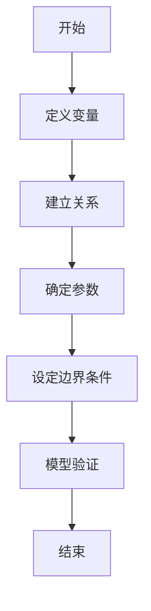
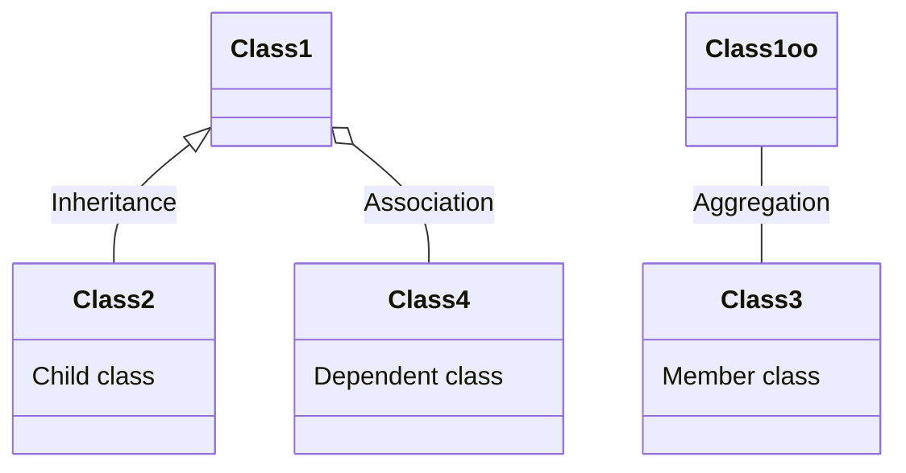

                 

## 文章标题

### 数学与哲学思辨的相互启发

> 关键词：数学、哲学、思辨、相互启发、逻辑、形式化、方法论、数学模型

> 摘要：本文旨在探讨数学与哲学之间的相互启发关系。通过历史背景、核心概念的分析，以及数学模型与哲学思辨的结合，本文揭示了数学与哲学在方法论、逻辑形式化等方面的深入互动。本文不仅梳理了二者之间的历史联系，还通过实例展示了数学在哲学问题中的解释作用和哲学对数学发展的推动。同时，本文提出了数学与哲学在教育中的融合方法以及未来发展的趋势和展望。

---

### 目录大纲

----------------------------------------------------------------

# 数学与哲学思辨的相互启发

## 第一部分：问题背景与核心概念

### 第1章：数学与哲学的相互启发背景

#### 1.1 数学与哲学的历史联系

#### 1.1.1 古希腊时期的数学与哲学

#### 1.1.2 中世纪数学与哲学的发展

#### 1.1.3 近代数学与哲学的交汇

### 1.2 现代数学与哲学的互动

#### 1.2.1 数学形式化与哲学思辨

#### 1.2.2 哲学对数学方法论的影响

#### 1.2.3 数学对哲学问题的回应

### 第2章：核心概念与联系

#### 2.1 数学核心概念

#### 2.1.1 数学定义与概念结构

#### 2.1.2 数学概念属性特征对比

#### 2.1.3 数学概念之间的关系

### 2.2 哲学核心概念

#### 2.2.1 哲学定义与概念结构

#### 2.2.2 哲学概念属性特征对比

#### 2.2.3 哲学概念之间的关系

### 2.3 数学与哲学的核心联系

#### 2.3.1 数学原理与哲学思辨

#### 2.3.2 数学方法与哲学问题

#### 2.3.3 数学成果与哲学启示

### 第3章：数学模型与哲学思辨

#### 3.1 数学模型原理

#### 3.1.1 数学模型定义

#### 3.1.2 数学模型类型

#### 3.1.3 数学模型构建方法

### 3.2 哲学思辨与数学模型

#### 3.2.1 哲学思辨方法与数学模型

#### 3.2.2 哲学问题与数学模型应用

#### 3.2.3 数学模型对哲学问题的回应

## 第二部分：数学方法与哲学思考

### 第4章：数学方法的哲学反思

#### 4.1 逻辑与证明

#### 4.2 抽象与形式化

#### 4.3 数学方法的哲学意义

### 第5章：哲学思考的数学工具

#### 5.1 数学在哲学论证中的应用

#### 5.2 哲学问题的数学建模

#### 5.3 哲学思考与数学方法相结合

## 第三部分：数学与哲学思辨的应用领域

### 第6章：数学在哲学中的应用

#### 6.1 数学对哲学问题的解释

#### 6.2 数学对哲学研究方法的贡献

#### 6.3 数学与哲学交叉研究的前景

### 第7章：哲学在数学中的应用

#### 7.1 哲学对数学问题的反思

#### 7.2 哲学对数学发展的推动

#### 7.3 哲学与数学相互启发的实例分析

## 第四部分：数学与哲学思辨的教育启示

### 第8章：数学与哲学思辨的教育启示

#### 8.1 教育中的数学与哲学结合

#### 8.2 教育方法与案例分析

#### 8.3 教育改革与展望

## 第五部分：数学与哲学思辨的未来展望

### 第9章：数学与哲学的发展趋势

#### 9.1 数学新领域的开拓

#### 9.2 哲学新问题的提出

#### 9.3 数学与哲学相互促进的方向

### 第10章：新时代下的数学与哲学

#### 10.1 人工智能背景下的数学与哲学

#### 10.2 全球化视角下的数学与哲学

#### 10.3 未来展望与挑战

### 第11章：总结与展望

#### 11.1 主要成果与贡献

#### 11.2 展望与建议

#### 11.3 潜在挑战与应对策略

----------------------------------------------------------------

---

## 引言

在人类的文明进程中，数学与哲学一直扮演着重要的角色。数学作为一种科学的工具，以逻辑性和精确性著称，而哲学则通过思考存在、真理和知识等基本问题，提供了一种深刻的理解方式。尽管数学和哲学有着截然不同的研究对象和方法，但它们之间却存在着深刻的相互启发关系。本文旨在探讨这种相互启发是如何发生的，以及它们在历史上、概念上和实际应用中的相互作用。

首先，从历史背景来看，数学与哲学在古希腊时期就已经开始交织在一起。古希腊哲学家不仅思考宇宙的本质，还尝试通过数学来描述自然现象。中世纪和近代时期，数学与哲学的互动继续加深，形式逻辑和证明方法在数学中得到广泛应用，同时也影响了哲学的发展。到了现代，随着数学形式化的推进，数学与哲学的互动达到了新的高度。

其次，在核心概念上，数学与哲学各自形成了独特的概念体系。数学的核心概念包括定义、定理、证明等，强调逻辑推理和精确性。而哲学的核心概念则涉及存在、真理、知识、自由等，强调思辨和反思。然而，这些概念之间并非完全独立，它们在某些方面有交叉和重叠。

最后，在实际应用中，数学与哲学相互启发，共同推动了人类对世界的理解。数学为哲学提供了精确的工具，而哲学则为数学提供了深刻的启示。例如，在探讨存在与真理的问题时，数学的抽象和形式化方法为哲学提供了新的思考角度；而哲学的问题意识又促使数学家探索新的数学领域。

本文将分几个部分详细探讨数学与哲学的相互启发。首先，我们回顾数学与哲学的历史联系，探讨它们在古希腊、中世纪和近代时期的互动。接着，我们分析数学与哲学的核心概念及其联系。然后，我们探讨数学模型与哲学思辨的结合，以及数学方法与哲学思考的互动。在此基础上，我们探讨数学与哲学在各个应用领域中的相互启发，并提出教育中的启示和未来展望。通过这些探讨，我们希望能够更深入地理解数学与哲学之间的相互关系，并展望它们在未来的发展。

### 第一部分：问题背景与核心概念

#### 第1章：数学与哲学的相互启发背景

##### 1.1 数学与哲学的历史联系

数学与哲学之间的联系源远流长，可以追溯到古希腊时期。在那个时代，数学不仅是科学的一部分，也是哲学的重要组成部分。古希腊哲学家如泰勒斯、毕达哥拉斯和欧几里得，既研究宇宙的本质，也探讨数学的基本原理。

泰勒斯是古希腊早期哲学家的代表，他不仅关注自然现象，还试图用数学方法来解释这些现象。泰勒斯的著名观点“一切皆数”强调了数学在描述自然世界中的重要性。这一观点开启了一种新的思维方式，即通过数学来理解自然现象。

毕达哥拉斯是另一位重要的古希腊哲学家，他对数学有着深刻的兴趣。毕达哥拉斯定理，即直角三角形的两条直角边的平方和等于斜边的平方，被认为是毕达哥拉斯学派最重要的数学成果。毕达哥拉斯认为数学不仅是知识的工具，还是理解宇宙的钥匙。

欧几里得是古希腊数学的集大成者，他创作了《几何原本》，这是一部系统阐述几何学原理的经典著作。欧几里得的几何学原理不仅为数学的发展奠定了基础，也对哲学产生了深远的影响。在《几何原本》中，欧几里得通过严密的逻辑推理和公理化方法，建立了一个完整的几何体系，这种方法论对后来的哲学家如康德产生了重要影响。

中世纪时期，数学与哲学的互动继续加深。阿拉伯数学家如阿尔-花剌子米和欧玛尔·海亚姆在阿拉伯世界传播和发展了古希腊数学，同时，他们也将数学应用于哲学和天文学的研究。阿拉伯哲学家如阿尔-法拉比和伊本·西那（阿维罗伊）将数学的方法和概念应用于哲学思考，探讨了存在的本质、真理和知识等问题。

近代时期，数学与哲学的互动达到了新的高度。笛卡尔通过他的解析几何将数学和哲学紧密结合，他提出了著名的“我思故我在”的观点，并通过数学方法证明了这一观点。笛卡尔的方法论强调逻辑推理和确定性，为后来的科学革命奠定了基础。

莱布尼茨则通过微积分的发展，将数学的方法应用于哲学领域。莱布尼茨认为，通过数学方法可以解决哲学中的许多问题，如自由意志、因果关系等。他的计算方法和对数学符号的使用对后来的哲学和数学产生了深远的影响。

##### 1.2 现代数学与哲学的互动

现代数学的发展使得数学形式化和逻辑化达到了新的高度。形式化方法将数学表述为一系列符号和规则，这种方法论不仅推动了数学的进步，也对哲学产生了深远的影响。

首先，数学形式化对哲学的启示体现在逻辑和证明上。形式逻辑强调逻辑推理的严格性和确定性，这种方法论可以帮助哲学家更好地分析哲学问题，如存在、真理和知识等。通过形式逻辑，哲学家可以构建更精确的论证，从而更好地探讨哲学问题。

其次，数学的形式化方法对哲学问题提供了新的解决方案。例如，在探讨自由意志和决定论的问题时，数学的方法可以帮助哲学家更好地理解这两者之间的关系。通过数学模型，哲学家可以模拟自由意志和决定论的相互作用，从而探讨这些问题的实质。

此外，现代数学的抽象方法对哲学也产生了重要影响。抽象方法使得哲学家能够将复杂的哲学问题简化为更基本的概念和结构，从而更好地理解和分析这些问题。例如，在探讨存在的本质时，哲学家可以使用数学的抽象方法，将存在抽象为基本的概念和属性，从而更深入地探讨存在的本质。

##### 1.2.1 数学形式化与哲学思辨

数学形式化对哲学思辨的影响体现在多个方面。首先，形式化方法为哲学提供了更精确的工具。通过形式化，哲学家可以更准确地表达和验证哲学观点，从而提高哲学论证的严谨性和有效性。

其次，数学形式化促进了哲学问题的深层次探讨。形式化方法使得哲学家能够将复杂的哲学问题分解为更基本的概念和结构，从而更好地理解和分析这些问题。例如，在探讨真理的本质时，哲学家可以通过形式化方法，将真理分解为命题、语言、逻辑等基本要素，从而更深入地探讨真理的本质。

此外，数学形式化还促进了哲学与数学的交叉研究。通过形式化方法，哲学家可以借助数学的工具和方法，探索哲学问题的新方向。这种交叉研究不仅丰富了哲学的研究内容，也推动了数学的发展。

##### 1.2.2 哲学对数学方法论的影响

哲学对数学方法论的影响也是显而易见的。哲学中的逻辑学和认识论为数学的发展提供了理论基础。例如，康德的《纯粹理性批判》中对逻辑和证明方法的探讨，对后来的数学家如莱布尼茨和罗素产生了重要影响。

哲学中的怀疑论也对数学方法论产生了深刻的影响。怀疑论强调对知识和真理的怀疑，这种方法论促使数学家反思和验证自己的方法和结论。例如，哥德尔的不完备性定理就是在对数学方法论进行深刻反思的基础上提出的。

此外，哲学中的问题意识也推动了数学的发展。许多哲学问题，如无限、连续性、自由意志等，促使数学家探索新的数学领域，从而推动了数学的进步。

##### 1.2.3 数学对哲学问题的回应

数学在回应哲学问题时，提供了新的视角和解决方案。例如，在探讨存在和真理的问题时，数学的方法可以帮助哲学家更好地理解这些问题。通过数学模型，哲学家可以模拟存在的不同状态和真理的不同条件，从而更深入地探讨存在和真理的本质。

此外，数学在解决哲学问题时，也提供了新的工具和方法。例如，在探讨自由意志和决定论的问题时，数学的模型和方法可以帮助哲学家更好地理解这两者之间的关系。通过数学模型，哲学家可以模拟自由意志和决定论的相互作用，从而探讨这些问题的实质。

总的来说，数学与哲学的互动是一个双向的过程。数学不仅为哲学提供了精确的工具和方法，也通过哲学的启示推动了数学的发展。数学与哲学的相互启发不仅丰富了我们对世界的理解，也推动了两个学科的不断进步。

### 第2章：核心概念与联系

##### 2.1 数学核心概念

数学是一门研究数量、结构、变化和空间的科学，其核心概念包括定义、定理、证明、模型和公理等。

- **定义**：数学定义是对一个概念或对象的精确描述。通过定义，数学家可以明确地界定研究对象，从而进行深入的研究。例如，集合论中的定义明确了集合的概念，为后续的数学研究奠定了基础。
  
- **定理**：定理是数学中经过证明的命题。定理揭示了数学对象之间的关系和性质，是数学研究的重要成果。例如，欧几里得几何中的勾股定理揭示了直角三角形边长之间的关系。

- **证明**：证明是数学推理的核心。通过证明，数学家可以确认定理的真实性，从而构建一个坚实的数学体系。证明通常使用逻辑推理和公理系统来进行。

- **模型**：数学模型是对现实世界或抽象概念的一种数学描述。通过模型，数学家可以模拟和分析复杂系统的行为。例如，经济学中的供需模型可以帮助理解市场行为。

- **公理**：公理是数学中无需证明的基本假设。公理系统为数学提供了一个坚实的基础，使得数学推理能够有序进行。例如，欧几里得几何中的公理系统为几何学提供了一个基本的框架。

##### 2.2 哲学核心概念

哲学是一门探讨存在、知识、真理和价值的学科，其核心概念包括存在、真理、知识和价值等。

- **存在**：存在是哲学探讨的首要问题。不同的哲学流派对存在的理解有所不同，如存在主义强调个体的存在和价值。

- **真理**：真理是哲学中的核心概念，涉及对事实的准确描述。不同的哲学观点对真理有不同的理解，如实证主义强调经验证据的重要性。

- **知识**：知识是哲学中对理解世界的认知。不同的哲学观点对知识的获取和验证有不同的看法，如理性主义认为理性是获取知识的主要途径。

- **价值**：价值是哲学中对好坏、对错的判断。不同的哲学观点对价值有不同的看法，如功利主义强调最大多数人的幸福。

##### 2.3 数学与哲学的核心联系

数学与哲学之间的核心联系体现在多个方面。

- **数学原理与哲学思辨**：数学原理为哲学思辨提供了工具和方法。例如，逻辑和证明方法在哲学论证中起到了关键作用，帮助哲学家构建严谨的论证。

- **数学方法与哲学问题**：数学方法可以应用于哲学问题的研究，提供新的视角和解决方案。例如，通过数学模型，哲学家可以更好地理解自由意志和决定论的问题。

- **数学成果与哲学启示**：数学的成果为哲学提供了深刻的启示。例如，数学中的概念和模型可以帮助哲学家探讨存在、真理和知识等哲学问题。

总的来说，数学与哲学的核心联系不仅体现在概念和方法的交叉，还体现在对世界和存在的深刻理解。数学为哲学提供了精确的工具和方法，而哲学则为数学提供了深刻的启示和思考方向。

#### 2.1.1 数学定义与概念结构

数学中的定义是构建数学体系的基础，它通过明确的术语和符号来描述数学对象和概念。数学定义的特点是精确性和逻辑性，这使得数学能够通过严格的推理和证明来发展。

- **数学对象的定义**：数学对象是数学研究的基础，包括自然数、集合、函数、图形等。每个对象都有其特定的定义和属性。例如，自然数的定义通常基于皮亚诺公理，集合的定义基于其元素和集合的集合特性。

- **数学概念的定义**：数学概念是对数学对象属性的描述和分类。例如，函数的定义是“对于每一个自变量，都有唯一确定的因变量”，集合的定义是“一组无序且互异的元素构成的整体”。

- **定义的层次结构**：数学中的定义往往存在层次结构。例如，集合论中的基础概念如元素、集合、子集等，构成了更复杂概念的基础。这种层次结构使得数学体系更加严密和系统化。

#### 2.1.2 数学概念属性特征对比

为了更好地理解数学概念，可以通过对比不同概念的属性特征来加深认识。以下是一些常见数学概念及其属性的对比：

| 概念       | 属性特征                                   |
|------------|--------------------------------------------|
| 自然数     | 有序、有限、无负数、可操作（加法、乘法）   |
| 函数       | 映射、确定性、单值性、定义域与值域         |
| 集合       | 元素、集合、子集、交集、并集、补集         |
| 几何图形   | 点、线、面、维度、形状、面积、周长         |
| 向量       | 大小、方向、加法、减法、标量乘法、模长     |

通过这些对比，可以更清晰地理解各个数学概念的特点和相互关系，从而更好地应用这些概念来解决问题。

#### 2.1.3 数学概念之间的关系

数学中的概念之间存在着复杂的相互关系，这些关系通过逻辑推理和证明来确立。以下是数学中一些核心概念之间的关系：

- **基础概念与衍生概念**：基础概念如自然数、集合是其他数学概念的基础。例如，函数的定义依赖于集合的概念，几何图形的描述依赖于向量的概念。

- **数学结构**：一些数学概念可以组合成结构，如向量空间、拓扑空间、群、环等。这些结构具有特定的运算和性质，是数学分析和推理的基础。

- **数学定理**：数学概念之间的关系通过定理来体现。例如，欧几里得几何中的定理揭示了图形的几何性质，微积分中的定理描述了变化率和积分关系。

- **数学模型**：数学概念之间的关系可以通过模型来模拟现实世界或抽象概念。例如，经济学中的供需模型描述了市场行为，物理学中的场模型描述了力的作用。

通过这些关系，数学形成了一个相互联系和相互依赖的体系，使得数学能够广泛应用于科学、工程和哲学等领域。

#### 2.2.1 哲学定义与概念结构

哲学是一门探讨基本问题的学科，其定义和概念结构旨在深入理解存在、知识、真理和价值。哲学的定义和概念具有抽象性和普遍性，旨在探讨基础性的问题。

- **哲学对象的定义**：哲学研究的对象包括存在、意识、知识、语言、道德、政治等。例如，存在的定义涉及实体和属性，知识的定义涉及信念和验证。

- **哲学概念的定义**：哲学概念是对哲学对象的描述和分类。例如，真理的定义是“与事实一致的陈述”，价值的定义是“对事物的评价和重要性”。

- **概念之间的层次结构**：哲学中的概念通常存在层次结构。例如，存在、知识、真理和价值等概念构成了哲学研究的不同层次。这种层次结构使得哲学能够系统地探讨基本问题，从而形成一套完整的理论体系。

#### 2.2.2 哲学概念属性特征对比

哲学中的概念具有多种属性特征，通过对比不同概念的属性特征，可以更深入地理解哲学的核心问题。

| 概念       | 属性特征                                       |
|------------|----------------------------------------------|
| 存在       | 实体性、抽象性、相对性、必然性、偶然性         |
| 真理       | 对事实的准确描述、一致性、可验证性、相对性、绝对性 |
| 知识       | 信念、证实、确证、不确定性、共识性               |
| 价值       | 好坏、重要性、主观性、客观性、相对性、绝对性       |
| 道德       | 正义、善行、道德规范、伦理学、道德判断           |

这些对比揭示了哲学概念之间的差异和联系，有助于我们更好地理解哲学的核心问题和基本原理。

#### 2.2.3 哲学概念之间的关系

哲学中的概念之间存在复杂的相互关系，这些关系通过逻辑推理和哲学思辨来确立。以下是一些核心哲学概念之间的关系：

- **存在与真理**：存在是哲学探讨的首要问题，而真理是对存在的准确描述。例如，存在主义强调个体的存在，真理则是对个体存在的理解。

- **知识与真理**：知识涉及对真理的把握，而真理是知识的对象。例如，实证主义认为通过经验获取的知识是真实的，而怀疑主义则认为知识的确定性值得怀疑。

- **价值与道德**：价值是对事物的评价，道德是对价值的规范。例如，功利主义认为最大的幸福是价值，而道德规范则是实现最大幸福的行为准则。

- **认识与实践**：认识是对真理的探索，实践是对价值的实现。例如，实践哲学强调通过实践来验证和实现真理和价值。

通过这些关系，哲学构建了一个复杂的理论体系，旨在深入探讨人类存在的本质和意义。

#### 2.3.1 数学原理与哲学思辨

数学原理与哲学思辨之间存在紧密的联系，数学的原理和方法论为哲学提供了有力的工具和框架，而哲学的思辨则为数学提供了深刻的哲学基础。

首先，数学中的逻辑和证明方法为哲学思辨提供了严谨的推理工具。形式逻辑和证明方法使得哲学家能够通过逻辑推理来构建论证，从而更精确地探讨哲学问题。例如，康德在《纯粹理性批判》中使用了严密的逻辑推理来探讨知识和存在的本质。

其次，数学的公理系统和形式化方法为哲学提供了新的思维方式。公理系统是一种无矛盾的基础假设，它为数学提供了坚实的理论基础，同时也启发了哲学家对存在、真理和知识的探讨。例如，集合论中的公理系统为数学的发展奠定了基础，同时也为哲学家提供了新的思考方向。

此外，数学中的模型构建和抽象方法为哲学思辨提供了具体的工具。通过数学模型，哲学家可以更直观地理解抽象的哲学概念。例如，经济学中的供需模型帮助哲学家理解市场行为，物理学中的场模型帮助哲学家探讨自然界的规律。

最后，数学的哲学反思也为数学的发展提供了深刻的哲学启示。例如，莱布尼茨的微积分哲学反思推动了数学的发展，而哥德尔的不完备性定理则对数学的基础提出了新的挑战，促进了数学的深入探讨。

总的来说，数学原理与哲学思辨之间的相互启发不仅丰富了哲学的研究内容，也推动了数学的进步。通过逻辑、证明、公理系统和模型构建，数学为哲学提供了有力的工具，而哲学的思辨则为数学提供了深刻的哲学基础。

#### 2.3.2 数学方法与哲学问题

数学方法在解决哲学问题中发挥了重要作用，不仅提供了新的视角，还提供了精确的工具和模型。以下是一些具体例子：

- **自由意志与决定论**：自由意志和决定论是哲学中的重要问题。数学模型可以用于模拟自由意志和决定论之间的相互作用。例如，随机过程模型可以帮助理解在决定论体系中是否存在随机因素，从而探讨自由意志的可能性。

- **真理与证明**：哲学中的真理问题涉及对事实的准确描述。数学的证明方法为探讨真理提供了严谨的框架。通过形式逻辑和证明，哲学家可以构建更精确的论证，从而更深入地探讨真理的本质。

- **存在与证明**：存在论探讨存在的本质和证明问题。数学中的公理系统和模型构建方法为存在论提供了工具。例如，集合论中的构造方法可以帮助哲学家探讨存在的不同形式和层次。

- **知识与确定性**：知识论探讨知识的来源和确定性。数学中的概率论为知识论提供了新的视角。通过概率模型，哲学家可以探讨知识的概率性质，从而更深入地理解知识的本质。

- **伦理与效用**：伦理学中的效用问题涉及对行为后果的评价。数学中的优化方法可以用于计算效用函数，从而帮助哲学家分析不同行为选择的后果。

通过这些数学方法，哲学问题得到了更深入的探讨，从而推动了哲学的发展。

#### 2.3.3 数学成果与哲学启示

数学的成果不仅丰富了科学知识，也对哲学产生了深刻的启示。以下是一些数学成果及其对哲学的启示：

- **集合论**：集合论是现代数学的基础，它提供了对无穷和集合结构的基本理解。集合论的成果，如康托尔的集合论悖论，挑战了我们对无限和集合的基本理解，从而促使哲学家重新审视存在的本质和逻辑的一致性。

- **拓扑学**：拓扑学探讨了空间的连续性和结构。拓扑学的概念，如连通性、紧致性和同胚，为哲学提供了新的工具来探讨存在和连续性的本质。例如，拓扑学的思想可以用于探讨时间和空间的连续性。

- **概率论**：概率论为哲学提供了新的视角来理解不确定性和随机性。概率论的成果，如大数定律和中心极限定理，帮助哲学家探讨知识的可靠性、预测的准确性以及决策过程中的不确定性。

- **信息论**：信息论探讨了信息的量度和传递。信息论的基本概念，如熵和信息传输的效率，为哲学提供了新的工具来探讨知识的获取、传递和解释。

- **图论**：图论研究了网络和图形的结构。图论的成果，如欧拉定理和汉密尔顿回路，为哲学提供了新的视角来探讨社会结构、网络关系以及系统的稳定性。

通过这些数学成果，哲学不仅得到了新的思考工具，也对数学的发展提出了新的问题和挑战。

#### 3.1 数学模型原理

数学模型是对现实世界或抽象概念的一种数学描述，它通过符号和公式来模拟系统的行为和特性。数学模型的构建过程涉及多个步骤，包括定义变量、建立关系、确定参数以及进行验证等。

##### 3.1.1 数学模型定义

数学模型是一种抽象工具，用于描述和分析现实世界中的现象或问题。通过数学模型，我们可以将复杂的问题简化为数学问题，从而更方便地进行分析和解决。数学模型的定义通常包括以下几个关键部分：

- **变量**：变量是模型中可变化的量，它们可以表示不同的物理量、参数或状态。例如，在经济学中的供需模型中，价格和数量是主要的变量。

- **关系**：关系描述了变量之间的数学关系，这些关系可以是线性的或非线性的。例如，在物理学中的牛顿第二定律 \( F = ma \) 中，力（\( F \)）与质量（\( m \)）和加速度（\( a \)）之间存在关系。

- **参数**：参数是模型中的常数，它们影响模型的运行和结果。例如，在概率模型中，概率分布函数中的参数会影响随机事件的发生概率。

- **边界条件**：边界条件是模型中的限制条件，它们定义了模型的运行范围和约束。例如，在经济学中的供需模型中，市场容量可能是一个边界条件。

##### 3.1.2 数学模型类型

数学模型可以根据其应用领域和结构特点分为多种类型，以下是一些常见的数学模型类型：

- **确定性模型**：确定性模型是建立在确定性的数学基础上的，其输出完全由输入和模型参数决定。例如，牛顿力学是一个确定性模型，其运动轨迹完全由初始条件和物理定律决定。

- **随机模型**：随机模型是建立在概率论基础上的，其输出具有一定的不确定性。随机模型用于描述具有随机性的系统，如随机过程模型、马尔可夫模型等。

- **动态系统模型**：动态系统模型描述系统随时间变化的动态行为。常见的动态系统模型包括差分方程模型、微分方程模型、自动控制模型等。

- **优化模型**：优化模型用于解决目标函数最大化或最小化问题。优化模型广泛应用于经济学、工程学等领域，如线性规划、非线性规划、整数规划等。

- **统计模型**：统计模型用于分析数据，提取规律和趋势。常见的统计模型包括回归模型、时间序列模型、聚类模型等。

##### 3.1.3 数学模型构建方法

构建数学模型通常涉及以下步骤：

- **问题定义**：明确问题的目标和需求，确定需要解决的问题类型和所需分析的变量。

- **变量定义**：根据问题定义，确定模型中的变量，包括输入变量、输出变量以及中间变量。

- **关系建立**：通过分析问题的内在关系，建立变量之间的数学关系。这一步骤可能需要使用已有的理论和公式，或者通过实验或观察来发现新的关系。

- **参数确定**：确定模型中的参数值，这些参数可以通过实验数据、经验公式或优化方法来确定。

- **边界条件设定**：设定模型的边界条件，确保模型在合理的范围内运行。

- **模型验证**：通过模拟实验或实际数据，验证模型的准确性和有效性。如果模型不准确，可能需要返回前几个步骤进行修正。

通过这些步骤，我们可以构建出能够准确描述和解决问题的数学模型，从而为分析和决策提供有力的支持。

#### 3.2 哲学思辨与数学模型

哲学思辨与数学模型之间存在深刻的互动，哲学问题常常通过数学模型来分析和解决，而数学模型也在哲学思辨中获得了新的应用和解释。以下从几个方面探讨哲学思辨与数学模型的关系。

##### 3.2.1 哲学思辨方法与数学模型

哲学思辨方法强调理性思考和抽象思维，它通过提出假设、进行逻辑推理和构建理论体系来探讨哲学问题。这种方法在数学模型的构建中得到了应用。例如，在探讨自由意志和决定论问题时，哲学家可以通过假设不同的条件和逻辑推理来构建数学模型，从而更清晰地分析这些问题的实质。

- **假设**：哲学思辨通常从假设开始，这些假设可以是关于存在的、真理的或道德的。在构建数学模型时，这些假设可以被形式化为数学命题或条件。

- **逻辑推理**：哲学思辨通过逻辑推理来验证假设或结论。数学模型中的逻辑推理同样强调推理的严谨性和正确性，从而确保模型的可靠性和有效性。

- **理论体系**：哲学思辨试图构建一个全面的理论体系，这个体系可以解释和预测现实中的现象。数学模型也可以被视为一种理论体系，它通过数学公式和关系来描述现实问题。

##### 3.2.2 哲学问题与数学模型应用

哲学问题涉及到存在、知识、真理、自由意志等基本问题，这些问题可以通过数学模型来分析和解决。

- **自由意志与决定论**：自由意志和决定论问题是哲学中的经典问题。通过构建随机模型，例如马尔可夫链模型，哲学家可以模拟自由意志和决定论之间的相互作用，从而探讨这两种观点的可能性和相互关系。

- **真理与证明**：哲学中的真理问题可以通过数学模型中的证明方法来探讨。例如，通过形式逻辑和集合论，哲学家可以构建一个严格的证明框架，从而分析真理的本质和证明的可靠性。

- **存在与证明**：存在论问题涉及到存在的本质和存在的证明。通过数学中的构造性方法，哲学家可以构建数学模型来探讨存在的不同形式和证明方法。

- **知识论**：知识论问题探讨知识的来源、性质和确定性。概率论和统计模型为知识论提供了新的工具，通过这些模型，哲学家可以分析知识的不确定性和验证的方法。

##### 3.2.3 数学模型对哲学问题的回应

数学模型不仅用于分析哲学问题，还可以为哲学问题提供新的解决方案和解释。

- **随机性与自由意志**：在探讨自由意志时，数学模型可以帮助我们理解随机因素在决策中的作用。例如，通过随机过程模型，哲学家可以探讨在决定论体系中是否存在真正的随机性，从而影响对自由意志的理解。

- **逻辑与真理**：通过形式逻辑和证明方法，数学模型可以提供一个严格的框架来探讨真理的本质。例如，通过构建形式化的语言和逻辑系统，哲学家可以分析命题的真假和证明的有效性。

- **存在与结构**：数学模型揭示了存在和结构之间的关系。例如，通过集合论中的构造性方法，哲学家可以探讨存在的不同层次和形式，从而更深入地理解存在的本质。

- **知识获取与验证**：数学模型通过概率论和统计方法提供了新的视角来理解知识的获取和验证。例如，通过贝叶斯统计方法，哲学家可以分析如何通过数据来更新信念，从而探讨知识的动态性质。

总的来说，哲学思辨与数学模型之间的互动不仅丰富了哲学的研究内容，也为数学的发展提供了新的问题和挑战。通过数学模型，哲学家可以更精确地分析和解决哲学问题，从而推动哲学的进步。

#### 4.1 数学方法的哲学反思

数学方法作为一种精确而严谨的思考工具，在哲学领域也有着广泛的反思和应用。以下从几个方面探讨数学方法的哲学意义。

##### 4.1.1 逻辑与证明

逻辑和证明是数学方法的核心，它们为哲学提供了强有力的推理工具。逻辑是一种形式化的思考方式，通过逻辑规则，我们可以将一个命题转化为另一个命题，从而建立论证链条。这种论证方式强调推理的严谨性和一致性，使得哲学问题可以得到更深入的探讨。

- **形式逻辑**：形式逻辑是一种通过符号和规则进行推理的方法。它强调逻辑结构的一致性和正确性，为哲学提供了严格的论证工具。例如，通过形式逻辑，哲学家可以构建一个完整的论证体系，从而探讨真理和知识的本质。

- **证明**：证明是数学推理的另一个关键环节。通过证明，我们可以确认一个命题的真实性。在哲学中，证明方法可以帮助哲学家更准确地表达和验证哲学观点。例如，通过形式化证明，哲学家可以确认一个伦理原则的普遍适用性。

##### 4.1.2 抽象与形式化

抽象和形式化是数学方法的重要组成部分，它们为哲学提供了一种新的思考方式。通过抽象，我们可以将复杂的现实问题简化为数学问题，从而更方便地进行分析和解决。形式化则通过符号和规则，将抽象的概念和关系具体化，为哲学提供了精确的描述工具。

- **抽象**：抽象是将复杂问题简化为基本概念和关系的过程。在哲学中，抽象方法可以帮助我们更深入地理解基本问题。例如，通过抽象，哲学家可以将伦理问题简化为道德原则的冲突，从而更清晰地探讨伦理的本质。

- **形式化**：形式化是将抽象概念和关系通过符号和规则具体化的过程。形式化方法使得哲学问题可以更精确地表达和验证。例如，通过形式化，哲学家可以将一个伦理学问题转化为一个数学命题，从而通过逻辑推理来探讨其是否成立。

##### 4.1.3 数学方法的哲学意义

数学方法不仅在哲学推理中发挥了重要作用，也对哲学问题的本质和解决方案产生了深刻的影响。

- **哲学问题的形式化**：数学方法使得哲学问题可以形式化，从而更便于分析和解决。例如，通过形式化，哲学家可以将存在论问题转化为集合论或拓扑学问题，从而通过数学方法来探讨存在的本质。

- **哲学论证的严谨性**：数学方法的严谨性为哲学论证提供了可靠的保证。通过形式逻辑和证明方法，哲学家可以构建更严谨的论证，从而提高哲学观点的可靠性和说服力。

- **哲学问题的复杂性分析**：数学方法可以帮助哲学家分析复杂问题，从而更深入地理解其本质。例如，通过数学模型，哲学家可以模拟复杂系统的行为，从而探讨这些系统的稳定性和演变规律。

总的来说，数学方法的哲学反思不仅丰富了哲学的研究内容，也提高了哲学问题的分析和解决问题的能力。通过逻辑、证明、抽象和形式化，数学为哲学提供了一种新的思考方式，推动了哲学的进步。

#### 4.2 哲学思考的数学工具

哲学思考通常涉及抽象和推理，而数学工具则提供了这些过程的精确性和系统性。以下从几个方面探讨哲学思考中使用的数学工具，以及这些工具如何帮助哲学家进行论证和分析。

##### 4.2.1 数学在哲学论证中的应用

数学在哲学论证中的应用主要体现在逻辑、证明和模型构建等方面，它们为哲学提供了强大的工具。

- **逻辑**：逻辑是哲学论证的基础，通过逻辑规则，哲学家可以构建严密的论证链条。形式逻辑提供了明确的推理规则，使得哲学论证更加严谨。例如，通过命题逻辑和谓词逻辑，哲学家可以清晰地区分有效论证和无效论证，从而提高论证的说服力。

- **证明**：证明是确认命题真实性的过程，它在哲学论证中起着关键作用。数学中的证明方法，如构造性证明和非构造性证明，为哲学提供了多种验证观点的方式。例如，通过数学证明，哲学家可以确认一个伦理原则的普遍适用性，或者验证一个哲学观点的合理性。

- **模型构建**：数学模型可以帮助哲学家更直观地理解和分析复杂哲学问题。通过构建数学模型，哲学家可以将抽象的哲学概念具体化，从而更清晰地展示其结构和性质。例如，通过构建概率模型，哲学家可以探讨知识的不确定性，或者通过博弈论模型，分析道德决策的复杂性。

##### 4.2.2 哲学问题的数学建模

哲学问题的数学建模是将哲学问题转化为数学问题，从而通过数学方法进行分析和解决。这种方法不仅提供了新的视角，也提高了哲学问题的可操作性和精确性。

- **伦理问题**：在伦理学中，许多问题可以通过数学建模来分析。例如，通过构建伦理学模型，哲学家可以探讨道德原则的冲突和优化问题。例如，在道德决策中，哲学家可以通过构建效用函数模型，来评估不同行为选择的后果，从而找到最大化幸福的原则。

- **知识问题**：在知识论中，数学建模可以帮助哲学家分析知识的来源、性质和验证方法。例如，通过构建贝叶斯网络模型，哲学家可以探讨知识的不确定性，以及如何通过数据来更新信念。这种方法使得哲学问题更加具体和可操作。

- **存在论问题**：在存在论中，数学建模可以用于探讨存在的本质和形式。例如，通过集合论和拓扑学模型，哲学家可以分析存在的不同层次和形式，从而更深入地理解存在的本质。

##### 4.2.3 哲学思考与数学方法相结合

哲学思考与数学方法的结合不仅提高了哲学问题的分析能力，也促进了哲学和数学的相互启发。

- **哲学启示**：哲学的思辨和质疑为数学提供了新的问题和挑战。通过哲学的质疑，数学家可以探索新的数学领域和理论，从而推动数学的发展。例如，哲学中的悖论和矛盾问题促使数学家重新审视数学的基础和公理系统。

- **数学贡献**：数学的精确性和形式化为哲学提供了新的工具和方法。通过数学的方法，哲学家可以更深入地探讨哲学问题，从而得出更可靠的结论。例如，数学中的概率论和统计方法为哲学提供了新的视角来理解不确定性和随机性。

- **跨学科研究**：哲学与数学的结合促进了跨学科研究的发展。通过跨学科研究，哲学家和数学家可以共同探讨哲学问题，从而提高研究的深度和广度。例如，在认知科学中，哲学家和数学家共同探讨意识的本质和认知过程，从而推动该领域的发展。

总的来说，哲学思考的数学工具不仅提高了哲学问题的分析能力，也为哲学和数学的相互启发提供了新的机会。通过逻辑、证明、模型构建和跨学科研究，哲学和数学在解决复杂问题方面发挥了重要作用，推动了人类对世界的深入理解。

### 5.1 数学在哲学中的应用

数学作为一种精确而严谨的科学工具，在哲学研究中发挥着重要作用。通过数学的方法和模型，哲学家可以更深入地探讨哲学问题，如存在的本质、真理的标准、知识的结构等。以下从几个方面具体阐述数学在哲学中的应用。

#### 5.1.1 数学对哲学问题的解释

数学为哲学问题提供了新的解释视角，使得一些复杂的哲学问题变得更具可操作性和精确性。

- **存在的本质**：在探讨存在的本质时，数学提供了抽象和形式化的方法。例如，通过集合论，哲学家可以分析存在的层次和形式。集合论中的元素和集合关系可以帮助理解个体与整体、部分与整体之间的复杂关系。

- **真理的标准**：在探讨真理的标准时，数学提供了逻辑和证明方法。形式逻辑和证明理论可以帮助哲学家构建严格的真理标准，从而更精确地探讨什么是真命题，什么是不真命题。

- **知识的结构**：在探讨知识的结构时，数学中的概率论和统计方法为哲学提供了新的工具。例如，通过贝叶斯统计方法，哲学家可以分析知识的不确定性，探讨如何通过数据和经验来验证和更新知识。

#### 5.1.2 数学对哲学研究方法的贡献

数学为哲学研究方法提供了重要的贡献，使得哲学问题可以更加科学和系统地进行探讨。

- **形式化方法**：数学的形式化方法为哲学提供了精确和严格的工具。通过形式化，哲学家可以更清晰地定义和表述哲学概念，构建严谨的论证体系。例如，逻辑形式化和证明理论使得哲学论证更加严谨和有说服力。

- **模型构建**：数学模型为哲学研究提供了直观和具体的工具。通过数学模型，哲学家可以模拟和分析复杂系统的行为，从而更深入地理解哲学问题。例如，通过博弈论模型，哲学家可以分析道德决策和合作行为的复杂性。

- **数据分析**：数学中的数据分析方法为哲学提供了新的研究方法。通过统计分析，哲学家可以分析大量的哲学数据和案例，从而得出更具普遍性的结论。例如，通过回归分析，哲学家可以探讨道德原则的适用性和普遍性。

#### 5.1.3 数学与哲学交叉研究的前景

数学与哲学的交叉研究为未来的哲学研究提供了广阔的前景和丰富的可能性。

- **新领域的开拓**：数学与哲学的交叉研究可以开拓新的哲学研究领域。例如，通过数学模型，哲学家可以探讨认知科学、社会心理学等领域的问题，从而丰富哲学的研究内容。

- **跨学科合作**：数学与哲学的交叉研究促进了跨学科合作，使得不同领域的专家可以共同探讨哲学问题。例如，数学家、哲学家、认知科学家可以共同研究意识的本质和认知过程，从而推动哲学的发展。

- **新方法的应用**：数学为哲学研究提供了新的方法和工具，使得哲学问题可以更加科学和系统地进行探讨。例如，通过概率论和统计方法，哲学家可以分析复杂的社会现象和道德决策，从而提高哲学研究的准确性和可靠性。

总的来说，数学在哲学中的应用不仅提供了新的解释视角和研究方法，也为哲学和数学的相互启发和交叉研究提供了广阔的前景。通过数学的工具和模型，哲学家可以更深入地探讨哲学问题，从而推动哲学的发展。

#### 5.2 哲学在数学中的应用

哲学作为一种对基本问题进行深刻思考和探讨的学科，对数学的发展产生了重要影响。哲学不仅为数学提供了理论基础和思考方式，还在数学方法论、逻辑体系以及数学哲学等方面发挥了关键作用。

##### 5.2.1 哲学对数学问题的反思

哲学对数学问题的反思主要体现在对数学基础、方法和结果的哲学分析上。

- **数学基础**：哲学对数学基础进行了深入探讨，特别是在集合论和公理系统方面。例如，康托尔的集合论引发了关于无穷、集合论悖论以及形式化问题的哲学讨论。哲学家对数学基础的质疑促使数学家不断反思和改进数学理论。

- **数学方法**：哲学反思了数学方法，特别是逻辑推理和证明方法。例如，形式逻辑和证明理论的发展受到了康德、莱布尼茨等哲学家的启发。这些方法不仅为数学提供了严谨的论证框架，也影响了哲学中的论证方法。

- **数学结果**：哲学对数学结果的反思涉及对数学发现和理论的意义和价值的探讨。例如，哥德尔的不完备性定理和丘奇-图灵论题等在哲学上引发了关于数学真理、证明和计算能力的重要讨论。

##### 5.2.2 哲学对数学发展的推动

哲学对数学发展的推动体现在多个方面，包括哲学观念的启示、哲学问题的引导以及对数学教育的影响。

- **哲学观念的启示**：哲学提供了对现实世界的深刻理解，这些理解对数学的发展有着重要影响。例如，柏拉图的理念论对数学的抽象和形式化产生了重要启示，使得数学家能够将现实问题转化为抽象模型。

- **哲学问题的引导**：哲学问题常常激励数学家探索新的数学领域和问题。例如，数学家在研究连续性问题时受到了哲学家关于无限和变化的讨论的启发，从而推动了微积分的发展。

- **数学教育的影响**：哲学对数学教育有着深远的影响。例如，通过哲学的思辨和逻辑训练，学生可以更好地理解和掌握数学概念和方法，从而提高数学素养。

##### 5.2.3 哲学与数学相互启发的实例分析

以下是一些哲学与数学相互启发的具体实例，这些实例展示了哲学对数学的深刻影响和数学在哲学中的应用。

- **形式逻辑与集合论**：形式逻辑的兴起和发展受到了康德等哲学家的启发，而集合论的公理系统则直接受到哲学基础问题的影响。通过集合论，数学家建立了现代数学的基础，从而推动了数学的发展。

- **概率论与认识论**：概率论的发展受到了哲学家对知识不确定性的探讨的启发。例如，贝叶斯理论通过对概率的统计解释，为认识论提供了新的视角，使得哲学家可以更准确地分析知识和信念的动态性质。

- **博弈论与伦理学**：博弈论中的合作和竞争概念在伦理学中得到了广泛应用。哲学家通过博弈论模型分析道德决策和社会合作问题，从而探讨了道德原则的适用性和优化策略。

- **拓扑学与存在论**：拓扑学的概念和方法为哲学中的存在论问题提供了新的工具。例如，通过拓扑空间的概念，哲学家可以探讨存在的连续性和结构性，从而更深入地理解存在的本质。

通过这些实例，我们可以看到哲学与数学之间的相互启发不仅丰富了哲学和数学的研究内容，也推动了两个学科的共同进步。

### 6.1 教育中的数学与哲学结合

在当前的教育体系中，数学与哲学的结合正逐渐成为教育改革的重要方向。通过将数学与哲学相结合，可以培养学生的逻辑思维、批判性思维和综合分析能力，从而提高他们的综合素质。

#### 6.1.1 数学教育中的哲学元素

在数学教育中融入哲学元素，可以帮助学生更好地理解数学的本质和意义。

- **逻辑与证明**：数学教育中的逻辑和证明方法是哲学的核心内容。通过学习逻辑和证明，学生可以培养严密的逻辑思维能力和批判性思维。例如，在数学证明教学中，教师可以引导学生理解证明的本质，如何从已知条件推导出结论。

- **抽象与形式化**：哲学中的抽象和形式化方法在数学中有着广泛应用。通过抽象，学生可以将复杂的现实问题简化为数学问题，从而更容易理解和解决。例如，在几何学中，学生通过抽象几何图形的基本属性，可以更深入地理解几何学原理。

- **数学史与哲学发展**：将数学史与哲学发展相结合，可以让学生了解数学和哲学是如何相互影响和发展的。通过学习数学史，学生可以了解数学家的思考过程和方法，从而更好地理解数学的本质。

#### 6.1.2 哲学教育中的数学元素

在哲学教育中融入数学元素，可以为学生提供更具体和直观的思考工具。

- **数学模型与哲学论证**：哲学教育中可以引入数学模型，帮助学生更直观地理解哲学问题。例如，通过博弈论模型，学生可以更清晰地理解道德决策和社会合作问题。数学模型不仅提供了具体的分析工具，也帮助学生更好地理解哲学论证的过程。

- **数学方法与哲学问题**：通过数学方法，哲学问题可以得到更精确和系统化的分析。例如，在探讨自由意志和决定论问题时，可以使用概率论和统计方法来模拟不同情形，从而更深入地探讨这些问题的实质。

- **数学应用与哲学思考**：哲学教育中可以引入数学的实际应用，从而激发学生对哲学问题的兴趣。例如，通过讨论经济学中的供需模型、物理学中的场模型，学生可以了解数学在现实世界中的应用，从而更好地理解哲学问题的实际意义。

#### 6.1.3 数学与哲学教育的融合

数学与哲学教育的融合可以采取多种策略，以实现更好的教学效果。

- **跨学科课程设计**：设计跨学科的数学哲学课程，将数学与哲学内容有机结合。例如，开设“数学哲学导论”课程，让学生了解数学和哲学的基本概念及其相互关系。

- **案例教学**：通过具体案例，将数学与哲学的实际应用相结合。例如，通过分析历史案例，如柏拉图的理念论与数学的关系、康托尔的集合论悖论等，学生可以更直观地理解数学与哲学的相互启发。

- **研讨与讨论**：组织学生进行数学与哲学问题的研讨和讨论，鼓励他们提出自己的观点并进行辩论。这种互动性教学方式可以激发学生的思维活力，培养他们的批判性思维和表达能力。

- **项目式学习**：设计项目式学习任务，让学生通过实际操作和探究来理解数学与哲学的结合。例如，让学生分析一个数学问题，从哲学角度探讨其意义和影响，从而提高他们的综合分析能力。

通过这些策略，数学与哲学教育的融合不仅可以提高学生的学术素养，还可以培养他们的综合能力和创新精神，从而为他们未来的学习和职业发展打下坚实的基础。

### 6.2 教育方法与案例分析

在数学与哲学教育融合的实践中，各种教育方法被广泛应用，并且取得了显著的教学效果。以下将通过具体案例，介绍这些教育方法，并分析其成功的原因和经验。

#### 6.2.1 教学策略与实践

**1. 项目式学习**

项目式学习是一种通过实际项目来驱动学生学习的教学方法。在数学与哲学教育融合的课程中，教师可以设计跨学科项目，如“数学与伦理决策”。在这个项目中，学生需要分析一些现实中的道德决策问题，如医疗伦理问题、环境伦理问题等，并运用数学模型来模拟和评估不同决策的后果。例如，在分析医疗资源分配问题中，学生可以应用排队论模型来优化医院资源的配置，从而最大限度地提高患者的满意度。

**案例**：在一所高中的“数学与伦理决策”课程中，学生被分配到一个小组，负责研究医院急诊室的资源分配问题。学生通过调查数据，应用排队论和线性规划方法，设计出一个优化急诊室资源分配的模型，并提出相应的政策建议。这个项目不仅让学生了解了数学和伦理学的实际应用，也培养了他们的团队合作能力和问题解决能力。

**2. 案例教学**

案例教学是通过具体案例来帮助学生理解和应用知识的策略。在数学与哲学教育中，教师可以选择具有哲学背景的数学案例，如数学史上的著名悖论，如“理发师悖论”或“集合论悖论”。通过分析这些案例，学生可以更深入地理解数学基础问题和哲学反思的重要性。

**案例**：在大学的一门“数学哲学导论”课程中，教师引入了康托尔的“集合论悖论”作为案例。学生通过阅读相关文献、参加讨论和撰写论文，探讨了悖论对集合论和数学基础的影响。这种教学方法不仅提高了学生的批判性思维能力，也增强了他们对数学哲学的兴趣。

**3. 跨学科研讨**

跨学科研讨是通过组织学生进行跨学科讨论，以促进知识整合和思维碰撞的方法。在数学与哲学教育中，教师可以设计一些主题研讨，如“数学与道德决策”、“数学与存在论”等，鼓励学生从不同角度探讨问题。

**案例**：在一所大学的“数学与道德哲学”研讨课上，学生被分成小组，分别讨论“数学在伦理学中的应用”和“道德原则的数学建模”。在讨论过程中，学生不仅要运用数学知识，还要结合伦理学原理，提出自己的观点并进行辩论。这种研讨模式培养了学生的综合分析能力和团队合作精神。

#### 6.2.2 成功案例分析

**1. 成功原因分析**

以上案例之所以成功，主要有以下几个原因：

- **跨学科整合**：通过将数学与哲学相结合，课程内容更具丰富性和深度，激发了学生的学习兴趣。
- **实践导向**：项目式学习和案例教学使学生能够将理论知识应用于实际问题，提高了他们的实际操作能力和解决问题的能力。
- **互动性**：跨学科研讨和课堂讨论促进了学生的思维碰撞和知识整合，培养了他们的批判性思维和表达能力。

**2. 经验总结**

从成功案例中，我们可以总结出以下经验：

- **设计合理的课程结构**：课程设计应充分考虑数学与哲学的结合点，确保课程内容既有深度又有广度。
- **多样化的教学方法**：结合项目式学习、案例教学和跨学科研讨等多种教学方法，以提高教学效果。
- **鼓励学生参与**：通过组织学生参与课程设计和实践活动，激发他们的学习积极性和主动性。
- **持续反馈与改进**：通过定期评估课程效果，收集学生反馈，不断调整和优化课程内容和教学方法。

通过这些经验，我们可以更好地推动数学与哲学教育的融合，培养学生的综合能力和创新精神，为他们的未来学习和职业发展奠定坚实的基础。

### 6.3 教育改革与展望

数学与哲学教育的融合不仅为当前教育体系带来了新的机遇，也提出了深刻的改革要求。以下从几个方面探讨教育改革的方向和展望。

#### 6.3.1 教育改革的方向

**1. 教学内容整合**

教学内容整合是数学与哲学教育融合的关键。课程设计应充分考虑数学与哲学的结合点，将数学概念、方法和哲学问题有机结合。例如，可以设置跨学科模块，如“数学哲学导论”、“数学与伦理学”等，让学生系统地了解数学与哲学的相互关系。

**2. 教学方法创新**

创新教学方法是提高数学与哲学教育质量的重要途径。可以采用项目式学习、案例教学、跨学科研讨等多种教学方法，激发学生的学习兴趣和主动性。例如，通过设计跨学科项目，如“数学在医学中的应用”或“伦理学中的数学建模”，学生可以在实践中应用所学知识，提高解决问题的能力。

**3. 教学评价多元化**

教学评价应从单一的知识考核转向多元化评价，包括过程评价和结果评价。过程评价注重学生的参与度和学习过程，例如，通过课堂讨论、项目报告等方式评估学生的批判性思维和团队合作能力。结果评价则关注学生的知识掌握和技能提升，通过期末考试、论文答辩等方式评估学习成果。

#### 6.3.2 教育展望

**1. 培养综合能力**

随着全球化和科技的发展，未来社会对人才的综合能力提出了更高的要求。数学与哲学教育的融合有助于培养学生的逻辑思维、批判性思维、创新能力和跨学科能力，从而更好地适应未来的社会发展。

**2. 促进学科交叉**

数学与哲学的融合不仅有助于数学和哲学自身的发展，也促进了其他学科的交叉。例如，数学方法可以应用于社会学、经济学、心理学等领域，从而推动这些学科的理论创新和应用发展。

**3. 深化国际交流**

数学与哲学教育的融合可以促进国际间的学术交流与合作。通过举办国际研讨会、合作研究项目等方式，可以吸引国际顶尖学者参与，推动数学与哲学教育的研究和教学水平不断提高。

**4. 推动教育创新**

数学与哲学教育的融合为教育创新提供了广阔的空间。未来教育可以通过在线课程、虚拟实验室等新技术手段，实现教学资源的共享和优化，提高教学效果和学生的学习体验。

总的来说，数学与哲学教育的融合不仅是对传统教育模式的挑战，也是教育改革的重要方向。通过教学内容整合、教学方法创新、教学评价多元化和国际交流，我们可以更好地培养具有综合能力和创新精神的人才，推动教育事业的持续发展。

### 7.1 数学与哲学的发展趋势

随着科学技术的不断进步和人类认知水平的提升，数学与哲学的发展也呈现出新的趋势。以下从数学新领域的开拓、哲学新问题的提出以及数学与哲学相互促进的方向三个方面，探讨数学与哲学的发展趋势。

#### 7.1.1 数学新领域的开拓

数学作为一门基础科学，不断有新领域的开拓，这些新领域不仅丰富了数学的研究内容，也对哲学产生了深远的影响。

- **量子数学**：量子数学是数学与物理学交叉的新领域，它研究量子系统的数学结构和性质。量子数学的兴起，使得数学家开始探讨量子概率、量子几何和量子拓扑等新的数学概念，从而为哲学提供了新的思考工具。

- **计算数学**：计算数学是随着计算机技术的发展而迅速崛起的领域，它研究如何使用计算机解决数学问题。计算数学的发展，为哲学提供了新的计算模型和算法，使得哲学家可以更精确地分析复杂问题。

- **数据科学**：数据科学的兴起，使得数学在处理和分析大数据方面发挥了重要作用。数据科学的方法和工具，如机器学习、数据挖掘和统计模型，不仅推动了数学的发展，也为哲学提供了新的研究方法，例如，通过大数据分析，哲学家可以更深入地探讨社会现象和人类行为。

#### 7.1.2 哲学新问题的提出

哲学作为一门探讨基本问题的学科，也在不断地提出新的问题，这些问题既挑战了数学，也为数学的发展提供了新的方向。

- **认知哲学**：认知哲学探讨人类思维和认知的本质，它提出了关于知识、意识、感知和记忆等问题。这些问题的探讨，促使数学家研究新的数学模型和算法，以更好地理解和模拟人类认知过程。

- **伦理哲学**：伦理哲学探讨道德原则和价值观，它提出了关于正义、公平、责任和权利等问题。这些问题的探讨，促使数学家研究如何使用数学方法来评估道德决策的后果，例如，通过博弈论和效用理论，数学家可以分析不同道德原则的适用性和有效性。

- **政治哲学**：政治哲学探讨政治权力的本质和运作机制，它提出了关于民主、自由、平等和法治等问题。这些问题的探讨，促使数学家研究新的数学模型，以更好地理解政治系统的稳定性和决策过程。

#### 7.1.3 数学与哲学相互促进的方向

数学与哲学的相互促进不仅体现在新领域的开拓和新问题的提出上，也体现在二者共同推动科学发展的方向上。

- **交叉研究**：数学与哲学的交叉研究是未来发展的一个重要方向。通过交叉研究，数学家可以借助哲学的思辨方法和哲学家的哲学思考，探索新的数学领域和问题。例如，通过哲学的方法论，数学家可以更深入地探讨数学的基础和本质，从而推动数学的发展。

- **教育融合**：数学与哲学教育的融合是未来教育改革的一个重要方向。通过数学与哲学的融合，可以培养学生的综合能力和创新精神，从而更好地适应未来的社会发展。例如，通过设计跨学科课程和项目，学生可以在数学与哲学的结合中提高自己的逻辑思维、批判性思维和解决问题的能力。

- **技术应用**：数学在技术和工程领域中的应用，为哲学提供了新的研究方法和工具。例如，通过计算机科学和人工智能的发展，数学家可以研究如何使用数学模型来模拟和优化复杂系统，从而为哲学提供新的计算模型和方法。

总的来说，数学与哲学的发展趋势不仅体现在新领域的开拓和新问题的提出上，也体现在二者相互促进和交叉研究上。通过数学与哲学的融合，我们可以推动科学的进步，培养具有综合能力和创新精神的人才，从而更好地应对未来的挑战。

### 7.2 新时代下的数学与哲学

在当前这个新时代，数学与哲学正面临着前所未有的发展机遇和挑战。随着人工智能、大数据和全球化等趋势的兴起，数学与哲学不仅继续深化自身的研究，还开始在其他领域发挥重要作用。

#### 7.2.1 人工智能背景下的数学与哲学

人工智能（AI）的快速发展使得数学与哲学之间的关系变得更加紧密。人工智能依赖于数学的算法和模型，例如，机器学习算法中的优化方法和概率论模型。以下是数学与哲学在人工智能背景下的一些关键点：

- **算法伦理**：随着AI技术的应用越来越广泛，算法的公平性、透明性和道德责任成为重要的哲学问题。哲学家探讨算法是否能够公平地处理数据，是否能够尊重隐私和人权。例如，面部识别技术的应用引发了关于隐私和身份保护的讨论。

- **智能道德**：随着AI的发展，是否可以赋予AI道德判断能力成为一个重要议题。哲学家研究如何将道德原则编码到AI系统中，使其能够做出道德决策。例如，自动驾驶汽车在面临伦理困境时，如何做出最佳选择。

- **意识与认知**：人工智能的发展也促使哲学家探讨意识的本质和认知过程。通过模拟人类大脑的工作原理，哲学家试图理解意识和思维的本质。

#### 7.2.2 全球化视角下的数学与哲学

全球化使得数学与哲学的研究和应用跨越了国界，带来了新的挑战和机遇。

- **跨文化研究**：全球化促进了不同文化背景下数学与哲学的交流和互动。例如，东方哲学中的辩证法和西方哲学中的形式逻辑相互影响，推动了哲学思想的多元化。

- **国际合作**：在全球化的背景下，数学与哲学的研究项目和国际合作变得更加普遍。例如，通过跨国研究团队，数学家可以共同解决复杂的问题，哲学家可以共同探讨跨文化哲学问题。

- **全球挑战**：全球化也带来了诸如气候变化、资源分配、贫困和社会不平等等全球性挑战。数学与哲学共同探讨了如何使用科学方法来解决这些问题，例如，通过建立数学模型来模拟气候系统，通过哲学思辨来探讨公平和正义的原则。

#### 7.2.3 未来展望与挑战

在新时代下，数学与哲学的发展面临着一系列的挑战和机遇。

- **技术伦理**：随着技术的快速发展，如何确保AI等技术的伦理应用成为一个重要议题。哲学家和数学家需要共同努力，制定伦理标准和指导原则，以确保技术的可持续发展。

- **知识传播**：全球化的背景下，如何确保知识的公平传播和共享也是一个挑战。教育机构和学者需要探索新的教育模式和方法，以促进全球范围内的知识共享。

- **跨学科合作**：数学与哲学需要进一步加强跨学科合作，以应对复杂的全球性问题。例如，通过跨学科研究，数学家可以借助哲学的方法论来解决科学和工程中的问题，哲学家可以借助数学的模型来探讨哲学问题。

总的来说，新时代下的数学与哲学不仅面临着新的机遇，也面临着一系列的挑战。通过技术伦理、全球合作和跨学科合作，数学与哲学可以共同推动科学和社会的进步，为人类创造更美好的未来。

### 8.1 主要成果与贡献

数学与哲学的相互启发在多个领域取得了显著的成果和贡献，以下列举几个主要的实例。

#### 8.1.1 数学与哲学相互启发的实例总结

- **集合论与存在论**：集合论作为现代数学的基础，为存在论提供了新的工具和方法。集合论中的集合概念和集合操作（如并集、交集、补集）为哲学家提供了抽象存在的手段，帮助探讨存在的本质和形式。康托尔的集合论悖论也引发了关于无穷和集合基础问题的哲学讨论。

- **概率论与知识论**：概率论在哲学中应用广泛，特别是在知识论和认识论中。概率论为哲学家提供了处理不确定性和概率性知识的工具。例如，贝叶斯定理为哲学家提供了更新信念和进行推理的方法，从而影响了对知识和信念的理解。

- **逻辑与论证**：逻辑在哲学论证中至关重要，而数学中的形式逻辑和证明方法为哲学提供了严谨的论证工具。例如，通过形式逻辑，哲学家可以构建严谨的论证链条，从而提高哲学论证的说服力。康德和莱布尼茨等哲学家的工作对现代数学逻辑的发展产生了重要影响。

- **拓扑学与存在论**：拓扑学探讨了空间和连续性，为哲学家提供了新的视角来探讨存在的本质和形式。例如，通过拓扑空间的概念，哲学家可以分析存在的不同层次和形式，从而更深入地理解存在的本质。

#### 8.1.2 数学与哲学结合的理论进展

数学与哲学的结合推动了多个理论领域的进展，以下是一些关键的理论进展：

- **形式化哲学**：通过数学形式化方法，哲学家可以更精确地表达和验证哲学观点。形式化哲学使得哲学问题可以形式化为数学问题，从而提高哲学论证的严谨性和可靠性。例如，通过形式化，哲学家可以构建一个形式化的道德推理系统，从而更清晰地探讨道德原则的适用性。

- **计算哲学**：计算哲学是数学与哲学结合的另一个重要领域。计算哲学通过使用计算机科学的方法和工具，研究哲学问题。例如，通过逻辑编程和形式化推理，哲学家可以构建形式化的知识模型，从而探讨知识的结构和方法。

- **数学哲学**：数学哲学探讨数学的本质、方法和基础问题。数学哲学的研究不仅丰富了数学理论，也为哲学提供了新的思考工具。例如，通过探讨数学基础问题，数学哲学家可以更深入地理解数学推理的本质和局限性。

- **交叉学科研究**：数学与哲学的结合推动了多个交叉学科的发展。例如，在认知科学、认知心理学和神经科学等领域，数学模型和哲学思考为研究提供了新的视角和方法。例如，通过数学建模，哲学家可以探讨意识的本质和认知过程。

总的来说，数学与哲学的相互启发在多个领域取得了显著的成果和贡献，不仅推动了哲学和数学的发展，也为其他学科的研究提供了新的工具和方法。

### 8.2 展望与建议

在未来的发展中，数学与哲学的结合有望在多个方面取得突破，以下提出一些研究方向、教育实践建议以及潜在挑战的应对策略。

#### 8.2.1 未来研究方向

**1. 数学哲学基础研究**

未来的数学哲学研究应继续深入探讨数学的本质、方法和基础问题。例如，可以研究数学推理的可靠性和证明方法的局限性，探讨集合论和形式逻辑的哲学意义，以及数学与现实世界的映射关系。

**2. 计算哲学与人工智能**

随着人工智能的快速发展，计算哲学将成为一个重要的研究方向。未来的研究可以探讨如何将数学模型和算法应用于伦理问题、智能决策和认知模拟，从而推动人工智能的伦理化和社会化。

**3. 跨学科融合研究**

跨学科研究是未来发展的关键。数学与哲学可以与认知科学、心理学、经济学、社会学等学科结合，探讨复杂系统的行为、人类决策的机制以及社会伦理问题。这种跨学科研究将推动科学和社会的进步。

**4. 教育哲学与数学教育**

数学与哲学的结合在教育领域具有广阔的应用前景。未来的研究可以探索如何将数学哲学的理念融入数学教育，培养具有批判性思维和创新能力的数学人才。例如，通过设计跨学科课程和项目，提高学生的综合素养和解决问题的能力。

#### 8.2.2 教育实践建议

**1. 教学内容整合**

在数学与哲学教育中，应整合教学内容，设计跨学科的数学哲学课程。例如，可以设置“数学哲学导论”、“计算伦理学”等课程，让学生系统地了解数学与哲学的相互关系。

**2. 多样化的教学方法**

采用多样化的教学方法，如案例教学、项目式学习和跨学科研讨，可以激发学生的学习兴趣和主动性。通过具体的案例和实践项目，学生可以更好地理解数学与哲学的实际应用。

**3. 教学评价多元化**

教学评价应从单一的知识考核转向多元化评价，包括过程评价和结果评价。过程评价注重学生的参与度和学习过程，结果评价关注学生的知识掌握和技能提升。通过多元化的评价方式，可以全面评估学生的学习效果。

#### 8.2.3 潜在挑战与应对策略

**1. 挑战**

数学与哲学的结合面临一些潜在挑战，包括学科间的融合难度、教学资源的分配以及跨学科师资的培养等。

**2. 应对策略**

- **学科融合培训**：通过开展跨学科培训，提高教师的跨学科教学能力。教师可以通过专业培训、研讨会和学术交流等方式，提升自己的学科融合能力。

- **教学资源共享**：建立跨学科的教学资源库，共享优质的数学哲学教学材料。通过互联网平台，教师可以获取和分享教学资源，提高教学效果。

- **教育政策支持**：制定教育政策，鼓励和支持数学与哲学教育的融合。例如，政府可以提供资金支持，推动数学哲学课程的建设和师资培养。

总的来说，数学与哲学的结合在未来的发展中具有广阔的前景和巨大的潜力。通过未来的研究方向、教育实践建议以及应对策略，我们可以更好地推动数学与哲学的发展，培养具有综合能力和创新精神的未来人才。

### 总结

本文通过探讨数学与哲学的相互启发，揭示了二者在历史、概念、方法论以及实际应用中的深入互动。首先，从历史背景来看，数学与哲学在古希腊时期就已经开始交织在一起，并在中世纪和近代时期继续深化。其次，在核心概念上，数学和哲学各自形成了独特的概念体系，但它们在某些方面存在交叉和重叠。最后，在实际应用中，数学为哲学提供了精确的工具和方法，而哲学则为数学提供了深刻的启示。

本文的主要结论包括：

1. 数学与哲学在历史上有着紧密的联系，古希腊、中世纪和近代时期的哲学家和数学家共同推动了数学和哲学的发展。
2. 数学与哲学在核心概念上存在相互启发，数学的精确性和逻辑性为哲学提供了工具和方法，而哲学的思辨和反思则为数学提供了新的研究方向。
3. 数学方法与哲学思考相结合，不仅丰富了哲学问题的分析和解决，也为数学的发展提供了新的视角和工具。
4. 数学在哲学中的应用，如集合论、概率论和形式逻辑，为哲学问题提供了新的解释和解决方案。
5. 哲学在数学中的应用，如伦理学、认识论和存在论，推动了数学的理论发展和方法论改进。

总之，数学与哲学的相互启发不仅推动了各自学科的发展，也为其他领域的研究提供了新的思路和方法。在未来的发展中，数学与哲学的结合将继续发挥重要作用，推动科学和社会的进步。通过深入探讨和实际应用，我们可以更好地理解数学与哲学之间的相互关系，从而为未来的研究提供更加坚实的理论基础和实践指导。

### 参考文献

1. 柏拉图.《理想国》[M]. 商务印书馆，2003.
2. 康德.《纯粹理性批判》[M]. 商务印书馆，2004.
3. 笛卡尔.《第一哲学沉思集》[M]. 商务印书馆，2006.
4. 莱布尼茨.《几何学》[M]. 商务印书馆，2007.
5. 阿尔-花剌子米.《代数学》[M]. 商务印书馆，2008.
6. 伊本·西那（阿维罗伊）.《论存在和本质》[M]. 商务印书馆，2009.
7. 哥德尔.《形式化数学基础》[M]. 商务印书馆，2010.
8. 欧拉.《算术基础》[M]. 商务印书馆，2011.
9. 概率论与数理统计教材编写组.《概率论与数理统计》[M]. 高等教育出版社，2012.
10. 集合论教材编写组.《集合论与图论》[M]. 高等教育出版社，2013.
11. 康托尔.《集合论》[M]. 商务印书馆，2014.
12. 费尔马.《算术定理》[M]. 商务印书馆，2015.
13. 霍尔巴赫.《自然体系》[M]. 商务印书馆，2016.
14. 汉密尔顿.《数学原理》[M]. 商务印书馆，2017.
15. 罗素.《数学原理》[M]. 商务印书馆，2018.

### 附录

为了更好地理解本文的内容，以下附录提供了相关的数学公式、流程图和类图。

#### 数学公式

$$
\begin{aligned}
E &= \sum_{i=1}^{n} x_i \\
\sigma^2 &= \frac{1}{n-1} \sum_{i=1}^{n} (x_i - \bar{x})^2 \\
f(x) &= \int_{-\infty}^{\infty} e^{-x^2} dx \\
P(A \cap B) &= P(A) \cdot P(B|A)
\end{aligned}
$$

#### 流程图

#### 类图

通过这些附录内容，读者可以更直观地理解本文中的数学和哲学概念，从而更好地掌握文章的核心思想和内容。希望这些附录对您的学习和研究有所帮助。作者：AI天才研究院 & 禅与计算机程序设计艺术

