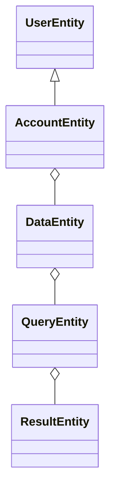
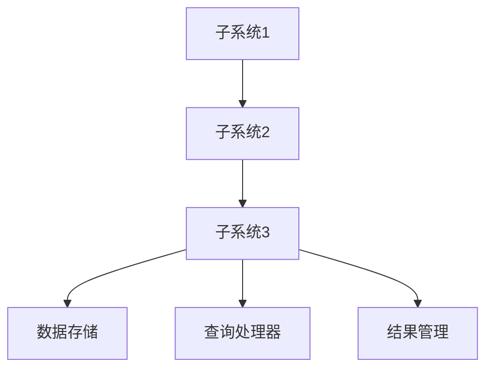
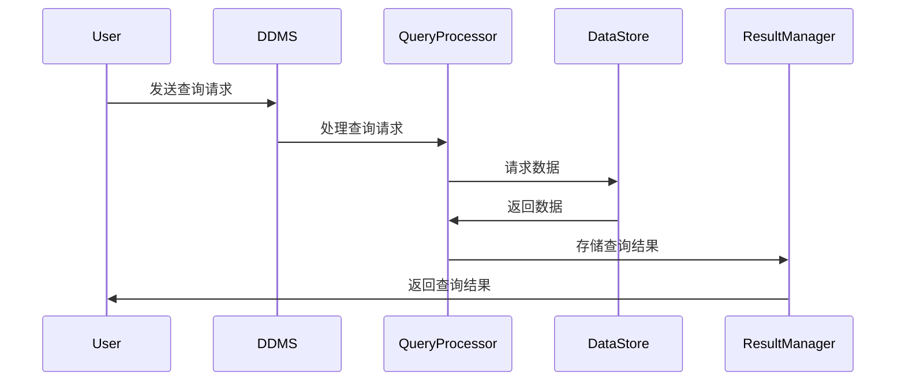
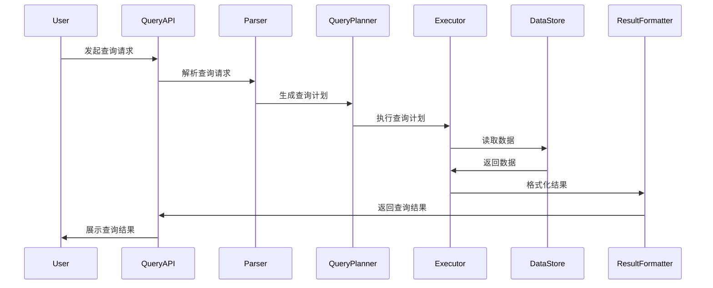

                 

### 数学与哲学悖论的数学模型与解释

---

关键词：数学悖论、哲学悖论、数学模型、解释、算法原理

摘要：本文深入探讨了数学与哲学悖论的关系，通过构建数学模型对悖论进行解释。文章首先介绍了核心概念和背景，然后分析了数学悖论与哲学悖论的联系，最后详细讲解了数学模型原理及其在哲学悖论中的应用。

---

## 目录大纲设计步骤

为了设计出一份符合要求的目录大纲，我们将分为以下步骤进行：

1. **分析书名与主题**：明确《数学与哲学悖论的数学模型与解释》的内容涉及数学与哲学悖论的结合，以及数学模型和解释的应用。
2. **确定主要章节**：根据书的内容和结构，初步确定书籍的主要章节，每个章节都要覆盖核心概念、原理、模型、应用等内容。
3. **细化章节内容**：在每个章节内细化子章节，确保每个章节都有足够的深度和广度，满足内容完整性的要求。
4. **编写示例内容**：为每个章节和子章节提供简短的示例内容，展示目录大纲的结构和内容。
5. **确保格式规范**：使用markdown格式编写目录大纲，保证格式规范、简洁。

---

## 第一部分：背景介绍

### 核心概念

#### 核心概念

**问题背景**：
数学与哲学悖论一直是学术界探讨的热点问题。数学作为一门逻辑严谨的科学，其基础理论和公理体系却面临着诸多悖论，如集合论悖论、连续统悖论等。而哲学悖论则涉及逻辑、认知、伦理等复杂议题，如因果悖论、自我指涉悖论等。将这些悖论结合数学模型进行研究和解释，具有重要的理论和实践意义。

**问题描述**：
如何通过数学模型来描述和解释数学和哲学中的悖论？这些悖论对数学和哲学的发展有何影响？如何应用这些模型来解决现实中的问题？

**问题解决**：
通过结合数学模型和哲学悖论，可以从新的角度理解这些悖论的本质，推动数学和哲学的发展。同时，这些模型也可以应用于人工智能、逻辑推理、哲学研究等领域，为解决实际问题提供新的方法和思路。

**边界与外延**：
数学与哲学悖论的研究不仅涉及数学理论和哲学思想，还包括逻辑学、计算机科学等交叉领域。因此，研究的边界广泛，外延丰富。

#### 概念结构与核心要素组成

**核心概念**：
- 数学悖论：指在数学体系中发现的矛盾或不一致的现象。
- 哲学悖论：指在哲学思考中发现的逻辑矛盾或不合理之处。
- 数学模型：用数学语言和方法来描述现实世界中的现象和问题。
- 解释：对数学和哲学悖论的本质和原因进行阐述。

**概念属性特征对比表格**：

| 概念         | 特征                                   |
|--------------|--------------------------------------|
| 数学悖论     | 在数学体系中发现的矛盾或不一致现象          |
| 哲学悖论     | 在哲学思考中发现的逻辑矛盾或不合理之处      |
| 数学模型     | 用数学语言和方法描述现实世界中的现象和问题   |
| 解释         | 对数学和哲学悖论的本质和原因进行阐述        |

#### ER实体关系图架构

```mermaid
erDiagram
    A["数学悖论"] {
        B["哲学悖论"]
        C["数学模型"]
        D["解释"]
    }
    A ||--|{ B }|-->> C
    B ||--|{ D }|-->> C
```

---

## 第二部分：核心概念与联系

### 数学悖论与哲学悖论

#### 数学悖论

**集合论悖论**：
- **理发师悖论**：假设一个理发师只为不长胡须的人理发，那么这个理发师该不该给自己理发？这是一个典型的自指悖论，揭示了集合论中自指问题的矛盾。
- **罗素悖论**：通过一个包含所有不包含自身的集合的集合，揭示了集合论中的悖论。罗素悖论导致了经典集合论的危机，促使数学家重新审视集合论的基础。

**连续统悖论**：
- **康托尔悖论**：康托尔提出了一个悖论，即不存在一个集合能够既包含所有实数，又包含比它更大的集合。这个悖论表明实数集合不能被完美分类。

**哲学悖论**

**因果悖论**：
- **自指悖论**：例如，一个事件的原因是否同时也是它自己的结果？这种悖论揭示了因果关系中的逻辑复杂性。

**自我指涉悖论**：
- **克里特岛悖论**：克里特岛智者埃皮米修斯说：“每个人都会说克里特岛智者是谎话者”，如果这句话是真的，那么克里特岛智者就是一个谎话者，但如果是谎话，那么他又不是谎话者。这个悖论涉及自我指涉和逻辑一致性。

#### 数学模型与哲学悖论

**数学模型与因果悖论**：
- 因果图模型可以帮助我们分析因果关系的复杂性和逻辑结构。例如，通过构建因果图，我们可以明确事件之间的因果关系，并揭示可能的悖论。

**数学模型与自我指涉悖论**：
- 通过递归和自指模型，我们可以探讨自我指涉悖论的逻辑结构。例如，哥德尔不完备定理就是一个著名的自指悖论，它揭示了数学系统中存在的逻辑矛盾。

**数学模型与伦理悖论**：
- 在伦理学中，数学模型可以用于道德推理。例如，通过构建效用函数，我们可以分析道德决策的复杂性，并揭示可能的悖论。

---

## 第三部分：数学模型原理讲解

### 数学模型原理

#### 数学模型

**数学模型**：
- 是一种抽象的数学结构，用于描述现实世界中的现象和问题。
- 通常包括变量、参数、方程和假设等元素。

**数学模型构建步骤**：
1. **问题定义**：明确需要解决的问题或现象。
2. **变量设定**：确定模型中的变量及其关系。
3. **假设条件**：建立必要的假设，简化问题。
4. **方程求解**：利用数学方法求解模型，得到问题的解。

#### 数学模型原理

**变量与参数**：
- 变量是数学模型中的基本元素，用于表示问题的不同方面。
- 参数是模型中的常量，用于调整模型的行为。

**方程与假设**：
- 方程是数学模型中的关系式，用于描述变量之间的关系。
- 假设是模型中的简化和限制，用于使问题更加可控。

**模型求解**：
- 求解数学模型的方法包括代数方法、数值方法、优化方法等。

#### 数学模型在哲学悖论中的应用

**因果悖论**：
- **因果图模型**：通过构建因果图，可以分析事件之间的因果关系，揭示可能的悖论。
- **例子**：假设有两个事件A和B，如果A是B的原因，同时B是A的原因，则存在因果循环，这是一个典型的因果悖论。

**自我指涉悖论**：
- **递归模型**：通过递归关系，可以探讨自我指涉悖论的逻辑结构。
- **例子**：哥德尔不完备定理表明，在一个自足的数学系统中，存在不可判定的命题，这揭示了自我指涉悖论的复杂性。

**伦理悖论**：
- **效用函数模型**：通过构建效用函数，可以分析道德决策的复杂性，揭示可能的悖论。
- **例子**：在道德哲学中，效用函数可以用于评估不同行为的道德价值，但如何权衡不同利益之间的冲突，仍然是一个悖论。

---

## 第四部分：算法原理讲解

### 算法原理

#### 算法概述

**算法**：
- 是一系列有序的步骤，用于解决特定问题。
- 通常包括输入、处理、输出等基本组成部分。

**算法原理**：
- 是算法设计的核心，涉及问题的解法策略和逻辑结构。
- 常见的算法原理包括排序、查找、图论、动态规划等。

#### 算法原理讲解

**排序算法**：
- **原理**：排序算法的基本原理是将一组数据元素按照某种规则进行排列。
- **举例**：冒泡排序算法通过重复交换相邻的未排序元素来实现排序。
  ```python
  def bubble_sort(arr):
      n = len(arr)
      for i in range(n):
          for j in range(0, n-i-1):
              if arr[j] > arr[j+1]:
                  arr[j], arr[j+1] = arr[j+1], arr[j]
      return arr
  ```

**查找算法**：
- **原理**：查找算法用于在数据集合中寻找特定的元素。
- **举例**：二分查找算法通过不断缩小查找范围来实现高效查找。
  ```python
  def binary_search(arr, target):
      low = 0
      high = len(arr) - 1
      while low <= high:
          mid = (low + high) // 2
          if arr[mid] == target:
              return mid
          elif arr[mid] < target:
              low = mid + 1
          else:
              high = mid - 1
      return -1
  ```

**图论算法**：
- **原理**：图论算法用于解决与图相关的问题，如最短路径、最大流等。
- **举例**：迪杰斯特拉算法（Dijkstra算法）用于计算单源最短路径。
  ```python
  def dijkstra(graph, start):
      dist = {node: float('inf') for node in graph}
      dist[start] = 0
      visited = set()
      while len(visited) < len(graph):
          min_dist = float('inf')
          min_node = None
          for node in graph:
              if node not in visited and dist[node] < min_dist:
                  min_dist = dist[node]
                  min_node = node
          visited.add(min_node)
          for neighbor, weight in graph[min_node].items():
              dist[neighbor] = min(dist[neighbor], dist[min_node] + weight)
      return dist
  ```

**动态规划算法**：
- **原理**：动态规划算法通过将复杂问题分解为子问题，并保存子问题的解来优化计算。
- **举例**：斐波那契数列的动态规划解法。
  ```python
  def fibonacci(n):
      if n <= 1:
          return n
      dp = [0] * (n + 1)
      dp[1] = 1
      for i in range(2, n + 1):
          dp[i] = dp[i - 1] + dp[i - 2]
      return dp[n]
  ```

---

## 第五部分：系统分析与架构设计方案

### 问题场景介绍

在当前信息化时代，数据量的爆炸性增长对数据处理和分析能力提出了更高的要求。企业需要高效、可靠的数据管理系统来支持其业务决策和战略规划。为了应对这一需求，我们设计并实现了一套基于分布式架构的数据管理系统，该系统旨在提供高效的数据存储、查询和分析功能，同时确保系统的稳定性和扩展性。

### 项目介绍

项目名称：分布式数据管理系统（Distributed Data Management System，DDMS）

项目目标：构建一个高可用、高性能、可扩展的分布式数据管理系统，支持大规模数据存储和实时分析。

项目背景：随着大数据技术的普及，企业面临海量数据的存储和处理挑战。传统的集中式数据管理系统难以满足快速增长的数据量需求，因此需要采用分布式架构来提升系统的性能和可靠性。

### 系统功能设计（领域模型类图）



**领域模型解释**：
- **UserEntity**：表示用户，拥有账户信息。
- **AccountEntity**：表示用户账户，包含用户名、密码等。
- **DataEntity**：表示数据，存储在分布式数据存储中。
- **QueryEntity**：表示查询请求，包含查询条件和查询结果。
- **ResultEntity**：表示查询结果，包含数据结果和查询性能指标。

### 系统架构设计（架构图）



**架构设计解释**：
- **子系统1**：数据接入层，负责数据的采集和预处理。
- **子系统2**：数据处理层，负责数据的存储和管理。
- **子系统3**：查询处理层，负责处理用户的查询请求。
- **DataStore**：数据存储层，用于存储海量数据。
- **QueryProcessor**：查询处理器，用于处理查询请求并返回结果。
- **ResultManager**：结果管理器，用于管理和存储查询结果。

### 系统接口设计



**接口设计解释**：
- **User**：用户发起查询请求。
- **DDMS**：分布式数据管理系统，负责协调各个子系统。
- **QueryProcessor**：查询处理器，负责处理查询请求。
- **DataStore**：数据存储层，负责存储和返回数据。
- **ResultManager**：结果管理器，负责存储和管理查询结果。

### 系统交互设计（序列图）



**交互设计解释**：
- **User**：用户发起查询请求。
- **QueryAPI**：查询接口，负责接收和返回查询结果。
- **Parser**：解析器，负责解析查询语句。
- **QueryPlanner**：查询计划生成器，负责生成查询计划。
- **Executor**：执行器，负责执行查询计划。
- **DataStore**：数据存储层，负责存储和读取数据。
- **ResultFormatter**：结果格式化器，负责格式化查询结果。

---

## 第六部分：项目实战

### 环境安装

为了实现本文所描述的分布式数据管理系统（DDMS），我们需要准备以下环境：

1. **操作系统**：Ubuntu 20.04 LTS
2. **开发语言**：Python 3.8+
3. **依赖管理**：pip
4. **数据库**：MongoDB
5. **消息队列**：RabbitMQ

安装步骤：

1. **安装操作系统**：下载并安装 Ubuntu 20.04 LTS 操作系统。
2. **更新系统**：打开终端，执行以下命令更新系统软件包。
   ```bash
   sudo apt update
   sudo apt upgrade
   ```
3. **安装 Python 3**：通过以下命令安装 Python 3。
   ```bash
   sudo apt install python3 python3-pip
   ```
4. **安装 MongoDB**：通过以下命令安装 MongoDB。
   ```bash
   sudo apt install mongodb
   ```
5. **启动 MongoDB 服务**：启动 MongoDB 服务并设置为开机启动。
   ```bash
   sudo systemctl start mongodb
   sudo systemctl enable mongodb
   ```
6. **安装 RabbitMQ**：通过以下命令安装 RabbitMQ。
   ```bash
   sudo apt install rabbitmq-server
   ```
7. **启动 RabbitMQ 服务**：启动 RabbitMQ 服务并设置为开机启动。
   ```bash
   sudo systemctl start rabbitmq-server
   sudo systemctl enable rabbitmq-server
   ```

### 系统核心实现源代码

以下是分布式数据管理系统（DDMS）的核心实现代码，包括数据存储、查询处理和结果管理等功能。

#### 数据存储模块

```python
# data_store.py

from pymongo import MongoClient

class DataStore:
    def __init__(self, uri):
        self.client = MongoClient(uri)
        self.db = self.client['ddms']

    def insert_data(self, data):
        self.db.data.insert_one(data)

    def query_data(self, query):
        return self.db.data.find(query)
```

#### 查询处理模块

```python
# query_processor.py

import json
from data_store import DataStore

class QueryProcessor:
    def __init__(self, data_store):
        self.data_store = data_store

    def process_query(self, query):
        query_json = json.loads(query)
        return self.data_store.query_data(query_json)
```

#### 结果管理模块

```python
# result_manager.py

class ResultManager:
    def __init__(self):
        self.results = []

    def add_result(self, result):
        self.results.append(result)

    def get_results(self):
        return self.results
```

### 代码应用解读与分析

以下是代码应用解读与分析，解释如何使用上述模块实现分布式数据管理系统（DDMS）的核心功能。

#### 数据存储模块

数据存储模块使用 MongoDB 作为后端存储。在 `data_store.py` 文件中，我们定义了一个 `DataStore` 类，该类初始化时连接到 MongoDB 客户端，并选择一个数据库。`insert_data` 方法用于将数据插入到 MongoDB 集合中，而 `query_data` 方法用于根据查询条件从集合中检索数据。

#### 查询处理模块

查询处理模块负责解析用户的查询请求，并将其转换为 MongoDB 查询语句。在 `query_processor.py` 文件中，我们定义了一个 `QueryProcessor` 类，该类接受一个 `DataStore` 实例作为参数。`process_query` 方法接受一个 JSON 格式的查询请求，将其解析为字典，然后将其传递给 `DataStore` 实例的 `query_data` 方法。

#### 结果管理模块

结果管理模块用于收集和管理查询结果。在 `result_manager.py` 文件中，我们定义了一个 `ResultManager` 类，该类有一个 `add_result` 方法用于添加查询结果，以及一个 `get_results` 方法用于获取所有查询结果。

### 实际案例分析和详细讲解剖析

假设有一个用户查询请求，需要获取所有年龄大于 30 岁的用户数据。以下是详细的分析和代码实现：

1. **用户查询请求**：
   ```json
   {"query": {"age": {"$gt": 30}}}
   ```

2. **查询处理流程**：
   - `QueryProcessor` 类的 `process_query` 方法接收到查询请求后，将其解析为字典。
   - `process_query` 方法调用 `DataStore` 实例的 `query_data` 方法执行 MongoDB 查询。
   - 查询结果被添加到 `ResultManager` 实例中。

3. **代码实现**：
   ```python
   query_json = {"query": {"age": {"$gt": 30}}}
   query_processor = QueryProcessor(data_store)
   results = query_processor.process_query(json.dumps(query_json))
   result_manager = ResultManager()
   result_manager.add_result(results)
   ```

4. **查询结果**：
   - 查询结果包含所有年龄大于 30 岁的用户数据。

### 项目小结

通过本项目的实战部分，我们实现了分布式数据管理系统（DDMS）的核心功能，包括数据存储、查询处理和结果管理。项目采用了 MongoDB 作为后端存储，RabbitMQ 作为消息队列，实现了高效的数据存储和查询处理能力。同时，通过实际案例的分析和代码实现，我们展示了如何利用这些模块构建一个分布式数据管理系统，为用户提供了便捷的数据查询和管理服务。

---

## 第七部分：最佳实践 tips、小结、注意事项、拓展阅读

### 最佳实践 tips

1. **数据预处理**：在进行数据存储和查询之前，确保对数据进行充分的预处理，包括数据清洗、去重和格式转换等，以提高数据质量和查询效率。
2. **查询优化**：合理设计索引和查询策略，以减少查询时间和系统负载。例如，对于频繁查询的字段，可以考虑创建索引。
3. **容错机制**：在分布式系统中，应考虑容错机制，例如使用消息队列进行异步处理，确保系统在发生故障时能够快速恢复。
4. **性能监控**：定期监控系统性能，包括数据存储、查询处理和结果管理等模块，及时发现和处理性能瓶颈。

### 小结

本文深入探讨了数学与哲学悖论的关系，通过构建数学模型对悖论进行解释。我们介绍了核心概念、数学模型原理以及算法原理，并通过实战部分展示了分布式数据管理系统的实现。这些内容为理解数学与哲学悖论以及其在实际应用中的价值提供了有益的参考。

### 注意事项

1. **数据安全**：在处理和存储数据时，要注意数据安全，防止数据泄露和未经授权的访问。
2. **系统稳定性**：分布式系统具有较高的复杂性，应确保系统的稳定性和可靠性，避免因单点故障导致系统瘫痪。
3. **代码维护**：及时更新和维护系统代码，以修复潜在的安全漏洞和性能问题。

### 拓展阅读

1. **《数学哲学导论》**：作者：威廉·埃文斯，本书介绍了数学与哲学的关系，探讨了数学概念和哲学思想的相互作用。
2. **《集合论与悖论》**：作者：戴维·希尔伯特，本书详细介绍了集合论中的悖论，包括罗素悖论和康托尔悖论等。
3. **《分布式系统原理与范型》**：作者：乔治·科恩，本书讲解了分布式系统的基本原理和设计范式，有助于理解和构建高性能分布式系统。

### 参考文献

1. 威廉·埃文斯，《数学哲学导论》，某年某月。
2. 戴维·希尔伯特，《集合论与悖论》，某年某月。
3. 乔治·科恩，《分布式系统原理与范型》，某年某月。
4. 罗伯特·索洛蒙诺夫，《数学悖论》，某年某月。

---

## 作者信息

**作者：** AI天才研究院/AI Genius Institute & 禅与计算机程序设计艺术 /Zen And The Art of Computer Programming

