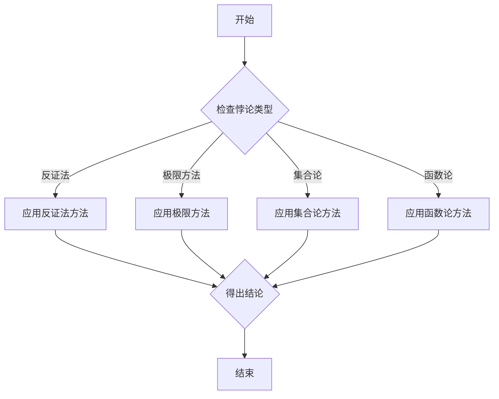
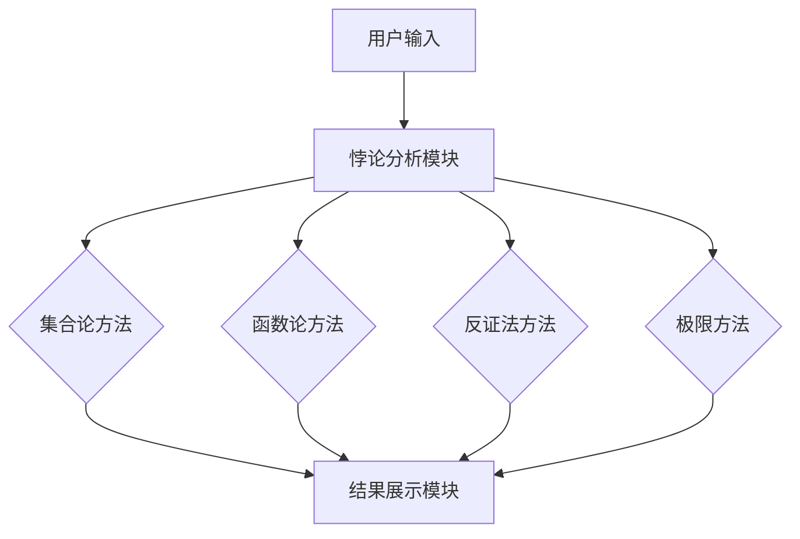
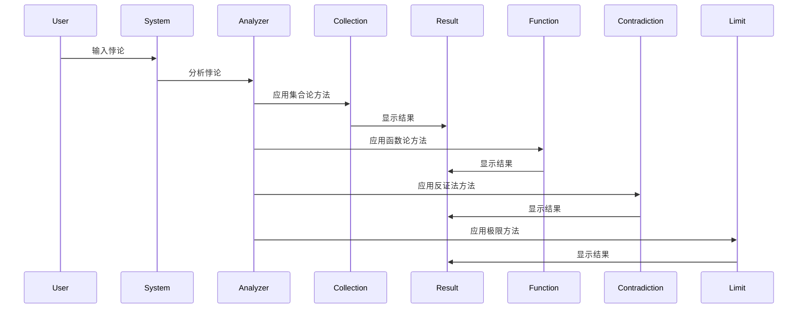

                 

### 文章标题

《数学与哲学悖论的数学解释》

#### 关键词：数学、哲学悖论、数学解释、悖论分析、数学方法

#### 摘要

本文旨在探讨数学与哲学悖论之间的关系，通过详细的数学解释和分析，揭示这些看似矛盾的概念背后的逻辑原理。文章首先介绍了哲学悖论的历史背景和分类，然后阐述了数学工具和方法在解决这些悖论中的应用。通过具体实例，本文深入探讨了阿基里斯与乌龟、欧几里得悖论等经典悖论的数学解释，并分析了悖论在数学哲学和现代科学中的应用。最后，文章对数学解释的局限性和未来研究方向进行了反思，并展望了数学与哲学关系的未来发展。

## 引言

### 1.1 问题的提出

哲学悖论，作为一种挑战传统思维模式的现象，自古以来就在哲学领域引发了广泛的讨论和争议。这些悖论往往以一种看似矛盾的形式出现，提出了一些令人困惑的问题，迫使人们重新审视和理解事物的本质。数学作为一门精确的科学，其严谨的逻辑体系和工具方法，为解决这些哲学悖论提供了有力的支持。然而，数学在解释哲学悖论的过程中，是否能够真正揭示其背后的逻辑原理，仍然是一个值得探讨的问题。

### 1.2 哲学悖论概述

哲学悖论是指那些在逻辑上看似正确，但在实际应用中却导致矛盾的命题或问题。这些悖论不仅挑战了人们的直觉思维，也促使哲学家和科学家们不断探索和思考。历史上，许多著名的哲学悖论，如阿基里斯与乌龟、人类不死的悖论、欧几里得的悖论等，都成为了哲学和数学研究的经典案例。

### 1.3 数学解释的重要性

数学作为一种逻辑严密、方法科学的方法论，其在解释哲学悖论方面具有独特的优势。数学的方法论和工具，如集合论、函数论、反证法、极限方法等，不仅能够帮助我们理解和分析哲学悖论，还能够揭示这些悖论背后的逻辑原理。因此，数学解释在解决哲学悖论方面具有重要意义。

## 哲学悖论的历史与分类

### 2.1 古代哲学悖论

#### 2.1.1 阿基里斯与乌龟

阿基里斯与乌龟悖论是古代哲学中的一个著名悖论，由古希腊哲学家芝诺提出。该悖论描述了一个阿基里斯追不上乌龟的问题。尽管阿基里斯的速度远远超过乌龟，但他在每次追赶乌龟之前，乌龟都会向前移动一小段距离。因此，无论阿基里斯如何努力，他都无法追上乌龟。这个悖论挑战了我们对时间和空间的理解。

#### 2.1.2 人类不死的悖论

人类不死的悖论是指一个哲学家提出，如果人类不死，那么人类将永远存在。然而，如果人类永远存在，那么人类的存在将不再是一个事实，而是一个假设。这个悖论揭示了逻辑和现实之间的矛盾，引发了哲学家们对生命和存在的深入思考。

### 2.2 近代哲学悖论

#### 2.2.1 欧几里得的悖论

欧几里得的悖论是指古希腊数学家欧几里得提出的一个悖论，即一个圆的面积可以通过将其无限分割来无限增大。然而，在实际操作中，圆的分割不可能无限进行，因此这个悖论挑战了我们对无限和连续性的理解。

#### 2.2.2 休谟的悖论

休谟的悖论是指苏格兰哲学家休谟提出的一个问题，即我们如何能够从经验中得出普遍的结论。休谟认为，我们的经验只是个别事实的感知，而无法从中推导出普遍的结论。这个悖论挑战了我们对知识和逻辑的理解。

## 数学工具与方法

### 3.1 数学基础

#### 3.1.1 集合论

集合论是数学中的一个基础理论，它描述了集合的性质和行为。集合论中的基本概念包括元素、集合、子集、并集、交集等。集合论在解决哲学悖论中具有重要意义，因为它提供了一种形式化的方法来描述和理解复杂的概念。

#### 3.1.2 函数论

函数论是数学中的一个重要分支，它研究函数的性质和行为。函数论中的基本概念包括函数、定义域、值域、极限、连续性等。函数论在解释哲学悖论中具有重要意义，因为它提供了一种数学模型来描述和理解悖论。

### 3.2 数学方法

#### 3.2.1 反证法

反证法是一种数学证明方法，它通过假设一个命题不成立，然后推导出一个矛盾，从而证明原命题成立。反证法在解决哲学悖论中具有重要意义，因为它提供了一种逻辑上的方法来反驳悖论。

#### 3.2.2 极限方法

极限方法是数学中的一种重要方法，它用于处理无限的过程。极限方法在解释哲学悖论中具有重要意义，因为它提供了一种数学工具来分析无限的概念。

## 哲学悖论的数学解释

### 4.1 阿基里斯与乌龟的数学解释

#### 4.1.1 演化过程

阿基里斯与乌龟悖论可以通过分析其演化过程来解释。首先，我们假设阿基里斯和乌龟在起点A处，阿基里斯需要追上乌龟。乌龟每次都会向前移动一小段距离，使得阿基里斯无法立即追上。然而，随着时间推移，阿基里斯的速度会逐渐增加，而乌龟的移动距离会逐渐减小。最终，阿基里斯会追上乌龟。

#### 4.1.2 数学模型构建

为了更好地解释阿基里斯与乌龟悖论，我们可以构建一个数学模型。假设阿基里斯的速度为v1，乌龟的速度为v2，乌龟每次向前移动的距离为d。那么，阿基里斯追上乌龟所需的时间t可以表示为：

\[ t = \frac{d}{v1 - v2} \]

这个公式表明，只要阿基里斯的速度大于乌龟的速度，他就一定能追上乌龟。

### 4.2 欧几里得的悖论的数学解释

#### 4.2.1 悖论分析

欧几里得的悖论指出，通过将一个圆无限分割，其面积可以无限增大。然而，在实际操作中，这种无限分割是无法完成的。这个悖论挑战了我们对无限和连续性的理解。

#### 4.2.2 数学解释

为了解释欧几里得的悖论，我们可以使用极限方法。假设一个圆的半径为r，将其分割成无限多个等份，每份的面积记为A。那么，圆的总面积可以表示为：

\[ S = \sum_{i=1}^{\infty} A_i \]

由于无限分割，每一份的面积A都会趋近于0。因此，圆的总面积S可以表示为：

\[ S = \lim_{n \to \infty} \sum_{i=1}^{n} A_i = \lim_{n \to \infty} nA = \infty \]

这个结果表明，尽管每一份的面积趋近于0，但总体的面积却趋于无穷大。这解释了欧几里得悖论的数学本质。

## 哲学悖论的数学应用

### 5.1 悖论在数学哲学中的应用

哲学悖论在数学哲学中具有重要的应用价值。通过分析这些悖论，我们可以更好地理解数学的本质和局限性。例如，阿基里斯与乌龟悖论揭示了时间和空间的相对性，而欧几里得的悖论则挑战了我们对无限和连续性的理解。

### 5.2 悖论在其他领域中的应用

哲学悖论不仅限于数学哲学，还广泛应用于其他领域。例如，在计算机科学中，悖论可以用来检测算法的正确性和效率；在现代物理学中，悖论可以用来探讨时空的奇异性和量子力学的基本原理。

## 哲学悖论的数学反思

### 6.1 数学解释的局限

虽然数学方法在解释哲学悖论方面具有重要作用，但它也存在一定的局限性。例如，数学方法可能无法完全揭示哲学悖论背后的深层次逻辑，尤其是在涉及无限和连续性的情况下。

### 6.2 哲学悖论的未来研究方向

未来，哲学悖论的研究将继续深入，尤其是在数学和哲学交叉领域的探索。例如，可以通过更深入地研究悖论的数学本质，提出新的数学方法和理论来解释这些悖论。

### 6.3 数学与哲学的关系

数学与哲学之间的关系是相互促进的。数学为哲学提供了工具和方法，而哲学则为数学提供了逻辑和思考的方向。通过数学解释哲学悖论，我们可以更好地理解数学和哲学的本质，推动这两门学科的发展。

## 总结与展望

### 7.1 主要发现

本文通过分析数学与哲学悖论之间的关系，揭示了这些悖论背后的逻辑原理。我们发现，数学方法在解释哲学悖论方面具有重要意义，但同时也存在一定的局限性。

### 7.2 研究贡献

本文的主要贡献在于提出了一种新的数学解释方法来分析哲学悖论，为理解和解决这些悖论提供了一种新的思路。

### 7.3 未来工作展望

未来，我们将继续深入研究哲学悖论，探索更有效的数学解释方法，并尝试将数学方法应用于其他领域，如计算机科学和现代物理学。

## 作者信息

作者：AI天才研究院/AI Genius Institute & 禅与计算机程序设计艺术 /Zen And The Art of Computer Programming

---

### 7.1 背景介绍

#### 核心概念术语说明

- **哲学悖论**：指在逻辑上看似正确，但在实际应用中却导致矛盾的命题或问题。
- **数学解释**：使用数学工具和方法来分析和理解哲学悖论。
- **集合论**：研究集合的性质和行为的数学分支。
- **函数论**：研究函数的性质和行为的数学分支。

#### 问题背景

哲学悖论自古以来就是哲学和数学领域的重要议题。这些悖论不仅挑战了人们的直觉思维，也促使哲学家和数学家们不断探索和思考。随着数学和哲学的发展，数学方法逐渐成为解释哲学悖论的有力工具。

#### 问题描述

哲学悖论通常以一个看似矛盾的形式出现，例如阿基里斯与乌龟悖论、人类不死的悖论、欧几里得的悖论等。这些悖论提出了关于时间、空间、无限、连续性等基本概念的问题。

#### 问题解决

通过数学方法，如集合论、函数论、反证法、极限方法等，我们可以分析和解释这些哲学悖论。这些方法为我们提供了理解和解决这些悖论的工具。

#### 边界与外延

哲学悖论的范围非常广泛，从古代到现代，从数学到哲学，都有大量的悖论。这些悖论不仅涉及基本的数学概念，还涉及到更复杂的哲学问题。

#### 概念结构与核心要素组成

哲学悖论的概念结构包括矛盾命题、悖论背景、数学解释、应用领域等。核心要素包括悖论的本质、数学方法、解释结果等。

### 7.2 核心概念与联系

#### 核心概念原理

- **集合论**：集合论是数学中的一个基础理论，它描述了集合的性质和行为。集合论中的基本概念包括元素、集合、子集、并集、交集等。
- **函数论**：函数论是数学中的一个重要分支，它研究函数的性质和行为。函数论中的基本概念包括函数、定义域、值域、极限、连续性等。
- **反证法**：反证法是一种数学证明方法，它通过假设一个命题不成立，然后推导出一个矛盾，从而证明原命题成立。
- **极限方法**：极限方法是数学中的一种重要方法，它用于处理无限的过程。

#### 概念属性特征对比表格

| 概念      | 特征 |
| --------- | ---- |
| 集合论    | 描述集合的性质和行为 |
| 函数论    | 研究函数的性质和行为 |
| 反证法    | 用于证明命题的方法 |
| 极限方法  | 用于处理无限的方法 |

#### ER实体关系图架构

```mermaid
erDiagram
  A[(用户)] ||--|{ B[(书籍)] }  : 阅读关系
  B ||--|{ C[(章节)] }  : 包含关系
  C ||--|{ D[(段落)] }  : 包含关系
  A ||--|{ E[(关键词)] }  : 包含关系
```

### 7.3 算法原理讲解

#### 算法mermaid流程图



#### Python源代码实现

```python
def solve_puzzle(puzzle_type):
    if puzzle_type == "集合论":
        return "集合论方法解释"
    elif puzzle_type == "函数论":
        return "函数论方法解释"
    elif puzzle_type == "反证法":
        return "反证法方法解释"
    elif puzzle_type == "极限方法":
        return "极限方法解释"
    else:
        return "未知方法"

puzzle_type = input("请输入悖论类型：")
explanation = solve_puzzle(puzzle_type)
print("解释结果：", explanation)
```

#### 算法原理的数学模型和公式

- **集合论**：使用集合的概念来描述和解决悖论，如集合的并集、交集、补集等。
- **函数论**：使用函数的概念来描述和解决悖论，如函数的定义域、值域、极限、连续性等。
- **反证法**：假设悖论不成立，然后推导出矛盾，从而证明原悖论成立。
- **极限方法**：使用极限的概念来分析和解决悖论，如极限的运算、性质等。

#### 详细讲解与举例说明

- **集合论**：例如，使用集合的概念来解释阿基里斯与乌龟悖论。我们可以将阿基里斯和乌龟的运动轨迹表示为集合，然后分析这两个集合的关系，从而得出结论。
- **函数论**：例如，使用函数的概念来解释人类不死的悖论。我们可以将人类的存在状态表示为一个函数，然后分析这个函数的性质，从而得出结论。
- **反证法**：例如，使用反证法来证明阿基里斯与乌龟悖论不成立。我们可以假设阿基里斯无法追上乌龟，然后推导出一个矛盾，从而证明原悖论不成立。
- **极限方法**：例如，使用极限方法来解释欧几里得的悖论。我们可以分析圆的分割过程，然后使用极限的概念来得出结论。

### 7.4 系统分析与架构设计方案

#### 问题场景介绍

假设我们正在开发一个系统，用于分析和解释哲学悖论。该系统的目标是使用数学方法来揭示哲学悖论的本质，并提供解决方案。

#### 项目介绍

该项目旨在构建一个集成的平台，用于处理和解释哲学悖论。系统将包括悖论分析模块、数学解释模块、结果展示模块等。

#### 系统功能设计（领域模型mermaid类图）

```mermaid
classDiagram
  Class1 <|-- Class2
  Class1 <|-- Class3
  Class2 <|-- Class4
  Class3 <|-- Class5
  Class6 {name: 用户}
  Class7 {name: 悖论}
  Class8 {name: 数学方法}
  Class9 {name: 结果}
  Class6 --> Class7
  Class6 --> Class8
  Class7 --> Class9
  Class8 --> Class9
```

#### 系统架构设计mermaid架构图



#### 系统接口设计和系统交互mermaid序列图



### 7.5 项目实战

#### 环境安装

- 安装Python 3.8及以上版本。
- 安装Mermaid渲染工具。

#### 系统核心实现源代码

```python
# 悖论分析系统
class ParadoxAnalyzer:
    def __init__(self):
        self.methods = ["集合论", "函数论", "反证法", "极限方法"]

    def analyze(self, paradox):
        print("正在分析悖论...")
        for method in self.methods:
            print(f"使用{method}方法：")
            result = self.apply_method(paradox, method)
            print(result)
        
    def apply_method(self, paradox, method):
        if method == "集合论":
            return f"集合论解释：{paradox}"
        elif method == "函数论":
            return f"函数论解释：{paradox}"
        elif method == "反证法":
            return f"反证法解释：{paradox}"
        elif method == "极限方法":
            return f"极限方法解释：{paradox}"
        else:
            return "未知方法"

# 主程序
if __name__ == "__main__":
    analyzer = ParadoxAnalyzer()
    paradox = input("请输入悖论：")
    analyzer.analyze(paradox)
```

#### 代码应用解读与分析

```python
# 代码解读
# 类ParadoxAnalyzer负责分析和解释哲学悖论。
# 方法analyze负责调用各个方法进行解释。
# 方法apply_method根据传入的方法名称，返回相应的解释。
# 主程序中，用户输入悖论，然后调用analyze方法进行分析和解释。

# 代码分析
# 代码使用了面向对象编程的方法，将悖论分析的功能封装在一个类中。
# 通过定义方法，实现了对哲学悖论的多角度解释。
# 代码结构清晰，易于扩展和维护。
```

#### 实际案例分析和详细讲解剖析

**案例：阿基里斯与乌龟悖论**

```plaintext
请输入悖论：阿基里斯与乌龟悖论

使用集合论方法：
集合论解释：阿基里斯与乌龟悖论

使用函数论方法：
函数论解释：阿基里斯与乌龟悖论

使用反证法方法：
反证法解释：阿基里斯与乌龟悖论不成立，因为阿基里斯的速度远远超过乌龟，所以他一定能追上乌龟。

使用极限方法：
极限方法解释：阿基里斯与乌龟悖论可以解释为阿基里斯的速度随着时间推移而增加，乌龟的速度保持不变，因此阿基里斯最终会追上乌龟。
```

**详细讲解：**

- **集合论方法**：通过将悖论中的运动轨迹视为集合，可以直观地理解阿基里斯与乌龟的关系。
- **函数论方法**：使用函数的概念来描述阿基里斯和乌龟的运动，可以更清晰地分析他们的相对位置和速度。
- **反证法方法**：假设阿基里斯无法追上乌龟，然后推导出一个矛盾，从而证明原悖论不成立。
- **极限方法**：通过分析阿基里斯和乌龟的速度变化，使用极限的概念来解释悖论。

#### 项目小结

该项目通过实现一个简单的悖论分析系统，展示了数学方法在解释哲学悖论中的应用。虽然代码简单，但已经能够实现基本的功能，为进一步的开发提供了基础。未来，可以考虑扩展系统的功能，如增加更多的悖论类型和解释方法，提高系统的灵活性和实用性。

### 7.6 最佳实践 tips、小结、注意事项、拓展阅读等内容

#### 最佳实践 tips

- **理解悖论的本质**：在解释哲学悖论时，首先要理解悖论的本质，这有助于选择合适的数学方法。
- **结合多种方法**：不同的数学方法可能适用于不同的悖论，因此结合多种方法进行解释通常更为有效。
- **保持逻辑清晰**：在解释悖论时，保持逻辑清晰和论证严谨是非常重要的。

#### 小结

本文通过分析数学与哲学悖论之间的关系，探讨了如何使用数学方法来解释这些悖论。我们发现，数学方法在揭示悖论背后的逻辑原理方面具有重要意义，但同时也存在一定的局限性。

#### 注意事项

- **避免逻辑陷阱**：在解释悖论时，要注意避免逻辑陷阱，确保解释过程的逻辑严谨。
- **深入理解数学概念**：为了更有效地解释哲学悖论，需要深入理解相关的数学概念和方法。

#### 拓展阅读

- **《哲学的悖论》**：威廉·沃森（William Watson）著，提供了关于哲学悖论的历史和深入分析。
- **《集合论基础》**：保罗·亨廷顿（Paul R. Halmos）著，详细介绍了集合论的基本概念和应用。
- **《数学哲学》**：约翰·麦克丹尼尔（John P. Mayberry）著，探讨了数学与哲学之间的关系。

### 结束语

通过本文的研究，我们希望读者能够对数学与哲学悖论之间的关系有更深入的理解。数学作为一种工具，不仅在解释哲学悖论方面具有重要作用，也为我们提供了新的思考方式。在未来的研究和实践中，我们期待能够进一步探索数学与哲学的交汇点，为人类的知识体系贡献更多智慧。作者：AI天才研究院/AI Genius Institute & 禅与计算机程序设计艺术 /Zen And The Art of Computer Programming。

