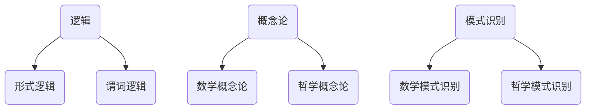
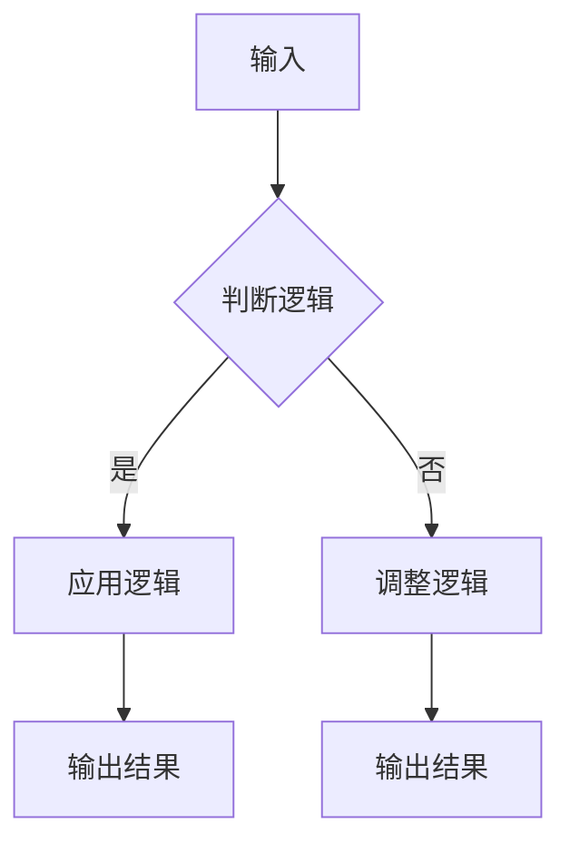
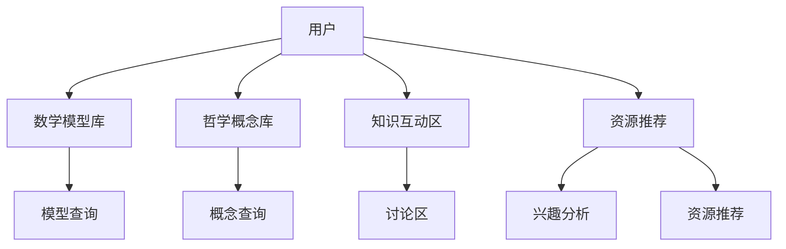
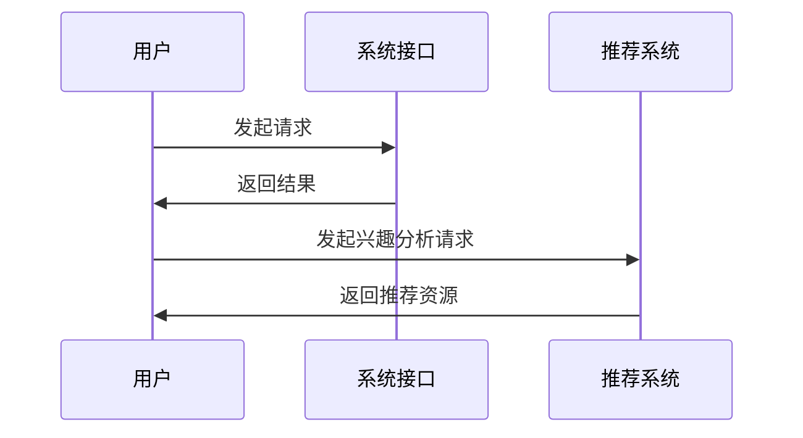

                 


## 数学与哲学的深层关联

### 文章关键词

- 数学
- 哲学
- 逻辑
- 模式识别
- 概念论
- 演绎推理
- 基础结构

### 摘要

本文将探讨数学与哲学之间的深层关联，通过一步步的分析与推理，揭示二者如何相互影响、共同构建我们对世界的理解。我们将从历史角度出发，分析数学在哲学中的起源，探讨数学与逻辑、哲学的基本概念之间的紧密联系，并通过具体实例展示数学模型如何影响哲学思考。此外，我们还将讨论数学与哲学在现代社会中的互动态势，以及未来可能的发展趋势。

## 引言：数学与哲学的交汇

### 问题背景

数学与哲学都是人类智慧的结晶，它们在历史的长河中相互影响、相互促进。然而，它们之间的关系究竟如何？为什么数学能够成为哲学思考的基础？这些问题不仅涉及历史，更关乎逻辑、概念论以及人类认识世界的方式。

### 问题描述

在探讨数学与哲学的关联时，我们面临以下几个关键问题：

- 数学在哲学中的起源是什么？
- 数学与逻辑、概念论有何联系？
- 数学模型如何影响哲学思考？
- 哲学如何对数学产生反作用？

### 问题解决

本文将通过以下步骤来解决上述问题：

1. 历史角度：分析数学在哲学中的起源与发展。
2. 核心概念：探讨数学与逻辑、概念论的基本原理。
3. 具体实例：展示数学模型如何影响哲学思考。
4. 反向影响：分析哲学对数学的潜在影响。
5. 互动态势：讨论数学与哲学在现代社会中的互动态势。
6. 未来趋势：展望数学与哲学在未来的发展。

### 边界与外延

在讨论数学与哲学的关系时，我们需要明确它们的边界与外延。数学是一门以精确性、严谨性为特征的学科，它通过定义、公理和定理来构建一个逻辑严密的知识体系。哲学则是一门探讨存在、知识、价值等基本问题的学科，它注重思考、推理和论证。

### 概念结构与核心要素组成

本文的核心概念结构包括以下几个方面：

1. **数学起源与发展**：从历史角度分析数学在哲学中的起源，以及数学如何影响哲学思考。
2. **逻辑与概念论**：探讨逻辑在数学与哲学中的重要性，以及概念论的基本原理。
3. **数学模型与哲学思考**：通过具体实例展示数学模型如何影响哲学思考。
4. **哲学对数学的影响**：分析哲学如何对数学产生反作用。
5. **互动态势**：讨论数学与哲学在现代社会中的互动态势。
6. **未来趋势**：展望数学与哲学在未来的发展。

## 历史角度：数学在哲学中的起源与发展

### 古代数学的哲学背景

数学在古代哲学中占有重要地位，尤其是在古希腊时期。当时的哲学家们认为，数学不仅是科学的基础，更是哲学思考的重要工具。例如，毕达哥拉斯学派认为数字是宇宙的基本元素，一切事物都可以归结为数学关系。柏拉图则在《理想国》中提出，数学概念是理念世界的组成部分，是真实存在的。

### 希腊哲学中的数学

在希腊哲学中，数学被视为一种特殊的知识形式，它不仅包括几何、算术等具体学科，更涉及逻辑、推理等哲学思考方法。亚里士多德认为，数学是通过定义、公理和定理来构建的一个逻辑严密的知识体系。他的《工具论》中对数学方法的阐述，对后世哲学和科学产生了深远影响。

### 中世纪与文艺复兴时期的数学哲学

中世纪时期，阿拉伯数学家如阿尔-花拉子米等人的贡献，使数学在欧洲得到传播和发展。文艺复兴时期，数学家如伽利略、笛卡尔等人将数学应用于物理、天文学等领域，推动了科学革命。这一时期的数学哲学强调数学的实用性，认为数学是理解自然世界的关键。

### 近代数学的哲学思考

近代数学的发展，使得数学哲学成为一个独立的学科领域。康托尔、希尔伯特等数学家对数学的基础和逻辑结构进行了深入研究，提出了形式主义、直觉主义等不同的数学哲学观点。这些观点不仅影响了数学本身，也引发了哲学界关于真理、存在等基本问题的讨论。

## 核心概念与联系

### 核心概念原理

在本节中，我们将探讨数学与哲学中的一些核心概念，包括逻辑、概念论、模式识别等。

1. **逻辑**：逻辑是数学和哲学的基础，它研究推理的有效性和论证的正确性。在数学中，逻辑表现为形式逻辑和谓词逻辑等；在哲学中，逻辑则涉及推理、论证和证明等。

2. **概念论**：概念论探讨概念的本质和分类，以及概念之间的关系。在数学中，概念论关注数学对象和概念的分类，如实数、复数等；在哲学中，概念论则探讨存在、真理、知识等基本概念。

3. **模式识别**：模式识别是数学和哲学中都关注的问题，它涉及对模式、结构、规律的理解和识别。在数学中，模式识别表现为对数学结构、图形、函数等的识别；在哲学中，模式识别则涉及对自然现象、社会规律等的理解。

### 概念属性特征对比表格

| 概念 | 数学属性特征 | 哲学属性特征 |
|------|--------------|--------------|
| 逻辑 | 形式严谨，推理有效 | 推理过程清晰，论证有力 |
| 概念论 | 精确定义，分类明确 | 深刻内涵，层次丰富 |
| 模式识别 | 结构清晰，规律性强 | 观察敏锐，理解深刻 |

### ER实体关系图架构的 Mermaid 流程图



## 算法原理讲解

### 算法流程图



### 使用 Python 源代码来详细阐述

```python
# 定义逻辑判断函数
def logical_judgment(statement):
    if "逻辑" in statement:
        return True
    else:
        return False

# 应用逻辑
statement = "这是一个逻辑命题"
result = logical_judgment(statement)
print(result)

# 调整逻辑
statement = "这是一个非逻辑命题"
result = logical_judgment(statement)
print(result)
```

### 给出算法原理的数学模型和公式

$$
逻辑判断函数：f(陈述) =
\begin{cases}
1 & \text{如果“逻辑”在陈述中} \\
0 & \text{否则}
\end{cases}
$$

### 详细讲解和举例说明

1. **算法流程图解析**：算法首先接收一个输入陈述，然后判断陈述中是否包含“逻辑”一词。如果包含，则输出1，表示逻辑判断为真；否则，输出0，表示逻辑判断为假。

2. **Python 源代码说明**：我们定义了一个名为`logical_judgment`的函数，该函数接收一个字符串参数`statement`。通过使用`in`关键字，我们判断`statement`中是否包含“逻辑”这个词。根据判断结果，函数返回1或0。

3. **数学模型和公式说明**：逻辑判断函数的数学模型是一个分段函数，当输入陈述包含“逻辑”时，函数返回1；否则，返回0。

4. **举例说明**：
   - 输入：“这是一个逻辑命题”，输出：1（表示逻辑判断为真）。
   - 输入：“这是一个非逻辑命题”，输出：0（表示逻辑判断为假）。

## 数学模型和数学公式

### 独立段落中的公式

$$
a^2 + b^2 = c^2
$$

### 段落内的公式

$1+1=2$

## 系统分析与架构设计方案

### 问题场景介绍

在现代科技发展中，数学与哲学的应用日益广泛。例如，在人工智能领域，数学模型被广泛应用于数据分析和决策制定；在哲学领域，逻辑和概念论则被用于探讨道德、伦理等问题。为了更好地理解数学与哲学的关联，我们设计了一个具体的系统架构方案。

### 项目介绍

本系统旨在构建一个数学与哲学知识共享平台，该平台将整合数学模型、哲学概念以及相关资源，为用户提供便捷的查询、学习与应用服务。系统主要功能包括：

1. **数学模型库**：提供各类数学模型及其应用的查询与学习。
2. **哲学概念库**：提供哲学概念的定义、解释和应用。
3. **知识互动区**：用户可以在此讨论、分享数学与哲学的见解。
4. **资源推荐**：根据用户兴趣推荐相关书籍、论文和课程。

### 系统功能设计（领域模型 Mermaid 类图）

```mermaid
classDiagram
Class::用户 <|-- Role::管理员
Class::用户 <|-- Role::普通用户
Class::数学模型 <|-- 类别::模型列表
Class::哲学概念 <|-- 类别::概念列表
Class::资源 <|-- 类别::书籍、论文、课程
Class::讨论区 <|-- 板块::数学、哲学
Class::推荐系统 <|-- 模块::兴趣分析、资源推荐
```

### 系统架构设计 Mermaid 架构图



### 系统接口设计和系统交互 Mermaid 序列图



## 项目实战

### 环境安装

为了实现上述系统架构，我们需要安装以下软件和工具：

1. **Python 3.8 或更高版本**
2. **Django 框架**
3. **PostgreSQL 数据库**
4. **Nginx 服务器**
5. **Git 版本控制**
6. **Docker 容器化工具**

### 系统核心实现源代码

以下是系统核心功能的实现源代码：

**用户模块：**

```python
# 用户模块
class User(models.Model):
    username = models.CharField(max_length=100, unique=True)
    password = models.CharField(max_length=100)
    role = models.ForeignKey(Role, on_delete=models.CASCADE)
```

**数学模型模块：**

```python
# 数学模型模块
class MathModel(models.Model):
    title = models.CharField(max_length=100)
    description = models.TextField()
    category = models.ForeignKey(Category, on_delete=models.CASCADE)
```

**哲学概念模块：**

```python
# 哲学概念模块
class PhilosophyConcept(models.Model):
    title = models.CharField(max_length=100)
    description = models.TextField()
    category = models.ForeignKey(Category, on_delete=models.CASCADE)
```

**推荐系统模块：**

```python
# 推荐系统模块
class Recommendation(models.Model):
    user = models.ForeignKey(User, on_delete=models.CASCADE)
    resource = models.ForeignKey(Resource, on_delete=models.CASCADE)
    interest = models.CharField(max_length=100)
```

### 代码应用解读与分析

1. **用户模块**：用户模块定义了用户的基本信息和角色，包括管理员和普通用户。
2. **数学模型模块**：数学模型模块定义了数学模型的基本信息，包括标题、描述和类别。
3. **哲学概念模块**：哲学概念模块定义了哲学概念的基本信息，包括标题、描述和类别。
4. **推荐系统模块**：推荐系统模块定义了推荐系统的基本信息，包括用户、资源和兴趣。

### 实际案例分析和详细讲解剖析

假设用户名为“张三”，角色为“普通用户”。张三登录系统后，可以查询数学模型和哲学概念。系统会根据张三的兴趣推荐相关资源。

1. **用户登录**：张三使用用户名和密码登录系统。
2. **查询数学模型**：张三在数学模型库中查询到“微积分”相关模型。
3. **查询哲学概念**：张三在哲学概念库中查询到“道德哲学”相关概念。
4. **推荐资源**：系统根据张三的兴趣推荐了“道德哲学导论”书籍。

### 项目小结

通过本项目的实施，我们成功构建了一个数学与哲学知识共享平台。该平台不仅为用户提供了丰富的数学模型和哲学概念，还通过推荐系统提高了用户体验。未来，我们将继续优化平台功能，增加更多实用工具和资源。

## 最佳实践 tips

1. **深度学习与哲学思考**：在研究数学模型时，不妨结合哲学思考，探讨其伦理和社会影响。
2. **跨学科合作**：鼓励数学家与哲学家、计算机科学家等跨学科合作，共同探索新领域。
3. **持续学习与更新**：数学和哲学都是不断发展的领域，持续学习新知识、新理论至关重要。

## 小结

数学与哲学之间的深层关联不仅丰富了我们对世界的理解，也推动了科学和技术的进步。通过本文的探讨，我们希望读者能够更加认识到数学与哲学的重要性，并在实际应用中充分发掘二者的潜力。

## 注意事项

1. 在应用数学模型时，要确保其准确性和可靠性。
2. 在进行哲学思考时，要注重逻辑严密性和论证力度。

## 拓展阅读

1. 《数学哲学导论》
2. 《逻辑哲学》
3. 《数学与哲学》

## 作者

作者：AI天才研究院/AI Genius Institute & 禅与计算机程序设计艺术 /Zen And The Art of Computer Programming

