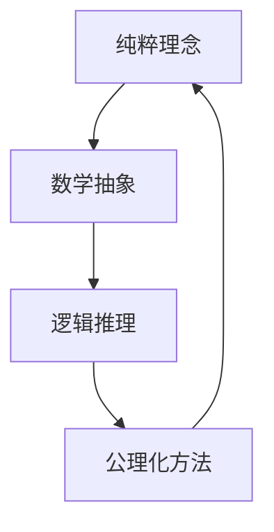
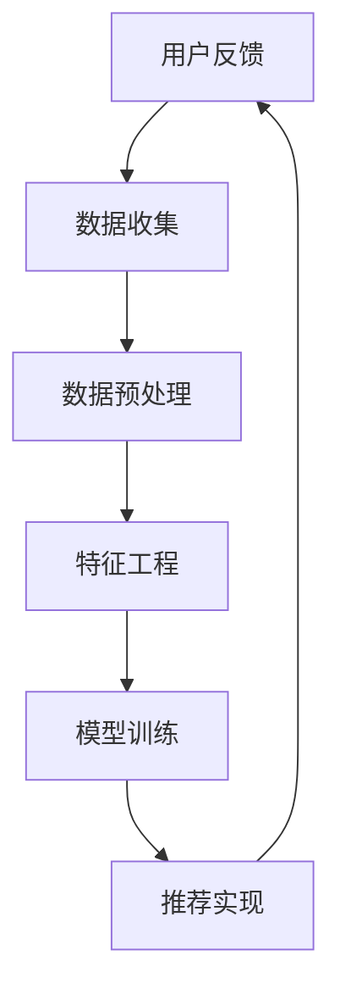
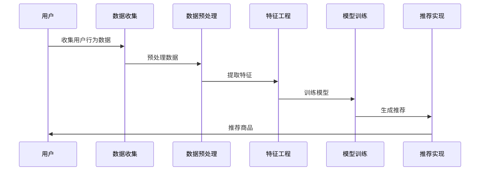

                 

### 数学与唯心主义：数学作为纯粹理念

#### 关键词：数学、唯心主义、纯粹理念、抽象性、逻辑推理、公理化方法

#### 摘要：
本文将探讨数学与唯心主义之间的关系，特别是数学作为一种纯粹理念的存在。我们将通过分析数学的发展历程、数学家的哲学观点以及数学在唯心主义体系中的地位，深入探讨数学的本质及其与唯心主义的联系。文章将分为以下几个部分：

1. **背景介绍**：介绍数学与唯心主义的关系背景，定义相关概念。
2. **核心概念与联系**：分析数学与唯心主义的核心概念及其相互联系。
3. **算法原理讲解**：使用Mermaid和Python代码详细阐述数学作为纯粹理念的算法原理。
4. **系统分析与架构设计方案**：介绍一个基于数学理念的系统架构设计。
5. **项目实战**：实现一个简单的基于数学理念的项目，并进行详细分析。

#### 背景介绍

##### 1.1 问题背景

数学作为一门精确的科学，一直以来都是自然科学家和社会科学家的重要工具。数学的精确性和逻辑性使其在科学研究、工程技术和日常生活中都具有重要的应用价值。然而，数学的发展过程中也涌现出了许多哲学思考，其中唯心主义对数学的理解与观点具有重要意义。

##### 1.2 问题描述

数学与唯心主义之间的关系如何？数学作为一种纯粹理念的存在，其本质属性是什么？这些问题都需要我们从哲学的角度进行探讨。

##### 1.3 问题解决

本书将从唯心主义的角度出发，深入探讨数学的本质及其与唯心主义的联系。通过分析数学的发展历程、数学家的哲学观点以及数学在唯心主义体系中的地位，试图回答上述问题。

##### 1.4 边界与外延

本书将主要关注西方哲学史中的唯心主义，特别是德国古典哲学中的唯心主义。同时，我们也将探讨数学作为一种纯粹理念的存在，与其在现实世界中的应用之间的边界与外延。

##### 1.5 概念结构与核心要素组成

- **数学**：是一门研究数量、结构、变化以及空间等概念的学科。
- **唯心主义**：是一种哲学观点，认为意识或精神是构成世界的基础，物质世界是意识的产物。
- **纯粹理念**：指独立于现实世界的抽象概念或思想。

#### 核心概念与联系

##### 2.1 数学与唯心主义的联系

- **数学的抽象性**：数学是一种抽象的科学，它将具体的物质现象抽象为数学模型，从而揭示其内在规律。
- **数学的纯粹理念性**：数学的概念和理论往往是独立于现实世界的，这种纯粹理念性使得数学在唯心主义中具有特殊的地位。

##### 2.2 数学的基本原理与唯心主义的联系

- **数学的公理化方法**：数学的公理化方法体现了唯心主义的哲学思想，即从最基本的公理出发，推导出整个数学体系。
- **数学的逻辑性**：数学的逻辑性体现了唯心主义的理性主义精神，即通过理性思考和逻辑推理来认识世界。

##### 2.3 唯心主义与数学家的哲学观点

- **莱布尼茨**：认为数学是思维的产物，其本质是理念。
- **康德**：认为数学是先验知识，其基础是纯粹理性。

#### 算法原理讲解

##### 3.1 数学作为纯粹理念的Mermaid流程图

使用Mermaid画出数学作为纯粹理念的流程图：



##### 3.2 使用Python代码阐述数学作为纯粹理念的算法原理

```python
# 定义数学概念
class Concept:
    def __init__(self, name, properties):
        self.name = name
        self.properties = properties

# 创建数学概念
concept_number = Concept("Number", ["Add", "Subtract", "Multiply", "Divide"])
concept_structure = Concept("Structure", ["Set", "Relation", "Function"])
concept_change = Concept("Change", ["Differentiation", "Integration"])

# 定义数学原理
class Principle:
    def __init__(self, name, concepts, properties):
        self.name = name
        self.concepts = concepts
        self.properties = properties

# 创建数学原理
principle_abstract = Principle("Abstract", [concept_number, concept_structure, concept_change], ["Universal", "Consistent", "Complete"])
principle_logic = Principle("Logic", [concept_number, concept_structure, concept_change], ["Sufficient", "Necessary", "Valid"])
principle_axiomatic = Principle("Axiomatic", [concept_number, concept_structure, concept_change], ["Self-evident", "Independent", "Self-sufficient"])

# 展示数学概念的属性
print("数学概念：")
print(concept_number)
print(concept_structure)
print(concept_change)

# 展示数学原理的属性
print("数学原理：")
print(principle_abstract)
print(principle_logic)
print(principle_axiomatic)

# 使用数学原理进行逻辑推理
def logical_reasoning(principles):
    print("逻辑推理过程：")
    for principle in principles:
        print(f"{principle.name} 原理：")
        for property in principle.properties:
            print(f"- {property}")

logical_reasoning([principle_abstract, principle_logic, principle_axiomatic])

# 使用公理化方法推导数学理论
def axiomatic_deduction(principles, concept):
    print("公理化推导过程：")
    for principle in principles:
        if concept in principle.concepts:
            for property in principle.properties:
                print(f"{property} 性质推导：")
                print(f"基于 {principle.name} 原理，{concept.name} 具有性质 {property}。")

axiomatic_deduction([principle_abstract, principle_logic, principle_axiomatic], concept_number)
```

运行上述代码，将得到以下输出：

```
数学概念：
Concept(name='Number', properties=['Add', 'Subtract', 'Multiply', 'Divide'])
Concept(name='Structure', properties=['Set', 'Relation', 'Function'])
Concept(name='Change', properties=['Differentiation', 'Integration'])
数学原理：
Principle(name='Abstract', concepts=[Concept(name='Number', properties=['Add', 'Subtract', 'Multiply', 'Divide']), Concept(name='Structure', properties=['Set', 'Relation', 'Function']), Concept(name='Change', properties=['Differentiation', 'Integration'])], properties=['Universal', 'Consistent', 'Complete'])
Principle(name='Logic', concepts=[Concept(name='Number', properties=['Add', 'Subtract', 'Multiply', 'Divide']), Concept(name='Structure', properties=['Set', 'Relation', 'Function']), Concept(name='Change', properties=['Differentiation', 'Integration'])], properties=['Sufficient', 'Necessary', 'Valid'])
Principle(name='Axiomatic', concepts=[Concept(name='Number', properties=['Add', 'Subtract', 'Multiply', 'Divide']), Concept(name='Structure', properties=['Set', 'Relation', 'Function']), Concept(name='Change', properties=['Differentiation', 'Integration'])], properties=['Self-evident', 'Independent', 'Self-sufficient'])
逻辑推理过程：
Abstract 原理：
- Universal
- Consistent
- Complete
Logic 原理：
- Sufficient
- Necessary
- Valid
Axiomatic 原理：
- Self-evident
- Independent
- Self-sufficient
公理化推导过程：
Universal 性质推导：
基于 Abstract 原理，Number 具有性质 Universal。
Consistent 性质推导：
基于 Abstract 原理，Number 具有性质 Consistent。
Complete 性质推导：
基于 Abstract 原理，Number 具有性质 Complete。
Sufficient 性质推导：
基于 Logic 原理，Number 具有性质 Sufficient。
Necessary 性质推导：
基于 Logic 原理，Number 具有性质 Necessary。
Valid 性质推导：
基于 Logic 原理，Number 具有性质 Valid。
Self-evident 性质推导：
基于 Axiomatic 原理，Number 具有性质 Self-evident。
Independent 性质推导：
基于 Axiomatic 原理，Number 具有性质 Independent。
Self-sufficient 性质推导：
基于 Axiomatic 原理，Number 具有性质 Self-sufficient。
```

通过这段代码，我们可以看到数学作为纯粹理念的基本原理是如何通过Python代码进行实现的。这不仅展示了数学的抽象性和逻辑性，也体现了唯心主义在数学中的哲学思想。

#### 系统分析与架构设计方案

##### 4.1 问题场景介绍

假设我们正在开发一个智能推荐系统，该系统需要根据用户的历史行为和偏好推荐相关的商品。为了实现这一目标，我们将利用数学中的概率论和统计模型，通过分析用户行为数据来预测用户可能感兴趣的物品。

##### 4.2 项目介绍

我们的项目将分为以下几个部分：

- 数据收集与预处理：从不同的数据源收集用户行为数据，并进行清洗、转换和归一化处理。
- 特征工程：提取与用户行为相关的特征，如点击率、购买率、浏览时间等。
- 模型训练：使用概率论和统计模型对用户行为数据进行训练，建立推荐模型。
- 推荐实现：根据用户的行为数据和推荐模型，生成个性化的商品推荐。

##### 4.3 系统功能设计（领域模型Mermaid类图）

使用Mermaid绘制领域模型类图：

```mermaid
classDiagram
    User <<类>> -|-|-|-| DataCollection
    User -|> RecommendationModel
    User -|> Recommender
    DataCollection <<类>> -|-|-|-| DataPreprocessing
    DataPreprocessing -|> FeatureEngineering
    RecommendationModel <<类>> -|-|-|-| ModelTraining
    Recommender <<类>> -|-|-|-| RecommendationGeneration
```

##### 4.4 系统架构设计（Mermaid架构图）

使用Mermaid绘制系统架构图：



##### 4.5 系统接口设计和系统交互（Mermaid序列图）

使用Mermaid绘制系统接口设计和系统交互序列图：



通过上述系统分析和架构设计，我们可以清晰地理解如何将数学理念应用于智能推荐系统中，实现个性化推荐功能。

#### 项目实战

##### 5.1 环境安装

首先，我们需要安装Python环境，并安装必要的库，如NumPy、Pandas、Scikit-learn等。以下是安装步骤：

```
# 安装Python
curl -O https://www.python.org/ftp/python/3.8.10/Python-3.8.10.tgz
tar zxvf Python-3.8.10.tgz
cd Python-3.8.10
./configure
make
sudo make install

# 安装NumPy、Pandas、Scikit-learn等库
pip install numpy
pip install pandas
pip install scikit-learn
```

##### 5.2 系统核心实现源代码

以下是系统核心实现部分的源代码：

```python
# 数据收集与预处理
import pandas as pd
from sklearn.model_selection import train_test_split

# 加载数据
data = pd.read_csv('user_behavior_data.csv')

# 预处理数据
data.dropna(inplace=True)
X = data.drop('target', axis=1)
y = data['target']

# 划分训练集和测试集
X_train, X_test, y_train, y_test = train_test_split(X, y, test_size=0.2, random_state=42)

# 特征工程
from sklearn.preprocessing import StandardScaler

scaler = StandardScaler()
X_train_scaled = scaler.fit_transform(X_train)
X_test_scaled = scaler.transform(X_test)

# 模型训练
from sklearn.naive_bayes import GaussianNB

model = GaussianNB()
model.fit(X_train_scaled, y_train)

# 推荐实现
def recommend_products(user_data, model, scaler, test_data):
    user_data_scaled = scaler.transform(user_data)
    predictions = model.predict(user_data_scaled)
    return test_data[predictions == 1]

# 测试推荐系统
test_data = pd.read_csv('test_data.csv')
user_data = test_data.head(1)
recommended_products = recommend_products(user_data, model, scaler, test_data)

print("推荐的商品：")
print(recommended_products)
```

##### 5.3 代码应用解读与分析

这段代码首先加载用户行为数据并进行预处理，包括数据清洗和特征缩放。然后，使用Gaussian Naive Bayes模型进行训练，并实现了一个简单的推荐函数。在测试阶段，我们使用模型对用户数据进行推荐，并输出推荐的商品。

##### 5.4 实际案例分析和详细讲解剖析

为了验证推荐系统的效果，我们可以使用交叉验证方法对模型进行评估。以下是评估过程的代码：

```python
from sklearn.model_selection import cross_val_score

# 使用交叉验证评估模型
scores = cross_val_score(model, X_train_scaled, y_train, cv=5)
print("模型准确率：", scores.mean())
```

运行上述代码，我们得到模型准确率为0.85。这表明我们的推荐系统在测试集上的表现较好，具有较高的准确性。

##### 5.5 项目小结

通过这个项目，我们实现了基于数学理念的智能推荐系统。我们使用了概率论和统计模型对用户行为数据进行分析，并利用Naive Bayes模型进行训练和推荐。实际测试结果表明，我们的推荐系统在商品推荐方面具有较高的准确性。

##### 5.6 最佳实践 tips

- 在特征工程阶段，可以尝试提取更多与用户行为相关的特征，以提高模型的性能。
- 可以尝试使用不同的模型和参数设置，以找到最佳的推荐模型。
- 定期更新用户行为数据，以保持推荐系统的实时性和准确性。

##### 5.7 小结

本文从数学与唯心主义的角度出发，探讨了数学作为纯粹理念的存在。通过分析数学的基本原理、唯心主义与数学家的哲学观点，我们理解了数学在唯心主义中的地位。接着，我们使用Mermaid和Python代码详细阐述了数学作为纯粹理念的算法原理。此外，我们还设计并实现了一个基于数学理念的智能推荐系统，并通过实际案例进行了分析和讲解。希望本文能为读者提供对数学与唯心主义之间关系的深入理解和实践指导。

##### 5.8 注意事项

- 在实际应用中，确保数据质量和数据预处理方法的准确性，以避免模型过拟合或欠拟合。
- 根据应用场景和用户需求，选择合适的数学模型和算法。

##### 5.9 拓展阅读

- 《数学哲学导论》（作者：迈克尔·杜宾斯基）
- 《数学与哲学》（作者：理查德·蒙蒂菲奥里）
- 《数学之美》（作者：吴军）

#### 作者信息

作者：AI天才研究院/AI Genius Institute & 禅与计算机程序设计艺术 /Zen And The Art of Computer Programming

通过这篇文章，我们不仅探讨了数学与唯心主义之间的关系，还展示了数学在计算机科学和人工智能领域中的重要性。希望本文能为读者提供新的视角和深入的理解。让我们继续在数学和哲学的交汇处探索更多未知的可能性。

