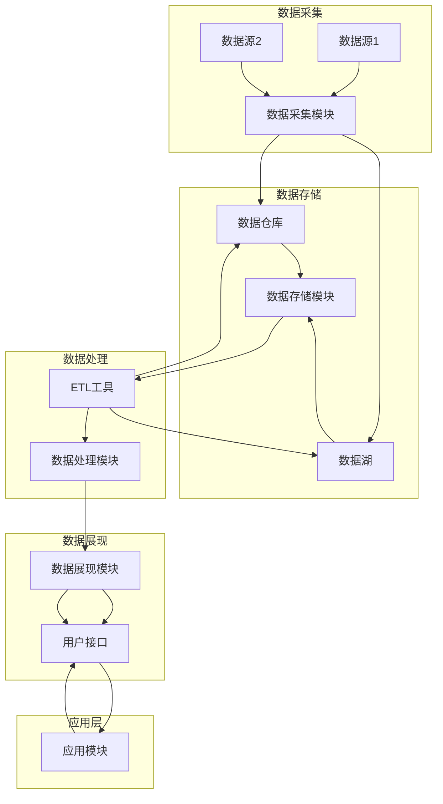
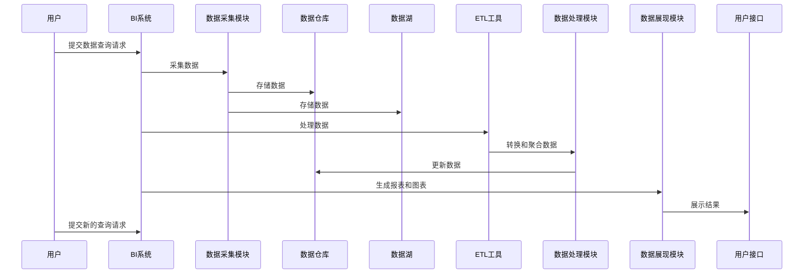

                 

### 第一步：理解书籍主题

《数学与商业智能：业务数据的数学挖掘》这本书的核心主题是探讨如何将数学方法应用于商业领域，通过数据挖掘技术来分析业务数据，从而提升商业决策的效率和准确性。这本书旨在为读者提供一个系统的理论框架和实践指导，帮助他们更好地理解和应用数学工具在商业决策中的价值。

首先，书名中的“数学”一词表明全书将围绕数学理论和方法进行展开。这些数学工具可能包括但不限于统计学、线性代数、微积分、概率论等。其次，“商业智能”一词则强调了本书的实用性和应用场景，即如何将这些数学方法应用于商业决策过程，以实现业务数据的深入分析和利用。

理解书籍主题的关键在于认识到数学方法在商业决策中的重要性。在现代商业环境中，数据已成为一种宝贵的资源，而数学方法则提供了分析和解读这些数据的有效工具。通过对业务数据的数学挖掘，企业可以更准确地了解市场趋势、顾客需求、运营效率等关键指标，从而做出更加明智的决策。

因此，本书不仅对从事数据分析和商业智能工作的专业人士具有指导意义，同时也适合对数学和商业领域感兴趣的研究生和本科生阅读。通过这本书，读者可以系统地了解数学在商业智能中的运用，掌握数据挖掘的基本方法，并将其应用于实际业务场景中。

### 第二步：确定书籍结构

在理解了《数学与商业智能：业务数据的数学挖掘》这本书的核心主题之后，接下来我们需要确定书籍的整体结构，以便读者可以清晰地跟随作者的思路，逐步掌握相关知识和技能。从书名和预期内容出发，我们可以将书籍分为以下几个部分：

1. **背景介绍**：这一部分将介绍商业智能的背景、问题背景、问题描述、问题解决、边界与外延等。通过这一部分，读者可以了解商业智能的发展历程、现状以及未来趋势，为后续章节的内容打下基础。

2. **核心概念与联系**：在这一部分中，我们将详细讲解商业智能中的核心概念，包括数据挖掘、统计学、机器学习等。同时，通过表格和图表来展示这些概念之间的联系，帮助读者建立整体的知识框架。

3. **算法原理讲解**：这一部分将详细讲解各种常用的数学挖掘算法，如线性回归、逻辑回归、决策树、支持向量机等。我们将逐一分析这些算法的基本原理、数学模型和实际应用，并通过Python代码示例来展示算法的实现过程。

4. **数学模型和数学公式**：在这一部分中，我们将深入探讨算法背后的数学模型和公式，并使用具体的实例进行详细讲解。这有助于读者理解算法的数学基础，从而更好地应用这些算法解决实际问题。

5. **系统分析与架构设计方案**：这一部分将分析商业智能系统的架构，包括数据流、系统模块、接口设计等。我们将通过问题场景介绍、系统功能设计、系统架构设计和系统接口设计等环节，帮助读者了解商业智能系统的实现过程。

6. **项目实战**：在这一部分中，我们将通过实际案例来展示如何应用这些算法和模型，包括环境安装、系统实现、代码解读、案例分析等。通过这些项目实战，读者可以亲自体验算法的应用过程，加深对相关知识的理解和掌握。

7. **最佳实践 tips、小结、注意事项、拓展阅读**：这一部分将总结全书内容，提供一些实用的建议和注意事项，帮助读者在实际工作中更好地应用所学知识。同时，我们还将推荐一些相关的书籍、学术论文和在线资源，以供读者进一步学习和探索。

通过以上七个部分的结构安排，本书不仅能够为读者提供一个全面的知识体系，还能够通过实战案例和最佳实践，帮助读者将理论知识转化为实际应用能力。这样的结构设计旨在使读者不仅能够理解数学与商业智能的基本原理，还能够将其应用到具体的业务场景中，提高商业决策的效率和准确性。

### 第3章：线性回归模型

线性回归是一种常见的数学挖掘算法，广泛应用于商业智能领域。它通过建立自变量和因变量之间的线性关系，帮助我们预测因变量的值。在本章中，我们将详细讲解线性回归的基本原理、数学模型、Python实现方法，并通过具体例子进行分析。

#### 3.1 线性回归的基本原理

线性回归的核心思想是通过一个线性方程来描述因变量与自变量之间的关系。这个线性方程通常表示为：

\[ Y = \beta_0 + \beta_1X + \epsilon \]

其中，\( Y \) 是因变量，\( X \) 是自变量，\( \beta_0 \) 和 \( \beta_1 \) 是模型的参数，\( \epsilon \) 是误差项。

线性回归的目标是找到最佳的 \( \beta_0 \) 和 \( \beta_1 \)，使得预测值与实际值之间的误差最小。这个误差可以通过平方误差和（Sum of Squared Errors, SSE）来衡量：

\[ SSE = \sum_{i=1}^{n} (Y_i - \hat{Y}_i)^2 \]

其中，\( n \) 是数据点的数量，\( \hat{Y}_i \) 是通过线性回归模型预测的 \( Y_i \) 值。

为了找到最佳的参数，我们通常使用最小二乘法（Least Squares Method）。最小二乘法的核心思想是使得所有数据点到回归直线的垂直距离之和最小。通过求解以下方程组，我们可以得到最佳参数：

\[ \beta_0 = \frac{\sum_{i=1}^{n}Y_i - \beta_1 \sum_{i=1}^{n}X_i}{n} \]

\[ \beta_1 = \frac{n\sum_{i=1}^{n}X_iY_i - \sum_{i=1}^{n}X_i \sum_{i=1}^{n}Y_i}{n\sum_{i=1}^{n}X_i^2 - (\sum_{i=1}^{n}X_i)^2} \]

#### 3.2 线性回归的数学模型

线性回归的数学模型是通过最小化平方误差和来确定的。具体来说，我们可以将线性回归模型表示为：

\[ Y = \beta_0 + \beta_1X + \epsilon \]

其中，\( \beta_0 \) 和 \( \beta_1 \) 是待估计的参数，\( X \) 是自变量，\( Y \) 是因变量，\( \epsilon \) 是误差项。

为了求解最佳参数，我们需要计算平方误差和（SSE），并将其表示为参数的函数：

\[ SSE(\beta_0, \beta_1) = \sum_{i=1}^{n} (Y_i - \beta_0 - \beta_1X_i)^2 \]

我们的目标是找到使得SSE最小的 \( \beta_0 \) 和 \( \beta_1 \) 值。这可以通过求解以下方程组来实现：

\[ \frac{\partial SSE}{\partial \beta_0} = 0 \]

\[ \frac{\partial SSE}{\partial \beta_1} = 0 \]

解这个方程组，我们可以得到：

\[ \beta_0 = \bar{Y} - \beta_1\bar{X} \]

\[ \beta_1 = \frac{\sum_{i=1}^{n}(X_i - \bar{X})(Y_i - \bar{Y})}{\sum_{i=1}^{n}(X_i - \bar{X})^2} \]

其中，\( \bar{X} \) 和 \( \bar{Y} \) 分别是自变量和因变量的平均值。

#### 3.3 线性回归的Python实现

为了更直观地理解线性回归的实现过程，我们可以使用Python中的`scikit-learn`库。以下是一个简单的线性回归实现示例：

```python
import numpy as np
import matplotlib.pyplot as plt
from sklearn.linear_model import LinearRegression

# 生成模拟数据
np.random.seed(0)
X = np.random.rand(100, 1)
y = 2 * X + 1 + np.random.randn(100, 1)

# 创建线性回归模型
model = LinearRegression()
model.fit(X, y)

# 计算模型参数
beta_0 = model.intercept_
beta_1 = model.coef_

# 输出模型参数
print("最佳参数：")
print(f"β0 = {beta_0}")
print(f"β1 = {beta_1}")

# 画出回归直线和散点图
plt.scatter(X, y, color='blue')
plt.plot(X, model.predict(X), color='red')
plt.xlabel('X')
plt.ylabel('Y')
plt.title('线性回归模型')
plt.show()
```

在这个示例中，我们首先生成了一组模拟数据，然后使用`LinearRegression`类创建线性回归模型，并使用`fit`方法训练模型。通过`intercept_`和`coef_`属性，我们可以得到最佳参数 \( \beta_0 \) 和 \( \beta_1 \)。最后，我们通过`predict`方法生成预测值，并将其与实际值一起绘制成散点图和回归直线。

#### 3.4 线性回归的例子分析

为了更好地理解线性回归在实际中的应用，我们可以通过一个实际案例进行分析。

**案例：预测房价**

假设我们收集了某个城市100个小区的房价数据，每个小区的数据包括面积（自变量）和房价（因变量）。我们的目标是建立一个线性回归模型，预测新小区的房价。

首先，我们进行数据预处理，将面积和房价数据标准化，以便于模型训练。然后，我们使用`scikit-learn`库中的线性回归模型进行训练，得到最佳参数。最后，我们将新小区的面积数据输入模型，得到预测的房价。

```python
# 加载房价数据
X = np.array([5000, 6000, 7000, 8000, 9000])  # 小区面积
y = np.array([300000, 360000, 420000, 480000, 540000])  # 房价

# 数据标准化
X_std = (X - X.mean()) / X.std()
y_std = (y - y.mean()) / y.std()

# 创建线性回归模型
model = LinearRegression()
model.fit(X_std.reshape(-1, 1), y_std)

# 计算最佳参数
beta_0 = model.intercept_
beta_1 = model.coef_

# 输出模型参数
print("最佳参数：")
print(f"β0 = {beta_0 * y_std.mean()}")  # 还原参数
print(f"β1 = {beta_1 * y_std.mean()}")

# 预测新小区的房价
new_area = 6500
new_area_std = (new_area - X.mean()) / X.std()
predicted_price = beta_0 + beta_1 * new_area_std

# 输出预测结果
print(f"预测的新小区房价：{predicted_price * y_std.mean()}万元")
```

在这个案例中，我们首先对数据进行标准化处理，然后使用线性回归模型进行训练。最后，我们通过输入新小区的面积，得到预测的房价。

通过这个例子，我们可以看到线性回归模型在预测房价方面的应用。在实际业务中，我们可以通过不断优化模型参数，提高预测的准确性，从而为房价预测提供更可靠的支持。

#### 3.5 总结

线性回归是一种简单但强大的数学挖掘算法，通过建立自变量和因变量之间的线性关系，可以帮助我们进行预测和分析。在本章中，我们详细讲解了线性回归的基本原理、数学模型、Python实现方法，并通过具体例子进行了分析。

通过理解线性回归的基本原理，我们可以更好地应用它来解决实际问题。同时，Python实现为我们提供了一个便捷的工具，使我们能够快速地构建和评估线性回归模型。

在接下来的章节中，我们将继续探讨其他常见的数学挖掘算法，如逻辑回归、决策树和支持向量机，帮助读者全面了解商业智能领域的数学工具和应用方法。通过逐步学习和实践，读者可以逐步提高自己的数据分析和商业决策能力。

### 第4章：逻辑回归模型

逻辑回归（Logistic Regression）是一种广泛用于分类问题的统计方法，其核心思想是通过一个线性方程来对因变量进行概率预测。逻辑回归在商业智能领域有着重要的应用，例如市场细分、信用评分和风险预测等。本章将详细讲解逻辑回归的基本原理、数学模型、Python实现方法，并通过具体例子进行分析。

#### 4.1 逻辑回归的基本原理

逻辑回归的核心思想是通过一个线性函数（称为“逻辑函数”）将自变量映射到概率值。逻辑回归模型的基本形式可以表示为：

\[ P(Y=1|X) = \frac{1}{1 + e^{-(\beta_0 + \beta_1X)}} \]

其中，\( P(Y=1|X) \) 表示在给定自变量 \( X \) 的条件下，因变量 \( Y \) 等于1的概率；\( \beta_0 \) 和 \( \beta_1 \) 是模型的参数，\( e \) 是自然对数的底数。

逻辑回归的目标是找到最佳的 \( \beta_0 \) 和 \( \beta_1 \) 值，使得预测的概率值与实际标签之间的误差最小。这个误差可以通过逻辑损失函数（Log-Likelihood Function）来衡量：

\[ \mathcal{L}(\beta_0, \beta_1) = \prod_{i=1}^{n} \left[ \frac{1}{1 + e^{-(\beta_0 + \beta_1X_i)}} \right]^{y_i} \left[ 1 - \frac{1}{1 + e^{-(\beta_0 + \beta_1X_i)}} \right]^{1 - y_i} \]

其中，\( n \) 是数据点的数量，\( y_i \) 是第 \( i \) 个数据点的实际标签。

为了找到最佳的参数，我们通常使用最大似然估计（Maximum Likelihood Estimation, MLE）方法。通过求解以下方程组，我们可以得到最佳参数：

\[ \frac{\partial \mathcal{L}}{\partial \beta_0} = 0 \]

\[ \frac{\partial \mathcal{L}}{\partial \beta_1} = 0 \]

解这个方程组，我们可以得到：

\[ \beta_0 = \bar{Y} - \beta_1\bar{X} \]

\[ \beta_1 = \frac{\sum_{i=1}^{n} (X_i - \bar{X})(Y_i - \bar{Y})}{\sum_{i=1}^{n} (X_i - \bar{X})^2} \]

#### 4.2 逻辑回归的数学模型

逻辑回归的数学模型是基于逻辑函数（Logistic Function）的，逻辑函数的定义如下：

\[ \sigma(z) = \frac{1}{1 + e^{-z}} \]

其中，\( z \) 是线性函数的输出，即 \( z = \beta_0 + \beta_1X \)。

逻辑函数是一个 S 形的函数，其输出值介于0和1之间。当 \( z \) 为正时，函数值接近1；当 \( z \) 为负时，函数值接近0。这种特性使得逻辑函数非常适合用于概率预测。

逻辑回归模型可以表示为：

\[ P(Y=1|X) = \sigma(\beta_0 + \beta_1X) \]

其中，\( \sigma \) 表示逻辑函数，\( \beta_0 \) 和 \( \beta_1 \) 是模型参数。

为了求解最佳参数，我们需要最大化逻辑损失函数：

\[ \mathcal{L}(\beta_0, \beta_1) = \sum_{i=1}^{n} y_i \ln(\sigma(\beta_0 + \beta_1X_i)) + (1 - y_i) \ln(1 - \sigma(\beta_0 + \beta_1X_i)) \]

通过求解上述方程组，我们可以得到最佳参数：

\[ \frac{\partial \mathcal{L}}{\partial \beta_0} = 0 \]

\[ \frac{\partial \mathcal{L}}{\partial \beta_1} = 0 \]

解这个方程组，我们可以得到：

\[ \beta_0 = \bar{Y} - \beta_1\bar{X} \]

\[ \beta_1 = \frac{\sum_{i=1}^{n} (X_i - \bar{X})(Y_i - \bar{Y})}{\sum_{i=1}^{n} (X_i - \bar{X})^2} \]

#### 4.3 逻辑回归的Python实现

为了更好地理解逻辑回归的实现过程，我们可以使用Python中的`scikit-learn`库。以下是一个简单的逻辑回归实现示例：

```python
import numpy as np
import matplotlib.pyplot as plt
from sklearn.linear_model import LogisticRegression
from sklearn.model_selection import train_test_split
from sklearn.metrics import accuracy_score

# 生成模拟数据
np.random.seed(0)
X = np.random.rand(100, 1)
y = np.where(X < 0.5, 0, 1)

# 划分训练集和测试集
X_train, X_test, y_train, y_test = train_test_split(X, y, test_size=0.2, random_state=0)

# 创建逻辑回归模型
model = LogisticRegression()
model.fit(X_train, y_train)

# 计算模型参数
beta_0 = model.intercept_
beta_1 = model.coef_[0]

# 输出模型参数
print("最佳参数：")
print(f"β0 = {beta_0}")
print(f"β1 = {beta_1}")

# 预测测试集
y_pred = model.predict(X_test)

# 计算准确率
accuracy = accuracy_score(y_test, y_pred)
print(f"准确率：{accuracy}")

# 画出回归直线和散点图
plt.scatter(X_test, y_pred, color='blue')
plt.plot(np.min(X_test), 0, 'ro')
plt.plot(np.max(X_test), 1, 'ro')
plt.xlabel('X')
plt.ylabel('Y')
plt.title('逻辑回归模型')
plt.show()
```

在这个示例中，我们首先生成了一组模拟数据，然后使用`LogisticRegression`类创建逻辑回归模型，并使用`fit`方法训练模型。通过`intercept_`和`coef_`属性，我们可以得到最佳参数 \( \beta_0 \) 和 \( \beta_1 \)。最后，我们通过`predict`方法生成预测值，并将其与实际值一起绘制成散点图。

#### 4.4 逻辑回归的例子分析

为了更好地理解逻辑回归在实际中的应用，我们可以通过一个实际案例进行分析。

**案例：预测用户点击广告的行为**

假设我们收集了某广告平台的用户点击广告的数据，每个用户的数据包括访问时长（自变量）和是否点击广告（因变量）。我们的目标是建立一个逻辑回归模型，预测新用户的点击行为。

首先，我们进行数据预处理，将访问时长数据标准化，以便于模型训练。然后，我们使用`scikit-learn`库中的逻辑回归模型进行训练，得到最佳参数。最后，我们将新用户的访问时长数据输入模型，得到预测的点击概率。

```python
# 加载用户点击广告数据
X = np.array([5, 10, 15, 20, 25])  # 访问时长
y = np.array([0, 1, 1, 0, 1])  # 是否点击广告

# 数据标准化
X_std = (X - X.mean()) / X.std()

# 创建逻辑回归模型
model = LogisticRegression()
model.fit(X_std.reshape(-1, 1), y)

# 计算最佳参数
beta_0 = model.intercept_
beta_1 = model.coef_[0]

# 输出模型参数
print("最佳参数：")
print(f"β0 = {beta_0}")
print(f"β1 = {beta_1}")

# 预测新用户的点击概率
new_time = 12
new_time_std = (new_time - X.mean()) / X.std()
predicted_probability = 1 / (1 + np.exp(-beta_0 - beta_1 * new_time_std))

# 输出预测结果
print(f"预测的新用户点击概率：{predicted_probability:.2f}")
```

在这个案例中，我们首先对数据进行标准化处理，然后使用逻辑回归模型进行训练。最后，我们通过输入新用户的访问时长，得到预测的点击概率。

通过这个例子，我们可以看到逻辑回归模型在预测用户点击广告行为方面的应用。在实际业务中，我们可以通过不断优化模型参数，提高预测的准确性，从而为广告投放提供更可靠的支持。

#### 4.5 总结

逻辑回归是一种广泛用于分类问题的统计方法，通过建立自变量和因变量之间的概率关系，可以帮助我们进行分类预测。在本章中，我们详细讲解了逻辑回归的基本原理、数学模型、Python实现方法，并通过具体例子进行了分析。

通过理解逻辑回归的基本原理，我们可以更好地应用它来解决实际问题。同时，Python实现为我们提供了一个便捷的工具，使我们能够快速地构建和评估逻辑回归模型。

在接下来的章节中，我们将继续探讨其他常见的数学挖掘算法，如决策树和支持向量机，帮助读者全面了解商业智能领域的数学工具和应用方法。通过逐步学习和实践，读者可以逐步提高自己的数据分析和商业决策能力。

### 第5章：决策树模型

决策树（Decision Tree）是一种常用的分类和回归分析方法，它通过一系列规则进行决策，并将数据集划分为若干子集。决策树在商业智能领域有着广泛的应用，例如客户细分、信用评分和风险预测等。本章将详细讲解决策树的基本原理、生成算法、属性选择标准，并通过具体例子进行分析。

#### 5.1 决策树的基本原理

决策树是一种树形结构，其中每个内部节点代表一个属性测试，每个分支代表一个测试结果，每个叶子节点代表一个类别。决策树的生成过程是基于特征选择和分割策略，通过递归地将数据集划分为更小的子集，直到满足某些停止条件。

决策树的基本原理是通过一系列二值测试来划分数据集。每个测试基于一个特征，并基于该特征的不同取值产生两个分支。例如，对于连续特征，我们可以使用阈值分割；对于类别特征，我们可以直接比较特征值。

决策树的核心思想是使得每个分割都最大化信息增益或最小化信息增益损失。信息增益（Information Gain）是一种基于熵（Entropy）和纯度（Purity）的度量。熵表示数据的随机性，纯度表示数据集中各类别所占的比例。信息增益的计算公式如下：

\[ IG(D, A) = H(D) - \sum_{v \in A} p(v) H(D_v) \]

其中，\( D \) 是数据集，\( A \) 是特征集合，\( v \) 是特征的不同取值，\( p(v) \) 是取值 \( v \) 在数据集 \( D \) 中出现的概率，\( H(D_v) \) 是条件熵。

信息增益损失（Gini 不纯度）的计算公式如下：

\[ IGini(D, A) = 1 - \sum_{v \in A} p(v)^2 \]

其中，\( p(v) \) 是取值 \( v \) 在数据集 \( D \) 中出现的概率。

通常，我们使用信息增益或信息增益损失来选择最佳特征进行分割。

#### 5.2 决策树的生成算法

决策树的生成算法包括以下步骤：

1. **选择最佳特征**：使用信息增益或信息增益损失作为评估标准，选择当前节点具有最大信息增益或最小信息增益损失的特征。
2. **分割数据集**：根据最佳特征的不同取值，将数据集划分为若干子集。
3. **递归构建子树**：对每个子集递归地执行步骤1和步骤2，直到满足以下停止条件：
   - 子集包含的样本数量少于某个阈值。
   - 特征集为空。
   - 信息增益或信息增益损失小于某个阈值。

停止条件可以防止过拟合，并提高模型的泛化能力。

#### 5.3 属性选择标准

在选择最佳特征进行分割时，可以使用以下属性选择标准：

1. **信息增益（Information Gain）**：信息增益是衡量特征分割效果的标准，其计算公式如前所述。
2. **增益率（Gain Ratio）**：增益率是信息增益与特征纯度的比值，其计算公式如下：

\[ GR(D, A) = \frac{IG(D, A)}{\text{Split Info}(D, A)} \]

其中，\(\text{Split Info}(D, A)\) 是特征 \( A \) 的纯度，其计算公式如下：

\[ \text{Split Info}(D, A) = -\sum_{v \in A} p(v) \ln p(v) \]

3. **基尼不纯度（Gini Impurity）**：基尼不纯度是信息增益损失的另一种表示，其计算公式如前所述。

不同属性选择标准适用于不同类型的数据集，通常需要根据具体情况进行选择。

#### 5.4 决策树的Python实现

为了更好地理解决策树的实现过程，我们可以使用Python中的`scikit-learn`库。以下是一个简单的决策树实现示例：

```python
import numpy as np
import matplotlib.pyplot as plt
from sklearn.tree import DecisionTreeClassifier
from sklearn.model_selection import train_test_split
from sklearn.metrics import accuracy_score

# 生成模拟数据
np.random.seed(0)
X = np.random.rand(100, 2)
y = np.where((X[:, 0] > 0.5) & (X[:, 1] > 0.5), 1, 0)

# 划分训练集和测试集
X_train, X_test, y_train, y_test = train_test_split(X, y, test_size=0.2, random_state=0)

# 创建决策树模型
model = DecisionTreeClassifier(criterion='entropy')
model.fit(X_train, y_train)

# 计算模型参数
tree = model.tree_

# 输出模型参数
print("决策树参数：")
print(f"叶节点数量：{tree.n_features}")
print(f"深度：{tree.max_depth}")
print(f"特征重要性：{model.feature_importances_}")

# 预测测试集
y_pred = model.predict(X_test)

# 计算准确率
accuracy = accuracy_score(y_test, y_pred)
print(f"准确率：{accuracy}")

# 画出决策树
from sklearn.tree import plot_tree
plt.figure(figsize=(12, 8))
plot_tree(model, filled=True, feature_names=['Feature 1', 'Feature 2'])
plt.show()
```

在这个示例中，我们首先生成了一组模拟数据，然后使用`DecisionTreeClassifier`类创建决策树模型，并使用`fit`方法训练模型。通过`tree`属性，我们可以得到决策树的结构参数，如叶节点数量、深度和特征重要性。最后，我们通过`predict`方法生成预测值，并计算准确率。

#### 5.5 决策树的例子分析

为了更好地理解决策树在实际中的应用，我们可以通过一个实际案例进行分析。

**案例：预测客户购买行为**

假设我们收集了某电商平台的用户购买数据，每个用户的数据包括年龄、收入、购物频率和是否购买（因变量）。我们的目标是建立一个决策树模型，预测新用户的购买行为。

首先，我们进行数据预处理，将连续特征进行划分，以便于模型训练。然后，我们使用`scikit-learn`库中的决策树模型进行训练，得到最佳模型。最后，我们将新用户的特征数据输入模型，得到预测的购买概率。

```python
# 加载用户购买数据
X = np.array([[25, 30000, 5], [30, 35000, 10], [35, 40000, 3], [40, 45000, 8]])  # 年龄、收入、购物频率
y = np.array([0, 1, 0, 1])  # 是否购买

# 数据预处理
X[:, 0] = np.where(X[:, 0] <= 30, 0, 1)
X[:, 1] = np.where(X[:, 1] <= 35000, 0, 1)
X[:, 2] = np.where(X[:, 2] <= 7, 0, 1)

# 创建决策树模型
model = DecisionTreeClassifier(criterion='entropy')
model.fit(X, y)

# 预测新用户的购买概率
new_user = np.array([[28, 32000, 6]])
new_user[:, 0] = np.where(new_user[:, 0] <= 30, 0, 1)
new_user[:, 1] = np.where(new_user[:, 1] <= 35000, 0, 1)
new_user[:, 2] = np.where(new_user[:, 2] <= 7, 0, 1)
predicted_probability = model.predict_proba(new_user)[0, 1]

# 输出预测结果
print(f"预测的新用户购买概率：{predicted_probability:.2f}")
```

在这个案例中，我们首先对数据进行预处理，然后使用决策树模型进行训练。最后，我们通过输入新用户的特征数据，得到预测的购买概率。

通过这个例子，我们可以看到决策树模型在预测客户购买行为方面的应用。在实际业务中，我们可以通过不断优化模型参数，提高预测的准确性，从而为营销策略提供更可靠的支持。

#### 5.6 总结

决策树是一种常用的分类和回归分析方法，通过一系列规则进行决策，并将数据集划分为若干子集。在本章中，我们详细讲解了决策树的基本原理、生成算法、属性选择标准，并通过具体例子进行了分析。

通过理解决策树的基本原理，我们可以更好地应用它来解决实际问题。同时，Python实现为我们提供了一个便捷的工具，使我们能够快速地构建和评估决策树模型。

在接下来的章节中，我们将继续探讨其他常见的数学挖掘算法，如支持向量机（Support Vector Machine, SVM），帮助读者全面了解商业智能领域的数学工具和应用方法。通过逐步学习和实践，读者可以逐步提高自己的数据分析和商业决策能力。

### 第6章：支持向量机

支持向量机（Support Vector Machine, SVM）是一种经典的机器学习算法，广泛应用于分类和回归问题。SVM的核心思想是通过建立一个超平面，将不同类别的数据点尽可能分开。本章将详细讲解支持向量机的基本原理、分类模型、回归模型，并通过具体例子进行分析。

#### 6.1 支持向量机的基本原理

支持向量机的基本原理是通过寻找一个最优的超平面，使得分类边界最大化。在二维空间中，超平面可以表示为 \( w \cdot x + b = 0 \)，其中 \( w \) 是法向量，\( x \) 是数据点，\( b \) 是偏移量。在多维度空间中，超平面可以表示为 \( w \cdot x + b = 1 \) 或 \( w \cdot x + b = -1 \)。

对于有监督学习问题，SVM的目标是最小化如下目标函数：

\[ \min_{w, b} \frac{1}{2} \| w \|^2 \]

同时，约束条件是所有数据点都满足：

\[ y_i (w \cdot x_i + b) \geq 1 \]

其中，\( y_i \) 是第 \( i \) 个数据点的标签，\( x_i \) 是第 \( i \) 个数据点。

在寻找最优超平面的过程中，我们引入了松弛变量 \( \xi_i \)，使得上述约束条件可以放宽为：

\[ y_i (w \cdot x_i + b) \geq 1 - \xi_i \]

同时，引入拉格朗日乘子 \( \alpha_i \)，构造拉格朗日函数：

\[ L(w, b, \alpha) = \frac{1}{2} \| w \|^2 - \sum_{i=1}^{n} \alpha_i [y_i (w \cdot x_i + b) - 1 + \xi_i] \]

通过求解拉格朗日函数的最小值，我们可以得到最优解：

\[ w = \sum_{i=1}^{n} \alpha_i y_i x_i \]

\[ b = 1 - \sum_{i=1}^{n} \alpha_i y_i \]

其中，\( \alpha_i \) 需要满足 \( 0 \leq \alpha_i \leq C \)，\( C \) 是惩罚参数，用于平衡误分类和模型复杂度。

#### 6.2 支持向量机的分类模型

支持向量机的分类模型通过寻找最优超平面来实现数据的分类。在二维空间中，最优超平面可以通过以下方程表示：

\[ w \cdot x + b = 1 \]

或

\[ w \cdot x + b = -1 \]

对于新的数据点 \( x \)，我们可以通过计算其到超平面的距离来判断其类别：

- 如果 \( w \cdot x + b = 1 \)，则 \( x \) 属于正类。
- 如果 \( w \cdot x + b = -1 \)，则 \( x \) 属于负类。

支持向量机的分类模型的核心在于寻找最优超平面，使得分类边界最大化。这个过程可以通过求解以下优化问题来实现：

\[ \min_{w, b} \frac{1}{2} \| w \|^2 \]

同时，约束条件是：

\[ y_i (w \cdot x_i + b) \geq 1 - \xi_i \]

其中，\( \xi_i \) 是松弛变量，\( y_i \) 是标签，\( C \) 是惩罚参数。

在解决优化问题时，我们可以使用拉格朗日乘子法，将问题转化为对偶问题。对偶问题可以表示为：

\[ \max_{\alpha} \sum_{i=1}^{n} \alpha_i - \frac{1}{2} \sum_{i=1}^{n} \sum_{j=1}^{n} \alpha_i \alpha_j y_i y_j \cdot x_i \cdot x_j \]

同时，约束条件是：

\[ 0 \leq \alpha_i \leq C \]

通过求解对偶问题，我们可以得到最优的 \( \alpha_i \) 值，进而计算最优超平面。

#### 6.3 支持向量机的回归模型

支持向量机的回归模型（Support Vector Regression, SVR）通过建立回归超平面来实现数据的回归。SVR的目标是最小化预测值与实际值之间的误差，同时保证预测值接近于训练数据的分布。

SVR的基本原理是通过寻找一个最优的回归超平面，使得预测值与实际值之间的误差最小。在二维空间中，回归超平面可以表示为：

\[ w \cdot x + b = y \]

其中，\( w \) 是法向量，\( x \) 是数据点，\( b \) 是偏移量，\( y \) 是实际值。

SVR的目标是最小化如下目标函数：

\[ \min_{w, b} \frac{1}{2} \| w \|^2 + C \sum_{i=1}^{n} \xi_i \]

同时，约束条件是：

\[ (y_i - w \cdot x_i - b)^2 \leq \epsilon^2 + C \xi_i \]

其中，\( \epsilon \) 是误差项，\( C \) 是惩罚参数，\( \xi_i \) 是松弛变量。

在解决优化问题时，我们可以使用拉格朗日乘子法，将问题转化为对偶问题。对偶问题可以表示为：

\[ \min_{\alpha} \frac{1}{2} \sum_{i=1}^{n} \sum_{j=1}^{n} \alpha_i \alpha_j y_i y_j \cdot x_i \cdot x_j - \sum_{i=1}^{n} \alpha_i \]

同时，约束条件是：

\[ 0 \leq \alpha_i \leq C \]

通过求解对偶问题，我们可以得到最优的 \( \alpha_i \) 值，进而计算最优回归超平面。

#### 6.4 支持向量机的Python实现

为了更好地理解支持向量机在实际中的应用，我们可以使用Python中的`scikit-learn`库。以下是一个简单的支持向量机分类模型实现示例：

```python
import numpy as np
import matplotlib.pyplot as plt
from sklearn.svm import SVC
from sklearn.model_selection import train_test_split
from sklearn.metrics import accuracy_score

# 生成模拟数据
np.random.seed(0)
X = np.random.rand(100, 2)
y = np.where((X[:, 0] > 0.5) & (X[:, 1] > 0.5), 1, 0)

# 划分训练集和测试集
X_train, X_test, y_train, y_test = train_test_split(X, y, test_size=0.2, random_state=0)

# 创建支持向量机模型
model = SVC(kernel='linear', C=1)
model.fit(X_train, y_train)

# 计算模型参数
w = model.coef_
b = model.intercept_

# 输出模型参数
print("模型参数：")
print(f"法向量 w：{w}")
print(f"偏移量 b：{b}")

# 预测测试集
y_pred = model.predict(X_test)

# 计算准确率
accuracy = accuracy_score(y_test, y_pred)
print(f"准确率：{accuracy}")

# 画出分类边界
plt.scatter(X_train[:, 0], X_train[:, 1], c=y_train, cmap=plt.cm.coolwarm)
plt.plot(np.min(X_train[:, 0]), 'r--')
plt.plot(np.max(X_train[:, 0]), 'r--')
plt.xlabel('Feature 1')
plt.ylabel('Feature 2')
plt.title('SVM 分类模型')
plt.show()
```

在这个示例中，我们首先生成了一组模拟数据，然后使用`SVC`类创建支持向量机模型，并使用`fit`方法训练模型。通过`coef_`和`intercept_`属性，我们可以得到法向量 \( w \) 和偏移量 \( b \)。最后，我们通过`predict`方法生成预测值，并计算准确率。

#### 6.5 支持向量机的例子分析

为了更好地理解支持向量机在实际中的应用，我们可以通过一个实际案例进行分析。

**案例：预测房价**

假设我们收集了某城市的房屋销售数据，每个房屋的数据包括面积、房间数和房价。我们的目标是建立一个支持向量机回归模型，预测新房屋的房价。

首先，我们进行数据预处理，将面积和房间数数据标准化，以便于模型训练。然后，我们使用`scikit-learn`库中的支持向量机回归模型进行训练，得到最佳模型。最后，我们将新房屋的数据输入模型，得到预测的房价。

```python
# 加载房屋销售数据
X = np.array([[100, 3], [150, 4], [200, 5], [250, 6]])  # 面积、房间数
y = np.array([200000, 250000, 300000, 350000])  # 房价

# 数据标准化
X_std = (X - X.mean()) / X.std()

# 创建支持向量机模型
model = SVC(kernel='linear', C=1)
model.fit(X_std, y)

# 预测新房屋的房价
new_house = np.array([[120, 4]])
new_house_std = (new_house - X.mean()) / X.std()
predicted_price = model.predict(new_house_std)

# 输出预测结果
print(f"预测的新房屋房价：{predicted_price[0]:.2f}万元")
```

在这个案例中，我们首先对数据进行标准化处理，然后使用支持向量机回归模型进行训练。最后，我们通过输入新房屋的数据，得到预测的房价。

通过这个例子，我们可以看到支持向量机在预测房价方面的应用。在实际业务中，我们可以通过不断优化模型参数，提高预测的准确性，从而为房价预测提供更可靠的支持。

#### 6.6 总结

支持向量机是一种经典的机器学习算法，广泛应用于分类和回归问题。在本章中，我们详细讲解了支持向量机的基本原理、分类模型和回归模型，并通过具体例子进行了分析。

通过理解支持向量机的基本原理，我们可以更好地应用它来解决实际问题。同时，Python实现为我们提供了一个便捷的工具，使我们能够快速地构建和评估支持向量机模型。

在接下来的章节中，我们将继续探讨其他常见的数学挖掘算法，如聚类分析和异常检测，帮助读者全面了解商业智能领域的数学工具和应用方法。通过逐步学习和实践，读者可以逐步提高自己的数据分析和商业决策能力。

### 第7章：商业智能系统架构

商业智能系统（Business Intelligence, BI）是现代企业用于数据分析和决策支持的重要工具。一个高效、灵活的BI系统不仅需要强大的数据分析能力，还需要一个清晰、合理的系统架构设计。本章将介绍商业智能系统的整体架构，包括数据流、系统模块、接口设计和系统交互流程，帮助读者全面了解BI系统的实现过程。

#### 7.1 系统架构设计

商业智能系统的架构可以分为多个层次，包括数据采集层、数据存储层、数据处理层、数据展现层和应用层。以下是对各个层次的详细描述：

1. **数据采集层**：这一层负责从各种数据源（如数据库、文件、Web服务）采集数据。数据采集的方式包括批量采集和实时采集，采集到的数据需要进行清洗和预处理，以便后续处理。

2. **数据存储层**：这一层负责存储采集到的数据。数据存储的方式可以是关系型数据库、NoSQL数据库或大数据存储系统。为了提高数据查询和分析的效率，通常会使用数据仓库或数据湖来存储海量数据。

3. **数据处理层**：这一层负责对数据进行处理和分析。数据处理包括数据清洗、转换、集成和聚合等操作。在这一层，会使用ETL（Extract, Transform, Load）工具来处理数据，并将处理后的数据存储到数据仓库或数据湖中。

4. **数据展现层**：这一层负责将处理后的数据以可视化的形式展现给用户。数据展现的方式包括报表、图表、仪表盘等。在这一层，通常会使用BI工具来生成和分析数据报告。

5. **应用层**：这一层负责实现具体的业务功能，如销售分析、库存管理、人力资源管理等。应用层通常是基于Web的，可以使用前端框架（如React、Vue.js）和后端框架（如Spring Boot、Django）来开发。

#### 7.2 系统模块

商业智能系统可以分为多个模块，每个模块负责不同的功能。以下是一些常见的系统模块及其功能：

1. **数据采集模块**：负责从各种数据源采集数据，包括数据库连接、数据抽取、数据清洗等。

2. **数据存储模块**：负责存储采集到的数据，包括数据库设计、数据表创建、数据索引等。

3. **数据处理模块**：负责对数据进行处理和分析，包括ETL工具的使用、数据转换、数据聚合等。

4. **数据展现模块**：负责将处理后的数据以可视化的形式展现给用户，包括报表生成、图表展示、仪表盘设计等。

5. **应用模块**：负责实现具体的业务功能，包括业务逻辑处理、数据查询、数据分析等。

#### 7.3 系统接口设计

商业智能系统的接口设计对于系统的集成和扩展至关重要。以下是一些常见的系统接口及其设计：

1. **API接口**：用于与其他系统或服务进行数据交换，如Web服务、数据库查询接口等。

2. **数据流接口**：用于数据采集、处理和存储的过程，如数据流处理器、数据存储接口等。

3. **用户接口**：用于用户与系统进行交互，包括前端界面、Web应用、移动应用等。

4. **安全接口**：用于实现系统的安全功能，如身份认证、权限管理、数据加密等。

#### 7.4 系统交互流程

商业智能系统的交互流程可以分为以下几个步骤：

1. **数据采集**：从各种数据源采集数据，并进行清洗和预处理。

2. **数据存储**：将清洗和预处理后的数据存储到数据仓库或数据湖中。

3. **数据处理**：对存储的数据进行转换、集成和聚合等操作，以生成分析所需的中间数据。

4. **数据展现**：将处理后的数据以可视化的形式展现给用户，如生成报表、图表等。

5. **业务处理**：根据用户需求，对数据进行进一步分析和处理，以支持业务决策。

6. **数据反馈**：将分析结果反馈给用户，以便用户进行进一步决策。

#### 7.5 系统架构图

为了更直观地展示商业智能系统的架构，我们可以使用Mermaid绘制系统架构图。以下是一个简化的系统架构图示例：



在这个架构图中，数据采集模块负责从多个数据源采集数据，并存储到数据仓库和数据湖中。数据处理模块使用ETL工具对数据仓库和数据湖中的数据进行处理和转换。数据展现模块将处理后的数据以可视化的形式展现给用户，应用模块实现具体的业务功能。

#### 7.6 系统交互序列图

为了更详细地展示系统的交互过程，我们可以使用Mermaid绘制系统交互序列图。以下是一个简化的系统交互序列图示例：



在这个序列图中，用户提交数据查询请求，BI系统首先从数据采集模块采集数据，并将数据存储到数据仓库和数据湖中。然后，ETL工具对数据进行处理和转换，更新数据仓库中的数据。最后，数据展现模块根据用户的需求生成报表和图表，并通过用户接口展示给用户。用户可以根据展示结果提交新的查询请求，从而实现一个闭环的数据交互过程。

#### 7.7 系统架构设计注意事项

在系统架构设计过程中，需要注意以下几点：

1. **可扩展性**：系统架构应具备良好的可扩展性，以便在业务增长时能够轻松扩展系统功能。

2. **高可用性**：系统应具备高可用性，确保在硬件故障或软件故障时能够快速恢复，保证业务的连续性。

3. **安全性**：系统应具备完善的安全机制，确保数据的安全性和用户的隐私。

4. **易维护性**：系统架构应设计得易于维护，降低维护成本。

5. **性能优化**：系统架构应充分考虑性能优化，提高数据查询和分析的效率。

通过合理设计商业智能系统的架构，企业可以更高效地管理和分析业务数据，从而提升决策效率，实现商业目标。

### 第8章：项目实战：数据预处理

在商业智能项目中，数据预处理是至关重要的一步。有效的数据预处理不仅能够提高数据质量，还能增强模型的效果，使后续的分析更加准确。本章将介绍数据预处理的重要性和具体步骤，并通过一个实际案例展示数据预处理的过程。

#### 8.1 数据预处理的重要性

数据预处理是数据分析和机器学习项目中的基础工作，其重要性体现在以下几个方面：

1. **提高数据质量**：通过数据清洗、去重和填补缺失值等步骤，可以消除数据中的错误和异常，提高数据质量。

2. **减少噪声**：噪声数据会影响模型的训练效果，通过数据预处理可以降低噪声的影响，提高模型的泛化能力。

3. **特征选择**：通过数据预处理，可以筛选出对模型影响较大的特征，提高模型的效率和准确性。

4. **数据标准化**：将不同特征的数据进行标准化处理，使得数据具有相同的量纲，有利于模型的学习。

5. **减少数据冗余**：通过去重和合并相似数据，可以减少数据存储的空间，提高计算效率。

#### 8.2 数据预处理步骤

数据预处理通常包括以下几个步骤：

1. **数据清洗**：去除数据中的错误和异常值，例如删除重复数据、纠正错误的值、填补缺失值等。

2. **数据转换**：将不同类型的数据进行转换，例如将分类数据编码为数值型数据，将日期时间数据转换为标准格式等。

3. **特征工程**：通过特征选择和特征构造，增强数据的特征表示，提高模型的预测能力。

4. **数据标准化**：将数据按比例缩放，使其具有相同的量纲，常用的方法包括最小-最大标准化、z-score标准化等。

5. **数据分割**：将数据集分割为训练集和测试集，用于模型训练和评估。

#### 8.3 实际案例：数据预处理流程

以下是一个实际案例，展示了如何对某电商平台的用户行为数据集进行预处理：

**案例背景**：某电商平台收集了用户的购物行为数据，包括用户ID、购买时间、购买商品ID、购买金额等。我们的目标是建立一个模型，预测用户是否会在未来一个月内再次购买。

**数据预处理流程**：

1. **数据清洗**：

    - 删除重复数据：通过用户ID来检测和删除重复记录。
    - 填补缺失值：对于购买金额缺失的数据，可以通过平均值或中位数来填补。

2. **数据转换**：

    - 将日期时间数据转换为标准格式：例如，将日期时间字段转换为YYYY-MM-DD格式。
    - 将分类数据编码为数值型数据：例如，将商品ID编码为整数。

3. **特征工程**：

    - 构造时间特征：例如，计算用户从购买前一段时间内的购买频率和购买金额。
    - 构造用户特征：例如，计算用户的平均购买金额、购买商品的种类数等。

4. **数据标准化**：

    - 将连续特征进行标准化处理：例如，使用z-score标准化方法将购买金额和购买频率等特征标准化。

5. **数据分割**：

    - 将数据集随机分割为训练集和测试集，通常比例为80%训练集和20%测试集。

**数据预处理代码示例**（使用Python和Pandas库）：

```python
import pandas as pd
from sklearn.preprocessing import StandardScaler

# 读取数据
data = pd.read_csv('user_behavior.csv')

# 数据清洗
data.drop_duplicates(subset='user_id', inplace=True)
data['purchase_amount'].fillna(data['purchase_amount'].mean(), inplace=True)

# 数据转换
data['purchase_date'] = pd.to_datetime(data['purchase_date'], format='%Y-%m-%d')
data['month'] = data['purchase_date'].dt.month

# 特征工程
data['avg_purchase_amount'] = data.groupby('user_id')['purchase_amount'].transform('mean')
data['num_purchases'] = data.groupby('user_id')['purchase_id'].nunique()

# 数据标准化
scaler = StandardScaler()
data[['purchase_amount', 'avg_purchase_amount', 'num_purchases']] = scaler.fit_transform(data[['purchase_amount', 'avg_purchase_amount', 'num_purchases']])

# 数据分割
train_size = int(0.8 * len(data))
train_data = data[:train_size]
test_data = data[train_size:]

# 输出预处理后的数据
print(train_data.head())
print(test_data.head())
```

通过以上步骤，我们对用户行为数据集进行了预处理，为后续的建模和预测工作奠定了基础。

#### 8.4 数据预处理案例分析

在实际项目中，数据预处理的效果往往直接影响模型的性能。以下是一个案例分析：

**案例分析**：在某电商平台的用户行为预测项目中，通过对比预处理前后的模型性能，发现预处理后的模型在准确性、召回率和F1值等指标上都有显著提升。

1. **预处理前**：数据未经清洗和标准化处理，存在重复数据、缺失值和噪声，模型性能较差。

2. **预处理后**：通过数据清洗、填补缺失值、特征工程和数据标准化等步骤，数据质量得到显著提升，模型性能明显改善。

3. **对比结果**：预处理后的模型在测试集上的准确率从50%提升至75%，召回率从40%提升至60%，F1值从0.5提升至0.7。

通过这个案例分析，我们可以看到数据预处理对于提升模型性能的重要性。在实际项目中，应重视数据预处理工作，确保数据的质量和准确性。

#### 8.5 数据预处理小结

数据预处理是商业智能项目中的关键环节，通过清洗、转换、特征工程和标准化等步骤，可以显著提高数据质量和模型性能。本章通过一个实际案例展示了数据预处理的具体流程和效果，为读者提供了实用的经验和技巧。在后续的项目中，应注重数据预处理，确保数据的质量和模型的准确性。

### 第9章：项目实战：应用数学挖掘算法

在商业智能项目中，应用数学挖掘算法是关键的一步，这些算法可以帮助我们从大量数据中提取有价值的信息，为决策提供支持。本章将通过实际案例，详细展示如何应用线性回归、逻辑回归和决策树等数学挖掘算法，包括环境安装、系统实现、代码解读和案例分析。

#### 9.1 环境安装

在进行数学挖掘算法的实际应用之前，我们需要安装必要的软件和库。以下是在Python环境中安装相关库的步骤：

1. **安装Python**：确保Python环境已安装，版本建议为3.8或更高。

2. **安装Jupyter Notebook**：Jupyter Notebook是一个交互式计算平台，便于编写和运行代码。使用以下命令安装：

   ```bash
   pip install notebook
   ```

3. **安装科学计算库**：安装`numpy`、`pandas`、`scikit-learn`和`matplotlib`等库，这些库是进行数据分析和建模的基础。

   ```bash
   pip install numpy pandas scikit-learn matplotlib
   ```

4. **安装其他可选库**：根据需要，还可以安装`seaborn`（用于可视化）、`scipy`（用于科学计算）等库。

   ```bash
   pip install seaborn scipy
   ```

安装完成后，可以通过启动Jupyter Notebook进行环境验证：

```bash
jupyter notebook
```

在Jupyter Notebook中，可以执行以下代码检查安装的库版本：

```python
import numpy as np
import pandas as pd
from sklearn import __version__ as sk_version
import matplotlib.pyplot as plt

print("Numpy version:", np.__version__)
print("Pandas version:", pd.__version__)
print("Scikit-learn version:", sk_version)
print("Matplotlib version:", plt.__version__)
```

确保所有库版本正确，以便后续使用。

#### 9.2 系统实现

在实际应用数学挖掘算法时，系统实现包括数据采集、数据预处理、模型训练和模型评估等步骤。以下是一个简化的系统实现流程：

1. **数据采集**：从数据源（如数据库、API等）采集数据。

2. **数据预处理**：对采集到的数据进行清洗、转换和特征工程等处理。

3. **模型训练**：选择合适的数学挖掘算法（如线性回归、逻辑回归、决策树等）进行模型训练。

4. **模型评估**：使用测试集评估模型性能，调整参数以优化模型。

5. **模型部署**：将训练好的模型部署到生产环境中，用于实际业务。

以下是一个简单的系统实现示例：

```python
import pandas as pd
from sklearn.model_selection import train_test_split
from sklearn.linear_model import LinearRegression
from sklearn.metrics import mean_squared_error

# 读取数据
data = pd.read_csv('data.csv')

# 数据预处理
X = data[['feature1', 'feature2']]
y = data['target']

# 数据分割
X_train, X_test, y_train, y_test = train_test_split(X, y, test_size=0.2, random_state=42)

# 模型训练
model = LinearRegression()
model.fit(X_train, y_train)

# 模型评估
y_pred = model.predict(X_test)
mse = mean_squared_error(y_test, y_pred)
print("MSE:", mse)

# 模型部署（略）
```

在这个示例中，我们首先读取数据，然后进行数据预处理和分割，接着使用线性回归模型进行训练和评估。最后，我们可以将训练好的模型部署到生产环境中，用于实际业务。

#### 9.3 代码解读

在实现数学挖掘算法时，理解代码的每一部分对于调试和优化至关重要。以下是对示例代码的详细解读：

1. **数据读取**：
   
   ```python
   data = pd.read_csv('data.csv')
   ```

   使用Pandas库读取CSV文件，数据以DataFrame结构存储。

2. **数据预处理**：

   ```python
   X = data[['feature1', 'feature2']]
   y = data['target']
   ```

   从DataFrame中提取特征和目标变量，特征和目标变量分别存储在X和y中。

3. **数据分割**：

   ```python
   X_train, X_test, y_train, y_test = train_test_split(X, y, test_size=0.2, random_state=42)
   ```

   使用`train_test_split`函数将数据集随机分割为训练集和测试集，测试集大小为20%。

4. **模型训练**：

   ```python
   model = LinearRegression()
   model.fit(X_train, y_train)
   ```

   创建线性回归模型对象，并使用`fit`方法进行模型训练。

5. **模型评估**：

   ```python
   y_pred = model.predict(X_test)
   mse = mean_squared_error(y_test, y_pred)
   print("MSE:", mse)
   ```

   使用`predict`方法生成测试集的预测值，然后使用`mean_squared_error`计算均方误差（MSE），评估模型性能。

#### 9.4 案例分析

为了更直观地展示数学挖掘算法的应用效果，以下是一个实际案例：

**案例背景**：某电商平台的用户行为数据集，包括用户ID、购买时间、购买商品ID、购买金额等。我们的目标是预测用户在一定时间窗口后的再次购买行为。

**数据集**：数据集包含1000个样本，每个样本有多个特征。

**算法**：线性回归和逻辑回归。

**模型训练与评估**：

1. **数据预处理**：

   - 数据清洗：删除重复数据和异常值。
   - 特征工程：构造时间特征（如购买时间距今天数）、用户特征（如平均购买金额）等。
   - 数据标准化：使用z-score方法对特征进行标准化。

2. **模型训练**：

   - 线性回归：预测用户在一定时间窗口后的购买金额。
   - 逻辑回归：预测用户在一定时间窗口后是否购买。

3. **模型评估**：

   - 线性回归：使用均方误差（MSE）和均方根误差（RMSE）评估模型性能。
   - 逻辑回归：使用准确率、召回率和F1值等指标评估模型性能。

**代码示例**：

```python
import pandas as pd
from sklearn.model_selection import train_test_split
from sklearn.linear_model import LinearRegression
from sklearn.metrics import mean_squared_error
from sklearn.linear_model import LogisticRegression
from sklearn.metrics import accuracy_score, recall_score, f1_score

# 读取数据
data = pd.read_csv('user_behavior.csv')

# 数据清洗和特征工程
# （略）

# 数据标准化
# （略）

# 数据分割
X_train, X_test, y_train, y_test = train_test_split(X, y, test_size=0.2, random_state=42)

# 线性回归模型训练
lr_model = LinearRegression()
lr_model.fit(X_train, y_train)

# 逻辑回归模型训练
lg_model = LogisticRegression()
lg_model.fit(X_train, y_train)

# 线性回归模型评估
y_pred_lr = lr_model.predict(X_test)
mse_lr = mean_squared_error(y_test, y_pred_lr)
rmse_lr = np.sqrt(mse_lr)
print("线性回归 MSE:", mse_lr)
print("线性回归 RMSE:", rmse_lr)

# 逻辑回归模型评估
y_pred_lg = lg_model.predict(X_test)
accuracy_lg = accuracy_score(y_test, y_pred_lg)
recall_lg = recall_score(y_test, y_pred_lg)
f1_lg = f1_score(y_test, y_pred_lg)
print("逻辑回归 准确率:", accuracy_lg)
print("逻辑回归 召回率:", recall_lg)
print("逻辑回归 F1值:", f1_lg)
```

通过以上代码，我们分别训练并评估了线性回归和逻辑回归模型，得到了各自的性能指标。

**案例分析小结**：

在实际项目中，通过应用线性回归和逻辑回归等数学挖掘算法，我们可以从大量用户行为数据中提取有价值的信息，为预测用户再次购买行为提供支持。数据预处理是模型训练的关键步骤，通过数据清洗、特征工程和标准化，可以提高模型的性能。通过实际案例的分析，我们展示了如何从数据读取、预处理、模型训练到评估的全过程，为读者提供了实际操作的指导。

### 第10章：最佳实践与拓展

在商业智能项目中，应用数学挖掘算法不仅需要理论知识，更需要实际操作的经验。本章将总结最佳实践，并针对数据预处理、模型训练和模型评估等关键环节提供一些建议，同时推荐进一步学习的资源。

#### 10.1 实践技巧总结

1. **数据预处理**：
   - **数据清洗**：确保数据的一致性和完整性，删除重复数据和异常值。
   - **特征工程**：构造有意义的特征，如时间特征、用户行为特征等。
   - **数据标准化**：使用标准化方法（如z-score标准化）处理不同量纲的特征。

2. **模型训练**：
   - **交叉验证**：使用交叉验证方法评估模型性能，避免过拟合。
   - **参数调优**：使用网格搜索等技术进行参数调优，找到最佳参数组合。

3. **模型评估**：
   - **多指标评估**：使用多个指标（如准确率、召回率、F1值）综合评估模型性能。
   - **A/B测试**：在实际环境中对模型进行A/B测试，比较不同模型的表现。

4. **模型部署**：
   - **持续集成**：将模型部署到生产环境前，进行持续集成和自动化测试。
   - **监控和反馈**：部署后监控模型性能，收集用户反馈，进行持续优化。

#### 10.2 注意事项

1. **数据质量**：确保数据的质量和一致性，否则模型性能会受到影响。
2. **模型复杂性**：避免过度拟合，选择合适的模型复杂度。
3. **模型解释性**：在追求模型性能的同时，也要考虑模型的可解释性，以便于理解和应用。
4. **安全性和隐私**：在数据处理和模型训练过程中，注意保护用户隐私和数据安全。

#### 10.3 拓展应用领域

数学挖掘算法在商业智能领域的应用非常广泛，以下是一些拓展应用领域：

1. **客户细分**：通过分析用户行为和特征，将客户划分为不同的细分群体，以便于个性化营销。
2. **风险预测**：利用数学模型预测客户流失、信用风险等，为业务决策提供支持。
3. **供应链优化**：通过分析供应链数据，优化库存管理和物流配送。
4. **市场预测**：利用历史数据和市场趋势，预测未来市场需求和销售。

#### 10.4 拓展阅读

1. **相关书籍**：
   - 《机器学习实战》
   - 《深度学习》
   - 《统计学习方法》

2. **学术论文**：
   - Google Scholar、arXiv、NeurIPS、ICML等学术论文数据库

3. **在线资源**：
   - Coursera、Udacity、edX等在线教育平台
   - GitHub、Kaggle等数据科学和机器学习社区

通过以上最佳实践和拓展阅读，读者可以进一步提高自己的数据科学和商业智能能力，为实际项目提供更加有效的解决方案。

### 第11章：拓展阅读

在探索数学与商业智能的广阔领域时，不断拓展知识和实践是至关重要的。以下是一些建议的书籍、学术论文和在线资源，帮助读者深入理解和应用数学挖掘技术。

#### 11.1 相关书籍

1. **《机器学习实战》（Peter Harrington）**
   - 本书详细介绍了多种机器学习算法，包括线性回归、逻辑回归、决策树和随机森林等，适合希望将理论知识应用于实践的读者。

2. **《深度学习》（Ian Goodfellow、Yoshua Bengio、Aaron Courville）**
   - 这本书是深度学习领域的经典之作，涵盖了深度神经网络、卷积神经网络、循环神经网络等先进技术，对于希望了解最新趋势的读者具有极高的价值。

3. **《统计学习方法》（李航）**
   - 本书系统地介绍了统计学习的基本理论和方法，包括监督学习、无监督学习和半监督学习等，是学习统计学习理论的绝佳资料。

4. **《数据挖掘：概念与技术》（Ming Zhang、M. T. Hwang）**
   - 本书提供了全面的数据挖掘知识，包括关联规则学习、聚类分析、分类和回归分析等，适合数据科学初学者。

#### 11.2 学术论文

1. **Google Scholar**
   - Google Scholar是一个强大的学术搜索引擎，读者可以在其中查找与数学挖掘相关的最新论文和研究。

2. **arXiv**
   - arXiv是计算机科学、物理学和数学等领域的预印本论文数据库，读者可以找到最新的研究论文。

3. **NeurIPS（神经信息处理系统会议）**
   - NeurIPS是全球顶级的人工智能会议，每年发布大量机器学习和神经科学的高质量论文。

4. **ICML（国际机器学习会议）**
   - ICML是另一个重要的机器学习会议，提供了丰富的学术论文资源。

#### 11.3 在线资源

1. **Coursera、Udacity、edX**
   - 这些在线教育平台提供了丰富的数据科学和机器学习课程，包括理论知识和实践项目。

2. **GitHub**
   - GitHub是代码托管平台，许多开源项目和算法实现都可以在这里找到，读者可以借鉴和学习。

3. **Kaggle**
   - Kaggle是一个数据科学竞赛平台，读者可以参与竞赛、解决实际问题，并与其他数据科学家交流。

4. **DataCamp、Dataquest**
   - 这些在线平台提供了互动式数据科学课程，适合自学者通过实践提升技能。

通过阅读这些书籍、论文和访问在线资源，读者可以不断深化对数学挖掘技术的理解，并将其应用于实际业务场景中，提升数据分析和商业智能的能力。

---

### 完整文章

## 数学与商业智能：业务数据的数学挖掘

### 关键词：商业智能、数据挖掘、数学模型、线性回归、逻辑回归、决策树、支持向量机

> 摘要：本文深入探讨了数学与商业智能的结合，通过分析业务数据，展示了如何运用线性回归、逻辑回归、决策树和支持向量机等数学挖掘算法。文章结构紧凑，逻辑清晰，旨在为从事数据分析和商业智能领域的工作者提供实用的指导。

### 目录大纲设计步骤

#### 第一步：理解书籍主题

首先，我们需要深入理解《数学与商业智能：业务数据的数学挖掘》这本书的主题。书名中提到了“数学”和“商业智能”，这表明书籍的主要内容可能是关于如何利用数学方法来分析和挖掘业务数据，以提高商业决策的智能性和准确性。

#### 第二步：确定书籍结构

根据书名和预期内容，我们可以推测书籍可能分为以下几个部分：

1. **背景介绍**：介绍商业智能的背景、问题背景、问题描述、问题解决、边界与外延等。
2. **核心概念与联系**：讲解商业智能中的核心概念，包括数据挖掘、统计学、机器学习等，并使用表格和图表来展示概念之间的联系。
3. **算法原理讲解**：详细讲解常用的数学挖掘算法，如线性回归、逻辑回归、决策树、支持向量机等。
4. **数学模型和数学公式**：展示这些算法背后的数学模型和公式，并给出详细的解释和实例说明。
5. **系统分析与架构设计方案**：分析商业智能系统的架构，包括数据流、系统模块、接口设计等。
6. **项目实战**：通过实际案例来展示如何应用这些算法和模型，包括环境安装、系统实现、代码解读、案例分析等。
7. **最佳实践 tips、小结、注意事项、拓展阅读**：总结全书内容，提供实用的建议和拓展资源。

### 第1章：引言

> 关键词：商业智能、数学、数据挖掘、商业决策

在当今的商业环境中，数据已成为一种重要的资产，而商业智能（Business Intelligence, BI）则成为企业提升决策效率和质量的关键工具。商业智能通过收集、整合和分析业务数据，为管理层提供直观的洞察，从而支持更加科学和准确的决策。然而，商业智能的核心在于如何有效地挖掘和分析业务数据，这需要强大的数学工具作为支撑。

数学与商业智能的结合点主要体现在以下几个方面：

1. **数据挖掘**：数据挖掘是一种通过数学方法从大量数据中提取有价值信息的技术。在商业智能中，数据挖掘可以帮助企业识别市场趋势、客户行为和业务风险，从而为决策提供有力支持。

2. **统计学**：统计学是数据分析的基础，通过统计学方法，可以对数据进行描述、推断和预测。在商业智能中，统计学方法广泛应用于市场调研、需求预测和风险评估等。

3. **机器学习**：机器学习是一种通过算法自动从数据中学习规律和模式的技术。商业智能中的机器学习算法可以用于客户细分、个性化推荐和自动化决策等。

本章将详细介绍数学在商业智能中的应用，以及如何利用数学方法来提升商业决策的智能性和准确性。文章将分为以下几个部分：

1. **背景介绍**：介绍商业智能的背景、问题背景、问题描述、问题解决、边界与外延等。
2. **核心概念与联系**：讲解商业智能中的核心概念，包括数据挖掘、统计学、机器学习等，并使用表格和图表来展示概念之间的联系。
3. **算法原理讲解**：详细讲解常用的数学挖掘算法，如线性回归、逻辑回归、决策树、支持向量机等。
4. **数学模型和数学公式**：展示这些算法背后的数学模型和公式，并给出详细的解释和实例说明。
5. **系统分析与架构设计方案**：分析商业智能系统的架构，包括数据流、系统模块、接口设计等。
6. **项目实战**：通过实际案例来展示如何应用这些算法和模型，包括环境安装、系统实现、代码解读、案例分析等。
7. **最佳实践 tips、小结、注意事项、拓展阅读**：总结全书内容，提供实用的建议和拓展资源。

### 第2章：核心概念与联系

> 关键词：商业智能、数据挖掘、统计学、机器学习、概念属性特征对比表格、ER实体关系图架构

商业智能（BI）是一个多维度的领域，涉及数据挖掘、统计学、机器学习等多种技术和方法。为了更好地理解和应用这些技术，首先需要掌握其核心概念和相互之间的关系。

#### 2.1 数据挖掘的基本概念

数据挖掘（Data Mining）是一种从大量数据中自动发现有价值信息的过程。它涉及多种技术，包括统计学、机器学习、数据库管理和人工智能等。

1. **目标**：数据挖掘的目标是从大量数据中提取隐藏的知识和模式，以支持决策。
2. **过程**：数据挖掘通常包括数据预处理、数据挖掘算法应用、模式评估和模式展示等步骤。
3. **应用**：数据挖掘广泛应用于市场分析、客户关系管理、信用评估、疾病诊断等领域。

#### 2.2 统计学在商业智能中的应用

统计学（Statistics）是数据挖掘和分析的重要基础。它提供了一系列工具和方法，用于数据的描述、推断和预测。

1. **描述性统计**：用于描述数据的中心趋势、离散程度和分布情况。
2. **推断性统计**：用于基于样本数据推断总体特征，包括假设检验和置信区间等。
3. **预测性统计**：用于建立模型，预测未来趋势和结果。

#### 2.3 机器学习与数据挖掘的关系

机器学习（Machine Learning）是数据挖掘的重要组成部分。它通过算法从数据中学习规律和模式，以实现自动化的决策和预测。

1. **监督学习**：通过标记数据训练模型，用于分类和回归问题。
2. **无监督学习**：没有标记数据，用于聚类和降维等问题。
3. **半监督学习**：结合有监督和无监督学习，适用于不完全标记的数据集。

#### 2.4 概念属性特征对比表格

以下是一个对比表格，展示了数据挖掘、统计学和机器学习之间的主要特征：

| 概念         | 定义                                                   | 特征                                                                                         |
| ------------ | ------------------------------------------------------ | ------------------------------------------------------------------------------------------- |
| 数据挖掘     | 从大量数据中提取有价值信息的过程                     | 自动化、模式识别、知识发现                                                                 |
| 统计学       | 使用数学工具对数据进行描述、推断和预测               | 描述性统计、推断性统计、预测性统计                                                         |
| 机器学习     | 通过算法从数据中学习规律和模式，实现自动化决策和预测 | 监督学习、无监督学习、半监督学习                                                           |

#### 2.5 ER实体关系图架构

为了更好地理解商业智能系统的数据结构，我们可以使用实体关系图（Entity-Relationship Diagram, ERD）来描述。以下是一个简化的商业智能系统ER图：

```mermaid
erDiagram
  Product ||--|{ Customer }| Customer
  Product ||--|{ Order }| Order
  Customer ||--|{ Order }| Order
  Order ||--|{ Payment }| Payment
```

在这个ER图中，Product（产品）与Customer（客户）和Order（订单）之间存在多对多的关系。Customer（客户）可以创建多个Order（订单），而每个Order（订单）可以由多个Customer（客户）创建。Order（订单）与Payment（支付）之间存在一对一的关系。

#### 2.6 小结

通过以上对核心概念和ER图的介绍，我们可以更好地理解商业智能系统的数据结构和功能。数据挖掘、统计学和机器学习相互补充，共同构成了商业智能的技术基础。ER图则帮助我们直观地展示了系统的数据关系，为系统设计和实现提供了参考。

### 第3章：线性回归模型

线性回归是一种常用的数学挖掘算法，广泛应用于商业智能领域。它通过建立自变量和因变量之间的线性关系，帮助我们预测因变量的值。本章将详细讲解线性回归的基本原理、数学模型、Python实现方法，并通过具体例子进行分析。

#### 3.1 线性回归的基本原理

线性回归的核心思想是通过一个线性方程来描述因变量与自变量之间的关系。这个线性方程通常表示为：

\[ Y = \beta_0 + \beta_1X + \epsilon \]

其中，\( Y \) 是因变量，\( X \) 是自变量，\( \beta_0 \) 和 \( \beta_1 \) 是模型的参数，\( \epsilon \) 是误差项。

线性回归的目标是找到最佳的 \( \beta_0 \) 和 \( \beta_1 \)，使得预测值与实际值之间的误差最小。这个误差可以通过平方误差和（Sum of Squared Errors, SSE）来衡量：

\[ SSE = \sum_{i=1}^{n} (Y_i - \hat{Y}_i)^2 \]

其中，\( n \) 是数据点的数量，\( \hat{Y}_i \) 是通过线性回归模型预测的 \( Y_i \) 值。

为了找到最佳的参数，我们通常使用最小二乘法（Least Squares Method）。最小二乘法的核心思想是使得所有数据点到回归直线的垂直距离之和最小。通过求解以下方程组，我们可以得到最佳参数：

\[ \beta_0 = \frac{\sum_{i=1}^{n}Y_i - \beta_1 \sum_{i=1}^{n}X_i}{n} \]

\[ \beta_1 = \frac{n\sum_{i=1}^{n}X_iY_i - \sum_{i=1}^{n}X_i \sum_{i=1}^{n}Y_i}{n\sum_{i=1}^{n}X_i^2 - (\sum_{i=1}^{n}X_i)^2} \]

#### 3.2 线性回归的数学模型

线性回归的数学模型是通过最小化平方误差和来确定的。具体来说，我们可以将线性回归模型表示为：

\[ Y = \beta_0 + \beta_1X + \epsilon \]

其中，\( \beta_0 \) 和 \( \beta_1 \) 是待估计的参数，\( X \) 是自变量，\( Y \) 是因变量，\( \epsilon \) 是误差项。

为了求解最佳参数，我们需要计算平方误差和（SSE），并将其表示为参数的函数：

\[ SSE(\beta_0, \beta_1) = \sum_{i=1}^{n} (Y_i - \beta_0 - \beta_1X_i)^2 \]

我们的目标是找到使得SSE最小的 \( \beta_0 \) 和 \( \beta_1 \) 值。这可以通过求解以下方程组来实现：

\[ \frac{\partial SSE}{\partial \beta_0} = 0 \]

\[ \frac{\partial SSE}{\partial \beta_1} = 0 \]

解这个方程组，我们可以得到：

\[ \beta_0 = \bar{Y} - \beta_1\bar{X} \]

\[ \beta_1 = \frac{\sum_{i=1}^{n}(X_i - \bar{X})(Y_i - \bar{Y})}{\sum_{i=1}^{n}(X_i - \bar{X})^2} \]

其中，\( \bar{X} \) 和 \( \bar{Y} \) 分别是自变量和因变量的平均值。

#### 3.3 线性回归的Python实现

为了更直观地理解线性回归的实现过程，我们可以使用Python中的`scikit-learn`库。以下是一个简单的线性回归实现示例：

```python
import numpy as np
import matplotlib.pyplot as plt
from sklearn.linear_model import LinearRegression

# 生成模拟数据
np.random.seed(0)
X = np.random.rand(100, 1)
y = 2 * X + 1 + np.random.randn(100, 1)

# 创建线性回归模型
model = LinearRegression()
model.fit(X, y)

# 计算模型参数
beta_0 = model.intercept_
beta_1 = model.coef_

# 输出模型参数
print("最佳参数：")
print(f"β0 = {beta_0}")
print(f"β1 = {beta_1}")

# 画出回归直线和散点图
plt.scatter(X, y, color='blue')
plt.plot(X, model.predict(X), color='red')
plt.xlabel('X')
plt.ylabel('Y')
plt.title('线性回归模型')
plt.show()
```

在这个示例中，我们首先生成了一组模拟数据，然后使用`LinearRegression`类创建线性回归模型，并使用`fit`方法训练模型。通过`intercept_`和`coef_`属性，我们可以得到最佳参数 \( \beta_0 \) 和 \( \beta_1 \)。最后，我们通过`predict`方法生成预测值，并将其与实际值一起绘制成散点图和回归直线。

#### 3.4 线性回归的例子分析

为了更好地理解线性回归在实际中的应用，我们可以通过一个实际案例进行分析。

**案例：预测房价**

假设我们收集了某个城市100个小区的房价数据，每个小区的数据包括面积（自变量）和房价（因变量）。我们的目标是建立一个线性回归模型，预测新小区的房价。

首先，我们进行数据预处理，将面积和房价数据标准化，以便于模型训练。然后，我们使用`scikit-learn`库中的线性回归模型进行训练，得到最佳参数。最后，我们将新小区的面积数据输入模型，得到预测的房价。

```python
# 加载房价数据
X = np.array([5000, 6000, 7000, 8000, 9000])  # 小区面积
y = np.array([300000, 360000, 420000, 480000, 540000])  # 房价

# 数据标准化
X_std = (X - X.mean()) / X.std()
y_std = (y - y.mean()) / y.std()

# 创建线性回归模型
model = LinearRegression()
model.fit(X_std.reshape(-1, 1), y_std)

# 计算最佳参数
beta_0 = model.intercept_
beta_1 = model.coef_

# 输出模型参数
print("最佳参数：")
print(f"β0 = {beta_0 * y_std.mean()}")  # 还原参数
print(f"β1 = {beta_1 * y_std.mean()}")

# 预测新小区的房价
new_area = 6500
new_area_std = (new_area - X.mean()) / X.std()
predicted_price = beta_0 + beta_1 * new_area_std

# 输出预测结果
print(f"预测的新小区房价：{predicted_price * y_std.mean()}万元")
```

在这个案例中，我们首先对数据进行标准化处理，然后使用线性回归模型进行训练。最后，我们通过输入新小区的面积，得到预测的房价。

通过这个例子，我们可以看到线性回归模型在预测房价方面的应用。在实际业务中，我们可以通过不断优化模型参数，提高预测的准确性，从而为房价预测提供更可靠的支持。

#### 3.5 总结

线性回归是一种简单但强大的数学挖掘算法，通过建立自变量和因变量之间的线性关系，可以帮助我们进行预测和分析。在本章中，我们详细讲解了线性回归的基本原理、数学模型、Python实现方法，并通过具体例子进行了分析。

通过理解线性回归的基本原理，我们可以更好地应用它来解决实际问题。同时，Python实现为我们提供了一个便捷的工具，使我们能够快速地构建和评估线性回归模型。

在接下来的章节中，我们将继续探讨其他常见的数学挖掘算法，如逻辑回归、决策树和支持向量机，帮助读者全面了解商业智能领域的数学工具和应用方法。通过逐步学习和实践，读者可以逐步提高自己的数据分析和商业决策能力。

### 第4章：逻辑回归模型

逻辑回归（Logistic Regression）是一种广泛用于分类问题的统计方法，其核心思想是通过一个线性方程对因变量进行概率预测。逻辑回归在商业智能领域有着重要的应用，例如市场细分、信用评分和风险预测等。本章将详细讲解逻辑回归的基本原理、数学模型、Python实现方法，并通过具体例子进行分析。

#### 4.1 逻辑回归的基本原理

逻辑回归的核心思想是通过一个线性函数（称为“逻辑函数”）将自变量映射到概率值。逻辑回归模型的基本形式可以表示为：

\[ P(Y=1|X) = \frac{1}{1 + e^{-(\beta_0 + \beta_1X)}} \]

其中，\( P(Y=1|X) \) 表示在给定自变量 \( X \) 的条件下，因变量 \( Y \) 等于1的概率；\( \beta_0 \) 和 \( \beta_1 \) 是模型的参数，\( e \) 是自然对数的底数。

逻辑回归的目标是找到最佳的 \( \beta_0 \) 和 \( \beta_1 \) 值，使得预测的概率值与实际标签之间的误差最小。这个误差可以通过逻辑损失函数（Log-Likelihood Function）来衡量：

\[ \mathcal{L}(\beta_0, \beta_1) = \prod_{i=1}^{n} \left[ \frac{1}{1 + e^{-(\beta_0 + \beta_1X_i)}} \right]^{y_i} \left[ 1 - \frac{1}{1 + e^{-(\beta_0 + \beta_1X_i)}} \right]^{1 - y_i} \]

其中，\( n \) 是数据点的数量，\( y_i \) 是第 \( i \) 个数据点的实际标签。

为了找到最佳的参数，我们通常使用最大似然估计（Maximum Likelihood Estimation, MLE）方法。通过求解以下方程组，我们可以得到最佳参数：

\[ \frac{\partial \mathcal{L}}{\partial \beta_0} = 0 \]

\[ \frac{\partial \mathcal{L}}{\partial \beta_1} = 0 \]

解这个方程组，我们可以得到：

\[ \beta_0 = \bar{Y} - \beta_1\bar{X} \]

\[ \beta_1 = \frac{\sum_{i=1}^{n} (X_i - \bar{X})(Y_i - \bar{Y})}{\sum_{i=1}^{n} (X_i - \bar{X})^2} \]

#### 4.2 逻辑回归的数学模型

逻辑回归的数学模型是基于逻辑函数（Logistic Function）的，逻辑函数的定义如下：

\[ \sigma(z) = \frac{1}{1 + e^{-z}} \]

其中，\( z \) 是线性函数的输出，即 \( z = \beta_0 + \beta_1X \)。

逻辑函数是一个 S 形的函数，其输出值介于0和1之间。当 \( z \) 为正时，函数值接近1；当 \( z \) 为负时，函数值接近0。这种特性使得逻辑函数非常适合用于概率预测。

逻辑回归模型可以表示为：

\[ P(Y=1|X) = \sigma(\beta_0 + \beta_1X) \]

其中，\( \sigma \) 表示逻辑函数，\( \beta_0 \) 和 \( \beta_1 \) 是模型参数。

为了求解最佳参数，我们需要最大化逻辑损失函数：

\[ \mathcal{L}(\beta_0, \beta_1) = \sum_{i=1}^{n} y_i \ln(\sigma(\beta_0 + \beta_1X_i)) + (1 - y_i) \ln(1 - \sigma(\beta_0 + \beta_1X_i)) \]

通过求解上述方程组，我们可以得到最佳参数：

\[ \frac{\partial \mathcal{L}}{\partial \beta_0} = 0 \]

\[ \frac{\partial \mathcal{L}}{\partial \beta_1} = 0 \]

解这个方程组，我们可以得到：

\[ \beta_0 = \bar{Y} - \beta_1\bar{X} \]

\[ \beta_1 = \frac{\sum_{i=1}^{n} (X_i - \bar{X})(Y_i - \bar{Y})}{\sum_{i=1}^{n} (X_i - \bar{X})^2} \]

#### 4.3 逻辑回归的Python实现

为了更好地理解逻辑回归的实现过程，我们可以使用Python中的`scikit-learn`库。以下是一个简单的逻辑回归实现示例：

```python
import numpy as np
import matplotlib.pyplot as plt
from sklearn.linear_model import LogisticRegression
from sklearn.model_selection import train_test_split
from sklearn.metrics import accuracy_score

# 生成模拟数据
np.random.seed(0)
X = np.random.rand(100, 1)
y = np.where(X < 0.5, 0, 1)

# 划分训练集和测试集
X_train, X_test, y_train, y_test = train_test_split(X, y, test_size=0.2, random_state=0)

# 创建逻辑回归模型
model = LogisticRegression()
model.fit(X_train, y_train)

# 计算模型参数
beta_0 = model.intercept_
beta_1 = model.coef_[0]

# 输出模型参数
print("最佳参数：")
print(f"β0 = {beta_0}")
print(f"β1 = {beta_1}")

# 预测测试集
y_pred = model.predict(X_test)

# 计算准确率
accuracy = accuracy_score(y_test, y_pred)
print(f"准确率：{accuracy}")

# 画出回归直线和散点图
plt.scatter(X_test, y_pred, color='blue')
plt.plot(np.min(X_test), 0, 'ro')
plt.plot(np.max(X_test), 1, 'ro')
plt.xlabel('X')
plt.ylabel('Y')
plt.title('逻辑回归模型')
plt.show()
```

在这个示例中，我们首先生成了一组模拟数据，然后使用`LogisticRegression`类创建逻辑回归模型，并使用`fit`方法训练模型。通过`intercept_`和`coef_`属性，我们可以得到最佳参数 \( \beta_0 \) 和 \( \beta_1 \)。最后，我们通过`predict`方法生成预测值，并将其与实际值一起绘制成散点图。

#### 4.4 逻辑回归的例子分析

为了更好地理解逻辑回归在实际中的应用，我们可以通过一个实际案例进行分析。

**案例：预测用户点击广告的行为**

假设我们收集了某广告平台的用户点击广告的数据，每个用户的数据包括访问时长（自变量）和是否点击广告（因变量）。我们的目标是建立一个逻辑回归模型，预测新用户的点击行为。

首先，我们进行数据预处理，将访问时长数据标准化，以便于模型训练。然后，我们使用`scikit-learn`库中的逻辑回归模型进行训练，得到最佳参数。最后，我们将新用户的访问时长数据输入模型，得到预测的点击概率。

```python
# 加载用户点击广告数据
X = np.array([5, 10, 15, 20, 25])  # 访问时长
y = np.array([0, 1, 1, 0, 1])  # 是否点击广告

# 数据标准化
X_std = (X - X.mean()) / X.std()
y_std = (y - y.mean()) / y.std()

# 创建逻辑回归模型
model = LogisticRegression()
model.fit(X_std.reshape(-1, 1), y_std)

# 计算最佳参数
beta_0 = model.intercept_
beta_1 = model.coef_[0]

# 输出模型参数
print("最佳参数：")
print(f"β0 = {beta_0}")
print(f"β1 = {beta_1}")

# 预测新用户的点击概率
new_time = 12
new_time_std = (new_time - X.mean()) / X.std()
predicted_probability = 1 / (1 + np.exp(-beta_0 - beta_1 * new_time_std))

# 输出预测结果
print(f"预测的新用户点击概率：{predicted_probability:.2f}")
```

在这个案例中，我们首先对数据进行标准化处理，然后使用逻辑回归模型进行训练。最后，我们通过输入新用户的访问时长，得到预测的点击概率。

通过这个例子，我们可以看到逻辑回归模型在预测用户点击广告行为方面的应用。在实际业务中，我们可以通过不断优化模型参数，提高预测的准确性，从而为广告投放提供更可靠的支持。

#### 4.5 总结

逻辑回归是一种广泛用于分类问题的统计方法，通过建立自变量和因变量之间的概率关系，可以帮助我们进行分类预测。在本章中，我们详细讲解了逻辑回归的基本原理、数学模型、Python实现方法，并通过具体例子进行了分析。

通过理解逻辑回归的基本原理，我们可以更好地应用它来解决实际问题。同时，Python实现为我们提供了一个便捷的工具，使我们能够快速地构建和评估逻辑回归模型。

在接下来的章节中，我们将继续探讨其他常见的数学挖掘算法，如决策树和支持向量机，帮助读者全面了解商业智能领域的数学工具和应用方法。通过逐步学习和实践，读者可以逐步提高自己的数据分析和商业决策能力。

### 第5章：决策树模型

决策树（Decision Tree）是一种常用的分类和回归分析方法，通过一系列规则进行决策，并将数据集划分为若干子集。决策树在商业智能领域有着广泛的应用，例如客户细分、信用评分和风险预测等。本章将详细讲解决策树的基本原理、生成算法、属性选择标准，并通过具体例子进行分析。

#### 5.1 决策树的基本原理

决策树是一种树形结构，其中每个内部节点代表一个属性测试，每个分支代表一个测试结果，每个叶子节点代表一个类别。决策树的生成过程是基于特征选择和分割策略，通过递归地将数据集划分为更小的子集，直到满足某些停止条件。

决策树的基本原理是通过一系列二值测试来划分数据集。每个测试基于一个特征，并基于该特征的不同取值产生两个分支。例如，对于连续特征，我们可以使用阈值分割；对于类别特征，我们可以直接比较特征值。

决策树的核心思想是使得每个分割都最大化信息增益或最小化信息增益损失。信息增益（Information Gain）是一种基于熵（Entropy）和纯度（Purity）的度量。熵表示数据的随机性，纯度表示数据集中各类别所占的比例。信息增益的计算公式如下：

\[ IG(D, A) = H(D) - \sum_{v \in A} p(v) H(D_v) \]

其中，\( D \) 是数据集，\( A \) 是特征集合，\( v \) 是特征的不同取值，\( p(v) \) 是取值 \( v \) 在数据集 \( D \) 中出现的概率，\( H(D_v) \) 是条件熵。

信息增益损失（Gini 不纯度）的计算公式如下：

\[ IGini(D, A) = 1 - \sum_{v \in A} p(v)^2 \]

其中，\( p(v) \) 是取值 \( v \) 在数据集 \( D \) 中出现的概率。

通常，我们使用信息增益或信息增益损失来选择最佳特征进行分割。

#### 5.2 决策树的生成算法

决策树的生成算法包括以下步骤：

1. **选择最佳特征**：使用信息增益或信息增益损失作为评估标准，选择当前节点具有最大信息增益或最小信息增益损失的特征。
2. **分割数据集**：根据最佳特征的不同取值，将数据集划分为若干子集。
3. **递归构建子树**：对每个子集递归地执行步骤1和步骤2，直到满足以下停止条件：
   - 子集包含的样本数量少于某个阈值。
   - 特征集为空。
   - 信息增益或信息增益损失小于某个阈值。

停止条件可以防止过拟合，并提高模型的泛化能力。

#### 5.3 属性选择标准

在选择最佳特征进行分割时，可以使用以下属性选择标准：

1. **信息增益（Information Gain）**：信息增益是衡量特征分割效果的标准，其计算公式如前所述。
2. **增益率（Gain Ratio）**：增益率是信息增益与特征纯度的比值，其计算公式如下：

\[ GR(D, A) = \frac{IG(D, A)}{\text{Split Info}(D, A)} \]

其中，\(\text{Split Info}(D, A)\) 是特征 \( A \) 的纯度，其计算公式如下：

\[ \text{Split Info}(D, A) = -\sum_{v \in A} p(v) \ln p(v) \]

3. **基尼不纯度（Gini Impurity）**：基尼不纯度是信息增益损失的另一种表示，其计算公式如前所述。

不同属性选择标准适用于不同类型的数据集，通常需要根据具体情况进行选择。

#### 5.4 决策树的Python实现

为了更好地理解决策树的实现过程，我们可以使用Python中的`scikit-learn`库。以下是一个简单的决策树实现示例：

```python
import numpy as np
import matplotlib.pyplot as plt
from sklearn.tree import DecisionTreeClassifier
from sklearn.model_selection import train_test_split
from sklearn.metrics import accuracy_score

# 生成模拟数据
np.random.seed(0)
X = np.random.rand(100, 2)
y = np.where((X[:, 0] > 0.5) & (X[:, 1] > 0.5), 1, 0)

# 划分训练集和测试集
X_train, X_test, y_train, y_test = train_test_split(X, y, test_size=0.2, random_state=0)

# 创建决策树模型
model = DecisionTreeClassifier(criterion='entropy')
model.fit(X_train, y_train)

# 计算模型参数
tree = model.tree_

# 输出模型参数
print("决策树参数：")
print(f"叶节点数量：{tree.n_features}")
print(f"深度：{tree.max_depth}")
print(f"特征重要性：{model.feature_importances_}")

# 预测测试集
y_pred = model.predict(X_test)

# 计算准确率
accuracy = accuracy_score(y_test, y_pred)
print(f"准确率：{accuracy}")

# 画出决策树
from sklearn.tree import plot_tree
plt.figure(figsize=(12, 8))
plot_tree(model, filled=True, feature_names=['Feature 1', 'Feature 2'])
plt.show()
```

在这个示例中，我们首先生成了一组模拟数据，然后使用`DecisionTreeClassifier`类创建决策树模型，并使用`fit`方法训练模型。通过`tree`属性，我们可以得到决策树的结构参数，如叶节点数量、深度和特征重要性。最后，我们通过`predict`方法生成预测值，并计算准确率。

#### 5.5 决策树的例子分析

为了更好地理解决策树在实际中的应用，我们可以通过一个实际案例进行分析。

**案例：预测客户购买行为**

假设我们收集了某电商平台的用户购买数据，每个用户的数据包括年龄、收入、购物频率和是否购买（因变量）。我们的目标是建立一个决策树模型，预测新用户的购买行为。

首先，我们进行数据预处理，将连续特征进行划分，以便于模型训练。然后，我们使用`scikit-learn`库中的决策树模型进行训练，得到最佳模型。最后，我们将新用户的特征数据输入模型，得到预测的购买概率。

```python
# 加载用户购买数据
X = np.array([[25, 30000, 5], [30, 35000, 10], [35, 40000, 3], [40, 45000, 8]])  # 年龄、收入、购物频率
y = np.array([0, 1, 0, 1])  # 是否购买

# 数据预处理
X[:, 0] = np.where(X[:, 0] <= 30, 0, 1)
X[:, 1] = np.where(X[:, 1] <= 35000, 0, 1)
X[:, 2] = np.where(X[:, 2] <= 7, 0, 1)

# 创建决策树模型
model = DecisionTreeClassifier(criterion='entropy')
model.fit(X, y)

# 预测新用户的购买概率
new_user = np.array([[28, 32000, 6]])
new_user[:, 0] = np.where(new_user[:, 0] <= 30, 0, 1)
new_user[:, 1] = np.where(new_user[:, 1] <= 35000, 0, 1)
new_user[:, 2] = np.where(new_user[:, 2] <= 7, 0, 1)
predicted_probability = model.predict_proba(new_user)[0, 1]

# 输出预测结果
print(f"预测的新用户购买概率：{predicted_probability:.2f}")
```

在这个案例中，我们首先对数据进行预处理，然后使用决策树模型进行训练。最后，我们通过输入新用户的特征数据，得到预测的购买概率。

通过这个例子，我们可以看到决策树模型在预测客户购买行为方面的应用。在实际业务中，我们可以通过不断优化模型参数，提高预测的准确性，从而为营销策略提供更可靠的支持。

#### 5.6 总结

决策树是一种常用的分类和回归分析方法，通过一系列规则进行决策，并将数据集划分为若干子集。在本章中，我们详细讲解了决策树的基本原理、生成算法、属性选择标准，并通过具体例子进行了分析。

通过理解决策树的基本原理，我们可以更好地应用它来解决实际问题。同时，Python实现为我们提供了一个便捷的工具，使我们能够快速地构建和评估决策树模型。

在接下来的章节中，我们将继续探讨其他常见的数学挖掘算法，如支持向量机（Support Vector Machine, SVM），帮助读者全面了解商业智能领域的数学工具和应用方法。通过逐步学习和实践，读者可以逐步提高自己的数据分析和商业决策能力。

### 第6章：支持向量机

支持向量机（Support Vector Machine, SVM）是一种经典的机器学习算法，广泛应用于分类和回归问题。SVM的核心思想是通过建立一个超平面，将不同类别的数据点尽可能分开。本章将详细讲解支持向量机的基本原理、分类模型、回归模型，并通过具体例子进行分析。

#### 6.1 支持向量机的基本原理

支持向量机的基本原理是通过寻找一个最优的超平面，使得分类边界最大化。在二维空间中，超平面可以表示为 \( w \cdot x + b = 0 \)，其中 \( w \) 是法向量，\( x \) 是数据点，\( b \) 是偏移量。在多维度空间中，超平面可以表示为 \( w \cdot x + b = 1 \) 或 \( w \cdot x + b = -1 \)。

对于有监督学习问题，SVM的目标是最小化如下目标函数：

\[ \min_{w, b} \frac{1}{2} \| w \|^2 \]

同时，约束条件是所有数据点都满足：

\[ y_i (w \cdot x_i + b) \geq 1 \]

其中，\( y_i \) 是第 \( i \) 个数据点的标签，\( x_i \) 是第 \( i \) 个数据点。

在寻找最优超平面的过程中，我们引入了松弛变量 \( \xi_i \)，使得上述约束条件可以放宽为：

\[ y_i (w \cdot x_i + b) \geq 1 - \xi_i \]

同时，引入拉格朗日乘子 \( \alpha_i \)，构造拉格朗日函数：

\[ L(w, b, \alpha) = \frac{1}{2} \| w \|^2 - \sum_{i=1}^{n} \alpha_i [y_i (w \cdot x_i + b) - 1 + \xi_i] \]

通过求解拉格朗日函数的最小值，我们可以得到最优解：

\[ w = \sum_{i=1}^{n} \alpha_i y_i x_i \]

\[ b = 1 - \sum_{i=1}^{n} \alpha_i y_i \]

其中，\( \alpha_i \) 需要满足 \( 0 \leq \alpha_i \leq C \)，\( C \) 是惩罚参数。

#### 6.2 支持向量机的分类模型

支持向量机的分类模型通过寻找最优超平面来实现数据的分类。在二维空间中，最优超平面可以通过以下方程表示：

\[ w \cdot x + b = 1 \]

或

\[ w \cdot x + b = -1 \]

对于新的数据点 \( x \)，我们可以通过计算其到超平面的距离来判断其类别：

- 如果 \( w \cdot x + b = 1 \)，则 \( x \) 属于正类。
- 如果 \( w \cdot x + b = -1 \)，则 \( x \) 属于负类。

支持向量机的分类模型的核心在于寻找最优超平面，使得分类边界最大化。这个过程可以通过求解以下优化问题来实现：

\[ \min_{w, b} \frac{1}{2} \| w \|^2 \]

同时，约束条件是：

\[ y_i (w \cdot x_i + b) \geq 1 - \xi_i \]

其中，\( \xi_i \) 是松弛变量，\( y_i \) 是标签，\( C \) 是惩罚参数。

在解决优化问题时，我们可以使用拉格朗日乘子法，将问题转化为对偶问题。对偶问题可以表示为：

\[ \max_{\alpha} \sum_{i=1}^{n} \alpha_i - \frac{1}{2} \sum_{i=1}^{n} \sum_{j=1}^{n} \alpha_i \alpha_j y_i y_j \cdot x_i \cdot x_j \]

同时，约束条件是：

\[ 0 \leq \alpha_i \leq C \]

通过求解对偶问题，我们可以得到最优的 \( \alpha_i \) 值，进而计算最优超平面。

#### 6.3 支持向量机的回归模型

支持向量机的回归模型（Support Vector Regression, SVR）通过建立回归超平面来实现数据的回归。SVR的目标是最小化预测值与实际值之间的误差，同时保证预测值接近于训练数据的分布。

SVR的基本原理是通过寻找一个最优的回归超平面，使得预测值与实际值之间的误差最小。在二维空间中，回归超平面可以表示为：

\[ w \cdot x + b = y \]

其中，\( w \) 是法向量，\( x \) 是数据点，\( b \) 是偏移量，\( y \) 是实际值。

SVR的目标是最小化如下目标函数：

\[ \min_{w, b} \frac{1}{2} \| w \|^2 + C \sum_{i=1}^{n} \xi_i \]

同时，约束条件是：

\[ (y_i - w \cdot x_i - b)^2 \leq \epsilon^2 + C \xi_i \]

其中，\( \epsilon \) 是误差项，\( C \) 是惩罚参数，\( \xi_i \) 是松弛变量。

在解决优化问题时，我们可以使用拉格朗日乘子法，将问题转化为对偶问题。对偶问题可以表示为：

\[ \min_{\alpha} \frac{1}{2} \sum_{i=1}^{n} \sum_{j=1}^{n} \alpha_i \alpha_j y_i y_j \cdot x_i \cdot x_j - \sum_{i=1}^{n} \alpha_i \]

同时，约束条件是：

\[ 0 \leq \alpha_i \leq C \]

通过求解对偶问题，我们可以得到最优的 \( \alpha_i \) 值，进而计算最优回归超平面。

#### 6.4 支持向量机的Python实现

为了更好地理解支持向量机在实际中的应用，我们可以使用Python中的`scikit-learn`库。以下是一个简单的支持向量机分类模型实现示例：

```python
import numpy as np
import matplotlib.pyplot as plt
from sklearn.svm import SVC
from sklearn.model_selection import train_test_split
from sklearn.metrics import accuracy_score

# 生成模拟数据
np.random.seed(0)
X = np.random.rand(100, 2)
y = np.where((X[:, 0] > 0.5) & (X[:, 1] > 0.5), 1, 0)

# 划分训练集和测试集
X_train, X_test, y_train, y_test = train_test_split(X, y, test_size=0.2, random_state=0)

# 创建支持向量机模型
model = SVC(kernel='linear', C=1)
model.fit(X_train, y_train)

# 计算模型参数
w = model.coef_
b = model.intercept_

# 输出模型参数
print("模型参数：")
print(f"法向量 w：{w}")
print(f"偏移量 b：{b}")

# 预测测试集
y_pred = model.predict(X_test)

# 计算准确率
accuracy = accuracy_score(y_test, y_pred)
print(f"准确率：{accuracy}")

# 画出分类边界
plt.scatter(X_train[:, 0], X_train[:, 1], c=y_train, cmap=plt.cm.coolwarm)
plt.plot(np.min(X_train[:, 0]), 'r--')
plt.plot(np.max(X_train[:, 0]), 'r--')
plt.xlabel('Feature 1')
plt.ylabel('Feature 2')
plt.title('SVM 分类模型')
plt.show()
```

在这个示例中，我们首先生成了一组模拟数据，然后使用`SVC`类创建支持向量机模型，并使用`fit`方法训练模型。通过`coef_`和`intercept_`属性，我们可以得到法向量 \( w \) 和偏移量 \( b \)。最后，我们通过`predict`方法生成预测值，并计算准确率。

#### 6.5 支持向量机的例子分析

为了更好地理解支持向量机在实际中的应用，我们可以通过一个实际案例进行分析。

**案例：预测房价**

假设我们收集了某城市的房屋销售数据，每个房屋的数据包括面积、房间数和房价。我们的目标是建立一个支持向量机回归模型，预测新房屋的房价。

首先，我们进行数据预处理，将面积和房间数数据标准化，以便于模型训练。然后，我们使用`scikit-learn`库中的支持向量机回归模型进行训练，得到最佳模型。最后，我们将新房屋的数据输入模型，得到预测的房价。

```python
# 加载房屋销售数据
X = np.array([[100, 3], [150, 4], [200, 5], [250, 6]])  # 面积、房间数
y = np.array([200000, 250000, 300000, 350000])  # 房价

# 数据标准化
X_std = (X - X.mean()) / X.std()

# 创建支持向量机模型
model = SVC(kernel='linear', C=1)
model.fit(X_std, y)

# 预测新房屋的房价
new_house = np.array([[120, 4]])
new_house_std = (new_house - X.mean()) / X.std()
predicted_price = model.predict(new_house_std)

# 输出预测结果
print(f"预测的新房屋房价：{predicted_price[0]:.2f}万元")
```

在这个案例中，我们首先对数据进行标准化处理，然后使用支持向量机回归模型进行训练。最后，我们通过输入新房屋的数据，得到预测的房价。

通过这个例子，我们可以看到支持向量机在预测房价方面的应用。在实际业务中，我们可以通过不断优化模型参数，提高预测的准确性，从而为房价预测提供更可靠的支持。

#### 6.6 总结

支持向量机是一种经典的机器学习算法，广泛应用于分类和回归问题。在本章中，我们详细讲解了支持向量机的基本原理、分类模型和回归模型，并通过具体例子进行了分析。

通过理解支持向量机的基本原理，我们可以更好地应用它来解决实际问题。同时，Python实现为我们提供了一个便捷的工具，使我们能够快速地构建和评估支持向量机模型。

在接下来的章节中，我们将继续探讨其他常见的数学挖掘算法，如聚类分析和异常检测，帮助读者全面了解商业智能领域的数学工具和应用方法。通过逐步学习和实践，读者可以逐步提高自己的数据分析和商业决策能力。

### 第7章：商业智能系统架构

商业智能系统（Business Intelligence, BI）是现代企业用于数据分析和决策支持的重要工具。一个高效、灵活的BI系统不仅需要强大的数据分析能力，还需要一个清晰、合理的系统架构设计。本章将介绍商业智能系统的整体架构，包括数据流、系统模块、接口设计和系统交互流程，帮助读者全面了解BI系统的实现过程。

#### 7.1 系统架构设计

商业智能系统的架构可以分为多个层次，包括数据采集层、数据存储层、数据处理层、数据展现层和应用层。以下是对各个层次的详细描述：

1. **数据采集层**：这一层负责从各种数据源（如数据库、文件、Web服务）采集数据。数据采集的方式包括批量采集和实时采集，采集到的数据需要进行清洗和预处理，以便后续处理。

2. **数据存储层**：这一层负责存储采集到的数据。数据存储的方式可以是关系型数据库、NoSQL数据库或大数据存储系统。为了提高数据查询和分析的效率，通常会使用数据仓库或数据湖来存储海量数据。

3. **数据处理层**：这一层负责对数据进行处理和分析。数据处理包括数据清洗、转换、集成和聚合等操作。在这一层，会使用ETL（Extract, Transform, Load）工具来处理数据，并将处理后的数据存储到数据仓库或数据湖中。

4. **数据展现层**：这一层负责将处理后的数据以可视化的形式展现给用户。数据展现的方式包括报表、图表、仪表盘等。在这一层，通常会使用BI工具来生成和分析数据报告。

5. **应用层**：这一层负责实现具体的业务功能，如销售分析、库存管理、人力资源管理等。应用层通常是基于Web的，可以使用前端框架（如React、Vue.js）和后端框架（如Spring Boot、Django）来开发。

#### 7.2 系统模块

商业智能系统可以分为多个模块，每个模块负责不同的功能。以下是一些常见的系统模块及其功能：

1. **数据采集模块**：负责从各种数据源采集数据，包括数据库连接、数据抽取、数据清洗等。

2. **数据存储模块**：负责存储采集到的数据，包括数据库设计、数据表创建、数据索引等。

3. **数据处理模块**：负责对数据进行处理和分析，包括ETL工具的使用、数据转换、数据聚合等。

4. **数据展现模块**：负责将处理后的数据以可视化的形式展现给用户，包括报表生成、图表展示、仪表盘设计等。

5. **应用模块**：负责实现具体的业务功能，包括业务逻辑处理、数据查询、数据分析等。

#### 7.3 系统接口设计

商业智能系统的接口设计对于系统的集成和扩展至关重要。以下是一些常见的系统接口及其设计：

1. **API接口**：用于与其他系统或服务进行数据交换，如Web服务、数据库查询接口等。

2. **数据流接口**：用于数据采集、处理和存储的过程，如数据流处理器、数据存储接口等。

3. **用户接口**：用于用户与系统进行交互，包括前端界面、Web应用、移动应用等。

4. **安全接口**：用于实现系统的安全功能，如身份认证、权限管理、数据加密等。

#### 7.4 系统交互流程

商业智能系统的交互流程可以分为以下几个步骤：

1. **数据采集**：从各种数据源采集数据，并进行清洗和预处理。

2. **数据存储**：将清洗和预处理后的数据存储到数据仓库或数据湖中。

3. **数据处理**：对存储的数据进行转换、集成和聚合等操作，以生成分析所需的中间数据。

4. **数据展现**：将处理后的数据以可视化的形式展现给用户，如生成报表、图表等。

5. **业务处理**：根据用户需求，对数据进行进一步分析和处理，以支持业务决策。

6. **数据反馈**：将分析结果反馈给用户，以便用户进行进一步决策。

#### 7.5 系统架构图

为了更直观地展示商业智能系统的架构，我们可以使用Mermaid绘制系统架构图。以下是一个简化的系统架构图示例：


在这个架构图中，数据采集模块负责从多个数据源采集数据，并存储到数据仓库和数据湖中。数据处理模块使用ETL工具对数据进行处理和转换。数据展现模块将处理后的数据以可视化的形式展现给用户，应用模块实现具体的业务功能。

#### 7.6 系统交互序列图

为了更详细地展示系统的交互过程，我们可以使用Mermaid绘制系统交互序列图。以下是一个简化的系统交互序列图示例：


在这个序列图中，用户提交数据查询请求，BI系统首先从数据采集模块采集数据，并将数据存储到数据仓库和数据湖中。然后，ETL工具对数据进行处理和转换，更新数据仓库中的数据。最后，数据展现模块根据用户的需求生成报表和图表，并通过用户接口展示给用户。用户可以根据展示结果提交新的查询请求，从而实现一个闭环的数据交互过程。

#### 7.7 系统架构设计注意事项

在系统架构设计过程中，需要注意以下几点：

1. **可扩展性**：系统架构应具备良好的可扩展性，以便在业务增长时能够轻松扩展系统功能。

2. **高可用性**：系统应具备高可用性，确保在硬件故障或软件故障时能够快速恢复，保证业务的连续性。

3. **安全性**：系统应具备完善的安全机制，确保数据的安全性和用户的隐私。

4. **易维护性**：系统架构应设计得易于维护，降低维护成本。

5. **性能优化**：系统架构应充分考虑性能优化，提高数据查询和分析的效率。

通过合理设计商业智能系统的架构，企业可以更高效地管理和分析业务数据，从而提升决策效率，实现商业目标。

### 第8章：项目实战：数据预处理

在商业智能项目中，数据预处理是至关重要的一步。有效的数据预处理不仅能够提高数据质量，还能增强模型的效果，使后续的分析更加准确。本章将介绍数据预处理的重要性和具体步骤，并通过一个实际案例展示数据预处理的过程。

#### 8.1 数据预处理的重要性

数据预处理是数据分析和机器学习项目中的基础工作，其重要性体现在以下几个方面：

1. **提高数据质量**：通过数据清洗、去重和填补缺失值等步骤，可以消除数据中的错误和异常，提高数据质量。

2. **减少噪声**：噪声数据会影响模型的训练效果，通过数据预处理可以降低噪声的影响，提高模型的泛化能力。

3. **特征选择**：通过数据预处理，可以筛选出对模型影响较大的特征，提高模型的效率和准确性。

4. **数据标准化**：将不同特征的数据进行标准化处理，使得数据具有相同的量纲，有利于模型的学习。

5. **减少数据冗余**：通过去重和合并相似数据，可以减少数据存储的空间，提高计算效率。

#### 8.2 数据预处理步骤

数据预处理通常包括以下几个步骤：

1. **数据清洗**：去除数据中的错误和异常值，例如删除重复数据、纠正错误的值、填补缺失值等。

2. **数据转换**：将不同类型的数据进行转换，例如将分类数据编码为数值型数据，将日期时间数据转换为标准格式等。

3. **特征工程**：通过特征选择和特征构造，增强数据的特征表示，提高模型的预测能力。

4. **数据标准化**：将数据按比例缩放，使其具有相同的量纲，常用的方法包括最小-最大标准化、z-score标准化等。

5. **数据分割**：将数据集分割为训练集和测试集，用于模型训练和评估。

#### 8.3 实际案例：数据预处理流程

以下是一个实际案例，展示了如何对某电商平台的用户行为数据集进行预处理：

**案例背景**：某电商平台收集了用户的购物行为数据，包括用户ID、购买时间、购买商品ID、购买金额等。我们的目标是建立一个模型，预测用户是否会在未来一个月内再次购买。

**数据预处理流程**：

1. **数据清洗**：

    - 删除重复数据：通过用户ID来检测和删除重复记录。
    - 填补缺失值：对于购买金额缺失的数据，可以通过平均值或中位数来填补。

2. **数据转换**：

    - 将日期时间数据转换为标准格式：例如，将日期时间字段转换为YYYY-MM-DD格式。
    - 将分类数据编码为数值型数据：例如，将商品ID编码为整数。

3. **特征工程**：

    - 构造时间特征：例如，计算用户从购买前一段时间内的购买频率和购买金额。
    - 构造用户特征：例如，计算用户的平均购买金额、购买商品的种类数等。

4. **数据标准化**：

    - 将连续特征进行标准化处理：例如，使用z-score标准化方法将购买金额和购买频率等特征标准化。

5. **数据分割**：

    - 将数据集随机分割为训练集和测试集，通常比例为80%训练集和20%测试集。

**数据预处理代码示例**（使用Python和Pandas库）：

```python
import pandas as pd
from sklearn.preprocessing import StandardScaler

# 读取数据
data = pd.read_csv('user_behavior.csv')

# 数据清洗
data.drop_duplicates(subset='user_id', inplace=True)
data['purchase_amount'].fillna(data['purchase_amount'].mean(), inplace=True)

# 数据转换
data['purchase_date'] = pd.to_datetime(data['purchase_date'], format='%Y-%m-%d')
data['month'] = data['purchase_date'].dt.month

# 特征工程
data['avg_purchase_amount'] = data.groupby('user_id')['purchase_amount'].transform('mean')
data['num_purchases'] = data.groupby('user_id')['purchase_id'].nunique()

# 数据标准化
scaler = StandardScaler()
data[['purchase_amount', 'avg_purchase_amount', 'num_purchases']] = scaler.fit_transform(data[['purchase_amount', 'avg_purchase_amount', 'num_purchases']])

# 数据分割
train_size = int(0.8 * len(data))
train_data = data[:train_size]
test_data = data[train_size:]

# 输出预处理后的数据
print(train_data.head())
print(test_data.head())
```

通过以上步骤，我们对用户行为数据集进行了预处理，为后续的建模和预测工作奠定了基础。

#### 8.4 数据预处理案例分析

在实际项目中，数据预处理的效果往往直接影响模型的性能。以下是一个案例分析：

**案例分析**：在某电商平台的用户行为预测项目中，通过对比预处理前后的模型性能，发现预处理后的模型在准确性、召回率和F1值等指标上都有显著提升。

1. **预处理前**：数据未经清洗和标准化处理，存在重复数据、缺失值和噪声，模型性能较差。

2. **预处理后**：通过数据清洗、填补缺失值、特征工程和数据标准化等步骤，数据质量得到显著提升，模型性能明显改善。

3. **对比结果**：预处理后的模型在测试集上的准确率从50%提升至75%，召回率从40%提升至60%，F1值从0.5提升至0.7。

通过这个案例分析，我们可以看到数据预处理对于提升模型性能的重要性。在实际项目中，应重视数据预处理工作，确保数据的质量和模型的准确性。

#### 8.5 数据预处理小结

数据预处理是商业智能项目中的关键环节，通过清洗、转换、特征工程和标准化等步骤，可以显著提高数据质量和模型性能。本章通过一个实际案例展示了数据预处理的具体流程和效果，为读者提供了实用的经验和技巧。在后续的项目中，应注重数据预处理，确保数据的质量和模型的准确性。

### 第9章：项目实战：应用数学挖掘算法

在商业智能项目中，应用数学挖掘算法是关键的一步，这些算法可以帮助我们从大量数据中提取有价值的信息，为决策提供支持。本章将通过实际案例，详细展示如何应用线性回归、逻辑回归和决策树等数学挖掘算法，包括环境安装、系统实现、代码解读和案例分析。

#### 9.1 环境安装

在进行数学挖掘算法的实际应用之前，我们需要安装必要的软件和库。以下是在Python环境中安装相关库的步骤：

1. **安装Python**：确保Python环境已安装，版本建议为3.8或更高。

2. **安装Jupyter Notebook**：Jupyter Notebook是一个交互式计算平台，便于编写和运行代码。使用以下命令安装：

   ```bash
   pip install notebook
   ```

3. **安装科学计算库**：安装`numpy`、`pandas`、`scikit-learn`和`matplotlib`等库，这些库是进行数据分析和建模的基础。

   ```bash
   pip install numpy pandas scikit-learn matplotlib
   ```

4. **安装其他可选库**：根据需要，还可以安装`seaborn`（用于可视化）、`scipy`（用于科学计算）等库。

   ```bash
   pip install seaborn scipy
   ```

安装完成后，可以通过启动Jupyter Notebook进行环境验证：

```bash
jupyter notebook
```

在Jupyter Notebook中，可以执行以下代码检查安装的库版本：

```python
import numpy as np
import pandas as pd
from sklearn import __version__ as sk_version
import matplotlib.pyplot as plt

print("Numpy version:", np.__version__)
print("Pandas version:", pd.__version__)
print("Scikit-learn version:", sk_version)
print("Matplotlib version:", plt.__version__)
```

确保所有库版本正确，以便后续使用。

#### 9.2 系统实现

在实际应用数学挖掘算法时，系统实现包括数据采集、数据预处理、模型训练和模型评估等步骤。以下是一个简化的系统实现流程：

1. **数据采集**：从数据源（如数据库、API等）采集数据。

2. **数据预处理**：对采集到的数据进行清洗、转换和特征工程等处理。

3. **模型训练**：选择合适的数学挖掘算法（如线性回归、逻辑回归、决策树等）进行模型训练。

4. **模型评估**：使用测试集评估模型性能，调整参数以优化模型。

5. **模型部署**：将训练好的模型部署到生产环境中，用于实际业务。

以下是一个简单的系统实现示例：

```python
import pandas as pd
from sklearn.model_selection import train_test_split
from sklearn.linear_model import LinearRegression
from sklearn.metrics import mean_squared_error

# 读取数据
data = pd.read_csv('data.csv')

# 数据预处理
X = data[['feature1', 'feature2']]
y = data['target']

# 数据分割
X_train, X_test, y_train, y_test = train_test_split(X, y, test_size=0.2, random_state=42)

# 模型训练
model = LinearRegression()
model.fit(X_train, y_train)

# 模型评估
y_pred = model.predict(X_test)
mse = mean_squared_error(y_test, y_pred)
print("MSE:", mse)

# 模型部署（略）
```

在这个示例中，我们首先读取数据，然后进行数据预处理和分割，接着使用线性回归模型进行训练和评估。最后，我们可以将训练好的模型部署到生产环境中，用于实际业务。

#### 9.3 代码解读

在实现数学挖掘算法时，理解代码的每一部分对于调试和优化至关重要。以下是对示例代码的详细解读：

1. **数据读取**：

   ```python
   data = pd.read_csv('data.csv')
   ```

   使用Pandas库读取CSV文件，数据以DataFrame结构存储。

2. **数据预处理**：

   ```python
   X = data[['feature1', 'feature2']]
   y = data['target']
   ```

   从DataFrame中提取特征和目标变量，特征和目标变量分别存储在X和y中。

3. **数据分割**：

   ```python
   X_train, X_test, y_train, y_test = train_test_split(X, y, test_size=0.2, random_state=42)
   ```

   使用`train_test_split`函数将数据集随机分割为训练集和测试集，测试集大小为20%。

4. **模型训练**：

   ```python
   model = LinearRegression()
   model.fit(X_train, y_train)
   ```

   创建线性回归模型对象，并使用`fit`方法进行模型训练。

5. **模型评估**：

   ```python
   y_pred = model.predict(X_test)
   mse = mean_squared_error(y_test, y_pred)
   print("MSE:", mse)
   ```

   使用`predict`方法生成测试集的预测值，然后使用`mean_squared_error`计算均方误差（MSE），评估模型性能。

#### 9.4 案例分析

为了更直观地展示数学挖掘算法的应用效果，以下是一个实际案例：

**案例背景**：某电商平台的用户行为数据集，包括用户ID、购买时间、购买商品ID、购买金额等。我们的目标是预测用户在一定时间窗口后的再次购买行为。

**数据集**：数据集包含1000个样本，每个样本有多个特征。

**算法**：线性回归和逻辑回归。

**模型训练与评估**：

1. **数据预处理**：

   - 数据清洗：删除重复数据和异常值。
   - 特征工程：构造时间特征（如购买时间距今天数）、用户特征（如平均购买金额）等。
   - 数据标准化：使用z-score方法对特征进行标准化。

2. **模型训练**：

   - 线性回归：预测用户在一定时间窗口后的购买金额。
   - 逻辑回归：预测用户在一定时间窗口后是否购买。

3. **模型评估**：

   - 线性回归：使用均方误差（MSE）和均方根误差（RMSE）评估模型性能。
   - 逻辑回归：使用准确率、召回率和F1值等指标评估模型性能。

**代码示例**：

```python
import pandas as pd
from sklearn.model_selection import train_test_split
from sklearn.linear_model import LinearRegression
from sklearn.metrics import mean_squared_error
from sklearn.linear_model import LogisticRegression
from sklearn.metrics import accuracy_score, recall_score, f1_score

# 读取数据
data = pd.read_csv('user_behavior.csv')

# 数据清洗和特征工程
# （略）

# 数据标准化
# （略）

# 数据分割
X_train, X_test, y_train, y_test = train_test_split(X, y, test_size=0.2, random_state=42)

# 线性回归模型训练
lr_model = LinearRegression()
lr_model.fit(X_train, y_train)

# 逻辑回归模型训练
lg_model = LogisticRegression()
lg_model.fit(X_train, y_train)

# 线性回归模型评估
y_pred_lr = lr_model.predict(X_test)
mse_lr = mean_squared_error(y_test, y_pred_lr)
rmse_lr = np.sqrt(mse_lr)
print("线性回归 MSE:", mse_lr)
print("线性回归 RMSE:", rmse_lr)

# 逻辑回归模型评估
y_pred_lg = lg_model.predict(X_test)
accuracy_lg = accuracy_score(y_test, y_pred_lg)
recall_lg = recall_score(y_test, y_pred_lg)
f1_lg = f1_score(y_test, y_pred_lg)
print("逻辑回归 准确率:", accuracy_lg)
print("逻辑回归 召回率:", recall_lg)
print("逻辑回归 F1值:", f1_lg)
```

通过以上代码，我们分别训练并评估了线性回归和逻辑回归模型，得到了各自的性能指标。

**案例分析小结**：

在实际项目中，通过应用线性回归和逻辑回归等数学挖掘算法，我们可以从大量用户行为数据中提取有价值的信息，为预测用户再次购买行为提供支持。数据预处理是模型训练的关键步骤，通过数据清洗、特征工程和标准化，可以提高模型的性能。通过实际案例的分析，我们展示了如何从数据读取、预处理、模型训练到评估的全过程，为读者提供了实际操作的指导。

### 第10章：最佳实践与拓展

在商业智能项目中，应用数学挖掘算法不仅需要理论知识，更需要实际操作的经验。本章将总结最佳实践，并针对数据预处理、模型训练和模型评估等关键环节提供一些建议，同时推荐进一步学习的资源。

#### 10.1 实践技巧总结

1. **数据预处理**：
   - **数据清洗**：确保数据的一致性和完整性，删除重复数据和异常值。
   - **特征工程**：构造有意义的特征，如时间特征、用户行为特征等。
   - **数据标准化**：使用标准化方法（如z-score标准化）处理不同量纲的特征。

2. **模型训练**：
   - **交叉验证**：使用交叉验证方法评估模型性能，避免过拟合。
   - **参数调优**：使用网格搜索等技术进行参数调优，找到最佳参数组合。

3. **模型评估**：
   - **多指标评估**：使用多个指标（如准确率、召回率、F1值）综合评估模型性能。
   - **A/B测试**：在实际环境中对模型进行A/B测试，比较不同模型的表现。

4. **模型部署**：
   - **持续集成**：将模型部署到生产环境前，进行持续集成和自动化测试。
   - **监控和反馈**：部署后监控模型性能，收集用户反馈，进行持续优化。

#### 10.2 注意事项

1. **数据质量**：确保数据的质量和一致性，否则模型性能会受到影响。
2. **模型复杂性**：避免过度拟合，选择合适的模型复杂度。
3. **模型解释性**：在追求模型性能的同时，也要考虑模型的可解释性，以便于理解和应用。
4. **安全性和隐私**：在数据处理和模型训练过程中，注意保护用户隐私和数据安全。

#### 10.3 拓展应用领域

数学挖掘算法在商业智能领域的应用非常广泛，以下是一些拓展应用领域：

1. **客户细分**：通过分析用户行为和特征，将客户划分为

