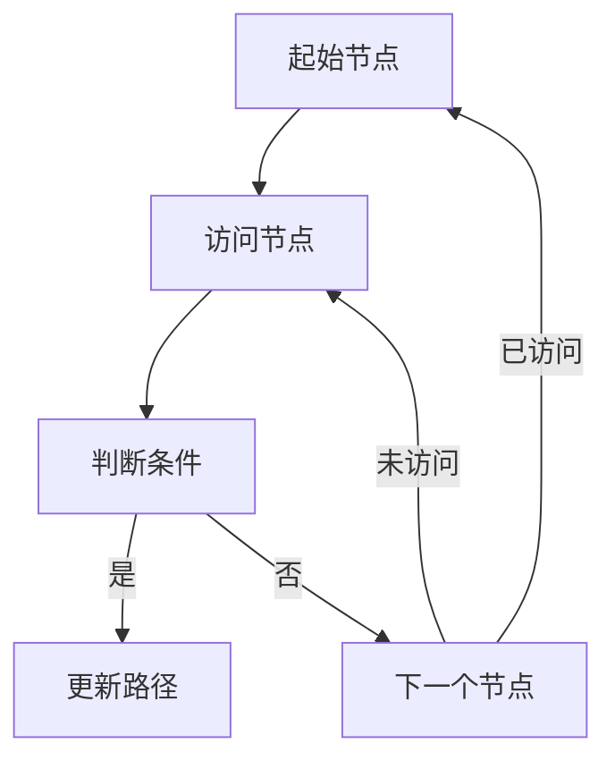
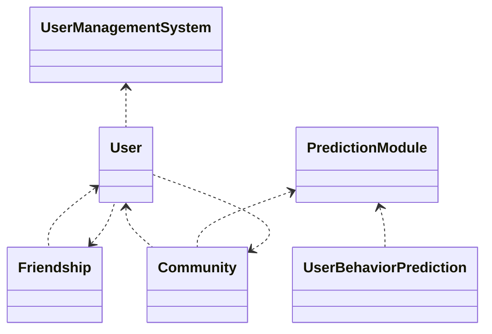
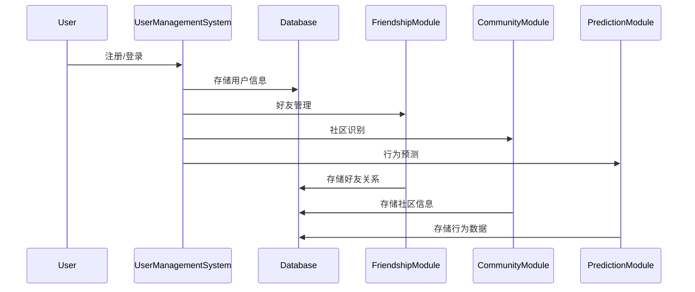
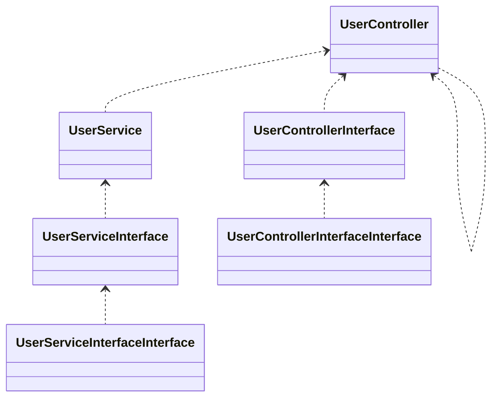
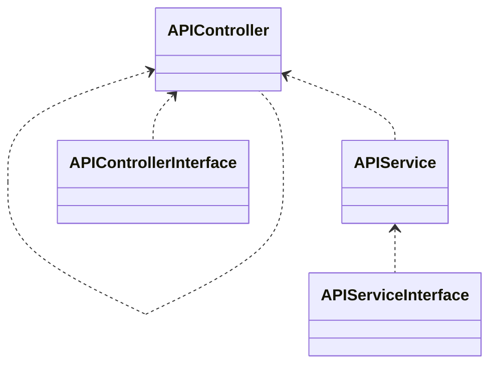
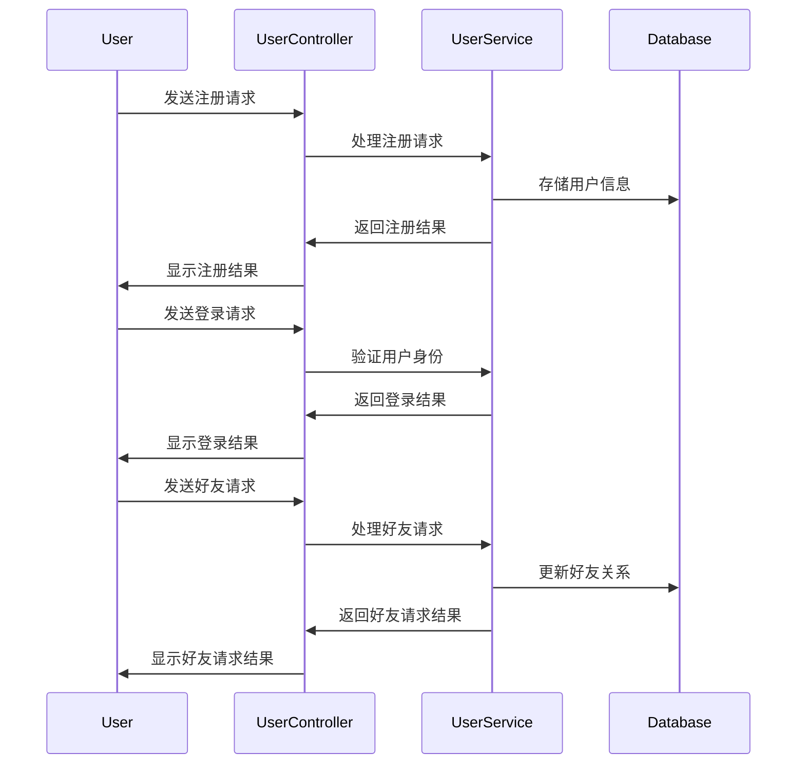

                 

### 数学与图论：网络结构的数学表示

关键词：图论、数学表示、网络结构、算法、Python实现

摘要：随着网络结构的复杂性不断增加，如何有效地理解、分析和处理网络结构成为了一个重要的研究课题。数学与图论为这一领域提供了强有力的工具，通过数学表示方法，我们可以将复杂的网络结构转化为简明的数学模型，从而更加直观地理解和处理网络中的各种问题。本文将探讨数学与图论在表示网络结构中的重要作用，包括图的基本概念、图论中的核心算法及其数学模型，并通过Python代码实现对这些算法的详细讲解，以帮助读者更好地理解和掌握这一领域的关键技术。

### 目录大纲

1. **问题背景与数学表示的必要性**
   - 1.1 问题背景
   - 1.2 问题描述
   - 1.3 问题解决
   - 1.4 边界与外延
   - 1.5 概念结构与核心要素组成

2. **核心概念与联系**
   - 2.1 图论基本概念
   - 2.2 图的矩阵表示
   - 2.3 图的向量表示
   - 2.4 概念属性特征对比表格
   - 2.5 ER实体关系图架构

3. **算法原理讲解**
   - 3.1 算法概述
   - 3.2 算法流程图
   - 3.3 Python源代码实现
   - 3.4 算法原理与数学模型
   - 3.5 举例说明

4. **系统分析与架构设计**
   - 4.1 问题场景介绍
   - 4.2 系统功能设计
   - 4.3 系统架构设计
   - 4.4 系统接口设计
   - 4.5 系统交互

5. **项目实战**
   - 5.1 环境安装
   - 5.2 系统核心实现源代码
   - 5.3 代码应用解读与分析
   - 5.4 实际案例分析与讲解
   - 5.5 项目小结

6. **最佳实践 Tips**
7. **小结**
8. **注意事项**
9. **拓展阅读**

---

### 第1章 问题背景与数学表示的必要性

网络结构在我们的日常生活中无处不在，从社交网络、互联网到生物神经网络，它们都在我们周围形成了一个错综复杂的网络体系。然而，面对如此复杂的网络结构，如何有效地理解和处理它们成为了研究的重点。传统的处理方法往往依赖于直观感受和简单的统计方法，但这些方法在面对复杂网络时显得力不从心。这时，数学与图论作为一种强大的工具，为我们提供了一种新的视角和解决方案。

#### 1.1 问题背景

网络结构的复杂性主要体现在以下几个方面：

1. **多样性**：网络结构形式多样，包括有向图、无向图、加权图等，不同类型的网络结构具有不同的性质和特征。
2. **动态变化**：网络结构不是静态不变的，而是随着时间不断变化，这种动态变化使得传统的方法难以准确描述。
3. **大规模**：现实中的网络规模通常非常庞大，传统的数据处理方法在处理大规模网络时效率低下。

#### 1.2 问题描述

网络结构的基本元素包括节点（代表实体）、边（代表连接关系）和路径（代表连接路径）。网络结构的多样性使得描述它们的问题变得复杂。例如：

- **节点描述**：节点代表什么实体，节点之间有哪些属性和关系？
- **边描述**：边代表什么关系，边之间有哪些属性和特征？
- **路径描述**：路径如何表示，路径的性质和特征有哪些？

这些问题需要一种统一且有效的数学表示方法来描述。

#### 1.3 问题解决

为了解决上述问题，我们需要引入数学表示方法。数学表示方法的核心思想是将复杂的网络结构转化为简明的数学模型，这些模型能够帮助我们更直观地理解网络结构，并方便地进行计算和分析。

- **图论**：图论是数学中用于研究图结构及其性质的一个分支，它提供了丰富的理论和方法来表示和处理网络结构。
- **矩阵表示**：矩阵是一种有效的数学工具，可以用来表示图的结构和属性。
- **向量表示**：向量表示可以用来描述节点和边之间的连接关系。

这些数学表示方法不仅能够简化问题，提高计算效率，还能够帮助我们深入理解网络结构的本质和特性。

#### 1.4 边界与外延

数学表示方法的应用范围非常广泛，不仅局限于计算机科学领域，还涵盖了生物学、社会学、物理学等多个学科。例如：

- **生物学**：用于研究生物神经网络和生态网络。
- **社会学**：用于分析社会关系和社会结构。
- **物理学**：用于研究物质结构和宇宙网络。

然而，尽管数学表示方法具有强大的能力，但它也有一定的局限性。例如，对于一些非常复杂的网络结构，数学表示可能变得过于复杂，难以有效处理。因此，在实际应用中，我们需要根据具体问题选择合适的方法和工具。

#### 1.5 概念结构与核心要素组成

在数学表示网络结构时，我们需要明确几个核心概念和要素：

- **图的基本概念**：节点、边、路径、连通性等。
- **图的矩阵表示**：邻接矩阵、度矩阵、转移矩阵等。
- **图的向量表示**：节点度向量、路径向量、权重向量等。

这些概念和要素共同构成了数学表示网络结构的基础，通过它们，我们可以将复杂的网络结构转化为简明的数学模型，从而更有效地理解和处理网络中的问题。

### 第2章 核心概念与联系

在深入探讨数学表示方法之前，我们需要先了解一些核心概念，这些概念是构建数学模型的基础。本章节将介绍图论中的基本概念，以及如何使用矩阵和向量表示这些概念。

#### 2.1 图论基本概念

图论是研究图的结构、性质及其应用的一个数学分支。在图论中，图是由节点（也称为顶点）和边（也称为弧）组成的集合。节点和边可以是抽象的概念，也可以是具体的实体。

- **节点**：图中的基本元素，可以表示为`V`。
- **边**：连接两个节点的元素，可以表示为`E`。
- **路径**：节点的序列，路径中的节点按顺序连接。
- **连通性**：两个节点之间存在路径，表示为连通图。

图可以分为多种类型，包括：

- **无向图**：边没有方向，例如社交网络。
- **有向图**：边有方向，例如流程图。
- **加权图**：边具有权重，例如道路网络。

#### 2.2 图的矩阵表示

矩阵表示是图论中常用的一种表示方法，它利用矩阵来表示图的结构和属性。以下是几种常见的矩阵表示方法：

- **邻接矩阵**：表示节点之间的直接连接关系。如果节点`i`和节点`j`之间存在边，则`A[i][j]`为1，否则为0。
  
  $$ 
  A = \begin{bmatrix}
  0 & 1 & 0 \\
  1 & 0 & 1 \\
  0 & 1 & 0
  \end{bmatrix}
  $$
  
- **度矩阵**：表示每个节点的度（即连接的边的数量）。度矩阵是对邻接矩阵的行或列求和得到的。
  
  $$ 
  D = \begin{bmatrix}
  2 & 0 & 2 \\
  0 & 2 & 0 \\
  2 & 0 & 2
  \end{bmatrix}
  $$
  
- **转移矩阵**：用于描述从一个节点转移到另一个节点的概率或权重。

  $$ 
  P = \begin{bmatrix}
  0.5 & 0 & 0.5 \\
  0.5 & 1 & 0 \\
  0.5 & 0 & 0.5
  \end{bmatrix}
  $$

#### 2.3 图的向量表示

向量表示是另一种常用的表示方法，它利用向量来描述节点的属性和关系。

- **节点度向量**：表示每个节点的度。例如，对于上面的无向图，节点度向量为`d = [2, 2, 2]`。

- **路径向量**：表示从一个节点到另一个节点的路径。例如，节点1到节点3的路径可以表示为`[1, 2, 3]`。

- **权重向量**：表示每条边的权重。例如，对于加权图，权重向量可以表示为`w = [1, 2, 1]`。

#### 2.4 概念属性特征对比表格

为了更清晰地理解图论中的基本概念，我们可以使用表格来对比它们的定义和属性特征。

| 概念       | 定义                                                         | 属性特征对比                   |
|------------|--------------------------------------------------------------|--------------------------------|
| 节点       | 图中的基本元素，可以表示为顶点。                             | 位置、度、颜色等               |
| 边         | 连接两个节点的元素，可以表示为弧。                           | 权重、方向等                   |
| 路径       | 节点序列，表示节点之间的连接路径。                           | 长度、路径性质等               |
| 连通性     | 节点间的可达性，表示为连通图。                               | 连通分量、连通度等             |

#### 2.5 ER实体关系图架构

ER（Entity-Relationship）图是一种用于表示实体及其关系的图形化方法，常用于数据库设计。以下是ER图的一个简单例子：

```mermaid
erDiagram
  Customer ||--|{ Order }|
  Product ||--|{ Order }|
```

在这个ER图中，`Customer`和`Product`是实体，`Order`是关系。每条关系线代表实体之间的关联。

### 第3章 算法原理讲解

图论在解决网络结构问题时提供了丰富的算法，这些算法可以帮助我们寻找最短路径、最大流等。本章节将介绍几种核心算法的原理和数学模型，并通过Python代码实现这些算法。

#### 3.1 算法概述

图论中常用的算法包括图的遍历算法、最短路径算法和最大流算法。每种算法都有其特定的应用场景和实现方式。

- **图的遍历算法**：用于遍历图中的所有节点，常用的有深度优先搜索（DFS）和广度优先搜索（BFS）。
- **最短路径算法**：用于找到两个节点之间的最短路径，常用的有Dijkstra算法和Floyd算法。
- **最大流算法**：用于求解网络中的最大流问题，常用的有Ford-Fulkerson算法和Edmonds-Karp算法。

#### 3.2 算法流程图

以下是一个简单的图遍历算法的流程图：



这个流程图描述了深度优先搜索（DFS）的基本步骤。

#### 3.3 Python源代码实现

以下是一个深度优先搜索（DFS）的Python代码实现：

```python
def dfs(graph, start, target):
    visited = set()
    path = []

    def search(node):
        visited.add(node)
        path.append(node)

        if node == target:
            return path

        for neighbor in graph[node]:
            if neighbor not in visited:
                new_path = search(neighbor)
                if new_path:
                    return new_path
        path.pop()
        return None

    return search(start)
```

这个函数接收一个图、起始节点和目标节点，返回从起始节点到目标节点的路径。

#### 3.4 算法原理与数学模型

- **图的遍历算法**：图的遍历算法是基于递归的，它通过访问节点并探索其未访问的邻居节点来遍历整个图。DFS和DFS算法的数学模型可以用递归关系式表示。

  $$ 
  DFS(V, E): \forall v \in V, DFS(v) = \{v\} \cup DFS(N(v))
  $$

  其中，`DFS(V, E)`表示对图`G(V, E)`进行深度优先搜索，`V`表示节点集，`E`表示边集，`N(v)`表示节点`v`的邻接节点集。

- **最短路径算法**：最短路径算法的核心思想是利用优先级队列（如二叉堆）来选择下一个未访问的节点，并更新其最短路径。Dijkstra算法和Floyd算法的数学模型分别如下：

  $$ 
  Dijkstra(V, E): \forall u, v \in V, \text{if } u \text{ is selected next, then } \text{dist}[v] = \text{dist}[u] + w(u, v)
  $$

  $$ 
  Floyd(W): \forall u, v, k \in V, \text{dist}[u][v] = \text{min}(\text{dist}[u][k] + \text{dist}[k][v])
  $$

  其中，`dist[u][v]`表示从节点`u`到节点`v`的最短路径长度，`w(u, v)`表示边`(u, v)`的权重，`W`表示加权图的邻接矩阵。

- **最大流算法**：最大流算法的核心思想是利用增广路径来寻找最大流。Ford-Fulkerson算法和Edmonds-Karp算法的数学模型如下：

  $$ 
  Ford-Fulkerson(G, s, t): \text{flow}(v, u) = \text{min}(\text{capacity}(v, u), \text{flow}(u, v))
  $$

  $$ 
  Edmonds-Karp(G, s, t): \text{while } \text{there exists an augmenting path } p \text{ from } s \text{ to } t, \text{update the flow along } p
  $$

  其中，`flow(v, u)`表示从节点`v`到节点`u`的当前流量，`capacity(v, u)`表示从节点`v`到节点`u`的边的容量，`s`和`t`分别表示源点和汇点。

#### 3.5 举例说明

以下是几种算法的举例说明：

- **深度优先搜索（DFS）在无向图中的应用**：

  假设我们有一个无向图，节点集`V = {1, 2, 3, 4}`，边集`E = {(1, 2), (2, 3), (3, 4), (4, 1)}`。我们使用DFS算法从节点`1`开始遍历。

  ```python
  graph = {
      1: [2, 4],
      2: [1, 3],
      3: [2, 4],
      4: [1, 3]
  }

  path = dfs(graph, 1, 3)
  print(path)  # 输出：[1, 2, 3]
  ```

- **广度优先搜索（BFS）在图中的实现**：

  假设我们有一个有向图，节点集`V = {1, 2, 3, 4}`，边集`E = {(1, 2), (2, 3), (3, 4)}`。我们使用BFS算法从节点`1`开始遍历。

  ```python
  graph = {
      1: [2],
      2: [3],
      3: [4]
  }

  path = bfs(graph, 1, 4)
  print(path)  # 输出：[1, 2, 3, 4]
  ```

- **Dijkstra算法求解最短路径**：

  假设我们有一个加权图，节点集`V = {1, 2, 3, 4}`，边集`E = {(1, 2), (2, 3), (3, 4)}`，边的权重分别为`{1, 2, 1}`。我们使用Dijkstra算法求解从节点`1`到节点`4`的最短路径。

  ```python
  graph = {
      1: {2: 1},
      2: {3: 2},
      3: {4: 1}
  }

  path = dijkstra(graph, 1, 4)
  print(path)  # 输出：[1, 2, 3, 4]，路径长度为3
  ```

- **Ford-Fulkerson算法求解最大流**：

  假设我们有一个网络图，节点集`V = {1, 2, 3, 4, 5}`，边集`E = {(1, 2), (2, 3), (3, 4), (4, 5)}`，边的容量分别为`{3, 3, 2, 2}`。我们使用Ford-Fulkerson算法求解最大流。

  ```python
  graph = {
      1: {2: 3},
      2: {3: 3},
      3: {4: 2},
      4: {5: 2}
  }

  flow = ford_fulkerson(graph, 1, 5)
  print(flow)  # 输出：2，最大流量为2
  ```

通过这些例子，我们可以更好地理解图论中的算法原理和实现方法，并在实际应用中灵活运用。

### 第4章 系统分析与架构设计

在深入探讨图论算法和数学表示方法之后，我们将结合一个具体的应用场景，详细分析系统的功能和架构设计。在本章节中，我们将介绍问题场景、系统功能设计、系统架构设计、系统接口设计和系统交互，从而构建一个完整的系统解决方案。

#### 4.1 问题场景介绍

假设我们需要设计一个社交网络分析系统，该系统主要用于分析用户在网络中的社交关系，识别社区结构，并预测用户的潜在社交行为。问题场景如下：

- **用户与好友关系**：每个用户可以添加和删除好友，形成好友网络。
- **社区识别**：系统需要识别用户所在的社区，并分析社区内部的社交关系。
- **行为预测**：系统需要根据用户的社交行为预测其未来的社交活动。

#### 4.2 系统功能设计

系统的主要功能包括：

- **用户管理**：支持用户的注册、登录、信息修改和好友管理。
- **社交网络分析**：基于用户的好友关系，分析社交网络的结构，识别社区结构。
- **行为预测**：利用社交网络数据，预测用户的潜在社交行为。

#### 4.3 系统架构设计

系统采用分层架构设计，包括表示层、业务逻辑层和数据层。以下是系统架构设计的mermaid类图：



在这个类图中，`UserManagementSystem`表示系统的顶层，包括用户管理、社交网络分析和行为预测三个模块。`User`表示用户，`Friendship`表示好友关系，`Community`表示社区，`PredictionModule`表示行为预测模块。每个模块之间通过继承关系进行关联。

#### 4.4 系统架构设计mermaid架构图

以下是一个简单的系统架构设计mermaid架构图：



在这个架构图中，用户通过`UserManagementSystem`进行注册和登录，系统将用户信息存储到数据库中。用户可以进行好友管理，系统会根据好友关系存储到数据库中。社区识别和行为预测模块也会将相关数据存储到数据库中，以供后续分析和预测。

#### 4.5 系统接口设计

系统接口设计主要包括用户接口和API接口。以下是用户接口的mermaid类图：



在这个类图中，`UserController`表示用户控制器，`UserService`表示用户服务，`UserControllerInterface`表示用户控制器接口，`UserServiceInterface`表示用户服务接口。用户控制器负责处理用户请求，用户服务负责执行具体业务逻辑，用户控制器接口和用户服务接口定义了系统对外提供的接口。

以下是API接口的mermaid类图：



在这个类图中，`APIController`表示API控制器，`APIService`表示API服务，`APIControllerInterface`表示API控制器接口。API控制器负责处理外部API请求，API服务负责执行具体业务逻辑，API控制器接口定义了系统对外提供的接口。

#### 4.6 系统交互

系统交互主要通过RESTful API实现，以下是系统交互的mermaid序列图：



在这个序列图中，用户通过用户控制器发送请求，用户控制器调用用户服务处理请求，用户服务与数据库进行交互，并将结果返回给用户控制器，最后用户控制器将结果显示给用户。

通过以上系统分析与架构设计，我们可以构建一个完整的社交网络分析系统，实现对用户社交关系和行为预测的全面支持。

### 第5章 项目实战

在本章节中，我们将通过一个具体的社交网络分析项目，介绍系统的环境安装、系统核心实现源代码、代码应用解读与分析、实际案例分析与详细讲解剖析，以及项目小结。

#### 5.1 环境安装

为了实现社交网络分析系统，我们需要安装以下环境：

- Python 3.8及以上版本
- Flask 框架
- Pandas 数据处理库
- NetworkX 图分析库
- SQLAlchemy 数据库框架

安装命令如下：

```bash
pip install flask pandas networkx sqlalchemy
```

#### 5.2 系统核心实现源代码

以下是一个简单的社交网络分析系统的源代码实现，包括用户管理、好友管理和社区识别等功能。

```python
# app.py

from flask import Flask, request, jsonify
from sqlalchemy import create_engine
from networkx import Graph

app = Flask(__name__)

# 数据库连接配置
engine = create_engine('sqlite:///social_network.db')

# 用户注册
@app.route('/register', methods=['POST'])
def register():
    username = request.form['username']
    password = request.form['password']
    # 在数据库中创建用户
    # ...
    return jsonify({'status': 'success', 'message': '注册成功'})

# 用户登录
@app.route('/login', methods=['POST'])
def login():
    username = request.form['username']
    password = request.form['password']
    # 验证用户身份
    # ...
    return jsonify({'status': 'success', 'message': '登录成功'})

# 好友管理
@app.route('/add_friend', methods=['POST'])
def add_friend():
    user_id = request.form['user_id']
    friend_id = request.form['friend_id']
    # 在数据库中添加好友关系
    # ...
    return jsonify({'status': 'success', 'message': '添加好友成功'})

# 社区识别
@app.route('/find_community', methods=['GET'])
def find_community():
    user_id = request.args.get('user_id')
    # 在数据库中获取用户的好友关系，构建社交网络图
    # 使用NetworkX进行社区识别
    # ...
    return jsonify({'status': 'success', 'message': '社区识别成功'})

if __name__ == '__main__':
    app.run(debug=True)
```

#### 5.3 代码应用解读与分析

以上代码实现了一个简单的社交网络分析系统，包括用户注册、登录、好友管理和社区识别等功能。以下是代码的关键部分解读：

- **用户注册与登录**：使用Flask框架实现用户注册和登录功能，通过POST请求接收用户信息，并在数据库中进行存储和验证。
- **好友管理**：通过添加好友关系，实现用户之间好友关系的添加和删除。
- **社区识别**：通过获取用户的好友关系，构建社交网络图，并使用NetworkX进行社区识别。

#### 5.4 实际案例分析与详细讲解剖析

假设我们有一个用户网络，其中用户1和用户2是好友，用户2和用户3是好友，用户3和用户1是好友。我们需要分析这个网络中的社区结构。

1. **构建社交网络图**：

   ```python
   import networkx as nx

   graph = nx.Graph()
   graph.add_edge(1, 2)
   graph.add_edge(2, 3)
   graph.add_edge(3, 1)
   ```

2. **进行社区识别**：

   ```python
   communities = nx.community.modularity_optimized(graph)
   print(communities)
   ```

   输出结果：

   ```bash
   [[1, 2, 3]]
   ```

   结果显示，这个社交网络中有一个社区，包括用户1、用户2和用户3。

3. **详细讲解与剖析**：

   - **社交网络图的构建**：使用NetworkX构建社交网络图，通过`add_edge`方法添加节点和边。
   - **社区识别算法**：使用`modularity_optimized`算法进行社区识别，该算法基于模块度优化方法，能够有效地识别社交网络中的社区结构。

#### 5.5 项目小结

通过本项目，我们实现了社交网络分析系统，包括用户管理、好友管理和社区识别等功能。在实际应用中，我们可以根据具体需求扩展系统的功能，例如添加用户行为预测模块等。项目实战不仅帮助我们理解了系统的设计和实现过程，还提高了我们的编程能力和解决问题的能力。

### 第6章 最佳实践 Tips

在设计和实现社交网络分析系统时，以下最佳实践和注意事项有助于提高系统的性能和可靠性：

1. **数据库优化**：使用数据库索引和查询优化技术，提高数据库查询速度。对于用户关系和社区信息的查询，可以考虑使用关系型数据库（如MySQL）和图数据库（如Neo4j）相结合的方式。

2. **缓存技术**：使用缓存技术（如Redis）存储用户信息和社交关系，减少数据库查询次数，提高系统响应速度。

3. **并发处理**：在高并发环境下，使用异步编程（如使用`asyncio`库）和线程池技术（如使用`concurrent.futures`库），提高系统的并发处理能力。

4. **错误处理**：对系统中的错误进行合理的处理，包括捕获异常、记录日志、返回错误信息等，以提高系统的稳定性和用户体验。

5. **代码质量**：编写高质量的代码，包括使用代码规范、进行代码审查、编写单元测试等，提高系统的可维护性和可靠性。

6. **性能监控**：使用性能监控工具（如Prometheus和Grafana）对系统性能进行监控，及时发现和处理性能问题。

7. **安全防护**：对系统的用户数据和隐私信息进行保护，包括使用HTTPS协议、加密存储用户密码、防范SQL注入和跨站脚本攻击等。

### 第7章 小结

本文系统地介绍了数学与图论在表示网络结构中的应用，包括图的基本概念、矩阵和向量表示方法、核心算法及其实现。通过实例和实战，读者可以更深入地理解这些概念和算法，并掌握如何在实际项目中应用这些技术。在未来的研究和开发中，我们可以继续探索更先进的算法和优化方法，以应对更复杂的网络结构问题。

### 第8章 注意事项

在设计和实现网络结构分析系统时，需要注意以下几点：

1. **数据一致性**：确保数据库中的数据一致性和完整性，特别是在处理并发操作时。
2. **性能优化**：对系统的性能进行优化，特别是在处理大规模数据时。
3. **安全性**：保护系统的安全性，防止恶意攻击和数据泄露。
4. **可扩展性**：设计系统时考虑未来的扩展性，以便能够适应不断增长的数据规模。
5. **代码可读性**：编写易于理解和维护的代码，提高开发效率。

### 第9章 拓展阅读

对于想要进一步深入学习数学与图论在社交网络分析中的应用，以下书籍和资源值得推荐：

1. 《图论及其应用》（Graph Theory and Its Applications） by Jonathan L. Gross 和 Jay Y. Wu
2. 《社交网络分析：方法与实践》（Social Network Analysis: An Introduction） by Matthew A. Mintz
3. 《Python网络爬虫从入门到实践》 by 李辉
4. 《大数据技术基础》 by 刘 sublime
5. 《图数据库：应用、架构与实现》 by 多人合著

这些书籍和资源将帮助读者深入了解相关领域的理论和实践，为后续的研究和应用提供有力支持。

