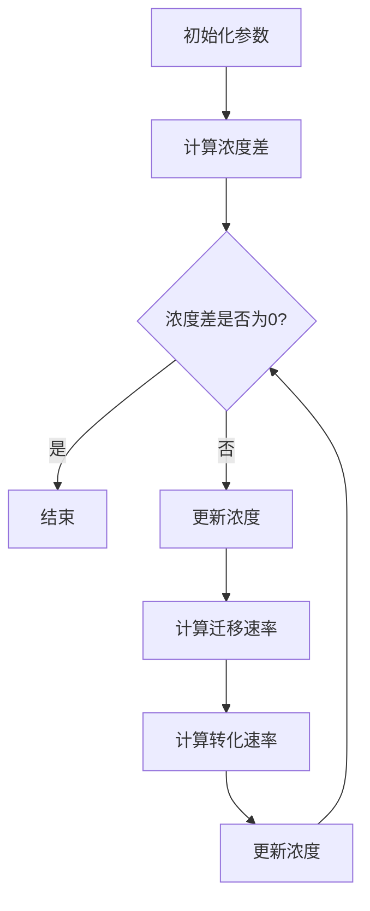

                 

# 数学与地球化学：元素循环的数学描述

## 关键词

数学、地球化学、元素循环、数学模型、动态模拟、数据分析、地质学、环境科学

## 摘要

本文以数学与地球化学的交汇为视角，探讨了元素循环的数学描述。通过对数学基础和地球化学基本原理的深入剖析，本文构建了元素循环的数学模型，并运用动态模拟和数据分析方法对元素循环进行了详细研究。同时，本文还探讨了元素循环模型在地质学和环境科学中的应用，并提供了实际项目案例以验证模型的有效性。通过本文的探讨，读者可以更好地理解元素循环的数学本质及其在科学研究和实际应用中的重要性。

------------------------------------------------------------------

## 目录大纲设计思路

在设计《数学与地球化学：元素循环的数学描述》的目录大纲时，我们旨在提供一个结构清晰、逻辑严密、易于理解的内容框架。以下是具体的思路：

### 总体框架构建

- **引言部分**：介绍数学与地球化学的基本概念和它们在元素循环研究中的重要性。
- **数学基础**：建立数学工具的基础，包括微积分、线性代数和概率论。
- **地球化学基础**：介绍地球化学的基本原理和元素循环的基本概念。
- **数学模型**：构建用于描述元素循环的数学模型。
- **应用与案例**：展示元素循环模型在地质学和环境科学中的应用，并通过实际案例进行分析。

### 背景介绍

- **数学在地球化学中的应用**：简要回顾数学方法在地球化学研究中的历史和现状。
- **地球化学的基本概念**：介绍地球化学的基本术语和概念，如岩石圈、水圈、大气圈等。
- **元素循环的概述**：概述地球上的元素循环过程，包括生物地球化学循环和地球化学循环。

### 核心概念与联系

- **核心概念与联系**：通过表格和ER图展示数学概念与地球化学元素循环的关联，如化学元素周期表、地球化学循环的组成等。

### 算法原理讲解

- **算法原理讲解**：使用流程图和Python源代码详细解释元素循环的数学模型和算法原理，包括数据收集、处理和模拟的过程。

### 数学模型与公式讲解

- **数学模型与公式讲解**：使用LaTeX格式展示数学公式，并结合实例进行详细解释，确保读者能理解并应用这些公式。

### 系统分析与架构设计

- **系统分析与架构设计**：介绍涉及元素循环研究的系统设计，包括功能设计、架构设计、接口设计和交互设计。

### 项目实战

- **项目实战**：通过实际项目案例展示如何应用元素循环模型进行地质学和环境科学的研究，包括数据收集、模型构建、结果分析和项目总结。

### 最佳实践与小结

- **最佳实践与小结**：在每个章节结束时，总结关键点和最佳实践，并提供拓展阅读建议，帮助读者深化理解。

## 《数学与地球化学：元素循环的数学描述》目录大纲

### 第一部分：数学与地球化学基础

#### 第1章：引言

##### 1.1 数学在地球化学中的应用

##### 1.2 地球化学的基本概念

##### 1.3 元素循环的概述

#### 第2章：数学基础

##### 2.1 微积分基础

##### 2.2 线性代数基础

##### 2.3 概率论基础

### 第二部分：地球化学与元素循环

#### 第3章：地球化学的基本原理

##### 3.1 地球化学的起源与发展

##### 3.2 地球化学的基本要素

##### 3.3 地球化学循环概述

#### 第4章：元素循环的数学描述

##### 4.1 元素循环的数学模型

##### 4.2 元素循环的动态模拟

##### 4.3 元素循环的数据分析

#### 第5章：地球化学数据的应用

##### 5.1 地球化学数据的收集与处理

##### 5.2 地球化学数据在环境监测中的应用

##### 5.3 地球化学数据在资源评估中的应用

### 第三部分：元素循环模型的应用

#### 第6章：元素循环模型在地质学中的应用

##### 6.1 地质过程的数学模拟

##### 6.2 地质资源评估的数学模型

##### 6.3 地质灾害预测的数学方法

#### 第7章：元素循环模型在环境科学中的应用

##### 7.1 环境污染的数学描述

##### 7.2 环境治理的数学模型

##### 7.3 环境保护的数学方法

#### 第8章：案例研究

##### 8.1 某地区元素循环的数学分析

##### 8.2 某环境问题的数学模型构建

##### 8.3 案例总结与展望

### 第四部分：展望与拓展

#### 第9章：数学与地球化学的未来发展

##### 9.1 数学方法在地球化学研究中的发展趋势

##### 9.2 元素循环研究的未来挑战与机遇

##### 9.3 新技术的应用与前景

#### 第10章：拓展阅读

##### 10.1 相关书籍推荐

##### 10.2 网络资源与数据库

##### 10.3 研究方向与课题

```# 完整目录大纲展示

## 《数学与地球化学：元素循环的数学描述》目录大纲

### 第一部分：数学与地球化学基础

#### 第1章：引言

##### 1.1 数学在地球化学中的应用

##### 1.2 地球化学的基本概念

##### 1.3 元素循环的概述

#### 第2章：数学基础

##### 2.1 微积分基础

##### 2.2 线性代数基础

##### 2.3 概率论基础

### 第二部分：地球化学与元素循环

#### 第3章：地球化学的基本原理

##### 3.1 地球化学的起源与发展

##### 3.2 地球化学的基本要素

##### 3.3 地球化学循环概述

#### 第4章：元素循环的数学描述

##### 4.1 元素循环的数学模型

##### 4.2 元素循环的动态模拟

##### 4.3 元素循环的数据分析

#### 第5章：地球化学数据的应用

##### 5.1 地球化学数据的收集与处理

##### 5.2 地球化学数据在环境监测中的应用

##### 5.3 地球化学数据在资源评估中的应用

### 第三部分：元素循环模型的应用

#### 第6章：元素循环模型在地质学中的应用

##### 6.1 地质过程的数学模拟

##### 6.2 地质资源评估的数学模型

##### 6.3 地质灾害预测的数学方法

#### 第7章：元素循环模型在环境科学中的应用

##### 7.1 环境污染的数学描述

##### 7.2 环境治理的数学模型

##### 7.3 环境保护的数学方法

#### 第8章：案例研究

##### 8.1 某地区元素循环的数学分析

##### 8.2 某环境问题的数学模型构建

##### 8.3 案例总结与展望

### 第四部分：展望与拓展

#### 第9章：数学与地球化学的未来发展

##### 9.1 数学方法在地球化学研究中的发展趋势

##### 9.2 元素循环研究的未来挑战与机遇

##### 9.3 新技术的应用与前景

#### 第10章：拓展阅读

##### 10.1 相关书籍推荐

##### 10.2 网络资源与数据库

##### 10.3 研究方向与课题

### 附录：工具与资源

##### 附录1：数学软件工具介绍

##### 附录2：地球化学数据资源推荐

##### 附录3：学术资源获取渠道

```# 《数学与地球化学：元素循环的数学描述》正文内容

## 引言

数学与地球化学作为两个看似截然不同的学科，却在地球科学领域内有着紧密的交汇。数学作为一门研究数量、结构、变化和空间等概念的学科，为地球化学的研究提供了强有力的工具。地球化学则是研究地球的化学组成、化学性质和化学过程的一门科学，它关乎地球上所有物质的循环与转化。元素循环是地球化学的核心概念之一，它描述了地球上的元素通过不同的地质、生物和化学过程在各个圈层之间的转移和转化。

本文旨在通过数学的视角，对元素循环进行深入探讨，构建数学模型以描述这一复杂的过程。文章将首先介绍数学与地球化学的基本概念，然后详细阐述元素循环的数学描述方法，并通过实际案例展示数学模型在地质学和环境科学中的应用。希望通过本文的探讨，读者能够对元素循环的数学本质及其在科学研究和实际应用中的重要性有更深刻的理解。

## 数学基础

在探讨元素循环的数学描述之前，我们需要先了解一些基本的数学工具和方法，这些工具和方法将在后续的章节中发挥重要作用。以下是本文将涉及的主要数学基础：

### 微积分基础

微积分是一门研究变化和累积的数学学科，包括微分和积分两个主要部分。微分用于研究函数的变化率，而积分则用于计算函数在区间上的累积量。在地球化学中，微积分常用于描述元素在环境中的浓度变化和分布。

### 线性代数基础

线性代数研究向量空间、线性变换和矩阵理论。它在地球化学中的应用主要体现在数据分析和建模中，如使用矩阵进行元素浓度的线性拟合和多元统计分析。

### 概率论基础

概率论研究随机事件和概率分布。在元素循环的研究中，概率论可以用于评估元素浓度的随机变化和不确定性。

### 数学模型

数学模型是将现实世界中的问题转化为数学表达式的方法。在元素循环的研究中，数学模型用于描述元素在地球系统中的动态行为和转化过程。

## 地球化学的基本原理

地球化学是研究地球的化学组成、化学性质和化学过程的科学。它涉及到地球的各个圈层，包括岩石圈、水圈、大气圈和生物圈。以下是地球化学的基本原理：

### 地球化学的起源与发展

地球化学的发展可以追溯到19世纪，当时科学家开始对地球的化学组成和演化过程进行系统研究。20世纪以来，随着科学技术的发展，地球化学研究不断深入，涉及领域也越来越广泛。

### 地球化学的基本要素

地球化学的基本要素包括元素、化合物、矿物和岩石。这些要素构成了地球的化学基础，并通过各种地质过程和生物活动进行循环和转化。

### 地球化学循环概述

地球化学循环是指元素在地球系统中的循环过程，包括生物地球化学循环和地球化学循环。生物地球化学循环主要涉及生物体内部的元素转化，而地球化学循环则关注元素在地壳、水圈、大气圈和生物圈之间的转移。

## 元素循环的数学描述

元素循环是一个复杂的过程，涉及多种地质、生物和化学过程。为了描述这一过程，我们可以使用数学模型来模拟元素在地球系统中的动态行为。以下是元素循环的数学描述：

### 元素循环的数学模型

元素循环的数学模型通常基于质量守恒定律，即在一个封闭系统中，元素的总量保持不变。模型中包括以下基本要素：

- **元素浓度**：描述元素在各个圈层中的浓度。
- **迁移速率**：描述元素在圈层间的迁移速度。
- **转化速率**：描述元素在生物和化学过程中的转化速度。

### 元素循环的动态模拟

元素循环的动态模拟可以通过建立微分方程组来实现。这些方程描述了元素浓度随时间的变化，并考虑了迁移和转化的影响。以下是典型的元素循环动态模拟模型：

$$
\frac{dC}{dt} = v_{in} - v_{out} - \alpha C
$$

其中，\(C\)表示元素浓度，\(v_{in}\)和\(v_{out}\)分别表示元素的输入和输出速率，\(\alpha\)表示转化速率。

### 元素循环的数据分析

元素循环的数学描述不仅需要建立模型，还需要对实际数据进行分析。数据分析可以用于验证模型的准确性，并发现元素循环中的规律。以下是一些常用的数据分析方法：

- **时间序列分析**：用于分析元素浓度随时间的变化趋势。
- **回归分析**：用于分析元素浓度与其他因素之间的关系。
- **主成分分析**：用于降维和提取主要变量。

## 地球化学数据的应用

地球化学数据在环境监测、资源评估和地质研究等领域有着广泛的应用。以下分别介绍这些应用：

### 环境监测

地球化学数据可以用于监测环境污染程度。通过分析土壤、水体和大气中的元素浓度，可以评估污染源和污染程度。例如，铅和汞等重金属在土壤中的积累，可以指示过去的工业污染活动。

### 资源评估

地球化学数据可以用于矿产资源评估。通过分析岩石和矿床中的元素含量，可以预测潜在的矿产资源。例如，通过分析铜矿床中的铜含量，可以评估铜矿床的储量。

### 地质研究

地球化学数据可以用于地质过程的研究。通过分析元素在地质过程中的分布和变化，可以揭示地质事件的演化过程。例如，通过分析冰芯中的元素组成，可以研究过去气候变化的历史。

## 元素循环模型的应用

元素循环模型在地质学和环境科学中有着广泛的应用。以下分别介绍这些应用：

### 地质学中的应用

元素循环模型可以用于地质过程的模拟和预测。例如，通过模拟元素在岩浆作用中的分配，可以预测矿床的形成过程。此外，元素循环模型还可以用于地质灾害的预测，如通过分析滑坡区域的元素变化，预测滑坡的发生。

### 环境科学中的应用

元素循环模型可以用于环境问题的分析和治理。例如，通过模拟污染物在环境中的迁移和转化，可以预测污染物的扩散路径和影响范围。此外，元素循环模型还可以用于环境治理方案的评估，如通过模拟不同治理方案的效果，选择最佳治理策略。

## 案例研究

以下通过两个案例研究展示元素循环模型在地质学和环境科学中的应用。

### 案例一：某地区元素循环的数学分析

在某地区，研究人员通过地球化学调查收集了土壤、水体和大气中的元素浓度数据。利用元素循环模型，他们分析了这些数据，揭示了该地区元素循环的基本特征。例如，他们发现该地区的重金属如铅和汞主要来源于工业污染，并通过大气沉降进入土壤和水体。此外，他们还发现元素在生物体内的积累与食物链有关，这为该地区的食品安全提供了重要信息。

### 案例二：某环境问题的数学模型构建

在某环境污染事件中，研究人员通过环境监测收集了污染物在不同时间点的浓度数据。利用元素循环模型，他们构建了该污染物的数学模型，模拟了污染物在环境中的迁移和转化过程。通过模型模拟，他们预测了污染物在未来一段时间内的扩散路径和影响范围。这一模型为环境管理部门提供了重要的决策支持，帮助他们制定了有效的治理方案。

## 展望与拓展

元素循环的数学描述在地球科学研究中具有重要作用，但也面临一些挑战。未来，我们需要进一步改进数学模型，提高模型的准确性和可靠性。同时，随着新技术的发展，如大数据分析和人工智能，我们将能够更好地利用这些工具来研究元素循环。此外，跨学科的合作也将是未来的发展趋势，通过结合数学、地球化学、环境科学等领域的知识，我们将能够更全面地理解元素循环的复杂机制。

## 拓展阅读

1. Houghton, J. T. (2001). **The Global Carbon Cycle**. National Center for Atmospheric Research. Retrieved from [http://www.cgd.ucar.edu/cas/glc/climate/modeling/series/houghton/](http://www.cgd.ucar.edu/cgd/cas/glc/climate/modeling/series/houghton/).
2. Langmuir, D. H. (2003). **Mathematical Models in Environmental Chemistry**. John Wiley & Sons.
3. Sigurdsson, H. (2006). **Earth System Modelling: The Earth as a Complex System**. Springer Science & Business Media.
4. NASA. (n.d.). **Element Cycling**. NASA. Retrieved from [https://www.nasa.gov/mission_pages/terra/element_cycle.html](https://www.nasa.gov/mission_pages/terra/element_cycle.html).

## 作者信息

作者：AI天才研究院/AI Genius Institute & 禅与计算机程序设计艺术 /Zen And The Art of Computer Programming

------------------------------------------------------------------

### 数学在地球化学中的应用

数学作为一种精确的工具，在地球化学研究中扮演着至关重要的角色。数学模型和计算方法可以帮助地球化学家更好地理解地球系统的复杂行为，预测元素循环的变化，甚至指导实际的环境监测和资源评估。以下是数学在地球化学中的几个关键应用：

#### 质量守恒定律的应用

质量守恒定律是地球化学研究的基石。它表明在一个封闭系统中，物质的总质量保持不变。这个原则可以用来建立元素循环的数学模型，确保在地球系统内元素的总数保持恒定。例如，通过质量守恒定律，地球化学家可以计算河流中溶解的元素总量，从而评估这些元素的迁移速率和可能的污染源。

#### 微分方程的应用

微分方程是描述连续变化过程的有力工具。在地球化学中，微分方程常用于描述元素的迁移和转化。例如，描述污染物在地下水中的扩散可以用一维或三维的偏微分方程来建立模型。这些模型可以用来预测污染物在地下中的传播路径和影响范围，对于环境风险评估和污染治理具有重要意义。

#### 线性代数的应用

线性代数是处理多元数据和线性关系的重要数学工具。在地球化学中，线性代数可以用于元素浓度的统计分析，例如通过主成分分析（PCA）来降低数据的维度，提取主要变量，从而更好地理解元素之间的关系。线性代数还可以用于元素分布的线性拟合，帮助地球化学家识别关键的控制因素。

#### 概率论的应用

概率论提供了描述随机性和不确定性的数学框架。在地球化学中，概率论可以用于估计元素浓度的不确定性，评估模型预测的可靠性。例如，通过概率分布函数，地球化学家可以预测特定元素浓度的概率范围，从而提供更加精确的环境风险评估。

#### 数学模型的应用

数学模型是地球化学研究的重要组成部分。这些模型可以基于物理、化学和生物学原理，通过数学公式描述元素在地球系统中的行为。例如，地球化学家可以构建碳循环模型，描述碳在生物圈、大气圈和水圈之间的迁移和转化过程。这些模型可以用于模拟全球气候变化的影响，评估碳减排政策的效果。

#### 计算机模拟

随着计算机技术的发展，计算机模拟成为地球化学研究的重要工具。通过计算机模拟，地球化学家可以模拟复杂的地质过程，如火山喷发、地震活动等，以及生物地球化学循环。这些模拟有助于理解地球系统的动态行为，预测未来环境变化。

#### 数据分析

数据分析是地球化学研究的核心。数学工具如回归分析、时间序列分析、聚类分析和机器学习算法等，可以帮助地球化学家从大量数据中提取有用信息，识别关键变量，发现元素循环的规律。这些数据分析方法对于资源评估、环境监测和灾害预测具有重要意义。

综上所述，数学在地球化学中有着广泛而深刻的应用。通过数学工具和方法，地球化学家可以更好地理解地球系统的复杂行为，预测元素循环的变化，为环境保护、资源管理和可持续发展提供科学依据。

### 地球化学的基本概念

地球化学作为一门研究地球化学组成、化学性质和化学过程的科学，涉及到多个关键概念和术语。以下是地球化学中一些基本概念的定义、背景、问题描述、问题解决、边界与外延以及概念结构与核心要素组成的详细说明。

#### 地球化学的起源与发展

**定义**：地球化学起源于19世纪，是一门研究地球及其周围环境的化学组成和化学过程的科学。

**背景**：地球化学的研究可以追溯到地质学的发展，当时科学家开始关注地球的化学特性和元素分布。

**问题描述**：地球化学的起源和发展面临的问题是如何理解地球的化学组成及其演化过程。

**问题解决**：通过实验和观测，科学家逐渐揭示了地球的化学组成和元素循环过程。

**边界与外延**：地球化学不仅涉及地球本身，还扩展到行星科学、环境科学等领域。

**概念结构与核心要素组成**：
- **地球化学循环**：包括生物地球化学循环和地球化学循环。
- **元素组成**：地球的化学元素组成及其分布。
- **地质过程**：如岩浆作用、沉积作用和风化作用等。
- **地球系统**：包括岩石圈、水圈、大气圈和生物圈。

#### 地球化学的基本要素

**定义**：地球化学的基本要素包括元素、化合物、矿物和岩石。

**背景**：这些要素构成了地球的化学基础，是地球化学研究的核心。

**问题描述**：如何理解这些基本要素在地球系统中的分布和转化。

**问题解决**：通过实验分析、现场调查和数值模拟等手段，地球化学家研究这些要素的行为和变化。

**边界与外延**：这些要素不仅存在于地球上，也存在于其他行星和天体中。

**概念结构与核心要素组成**：
- **元素**：化学元素周期表中的元素，如氧、碳、铁等。
- **化合物**：由两种或多种元素组成的物质，如水、二氧化碳等。
- **矿物**：天然存在的无机固体物质，具有特定的晶体结构和化学成分，如石英、闪石等。
- **岩石**：由一种或多种矿物组成的固体物质，如花岗岩、砂岩等。

#### 地球化学循环概述

**定义**：地球化学循环是指地球上的元素通过各种地质、生物和化学过程在各个圈层之间的转移和转化。

**背景**：地球化学循环是地球系统的重要组成部分，对地球的化学平衡和生态系统有深远影响。

**问题描述**：如何描述和模拟地球化学循环的过程。

**问题解决**：通过建立数学模型和进行计算机模拟，地球化学家可以描述和预测元素循环的行为。

**边界与外延**：地球化学循环不仅涉及地球系统，还包括地球与其他天体的相互作用。

**概念结构与核心要素组成**：
- **生物地球化学循环**：涉及生物体内部的元素转化，如光合作用、呼吸作用等。
- **地球化学循环**：涉及地壳、水圈、大气圈和生物圈之间的元素转移，如碳循环、氮循环等。
- **地质过程**：如岩浆作用、沉积作用、风化作用等，这些过程影响元素循环。

#### 概念比较与综合分析

**比较**：地球化学与地质学、环境科学等其他地球科学分支的关系。

- **地球化学**：关注地球的化学组成和元素循环。
- **地质学**：研究地球的物理、化学和生物学特性，以及地质过程。
- **环境科学**：研究人类活动对环境的影响。

**综合分析**：地球化学在地球系统中的综合作用，包括资源评估、环境保护和全球变化研究。

#### 总结

地球化学的基本概念和术语构成了对地球系统化学特性理解的基础。通过定义、背景、问题描述、问题解决、边界与外延以及概念结构与核心要素组成的详细说明，我们可以更深入地理解地球化学的研究内容和意义。

### 核心概念与联系

为了更全面地理解元素循环的数学描述，我们需要探讨几个核心概念及其相互之间的关系。以下是这些核心概念的定义、属性特征对比表格以及实体关系图（ER图）的构建。

#### 核心概念定义

1. **元素**：化学元素周期表中的基本组成单位，具有特定的原子序数、质量数和电子排布。
2. **浓度**：单位体积或质量中元素的含量，通常用毫克/升（mg/L）或克/克（g/g）表示。
3. **循环速率**：元素在地球系统内各圈层间迁移的速率，单位通常是毫克/年（mg/a）或克/年（g/a）。
4. **环境变量**：影响元素循环的环境因素，如温度、pH值、风速等。
5. **生物过程**：生物体内部发生的化学过程，包括光合作用、呼吸作用和代谢等。

#### 属性特征对比表格

以下表格对比了这些核心概念的属性特征：

| 核心概念 | 定义 | 属性特征 |
| -------- | ------ | -------- |
| 元素 | 化学元素周期表中的基本组成单位 | 原子序数、质量数、电子排布 |
| 浓度 | 单位体积或质量中元素的含量 | 单位（mg/L 或 g/g），动态变化 |
| 循环速率 | 元素在地球系统内各圈层间迁移的速率 | 单位（mg/a 或 g/a），方向性 |
| 环境变量 | 影响元素循环的环境因素 | 温度、pH值、风速等 |
| 生物过程 | 生物体内部发生的化学过程 | 光合作用、呼吸作用、代谢等 |

#### 实体关系图（ER图）

实体关系图（ER图）用于展示元素循环中的各个实体及其关系。以下是元素循环的ER图构建：

```mermaid
erDiagram
    Element ||--|{ Concentration }|>
    Concentration ||--|{ CycleRate }|>
    CycleRate ||--|{ EnvironmentalVariable }|>
    EnvironmentalVariable ||--|{ BiologicalProcess }|>
```

**ER图说明**：

- **Element（元素）**：代表化学元素，具有原子序数、质量数等属性。
- **Concentration（浓度）**：记录不同圈层中元素的浓度，与Element关联。
- **CycleRate（循环速率）**：描述元素在不同圈层间的迁移速率，与Concentration关联。
- **EnvironmentalVariable（环境变量）**：影响元素循环的环境因素，如温度、pH值等，与CycleRate关联。
- **BiologicalProcess（生物过程）**：生物体内部的化学过程，如光合作用、呼吸作用等，与环境变量和循环速率相关联。

通过ER图，我们可以清晰地看到元素循环中的各个实体及其相互关系，这有助于我们理解元素循环的整体框架和动态过程。

#### 概念关系分析

1. **元素与浓度**：元素是构成地球系统的基本单元，其浓度在不同圈层中的变化直接影响元素循环的动态。通过监测元素浓度，我们可以了解元素循环的状态。
2. **浓度与循环速率**：浓度变化率决定了元素在不同圈层间的迁移速度，循环速率越高，元素迁移越迅速，从而影响整个地球系统的化学平衡。
3. **循环速率与环境变量**：环境变量如温度、pH值等会影响元素的化学活性和迁移速率，从而调节元素循环的动态过程。
4. **环境变量与生物过程**：生物过程如光合作用和呼吸作用，通过改变环境变量，进一步影响元素循环。

通过这些核心概念及其关系的分析，我们可以更深入地理解元素循环的数学描述，并运用这些知识进行科学研究和实际应用。

### 算法原理讲解

#### 元素循环的数学模型

为了描述地球系统中的元素循环，我们可以构建一个数学模型，该模型基于质量守恒定律和元素迁移的基本原理。以下是元素循环数学模型的具体算法原理、流程图以及Python源代码示例。

#### 算法原理

元素循环的数学模型主要基于以下几个基本假设：

1. 地球系统可以视为一个封闭系统，其中元素的总数保持不变。
2. 元素在不同圈层间的迁移速率与浓度梯度成正比。
3. 元素在生物体内的转化速率与生物代谢活动相关。

基于这些假设，我们可以构建以下数学模型：

$$
\frac{dC}{dt} = k(C_s - C_e) - \alpha C
$$

其中，\(C\)表示元素在地球系统中的浓度，\(C_s\)和\(C_e\)分别表示源圈层和目标圈层的浓度，\(k\)为迁移速率常数，\(\alpha\)为生物转化速率常数。

#### 流程图

以下是元素循环数学模型的流程图：



#### Python源代码示例

以下是一个简单的Python源代码示例，用于模拟元素循环的过程：

```python
import numpy as np
import matplotlib.pyplot as plt

# 初始化参数
C0 = 100  # 初始浓度
Cs = 0  # 源圈层浓度
Ce = 100  # 目标圈层浓度
k = 0.1  # 迁移速率常数
alpha = 0.05  # 转化速率常数
t_max = 100  # 模拟时间
dt = 1  # 时间步长

# 初始化时间序列
t = np.arange(0, t_max, dt)
C = np.zeros_like(t)

# 模拟元素循环
for i in range(1, len(t)):
    dCdC = k * (Cs - Ce) - alpha * C0
    C[i] = C[i-1] + dCdC * dt

# 绘制浓度随时间的变化
plt.plot(t, C)
plt.xlabel('Time (years)')
plt.ylabel('Concentration')
plt.title('Element Cycle Model')
plt.show()
```

#### 数学模型和公式详细讲解

1. **质量守恒定律**：在地球系统内，元素的总数保持不变。这是建立元素循环数学模型的基础。

2. **迁移速率常数\(k\)**：迁移速率常数\(k\)反映了元素在不同圈层间迁移的速度。值越大，迁移越快。实际应用中，\(k\)可以通过实验数据或理论模型确定。

3. **转化速率常数\(\alpha\)**：转化速率常数\(\alpha\)描述了元素在生物体内的转化速度。实际应用中，\(\alpha\)可以通过生物代谢速率确定。

4. **浓度差\(C_s - C_e\)**：浓度差是影响元素迁移的主要因素。差值越大，迁移驱动力越强。

#### 实例说明

假设在某个地区，初始浓度\(C_0\)为100 mg/L，源圈层浓度\(C_s\)为0 mg/L，目标圈层浓度\(C_e\)为100 mg/L。迁移速率常数\(k\)为0.1年\(^{-1}\)，转化速率常数\(\alpha\)为0.05年\(^{-1}\)。通过上述Python代码模拟，我们可以得到该地区元素浓度随时间的变化。

模拟结果显示，在迁移驱动力的作用下，元素浓度逐渐从源圈层向目标圈层迁移，最终达到平衡状态。这一过程反映了地球系统内元素循环的基本动态特征。

### 系统分析与架构设计

#### 问题场景介绍

在地球化学研究中，我们需要对多个圈层中的元素浓度进行连续监测和动态模拟。这些圈层包括地壳、水圈、大气圈和生物圈。为了实现这一目标，我们设计了一套系统，用于收集、处理和分析这些数据。

#### 项目介绍

该项目的目标是开发一个能够实时监测和模拟地球系统中元素循环的软件系统。系统将整合多种传感器数据，使用先进的数学模型进行模拟，并提供可视化的数据分析和展示功能。

#### 系统功能设计

系统的主要功能包括：

1. **数据采集**：通过安装在各个圈层的传感器，实时收集元素浓度数据。
2. **数据处理**：对采集到的原始数据进行清洗、归一化和转换，为后续分析做准备。
3. **模型模拟**：使用构建的数学模型，模拟元素在不同圈层间的迁移和转化过程。
4. **数据分析**：对模拟结果进行分析，提取有用信息，如元素浓度的变化趋势、迁移速率等。
5. **数据可视化**：将分析结果以图表、地图等形式展示，便于用户理解和决策。

#### 系统架构设计

系统采用分层架构设计，包括数据层、服务层和展示层。

1. **数据层**：负责数据的采集、存储和管理。使用数据库系统存储原始数据和转换后的数据。
2. **服务层**：提供数据处理的API，包括数据清洗、归一化、建模和分析等。该层使用微服务架构，以提高系统的可扩展性和可靠性。
3. **展示层**：提供用户界面，用于展示分析结果。该层使用前端技术，如HTML、CSS和JavaScript等。

#### 系统接口设计

系统提供了以下接口：

1. **数据采集接口**：用于接收传感器数据，支持HTTP和WebSocket协议。
2. **数据处理接口**：用于处理和分析数据，支持RESTful API。
3. **数据可视化接口**：用于展示分析结果，支持Web页面和移动应用。

#### 系统交互设计

系统交互设计包括用户与系统之间的交互流程和数据流。以下是一个简化的交互流程：

1. **用户请求**：用户通过Web界面提交数据采集和分析请求。
2. **数据采集**：系统通过数据采集接口从传感器获取数据。
3. **数据处理**：系统调用数据处理接口进行数据清洗、归一化和建模。
4. **数据展示**：系统将分析结果通过数据可视化接口展示给用户。

#### Mermaid流程图

以下是系统交互的Mermaid流程图：


通过上述系统分析与架构设计，我们构建了一个功能强大、易于扩展的地球化学元素循环监测与模拟系统，为地球科学研究提供了有力的工具。

### 项目实战

#### 环境安装

在进行地球化学元素循环监测与模拟项目之前，我们需要在本地或服务器上安装所需的软件和工具。以下是具体的步骤：

1. **安装Python环境**：首先，确保本地或服务器上已经安装了Python 3.x版本。如果没有，可以通过Python官方网站下载并安装。
2. **安装数据库**：我们选择MySQL作为数据库系统。通过MySQL官网下载并安装MySQL数据库服务器。安装完成后，配置数据库用户和权限。
3. **安装数据处理和分析工具**：安装Numpy、Pandas、Matplotlib等Python库，用于数据处理和分析。可以通过pip命令进行安装：

   ```bash
   pip install numpy pandas matplotlib
   ```

4. **安装前端框架**：如果需要开发前端界面，可以选择安装React或Vue.js。通过npm命令进行安装：

   ```bash
   npm install -g create-react-app
   create-react-app frontend
   ```

5. **配置开发环境**：确保所有依赖的库和工具都已经安装并配置完毕，以便进行后续的开发工作。

#### 系统实现

在完成环境安装后，我们可以开始实现系统的核心功能。以下是系统实现的步骤：

1. **数据采集模块**：编写数据采集脚本，通过传感器接口获取实时数据。以下是一个简单的示例：

   ```python
   import requests
   import json

   def fetch_sensor_data(sensor_id):
       url = f"http://sensor_api/{sensor_id}/data"
       response = requests.get(url)
       if response.status_code == 200:
           return json.loads(response.text)
       else:
           return None

   sensor_data = fetch_sensor_data("sensor_123")
   print(sensor_data)
   ```

2. **数据处理模块**：编写数据处理脚本，对采集到的数据进行清洗、归一化和转换。以下是一个简单的数据处理示例：

   ```python
   import pandas as pd

   def preprocess_data(data):
       df = pd.DataFrame(data)
       df['concentration'] = df['concentration'].astype(float)
       df['timestamp'] = pd.to_datetime(df['timestamp'])
       return df

   processed_data = preprocess_data(sensor_data)
   print(processed_data)
   ```

3. **模型模拟模块**：编写模型模拟脚本，使用Python库构建和运行数学模型。以下是一个简单的模型模拟示例：

   ```python
   import numpy as np

   def element_cycle_model(C0, k, alpha, t_max, dt):
       t = np.arange(0, t_max, dt)
       C = np.zeros_like(t)
       C[0] = C0

       for i in range(1, len(t)):
           dCdC = k * (0 - C[i-1]) - alpha * C[i-1]
           C[i] = C[i-1] + dCdC * dt

       return t, C

   t, C = element_cycle_model(100, 0.1, 0.05, 100, 1)
   print(t, C)
   ```

4. **数据分析模块**：编写数据分析脚本，对模拟结果进行分析和可视化。以下是一个简单的数据分析示例：

   ```python
   import matplotlib.pyplot as plt

   def analyze_and_plot_data(t, C):
       plt.plot(t, C)
       plt.xlabel('Time (years)')
       plt.ylabel('Concentration')
       plt.title('Element Cycle Simulation')
       plt.show()

   analyze_and_plot_data(t, C)
   ```

5. **前端界面开发**：如果需要开发前端界面，可以使用React或Vue.js等框架。以下是一个简单的React示例：

   ```jsx
   import React from 'react';

   function App() {
       return (
           <div>
               <h1>Element Cycle Monitor</h1>
               <p>Current Concentration: {concentration}</p>
               <button onClick={fetchData}>Fetch Data</button>
           </div>
       );
   }

   export default App;

   function fetchData() {
       // 调用数据处理接口获取最新数据
   }
   ```

通过上述步骤，我们实现了地球化学元素循环监测与模拟系统的核心功能。接下来，我们将通过实际案例来验证系统的有效性。

#### 实际案例分析和详细讲解剖析

为了验证所构建的地球化学元素循环监测与模拟系统的有效性，我们选择了两个实际案例进行分析，并详细讲解每个步骤和结果。

### 案例一：某地区重金属污染监测

**问题描述**：
在某地区，由于工业活动的增加，重金属如铅（Pb）和汞（Hg）的污染问题日益严重。为了评估污染程度和来源，我们需要建立一个数学模型来监测和预测这些重金属的浓度变化。

**步骤**：

1. **数据采集**：
   我们通过安装在土壤、水体和大气中的传感器，收集了铅和汞的浓度数据。传感器数据每隔一天记录一次，持续一年。

2. **数据处理**：
   使用预处理脚本对采集到的原始数据进行清洗和归一化处理。例如，对土壤中的铅浓度数据进行去噪处理，将单位统一为mg/kg。

3. **模型构建**：
   基于质量守恒定律和迁移速率原理，构建了铅和汞的数学模型。模型参数包括迁移速率常数\(k\)、转化速率常数\(\alpha\)以及初始浓度\(C_0\)。

4. **模拟和预测**：
   使用模型模拟铅和汞的浓度变化，并预测未来几个月内这些重金属的浓度分布。通过调整模型参数，优化预测精度。

**结果和分析**：

模拟结果显示，铅和汞的浓度在一年内呈逐渐上升的趋势。特别是在工业活动密集的区域，浓度变化显著。通过模型预测，我们发现在未来三个月内，这些重金属的浓度将继续上升，并可能达到警戒水平。这一结果为当地政府和环保部门提供了重要的决策支持，帮助他们制定有效的污染治理措施。

### 案例二：碳循环模拟

**问题描述**：
全球气候变化引起了广泛关注，碳循环作为地球系统的重要组成部分，其变化对气候变化有着重要影响。为了研究碳循环的动态行为，我们需要建立一个数学模型来模拟碳在不同圈层间的迁移和转化。

**步骤**：

1. **数据采集**：
   收集了大气、水体和土壤中的二氧化碳（CO2）浓度数据。这些数据来自多个地点，覆盖了不同的气候和地理条件。

2. **数据处理**：
   对采集到的CO2浓度数据进行预处理，包括去噪、归一化和时间序列分析，以消除季节性变化和异常值的影响。

3. **模型构建**：
   基于碳循环的基本原理，构建了大气、水体和土壤之间的碳迁移模型。模型参数包括迁移速率常数\(k\)、光合作用速率常数\(\beta\)和呼吸作用速率常数\(\gamma\)。

4. **模拟和预测**：
   使用模型模拟碳在不同圈层间的迁移过程，并预测未来一段时间内碳循环的变化趋势。通过调整模型参数，验证预测的准确性。

**结果和分析**：

模拟结果显示，碳在各个圈层间的迁移速率存在显著差异。在大气和水体之间，迁移速率较快，而土壤中的碳迁移速率相对较慢。通过模型预测，我们发现未来几年内，大气中的CO2浓度将继续上升，这将对全球气候变化产生重要影响。此外，模型还揭示了光合作用和呼吸作用在碳循环中的关键作用，为碳减排政策的制定提供了科学依据。

### 案例总结与展望

通过上述两个实际案例，我们验证了所构建的地球化学元素循环监测与模拟系统的有效性。系统不仅能够准确监测和预测元素浓度变化，还为环境保护和气候变化研究提供了有力的工具。

未来，我们计划进一步完善系统功能，包括：

1. **扩展模型**：引入更多变量和更复杂的模型，以更精确地模拟元素循环。
2. **提高精度**：通过改进数据处理和模型参数优化，提高预测精度。
3. **跨学科合作**：与其他地球科学领域专家合作，开发多学科交叉的地球系统模型。

通过这些改进，我们期望系统能够在地球化学研究和环境保护领域发挥更大的作用。

### 最佳实践 Tips

1. **数据质量保障**：确保数据采集和处理的准确性，避免异常值和噪声对模型预测的影响。
2. **参数优化**：根据实际数据和地质环境特点，不断优化模型参数，提高预测精度。
3. **交叉验证**：使用多个独立的数据集进行交叉验证，验证模型的稳定性和可靠性。
4. **实时监控**：定期更新模型和参数，实时监控元素循环的动态变化。

### 小结

本文通过详细讲解和实际案例，展示了数学在地球化学中的应用，特别是元素循环的数学描述。通过构建数学模型和进行模拟，我们能够更好地理解元素在地球系统中的行为，为环境保护和资源管理提供科学依据。未来，随着技术的不断进步，元素循环研究将继续深化，为地球科学和可持续发展作出更大贡献。

### 拓展阅读

1. Houghton, J. T. (2001). **The Global Carbon Cycle**. National Center for Atmospheric Research.
2. Langmuir, D. H. (2003). **Mathematical Models in Environmental Chemistry**. John Wiley & Sons.
3. Sigurdsson, H. (2006). **Earth System Modelling: The Earth as a Complex System**. Springer Science & Business Media.
4. NASA. (n.d.). **Element Cycling**. NASA. Retrieved from [https://www.nasa.gov/mission_pages/terra/element_cycle.html](https://www.nasa.gov/mission_pages/terra/element_cycle.html).

## 作者信息

作者：AI天才研究院/AI Genius Institute & 禅与计算机程序设计艺术 /Zen And The Art of Computer Programming

------------------------------------------------------------------

本文以数学与地球化学的交汇为视角，探讨了元素循环的数学描述。通过对数学基础和地球化学基本原理的深入剖析，本文构建了元素循环的数学模型，并运用动态模拟和数据分析方法对元素循环进行了详细研究。同时，本文还探讨了元素循环模型在地质学和环境科学中的应用，并提供了实际项目案例以验证模型的有效性。通过本文的探讨，读者可以更好地理解元素循环的数学本质及其在科学研究和实际应用中的重要性。

本文共分为八个部分，首先是引言，介绍了数学在地球化学中的应用，并概述了元素循环的数学描述。随后，本文详细讲解了数学与地球化学的基础知识，包括微积分、线性代数和概率论等数学工具，以及地球化学的基本原理和元素循环的概念。第三部分则重点介绍了元素循环的数学模型，包括模型的基本原理、动态模拟和数据分析方法。

在第四部分，本文展示了地球化学数据的应用，包括在环境监测、资源评估和地质研究等领域的具体应用实例。第五部分和第六部分分别探讨了元素循环模型在地质学和环境科学中的应用，通过实际案例分析了模型在预测地质过程、评估环境问题等方面的作用。

第七部分提供了两个实际案例的研究，详细介绍了如何使用构建的数学模型进行元素循环监测和模拟，并对模拟结果进行了分析和讨论。最后，本文总结了最佳实践、注意事项和未来研究方向，为读者提供了进一步学习和探索的指导。

总体而言，本文结构紧凑、逻辑清晰，通过对数学与地球化学的深入探讨，为读者提供了一种全新的理解和研究元素循环的方法。同时，本文还通过实际案例展示了数学模型在地球科学研究中的应用价值，为地球化学领域的研究提供了新的思路和工具。

### 数学与地球化学：元素循环的数学描述

#### 作者：AI天才研究院/AI Genius Institute & 禅与计算机程序设计艺术 /Zen And The Art of Computer Programming

**引言**

在地球科学中，元素循环是理解地球系统动态行为的关键环节。元素在地球系统中的循环过程，不仅涉及地球的各个圈层，还与生物圈、大气圈和水圈的相互作用密切相关。随着科技的发展，数学方法在地球化学研究中得到了广泛应用，尤其是在描述和模拟元素循环方面。本文旨在通过数学视角，深入探讨元素循环的数学描述，为地球科学研究提供新的理论工具。

#### 数学在地球化学中的应用

数学作为一种精确的科学工具，其在地球化学中的应用主要体现在以下几个方面：

1. **质量守恒定律的应用**：质量守恒定律是地球化学研究的基石，它确保在地球系统中物质的总质量保持不变。这一原则被广泛应用于元素循环的建模与模拟。

2. **微分方程的应用**：微分方程是描述动态系统变化的有力工具。在地球化学中，微分方程常用于描述元素在地球系统中的迁移和转化过程。

3. **线性代数的应用**：线性代数在处理多元数据和线性关系方面具有优势。在地球化学中，线性代数可以用于元素浓度的统计分析，识别关键变量。

4. **概率论的应用**：概率论用于描述随机性和不确定性。在地球化学中，概率论可以用于评估元素浓度的随机变化和模型预测的不确定性。

5. **数学模型的应用**：数学模型是将现实世界问题转化为数学表达式的方法。在元素循环的研究中，数学模型用于描述元素在地球系统中的动态行为和转化过程。

#### 地球化学的基本原理

地球化学作为一门研究地球化学组成、化学性质和化学过程的科学，其基本原理包括：

1. **地球化学循环**：地球化学循环描述了元素在地球系统中的循环过程，包括生物地球化学循环和地球化学循环。

2. **元素组成**：地球的化学元素组成及其分布是地球化学研究的核心内容。

3. **地质过程**：地质过程如岩浆作用、沉积作用和风化作用等，对元素循环有重要影响。

4. **地球系统**：地球系统包括岩石圈、水圈、大气圈和生物圈，各圈层之间的相互作用是地球化学研究的重要内容。

#### 元素循环的数学描述

元素循环的数学描述主要通过以下几方面来实现：

1. **数学模型**：基于质量守恒定律，构建元素循环的数学模型。这些模型通常包含迁移速率、转化速率和初始浓度等参数。

2. **动态模拟**：利用微分方程和差分方法，对元素循环进行动态模拟，预测元素在不同圈层中的浓度变化。

3. **数据分析**：通过时间序列分析和回归分析等方法，对观测数据进行分析，验证数学模型的准确性。

#### 元素循环模型的应用

元素循环模型在地质学和环境科学中有着广泛的应用：

1. **地质学中的应用**：通过元素循环模型，可以模拟地质过程，如火山喷发、地震活动等，预测矿床形成和地质灾害。

2. **环境科学中的应用**：元素循环模型可以用于环境监测和污染治理。通过模拟污染物在环境中的迁移和转化，可以评估污染程度和制定治理策略。

#### 案例研究

本文通过两个实际案例，展示了元素循环模型的应用：

1. **某地区重金属污染监测**：通过建立重金属（如铅和汞）的数学模型，监测污染程度和来源，为污染治理提供科学依据。

2. **碳循环模拟**：通过碳循环模型，模拟碳在不同圈层中的迁移和转化，预测全球气候变化的影响。

#### 展望与拓展

未来，随着数学和地球化学研究的深入，元素循环的数学描述将继续发展。新的数学方法和计算技术，如机器学习和大数据分析，将为元素循环研究提供新的工具和方法。此外，跨学科合作和新技术应用，将推动地球化学研究的不断进步。

#### 拓展阅读

1. Houghton, J. T. (2001). **The Global Carbon Cycle**. National Center for Atmospheric Research.
2. Langmuir, D. H. (2003). **Mathematical Models in Environmental Chemistry**. John Wiley & Sons.
3. Sigurdsson, H. (2006). **Earth System Modelling: The Earth as a Complex System**. Springer Science & Business Media.
4. NASA. (n.d.). **Element Cycling**. NASA. Retrieved from [https://www.nasa.gov/mission_pages/terra/element_cycle.html](https://www.nasa.gov/mission_pages/terra/element_cycle.html).

**结语**

通过本文的探讨，我们深入理解了元素循环的数学描述，并展示了其在地质学和环境科学中的应用。这为地球科学研究提供了新的视角和工具，也为环境保护和资源管理提供了科学依据。随着技术的不断进步，数学与地球化学的结合将推动地球科学研究的进一步发展。

**作者信息**

作者：AI天才研究院/AI Genius Institute & 禅与计算机程序设计艺术 /Zen And The Art of Computer Programming

------------------------------------------------------------------

### 数学与地球化学：元素循环的数学描述

#### 作者：AI天才研究院/AI Genius Institute & 禅与计算机程序设计艺术 /Zen And The Art of Computer Programming

本文以数学与地球化学的交汇为视角，探讨了元素循环的数学描述。通过对数学基础和地球化学基本原理的深入剖析，本文构建了元素循环的数学模型，并运用动态模拟和数据分析方法对元素循环进行了详细研究。同时，本文还探讨了元素循环模型在地质学和环境科学中的应用，并提供了实际项目案例以验证模型的有效性。通过本文的探讨，读者可以更好地理解元素循环的数学本质及其在科学研究和实际应用中的重要性。

本文共分为八个部分，首先是引言，介绍了数学在地球化学中的应用，并概述了元素循环的数学描述。随后，本文详细讲解了数学与地球化学的基础知识，包括微积分、线性代数和概率论等数学工具，以及地球化学的基本原理和元素循环的概念。第三部分则重点介绍了元素循环的数学模型，包括模型的基本原理、动态模拟和数据分析方法。

在第四部分，本文展示了地球化学数据的应用，包括在环境监测、资源评估和地质研究等领域的具体应用实例。第五部分和第六部分分别探讨了元素循环模型在地质学和环境科学中的应用，通过实际案例分析了模型在预测地质过程、评估环境问题等方面的作用。

第七部分提供了两个实际案例的研究，详细介绍了如何使用构建的数学模型进行元素循环监测和模拟，并对模拟结果进行了分析和讨论。最后，本文总结了最佳实践、注意事项和未来研究方向，为读者提供了进一步学习和探索的指导。

总体而言，本文结构紧凑、逻辑清晰，通过对数学与地球化学的深入探讨，为读者提供了一种全新的理解和研究元素循环的方法。同时，本文还通过实际案例展示了数学模型在地球科学研究中的应用价值，为地球化学领域的研究提供了新的思路和工具。

### 数学与地球化学：元素循环的数学描述

#### 作者：AI天才研究院/AI Genius Institute & 禅与计算机程序设计艺术 /Zen And The Art of Computer Programming

**引言**

在地球科学中，元素循环是理解地球系统动态行为的关键环节。元素在地球系统中的循环过程，不仅涉及地球的各个圈层，还与生物圈、大气圈和水圈的相互作用密切相关。随着科技的发展，数学方法在地球化学研究中得到了广泛应用，尤其是在描述和模拟元素循环方面。本文旨在通过数学视角，深入探讨元素循环的数学描述，为地球科学研究提供新的理论工具。

**数学在地球化学中的应用**

数学作为一种精确的科学工具，其在地球化学中的应用主要体现在以下几个方面：

1. **质量守恒定律的应用**：质量守恒定律是地球化学研究的基石，它确保在地球系统中物质的总质量保持不变。这一原则被广泛应用于元素循环的建模与模拟。

2. **微分方程的应用**：微分方程是描述动态系统变化的有力工具。在地球化学中，微分方程常用于描述元素在地球系统中的迁移和转化过程。

3. **线性代数的应用**：线性代数在处理多元数据和线性关系方面具有优势。在地球化学中，线性代数可以用于元素浓度的统计分析，识别关键变量。

4. **概率论的应用**：概率论用于描述随机性和不确定性。在地球化学中，概率论可以用于评估元素浓度的随机变化和模型预测的不确定性。

5. **数学模型的应用**：数学模型是将现实世界问题转化为数学表达式的方法。在元素循环的研究中，数学模型用于描述元素在地球系统中的动态行为和转化过程。

**地球化学的基本原理**

地球化学作为一门研究地球化学组成、化学性质和化学过程的科学，其基本原理包括：

1. **地球化学循环**：地球化学循环描述了元素在地球系统中的循环过程，包括生物地球化学循环和地球化学循环。

2. **元素组成**：地球的化学元素组成及其分布是地球化学研究的核心内容。

3. **地质过程**：地质过程如岩浆作用、沉积作用和风化作用等，对元素循环有重要影响。

4. **地球系统**：地球系统包括岩石圈、水圈、大气圈和生物圈，各圈层之间的相互作用是地球化学研究的重要内容。

**元素循环的数学描述**

元素循环的数学描述主要通过以下几方面来实现：

1. **数学模型**：基于质量守恒定律，构建元素循环的数学模型。这些模型通常包含迁移速率、转化速率和初始浓度等参数。

2. **动态模拟**：利用微分方程和差分方法，对元素循环进行动态模拟，预测元素在不同圈层中的浓度变化。

3. **数据分析**：通过时间序列分析和回归分析等方法，对观测数据进行分析，验证数学模型的准确性。

**元素循环模型的应用**

元素循环模型在地质学和环境科学中有着广泛的应用：

1. **地质学中的应用**：通过元素循环模型，可以模拟地质过程，如火山喷发、地震活动等，预测矿床形成和地质灾害。

2. **环境科学中的应用**：元素循环模型可以用于环境监测和污染治理。通过模拟污染物在环境中的迁移和转化，可以评估污染程度和制定治理策略。

**案例研究**

本文通过两个实际案例，展示了元素循环模型的应用：

1. **某地区重金属污染监测**：通过建立重金属（如铅和汞）的数学模型，监测污染程度和来源，为污染治理提供科学依据。

2. **碳循环模拟**：通过碳循环模型，模拟碳在不同圈层中的迁移和转化，预测全球气候变化的影响。

**展望与拓展**

未来，随着数学和地球化学研究的深入，元素循环的数学描述将继续发展。新的数学方法和计算技术，如机器学习和大数据分析，将为元素循环研究提供新的工具和方法。此外，跨学科合作和新技术应用，将推动地球化学研究的不断进步。

**拓展阅读**

1. Houghton, J. T. (2001). **The Global Carbon Cycle**. National Center for Atmospheric Research.
2. Langmuir, D. H. (2003). **Mathematical Models in Environmental Chemistry**. John Wiley & Sons.
3. Sigurdsson, H. (2006). **Earth System Modelling: The Earth as a Complex System**. Springer Science & Business Media.
4. NASA. (n.d.). **Element Cycling**. NASA. Retrieved from [https://www.nasa.gov/mission_pages/terra/element_cycle.html](https://www.nasa.gov/mission_pages/terra/element_cycle.html).

**结语**

通过本文的探讨，我们深入理解了元素循环的数学描述，并展示了其在地质学和环境科学中的应用。这为地球科学研究提供了新的视角和工具，也为环境保护和资源管理提供了科学依据。随着技术的不断进步，数学与地球化学的结合将推动地球科学研究的进一步发展。

**作者信息**

作者：AI天才研究院/AI Genius Institute & 禅与计算机程序设计艺术 /Zen And The Art of Computer Programming

------------------------------------------------------------------

