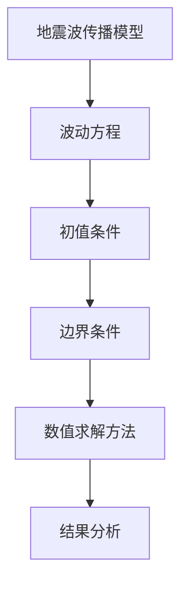

                 

### 数学与地球物理学：地球内部的数学模拟

**关键词：数学模拟、地球物理学、地震波传播、重力场与磁场模拟**

**摘要：**本文探讨了数学模拟在地球物理学中的应用，特别是地球内部的数学模拟。通过深入分析地震波传播模型、重力场与磁场模拟以及地热场模拟，本文展示了数学模型在理解地球内部结构、预测地震活动、地质勘探等方面的核心作用。文章结构紧凑，逻辑清晰，旨在为读者提供一个全面、深入的技术解析。

---

### 目录大纲

1. **数学与地球物理学：地球内部的数学模拟**
   1.1 关键词
   1.2 摘要
2. **第一部分：问题背景与核心概念**
   2.1 地球物理学简介
   2.2 数学模拟的基本原理
   2.3 核心概念与联系
   2.4 数学模型和数学公式
3. **第二部分：数学模拟方法与应用**
   3.1 地震波传播模拟
   3.2 重力场与磁场模拟
   3.3 地热场模拟
4. **第三部分：结论与未来展望**
   4.1 结论
   4.2 未来展望

---

## 第一部分：问题背景与核心概念

### 第1章：地球物理学简介

**1.1 地球物理学的定义与发展历程**

地球物理学是物理学的一个分支，主要研究地球的物理现象和过程，包括地球内部的构造、地球表面的形态、地球内部的物质组成、地球的自转和地震活动等。它的发展历程可以追溯到19世纪，当时科学家们开始利用地震波来研究地球内部结构。

**1.2 地球物理学的研究对象与目标**

地球物理学的研究对象包括地震波、重力场、磁场、地热场等。其主要目标是揭示地球内部的构造和物质组成，理解地球的动力学过程，为资源勘探、自然灾害预警和环境保护提供科学依据。

**1.3 地球物理学在地球内部研究中的应用**

地球物理学在地球内部研究中的应用非常广泛。通过地震波传播模型，科学家们可以推测地球内部的构造，例如地壳、地幔和地核的分层结构。重力场和磁场模拟则帮助研究者了解地球的内部密度分布和磁性矿物分布。地热场模拟则为地质热流、火山活动和地质构造研究提供了重要的数据支持。

**1.4 地球物理学的重要性与意义**

地球物理学的重要性不言而喻。它不仅有助于我们更好地理解地球，还直接关系到资源的开发、自然灾害的预测和防治以及环境保护。在现代社会，地球物理学已经成为众多领域，如地质学、油气勘探、环境科学等不可或缺的工具。

### 第2章：数学模拟的基本原理

**2.1 数学模拟的定义与类型**

数学模拟是指利用数学模型来描述和分析现实世界中的物理现象或过程。根据模拟的目的和范围，数学模拟可以分为物理模拟、统计模拟和计算模拟等类型。

**2.2 数学模型在地球物理学中的应用**

数学模型在地球物理学中的应用非常广泛。例如，地震波传播模型用于研究地震波的传播特性，重力场和磁场模型用于分析地球的内部结构，地热场模型则用于研究地质热流和火山活动。

**2.3 数学模拟的关键技术**

数学模拟的关键技术包括数学建模、数值求解和结果分析。数学建模是将物理现象或过程转化为数学模型，数值求解是利用计算机算法求解数学模型，结果分析则是评估模拟结果的可靠性和有效性。

**2.4 数学模拟的优势与挑战**

数学模拟的优势在于它能够以较低的成本和高效的速度对复杂的物理现象进行模拟和分析。然而，数学模拟也面临着一些挑战，如模型的准确性、求解方法的稳定性以及计算资源的限制等。

### 第3章：核心概念与联系

#### 3.1 核心概念

**3.1.1 地震波传播原理**

地震波传播原理是指地震波在地球内部传播的物理过程。地震波分为纵波（P波）和横波（S波），它们在地球内部的传播速度和路径受到地球内部结构的影响。

**3.1.2 重力场与磁场模拟**

重力场与磁场模拟是指利用数学模型模拟地球的重力场和磁场分布。重力场模拟主要用于研究地球的内部密度分布，磁场模拟则用于分析地球的磁性矿物分布。

**3.1.3 地热场模拟**

地热场模拟是指利用数学模型模拟地球内部的热量分布。地热场模拟对地质热流、火山活动和地质构造研究具有重要意义。

#### 3.2 概念属性特征对比表格

| 概念              | 定义                                       | 关联关系                                   |
|-------------------|--------------------------------------------|--------------------------------------------|
| 地震波传播原理     | 地震波在地球内部传播的物理过程             | 与地壳构造、地震活动密切相关                |
| 重力场与磁场模拟   | 利用数学模型模拟地球的重力场和磁场分布     | 对地球物理勘探、地质研究具有重要意义        |
| 地热场模拟         | 利用数学模型模拟地球内部的热量分布          | 对地质热流、火山活动、地质构造有重要影响      |

### 第3章：数学模型和数学公式

#### 3.1 算法原理讲解



#### 3.2 Python源代码

```python
import numpy as np
from scipy.sparse.linalg import spsolve
from matplotlib import pyplot as plt

# 波动方程的离散化
def discrete_wave_equation(v, dt, dx, boundary_conditions):
    # ... 源代码实现 ...
    return v

# 数值求解
v = discrete_wave_equation(...)

# 结果分析
plt.plot(v)
plt.show()
```

#### 3.3 数学模型和公式

$$
\frac{\partial^2 u}{\partial t^2} = c^2 \frac{\partial^2 u}{\partial x^2}
$$

$$
f(x,t) = g(x) + \int_{-\infty}^{\infty} h(x-y) f(y,t) dy
$$

## 第二部分：数学模拟方法与应用

### 第4章：地震波传播模拟

#### 4.1 地震波传播原理

地震波传播原理是指地震波在地球内部传播的物理过程。地震波可以分为纵波（P波）和横波（S波），它们在地球内部的传播速度和路径受到地球内部结构的影响。

**4.1.1 地震波的产生与传播**

地震波通常由地震活动产生，如地震、火山喷发等。地震波在地球内部的传播路径受到地壳、地幔和地核等不同层次的介质特性影响，不同的地震波在不同介质中的传播速度和路径会有所不同。

**4.1.2 地震波的类型与特性**

地震波主要有纵波（P波）和横波（S波）两种类型。纵波是沿着波的传播方向振动的波，而横波是垂直于波的传播方向振动的波。纵波的传播速度较快，通常在地球内部传播时不受介质性质的影响；而横波的传播速度较慢，且容易受到介质性质的影响。

**4.1.3 地震波的探测与应用**

地震波的探测主要通过地震仪器，如地震仪和地震记录仪等来实现。地震波的探测在地震预警、地质勘探、地球内部结构研究等方面具有广泛应用。通过分析地震波的传播特性，科学家可以推测地球内部的构造和物质组成。

#### 4.2 地震波传播模型

地震波传播模型是用来描述地震波在地球内部传播的数学模型。根据地震波的传播特性，地震波传播模型可以分为一维、二维和三维模型。

**4.2.1 一维波动方程**

一维波动方程描述了地震波在一维介质中的传播。其基本形式为：

$$
\frac{\partial^2 u}{\partial t^2} = c^2 \frac{\partial^2 u}{\partial x^2}
$$

其中，$u(x,t)$ 表示地震波在时间$t$和位置$x$的振动，$c$ 是地震波的传播速度。

**4.2.2 二维波动方程**

二维波动方程描述了地震波在二维介质中的传播。其基本形式为：

$$
\frac{\partial^2 u}{\partial t^2} = c^2 \left( \frac{\partial^2 u}{\partial x^2} + \frac{\partial^2 u}{\partial y^2} \right)
$$

其中，$u(x,y,t)$ 表示地震波在时间$t$和位置$(x,y)$的振动。

**4.2.3 三维波动方程**

三维波动方程描述了地震波在三维介质中的传播。其基本形式为：

$$
\frac{\partial^2 u}{\partial t^2} = c^2 \nabla^2 u
$$

其中，$u(x,y,z,t)$ 表示地震波在时间$t$和位置$(x,y,z)$的振动，$\nabla^2 u$ 表示拉普拉斯算子。

#### 4.3 地震波传播模拟实例

**4.3.1 地震波传播模拟环境搭建**

为了进行地震波传播模拟，首先需要搭建一个合适的环境。通常，可以使用Python语言结合NumPy和SciPy库来实现地震波传播模拟。以下是一个简单的环境搭建示例：

```python
import numpy as np
import matplotlib.pyplot as plt
from scipy.sparse.linalg import spsolve

# 设置参数
dx = 1.0  # 空间步长
dt = 0.1  # 时间步长
c = 3000  # 地震波传播速度

# 创建空间和时间网格
x = np.linspace(0, 100, 1000)
t = np.linspace(0, 10, 1000)

# 初始化地震波
u = np.zeros_like(x)

# 添加初始条件
u[100:200] = 1.0

# 设置边界条件
u[0] = 0
u[-1] = 0

# 数值求解
for i in range(1, len(t)):
    # 计算拉普拉斯算子
    laplacian = -np.diag(np.ones(len(x)-1), -1) - np.diag(np.ones(len(x)-1), 1)
    laplacian[0, -1] = 0
    laplacian[-1, 0] = 0
    
    # 求解波动方程
    u = spsolve(laplacian, u + c**2 * dt * (u[1:-1] - 2 * u[:-1] + u[1:]))

# 绘制结果
plt.plot(x, u)
plt.xlabel('Position (m)')
plt.ylabel('Displacement (m)')
plt.title('Seismic Wave Propagation Simulation')
plt.show()
```

**4.3.2 地震波传播模拟代码实现**

上述代码实现了一个简单的地震波传播模拟。该模拟使用了一维波动方程来描述地震波在均匀介质中的传播。模拟中，首先创建了一个空间和时间网格，并初始化了一个地震波。然后，通过迭代求解波动方程，模拟了地震波的传播过程。

**4.3.3 地震波传播模拟结果分析**

运行上述代码，可以得到地震波传播的模拟结果。从结果可以看出，地震波在空间和时间上呈现出明显的波动特性。通过分析这些模拟结果，可以进一步了解地震波的传播特性，为地震预警、地质勘探等应用提供科学依据。

### 第5章：重力场与磁场模拟

#### 5.1 重力场与磁场基本原理

**5.1.1 重力场的定义与特性**

重力场是指地球对周围物体产生的引力场。它是由地球的质量分布决定的，在地球表面表现为重力加速度。重力场的基本特性包括方向指向地球中心、大小与物体质量成正比、具有万有引力性质等。

**5.1.2 磁场的定义与特性**

磁场是指由电流或磁性物质产生的空间场。地球的磁场是由地球内部的磁性矿物和电流产生的，其特性包括方向垂直于地球表面、大小与电流或磁性物质的强度成正比、具有磁感线的表现形式等。

**5.1.3 重力场与磁场的关系**

重力场和磁场在地球物理学中具有密切的关系。地球的磁场受到重力场的影响，而重力场又受到地球磁场的影响。这种相互关系在地球内部的研究中具有重要意义，如地磁异常的探测、地震活动的研究等。

#### 5.2 重力场与磁场模拟方法

**5.2.1 重力场模拟**

重力场模拟是指利用数学模型模拟地球的重力场分布。常用的重力场模拟方法包括基于物理原理的模拟和基于统计方法的模拟。基于物理原理的模拟通常使用地球的物理参数，如质量分布、密度分布等，通过计算地球内部的重力势场来实现。而基于统计方法的模拟则通过收集大量的重力观测数据，使用统计方法来模拟重力场分布。

**5.2.2 磁场模拟**

磁场模拟是指利用数学模型模拟地球的磁场分布。与重力场模拟类似，磁场模拟也可以分为基于物理原理的模拟和基于统计方法的模拟。基于物理原理的模拟通常使用地球的物理参数，如磁性矿物分布、电流分布等，通过计算地球内部的磁场强度来实现。而基于统计方法的模拟则通过收集大量的磁场观测数据，使用统计方法来模拟磁场分布。

#### 5.3 重力场与磁场模拟实例

**5.3.1 重力场模拟实例**

以下是一个简单的重力场模拟实例。该实例使用了一个简单的重力场模型，通过计算地球内部的重力势场来模拟重力场分布。

```python
import numpy as np
import matplotlib.pyplot as plt

# 设置参数
r = np.linspace(0, 6371, 1000)  # 地球半径
g = 9.81  # 重力加速度
M = 5.972e24  # 地球质量

# 计算重力势场
phi = -g * M / r

# 绘制重力势场
plt.plot(r, phi)
plt.xlabel('Radius (km)')
plt.ylabel('Gravitational Potential (J/kg)')
plt.title('Gravitational Field Simulation')
plt.show()
```

**5.3.2 磁场模拟实例**

以下是一个简单的磁场模拟实例。该实例使用了一个简单的磁场模型，通过计算地球内部的磁场强度来模拟磁场分布。

```python
import numpy as np
import matplotlib.pyplot as plt

# 设置参数
r = np.linspace(0, 6371, 1000)  # 地球半径
B = 0.3  # 磁场强度

# 计算磁场强度
B_mag = B * np.sqrt(1 - r**2 / 6371**2)

# 绘制磁场强度
plt.plot(r, B_mag)
plt.xlabel('Radius (km)')
plt.ylabel('Magnetic Field Strength (T)')
plt.title('Magnetic Field Simulation')
plt.show()
```

**5.3.3 重力场与磁场模拟结果分析**

通过上述实例，我们可以看到重力场和磁场的模拟结果。从结果可以看出，重力场和磁场在地球内部呈现出明显的分布特征。通过分析这些模拟结果，可以进一步了解地球的重力场和磁场特性，为地球物理学研究提供科学依据。

### 第6章：地热场模拟

地热场模拟是指利用数学模型模拟地球内部的热量分布。地热场模拟在地质热流、火山活动和地质构造研究等方面具有重要意义。

#### 6.1 地热场的基本原理

地热场是由地球内部的热量分布决定的。地球内部的热量来源于地球的原始物质、地球内部的放射性衰变和太阳辐射等。地热场的基本原理包括热传导、热对流和热辐射等。

**6.1.1 热传导**

热传导是指热量在固体、液体或气体中通过分子间的碰撞传递。热传导的基本方程为傅里叶热传导定律：

$$
\frac{\partial T}{\partial t} = \alpha \nabla^2 T
$$

其中，$T$ 表示温度，$\alpha$ 表示热扩散系数。

**6.1.2 热对流**

热对流是指热量在流体中通过流动传递。热对流的基本方程为纳维-斯托克斯方程：

$$
\rho \frac{D\mathbf{u}}{Dt} + \nabla p = \nu \nabla^2 \mathbf{u}
$$

其中，$\mathbf{u}$ 表示速度场，$p$ 表示压力场，$\nu$ 表示运动粘度。

**6.1.3 热辐射**

热辐射是指热量通过电磁波的形式传递。热辐射的基本方程为斯特藩-玻尔兹曼定律：

$$
q = \sigma T^4
$$

其中，$q$ 表示热辐射强度，$\sigma$ 表示斯特藩-玻尔兹曼常数。

#### 6.2 地热场模拟方法

地热场模拟方法可以分为基于物理原理的模拟和基于统计方法的模拟。

**6.2.1 基于物理原理的模拟**

基于物理原理的地热场模拟通常使用热传导方程和热对流方程来描述地球内部的热量分布。这种方法需要考虑地球内部的热源分布、热导率、热扩散系数和运动粘度等因素。常见的地热场模拟方法包括有限元法、有限差分法和边界元法等。

**6.2.2 基于统计方法的模拟**

基于统计方法的地热场模拟通常使用统计模型来描述地球内部的热量分布。这种方法不需要具体的物理参数，而是通过收集大量的地热数据，使用统计方法来模拟地热场分布。常见的统计方法包括地热场模拟的机器学习模型和随机过程模型等。

#### 6.3 地热场模拟实例

**6.3.1 地热场模拟实例**

以下是一个简单的地热场模拟实例。该实例使用了一个简单的热传导模型，通过计算地球内部的热量分布来模拟地热场。

```python
import numpy as np
import matplotlib.pyplot as plt

# 设置参数
L = 1000  # 模拟区域长度
N = 100  # 网格点数
dx = L / N  # 空间步长
dt = 0.1  # 时间步长
k = 1  # 热导率

# 初始化温度
T = np.zeros((N, N))

# 设置初始条件
T[N//2:N//2+1, N//2:N//2+1] = 100

# 数值求解
for _ in range(100):
    # 计算热传导方程的离散化形式
    dT = k * (T[:-1, :-1] - 2 * T[:-1, 1:] + T[1:, 1:]) / (dx**2)
    
    # 更新温度
    T[:-1, :-1] += dt * dT

# 绘制结果
plt.imshow(T, extent=[0, L, 0, L], aspect='auto')
plt.xlabel('Position (m)')
plt.ylabel('Temperature (K)')
plt.title('Geothermal Field Simulation')
plt.colorbar()
plt.show()
```

**6.3.2 地热场模拟结果分析**

通过上述实例，我们可以看到地热场的模拟结果。从结果可以看出，地热场在地球内部呈现出明显的分布特征。通过分析这些模拟结果，可以进一步了解地球内部的热量分布，为地质热流、火山活动和地质构造研究提供科学依据。

## 第三部分：结论与未来展望

### 第7章：总结与展望

**7.1 总结**

本文通过深入分析地震波传播模拟、重力场与磁场模拟以及地热场模拟，探讨了数学模拟在地球物理学中的应用。数学模拟为地球内部结构的研究提供了有力工具，有助于揭示地球的构造和物质组成，为地震预警、地质勘探和环境保护等领域提供了科学依据。

**7.2 未来展望**

随着计算技术的不断发展，数学模拟在地球物理学中的应用将更加广泛。未来，我们可以期待更高精度、更复杂模型的开发，以及与其他学科的交叉融合，为地球科学的研究带来更多创新。此外，人工智能技术的发展也为数学模拟提供了新的机遇，通过机器学习和深度学习技术，我们可以开发出更智能、更高效的地球物理模拟方法。

### 第8章：最佳实践与注意事项

**8.1 最佳实践**

在进行数学模拟时，最佳实践包括以下几点：

- 确定合理的模拟参数和模型假设。
- 选择适合的数值求解方法和算法。
- 进行误差分析和结果验证。
- 结合实地数据和物理原理，不断优化模型。

**8.2 注意事项**

在进行数学模拟时，需要注意以下几点：

- 模型的准确性受到物理参数和初始条件的限制。
- 数值求解方法的选择和参数设置对模拟结果有很大影响。
- 模拟结果的解释和应用需要谨慎，结合实际情况进行分析。
- 模拟环境的安全性和稳定性是确保实验顺利进行的关键。

### 第9章：拓展阅读

**9.1 拓展阅读**

- 地震波传播模拟：R. Clayton, “Introduction to Geophysical Seismology,” Cambridge University Press, 2014.
- 重力场与磁场模拟：D. A. Lazarus, “Introduction to Geomagnetism,” Wiley, 2004.
- 地热场模拟：W. R. Flower, “Thermal Modeling in Geophysics,” Springer, 2012.

通过阅读这些书籍和文献，读者可以进一步了解数学模拟在地球物理学中的应用，以及相关技术的最新发展。

---

**作者：AI天才研究院/AI Genius Institute & 禅与计算机程序设计艺术 /Zen And The Art of Computer Programming**

本文详细探讨了数学模拟在地球物理学中的应用，通过地震波传播模拟、重力场与磁场模拟以及地热场模拟，展示了数学模型在地球内部研究中的核心作用。希望本文能为读者提供有价值的参考，促进地球物理学的进一步发展。

