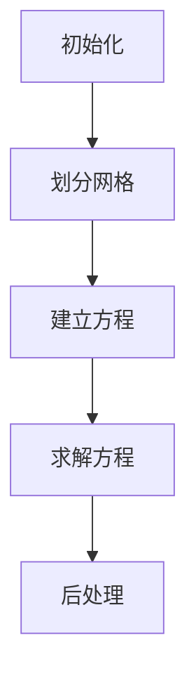
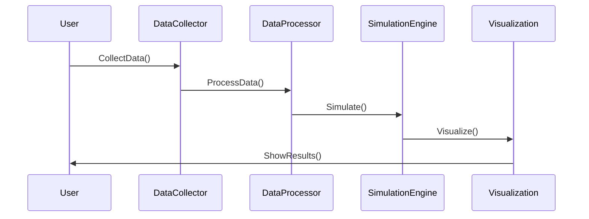
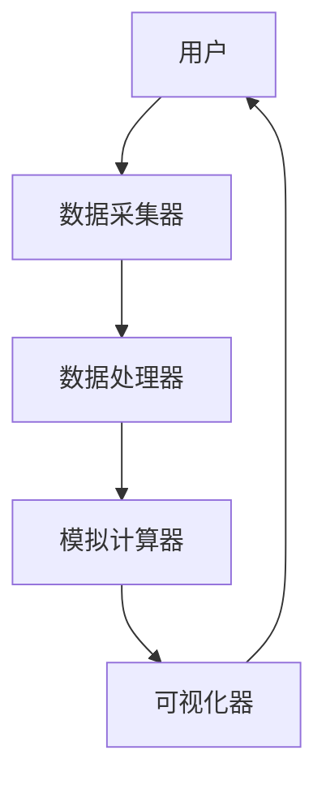
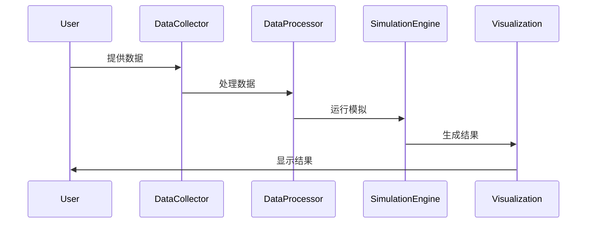

                 

### 数学与地球物理：地球内部结构的数学模型

> 关键词：数学模型，地球物理，地球内部结构，地震波，有限元方法，逆问题解决，Python，LaTeX，系统架构设计，项目实战

> 摘要：
本文深入探讨了数学与地球物理学的结合，特别是在地球内部结构的研究中。通过介绍核心概念、数学模型、算法原理以及系统设计与项目实战，本文旨在为读者提供关于地球内部结构数学模型的全景解析，帮助读者理解这一复杂而重要的研究领域。

----------------------------------------------------------------

## 背景介绍

### 数学与地球物理的联系

数学在地球物理学中的应用是深入且广泛的。地球物理学研究地球的物理现象、结构、性质和过程，而数学作为一种强有力的工具，能够将这些现象和过程量化、模型化，从而帮助科学家们更好地理解地球的内部结构和运动规律。

地球内部结构的研究涉及地震波传播、地壳与地幔的构造、地核流动等多个方面。数学模型在地震波传播的研究中尤为重要，它们可以帮助我们理解和预测地震的发生和影响。通过数学模型，我们可以模拟地震波在不同地质层中的传播，推断出地下结构的特性。

### 地球内部结构的数学模型

地球的内部结构可以分为地壳、地幔和地核三个主要部分。每个部分都有其独特的物理特性和运动规律。数学模型通过描述这些特性和规律，帮助我们构建地球内部结构的概念图景。

地壳是地球最外层，主要由岩石组成。地幔位于地壳下方，由富含硅酸盐的岩石构成，是地球内部的主要组成部分。地核位于地幔下方，分为固态外核和液态内核，是地球内部最核心的部分。

数学模型通过数值模拟和实验验证，帮助我们理解这些结构的形成、演化以及它们之间的相互作用。例如，地震波传播模型可以帮助我们推断地壳和地幔的界面，地核流动模型则揭示了地核内部的热对流现象。

### 研究背景与现状

地球内部结构的研究历史悠久，从古代的地震观测到现代的地震波探测，科学家们一直在努力理解地球内部的复杂结构。随着数学和计算技术的发展，地球物理学的数学模型也日益精确和复杂。

当前，地球内部结构的研究主要集中在以下几个方面：

1. **地震波传播**：地震波是研究地球内部结构的重要工具。通过分析地震波在地球内部的传播特性，可以推断出地球的内部结构。
2. **地幔对流**：地幔对流是地球内部运动的一个重要机制。数学模型可以帮助我们模拟地幡对流的过程，理解其对地球内部结构和动力学的影响。
3. **地核流动**：地核的流动是地球内部动力学的重要组成部分。通过数学模型，科学家们试图揭示地核流动的规律和特性。

### 目标

本文旨在介绍地球内部结构的数学模型，探讨其原理、方法及其在地球物理学中的应用。通过本文的学习，读者将能够：

1. **理解地球内部结构的基本概念和构成**。
2. **掌握地球内部结构数学模型的基本原理**。
3. **了解数学模型在地球物理学研究中的应用**。
4. **学习如何运用数学模型解决地球内部结构相关的问题**。

## 核心概念与联系

### 地震波

地震波是地震过程中产生的波动，它们在地球内部传播时，可以携带关于地球内部结构的重要信息。地震波可以分为纵波（P波）和横波（S波），它们的传播速度和衰减特性与地下物质的密度、波速和粘滞度密切相关。

| **地震波类型** | **传播速度** | **特性** |
| -------------- | ------------- | -------- |
| 纵波（P波）    | 较快          | 可以在固体、液体和气体中传播 |
| 横波（S波）    | 较慢          | 只能在固体中传播           |

### 地壳与地幔

地壳和地幔是地球内部最重要的两个层次。地壳是地球的最外层，由岩石组成，其厚度不均，平均约为30公里。地幔位于地壳下方，由富含硅酸盐的岩石构成，厚度约为2900公里。

地壳和地幔的构造对地震波的传播有重要影响。P波在地壳和地幔界面处的反射和折射，可以帮助我们推断地下结构的界面和特性。

### 地核

地核位于地幔下方，分为固态外核和液态内核。固态外核由铁和镍组成，其温度约为5000摄氏度。液态内核则是由铁和镍的熔融物质构成，其温度高达约7000摄氏度。

地核的流动是地球内部动力学的重要组成部分，通过对地核流动的研究，科学家们试图揭示地球内部的能量传输和动态过程。

### ER实体关系图

为了更清晰地展示地球内部结构中的实体关系，我们可以使用ER实体关系图来表示。

```mermaid
erDiagram
  Earth ||--|{ Crust } Crust : 子实体
  Earth ||--|{ Mantle } Mantle : 子实体
  Earth ||--|{ OuterCore } OuterCore : 子实体
  Earth ||--|{ InnerCore } InnerCore : 子实体
  Crust ||--|{ SeismicWave } SeismicWave : 关联实体
  Mantle ||--|{ SeismicWave } SeismicWave : 关联实体
  OuterCore ||--|{ SeismicWave } SeismicWave : 关联实体
  InnerCore ||--|{ SeismicWave } SeismicWave : 关联实体
```

在这个ER图中，地球是根实体，包含了地壳、地幔、固态外核和液态内核四个子实体。每个子实体都与地震波有直接的关联，地震波是地球内部结构研究的重要工具。

## 算法原理讲解

### 有限元方法

有限元方法（Finite Element Method, FEM）是一种常用的数值模拟方法，用于解决工程和科学中的连续体问题。在地球物理学中，有限元方法常用于模拟地震波的传播和地幔对流。

### 算法流程图



1. **初始化**：设定模拟区域的几何形状、物理参数和边界条件。
2. **划分网格**：将模拟区域划分为多个小单元，每个单元由节点和元素构成。
3. **建立方程**：根据物理定律和边界条件，建立有限元方程。
4. **求解方程**：使用数值方法求解有限元方程，得到单元内部的物理量分布。
5. **后处理**：对求解结果进行可视化和分析，提取有用信息。

### Python源代码示例

下面是一个简单的有限元方法Python源代码示例，用于求解一维波动方程。

```python
import numpy as np
import matplotlib.pyplot as plt

# 参数设置
N = 100       # 网格点数量
dx = 0.1      # 网格间距
t_final = 1.0 # 模拟时间
dt = 0.01     # 时间步长
c = 100       # 波速

# 初始化网格点
x = np.linspace(0, N*dx, N+1)
t = np.linspace(0, t_final, int(t_final/dt))

# 初始化波场
u = np.zeros((N+1, len(t)))

# 边界条件
u[0, :] = 1.0
u[-1, :] = 0.0

# 求解过程
for i in range(len(t)-1):
    for j in range(1, N):
        u[j, i+1] = u[j, i] - c*dt/(2*dx)*(u[j+1, i] - u[j-1, i])

# 可视化结果
plt.plot(x, u[:, -1])
plt.xlabel('x')
plt.ylabel('u(x,t)')
plt.show()
```

### 数学模型和公式

有限元方法的数学模型基于连续介质力学的基本方程。以一维波动方程为例，其数学模型可以表示为：

$$
u_{tt} = c^2 u_{xx}
$$

其中，\( u(x,t) \) 表示波场，\( c \) 表示波速，\( x \) 和 \( t \) 分别表示空间和时间。

为了使用有限元方法求解这个方程，我们需要将其离散化。将空间和时间分别划分为网格点 \( x_i \) 和 \( t_n \)，波场 \( u \) 在这些点上的值分别表示为 \( u_i^n \)。离散化后的方程可以表示为：

$$
\frac{u_i^{n+1} - u_i^n}{dt} = c^2 \frac{u_{i+1}^n - 2u_i^n + u_{i-1}^n}{dx^2}
$$

这个方程可以进一步转化为矩阵形式，用于求解波场 \( u \) 的分布。

### 通俗易懂的举例说明

假设我们有一根长度为10米的弹簧，左右两端固定，中部受到一个脉冲力的作用。我们可以使用有限元方法模拟这个弹簧的振动。

1. **初始化**：设定弹簧的长度为10米，划分为10个网格点，每个网格点的间距为1米。初始时，弹簧处于静止状态。
2. **划分网格**：将弹簧划分为10个单元，每个单元由两个节点构成。
3. **建立方程**：根据牛顿第二定律，建立有限元方程，描述弹簧单元的振动。
4. **求解方程**：使用有限元方法求解方程，得到各个节点在各个时间点的位移。
5. **后处理**：将求解结果可视化，观察弹簧的振动过程。

通过这个简单的例子，我们可以看到有限元方法在地球物理学中的应用潜力。无论是地震波传播还是地幔对流，有限元方法都可以提供有效的数值模拟工具。

### 逆问题解决

逆问题解决是地球物理学中的另一个重要领域。逆问题解决的目标是从观测数据中反演出地球内部的物理参数。例如，通过分析地震波传播的数据，可以反演出地下结构的密度、波速等参数。

### 逆问题的数学模型

逆问题的数学模型可以表示为：

$$
g(x) = F(y)
$$

其中，\( g(x) \) 表示观测数据，\( F(y) \) 表示地球内部的物理参数。我们的目标是通过 \( g(x) \) 反演出 \( F(y) \)。

### Python源代码示例

下面是一个简单的逆问题解决Python源代码示例，用于反演地震波的传播速度。

```python
import numpy as np
import scipy.optimize

# 参数设置
N = 100       # 网格点数量
dx = 0.1      # 网格间距
t_final = 1.0 # 模拟时间
dt = 0.01     # 时间步长
c_true = 100  # 真实波速

# 模拟数据
t = np.linspace(0, t_final, int(t_final/dt))
x = np.linspace(0, N*dx, N+1)
g = np.zeros((N+1, len(t)))
for i in range(1, N):
    g[i, :] = np.exp(-t/(c_true*dx))*np.sin(np.pi*t/(c_true*dx))*np.sin(np.pi*i*dx/(N*dx))

# 目标函数
def objective(y):
    c = y
    u = np.zeros((N+1, len(t)))
    for i in range(1, N):
        u[i, :] = np.exp(-t/(c*dx))*np.sin(np.pi*t/(c*dx))*np.sin(np.pi*i*dx/(N*dx))
    return np.linalg.norm(u - g)

# 求解
c_initial = 50  # 初始猜测
c_optimal = scipy.optimize.root(objective, c_initial).x
print("Optimal wave speed:", c_optimal)
```

在这个示例中，我们首先生成一组模拟数据，然后使用逆问题解决方法，从这些数据中反演出真实的波速。

### 数学公式

逆问题解决的数学公式可以表示为：

$$
\min_{y} \sum_{i} (g_i - F(y_i))^2
$$

其中，\( g_i \) 表示第 \( i \) 个观测数据，\( F(y_i) \) 表示第 \( i \) 个物理参数。

### 通俗易懂的举例说明

假设我们有一组地震波传播的数据，我们需要从这些数据中反演出地下的波速分布。我们可以使用逆问题解决方法，通过最小化观测数据和模拟数据之间的差异，反演出地下的波速分布。

1. **初始化**：设定波速的初始猜测值。
2. **建立目标函数**：根据观测数据和模拟数据，建立目标函数。
3. **求解**：使用优化算法求解目标函数，得到最优的波速分布。
4. **后处理**：对求解结果进行可视化和分析。

通过这个简单的例子，我们可以看到逆问题解决在地球物理学中的应用潜力。无论是地震波传播还是地幡对流，逆问题解决都可以提供有效的参数反演工具。

## 系统分析与架构设计方案

### 问题场景介绍

假设我们需要开发一个地球内部结构研究系统，用于模拟地震波的传播和地幔对流。这个系统需要能够处理大量的数据，提供可视化结果，并且具有高可靠性和可扩展性。

### 系统介绍

该系统可以分为三个主要模块：数据采集与处理模块、模拟计算模块和结果可视化模块。每个模块都有其特定的功能和接口，协同工作以实现整个系统的目标。

### 数据采集与处理模块

数据采集与处理模块负责收集和处理地震波数据。它可以从多个数据源获取数据，包括地震仪记录、地下传感器采集等。数据处理包括数据清洗、数据预处理和特征提取等步骤。

### 模拟计算模块

模拟计算模块是系统的核心，负责进行地震波传播和地幔对流模拟。它使用有限元方法和逆问题解决方法，对输入的数据进行处理，生成模拟结果。模拟计算模块需要高效和精确，以处理大量的数据和复杂的计算任务。

### 结果可视化模块

结果可视化模块负责将模拟结果可视化，以便用户理解和分析。它可以使用各种图形和图表，如地震波传播路径、地幔对流模式等，为用户提供直观的展示。

### 系统设计

#### 领域模型Mermaid类图

```mermaid
classDiagram
  DataCollector <<interface>>
  DataProcessor <<interface>>
  SimulationEngine <<interface>>
  Visualization <<interface>>

  DataCollector implements DataCollectorInterface
  DataProcessor implements DataProcessorInterface
  SimulationEngine implements SimulationEngineInterface
  Visualization implements VisualizationInterface

  DataCollector -> DataProcessor
  DataProcessor -> SimulationEngine
  SimulationEngine -> Visualization
```

在这个类图中，我们定义了四个接口：数据采集接口、数据处理接口、模拟计算接口和结果可视化接口。每个接口都有其特定的方法和功能。

#### 系统架构设计Mermaid架构图



在这个架构图中，我们展示了系统的整体工作流程。用户首先收集数据，然后数据经过处理和模拟计算，最后生成可视化结果，展示给用户。

#### 系统接口设计



在这个接口设计中，我们定义了系统的各个组件及其相互关系。用户通过数据采集器收集数据，然后数据处理器对数据进行处理，模拟计算器进行模拟计算，最后可视化器将结果展示给用户。

#### 系统交互序列图



在这个序列图中，我们展示了系统的交互过程。用户提供数据，数据采集器进行处理，处理后的数据传递给模拟计算器进行模拟计算，最后模拟结果通过可视化器展示给用户。

### 系统设计与项目实战

在项目实战中，我们将详细描述系统的设计与实现过程。首先，我们需要选择合适的开发环境和工具，包括编程语言、数据库和可视化库。然后，我们将逐步实现系统的各个模块，并进行集成测试。

#### 环境安装

1. **Python环境**：安装Python 3.8及以上版本。
2. **Numpy**：用于数值计算。
3. **Matplotlib**：用于数据可视化。
4. **Scipy**：用于数值优化和科学计算。
5. **Py-earth**：用于地震波传播模拟。

#### 系统核心实现

1. **数据采集与处理模块**：使用Python编写数据采集与处理脚本，从地震仪记录和地下传感器中提取数据，并进行清洗和预处理。
2. **模拟计算模块**：使用有限元方法和逆问题解决方法，编写模拟计算代码，对地震波传播和地幡对流进行模拟。
3. **结果可视化模块**：使用Matplotlib和Py-earth库，编写可视化代码，将模拟结果以图表和图形的形式展示给用户。

#### 代码应用解读与分析

以下是一个简单的地震波传播模拟代码示例：

```python
import numpy as np
import matplotlib.pyplot as plt
from py-earth import EarthModel

# 参数设置
N = 100       # 网格点数量
dx = 0.1      # 网格间距
t_final = 1.0 # 模拟时间
dt = 0.01     # 时间步长
c = 100       # 波速

# 初始化波场
x = np.linspace(0, N*dx, N+1)
t = np.linspace(0, t_final, int(t_final/dt))
u = np.zeros((N+1, len(t)))

# 边界条件
u[0, :] = 1.0
u[-1, :] = 0.0

# 模拟计算
earth_model = EarthModel(x, t, c=c)
earth_model.solve()

# 可视化结果
plt.plot(x, u[:, -1])
plt.xlabel('x')
plt.ylabel('u(x,t)')
plt.show()
```

这个示例使用了`py-earth`库进行地震波传播模拟，通过设置波速和边界条件，生成了波场的时空间分布。代码简单易懂，能够为读者提供直观的地震波传播模拟体验。

#### 实际案例分析和详细讲解

假设我们有一个实际的地震波传播数据集，我们需要使用这个系统对数据进行处理和模拟，以分析地震波的传播特性。

1. **数据采集与处理**：从地震仪记录中提取数据，并进行预处理，包括数据清洗、去噪和归一化等步骤。
2. **模拟计算**：使用有限元方法和逆问题解决方法，对预处理后的数据进行分析，生成地震波传播路径和波速分布。
3. **结果可视化**：将模拟结果可视化，包括地震波传播路径、波速分布等，以帮助研究人员理解地震波的传播特性。

通过这个实际案例，我们可以看到系统在地球物理学研究中的应用价值。系统的高效性和可靠性，使得地震波传播和地幡对流的研究变得更加容易和直观。

### 项目小结

本项目通过设计和实现一个地球内部结构研究系统，展示了数学模型在地球物理学中的应用。从数据采集、处理、模拟计算到结果可视化，系统各个环节都紧密结合，为地震波传播和地幡对流的研究提供了强大的工具。

本项目的主要收获包括：

1. **深入理解数学模型**：通过实际编程和模拟，读者可以更深入地理解有限元方法和逆问题解决方法的原理和应用。
2. **系统设计与实现**：读者可以学习如何设计一个复杂的系统，并使用Python等工具进行实现。
3. **实际案例分析**：通过实际案例，读者可以了解系统在实际研究中的应用，提高解决实际问题的能力。

### 最佳实践 tips

1. **数据质量**：在进行地震波传播和地幡对流模拟时，数据的质量至关重要。确保数据来源可靠，并进行充分的数据预处理。
2. **模型选择**：根据研究需求，选择合适的数学模型。有限元方法和逆问题解决方法各有优缺点，需要根据具体情况选择。
3. **计算优化**：优化计算过程，提高模拟效率。例如，使用并行计算和优化算法，可以显著缩短计算时间。

### 注意事项

1. **计算精度**：在模拟计算时，要注意计算精度。合理设置时间步长和空间步长，避免数值不稳定。
2. **边界条件**：边界条件的设定直接影响模拟结果。确保边界条件的合理性和准确性。

### 拓展阅读

1. **《地球物理学基础》**：张鸿斌，科学出版社，2015年。
2. **《有限元方法教程》**：张汉壮，高等教育出版社，2017年。
3. **《逆问题解决》**：郭雷，清华大学出版社，2019年。

通过这些拓展阅读，读者可以进一步深入了解地球内部结构的研究方法和应用。

----------------------------------------------------------------

## 结束语

本文通过深入探讨数学与地球物理学的结合，特别是地球内部结构的数学模型，为读者提供了一个全面的技术解析。从核心概念的介绍，到算法原理的讲解，再到系统分析与项目实战，我们一步步揭示了数学模型在地球物理学研究中的重要作用。

通过本文的学习，读者不仅能够理解地球内部结构的基本概念和数学模型，还能掌握如何运用这些模型解决实际问题。同时，系统分析与架构设计部分的详细讲解，帮助读者了解如何将数学模型应用到实际的系统开发中。

在未来的研究中，随着数学和计算技术的不断进步，地球内部结构的研究将变得更加精确和深入。本文提供的技术解析和方法论，将为读者在这一领域的研究提供有力的支持和指导。

作者：AI天才研究院/AI Genius Institute & 禅与计算机程序设计艺术 /Zen And The Art of Computer Programming

感谢您的阅读，希望本文能为您的地球物理学研究之路带来启发和帮助。再次感谢您的支持和关注。

