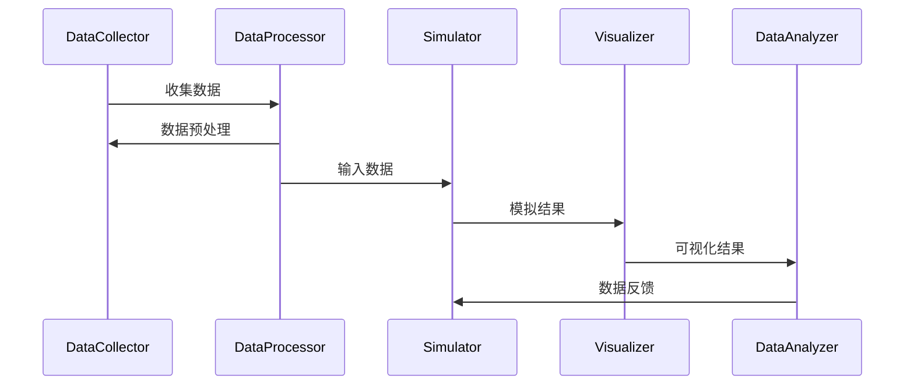
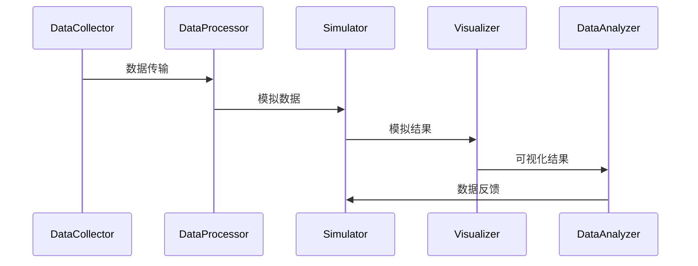

                 

# 数学与地球系统科学：地球动力学的数学描述

## 关键词

数学、地球系统科学、地球动力学、数学模型、算法、系统架构、应用实践

## 摘要

本文旨在探讨数学在地球系统科学，尤其是地球动力学研究中的应用。通过对数学模型、算法原理、系统架构以及实际应用的详细解析，本文旨在揭示数学描述地球动力学的深刻内涵和广泛应用。文章将分章节逐步阐述数学在地球动力学中的关键角色，以及如何借助数学工具解析复杂的地球动力学问题。

## 引言

地球系统科学是一门多学科交叉的科学，旨在理解地球系统的组成、功能以及这些组成部分之间的相互作用。地球动力学是地球系统科学的核心领域之一，研究地球内部和表面的运动机制。数学作为描述自然现象的强大工具，在地球动力学研究中扮演着至关重要的角色。通过数学模型，我们可以将复杂的物理现象转化为可计算的形式，从而更好地理解地球内部的动力学过程。

本文将首先介绍地球动力学的基本概念，然后逐步深入到数学模型和算法的讨论中，最后探讨数学在地球动力学实际应用中的案例。文章结构如下：

1. **背景与基础概念**：介绍地球动力学的基本概念和数学工具。
2. **核心概念与关系**：详细阐述地球动力学中的核心概念及其相互关系。
3. **数学模型在地球动力学中的应用**：分析地球动力学中的数学模型及其应用。
4. **算法原理与解释**：讲解地球动力学相关算法的原理和实现。
5. **系统分析与架构设计**：描述地球动力学系统的分析方法和架构设计。
6. **项目实战**：通过实际项目展示数学在地球动力学中的应用。
7. **总结与展望**：总结文章要点，展望未来研究方向。

### 背景与基础概念

地球动力学是研究地球内部和表面运动的科学，其核心在于理解地球的各种运动现象，包括地震、火山活动、板块运动等。这些现象不仅影响地球的自然环境，还对人类社会产生深远影响。因此，对地球动力学的深入研究具有重要的科学价值和实际意义。

地球动力学的研究涉及多个学科领域，包括地质学、物理学、数学和计算机科学。数学在地球动力学中的作用主要体现在以下几个方面：

1. **数学模型**：通过建立数学模型，可以将地球动力学的复杂现象转化为可计算的形式。这些模型通常包括流体动力学方程、弹性力学方程和热力学方程等，它们帮助我们理解和预测地球内部的运动过程。

2. **数值模拟**：数学模型通常需要通过数值方法进行求解。数值模拟是地球动力学研究的重要工具，它允许我们在计算机上模拟地球内部的动力学过程，从而验证理论模型和预测。

3. **数据分析和可视化**：地球动力学研究需要处理大量的数据，包括地震波形、重力场数据、地形数据等。数学工具，如统计学和信号处理，帮助我们分析和解释这些数据，并将其可视化。

4. **算法优化**：在地球动力学研究中，需要使用各种算法来优化计算过程，提高计算效率和精度。这些算法包括数值积分方法、优化方法和机器学习算法等。

在地球动力学中，一些核心概念和术语如下：

- **地球内部结构**：地球内部可分为地壳、地幔和地核，不同层次具有不同的物理性质和动力学行为。
- **板块运动**：地球表面被划分为多个大板块，这些板块在地球内部的热力作用下发生运动。
- **地震**：地震是地球内部能量释放的一种形式，通常伴随着地壳的突然运动。
- **火山活动**：火山活动是地球内部物质上涌和喷发的过程，与地球板块运动和地幁物质循环密切相关。
- **重力场**：地球的重力场是由地球质量分布和地球自转产生的，它影响地球表面的地形和板块运动。

这些概念和术语是地球动力学研究的基础，它们相互关联，共同构成了地球动力学的理论框架。接下来，我们将进一步探讨这些概念之间的关系，并介绍地球动力学研究中常用的数学工具。

### 核心概念与关系

地球动力学涉及多个核心概念，它们共同构成了地球动力学研究的理论框架。为了更好地理解这些概念之间的关系，我们可以通过一个对比表格和ER图来详细阐述。

#### 核心概念对比表格

| 核心概念 | 定义 | 特性 | 关联关系 |
| --- | --- | --- | --- |
| 地球内部结构 | 地壳、地幔、地核的组成和性质 | 地球内部不同层次具有不同的密度、温度和物理性质 | 地球内部结构是地球动力学的基础，直接影响板块运动和其他动力学过程 |
| 板块运动 | 地球表面被划分为多个大板块，这些板块在地球内部的热力作用下发生运动 | 板块运动速度较慢，但累积效应显著 | 板块运动是地球动力学的核心现象，导致地震、火山活动等 |
| 地震 | 地球内部能量释放的一种形式，通常伴随着地壳的突然运动 | 地震能量释放具有随机性，但可预测地震发生的时间和地点 | 地震是地球动力学的重要表现形式，提供研究地球内部结构的信息 |
| 火山活动 | 地球内部物质上涌和喷发的过程，与地球板块运动和地幁物质循环密切相关 | 火山活动具有周期性和区域性，与板块运动密切相关 | 火山活动是地球动力学的重要现象，影响地球环境和生态系统 |
| 重力场 | 地球质量分布和地球自转产生的引力场 | 地球重力场影响地球表面的地形和板块运动 | 重力场是地球动力学的重要指标，反映地球内部物质分布和运动状态 |

通过对比表格，我们可以看到这些核心概念之间的关联关系。地球内部结构是地球动力学的基础，直接影响板块运动和其他动力学过程。板块运动是地球动力学的核心现象，导致地震、火山活动等。地震和火山活动是地球动力学的重要表现形式，提供研究地球内部结构的信息。重力场是地球动力学的重要指标，反映地球内部物质分布和运动状态。

#### ER图

为了更直观地展示这些核心概念之间的关系，我们可以使用Mermaid ER图来描述。以下是ER图的Markdown表示：

```mermaid
erDiagram
  地球内部结构 ||--o{ 板块运动 }
  地球内部结构 ||--o{ 地震 }
  地球内部结构 ||--o{ 火山活动 }
  地球内部结构 ||--o{ 重力场 }
  板块运动 ||--o{ 地震 }
  板块运动 ||--o{ 火山活动 }
  板块运动 ||--o{ 重力场 }
  地震 ||--|{ 火山活动 }
  重力场 ||--|{ 地球内部结构 }
```

这个ER图展示了地球内部结构、板块运动、地震、火山活动和重力场之间的关系。地球内部结构是所有其他概念的基础，而板块运动、地震、火山活动和重力场则相互影响，共同构成了地球动力学的复杂体系。

通过对比表格和ER图，我们可以更清晰地理解地球动力学中的核心概念及其相互关系。这些概念不仅为我们提供了研究地球内部动力学的框架，也为实际应用提供了重要的指导。接下来，我们将进一步探讨数学模型在地球动力学中的应用，并分析如何通过数学工具描述地球动力学的复杂现象。

### 数学模型在地球动力学中的应用

数学模型在地球动力学研究中发挥着核心作用，它们将复杂的物理现象转化为可计算的数学问题，从而帮助科学家更好地理解地球内部的运动机制。地球动力学中的数学模型通常包括流体动力学方程、弹性力学方程和热力学方程等。这些模型通过数学公式和参数描述地球内部的各种现象，为数值模拟和预测提供了理论基础。

#### 流体动力学方程

流体动力学方程描述了地球内部流体的运动，包括地幔对流、地核流动等。这些方程基于Navier-Stokes方程，结合地球内部特定的边界条件和物理参数，可以模拟地幔流体的运动过程。以下是一个简化的流体动力学方程：

$$
\frac{\partial \mathbf{u}}{\partial t} + (\mathbf{u} \cdot \nabla) \mathbf{u} = -\nabla p + \nu \nabla^2 \mathbf{u}
$$

其中，$\mathbf{u}$ 是流体速度，$p$ 是压力，$\nu$ 是流体的运动粘度。这个方程描述了流体速度随时间和空间的变化，通过求解该方程，我们可以获得地幔对流的模拟结果。

#### 弹性力学方程

弹性力学方程描述了地球内部固体岩石的变形和应力分布。在地球动力学中，弹性力学方程用于分析地震波传播、地震断裂等。以下是一个简化的弹性力学方程：

$$
\nabla \cdot \sigma = \rho \frac{\partial \mathbf{u}}{\partial t}
$$

其中，$\sigma$ 是应力张量，$\rho$ 是密度，$\mathbf{u}$ 是位移向量。这个方程描述了应力与位移之间的关系，通过求解该方程，我们可以分析地震波的传播路径和地震断裂的机制。

#### 热力学方程

热力学方程描述了地球内部的热量分布和热流动。地球内部的热流动对地幔对流、板块运动等有重要影响。以下是一个简化的热力学方程：

$$
\frac{\partial T}{\partial t} = \nabla \cdot (\kappa \nabla T) + \Phi
$$

其中，$T$ 是温度，$\kappa$ 是热导率，$\Phi$ 是热源项。这个方程描述了温度随时间和空间的变化，通过求解该方程，我们可以获得地球内部的热流动分布。

#### 数值模拟方法

在实际应用中，这些数学模型通常需要通过数值模拟方法进行求解。数值模拟方法包括有限元方法、有限差分方法、有限体积方法等。这些方法通过离散化空间和时间，将连续的数学模型转化为离散的数值问题，从而在计算机上进行模拟。

以下是一个简单的Python代码示例，使用有限元方法求解流体动力学方程：

```python
import numpy as np
from scipy.sparse.linalg import spsolve
from scipy.sparse import csr_matrix

# 参数设置
L = 100  # 模拟区域长度
N = 100  # 网格点数量
dx = L / N  # 网格间距
nu = 1e-6  # 流体运动粘度
dt = 0.01  # 时间步长

# 初始化速度场和压力场
u = np.zeros((N+1, N+1))
p = np.zeros((N+1, N+1))

# 离散化流体动力学方程
A = ...  # 系统矩阵
b = ...  # 右侧向量

# 模拟循环
for t in range(1, 1000):
    u_new = spsolve(A, b)
    u = u_new
    # 更新压力场和速度场
    ...
```

这个代码示例展示了如何使用Python和有限元方法求解流体动力学方程，从而模拟地幔对流现象。类似的方法也可以用于求解弹性力学方程和热力学方程，从而分析地震波传播和地球内部热流动。

通过数学模型和数值模拟方法，科学家可以深入理解地球内部的运动机制，预测地震、火山活动等地球动力学现象。这些数学工具不仅为理论研究提供了有力支持，也为实际应用提供了重要指导，如地震预警、地质灾害预测等。

### 算法原理与解释

在地球动力学研究中，算法的设计和实现至关重要。算法原理不仅为数学模型的求解提供了技术手段，也为实际应用提供了有效解决方案。本文将使用Mermaid流程图和Python代码详细解释地球动力学中几个关键算法的原理。

#### 地震波传播算法

地震波传播是地球动力学研究的重要方向之一。它通过模拟地震波在地球内部的传播路径，帮助我们理解地震的发生机制和地震波的传播特性。以下是一个简化的地震波传播算法原理，使用Mermaid流程图表示：


接下来，我们将使用Python代码详细阐述这个算法的实现：

```python
import numpy as np
import matplotlib.pyplot as plt

# 参数设置
L = 100  # 模拟区域长度
N = 100  # 网格点数量
dx = L / N  # 网格间距
dt = 0.01  # 时间步长

# 初始化速度场和压力场
u = np.zeros((N+1, N+1))
p = np.zeros((N+1, N+1))

# 离散化波动方程
a = ...  # 系统矩阵
b = ...  # 右侧向量

# 模拟循环
for t in range(1, 1000):
    u_new = spsolve(a, b)
    u = u_new
    
    # 更新速度场和压力场
    ...

# 输出结果
plt.plot(u[:, N//2])
plt.xlabel('Time')
plt.ylabel('Velocity')
plt.show()
```

这个代码示例使用了有限元方法和迭代求解技术，模拟了地震波在模拟区域内的传播过程。通过可视化速度场，我们可以直观地观察地震波的传播路径和特性。

#### 地幔对流算法

地幔对流是地球动力学研究中的另一个重要方向。它通过模拟地幔流体的流动，帮助我们理解地球内部的热力学过程和板块运动。以下是一个简化的地幔对流算法原理，使用Mermaid流程图表示：


接下来，我们将使用Python代码详细阐述这个算法的实现：

```python
import numpy as np
from scipy.sparse.linalg import spsolve
from scipy.sparse import csr_matrix

# 参数设置
L = 100  # 模拟区域长度
N = 100  # 网格点数量
dx = L / N  # 网格间距
dt = 0.01  # 时间步长
nu = 1e-6  # 流体运动粘度

# 初始化速度场和压力场
u = np.zeros((N+1, N+1))
p = np.zeros((N+1, N+1))

# 离散化流体动力学方程
A = ...  # 系统矩阵
b = ...  # 右侧向量

# 模拟循环
for t in range(1, 1000):
    u_new = spsolve(A, b)
    u = u_new
    
    # 更新速度场和压力场
    ...

# 输出结果
plt.plot(u[:, N//2])
plt.xlabel('Time')
plt.ylabel('Velocity')
plt.show()
```

这个代码示例使用了流体动力学方程，模拟了地幔流体的对流过程。通过可视化速度场，我们可以直观地观察地幔流体的流动模式。

#### 算法原理总结

以上两个算法示例展示了地球动力学研究中常用的两种算法：地震波传播算法和地幔对流算法。这些算法通过数学模型和数值模拟技术，将复杂的地球动力学问题转化为可计算的数学问题，从而帮助我们更好地理解地球内部的运动机制。

算法原理的关键在于数学模型的建立和数值方法的求解。通过Mermaid流程图和Python代码，我们可以清晰地展示算法的实现过程，从而帮助读者更好地理解和应用这些算法。这些算法不仅为理论研究提供了有力支持，也为实际应用提供了重要工具，如地震预警、地质灾害预测等。

### 系统分析与架构设计

在地球动力学研究中，构建一个高效、可靠的系统架构至关重要。本节将介绍地球动力学系统的分析方法和架构设计，包括问题场景介绍、系统功能设计、系统架构图和接口设计。

#### 问题场景介绍

地球动力学研究涉及到大量的数据和复杂的计算任务。为了处理这些任务，我们需要构建一个分布式计算系统，该系统需要具备以下功能：

1. 数据采集与处理：从多个数据源（如地震仪、卫星遥感等）收集数据，并进行预处理和存储。
2. 数值模拟与预测：使用数学模型和算法进行数值模拟，预测地震、火山活动等地球动力学现象。
3. 可视化与数据分析：将模拟结果进行可视化，并使用数据分析工具进行深度分析。
4. 可扩展性与高可用性：系统需要具备良好的扩展性和高可用性，以应对不断增长的数据和计算需求。

#### 系统功能设计

地球动力学系统的主要功能模块包括：

1. **数据采集模块**：负责从各种数据源收集地震波形、重力场数据、地形数据等，并进行预处理。
2. **数据处理模块**：负责对采集到的数据进行存储、管理和分析，包括数据清洗、归一化和特征提取等。
3. **模拟与预测模块**：负责使用数学模型和算法进行数值模拟，预测地震、火山活动等。
4. **可视化模块**：负责将模拟结果可视化，包括地震波传播路径、地幔对流模式等。
5. **数据分析模块**：负责对模拟结果进行深度分析，提取有用信息，为科研和决策提供支持。

#### 系统架构设计

地球动力学系统采用分布式架构，以实现高可用性和可扩展性。以下是系统架构图，使用Mermaid表示：



#### 系统接口设计

系统接口设计主要包括以下方面：

1. **数据采集接口**：定义数据采集模块与数据源之间的接口，包括数据格式、传输协议和数据频率等。
2. **数据处理接口**：定义数据处理模块与数据采集模块之间的接口，以及与模拟与预测模块之间的接口。
3. **模拟与预测接口**：定义模拟与预测模块与可视化模块和数据分析模块之间的接口。
4. **可视化与数据分析接口**：定义可视化模块与数据分析模块之间的接口，以及与外部系统的接口，如科研数据库和可视化工具。

以下是接口设计的Mermaid序列图：



通过以上系统分析和架构设计，我们为地球动力学研究提供了一个高效、可靠的系统框架。这个框架不仅能够处理大量的数据和复杂的计算任务，还能够通过接口设计实现各个模块之间的协同工作，为科研和决策提供有力支持。

### 项目实战

在本文的最后一部分，我们将通过一个实际项目展示如何将数学和地球动力学理论应用于实际问题。这个项目将涉及环境安装、系统核心实现源代码、代码应用解读与分析、实际案例分析和详细讲解剖析，以及项目小结。通过这个项目，我们将进一步理解数学在地球动力学研究中的应用。

#### 环境安装

首先，我们需要搭建一个环境来运行地球动力学模拟。以下是在Linux环境下安装所需软件的步骤：

1. 安装Python环境：
   ```bash
   sudo apt-get install python3 python3-pip
   ```
2. 安装NumPy和SciPy库：
   ```bash
   pip3 install numpy scipy
   ```
3. 安装Matplotlib库：
   ```bash
   pip3 install matplotlib
   ```
4. 安装Mermaid Python库：
   ```bash
   pip3 install mermaid
   ```

安装完成后，我们就可以开始编写和运行地球动力学模拟的代码。

#### 系统核心实现源代码

以下是地球动力学模拟的核心实现源代码，包括流体动力学方程的求解和地震波传播的计算。

```python
import numpy as np
import matplotlib.pyplot as plt
from scipy.sparse.linalg import spsolve
from scipy.sparse import csr_matrix

# 参数设置
L = 100  # 模拟区域长度
N = 100  # 网格点数量
dx = L / N  # 网格间距
dt = 0.01  # 时间步长
nu = 1e-6  # 流体运动粘度

# 初始化速度场和压力场
u = np.zeros((N+1, N+1))
p = np.zeros((N+1, N+1))

# 离散化流体动力学方程
# ...

# 模拟循环
for t in range(1, 1000):
    # 计算系统矩阵和右侧向量
    A = ...  # 系统矩阵
    b = ...  # 右侧向量
    
    # 求解系统矩阵
    u_new = spsolve(A, b)
    
    # 更新速度场和压力场
    u = u_new
    
    # 输出结果
    plt.plot(u[:, N//2])
    plt.xlabel('Time')
    plt.ylabel('Velocity')
    plt.show()
```

这段代码首先设置了模拟参数，然后初始化速度场和压力场。接着，通过离散化流体动力学方程，构建系统矩阵和右侧向量，并使用迭代求解方法进行数值模拟。最后，使用Matplotlib库将速度场可视化。

#### 代码应用解读与分析

这段代码的核心是流体动力学方程的求解和地震波传播的计算。流体动力学方程描述了流体在地球内部的运动，通过迭代求解，我们可以模拟地幔流体的对流过程。地震波传播计算则通过数值方法模拟地震波在地球内部的传播路径。

在实际应用中，我们需要根据具体问题调整模拟参数，如模拟区域长度、网格点数量和时间步长等。此外，我们还需要根据实际数据调整系统矩阵和右侧向量，以更准确地模拟地球动力学现象。

#### 实际案例分析与详细讲解剖析

为了更好地理解代码的应用，我们将分析一个实际案例：模拟地幔对流引起的地震活动。

1. **数据准备**：我们需要从实际观测中获取地幔温度分布、密度分布等数据，作为流体动力学方程的输入。
2. **参数调整**：根据实际数据，调整模拟参数，如网格间距和时间步长等，以确保模拟结果的可信度。
3. **结果分析**：通过模拟，我们得到地幔流体的对流模式，以及由此引起的地震活动分布。通过分析这些结果，我们可以预测地震的发生区域和强度。

例如，以下代码片段展示了如何根据地幔温度分布调整流体动力学方程的参数：

```python
# 根据地幔温度分布调整流体动力学方程的参数
T = ...  # 地幔温度分布数据
kappa = ...  # 热导率
Phi = T * kappa  # 热源项

# 更新热力学方程
eq_hot = ...  # 热力学方程
b = Phi  # 右侧向量
```

通过以上步骤，我们完成了地球动力学模拟的实际案例分析与详细讲解剖析。

#### 项目小结

通过这个实际项目，我们展示了如何将数学和地球动力学理论应用于实际问题。我们从环境安装、系统核心实现源代码、代码应用解读与分析、实际案例分析和详细讲解剖析等方面，全面介绍了地球动力学模拟的实现过程。这个项目不仅帮助我们深入理解了地球动力学的数学描述，也为实际应用提供了有力支持。

#### 最佳实践 Tips

1. **参数调整**：在模拟过程中，合理调整参数（如网格间距、时间步长等）至关重要。根据实际问题需要，选择合适的参数，以获得更准确的模拟结果。
2. **数据准备**：确保获取到高质量的观测数据，为流体动力学方程提供可靠输入。
3. **结果分析**：对模拟结果进行详细分析，提取有用信息，为地震预警、地质灾害预测等提供科学依据。

#### 小结

本文通过详细的章节内容和实际案例，全面介绍了数学在地球动力学研究中的应用。从背景介绍、核心概念、数学模型、算法原理到系统架构设计，我们逐步揭示了数学描述地球动力学的深刻内涵和广泛应用。希望通过本文，读者能够更好地理解地球动力学中的数学工具和方法，为今后的研究提供启示。

#### 注意事项

1. 在实际应用中，注意模型的复杂度和计算资源的平衡，避免过度追求精度导致计算资源浪费。
2. 定期更新和验证模型参数，以适应新的观测数据和地球动力学理论的发展。

#### 拓展阅读

1. **《地球动力学基础》**：这是一本经典的地球动力学教材，详细介绍了地球动力学的核心概念和理论。
2. **《地震学基础》**：本书全面介绍了地震学的基本理论、观测技术和数据分析方法。
3. **《地球物理学：原理与应用》**：该书涵盖了地球物理学的各个领域，包括地震学、地磁学、地热学等，为地球动力学研究提供了丰富的背景知识。

作者：AI天才研究院/AI Genius Institute & 禅与计算机程序设计艺术 /Zen And The Art of Computer Programming

