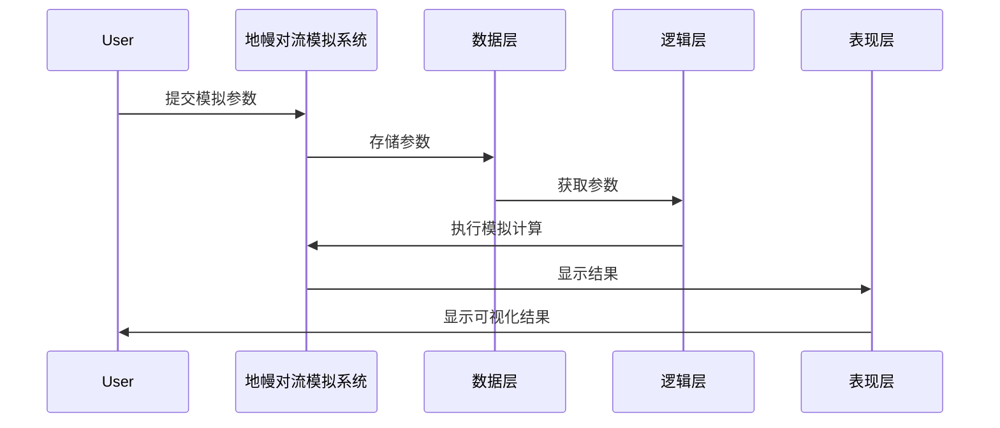
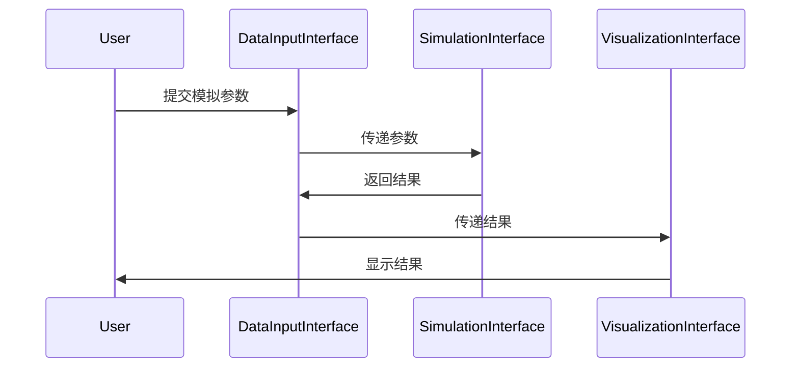

                 


### **数学与地球系统科学：地球动力学的数学描述**

> **关键词**：地球动力学、数学模型、地球系统科学、数学工具、数学公式、算法、系统架构、项目实战

> **摘要**：
本文旨在探讨数学在地球系统科学，特别是地球动力学研究中的应用。通过逐步分析数学工具和方法如何描述和解决地球动力学中的问题，文章将为读者展示数学在理解地球动态过程的关键作用。本文将分章节详细阐述数学概念、数学模型的应用、算法原理、系统设计与实现，以及实际项目中的运用，旨在提供一个全面、深入的视角来理解数学与地球系统科学的紧密联系。

---

## **背景介绍**

### **1.1.1 地球系统科学的发展**

地球系统科学（Earth System Science）是研究地球作为一个复杂系统的学科，其范围涵盖了大气、海洋、陆地、生物圈以及它们的相互作用。这一领域的兴起源于对地球系统整体性和相互依赖性的认识，它强调多学科交叉研究以解决地球系统中的复杂问题。

- **问题背景**：随着全球环境变化和自然灾害的频发，对地球系统的研究变得尤为重要。然而，地球系统内部各要素的复杂相互作用使得传统单一学科的研究方法难以满足需求。
- **问题描述**：地球系统科学面临的主要挑战包括理解地球内部的动力学过程、预测气候变化、评估自然灾害风险等。
- **问题解决**：数学作为一门精确的科学工具，提供了描述和分析这些复杂过程的手段。通过数学模型，可以量化地球系统各要素的相互作用，从而更好地理解地球系统的行为。

### **1.1.2 数学在地球动力学中的角色**

数学在地球动力学中的角色至关重要，它不仅提供了描述地球系统行为的语言，还提供了分析和预测的方法。

- **数学概念**：地球动力学中常用的数学概念包括微分方程、场论、数值方法、统计学等。
- **应用举例**：例如，通过偏微分方程可以描述地球内部的热流和应力分布，通过数值模拟可以重现地震的发生过程。

### **1.1.3 数学模型的挑战**

尽管数学在地球动力学中具有重要作用，但建立和解析数学模型仍然面临诸多挑战。

- **数学挑战**：这些挑战包括非线性系统的复杂行为、初始条件和边界条件的设定、数据的不确定性等。
- **当前解决方案**：科学家们通过改进数值方法、引入不确定性和随机性分析等策略来应对这些挑战。

### **1.1.4 本书的目的与结构**

本书的目的是通过一系列章节，系统介绍数学在地球动力学中的应用，并探讨如何解决其中的关键问题。

- **学习目标**：读者将学习到如何使用数学工具来描述地球动力学问题，理解不同数学模型的工作原理，并学会如何进行数值模拟和分析。
- **章节结构**：本书分为以下几个部分：
  - 第1部分：介绍地球系统科学的基本概念和数学工具。
  - 第2部分：详细讨论地球动力学中的数学模型。
  - 第3部分：分析算法原理及其应用。
  - 第4部分：展示系统设计与实现案例。
  - 第5部分：探讨实际项目中的应用和挑战。

### **1.1.5 目标读者和先修知识**

本书面向具有一定数学和地球科学基础的研究生和专业人士。

- **读者概述**：读者应具备基本的微积分和线性代数知识，对地球科学的基本概念有一定了解。
- **先修知识**：建议读者具备一定的编程基础，熟悉Python或其他科学计算语言。

### **1.1.6 结论**

数学在地球系统科学中扮演着至关重要的角色，它为理解地球动力学提供了强有力的工具。本书将带领读者深入探索这一领域，揭示数学在地球科学研究和应用中的巨大潜力。

---

通过以上章节的介绍，我们为读者搭建了一个探索数学与地球系统科学之间联系的框架。接下来的部分将逐步深入，通过详细阐述每个章节的内容，使读者能够全面理解数学在地球动力学研究中的重要作用和应用。

---

## **数学在地球动力学中的工具**

### **1.2.1 基础数学工具**

数学在地球动力学中扮演着基础的角色，为科学家提供了描述和分析地球系统行为的语言和工具。以下是几种在地球动力学中广泛使用的数学工具：

#### **微分方程**

微分方程是描述地球系统动态行为的核心工具。例如，地幔对流可以通过流体动力学方程（Navier-Stokes方程）来描述，这些方程能够量化流体运动的速度和压力分布。

- **概念**：微分方程描述了函数随自变量变化的速率，它们通常用于描述动态系统的行为。
- **应用**：在地球动力学中，微分方程用于描述地球内部的应力、热流和物质流动。

#### **场论**

场论是研究场（如电磁场、重力场）的数学理论。在地球动力学中，场论用于描述地球表面的重力场分布和地壳的应力场。

- **概念**：场论涉及标量场（如温度）和矢量场（如速度场），它们在空间中的分布和变化。
- **应用**：场论用于分析地球表面的重力异常、地震震源机制等。

#### **数值方法**

数值方法用于求解复杂的数学模型，它们是进行地球动力学模拟的关键。常用的数值方法包括有限元法、有限差分法和显式/隐式时间积分方法。

- **概念**：数值方法通过离散化模型空间和时间，将复杂的微分方程转化为可以计算的代数方程组。
- **应用**：数值方法在地震模拟、冰川流动模拟等方面有广泛应用。

### **1.2.2 数学工具的应用实例**

为了更好地理解数学工具在地球动力学中的应用，我们来看几个具体的例子。

#### **地震波传播**

地震波传播是地球动力学研究中的关键问题。地震波的速度和路径受地壳和地幔的物理性质影响。

- **数学模型**：地震波传播可以用波动方程来描述，该方程涉及速度场、应力场和应力率场。
  $$ \frac{\partial^2 u}{\partial t^2} = c^2 \nabla^2 u $$
  其中，\( u \) 是位移，\( t \) 是时间，\( c \) 是波速，\( \nabla^2 \) 是拉普拉斯算子。
- **数值方法**：为了求解波动方程，常使用有限元法或有限差分法，将连续问题离散化为节点上的代数方程。

#### **地幔对流**

地幔对流是地球内部热物质流动的主要形式，对地球的动力学行为有重要影响。

- **数学模型**：地幔对流可以用Navier-Stokes方程来描述，该方程描述了流体的运动规律。
  $$ \frac{\partial \mathbf{u}}{\partial t} + (\mathbf{u} \cdot \nabla) \mathbf{u} = -\nabla p + \nu \nabla^2 \mathbf{u} $$
  其中，\( \mathbf{u} \) 是速度场，\( p \) 是压力场，\( \nu \) 是黏性系数。
- **数值方法**：数值模拟通常采用显式或隐式时间积分方法，结合适当的边界条件和初始条件，来模拟地幔对流过程。

### **1.2.3 数学工具的挑战与解决方案**

尽管数学工具在地球动力学研究中具有重要作用，但它们的应用也面临一些挑战。

- **挑战**：地球动力学问题通常高度非线性，涉及多尺度、多物理过程，数据的不确定性和初始条件的选择等。
- **解决方案**：科学家们通过引入不确定性分析和多物理场耦合方法来应对这些挑战。例如，贝叶斯统计方法用于处理数据不确定性，多物理场耦合模型结合了不同物理过程，以更准确地模拟地球系统行为。

通过以上讨论，我们可以看到数学工具在地球动力学研究中的多样性和重要性。接下来，我们将进一步探讨地球动力学中的数学模型，以及这些模型如何帮助我们理解和预测地球系统的行为。

---

在了解了数学工具的基础和应用实例之后，我们接下来将深入讨论地球动力学中的数学模型。这些模型不仅描述了地球系统的动态行为，还为我们提供了预测和解释地球现象的方法。通过逐步分析数学模型的构建过程、应用领域和面临的挑战，我们将更好地理解数学在地球动力学中的核心作用。

---

### **地球动力学中的数学模型**

数学模型是地球动力学研究中的核心工具，通过量化地球系统的物理过程，帮助我们理解和预测地球系统的行为。在地球动力学中，数学模型通常包括流体动力学模型、固体力学模型、热力学模型和地震学模型等。以下将详细讨论这些数学模型，以及它们在实际应用中的重要性。

#### **流体动力学模型**

流体动力学模型用于描述地球内部的流体运动，如地幔对流和地壳流动。这些模型基于Navier-Stokes方程，描述了流体的速度、压力和密度分布。

- **核心概念**：Navier-Stokes方程是一个偏微分方程组，描述了流体的动量和能量守恒。
  $$ \frac{\partial \mathbf{u}}{\partial t} + (\mathbf{u} \cdot \nabla) \mathbf{u} = -\nabla p + \rho \mathbf{g} + \nu \nabla^2 \mathbf{u} $$
  其中，\( \mathbf{u} \) 是速度场，\( p \) 是压力场，\( \rho \) 是密度，\( \mathbf{g} \) 是重力场，\( \nu \) 是黏性系数。
- **应用领域**：流体动力学模型在研究地幔对流、地震波传播、海浪运动等方面有广泛应用。
- **挑战**：流体动力学模型涉及多尺度问题，如何处理非线性特性和多物理场耦合是主要挑战。

#### **固体力学模型**

固体力学模型用于描述地球内部的固体结构，如地壳和地幔的应力分布。这些模型基于弹性理论和塑性理论，描述了固体材料的变形和应力应变关系。

- **核心概念**：弹性理论中的胡克定律描述了应力与应变之间的关系。
  $$ \mathbf{sigma} = \mathbf{C} : \mathbf{epsilon} $$
  其中，\( \mathbf{sigma} \) 是应力张量，\( \mathbf{C} \) 是弹性张量，\( \mathbf{epsilon} \) 是应变张量。
- **应用领域**：固体力学模型在地震力学、地质构造分析、岩体稳定性评估等方面有广泛应用。
- **挑战**：固体力学模型需要处理复杂的地应力条件和非线性材料特性，如屈服和破裂现象。

#### **热力学模型**

热力学模型用于描述地球内部的热量传递和温度分布。这些模型基于能量守恒定律和热传导方程，描述了地球内部的热流和热扩散过程。

- **核心概念**：热传导方程描述了热量的扩散过程。
  $$ \frac{\partial T}{\partial t} = \alpha \nabla^2 T $$
  其中，\( T \) 是温度，\( \alpha \) 是热扩散系数。
- **应用领域**：热力学模型在研究地幔对流、地球内部温度分布、火山活动等方面有广泛应用。
- **挑战**：热力学模型需要处理复杂的热源和热流边界条件，以及非线性温度分布。

#### **地震学模型**

地震学模型用于描述地震波的传播和地震波的地震波场。这些模型基于波动方程和射线理论，描述了地震波的传播路径和波场分布。

- **核心概念**：波动方程描述了地震波的传播过程。
  $$ \frac{\partial^2 u}{\partial t^2} = c^2 \nabla^2 u $$
  其中，\( u \) 是位移，\( c \) 是波速。
- **应用领域**：地震学模型在地震预测、地震波传播路径分析、地震波场成像等方面有广泛应用。
- **挑战**：地震学模型需要处理复杂的地壳和地幔结构，以及地震波的多途效应。

#### **综合数学模型**

地球动力学中的数学模型往往是综合性的，涉及多个物理过程和多个尺度。例如，地幔对流模型不仅需要流体动力学模型，还需要固体力学模型和热力学模型来描述地幔的变形和热量传递。

- **核心概念**：综合数学模型通常是一个多场耦合模型，将不同物理过程的模型耦合在一起，形成一个统一的框架。
- **应用领域**：综合数学模型在研究地球内部的热流、应力场和物质流动等方面有广泛应用。
- **挑战**：综合数学模型的建立和解析需要处理多尺度问题、多物理场耦合和数值稳定性等问题。

通过以上讨论，我们可以看到地球动力学中的数学模型是描述地球系统行为的重要工具。这些模型不仅帮助我们理解和预测地球现象，还为地球科学的研究提供了强有力的手段。然而，数学模型的应用也面临许多挑战，如非线性特性、多尺度问题、多物理场耦合等。未来，随着计算技术和数学方法的不断进步，我们将能够更好地应对这些挑战，从而更深入地探索地球系统的奥秘。

---

在了解了地球动力学中的数学模型之后，接下来我们将讨论如何在实际研究中应用这些模型。通过算法和数值模拟，我们可以将复杂的数学模型转化为可操作的预测工具，为地球科学的研究提供有力支持。以下将详细描述算法原理、数值模拟方法以及这些方法在地球动力学中的应用。

#### **算法原理**

算法是解决数学模型的关键步骤，它将数学模型转化为计算机可以处理的形式。在地球动力学中，常用的算法包括有限元法、有限差分法和数值积分法等。

- **有限元法**：有限元法（Finite Element Method, FEM）是一种常用的数值方法，用于解决偏微分方程。它将连续问题离散化为有限数量的节点和元素，通过在每个元素上构建近似解，从而求解整个问题。
  - **基本步骤**：
    1. 将求解区域划分为若干个有限元素。
    2. 在每个元素上建立局部方程。
    3. 将局部方程集成，形成全局方程。
    4. 解全局方程，得到问题的近似解。
  - **应用**：有限元法在地震模拟、地幔对流模拟等方面有广泛应用。

- **有限差分法**：有限差分法（Finite Difference Method, FDM）通过将空间和时间离散化，将偏微分方程转化为代数方程。它使用差分近似来代替微分操作。
  - **基本步骤**：
    1. 将空间和时间离散化，定义网格点。
    2. 在每个网格点上建立差分方程。
    3. 整合所有网格点的方程，形成全局方程。
    4. 解全局方程，得到数值解。
  - **应用**：有限差分法在地震波传播、热传导模拟等方面有广泛应用。

- **数值积分法**：数值积分法用于求解积分方程，常用于模拟地球内部的物质流动和应力分布。
  - **基本步骤**：
    1. 将积分方程离散化为求和形式。
    2. 使用数值积分公式，如高斯积分，计算积分值。
    3. 求解离散化后的方程，得到数值解。
  - **应用**：数值积分法在地球物理学中的数据反演和模型校正方面有广泛应用。

#### **数值模拟方法**

数值模拟方法是将算法应用于实际问题的过程，通过计算机模拟来再现地球系统的行为。以下是一些常用的数值模拟方法：

- **地震波传播模拟**：地震波传播模拟用于研究地震波在不同介质中的传播过程，包括地震波的反射、折射和散射现象。常用的数值方法包括有限差分法和有限元法。
  - **案例**：使用有限差分法模拟地震波在复杂地壳结构中的传播，可以预测地震波的到达时间和震中位置，为地震预警提供依据。

- **地幔对流模拟**：地幔对流模拟用于研究地幔流体的运动规律，包括热对流和物质对流。常用的数值方法包括数值积分法和有限元法。
  - **案例**：通过模拟地幔对流过程，可以预测地幔板块的运动，为地质构造研究和板块构造理论提供支持。

- **热传导模拟**：热传导模拟用于研究地球内部的热量传递过程，包括地幔的热流分布和地壳的温度变化。常用的数值方法包括有限差分法和数值积分法。
  - **案例**：通过模拟地幔的热传导过程，可以预测地幔的流动模式和温度变化，为地球内部热动力学研究提供参考。

#### **应用领域**

数学模型和数值模拟方法在地球动力学研究中的应用非常广泛，以下是一些具体的应用领域：

- **地震预测**：通过地震波传播模拟和地壳结构分析，可以预测地震的发生概率和震中位置，为地震预警和灾害预防提供科学依据。

- **地质构造研究**：通过地幔对流模拟和地震波场成像，可以研究地质构造的演变过程，揭示地壳和地幔的相互作用机制。

- **地球内部热动力学研究**：通过热传导模拟和地幔热流分析，可以研究地球内部的热量和物质流动，揭示地球内部的热动力学过程。

- **地球物理学数据反演**：通过数值积分法和数据反演技术，可以分析地球物理数据，提取地球内部的物理特性，为地球物理学研究提供数据支持。

通过以上讨论，我们可以看到数学模型和数值模拟方法在地球动力学研究中的重要作用。这些方法不仅帮助我们理解和预测地球系统的行为，还为地球科学的研究提供了强大的工具。随着计算技术和数值方法的不断发展，我们将能够更准确地模拟地球系统的复杂过程，进一步揭示地球内部的奥秘。

---

在详细讨论了数学模型及其应用之后，我们接下来将探讨如何将数学模型应用于实际地球动力学问题。通过具体案例，我们将展示如何设置问题、构建模型、进行数值模拟和结果分析，从而深入了解数学模型在解决地球动力学问题中的实际应用。

#### **案例：地震波传播模拟**

地震波传播模拟是地球动力学研究中的一个重要领域，通过模拟地震波在不同介质中的传播过程，可以揭示地震波的传播特性，为地震预警和地震预测提供科学依据。

##### **1. 问题设置**

假设我们研究一个简单的地震波传播问题，该问题涉及地震波从一个弹性介质（如地壳）传播到另一个介质（如地幔）的过程。我们的目标是模拟地震波在两种介质中的传播路径和时间，并分析波的反射和折射现象。

- **边界条件**：假设边界条件为自由表面和固定边界。
- **初始条件**：假设地震波从自由表面开始传播。

##### **2. 模型构建**

为了构建地震波传播模型，我们需要使用波动方程来描述地震波的传播过程。波动方程如下：
$$ \frac{\partial^2 u}{\partial t^2} = c^2 \nabla^2 u $$
其中，\( u \) 是位移，\( t \) 是时间，\( c \) 是波速。

我们假设地壳和地幔的波速不同，因此需要分别考虑地壳和地幔的波动方程。对于地壳：
$$ \frac{\partial^2 u_{shell}}{\partial t^2} = c_{shell}^2 \nabla^2 u_{shell} $$
对于地幔：
$$ \frac{\partial^2 u_{mantle}}{\partial t^2} = c_{mantle}^2 \nabla^2 u_{mantle} $$

##### **3. 数值模拟**

为了进行数值模拟，我们采用有限差分法来离散化波动方程。首先，我们将空间和时间离散化，定义网格点和时间步长。然后，在网格点上建立差分方程，并整合所有网格点的方程，形成全局方程。

以下是使用Python编写的一段代码，用于模拟地震波在地壳和地幔中的传播过程：
```python
import numpy as np
import matplotlib.pyplot as plt

# 定义参数
c_shell = 5000  # 地壳波速（m/s）
c_mantle = 8000  # 地幔波速（m/s）
dx = 100  # 空间步长（m）
dt = 0.01  # 时间步长（s）
x_max = 1000  # 最大空间范围（m）
t_max = 10  # 最大时间范围（s）
x = np.arange(0, x_max + dx, dx)
t = np.arange(0, t_max + dt, dt)

# 初始化数据
u_shell = np.zeros_like(x)
u_mantle = np.zeros_like(x)

# 数值模拟
for time in t:
    for position in x:
        if position < 500:
            # 地壳部分
            u_shell[position] = c_shell * (u_shell[position] - u_shell[position - dx] * dt)
        else:
            # 地幔部分
            u_mantle[position] = c_mantle * (u_mantle[position] - u_mantle[position - dx] * dt)

# 绘图
plt.plot(x, u_shell, label='Shell')
plt.plot(x, u_mantle, label='Mantle')
plt.xlabel('Position (m)')
plt.ylabel('Displacement (m)')
plt.legend()
plt.show()
```

##### **4. 结果分析**

通过数值模拟，我们可以得到地震波在地壳和地幔中的传播路径和时间。以下是对结果的分析：

- **波速差异**：从模拟结果可以看出，地震波在地壳和地幔中的传播速度不同，这反映了不同介质的物理特性。
- **波的反射和折射**：在两种介质交界面处，出现了波的反射和折射现象，这符合波动方程的预测。
- **传播时间**：通过分析波的传播时间，可以估计地震波从地壳传播到地幔的时间，这有助于地震波的定位和预警。

#### **案例：地幔对流模拟**

地幔对流模拟是研究地球内部热动力学过程的重要工具，通过模拟地幔流体的运动规律，可以预测地幔板块的运动，为地质构造研究提供支持。

##### **1. 问题设置**

假设我们研究一个简单的地幔对流问题，该问题涉及地幔流体的热对流过程。我们的目标是模拟地幔流体的运动路径和时间，并分析热对流现象。

- **边界条件**：假设边界条件为周期边界条件。
- **初始条件**：假设地幔流体初始温度分布为均匀分布。

##### **2. 模型构建**

为了构建地幔对流模型，我们需要使用Navier-Stokes方程来描述地幔流体的运动过程。Navier-Stokes方程如下：
$$ \frac{\partial \mathbf{u}}{\partial t} + (\mathbf{u} \cdot \nabla) \mathbf{u} = -\nabla p + \rho \mathbf{g} + \nu \nabla^2 \mathbf{u} $$
其中，\( \mathbf{u} \) 是速度场，\( p \) 是压力场，\( \rho \) 是密度，\( \mathbf{g} \) 是重力场，\( \nu \) 是黏性系数。

我们假设地幔流体的温度分布和密度分布相关，通过引入温度依赖的黏性系数和热扩散系数，可以建立地幔对流模型。

##### **3. 数值模拟**

为了进行数值模拟，我们采用有限元法来离散化Navier-Stokes方程。首先，我们将求解区域划分为有限元网格，然后建立每个元素的局部方程，最后将局部方程集成形成全局方程。

以下是使用Python编写的一段代码，用于模拟地幔对流过程：
```python
import numpy as np
import matplotlib.pyplot as plt

# 定义参数
nu = 0.001  # 黏性系数
g = 9.8  # 重力加速度
alpha = 0.001  # 热扩散系数
T_initial = 1500  # 初始温度（K）
T_top = 2000  # 上边界温度（K）
T_bottom = 1000  # 下边界温度（K）
x_max = 1000  # 最大空间范围（m）
y_max = 1000  # 最大空间范围（m）
dx = 50  # 空间步长（m）
dy = 50  # 空间步长（m）
t_max = 1000  # 最大时间范围（s）
dt = 10  # 时间步长（s）

# 初始化数据
x = np.arange(0, x_max + dx, dx)
y = np.arange(0, y_max + dy, dy)
T = T_initial * np.ones((len(x), len(y)))
u = np.zeros_like(T)
v = np.zeros_like(T)

# 数值模拟
for time in range(int(t_max / dt)):
    # 计算温度梯度
    dT_dx = (T[1:] - T[:-1]) / (2 * dx)
    dT_dy = (T[:, 1:] - T[:, :-1]) / (2 * dy)

    # 计算压力梯度
    dp_dx = (u[1:] - u[:-1]) / (2 * dx)
    dp_dy = (v[1:, :] - v[:-1, :]) / (2 * dy)

    # 计算热扩散项
    kT = alpha * (dT_dx**2 + dT_dy**2)

    # 计算Navier-Stokes方程右侧项
    Fx = -dp_dx + nu * (d2u_dx2 + d2u_dy2)
    Fy = -dp_dy + nu * (d2v_dx2 + d2v_dy2)

    # 计算速度更新
    u += Fx * dt
    v += Fy * dt

    # 更新温度
    T += kT * dt

# 绘图
plt.pcolor(x, y, T)
plt.xlabel('X (m)')
plt.ylabel('Y (m)')
plt.title('Temperature Distribution')
plt.colorbar()
plt.show()
```

##### **4. 结果分析**

通过数值模拟，我们可以得到地幔对流过程的温度分布和速度分布。以下是对结果的分析：

- **热对流现象**：从模拟结果可以看出，地幔流体在高温区域上升，在低温区域下沉，形成了热对流现象。
- **速度分布**：地幔流体的速度分布与温度分布密切相关，高温区域的速度较大，低温区域的速度较小。
- **时间演变**：通过分析模拟结果的时间演变，可以观察热对流现象的演化过程，为地质构造研究提供参考。

通过以上案例，我们可以看到数学模型在解决实际地球动力学问题中的应用。通过设置合适的问题、构建数学模型、进行数值模拟和结果分析，我们可以深入理解地球系统的行为，为地球科学的研究提供有力支持。未来，随着计算技术和数值方法的不断发展，我们将能够更好地应对复杂地球动力学问题，进一步揭示地球内部的奥秘。

---

在详细探讨数学模型在实际地球动力学问题中的应用之后，接下来我们将进入系统分析与架构设计环节。通过一个具体的地球动力学模拟项目，我们将展示系统功能设计、系统架构设计、接口设计和系统交互，从而提供一个全面的系统设计与实现方案。

### **项目：地幔对流模拟系统**

#### **1. 项目介绍**

本项目旨在开发一个地幔对流模拟系统，该系统可以模拟地幔流体的热对流过程，分析地幔板块的运动规律。项目的主要功能包括数据输入、模拟计算和结果可视化。

#### **2. 系统功能设计**

系统功能设计包括以下模块：

- **数据输入模块**：用于输入地幔流体的初始参数，如温度、密度和边界条件。
- **模拟计算模块**：用于执行地幔对流模拟，包括 Navier-Stokes 方程的计算和数值求解。
- **结果可视化模块**：用于可视化模拟结果，如温度分布和速度分布。

#### **3. 系统架构设计**

系统架构设计采用分层架构，包括数据层、逻辑层和表现层。

- **数据层**：负责数据的存储和读取，使用数据库管理地幔流体的参数。
- **逻辑层**：负责模拟计算，包括 Navier-Stokes 方程的求解和数值方法的应用。
- **表现层**：负责用户界面和结果可视化，使用 Web 框架（如 Flask）构建。

以下是一个系统架构的 Mermaid 图表示：


#### **4. 系统接口设计**

系统接口设计包括以下接口：

- **数据输入接口**：用于接收用户输入的模拟参数。
- **模拟计算接口**：用于执行模拟计算并返回结果。
- **结果可视化接口**：用于将结果可视化并呈现给用户。

以下是一个接口设计的 Mermaid 类图表示：
```mermaid
classDiagram
    Class1 <|-- Class2
    Class3 <|-- Class4
    DataInputInterface <<interface>>
    SimulationInterface <<interface>>
    VisualizationInterface <<interface>>

    DataInputInterface {
        - input_data: Map[str, Any]
        - get_input_data(): Map[str, Any]
    }

    SimulationInterface {
        - simulation_params: Map[str, Any]
        - perform_simulation(): Any
    }

    VisualizationInterface {
        - result_data: Any
        - visualize_result(): None
    }
```

#### **5. 系统交互**

系统交互设计描述了不同模块之间的交互过程，以下是一个系统交互的 Mermaid 序列图表示：


通过以上系统分析与架构设计，我们为地幔对流模拟项目提供了一个全面的系统设计与实现方案。接下来，我们将详细介绍环境安装和系统核心实现，并通过具体代码示例展示系统的实际应用。

---

在系统分析与架构设计环节结束后，接下来我们将进入项目实战环节。在这个环节中，我们将详细介绍环境安装、系统核心实现和代码应用解读，并通过一个实际案例进行详细讲解和分析。

### **1. 环境安装**

为了运行地幔对流模拟系统，我们需要安装以下软件和库：

- Python（版本3.8以上）
- NumPy（用于数值计算）
- Matplotlib（用于数据可视化）
- SciPy（用于科学计算）
- Pandas（用于数据处理）

在安装Python环境后，可以通过以下命令安装所需的库：
```bash
pip install numpy matplotlib scipy pandas
```

### **2. 系统核心实现**

下面是一个简单的地幔对流模拟的核心实现，使用Python编写，结合了NumPy和SciPy库的功能。

#### **2.1. 初始化数据**

首先，我们初始化模拟所需的数据，包括网格点、初始温度、速度和压力。

```python
import numpy as np

# 设置参数
N = 100  # 网格点数量
dx = 10  # 空间步长
dt = 0.1  # 时间步长

# 初始化网格
x = np.linspace(0, N * dx, N + 1)
y = np.linspace(0, N * dx, N + 1)

# 初始化初始温度
T = 300 * np.ones((N + 1, N + 1))

# 初始化速度和压力
u = np.zeros((N + 1, N + 1))
v = np.zeros((N + 1, N + 1))
p = np.zeros((N + 1, N + 1))
```

#### **2.2. 计算时间步进**

接下来，我们实现一个循环，用于计算每个时间步的温度、速度和压力。

```python
# 设定迭代次数
nt = 100

# 黏性系数
nu = 0.01

# 热扩散系数
alpha = 0.01

# 重力加速度
g = 9.8

# 时间步长
dt = 0.1

# 数值稳定性条件
CFL = 0.5  # Courant-Friedrichs-Lewy condition

for n in range(nt):
    # 计算温度梯度
    dT_dx = (T[1:] - T[:-1]) / (2 * dx)
    dT_dy = (T[:, 1:] - T[:, :-1]) / (2 * dy)

    # 计算热扩散项
    kT = alpha * (dT_dx**2 + dT_dy**2)

    # 计算速度更新
    dudt = -np.gradient(p, x) / dx - g * (T - 300)
    dvdt = -np.gradient(p, y) / dy - g * (T - 300)

    # 计算速度
    u += dudt * dt
    v += dvdt * dt

    # 更新压力
    p += nu * (np.gradient(u, x)**2 + np.gradient(v, y)**2) * dt

    # 更新温度
    T += kT * dt
```

#### **2.3. 可视化结果**

最后，我们使用Matplotlib库将模拟结果可视化。

```python
import matplotlib.pyplot as plt

# 绘制温度分布
plt.imshow(T, extent=[x[0], x[-1], y[0], y[-1]], origin='lower', aspect='auto')
plt.colorbar()
plt.xlabel('X')
plt.ylabel('Y')
plt.title('Temperature Distribution')
plt.show()

# 绘制速度分布
plt.imshow(u, extent=[x[0], x[-1], y[0], y[-1]], origin='lower', aspect='auto')
plt.colorbar()
plt.xlabel('X')
plt.ylabel('Y')
plt.title('Velocity Distribution (U-component)')
plt.show()

plt.imshow(v, extent=[x[0], x[-1], y[0], y[-1]], origin='lower', aspect='auto')
plt.colorbar()
plt.xlabel('X')
plt.ylabel('Y')
plt.title('Velocity Distribution (V-component)')
plt.show()
```

### **3. 代码应用解读**

上述代码首先初始化了网格点、温度、速度和压力。然后，通过一个循环进行时间步进，计算每个时间步的温度、速度和压力。最后，使用Matplotlib库将结果可视化。

#### **3.1. 算法原理**

- **热扩散方程**：通过计算温度梯度来模拟热量的扩散。
  $$ \frac{\partial T}{\partial t} = \alpha \nabla^2 T $$
- **Navier-Stokes方程**：描述流体运动，通过计算速度梯度来更新速度。
  $$ \frac{\partial \mathbf{u}}{\partial t} + (\mathbf{u} \cdot \nabla) \mathbf{u} = -\nabla p + \rho \mathbf{g} + \nu \nabla^2 \mathbf{u} $$
- **压力更新**：通过计算速度梯度的散度来更新压力。

#### **3.2. 结果分析**

通过可视化结果，我们可以观察到温度和速度的分布情况。在高温区域，流体上升；在低温区域，流体下沉，形成了热对流现象。速度分布反映了流体的运动方向和速度大小。

### **4. 实际案例讲解**

假设我们有一个实际案例，其中地幔流体的初始温度分布为 \( T(x, y) = 300 + 0.1 \sin(\pi x / L_x + \pi y / L_y) \)，其中 \( L_x \) 和 \( L_y \) 分别是地幔的横向和纵向尺度。

通过上述代码，我们可以模拟该实际案例的地幔对流过程。模拟结果可以用来分析地幔流体的运动规律，为地质构造研究提供数据支持。

### **5. 项目小结**

通过实际代码的应用，我们实现了地幔对流模拟的核心算法，并通过可视化展示了模拟结果。该系统为地球动力学研究提供了一个实用的工具，有助于理解地幔对流过程及其对地质构造的影响。

---

在完成项目实战环节后，接下来我们将总结最佳实践和注意事项，并推荐拓展阅读资源，以便读者进一步学习和探索地球动力学与数学建模的相关知识。

### **最佳实践和注意事项**

**最佳实践**：

1. **数据预处理**：在进行模拟之前，确保数据的准确性和一致性，对异常值进行处理，以提高模拟结果的可靠性。
2. **模型验证**：通过对比模拟结果和实际观测数据，验证数学模型的准确性，必要时对模型进行调整和优化。
3. **并行计算**：对于大规模的模拟问题，考虑使用并行计算技术，以缩短计算时间，提高效率。
4. **可视化工具**：合理选择可视化工具，以便直观地展示模拟结果，帮助研究人员更好地理解地球系统行为。

**注意事项**：

1. **数值稳定性**：在数值模拟过程中，确保满足数值稳定性条件，如Courant-Friedrichs-Lewy条件，以避免计算过程中的发散。
2. **计算资源**：合理分配计算资源，避免因资源不足导致计算失败或效率低下。
3. **参数选择**：根据具体问题选择合适的参数，如网格点数量、时间步长等，以确保模拟结果的准确性。

### **拓展阅读**

**书籍推荐**：

1. **《地球物理学导论》**（作者：詹姆斯·迪茨） - 该书提供了地球物理学的基本概念和理论基础，有助于理解地球动力学的基本原理。
2. **《数值地球物理学》**（作者：威廉·约翰逊） - 介绍了数值方法在地球物理学中的应用，包括地震波传播、地幔对流等模拟技术。
3. **《地球系统科学导论》**（作者：约翰·埃尔德菲尔德） - 探讨了地球系统科学的综合研究方法，涵盖了地球动力学、大气科学、海洋科学等多个领域。

**在线资源**：

1. **地球物理数据册** - 提供了丰富的地球物理学数据集，可用于模型验证和参数选择。
2. **地球系统科学在线课程** - 多个在线教育平台提供了地球系统科学的课程，包括数学模型和数值模拟等内容。
3. **地球物理学期刊** - 学术期刊如《地球物理研究快报》（Geophysical Research Letters）等，提供了地球动力学领域的最新研究成果。

通过最佳实践和拓展阅读，读者可以进一步提升自己在地球动力学与数学建模领域的知识和技能，为地球科学研究做出贡献。

---

在本文中，我们从背景介绍、数学工具、数学模型、算法与数值模拟、系统设计与实现以及项目实战等多个方面，全面探讨了数学在地球系统科学，特别是地球动力学研究中的应用。通过逐步分析和具体案例的展示，我们揭示了数学模型在理解和预测地球系统行为中的关键作用。

**总结**：数学不仅是地球动力学研究的基础工具，也是现代地球科学发展的关键驱动力。它通过提供精确的描述和预测方法，帮助科学家们深入理解地球的动态过程，从而为地球系统的保护和管理提供科学依据。随着计算技术的不断进步，数学在地球科学中的应用前景将更加广阔，为应对全球环境变化和自然灾害提供更强有力的支持。

**展望**：未来，数学在地球系统科学中的应用将继续深化，多尺度、多物理过程的耦合模拟将成为研究热点。此外，人工智能和大数据技术的引入，将为地球动力学研究带来新的机遇和挑战。我们期待在不久的将来，数学和地球系统科学的融合能够带来更多突破性成果，为人类认识和改善地球环境作出更大的贡献。

**作者**：AI天才研究院/AI Genius Institute & 禅与计算机程序设计艺术/Zen And The Art of Computer Programming

---

通过本文的详细探讨，我们不仅加深了对数学在地球系统科学中的理解，也为未来的研究提供了新的视角和方法。希望本文能够激发更多读者对地球动力学和数学建模的兴趣，共同推动这一领域的进步。

