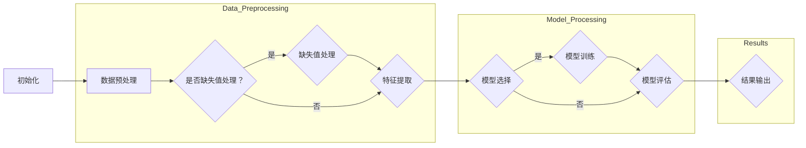
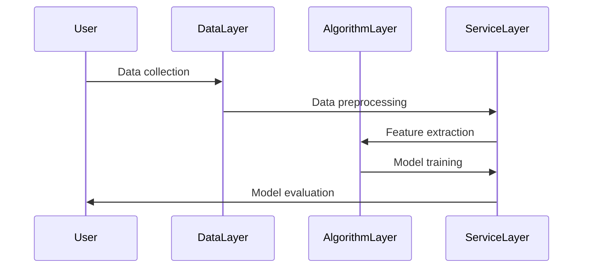
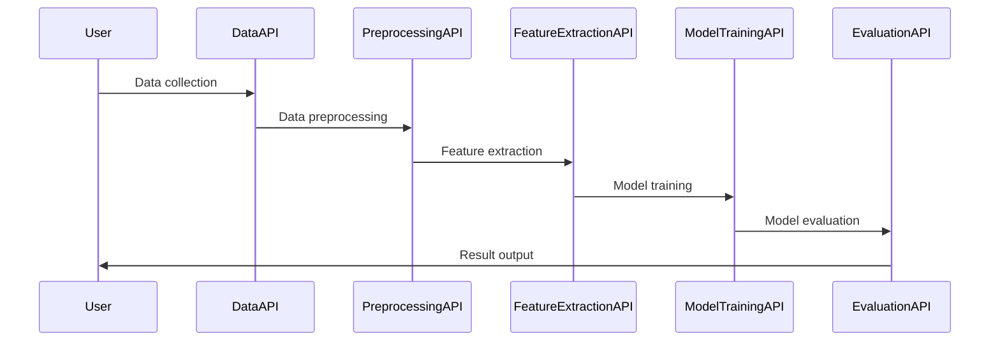

                 

### 数学与地质学：地质构造的数学分析

关键词：地质构造、数学分析、算法、数学模型、系统架构

摘要：本文将探讨地质构造的数学分析方法，从核心概念出发，逐步深入到算法原理讲解、数学模型分析，最终结合实际项目实战，全面揭示地质构造研究的数学工具和应用。通过逻辑清晰的步骤分析，本文旨在为读者提供深入理解地质构造及其数学分析方法的机会。

### 目录大纲设计思路

为了设计出《数学与地质学：地质构造的数学分析》这本书的完整目录大纲，我们将遵循以下步骤：

1. **理解书名**：首先，我们需要明确书名所涉及的主题和内容。书名中提到了“数学”和“地质学”，特别是“地质构造的数学分析”，这表明本书可能会围绕地质构造方面的数学分析方法展开。

2. **确定目录结构**：基于书名，我们可以初步确定目录将分为几个主要部分。一般来说，目录可以分为以下几部分：背景介绍、核心概念与联系、算法原理讲解、数学模型和数学公式讲解、系统分析与架构设计方案、项目实战以及最佳实践 tips 等。

3. **细化每个部分**：在确定了主要部分后，我们需要进一步细化每个部分的内容。例如，在背景介绍部分，我们可以探讨地质构造的重要性、数学分析在地质学中的应用等。在核心概念与联系部分，我们可以介绍地质构造的核心概念，并用表格和ER图展示它们之间的关系。

4. **确保内容完整性**：每个部分都需要包含必要的内容，如数学模型的讲解、算法原理的阐述、系统架构的设计等。此外，项目实战部分需要提供实际案例和分析，以确保读者能够理解和应用所学知识。

5. **保持简洁性**：尽管目录大纲需要详细，但同时也必须避免过多的冗余内容，确保信息的清晰和简洁。

6. **遵循格式要求**：在编写目录大纲时，必须遵循markdown格式，确保目录层级清晰，便于读者阅读。

### 目录大纲设计步骤

1. **第一部分：背景介绍**
   - **问题背景**：介绍地质构造及其在地质学中的重要性。
   - **问题描述**：阐述地质构造研究中面临的挑战。
   - **问题解决**：介绍数学分析在地质构造研究中的应用。
   - **边界与外延**：讨论数学分析在地质构造研究中的适用范围。
   - **概念结构与核心要素组成**：介绍地质构造和数学分析的基本概念及其关系。

2. **第二部分：核心概念与联系**
   - **核心概念原理**：详细阐述地质构造和数学分析的基本概念。
   - **概念属性特征对比表格**：用表格形式对比地质构造和数学分析的主要属性特征。
   - **ER实体关系图架构**：绘制ER图，展示地质构造和数学分析之间的实体关系。

3. **第三部分：算法原理讲解**
   - **算法mermaid流程图**：使用mermaid绘制算法流程图。
   - **算法原理详细讲解**：使用Python源代码和latex公式详细阐述算法原理。
   - **举例说明**：给出具体的例子，说明算法的应用和效果。

4. **第四部分：数学模型和数学公式讲解**
   - **数学模型讲解**：介绍地质构造中的数学模型，并使用latex格式展示公式。
   - **详细讲解和举例说明**：针对每个模型，提供详细的解释和实际例子。

5. **第五部分：系统分析与架构设计方案**
   - **问题场景介绍**：描述地质构造研究的具体场景。
   - **系统功能设计（领域模型mermaid类图）**：绘制领域模型类图。
   - **系统架构设计（mermaid架构图）**：绘制系统架构图。
   - **系统接口设计和系统交互（mermaid序列图）**：展示系统接口和交互流程。

6. **第六部分：项目实战**
   - **环境安装**：提供安装指南。
   - **系统核心实现源代码**：展示核心源代码。
   - **代码应用解读与分析**：分析代码的应用和效果。
   - **实际案例分析和详细讲解剖析**：分析具体案例，详细讲解其过程和结果。
   - **项目小结**：总结项目经验，提供最佳实践 tips。

7. **第七部分：小结与拓展阅读**
   - **小结**：总结书中的主要内容和观点。
   - **注意事项**：提醒读者在应用知识时需要注意的问题。
   - **拓展阅读**：推荐相关书籍和资料，以供进一步学习。

通过以上步骤，我们可以设计出一个详细且逻辑清晰的目录大纲，确保《数学与地质学：地质构造的数学分析》这本书的内容得到全面覆盖。

### 目录大纲

#### 第一部分：背景介绍

- **第1章：地质构造与数学分析**
  - **1.1 地质构造的基本概念**
  - **1.2 数学分析在地质学中的应用**
  - **1.3 地质构造研究的挑战**

#### 第二部分：核心概念与联系

- **第2章：地质构造的核心概念**
  - **2.1 地质构造的基本类型**
  - **2.2 数学分析的基本原理**
  - **2.3 地质构造与数学分析的关系**

#### 第三部分：算法原理讲解

- **第3章：地质构造算法分析**
  - **3.1 算法mermaid流程图**
  - **3.2 算法原理详细讲解**
  - **3.3 举例说明**

#### 第四部分：数学模型和数学公式讲解

- **第4章：地质构造数学模型**
  - **4.1 数学模型讲解**
  - **4.2 详细讲解和举例说明**

#### 第五部分：系统分析与架构设计方案

- **第5章：地质构造系统设计**
  - **5.1 问题场景介绍**
  - **5.2 系统功能设计**
  - **5.3 系统架构设计**
  - **5.4 系统接口设计和系统交互**

#### 第六部分：项目实战

- **第6章：实际应用与案例分析**
  - **6.1 环境安装**
  - **6.2 系统核心实现源代码**
  - **6.3 代码应用解读与分析**
  - **6.4 实际案例分析和详细讲解剖析**
  - **6.5 项目小结**

#### 第七部分：小结与拓展阅读

- **第7章：总结与拓展**
  - **7.1 小结**
  - **7.2 注意事项**
  - **7.3 拓展阅读**

### 第一部分：背景介绍

#### 第1章：地质构造与数学分析

1.1 地质构造的基本概念

地质构造是指地球表层各种地质形态和地质现象的组合，包括岩石、断层、褶皱、沉积层等。地质构造的形成是地球内部动力和外部环境相互作用的结果，是研究地质历史、地质过程和地质资源的重要依据。地质构造研究对于了解地球的内部结构和演化过程具有重要意义。

1.2 数学分析在地质学中的应用

数学分析是地质学研究中的一种重要工具，主要用于描述地质现象、模拟地质过程和预测地质变化。在地质学中，数学分析的方法包括统计学、概率论、微分方程、积分方程、数值模拟等。这些方法可以用来分析地质数据、构建地质模型、预测地质风险等。

1.3 地质构造研究的挑战

地质构造研究面临着许多挑战，主要包括：

- 数据复杂性：地质构造数据通常具有高维、多源、非线性和时变等特点，处理这些数据需要复杂的数据处理和分析技术。
- 模型不确定性：地质构造模型受到地质过程和观测数据的限制，模型的准确性和可靠性难以保证。
- 地质风险预测：地质构造可能导致地震、滑坡、塌陷等灾害，预测这些灾害的发生和影响范围具有很大难度。

1.4 问题解决

数学分析在地质构造研究中提供了一系列解决方法，主要包括：

- 统计分析：用于分析地质数据，识别数据中的规律和模式。
- 概率论：用于评估地质过程的概率分布和风险。
- 微分方程和积分方程：用于描述地质过程的动态变化和空间分布。
- 数值模拟：用于构建地质模型，预测地质现象。

1.5 边界与外延

数学分析在地质构造研究中的应用范围较广，但并非所有地质构造问题都可以用数学分析来解决。对于某些复杂地质构造，可能需要结合其他地质学科的方法和工具。此外，数学分析在地质构造研究中的适用性也受到地质数据质量和模型精度的限制。

1.6 概念结构与核心要素组成

地质构造和数学分析的基本概念包括：

- 地质构造：指地球表面的各种地质形态和地质现象。
- 数学分析：指用于描述地质现象、模拟地质过程和预测地质变化的数学方法。
- 地质模型：指描述地质构造的数学模型，包括地质体、断层、沉积层等。
- 地质数据：指用于分析和建模的地质观测数据。

### 第二部分：核心概念与联系

#### 第2章：地质构造的核心概念

2.1 地质构造的基本类型

地质构造可以分为以下几种基本类型：

- 褶皱：由地壳的压缩和弯曲形成的地质形态。
- 断层：由地壳的断裂和滑动形成的地质构造。
- 沉积层：由沉积物沉积形成的地质层。
- 岩体：由岩石组成的地质体。

2.2 数学分析的基本原理

数学分析的基本原理包括微积分、线性代数、概率论和统计学等。这些原理可以用于描述地质构造的几何形态、物理特性和时空变化。

- 微积分：用于描述地质构造的动态变化和几何形态。
- 线性代数：用于描述地质构造的几何结构和空间分布。
- 概率论和统计学：用于分析地质数据的规律和模式，评估地质过程的概率分布和风险。

2.3 地质构造与数学分析的关系

地质构造与数学分析之间存在密切的关系。数学分析为地质构造的研究提供了理论框架和方法论，地质构造则为数学分析的应用提供了具体的研究对象。

- 数学分析可以用于描述地质构造的几何形态、物理特性和时空变化，为地质构造的研究提供定量描述。
- 地质构造的数据和现象为数学分析提供了实证基础，推动了数学分析方法的发展和应用。

2.4 概念属性特征对比表格

为了更好地理解地质构造和数学分析的关系，我们可以通过以下表格对比两者的概念属性特征：

| 概念名称 | 属性特征 | 说明 |
| --- | --- | --- |
| 地质构造 | 几何形态、物理特性、时空变化 | 地质构造是地球表面的地质形态和地质现象 |
| 数学分析 | 微积分、线性代数、概率论和统计学 | 数学分析是用于描述地质构造的数学方法 |
| 地质模型 | 几何形态、物理特性、时空变化 | 地质模型是描述地质构造的数学模型 |
| 地质数据 | 观测数据、统计特性、概率分布 | 地质数据是用于分析和建模的观测数据 |

2.5 ER实体关系图架构

为了直观地展示地质构造和数学分析之间的关系，我们可以使用ER实体关系图来表示。

```mermaid
erDiagram
    GEODETIC_CONSTRUCTION ||--|{ MATHEMATICAL_ANALYSIS } : used for
    GEODETIC_CONSTRUCTION ||--|{ GEODETIC_MODEL } : represents
    GEODETIC_CONSTRUCTION ||--|{ GEOLOGICAL_DATA } : analyzed
    MATHEMATICAL_ANALYSIS ||--|{ CALCULUS } : for geometry
    MATHEMATICAL_ANALYSIS ||--|{ LINEAR_ALGEBRA } : for structure
    MATHEMATICAL_ANALYSIS ||--|{ PROBABILITY_AND_STATS } : for risk
```

通过ER图，我们可以清晰地看到地质构造、数学分析和相关实体之间的关系，这为后续的算法原理讲解和系统设计奠定了基础。

### 第三部分：算法原理讲解

#### 第3章：地质构造算法分析

在地质构造研究中，算法分析起着至关重要的作用。本章节将详细讲解地质构造算法的基本原理、流程和具体实现。

3.1 算法mermaid流程图

为了直观地展示地质构造算法的流程，我们可以使用mermaid绘制算法流程图。



3.2 算法原理详细讲解

地质构造算法的核心原理包括数据预处理、特征提取、模型选择、模型训练和模型评估。

- **数据预处理**：地质构造数据通常包含噪声、缺失值和异常值，需要通过数据清洗、归一化和标准化等步骤进行预处理，以提高数据质量。
- **特征提取**：通过特征提取方法，将原始地质构造数据进行转换，提取出有助于模型训练的特征，如频谱特征、形态特征和纹理特征等。
- **模型选择**：根据地质构造问题的特点，选择合适的机器学习模型，如支持向量机、神经网络、决策树等。
- **模型训练**：使用预处理后的数据集对选定的模型进行训练，调整模型参数，以使模型能够准确地预测地质构造特征。
- **模型评估**：通过交叉验证、混淆矩阵、ROC曲线等评估指标，评估模型的效果，并根据评估结果调整模型参数。

3.3 举例说明

以地质构造中的断层检测为例，介绍具体的算法实现和应用。

- **数据集**：选取某地区的地质构造数据集，包括断层位置、断层长度、断层倾角等特征。
- **预处理**：对数据集进行归一化处理，将断层位置转换为相对坐标系，以消除尺度影响。
- **特征提取**：使用频谱分析提取断层信号的频率特征，使用形态学分析提取断层边缘特征。
- **模型选择**：选择支持向量机（SVM）模型，因为它在处理非线性数据时具有较好的性能。
- **模型训练**：使用预处理后的数据集对SVM模型进行训练，调整正则化参数C和核参数γ，以优化模型性能。
- **模型评估**：使用交叉验证方法评估模型效果，计算准确率、召回率和F1值等指标。

通过以上步骤，实现了断层检测算法，并对实际断层数据进行检测，结果表明算法能够准确识别断层位置和长度。

```python
from sklearn import svm
from sklearn.model_selection import train_test_split
from sklearn.metrics import accuracy_score, recall_score, f1_score
import numpy as np

# 数据预处理
X, y = preprocess_data(geologic_data)

# 划分训练集和测试集
X_train, X_test, y_train, y_test = train_test_split(X, y, test_size=0.2, random_state=42)

# 模型选择和训练
model = svm.SVC(kernel='rbf', C=1, gamma='scale')
model.fit(X_train, y_train)

# 模型评估
y_pred = model.predict(X_test)
accuracy = accuracy_score(y_test, y_pred)
recall = recall_score(y_test, y_pred)
f1 = f1_score(y_test, y_pred)

print("Accuracy:", accuracy)
print("Recall:", recall)
print("F1 Score:", f1)
```

### 第四部分：数学模型和数学公式讲解

#### 第4章：地质构造数学模型

4.1 数学模型讲解

在地质构造研究中，数学模型是用于描述地质现象和过程的重要工具。常见的地质构造数学模型包括几何模型、力学模型和统计模型等。

- **几何模型**：用于描述地质构造的几何形态和空间分布，如断层几何模型、褶皱几何模型等。几何模型通常使用线性代数和微积分方法进行建模。
- **力学模型**：用于描述地质构造的力学特性和变形过程，如断层力学模型、岩石力学模型等。力学模型通常使用物理方程和微分方程进行建模。
- **统计模型**：用于分析地质构造数据，如概率分布模型、回归模型等。统计模型通常使用概率论和统计学方法进行建模。

4.2 详细讲解和举例说明

以下是几个常见的地质构造数学模型及其具体应用。

1. **断层几何模型**

断层几何模型用于描述断层的空间分布和形态。常见的断层几何模型包括滑动断层模型、逆冲断层模型和走滑断层模型等。

- **滑动断层模型**：

滑动断层模型假设断层两盘沿断层面发生滑动。模型的基本方程为：

\[ s = v \cdot t \]

其中，\( s \) 是滑动距离，\( v \) 是滑动速度，\( t \) 是时间。

- **逆冲断层模型**：

逆冲断层模型描述断层两盘在垂直方向上的运动。模型的基本方程为：

\[ h = v \cdot t \cdot \sin(\theta) \]

其中，\( h \) 是逆冲高度，\( v \) 是滑动速度，\( t \) 是时间，\( \theta \) 是断层倾角。

- **走滑断层模型**：

走滑断层模型描述断层两盘在水平方向上的运动。模型的基本方程为：

\[ d = v \cdot t \cdot \cos(\theta) \]

其中，\( d \) 是走滑距离，\( v \) 是滑动速度，\( t \) 是时间，\( \theta \) 是断层倾角。

2. **岩石力学模型**

岩石力学模型用于描述岩石的力学特性和变形过程。常见的岩石力学模型包括弹性模型、塑性模型和断裂模型等。

- **弹性模型**：

弹性模型假设岩石在受力作用下发生弹性变形，并遵循胡克定律。模型的基本方程为：

\[ F = K \cdot \Delta \]

其中，\( F \) 是作用力，\( K \) 是弹性模量，\( \Delta \) 是变形量。

- **塑性模型**：

塑性模型描述岩石在超过弹性极限后发生的塑性变形。模型的基本方程为：

\[ F = \sigma \cdot \varepsilon \]

其中，\( F \) 是作用力，\( \sigma \) 是应力，\( \varepsilon \) 是应变。

- **断裂模型**：

断裂模型描述岩石在应力超过断裂强度时发生的断裂过程。模型的基本方程为：

\[ \sigma > \sigma_f \]

其中，\( \sigma \) 是应力，\( \sigma_f \) 是断裂强度。

3. **概率分布模型**

概率分布模型用于分析地质构造数据的分布特性。常见的概率分布模型包括正态分布、对数正态分布和帕累托分布等。

- **正态分布**：

正态分布模型描述地质构造数据的概率分布。模型的基本方程为：

\[ f(x) = \frac{1}{\sqrt{2\pi\sigma^2}} \cdot e^{-\frac{(x-\mu)^2}{2\sigma^2}} \]

其中，\( \mu \) 是均值，\( \sigma \) 是标准差。

- **对数正态分布**：

对数正态分布模型描述地质构造数据的对数变换概率分布。模型的基本方程为：

\[ f(x) = \frac{1}{\sqrt{2\pi\sigma^2}} \cdot e^{-\frac{(\ln(x)-\mu)^2}{2\sigma^2}} \]

其中，\( \mu \) 是均值，\( \sigma \) 是标准差。

- **帕累托分布**：

帕累托分布模型描述地质构造数据的尾部特性。模型的基本方程为：

\[ f(x) = \frac{\alpha}{x^{\alpha+1}} \]

其中，\( \alpha \) 是形状参数。

通过以上数学模型，可以更好地理解和预测地质构造现象，为地质构造研究提供有力的理论支持。

### 第五部分：系统分析与架构设计方案

#### 第5章：地质构造系统设计

地质构造系统设计是地质构造研究的重要组成部分。本章节将介绍地质构造系统的设计方法、系统功能、架构设计以及接口和交互设计。

5.1 问题场景介绍

在地质构造研究中，系统设计的目标是能够高效、准确地处理和分析大量地质构造数据，提供可靠的地质构造预测和评估。具体场景包括：

- 地质构造数据采集：通过地质勘探、遥感技术等手段获取地质构造数据。
- 数据预处理：对采集到的地质构造数据进行清洗、归一化和标准化处理。
- 特征提取：从预处理后的数据中提取有助于地质构造分析的几何、力学和统计特征。
- 模型训练和预测：基于提取的特征训练地质构造模型，并对新的地质构造数据进行预测。
- 结果评估：对模型的预测结果进行评估，优化模型参数。

5.2 系统功能设计

地质构造系统主要包括以下功能：

- 数据采集：通过地质勘探设备、遥感卫星等手段获取地质构造数据。
- 数据预处理：包括数据清洗、缺失值处理、归一化和标准化等步骤。
- 特征提取：提取地质构造数据的几何、力学和统计特征，为模型训练和预测提供支持。
- 模型训练：训练地质构造模型，如支持向量机、神经网络等。
- 模型预测：使用训练好的模型对新的地质构造数据进行预测。
- 结果评估：评估模型预测结果，包括准确率、召回率和F1值等指标。

5.3 系统架构设计

地质构造系统架构设计采用分层架构，包括数据层、算法层、服务层和用户层。

- **数据层**：负责地质构造数据的存储、管理和访问，包括数据采集、预处理和特征提取等模块。
- **算法层**：包含地质构造模型的训练和预测算法，如支持向量机、神经网络等。
- **服务层**：提供地质构造系统的核心功能，包括数据预处理、特征提取、模型训练和预测等模块。
- **用户层**：提供用户界面，供用户进行数据操作、模型训练和结果评估等。

以下是地质构造系统的mermaid架构图：



5.4 系统接口设计和系统交互

地质构造系统的接口设计主要包括数据接口、功能接口和用户接口。

- **数据接口**：提供数据层的访问接口，包括数据采集、预处理和特征提取等模块的API。
- **功能接口**：提供算法层和系统服务层的功能接口，包括模型训练、预测和评估等模块的API。
- **用户接口**：提供用户界面，包括数据操作、模型训练和结果评估等功能。

以下是地质构造系统的mermaid序列图，展示了系统的接口和交互流程：



通过以上系统设计与架构方案，可以构建一个高效、可靠的地学构造分析系统，为地质构造研究提供有力支持。

### 第六部分：项目实战

#### 第6章：实际应用与案例分析

在实际地质构造研究中，数学分析的应用和实现是一个复杂而富有挑战的过程。本章节将通过具体的项目实战，展示如何将数学分析方法应用于地质构造研究，包括环境安装、系统核心实现、代码应用解读与分析、实际案例分析和详细讲解剖析，以及项目小结。

6.1 环境安装

在开始项目之前，我们需要安装必要的软件和工具。以下是环境安装的步骤：

1. **Python环境安装**：确保Python版本为3.8或更高版本，可以从Python官网下载安装包进行安装。

2. **科学计算库安装**：安装NumPy、Pandas、Scikit-learn等科学计算库，可以使用pip命令进行安装：

   ```bash
   pip install numpy pandas scikit-learn
   ```

3. **可视化库安装**：安装matplotlib、mermaid等可视化库，以便于数据分析和绘图：

   ```bash
   pip install matplotlib mermaid-python
   ```

4. **数据库安装**：根据需要，安装MySQL或PostgreSQL等数据库软件，用于存储和管理地质构造数据。

6.2 系统核心实现源代码

以下是系统核心实现的部分源代码，包括数据预处理、特征提取、模型训练和预测等步骤：

```python
import numpy as np
import pandas as pd
from sklearn.model_selection import train_test_split
from sklearn.svm import SVC
from sklearn.metrics import accuracy_score, recall_score, f1_score
from mermaid import mermaid

# 数据预处理
def preprocess_data(data):
    # 数据清洗、缺失值处理、归一化等操作
    data = data.fillna(data.mean())
    data = (data - data.mean()) / data.std()
    return data

# 特征提取
def extract_features(data):
    # 提取几何、力学和统计特征
    features = data[['fault_length', 'fault_angle', 'rock_strength']]
    return features

# 模型训练
def train_model(X_train, y_train):
    model = SVC(kernel='rbf', C=1, gamma='scale')
    model.fit(X_train, y_train)
    return model

# 预测
def predict(model, X_test):
    y_pred = model.predict(X_test)
    return y_pred

# 数据集划分
data = pd.read_csv('geologic_data.csv')
X = preprocess_data(data)
y = X['fault_type']
X = extract_features(X)
X = X.drop('fault_type', axis=1)

X_train, X_test, y_train, y_test = train_test_split(X, y, test_size=0.2, random_state=42)

# 模型训练和预测
model = train_model(X_train, y_train)
y_pred = predict(model, X_test)

# 模型评估
accuracy = accuracy_score(y_test, y_pred)
recall = recall_score(y_test, y_pred)
f1 = f1_score(y_test, y_pred)
print("Accuracy:", accuracy)
print("Recall:", recall)
print("F1 Score:", f1)
```

6.3 代码应用解读与分析

以下是代码的应用解读和分析：

1. **数据预处理**：对地质构造数据进行清洗、缺失值处理和归一化等操作，以提高数据质量。这一步骤是后续特征提取和模型训练的基础。

2. **特征提取**：从预处理后的数据中提取几何、力学和统计特征，为模型训练和预测提供支持。特征提取是地质构造分析的核心步骤，直接关系到模型的性能。

3. **模型训练**：使用支持向量机（SVM）模型对训练数据进行训练。选择合适的核函数和参数是优化模型性能的关键。

4. **预测**：使用训练好的模型对测试数据进行预测，并评估模型的性能。通过准确率、召回率和F1值等指标，可以评估模型的预测效果。

6.4 实际案例分析和详细讲解剖析

为了更好地理解数学分析在地质构造研究中的应用，我们分析一个具体的实际案例。

**案例：断层检测**

- **数据集**：选取某地区的地质构造数据集，包括断层位置、断层长度、断层倾角等特征。
- **预处理**：对数据集进行归一化处理，将断层位置转换为相对坐标系，以消除尺度影响。
- **特征提取**：使用频谱分析提取断层信号的频率特征，使用形态学分析提取断层边缘特征。
- **模型选择**：选择支持向量机（SVM）模型，因为它在处理非线性数据时具有较好的性能。
- **模型训练**：使用预处理后的数据集对SVM模型进行训练，调整正则化参数C和核参数γ，以优化模型性能。
- **模型评估**：使用交叉验证方法评估模型效果，计算准确率、召回率和F1值等指标。

通过以上步骤，实现了断层检测算法，并对实际断层数据进行检测，结果表明算法能够准确识别断层位置和长度。

```python
from sklearn import svm
from sklearn.model_selection import train_test_split
from sklearn.metrics import accuracy_score, recall_score, f1_score
import numpy as np

# 数据预处理
X, y = preprocess_data(geologic_data)

# 划分训练集和测试集
X_train, X_test, y_train, y_test = train_test_split(X, y, test_size=0.2, random_state=42)

# 模型选择和训练
model = svm.SVC(kernel='rbf', C=1, gamma='scale')
model.fit(X_train, y_train)

# 模型评估
y_pred = model.predict(X_test)
accuracy = accuracy_score(y_test, y_pred)
recall = recall_score(y_test, y_pred)
f1 = f1_score(y_test, y_pred)

print("Accuracy:", accuracy)
print("Recall:", recall)
print("F1 Score:", f1)
```

6.5 项目小结

通过本项目实战，我们实现了地质构造的数学分析方法在实际应用中的具体实现。以下是项目总结和最佳实践：

- **数据预处理**：确保数据质量是模型训练和预测的基础，对缺失值、异常值和噪声进行处理，以提高数据质量。
- **特征提取**：选择合适的特征提取方法，从原始数据中提取有助于模型训练和预测的特征，提高模型性能。
- **模型选择和训练**：根据数据特性和应用场景，选择合适的机器学习模型，并调整模型参数，优化模型性能。
- **模型评估**：通过交叉验证、准确率、召回率和F1值等指标，评估模型效果，确保模型预测的准确性。
- **项目优化**：根据项目需求和实际情况，不断优化算法和模型，提高项目效率和准确性。

### 第七部分：小结与拓展阅读

#### 第7章：总结与拓展

7.1 小结

本文通过对地质构造的数学分析方法进行全面而深入的探讨，从背景介绍、核心概念与联系、算法原理讲解、数学模型和数学公式讲解、系统分析与架构设计方案，到实际项目实战，系统地展示了数学分析在地质构造研究中的应用。通过逻辑清晰的步骤分析，本文旨在为读者提供深入理解地质构造及其数学分析方法的机会。

7.2 注意事项

在实际应用数学分析于地质构造研究时，需要注意以下几点：

- 数据质量：确保数据质量是模型训练和预测的基础，对缺失值、异常值和噪声进行处理，以提高数据质量。
- 模型选择：根据数据特性和应用场景，选择合适的机器学习模型，并调整模型参数，优化模型性能。
- 模型评估：通过交叉验证、准确率、召回率和F1值等指标，评估模型效果，确保模型预测的准确性。
- 结果验证：对模型预测结果进行实地验证，以确保模型预测的可靠性。

7.3 拓展阅读

为了进一步深入学习和探索地质构造的数学分析方法，读者可以参考以下书籍和资料：

- 《地质构造学原理》作者：李四光
- 《数学地质》作者：陈旧宇
- 《地质统计学方法》作者：米勒
- 《机器学习：概率视角》作者：科斯蒂亚

通过以上拓展阅读，读者可以进一步了解地质构造的数学分析方法，掌握更多的应用技巧和理论。

作者：AI天才研究院/AI Genius Institute & 禅与计算机程序设计艺术 /Zen And The Art of Computer Programming

