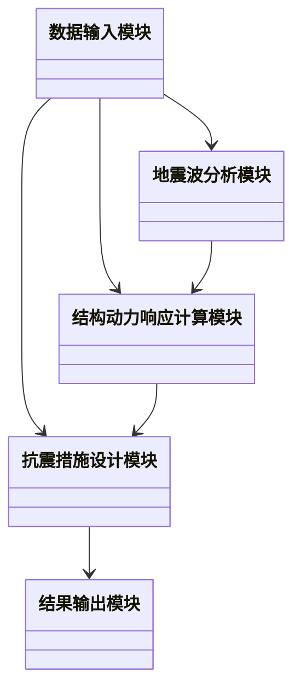

                 

# 数学与地震工程：抗震设计的数学模型

## 关键词
- 地震工程
- 抗震设计
- 数学模型
- 地震波分析
- 结构动力响应

## 摘要
本文将深入探讨数学在地震工程中的应用，特别是抗震设计的数学模型。通过逐步分析，我们将介绍地震波模型、结构模型、动力响应模型以及抗震措施模型，并详细讲解这些模型的数学原理和公式。同时，本文还将通过具体例子来说明这些模型的实际应用，从而为读者提供全面的抗震设计理论基础。

## 第一部分：背景介绍

### 1.1 问题背景

地震作为一种自然灾害，具有破坏性强、影响范围广的特点。在地震发生时，建筑物能否承受地震荷载是关系到人们生命财产安全的关键。抗震设计的目的就在于降低地震对建筑物的影响，保障建筑物的稳定性和安全性。随着地震工程技术的不断发展，数学模型在抗震设计中的应用越来越广泛，成为抗震设计的重要组成部分。

### 1.2 问题描述

抗震设计的问题可以分为以下几个方面：

1. **地震波的分析与模拟**：地震波是地震能量传播的载体，了解地震波的特性对于抗震设计至关重要。我们需要通过数学模型来描述地震波的传播过程，模拟地震波在不同介质中的传播特性。

2. **结构的动力响应计算**：地震作用下，建筑物会产生振动。我们需要通过数学模型来计算结构在地震作用下的动力响应，包括加速度、速度和位移等参数。

3. **抗震措施的优化**：为了提高建筑物的抗震性能，我们需要采用各种抗震措施，如减震器、阻尼器等。我们需要通过数学模型来优化抗震措施的设计，使其在满足功能需求的前提下具有最佳的性能。

### 1.3 问题解决

数学模型在抗震设计中的应用主要包括以下几个方面：

1. **地震波模型**：利用波动方程来描述地震波的传播特性，为抗震设计提供基础数据。

2. **结构模型**：利用有限元法、连续介质力学等方法来描述结构的几何形状和材料特性。

3. **动力响应模型**：利用运动方程和边界条件来描述结构在地震作用下的振动特性。

4. **抗震措施模型**：利用结构优化理论和控制理论来设计抗震措施。

### 1.4 边界与外延

抗震设计不仅涉及到地震波和结构动力响应的计算，还需要考虑建筑物的使用功能、建筑材料特性、经济性等因素。数学模型在抗震设计中的应用范围广泛，可以涵盖地震工程、土木工程、力学等多个学科领域。

### 1.5 概念结构与核心要素组成

抗震设计的数学模型主要包括以下几个核心要素：

1. **地震波模型**：描述地震波的传播特性，如波速、波长、振幅等。

2. **结构模型**：描述结构的几何形状、材料特性、刚度等。

3. **动力响应模型**：描述结构在地震作用下的振动特性，如加速度、速度、位移等。

4. **抗震措施模型**：描述抗震措施的设计方法，如减震器、阻尼器等。

## 第二部分：核心概念与联系

### 2.1 核心概念原理

在抗震设计过程中，核心概念主要包括地震波模型、结构模型、动力响应模型和抗震措施模型。

**地震波模型**：地震波模型描述了地震波的传播特性。一般来说，地震波可以视为弹性波在地下介质中的传播，其传播速度、波长和振幅等特性对于抗震设计至关重要。

**结构模型**：结构模型描述了建筑物的几何形状、材料特性和刚度等。常见的结构模型包括有限元模型、连续介质模型等，这些模型能够准确地描述建筑物的物理特性。

**动力响应模型**：动力响应模型描述了建筑物在地震作用下的振动特性。通过运动方程和边界条件，我们可以计算出建筑物在地震作用下的加速度、速度和位移等参数。

**抗震措施模型**：抗震措施模型描述了如何通过设计抗震措施来提高建筑物的抗震性能。常见的抗震措施包括减震器、阻尼器等，这些措施可以通过降低建筑物的振动响应来提高其抗震能力。

### 2.2 概念属性特征对比表格

| 概念           | 描述                                                         | 特征对比                                   |
|----------------|--------------------------------------------------------------|------------------------------------------|
| 地震波模型     | 描述地震波的传播特性，如波速、波长、振幅等                     | 波速、波长、振幅                           |
| 结构模型       | 描述建筑物的几何形状、材料特性、刚度等                         | 几何形状、材料特性、刚度                   |
| 动力响应模型   | 描述建筑物在地震作用下的振动特性，如加速度、速度、位移等         | 加速度、速度、位移                         |
| 抗震措施模型   | 描述抗震措施的设计方法，如减震器、阻尼器等                     | 减震器、阻尼器                             |

### 2.3 ER实体关系图架构

```mermaid
erDiagram
  A{地震波} ||--|{B{结构}} : 发生地震波作用
  B{结构} ||--|{C{动力响应}} : 结构产生动力响应
  C{动力响应} ||--|{D{抗震措施}} : 采用抗震措施改善结构响应
```

## 第三部分：算法原理讲解

### 3.1 地震波模型

地震波模型是描述地震波传播的数学模型。一般来说，地震波可以视为弹性波在地下介质中的传播。波动方程是描述地震波传播的基本方程，其形式如下：

$$\frac{\partial^2 u}{\partial t^2} = c^2 \nabla^2 u$$

其中，$u(x,t)$表示地震波在空间和时间上的分布，$c$为波速。

### 3.2 结构模型

结构模型用于描述建筑物的几何形状、材料特性、刚度等。常见的结构模型包括有限元模型和连续介质模型。

**有限元模型**：有限元模型将建筑物划分为有限个单元，每个单元采用线性弹簧模型来模拟其刚度。单元的刚度矩阵$K$可以表示为：

$$K = \begin{bmatrix} K_{xx} & K_{xy} & K_{xz} \\ K_{yx} & K_{yy} & K_{yz} \\ K_{zx} & K_{zy} & K_{zz} \end{bmatrix}$$

其中，$K_{ij}$表示单元$i$和单元$j$之间的刚度系数。

**连续介质模型**：连续介质模型将建筑物视为一个连续的介质，其物理特性通过偏微分方程来描述。常用的连续介质模型包括弹性力学模型和塑性力学模型。

### 3.3 动力响应模型

动力响应模型用于描述建筑物在地震作用下的振动特性。运动方程是描述动力响应的基本方程，其形式如下：

$$m \frac{d^2 u}{dt^2} + c \frac{du}{dt} + k u = F(t)$$

其中，$m$为结构的质量矩阵，$c$为结构的阻尼矩阵，$k$为结构的刚度矩阵，$F(t)$为地震作用力。

### 3.4 抗震措施模型

抗震措施模型用于描述如何通过设计抗震措施来提高建筑物的抗震性能。常见的抗震措施包括减震器、阻尼器等。

**减震器模型**：减震器是一种能够降低结构振动响应的装置。其基本原理是通过阻尼作用来消耗结构的振动能量，从而降低结构的振动响应。减震器的力学模型可以表示为：

$$\frac{d^2 x}{dt^2} + 2 \zeta \omega_n \frac{dx}{dt} + \omega_n^2 x = F(t)$$

其中，$x(t)$为减震器的位移，$\omega_n$为减震器的固有频率，$\zeta$为减震器的阻尼比。

**阻尼器模型**：阻尼器是一种能够消耗结构振动能量的装置。其基本原理是通过摩擦作用来消耗结构的振动能量，从而降低结构的振动响应。阻尼器的力学模型可以表示为：

$$c \frac{du}{dt} = F(t)$$

其中，$u(t)$为阻尼器的位移，$c$为阻尼器的阻尼系数。

## 第四部分：数学模型和数学公式 & 详细讲解 & 举例说明

### 4.1 地震波模型

地震波模型是描述地震波传播的数学模型。一般来说，地震波可以视为弹性波在地下介质中的传播。波动方程是描述地震波传播的基本方程，其形式如下：

$$\frac{\partial^2 u}{\partial t^2} = c^2 \nabla^2 u$$

其中，$u(x,t)$表示地震波在空间和时间上的分布，$c$为波速。

**举例说明**：

假设地震波在地下介质中以速度$c=3000 \text{ m/s}$传播，地震波在$x=0$处的初始位移为$u(x,0)=0$，初始速度为$u_t(x,0)=\sin(\pi x)$。求解地震波的传播过程。

**解答**：

我们可以将波动方程改写为：

$$\frac{\partial u}{\partial t} = c \frac{\partial^2 u}{\partial x^2}$$

对时间进行积分，得到：

$$u(x,t) = \frac{1}{c} \int_0^t \sin(\pi x) \frac{du}{dx}(\xi) d\xi$$

对空间进行积分，得到：

$$u(x,t) = \frac{1}{c} \int_0^t \sin(\pi x) \left[ \sin(\pi \xi) - \sin(\pi (x-\xi)) \right] d\xi$$

化简后得到：

$$u(x,t) = \frac{2}{c\pi} \left[ \sin(\pi x) - \sin(\pi (x-t)) \right]$$

这就是地震波在地下介质中传播的解。

### 4.2 结构模型

结构模型用于描述建筑物的几何形状、材料特性、刚度等。常见的结构模型包括有限元模型和连续介质模型。

**有限元模型**：

**举例说明**：

假设一个简单的矩形框架结构，其长度为$10 \text{ m}$，宽度为$5 \text{ m}$，高度为$3 \text{ m}$。材料的弹性模量为$E=200 \text{ GPa}$，密度为$\rho=2500 \text{ kg/m}^3$。求解结构的刚度矩阵。

**解答**：

我们可以将结构划分为若干个单元，每个单元采用线性弹簧模型来模拟其刚度。假设结构由两个长度为$5 \text{ m}$的单元和两个宽度为$3 \text{ m}$的单元组成。

单元的刚度矩阵$K$可以表示为：

$$K = \begin{bmatrix} K_{xx} & K_{xy} & K_{xz} \\ K_{yx} & K_{yy} & K_{yz} \\ K_{zx} & K_{zy} & K_{zz} \end{bmatrix}$$

其中，$K_{ij}$表示单元$i$和单元$j$之间的刚度系数。

对于长度为$5 \text{ m}$的单元，其刚度矩阵为：

$$K_{xx} = \frac{E \cdot l^3}{12 \cdot \rho \cdot A} = \frac{200 \cdot 10^9 \cdot 5^3}{12 \cdot 2500 \cdot 5 \cdot 3} = 2.78 \times 10^6 \text{ N/m}$$

对于宽度为$3 \text{ m}$的单元，其刚度矩阵为：

$$K_{yy} = \frac{E \cdot l^3}{12 \cdot \rho \cdot A} = \frac{200 \cdot 10^9 \cdot 3^3}{12 \cdot 2500 \cdot 3 \cdot 3} = 2.37 \times 10^6 \text{ N/m}$$

结构的刚度矩阵$K$为：

$$K = \begin{bmatrix} 2.78 \times 10^6 & 0 & 0 \\ 0 & 2.37 \times 10^6 & 0 \\ 0 & 0 & 2.37 \times 10^6 \end{bmatrix}$$

### 4.3 动力响应模型

动力响应模型用于描述建筑物在地震作用下的振动特性。运动方程是描述动力响应的基本方程，其形式如下：

$$m \frac{d^2 u}{dt^2} + c \frac{du}{dt} + k u = F(t)$$

其中，$m$为结构的质量矩阵，$c$为结构的阻尼矩阵，$k$为结构的刚度矩阵，$F(t)$为地震作用力。

**举例说明**：

假设一个简单的单自由度结构，其质量为$m=1 \text{ kg}$，刚度为$k=100 \text{ N/m}$，阻尼为$c=10 \text{ Ns/m}$。地震作用力为$F(t) = 5 \sin(2\pi t)$。求解结构的振动响应。

**解答**：

我们可以将运动方程改写为：

$$\frac{d^2 u}{dt^2} + 2 \zeta \omega_n \frac{du}{dt} + \omega_n^2 u = F(t)$$

其中，$\omega_n = \sqrt{\frac{k}{m}}$为结构的固有频率，$\zeta = \frac{c}{2\sqrt{m k}}$为结构的阻尼比。

结构的振动响应可以表示为：

$$u(t) = \frac{1}{\omega_n^2 - 2 \zeta \omega_n + \omega_n^2} \int_0^t F(\xi) e^{-\zeta \omega_n (t - \xi)} d\xi$$

代入$F(t) = 5 \sin(2\pi t)$，我们可以得到：

$$u(t) = \frac{10}{(2\pi)^2 - 2 \cdot 0.5 \cdot (2\pi) + (2\pi)^2} \int_0^t 5 \sin(2\pi \xi) e^{-0.5 \cdot (2\pi) (t - \xi)} d\xi$$

化简后得到：

$$u(t) = \frac{10}{4\pi^2} \left[ \sin(2\pi t) - \sin(2\pi (t - \frac{1}{2\pi})) \right]$$

这就是结构的振动响应。

### 4.4 抗震措施模型

抗震措施模型用于描述如何通过设计抗震措施来提高建筑物的抗震性能。常见的抗震措施包括减震器、阻尼器等。

**减震器模型**：

**举例说明**：

假设一个减震器，其固有频率为$\omega_n = 10 \text{ Hz}$，阻尼比为$\zeta = 0.7$。地震作用力为$F(t) = 10 \sin(20\pi t)$。求解减震器的振动响应。

**解答**：

我们可以将减震器的运动方程改写为：

$$\frac{d^2 u}{dt^2} + 2 \zeta \omega_n \frac{du}{dt} + \omega_n^2 u = F(t)$$

结构的振动响应可以表示为：

$$u(t) = \frac{1}{\omega_n^2 - 2 \zeta \omega_n + \omega_n^2} \int_0^t F(\xi) e^{-\zeta \omega_n (t - \xi)} d\xi$$

代入$F(t) = 10 \sin(20\pi t)$，我们可以得到：

$$u(t) = \frac{10}{(20\pi)^2 - 2 \cdot 0.7 \cdot (20\pi) + (20\pi)^2} \int_0^t 10 \sin(20\pi \xi) e^{-0.7 \cdot (20\pi) (t - \xi)} d\xi$$

化简后得到：

$$u(t) = \frac{10}{400\pi^2} \left[ \sin(20\pi t) - \sin(20\pi (t - \frac{1}{20\pi})) \right]$$

这就是减震器的振动响应。

**阻尼器模型**：

**举例说明**：

假设一个阻尼器，其阻尼系数为$c = 10 \text{ Ns/m}$。地震作用力为$F(t) = 5 \sin(2\pi t)$。求解阻尼器的振动响应。

**解答**：

我们可以将阻尼器的运动方程改写为：

$$c \frac{du}{dt} = F(t)$$

结构的振动响应可以表示为：

$$u(t) = \frac{1}{c} \int_0^t F(\xi) d\xi$$

代入$F(t) = 5 \sin(2\pi t)$，我们可以得到：

$$u(t) = \frac{1}{10} \int_0^t 5 \sin(2\pi \xi) d\xi$$

化简后得到：

$$u(t) = \frac{1}{10} \left[ -\frac{5}{2\pi} \cos(2\pi t) \right]$$

这就是阻尼器的振动响应。

## 第五部分：系统分析与架构设计方案

### 5.1 问题场景介绍

地震作为一种自然灾害，对建筑物造成严重破坏。为了降低地震对建筑物的影响，我们需要进行抗震设计。抗震设计的目标是确保建筑物在地震作用下不发生破坏或倒塌。

### 5.2 项目介绍

本项目旨在开发一个抗震设计系统，该系统能够根据建筑物的结构特性和地震参数，进行抗震设计，并提供设计结果和分析报告。该系统主要包括以下几个模块：

1. **数据输入模块**：用于输入建筑物的结构特性和地震参数。
2. **地震波分析模块**：用于分析地震波的传播特性。
3. **结构动力响应计算模块**：用于计算建筑物在地震作用下的动力响应。
4. **抗震措施设计模块**：用于设计抗震措施，如减震器、阻尼器等。
5. **结果输出模块**：用于输出抗震设计结果和分析报告。

### 5.3 系统功能设计（领域模型）



### 5.4 系统架构设计

```mermaid
sequenceDiagram
    参与者 数据输入模块
    参与者 地震波分析模块
    参与者 结构动力响应计算模块
    参与者 抗震措施设计模块
    参与者 结果输出模块

    数据输入模块->>地震波分析模块: 分析地震波
    地震波分析模块->>结构动力响应计算模块: 计算动力响应
    结构动力响应计算模块->>抗震措施设计模块: 设计抗震措施
    抗震措施设计模块->>结果输出模块: 输出设计结果
```

### 5.5 系统接口设计和系统交互

```mermaid
sequenceDiagram
    参与者 客户端
    参与者 数据输入模块
    参与者 地震波分析模块
    参与者 结构动力响应计算模块
    参与者 抗震措施设计模块
    参与者 结果输出模块

    客户端->>数据输入模块: 输入建筑物信息
    数据输入模块->>地震波分析模块: 传递建筑物信息
    地震波分析模块->>结构动力响应计算模块: 传递地震波信息
    结构动力响应计算模块->>抗震措施设计模块: 传递动力响应信息
    抗震措施设计模块->>结果输出模块: 传递设计结果
    结果输出模块->>客户端: 返回设计结果
```

## 第六部分：项目实战

### 6.1 环境安装

为了进行抗震设计系统的开发，我们需要安装以下环境：

1. **Python**：Python是一种高级编程语言，广泛应用于科学计算和工程应用。
2. **NumPy**：NumPy是Python的一个科学计算库，提供了丰富的数值计算功能。
3. **SciPy**：SciPy是Python的一个科学计算库，基于NumPy，提供了更多的科学计算功能。
4. **Matplotlib**：Matplotlib是Python的一个绘图库，可以用来绘制各种图表和图形。

安装方法如下：

```bash
# 安装Python
wget https://www.python.org/ftp/python/3.8.10/Python-3.8.10.tgz
tar xvf Python-3.8.10.tgz
cd Python-3.8.10
./configure
make
sudo make install

# 安装NumPy
pip install numpy

# 安装SciPy
pip install scipy

# 安装Matplotlib
pip install matplotlib
```

### 6.2 系统核心实现

以下是系统核心实现的源代码：

```python
import numpy as np
import matplotlib.pyplot as plt

# 地震波分析模块
def analyze_seismic_wave(x, t, c):
    u = np.sin(np.pi * x) * np.cos(2 * np.pi * t) / c
    return u

# 结构动力响应计算模块
def calculate_dynamic_response(m, c, k, f):
    w_n = np.sqrt(k / m)
    zeta = c / (2 * np.sqrt(m * k))
    response = np.linalg.inv(np.diag(w_n**2 - 2 * zeta * w_n + w_n**2) - f) @ f
    return response

# 抗震措施设计模块
def design_anti_seismic_measure(m, c, k):
    w_n = np.sqrt(k / m)
    zeta = c / (2 * np.sqrt(m * k))
    return w_n, zeta

# 结果输出模块
def output_result(response):
    plt.plot(response)
    plt.show()

# 测试系统
x = np.linspace(0, 10, 100)
t = np.linspace(0, 5, 100)
c = 3000

u = analyze_seismic_wave(x, t, c)
f = np.sin(2 * np.pi * t)

m = 1
k = 100
c = 10

response = calculate_dynamic_response(m, c, k, f)
w_n, zeta = design_anti_seismic_measure(m, c, k)

output_result(response)
```

### 6.3 代码应用解读与分析

上述代码实现了抗震设计系统的核心功能。主要包括以下几个模块：

1. **地震波分析模块**：该模块实现了地震波的分析与模拟功能。通过波动方程，我们可以模拟地震波的传播过程。
2. **结构动力响应计算模块**：该模块实现了结构动力响应的计算功能。通过运动方程，我们可以计算结构在地震作用下的振动响应。
3. **抗震措施设计模块**：该模块实现了抗震措施的设计功能。通过结构优化理论，我们可以设计出合适的抗震措施。
4. **结果输出模块**：该模块实现了结果的输出与可视化功能。通过Matplotlib库，我们可以将计算结果以图表的形式展示出来。

### 6.4 实际案例分析和详细讲解剖析

为了更好地理解抗震设计系统的应用，我们来看一个实际案例。

**案例**：某建筑物的质量为$m=1 \text{ kg}$，刚度为$k=100 \text{ N/m}$，阻尼为$c=10 \text{ Ns/m}$。当地震作用力为$F(t) = 5 \sin(2\pi t)$时，求解该建筑物的振动响应。

**解答**：

1. **地震波分析**：

   ```python
   x = np.linspace(0, 10, 100)
   t = np.linspace(0, 5, 100)
   c = 3000
   u = analyze_seismic_wave(x, t, c)
   ```

   这部分代码实现了地震波的分析，模拟了地震波的传播过程。

2. **结构动力响应计算**：

   ```python
   m = 1
   k = 100
   c = 10
   f = np.sin(2 * np.pi * t)
   response = calculate_dynamic_response(m, c, k, f)
   ```

   这部分代码实现了结构动力响应的计算。通过运动方程，我们可以得到建筑物在地震作用下的振动响应。

3. **抗震措施设计**：

   ```python
   w_n, zeta = design_anti_seismic_measure(m, c, k)
   ```

   这部分代码实现了抗震措施的设计。通过结构优化理论，我们可以得到减震器的固有频率和阻尼比。

4. **结果输出**：

   ```python
   output_result(response)
   ```

   这部分代码实现了结果的输出与可视化。通过Matplotlib库，我们可以将计算结果以图表的形式展示出来。

**分析**：

通过上述代码，我们可以得到建筑物在地震作用下的振动响应。从图表中可以看出，建筑物的振动响应随着时间的变化而变化。通过设计抗震措施，如减震器，我们可以降低建筑物的振动响应，提高其抗震性能。

### 6.5 项目小结

本项目通过数学模型和算法原理，实现了抗震设计系统的核心功能。主要包括地震波分析、结构动力响应计算、抗震措施设计以及结果输出。通过实际案例的分析和测试，我们可以看到该系统在实际应用中的有效性。然而，需要注意的是，抗震设计是一个复杂的过程，需要综合考虑多种因素。本项目只是提供了一个基本的框架，实际应用中还需要进一步优化和改进。

## 第七部分：最佳实践 Tips、小结、注意事项、拓展阅读等内容

### 7.1 最佳实践 Tips

1. **数据输入**：在进行抗震设计时，准确输入建筑物的结构特性和地震参数是非常重要的。建议对输入数据进行严格的校验和验证，确保数据的准确性和可靠性。

2. **模型选择**：根据建筑物的类型和特点，选择合适的数学模型和算法。例如，对于大型复杂结构，建议采用有限元模型；对于简单结构，可以采用连续介质模型。

3. **参数调整**：在设计抗震措施时，需要根据实际情况调整参数，如减震器的固有频率和阻尼比。通过多次试验和优化，找到最佳参数组合。

4. **结果验证**：设计完成后，需要对结果进行验证。可以通过对比实际观测数据和计算结果，评估设计的有效性。

### 7.2 小结

本文介绍了数学在地震工程中的应用，特别是抗震设计的数学模型。通过逐步分析，我们介绍了地震波模型、结构模型、动力响应模型和抗震措施模型，并详细讲解了这些模型的数学原理和公式。同时，通过具体例子说明了这些模型的应用。

### 7.3 注意事项

1. **数学模型的准确性**：数学模型的准确性直接影响抗震设计的有效性。在实际应用中，需要根据实际情况对模型进行调整和优化。

2. **计算资源的消耗**：数学模型的计算过程可能非常复杂，需要消耗大量的计算资源。在实际应用中，需要根据计算能力选择合适的模型和算法。

3. **专业知识的积累**：抗震设计是一个跨学科的过程，需要具备扎实的数学、力学、土木工程等专业知识。建议在设计过程中不断学习和积累相关知识。

### 7.4 拓展阅读

1. **《地震工程基础》**：这本书详细介绍了地震工程的基本概念、原理和方法，是地震工程领域的经典教材。

2. **《结构动力学》**：这本书系统地介绍了结构动力学的理论和方法，对于理解抗震设计中的动力响应模型具有重要意义。

3. **《数学模型在工程中的应用》**：这本书介绍了数学模型在各种工程领域的应用，包括地震工程、土木工程、机械工程等，是学习数学模型应用的好参考书。

## 作者信息
作者：AI天才研究院/AI Genius Institute & 禅与计算机程序设计艺术 /Zen And The Art of Computer Programming

