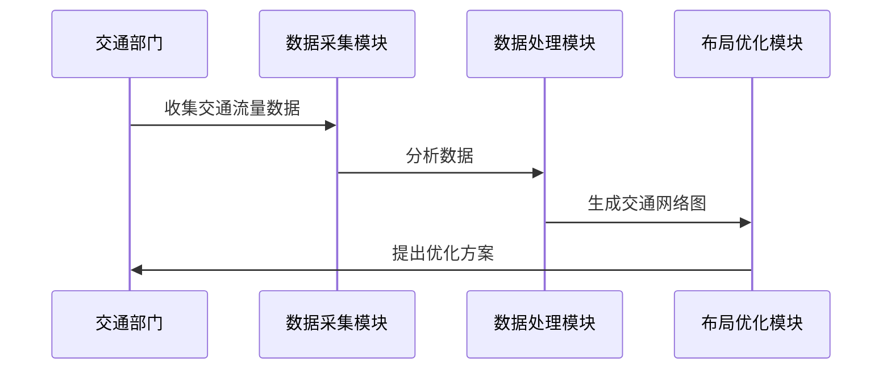
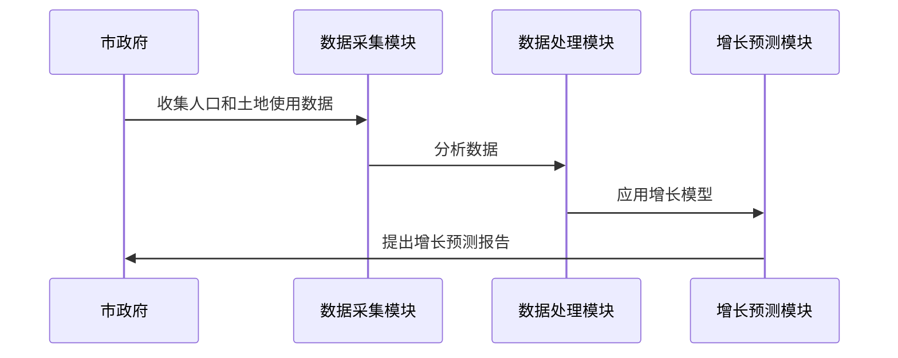

                 

### 文章标题
**数学与城市规划：城市布局的数学模型**

### 文章关键词
- 城市规划
- 数学模型
- 网络模型
- 城市增长模型
- 交通模型

### 摘要
本文将探讨数学在城市规划中的应用，通过数学模型对城市布局进行深入分析。文章首先介绍城市规划的背景及其重要性，然后介绍数学的基本概念及其在城市规划中的应用。接着，文章详细探讨了城市布局中的几种主要数学模型，包括网络模型、城市增长模型和交通模型。最后，通过实际案例的分析，展示了这些数学模型在解决实际问题中的有效性。

## 引言

### 1.1 城市规划的定义与背景
城市规划是关于城市和乡村地区的发展、管理、改进和设计的一门学科。城市规划的目的是创造一个有序、高效和可持续的生活环境，以满足人类的需求。城市规划的历史可以追溯到古埃及时期，但现代城市规划的概念是在19世纪末和20世纪初随着工业化、城市化进程的加快而逐渐形成的。

### 1.2 数学在城市规划中的重要性
数学在城市规划中扮演着至关重要的角色。它不仅提供了描述城市结构和行为的工具，还帮助城市规划师预测城市的发展趋势，优化资源配置，减少交通拥堵，提高生活质量。例如，数学模型可以用来模拟城市交通流量，优化道路网络，预测人口增长对城市基础设施的需求。

### 1.3 数学模型在都市设计中的作用
数学模型在都市设计中起到了关键的指导作用。它们可以帮助城市规划师更好地理解城市结构的复杂性和动态性，从而制定出更科学、更合理的发展计划。例如，网络模型可以帮助优化城市道路布局，城市增长模型可以预测城市未来的扩张趋势，交通模型可以帮助减少交通拥堵，提高交通效率。

### 1.4 本书概述
本书将首先介绍数学的基本概念及其在城市规划中的应用。接着，我们将详细探讨几种主要的城市布局数学模型，包括网络模型、城市增长模型和交通模型。最后，通过实际案例的分析，展示这些数学模型在解决实际问题中的有效性。

## 基础数学概念

### 2.1 集合与逻辑
集合是数学中的基本概念，用于描述一组对象的集合。集合的运算包括并集、交集和补集。逻辑则是用来描述命题之间的关系，包括合取、析取和逆命题等。

### 2.2 几何与拓扑
几何学研究物体的形状、大小和位置，包括平面几何和立体几何。拓扑学则研究物体在变形过程中保持不变的属性，如连通性和紧致性。

### 2.3 线性代数
线性代数涉及向量、矩阵和线性方程组。向量可以用来表示空间中的点，矩阵可以用来表示线性变换，线性方程组可以用来解决多个变量的问题。

### 2.4 微积分
微积分研究的是变化和累积。极限是微积分的基础，用于描述函数在某一点的局部行为。微分和积分则是用来研究函数的变化率和累积量。

## 数学模型在城市规划中的应用

### 3.1 网络模型

网络模型是城市规划中常用的模型之一，它用于描述城市道路、交通网络和公共设施的布局。

#### 3.1.1 基本概念
网络模型可以看作是一个图，其中节点表示城市中的位置，边表示连接这些位置的道路或其他设施。

#### 3.1.2 应用
网络模型可以用于优化城市道路布局，减少交通拥堵。例如，最短路径算法可以用来找到两个地点之间的最短路径。

### 3.2 城市增长模型

城市增长模型用于预测城市人口和面积的增长趋势。

#### 3.2.1 对数增长模型
对数增长模型假设城市人口增长率与当前人口成反比。其公式为：
$$P(t) = P_0 e^{-kt}$$
其中，$P(t)$ 是时间$t$时的城市人口，$P_0$ 是初始人口，$k$ 是增长常数。

#### 3.2.2 指数增长模型
指数增长模型假设城市人口增长率与当前人口成正比。其公式为：
$$P(t) = P_0 (1 + r)^t$$
其中，$r$ 是增长率。

### 3.3 交通模型

交通模型用于描述城市交通流量，优化交通网络。

#### 3.3.1 车流模型
车流模型基于流量-密度关系，假设车辆在道路上的流量与道路的密度成正比。其公式为：
$$q = k \cdot \rho$$
其中，$q$ 是流量，$\rho$ 是密度，$k$ 是比例常数。

#### 3.3.2 信号控制模型
信号控制模型用于优化交通信号灯的控制策略，以减少交通拥堵。常见的控制策略包括固定时间控制、感应控制和自适应控制。

## 实际案例分析

### 4.1 纽约市交通网络优化

#### 4.1.1 项目介绍
纽约市是美国最大的城市，其交通网络复杂且拥堵严重。为了缓解交通压力，纽约市交通部门决定对交通网络进行优化。

#### 4.1.2 系统功能设计
系统功能包括：
- 收集交通流量数据
- 生成交通网络图
- 优化道路布局

#### 4.1.3 系统架构设计
系统架构包括：
- 数据采集模块：使用传感器收集交通流量数据
- 数据处理模块：使用机器学习算法分析数据，生成交通网络图
- 布局优化模块：使用网络模型优化道路布局

#### 4.1.4 系统接口设计
系统接口包括：
- 数据采集接口：用于与传感器通信
- 数据处理接口：用于与机器学习算法通信
- 布局优化接口：用于与城市规划师沟通

#### 4.1.5 系统交互序列图

### 4.2 首尔市城市增长预测

#### 4.2.1 项目介绍
首尔是韩国的首都，随着经济的快速发展，其人口和面积不断增长。为了预测未来的增长趋势，首尔市政府决定进行城市增长预测。

#### 4.2.2 系统功能设计
系统功能包括：
- 收集人口和土地使用数据
- 应用增长模型预测未来增长
- 生成增长预测报告

#### 4.2.3 系统架构设计
系统架构包括：
- 数据采集模块：使用传感器和统计方法收集数据
- 数据处理模块：使用机器学习和统计分析方法处理数据
- 增长预测模块：使用增长模型进行预测

#### 4.2.4 系统接口设计
系统接口包括：
- 数据采集接口：用于与传感器通信
- 数据处理接口：用于与机器学习和统计分析算法通信
- 增长预测接口：用于与城市规划师和市政官员沟通

#### 4.2.5 系统交互序列图

## 总结与展望

### 5.1 小结
本文介绍了数学在城市规划中的应用，探讨了网络模型、城市增长模型和交通模型。通过实际案例的分析，展示了这些模型在解决实际问题中的有效性。数学模型为城市规划提供了科学的方法和工具，有助于提高城市规划的科学性和可操作性。

### 5.2 注意事项
- 在使用数学模型时，需要注意数据的质量和准确性。
- 数学模型只是一种工具，城市规划还需要结合实际需求和人文因素进行综合考量。
- 模型的应用范围和有效性需要在实际项目中不断验证和优化。

### 5.3 拓展阅读
- [城市网络优化模型](https://www.researchgate.net/publication/319237641_Urban_network_optimization_models)
- [城市增长模型的应用](https://journals.sagepub.com/doi/10.1177/030913730404200107)
- [交通流量预测模型](https://www.ijcai.org/Proceedings/16-2/Papers/042.pdf)

### 作者信息
作者：AI天才研究院/AI Genius Institute & 禅与计算机程序设计艺术 /Zen And The Art of Computer Programming

