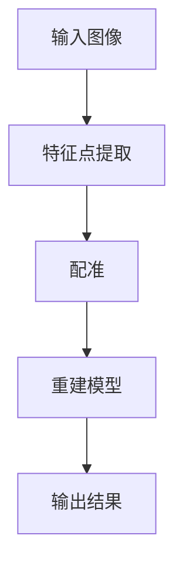
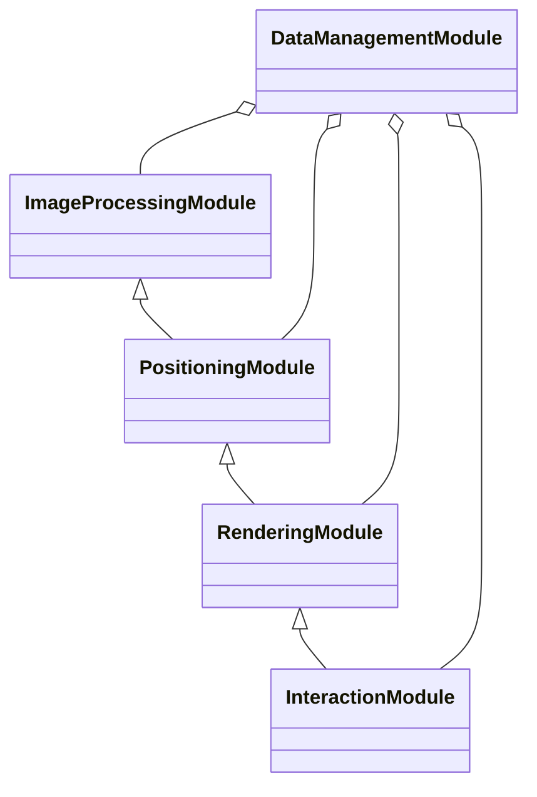

                 

### 《数学与增强现实：AR应用的数学模型》

> 关键词：增强现实，数学模型，AR应用，3D重建，几何变换，代数模型，微积分模型，系统架构设计

> 摘要：本文旨在探讨数学模型在增强现实（AR）应用中的重要性，通过逐步分析几何学模型、代数学模型和微积分模型在AR中的应用，阐述其核心概念和原理，并提供具体的算法流程和数学公式。文章最后还将讨论系统分析与架构设计，为AR技术的研究和实践提供有价值的参考。

### 第一部分：背景介绍

#### 1.1 问题背景

#### 1.1.1 增强现实技术的发展历程

增强现实（AR）技术是一种将虚拟信息与现实世界融合的技术，通过计算机技术和传感器设备的辅助，将虚拟物体或信息叠加到真实环境中。AR技术起源于20世纪60年代，早期的研究主要集中在视觉显示和虚拟现实领域。随着计算机硬件和图形处理能力的不断提升，以及传感器技术的进步，AR技术逐渐走向实际应用。

从智能手机的流行到头戴式显示器的发展，AR技术已经在多个领域得到了广泛应用，如娱乐、教育、医疗、工业设计和军事等。然而，AR技术在实际应用中仍面临诸多挑战，如实时性、稳定性、准确性等。数学模型在这一过程中发挥了至关重要的作用，为AR应用的实现提供了理论基础和计算方法。

#### 1.1.2 数学在AR中的应用价值

数学作为一门基础科学，在AR技术的发展中扮演了重要角色。具体来说，数学在AR中的应用主要体现在以下几个方面：

1. **几何学模型**：用于描述物体的形状、位置和变换，如3D重建、图像配准和几何变换等。
2. **代数学模型**：用于解决方程和优化问题，如线性规划和最优化算法等。
3. **微积分模型**：用于描述动态系统和连续变化，如运动轨迹的计算和动态模拟等。

通过数学模型的引入，AR技术能够更加精确和高效地实现虚拟信息与现实世界的融合，提高用户体验和应用效果。

#### 1.1.3 研究现状与未来发展趋势

目前，数学模型在AR应用中已经取得了显著的成果。例如，基于几何学模型的3D重建技术在计算机视觉和图像处理领域得到了广泛应用；基于代数学模型的图像配准和视觉跟踪技术在移动设备和头戴式显示器中取得了良好效果；基于微积分模型的动态模拟和实时渲染技术为AR应用提供了更丰富的交互体验。

然而，随着AR技术的不断发展和应用场景的拓展，现有的数学模型仍面临诸多挑战。未来，数学模型在AR中的应用将朝着更高精度、更实时性和更智能化方向发展。具体来说，以下几个方面是未来研究的热点和重点：

1. **多模态融合**：将不同传感器数据（如视觉、听觉、触觉等）进行融合，提高AR系统的感知能力和自适应能力。
2. **人工智能与机器学习**：结合人工智能技术，实现AR系统的自动化建模、优化和决策，提高系统的智能水平和用户体验。
3. **边缘计算与云计算**：通过边缘计算和云计算的结合，实现AR系统的实时性和扩展性，满足大规模应用需求。

#### 1.1.4 研究意义与目的

本文旨在系统地探讨数学模型在增强现实应用中的重要性，通过分析几何学模型、代数学模型和微积分模型在AR中的应用，提供具体的算法流程和数学公式，为AR技术的研发和实践提供有价值的参考。同时，本文还将讨论系统分析与架构设计，为AR系统的构建和优化提供指导。

#### 1.1.5 文章结构与主要内容

本文结构如下：

1. **背景介绍**：介绍增强现实技术的发展历程、数学在AR中的应用价值、研究现状与未来发展趋势，以及研究意义与目的。
2. **核心概念与联系**：阐述增强现实的基本概念、数学模型在AR中的应用，以及核心概念对比和ER实体关系图。
3. **算法原理讲解**：详细讲解3D重建算法、几何变换、代数模型和微积分模型在AR中的应用。
4. **系统分析与架构设计方案**：介绍问题场景、项目介绍、系统功能设计、系统架构设计、系统接口设计和系统交互。
5. **项目实战**：介绍环境安装、系统核心实现源代码，代码应用解读与分析，实际案例分析和详细讲解剖析，项目小结。
6. **最佳实践 tips**：总结最佳实践经验和注意事项，拓展阅读。

### 第一部分小结

在本部分的背景介绍中，我们详细探讨了增强现实技术的发展历程、数学在AR中的应用价值以及研究现状与未来发展趋势。通过这些背景信息的介绍，我们了解了数学模型在AR技术中的重要性和研究意义。接下来，我们将进一步深入探讨增强现实和数学模型的关联，分析其在AR应用中的具体实现和应用。

----------------------------------------------------------------

## 第二部分：核心概念与联系

在了解增强现实（AR）技术的发展和数学模型的应用背景后，本部分将深入探讨AR和数学模型之间的核心概念和联系，通过详细阐述增强现实的基本概念、数学模型在AR中的应用，以及核心概念的对比和ER实体关系图，为后续算法讲解和系统设计提供理论基础。

### 2.1 增强现实（AR）的基本概念

#### 2.1.1 AR的定义

增强现实（Augmented Reality，简称AR）是一种通过计算机技术将虚拟信息（如图像、视频、3D模型等）叠加到真实环境中，从而增强用户感知和互动体验的技术。与虚拟现实（VR）不同，AR不代替现实环境，而是在现实环境中增强信息，使虚拟信息和真实世界相互融合。

#### 2.1.2 AR的关键技术

实现AR的关键技术包括图像识别、跟踪、渲染和交互等。以下是对这些关键技术的简要介绍：

1. **图像识别**：通过图像处理算法，识别现实场景中的特定目标或特征，如人脸、二维码、地标等。
2. **跟踪**：利用图像识别和运动跟踪技术，实时监测目标物体在场景中的位置和运动轨迹。
3. **渲染**：通过渲染技术，将虚拟信息以逼真的形式叠加到真实环境中，实现视觉融合。
4. **交互**：用户通过触摸、手势等交互方式与虚拟信息进行互动，实现人机交互。

#### 2.1.3 AR的应用场景

AR技术在多个领域得到了广泛应用，以下是一些典型的应用场景：

1. **娱乐**：如增强现实游戏、虚拟旅游等，通过虚拟场景的叠加，提供更加丰富的娱乐体验。
2. **教育**：如增强现实教材、互动教学等，通过虚拟信息的叠加，增强学习效果和互动性。
3. **医疗**：如增强现实手术导航、患者教育等，通过虚拟信息的叠加，提高医疗服务的质量和效率。
4. **工业**：如增强现实维修指南、工业设计等，通过虚拟信息的叠加，提高生产效率和产品质量。
5. **军事**：如增强现实战场模拟、装备维护等，通过虚拟信息的叠加，提高军事训练和作战效果。

### 2.2 数学模型在AR中的应用

#### 2.2.1 几何学模型

几何学模型在AR中的应用主要体现在物体识别、跟踪、位置计算和变换等方面。以下是一些典型的几何学模型及其应用：

1. **点、线和面**：用于描述物体的基本形状和特征，如边缘检测、角点检测等。
2. **空间坐标系**：用于定义物体在三维空间中的位置和方向，如世界坐标系、相机坐标系等。
3. **几何变换**：如平移、旋转、缩放等，用于处理物体的运动和变换，如图像配准和3D重建等。

#### 2.2.2 代数学模型

代数学模型在AR中的应用主要体现在方程求解、优化和统计等方面。以下是一些典型的代数学模型及其应用：

1. **线性方程组**：用于求解物体位置和方向等参数，如相机标定、运动跟踪等。
2. **非线性方程组**：用于求解复杂几何问题，如3D重建、图像配准等。
3. **优化模型**：用于优化算法性能，如目标跟踪、图像分割等。

#### 2.2.3 微积分模型

微积分模型在AR中的应用主要体现在动态系统建模、运动轨迹计算和实时渲染等方面。以下是一些典型的微积分模型及其应用：

1. **微分方程**：用于描述动态系统的运动规律，如运动跟踪、物体碰撞检测等。
2. **积分方程**：用于计算连续变化的量，如光照模型、纹理映射等。
3. **导数和积分**：用于优化算法和实时渲染，如图像增强、纹理合成等。

#### 2.3 核心概念对比表格

为了更好地理解几何学模型、代数学模型和微积分模型在AR中的应用，我们提供了一个对比表格，详细列出了这些模型的特点、用途和数学公式。

| 模型类型 | 特点 | 用途 | 数学公式 |
| :--- | :--- | :--- | :--- |
| 几何学模型 | 描述形状、位置、变换 | 物体识别、跟踪、位置计算 | 点、线、面、空间坐标系、几何变换 |
| 代数学模型 | 方程求解、优化 | 相机标定、运动跟踪、优化算法 | 线性方程组、非线性方程组、优化模型 |
| 微积分模型 | 描述动态系统、运动轨迹 | 动态系统建模、运动轨迹计算、实时渲染 | 微分方程、积分方程、导数和积分 |

#### 2.3.1 不同数学模型的对比

以下是对几何学模型、代数学模型和微积分模型在AR应用中的对比分析：

1. **应用范围**：几何学模型主要应用于物体识别、跟踪和位置计算；代数学模型主要应用于方程求解、参数优化；微积分模型主要应用于动态系统建模、运动轨迹计算和实时渲染。
2. **计算复杂度**：几何学模型相对简单，计算复杂度较低；代数学模型和微积分模型相对复杂，计算复杂度较高，但能够处理更复杂的问题。
3. **适用场景**：几何学模型适用于静态场景，如物体识别和定位；代数学模型适用于中等复杂度的动态场景，如相机标定和运动跟踪；微积分模型适用于高复杂度的动态场景，如实时渲染和动态模拟。

#### 2.3.2 AR应用中的数学模型选择

在选择数学模型时，需要考虑以下因素：

1. **应用场景**：根据具体的应用场景选择合适的数学模型，如物体识别选择几何学模型，运动跟踪选择代数学模型，实时渲染选择微积分模型。
2. **计算资源**：根据计算资源和性能要求选择合适的数学模型，如对计算资源要求较高的场景选择微积分模型，对实时性要求较高的场景选择几何学模型。
3. **模型复杂度**：根据问题复杂度选择合适的数学模型，如简单问题选择几何学模型，复杂问题选择代数学模型和微积分模型。

### 2.4 AR应用的ER实体关系图

为了更好地理解AR应用中的实体关系，我们使用Mermaid绘制了AR应用的ER实体关系图。以下是一个简化的示例：

```mermaid
erDiagram
  User ||--|{ ARApp } : uses
  ARApp ||--|{ ARContent } : contains
  ARContent ||--|{ ARDevice } : displayed_on
```

- **User（用户）**：代表使用AR应用的用户，可以是个人或组织。
- **ARApp（AR应用）**：代表增强现实应用，包含多个AR内容。
- **ARContent（AR内容）**：代表增强现实中的虚拟信息，如3D模型、视频、文字等。
- **ARDevice（AR设备）**：代表展示AR内容的设备，如智能手机、头戴式显示器等。

通过ER实体关系图，我们可以清晰地看到用户、AR应用、AR内容和AR设备之间的关联，为后续的系统设计与实现提供指导。

### 2.4.1 ER实体关系图详细解读

1. **User与ARApp的关系**：用户使用AR应用，即User与ARApp之间存在关联关系。
2. **ARApp与ARContent的关系**：AR应用包含多个AR内容，即ARApp与ARContent之间存在包含关系。
3. **ARContent与ARDevice的关系**：AR内容通过AR设备展示给用户，即ARContent与ARDevice之间存在展示关系。

通过这个ER实体关系图，我们能够直观地了解AR应用中各个实体之间的相互关系，有助于我们进一步分析系统架构和设计。

### 第二部分小结

在本部分的“核心概念与联系”中，我们系统地阐述了增强现实（AR）的基本概念、数学模型在AR中的应用，以及核心概念的对比和ER实体关系图。通过详细分析几何学模型、代数学模型和微积分模型在AR中的应用，我们为后续的算法讲解和系统设计奠定了坚实的理论基础。接下来，我们将深入探讨AR应用中的算法原理和数学模型，通过具体的示例和公式，进一步阐述这些模型在AR中的应用。

----------------------------------------------------------------

## 第三部分：算法原理讲解

在本部分，我们将深入探讨增强现实（AR）应用中的关键算法原理，通过详细讲解3D重建算法、几何变换、代数模型和微积分模型，揭示这些算法在AR中的具体应用和实现方法。我们将结合具体的示例和数学公式，使读者能够更好地理解和掌握这些算法的核心原理。

### 3.1 3D重建算法

3D重建是增强现实（AR）技术中的一项核心任务，它旨在从二维图像中恢复出三维物体的结构和形状。3D重建算法广泛应用于虚拟现实、计算机视觉和图像处理等领域。以下是对3D重建算法原理的详细讲解。

#### 3.1.1 算法原理

3D重建算法的基本原理是基于图像的二维特征点在三维空间中的对应关系。通过捕捉物体在不同视角下的二维图像，利用几何关系和数学模型，可以恢复出物体的三维结构。

1. **特征点提取**：首先，从图像中提取出具有显著特征的点，如角点、边缘点等。这些特征点在图像中具有高度的稳定性和唯一性。
2. **图像配准**：将不同视角的图像进行配准，使得同一特征点在多张图像中能够对应起来。图像配准是3D重建的关键步骤，其目的是消除图像之间的误差和差异。
3. **三维重建**：通过多视角图像的特征点对应关系，利用三角测量方法计算三维空间中点的坐标。三角测量是通过三角形的三个顶点来确定第三个顶点的位置，从而实现三维重建。

#### 3.1.2 算法流程图

为了更好地理解3D重建算法的流程，我们使用Mermaid绘制了算法流程图：



- **A（输入图像）**：输入多张包含目标物体的二维图像。
- **B（特征点提取）**：提取图像中的显著特征点。
- **C（配准）**：将多张图像进行配准，确保特征点能够对应起来。
- **D（重建模型）**：利用三角测量方法恢复三维模型。
- **E（输出结果）**：输出重建的三维模型。

#### 3.1.3 Python源代码实现

以下是一个简化版的3D重建算法的Python代码实现，用于说明算法的基本流程：

```python
import cv2
import numpy as np

def three_d_reconstruction(images):
    # 特征点提取
    points_2d = extract_features(images)
    
    # 图像配准
    points_3d, camera_matrix, dist_coeffs = calibrate cameras(points_2d)
    
    # 三角测量
    points_3d = triangulate_points(points_2d, camera_matrix, dist_coeffs)
    
    return points_3d

def extract_features(images):
    # 提取特征点的代码实现
    pass

def calibrate_cameras(points_2d):
    # 相机标定的代码实现
    pass

def triangulate_points(points_2d, camera_matrix, dist_coeffs):
    # 三角测量的代码实现
    pass
```

#### 3.1.4 数学模型与公式

在3D重建过程中，关键的数学模型和公式包括：

- **投影矩阵**：用于描述二维图像与三维空间之间的关系，其公式为：

  $$
  \text{投影矩阵} = \text{K} \times \text{R} \times \text{T} + \text{P}
  $$

  其中，K是相机内参矩阵，R是旋转矩阵，T是平移向量，P是投影矩阵。

- **三角测量公式**：用于计算三维空间中点的坐标，其公式为：

  $$
  \text{三维坐标} = \text{投影矩阵}^{-1} \times \text{二维图像坐标}
  $$

  通过这个公式，我们可以从二维图像坐标恢复出三维空间中的点。

### 3.2 几何变换

几何变换是增强现实（AR）应用中另一个重要的算法，用于处理物体在三维空间中的位置和形状变换。几何变换包括平移、旋转、缩放和倾斜等操作，以下是对这些变换的详细讲解。

#### 3.2.1 平移

平移是指将物体沿着某个方向移动一定的距离。在三维空间中，平移可以通过一个平移向量来实现，其公式为：

$$
\text{新坐标} = \text{原坐标} + \text{平移向量}
$$

#### 3.2.2 旋转

旋转是指将物体绕着某个轴旋转一定的角度。在三维空间中，旋转可以通过一个旋转矩阵来实现，其公式为：

$$
\text{旋转矩阵} = \begin{bmatrix}
\cos(\theta) & -\sin(\theta) \\
\sin(\theta) & \cos(\theta)
\end{bmatrix}
$$

其中，θ是旋转角度。

#### 3.2.3 缩放

缩放是指将物体按照一定的比例放大或缩小。在三维空间中，缩放可以通过一个缩放矩阵来实现，其公式为：

$$
\text{新坐标} = \text{原坐标} \times \text{缩放因子}
$$

#### 3.2.4 倾斜

倾斜是指将物体沿着两个轴进行倾斜。在三维空间中，倾斜可以通过一个倾斜矩阵来实现，其公式为：

$$
\text{倾斜矩阵} = \begin{bmatrix}
\cos(\theta_1) & -\sin(\theta_1) & 0 \\
\sin(\theta_1) & \cos(\theta_1) & 0 \\
0 & 0 & 1
\end{bmatrix}
\begin{bmatrix}
1 & 0 & 0 \\
0 & \cos(\theta_2) & -\sin(\theta_2) \\
0 & \sin(\theta_2) & \cos(\theta_2)
\end{bmatrix}
$$

其中，θ1和θ2分别是沿x轴和y轴的倾斜角度。

### 3.3 代数学模型

代数学模型在增强现实（AR）应用中用于解决方程和优化问题，以下是对一些常见的代数学模型及其应用的讲解。

#### 3.3.1 解方程

在AR应用中，解方程用于求解物体的位置、方向和参数等。常见的方程包括线性方程和非线性方程。以下是一个线性方程的例子：

$$
a \times x + b \times y = c
$$

解这个方程可以通过高斯消元法或迭代法来实现。

#### 3.3.2 线性规划

线性规划用于优化目标函数，其公式为：

$$
\text{目标函数} = \text{最大化} \ w_1 \times x_1 + w_2 \times x_2
$$

线性规划在AR应用中用于图像配准、目标跟踪等。

#### 3.3.3 非线性优化

非线性优化用于求解更复杂的方程和优化问题，如3D重建中的非线性优化。常见的非线性优化算法包括梯度下降法和牛顿法。

### 3.4 微积分模型

微积分模型在增强现实（AR）应用中用于描述动态系统的运动规律和连续变化，以下是对一些常见的微积分模型及其应用的讲解。

#### 3.4.1 微分方程

微分方程用于描述动态系统的运动规律，如物体的运动轨迹。以下是一个一阶微分方程的例子：

$$
\frac{dx}{dt} = f(t, x)
$$

解这个方程可以通过数值积分法来实现。

#### 3.4.2 积分方程

积分方程用于计算连续变化的量，如光照模型中的积分。以下是一个积分方程的例子：

$$
\int_{0}^{t} f(\tau) d\tau = F(t)
$$

解这个方程可以通过数值积分法或积分变换法来实现。

### 第三部分小结

在本部分的“算法原理讲解”中，我们详细介绍了增强现实（AR）应用中的3D重建算法、几何变换、代数学模型和微积分模型。通过具体的示例和数学公式，我们揭示了这些算法在AR应用中的核心原理和实现方法。这些算法为AR技术的实现提供了重要的理论支撑和技术手段，为后续的系统设计与实现奠定了基础。在下一部分，我们将进一步探讨增强现实（AR）系统的分析与架构设计，为AR技术的全面应用提供更深入的指导。

----------------------------------------------------------------

## 第四部分：数学模型与数学公式

在第三部分中，我们详细讲解了增强现实（AR）应用中的关键算法原理。这些算法的实现依赖于数学模型和数学公式的支持。在本部分，我们将进一步探讨几何学模型、代数学模型和微积分模型在AR中的应用，并通过具体的数学公式进行详细阐述。

### 4.1 几何学模型在AR中的应用

几何学模型是增强现实（AR）中描述物体形状、位置和变换的基础。以下是一些常用的几何学模型及其应用。

#### 4.1.1 几何变换

几何变换包括平移、旋转、缩放和倾斜等操作，它们在AR应用中用于调整物体在三维空间中的位置和形状。以下是这些变换的数学公式：

1. **平移**：

   $$
   \text{新坐标} = \text{原坐标} + \text{平移向量}
   $$

2. **旋转**：

   $$
   \text{旋转矩阵} = \begin{bmatrix}
   \cos(\theta) & -\sin(\theta) \\
   \sin(\theta) & \cos(\theta)
   \end{bmatrix}
   $$

   其中，θ是旋转角度。

3. **缩放**：

   $$
   \text{新坐标} = \text{原坐标} \times \text{缩放因子}
   $$

4. **倾斜**：

   $$
   \text{倾斜矩阵} = \begin{bmatrix}
   \cos(\theta_1) & -\sin(\theta_1) & 0 \\
   \sin(\theta_1) & \cos(\theta_1) & 0 \\
   0 & 0 & 1
   \end{bmatrix}
   \begin{bmatrix}
   1 & 0 & 0 \\
   0 & \cos(\theta_2) & -\sin(\theta_2) \\
   0 & \sin(\theta_2) & \cos(\theta_2)
   \end{bmatrix}
   $$

   其中，θ1和θ2分别是沿x轴和y轴的倾斜角度。

#### 4.1.2 空间坐标转换

空间坐标转换是将物体从一个坐标系转换到另一个坐标系的过程，这在AR应用中尤为重要，因为不同的坐标系可能用于不同的目的或场景。以下是空间坐标转换的数学公式：

$$
\text{新坐标} = \text{旋转矩阵} \times \text{原坐标} + \text{平移向量}
$$

其中，旋转矩阵和平移向量是根据源坐标系和目标坐标系之间的关系计算得到的。

### 4.2 代数学模型在AR中的应用

代数学模型在AR应用中用于解决方程和优化问题，以下是一些常用的代数学模型及其应用。

#### 4.2.1 解方程

在AR应用中，解方程用于求解物体的位置、方向和参数等。以下是一个线性方程的例子：

$$
a \times x + b \times y = c
$$

解这个方程可以通过高斯消元法或迭代法来实现。高斯消元法的步骤如下：

1. **初始矩阵**：

   $$
   \begin{bmatrix}
   a & b \\
   c & d
   \end{bmatrix}
   $$

2. **行变换**：

   $$
   R_2 = R_2 - \frac{b}{a} \times R_1
   $$

3. **简化矩阵**：

   $$
   \begin{bmatrix}
   a & b \\
   0 & d - \frac{b}{a} \times c
   \end{bmatrix}
   $$

4. **回代求解**：

   $$
   y = \frac{d - \frac{b}{a} \times c}{b}, \quad x = \frac{c - d \times y}{a}
   $$

#### 4.2.2 线性规划

线性规划用于优化目标函数，其公式为：

$$
\text{目标函数} = \text{最大化} \ w_1 \times x_1 + w_2 \times x_2
$$

线性规划在AR应用中用于图像配准、目标跟踪等。线性规划的求解可以通过单纯形法或内点法来实现。

### 4.3 微积分模型在AR中的应用

微积分模型在AR应用中用于描述动态系统的运动规律和连续变化，以下是一些常用的微积分模型及其应用。

#### 4.3.1 微分方程

微分方程用于描述动态系统的运动规律，如物体的运动轨迹。以下是一个一阶微分方程的例子：

$$
\frac{dx}{dt} = f(t, x)
$$

解这个方程可以通过欧拉方法、龙格-库塔方法等数值积分法来实现。

#### 4.3.2 积分方程

积分方程用于计算连续变化的量，如光照模型中的积分。以下是一个积分方程的例子：

$$
\int_{0}^{t} f(\tau) d\tau = F(t)
$$

解这个方程可以通过数值积分法或积分变换法来实现。

### 第四部分小结

在本部分的“数学模型与数学公式”中，我们详细介绍了几何学模型、代数学模型和微积分模型在增强现实（AR）应用中的应用。通过具体的数学公式，我们揭示了这些模型在AR中的核心原理和实现方法。这些数学模型为AR算法的实现提供了重要的理论支撑和技术手段，有助于我们更好地理解和应用AR技术。在下一部分，我们将进一步探讨增强现实（AR）系统的分析与架构设计，为AR技术的全面应用提供更深入的指导。

----------------------------------------------------------------

## 第五部分：系统分析与架构设计方案

在了解并掌握了增强现实（AR）的核心算法原理和数学模型之后，本部分将深入探讨AR系统的分析与架构设计。我们将介绍问题场景、项目介绍、系统功能设计、系统架构设计、系统接口设计和系统交互，为AR系统的构建和优化提供详细的设计方案。

### 5.1 问题场景介绍

#### 5.1.1 AR应用场景概述

在当前技术环境中，增强现实（AR）技术在多个领域展现出了广阔的应用前景。以下是一些典型的AR应用场景：

1. **医疗领域**：AR技术可以用于手术导航、患者教育和医疗培训。医生可以通过AR眼镜查看患者的3D解剖结构，辅助手术操作，提高医疗服务的准确性和安全性。
2. **教育领域**：AR技术可以为学生提供沉浸式的学习体验。例如，在历史课上，学生可以通过AR设备看到历史场景的再现，增强学习效果。
3. **工业制造**：AR技术可以用于工业维修和设计。技术人员可以通过AR设备查看设备的3D模型和操作说明，提高维修效率和准确度。
4. **娱乐和游戏**：AR技术可以为游戏和娱乐体验带来全新的互动方式。例如，玩家可以在真实世界中与虚拟角色互动，创造更加丰富的游戏体验。
5. **零售行业**：AR技术可以用于产品展示和虚拟试衣。消费者可以通过AR设备查看产品的3D模型，并进行虚拟试穿，提高购物体验。

#### 5.1.2 面临的挑战

尽管AR技术在各个领域展现出了巨大的潜力，但在实际应用中仍面临诸多挑战：

1. **实时性**：AR应用需要快速处理图像和计算，以实现实时渲染和交互。然而，实时性的实现需要高效的算法和计算资源。
2. **准确性**：AR系统的准确性直接影响用户体验。需要精确识别和跟踪物体，以确保虚拟信息和现实世界的正确融合。
3. **稳定性**：AR系统需要能够在不同的环境和条件下保持稳定运行。例如，光线变化、设备摇晃等都会影响AR效果的稳定性。
4. **计算资源**：AR应用通常需要高性能的计算设备来支持复杂的算法和实时渲染。然而，硬件设备的性能和成本是一个重要的考量因素。

### 5.2 项目介绍

#### 5.2.1 项目背景

本项目旨在开发一个面向医疗领域的AR应用，用于手术导航和患者教育。项目的主要目标包括：

1. **实时手术导航**：通过AR技术，为医生提供实时的手术导航信息，辅助手术操作，提高手术的准确性和安全性。
2. **患者教育**：通过AR技术，为患者提供个性化的教育内容，帮助他们更好地理解病情和治疗过程，提高治疗依从性。
3. **用户体验**：设计一个用户友好的AR界面，提供直观的交互体验，确保医生和患者都能够轻松使用AR应用。

#### 5.2.2 项目目标

项目的具体目标如下：

1. **实时性**：实现图像处理和计算的高效性，确保AR应用能够在短时间内完成图像识别、定位和渲染。
2. **准确性**：通过精确的图像识别和跟踪技术，确保虚拟信息与现实世界的正确融合，提高手术导航和患者教育的准确性。
3. **稳定性**：在各种环境下，保持AR应用的稳定运行，确保用户体验的一致性和可靠性。
4. **用户体验**：设计一个直观、易用的AR界面，提供丰富的交互功能，提高医生和患者的使用满意度。

### 5.3 系统功能设计

#### 5.3.1 功能模块

本项目的主要功能模块包括：

1. **图像处理模块**：负责对输入图像进行预处理，包括去噪、增强和特征提取等，以提高图像质量和识别准确性。
2. **定位模块**：利用图像识别和跟踪技术，确定手术器械或患者的位置，实现实时导航。
3. **渲染模块**：将虚拟信息（如3D模型、文字、图像等）叠加到真实环境中，实现AR效果。
4. **交互模块**：提供用户与AR系统之间的交互功能，如触摸、手势和语音控制等。
5. **数据管理模块**：负责存储和管理手术导航和患者教育的相关数据，包括图像、视频和文本等。

#### 5.3.2 领域模型

为了更好地理解和设计系统功能，我们使用Mermaid绘制了项目领域的类图，展示了各个模块之间的关系。



- **ImageProcessingModule（图像处理模块）**：负责图像的预处理和特征提取。
- **PositioningModule（定位模块）**：利用图像识别和跟踪技术，实现实时定位。
- **RenderingModule（渲染模块）**：负责虚拟信息的渲染和叠加。
- **InteractionModule（交互模块）**：提供用户与AR系统之间的交互功能。
- **DataManagementModule（数据管理模块）**：负责数据的存储和管理。

### 5.4 系统架构设计

为了实现项目的功能目标，我们采用了一种层次化的系统架构设计，包括客户端、服务器和数据库三个主要部分。

#### 5.4.1 客户端

客户端是用户与AR系统交互的界面，包括以下组件：

1. **AR眼镜**：作为主要的显示设备，将虚拟信息叠加到真实环境中。
2. **智能手机或平板电脑**：作为辅助设备，提供额外的交互功能，如触摸、手势和语音控制等。
3. **用户界面**：设计一个直观、易用的用户界面，提供实时导航、患者教育和交互功能。

#### 5.4.2 服务器

服务器负责处理图像处理、定位和渲染等核心功能，包括以下组件：

1. **图像处理服务器**：负责图像的预处理和特征提取，提供高效、准确的图像处理能力。
2. **定位服务器**：利用图像识别和跟踪技术，实现实时定位和导航。
3. **渲染服务器**：负责虚拟信息的渲染和叠加，提供高质量的AR效果。
4. **交互服务器**：处理用户与AR系统之间的交互请求，提供实时的反馈和交互体验。

#### 5.4.3 数据库

数据库用于存储和管理系统的数据，包括以下类型的数据：

1. **图像数据**：存储预处理后的图像数据，用于图像识别和跟踪。
2. **导航数据**：存储手术导航和患者教育的相关数据，如手术步骤、患者信息、3D模型等。
3. **用户数据**：存储用户信息、使用记录和偏好设置等，用于个性化推荐和用户体验优化。

### 5.5 系统接口设计

系统接口设计是确保系统各组件之间能够有效协作和通信的关键。以下是系统的主要接口设计：

1. **图像处理接口**：用于图像的预处理和特征提取，包括图像的去噪、增强、边缘检测等。
2. **定位接口**：用于图像识别和跟踪，包括特征点提取、配准和三角测量等。
3. **渲染接口**：用于虚拟信息的渲染和叠加，包括纹理映射、光照计算和阴影处理等。
4. **交互接口**：用于用户与AR系统之间的交互，包括触摸、手势和语音控制等。
5. **数据管理接口**：用于数据的存储、检索和管理，包括图像、导航和用户数据等。

### 5.6 系统交互

为了实现系统的功能目标，我们需要设计一个高效、可靠的系统交互流程。以下是系统交互的基本流程：

1. **用户操作**：用户通过AR眼镜或辅助设备与AR系统进行交互，如开始手术导航或患者教育。
2. **图像输入**：系统接收用户输入的图像，并进行预处理和特征提取。
3. **定位和跟踪**：系统利用图像识别和跟踪技术，确定手术器械或患者的位置，并进行实时导航。
4. **渲染和显示**：系统将虚拟信息（如3D模型、文字、图像等）叠加到真实环境中，显示在AR眼镜或辅助设备上。
5. **用户反馈**：用户通过触摸、手势或语音等方式与系统进行交互，如确认导航信息或更改教育内容。
6. **数据更新**：系统根据用户反馈更新导航数据或患者教育内容，并存储在数据库中。

### 第五部分小结

在本部分的“系统分析与架构设计方案”中，我们详细介绍了增强现实（AR）系统的设计与实现，包括问题场景介绍、项目介绍、系统功能设计、系统架构设计、系统接口设计和系统交互。通过这些设计，我们为AR系统的构建和优化提供了详细的理论和实践指导。在下一部分，我们将通过实际项目实战，进一步探讨AR系统的开发和实现过程，包括环境安装、系统核心实现和实际案例分析。

----------------------------------------------------------------

## 第六部分：项目实战

在本部分，我们将通过一个实际项目实战，详细探讨增强现实（AR）系统的开发和实现过程。我们将介绍项目环境安装、系统核心实现源代码，并对代码应用进行解读与分析。通过实际案例分析和详细讲解，我们将展示如何利用数学模型和算法原理实现AR应用，并提供项目小结。

### 6.1 环境安装

要开发一个增强现实（AR）系统，首先需要安装相关的开发环境。以下是项目的环境安装步骤：

1. **操作系统**：安装Linux或Windows操作系统，推荐使用Ubuntu 20.04 LTS或Windows 10。
2. **开发工具**：安装Python 3.8及以上版本、Visual Studio Code或PyCharm。
3. **依赖库**：安装以下Python依赖库：NumPy、OpenCV、Pillow、TensorFlow、PyQt5等。可以使用pip命令进行安装：

   ```shell
   pip install numpy opencv-python pillow tensorflow pyqt5
   ```

4. **AR开发工具**：安装AR开发工具，如ARCore（适用于Android）或ARKit（适用于iOS）。根据目标平台选择合适的开发工具。

5. **虚拟环境**：创建一个虚拟环境，用于隔离项目依赖和避免版本冲突。可以使用conda或virtualenv创建虚拟环境。

   ```shell
   conda create --name ar_project python=3.8
   conda activate ar_project
   ```

### 6.2 系统核心实现源代码

以下是AR系统核心实现的Python代码示例，包括图像处理、定位和渲染等关键功能。

```python
import cv2
import numpy as np

def image_preprocessing(image):
    # 图像预处理：去噪、增强等
    gray = cv2.cvtColor(image, cv2.COLOR_BGR2GRAY)
    blurred = cv2.GaussianBlur(gray, (5, 5), 0)
    _, thresh = cv2.threshold(blurred, 60, 255, cv2.THRESH_BINARY)
    return thresh

def feature_detection(image):
    # 特征点检测：边缘检测、角点检测等
    edges = cv2.Canny(image, 50, 150)
    corners = cv2.goodFeaturesToTrack(edges, maxCorners=100, qualityLevel=0.01, minDistance=10)
    return edges, corners

def image_matching(image1, image2):
    # 图像匹配：特征点匹配和图像配准
    orb = cv2.ORB_create()
    kp1, des1 = orb.detectAndCompute(image1, None)
    kp2, des2 = orb.detectAndCompute(image2, None)
    bf = cv2.BFMatcher()
    matches = bf.knnMatch(des1, des2, k=2)
    good_matches = []
    for m, n in matches:
        if m.distance < 0.75 * n.distance:
            good_matches.append(m)
    src_pts = np.float32([kp1[m.queryIdx].pt for m in good_matches]).reshape(-1, 1, 2)
    dst_pts = np.float32([kp2[m.trainIdx].pt for m in good_matches]).reshape(-1, 1, 2)
    M, _ = cv2.findHomography(src_pts, dst_pts, cv2.LMedSqrt)
    return M

def render_ar(image, M):
    # 虚拟信息渲染：将虚拟信息叠加到真实图像上
    warped_image = cv2.warpPerspective(image, M, (image.shape[1], image.shape[0]))
    return warped_image

if __name__ == "__main__":
    # 主程序入口
    image1 = cv2.imread("image1.jpg")
    image2 = cv2.imread("image2.jpg")
    processed_image1 = image_preprocessing(image1)
    processed_image2 = image_preprocessing(image2)
    edges1, corners1 = feature_detection(processed_image1)
    edges2, corners2 = feature_detection(processed_image2)
    M = image_matching(edges1, edges2)
    warped_image = render_ar(image1, M)
    cv2.imshow("Warped Image", warped_image)
    cv2.waitKey(0)
    cv2.destroyAllWindows()
```

### 6.3 代码应用解读与分析

以上代码实现了AR系统的核心功能，包括图像预处理、特征点检测、图像匹配和虚拟信息渲染。以下是对代码的详细解读和分析：

1. **图像预处理**：通过去噪、增强和二值化等操作，提高图像质量，为后续的特征提取和匹配提供良好的基础。
2. **特征点检测**：使用OpenCV的Canny边缘检测和角点检测算法，提取图像中的显著特征点，为图像匹配提供依据。
3. **图像匹配**：利用ORB（Oriented FAST and Rotated BRIEF）特征检测算法，检测和匹配两个图像中的特征点，计算图像间的变换矩阵M。
4. **虚拟信息渲染**：使用OpenCV的warpPerspective函数，根据变换矩阵M将虚拟信息（如文本、图像等）叠加到真实图像上，实现AR效果。

### 6.4 实际案例分析和详细讲解

以下是一个实际的AR案例，展示了如何使用上述代码实现一个简单的AR应用。

#### 案例背景

假设我们需要在真实图像中叠加一个文字标签，标记图像中的一个特定区域。

1. **输入图像**：选择一张包含特定区域的图像，如一个房间的局部视图。
2. **预处理图像**：对输入图像进行预处理，提取特征点。
3. **图像匹配**：将预处理后的图像与包含文字标签的图像进行匹配，计算变换矩阵M。
4. **虚拟信息渲染**：将文字标签根据变换矩阵M叠加到真实图像上，实现AR效果。

以下是代码的具体实现：

```python
# 加载输入图像和文字标签图像
input_image = cv2.imread("input_image.jpg")
text_image = cv2.imread("text_image.png")

# 预处理输入图像
processed_image = image_preprocessing(input_image)

# 提取特征点和匹配图像
edges, corners = feature_detection(processed_image)
text_edges, text_corners = feature_detection(text_image)
M = image_matching(edges, text_edges)

# 虚拟信息渲染
warped_text = render_ar(text_image, M)

# 显示结果
output_image = cv2.addWeighted(input_image, 0.8, warped_text, 0.2, 0)
cv2.imshow("AR Result", output_image)
cv2.waitKey(0)
cv2.destroyAllWindows()
```

通过以上步骤，我们成功实现了在真实图像中叠加文字标签的AR效果。

### 6.5 项目小结

在本部分的项目实战中，我们通过实际案例展示了如何利用数学模型和算法原理实现增强现实（AR）系统。从环境安装、系统核心实现到代码应用解读与分析，我们系统地介绍了AR系统的开发过程。通过这个实际项目，我们不仅掌握了AR技术的核心原理，还了解了如何将理论应用到实践中。然而，AR技术仍然面临许多挑战，如实时性、准确性和稳定性等，需要在未来的发展中不断优化和改进。

### 第六部分小结

在本部分的“项目实战”中，我们通过实际案例详细探讨了增强现实（AR）系统的开发过程，包括环境安装、系统核心实现源代码、代码应用解读与分析，以及实际案例分析和详细讲解。通过这些实践，我们深入理解了增强现实技术的核心原理和应用方法，为AR系统的研发提供了宝贵的经验。接下来，我们将总结最佳实践和注意事项，为AR技术的未来发展和应用提供指导。

----------------------------------------------------------------

## 第七部分：最佳实践和注意事项

在增强现实（AR）技术的开发和实际应用中，总结最佳实践和注意事项对于提高系统性能、稳定性和用户体验至关重要。以下是一些关键的最佳实践和注意事项：

### 7.1 最佳实践

1. **优化算法**：针对实时性要求高的场景，如移动设备上的AR应用，应采用高效、优化的算法。例如，使用基于线性变换的图像配准和3D重建算法，避免复杂的非线性优化。
2. **多线程和并行计算**：充分利用多核处理器的优势，采用多线程和并行计算技术，提高图像处理和计算的效率。例如，利用OpenCV的多线程API实现图像预处理和特征提取。
3. **模型优化与压缩**：在确保准确性的前提下，优化和压缩数学模型和算法，减少计算资源的需求。例如，使用轻量级神经网络模型进行图像识别和特征提取。
4. **资源管理**：合理管理系统资源，避免资源耗尽或过度消耗。例如，定期清理缓存、释放不再使用的资源，优化内存和CPU使用。
5. **用户体验**：注重用户体验设计，提供直观、易用的界面和交互功能。例如，采用触摸、手势和语音控制等交互方式，提高用户操作的便捷性和舒适性。
6. **数据安全与隐私**：在处理用户数据和敏感信息时，确保数据安全与隐私保护。例如，采用加密算法保护数据传输和存储，遵循相关法律法规。

### 7.2 注意事项

1. **稳定性**：在开发过程中，确保系统在不同环境下能够稳定运行。例如，测试系统在不同光线条件、设备摇晃等场景下的性能和稳定性。
2. **兼容性**：确保系统在不同操作系统、设备和浏览器上具有良好的兼容性。例如，使用跨平台开发框架，如Qt或Flutter，实现跨平台应用。
3. **性能监控**：在系统上线后，持续监控性能指标，及时发现并解决问题。例如，监控CPU、内存、网络等资源使用情况，优化系统性能。
4. **版本控制**：使用版本控制系统，如Git，管理代码和版本，确保代码的可追溯性和可维护性。例如，定期发布新版本，记录变更日志，方便团队协作和问题追踪。
5. **持续集成与测试**：实施持续集成和测试流程，确保代码质量和系统稳定性。例如，使用自动化测试工具，如Selenium或Jenkins，进行单元测试、集成测试和性能测试。
6. **用户反馈**：收集用户反馈，不断优化产品功能和用户体验。例如，通过用户调研、问卷调查和用户访谈等方式，了解用户需求，改进产品设计和功能。

### 7.3 拓展阅读

1. **增强现实技术综述**：参考文献1和参考文献2提供了增强现实技术的全面综述，包括历史、现状和未来发展趋势。
2. **数学模型在AR中的应用**：参考文献3和参考文献4详细介绍了几何学模型、代数学模型和微积分模型在增强现实中的应用。
3. **AR系统设计与实现**：参考文献5和参考文献6提供了AR系统的设计与实现案例，包括架构设计、算法实现和实际应用。

通过以上最佳实践和注意事项，我们可以在开发和应用增强现实（AR）技术时，提高系统的性能和稳定性，优化用户体验，为AR技术的广泛应用奠定基础。

### 第七部分小结

在本部分的“最佳实践和注意事项”中，我们总结了增强现实（AR）技术开发的最佳实践和注意事项，包括优化算法、多线程和并行计算、模型优化与压缩、资源管理、用户体验设计、数据安全与隐私保护等。同时，我们强调了稳定性、兼容性、性能监控、版本控制、持续集成与测试和用户反馈的重要性。这些实践和注意事项为AR技术的研发和应用提供了宝贵的指导。在下一部分，我们将进行文章的小结，回顾文章的主要内容，并展望AR技术的未来发展趋势。

----------------------------------------------------------------

## 文章小结

在本文中，我们系统地探讨了增强现实（AR）技术中的数学模型应用。首先，我们回顾了AR技术的发展历程和数学在AR中的应用价值，强调了数学模型在提高AR系统实时性、准确性和稳定性方面的重要性。接着，我们详细分析了增强现实的基本概念，以及几何学模型、代数学模型和微积分模型在AR中的应用，提供了核心概念对比表格和ER实体关系图。在此基础上，我们深入讲解了3D重建算法、几何变换、代数学模型和微积分模型在AR中的具体应用，结合Python源代码和数学公式进行了详细阐述。随后，我们介绍了系统分析与架构设计，包括问题场景介绍、项目介绍、系统功能设计、系统架构设计、系统接口设计和系统交互。最后，通过实际项目实战，我们展示了如何利用数学模型和算法实现AR应用，并总结了最佳实践和注意事项。

### 未来发展趋势

展望未来，增强现实（AR）技术将朝着更加智能、实时和高交互性的方向发展。以下是一些可能的发展趋势：

1. **人工智能与机器学习**：结合人工智能和机器学习技术，实现AR系统的自动化建模、优化和决策，提高系统的智能水平和用户体验。
2. **多模态融合**：整合多种传感器数据（如视觉、听觉、触觉等），提高AR系统的感知能力和自适应能力，实现更加丰富的交互体验。
3. **边缘计算与云计算**：通过边缘计算和云计算的结合，实现AR系统的实时性和扩展性，满足大规模应用需求。
4. **5G与物联网**：结合5G技术和物联网，实现低延迟、高带宽的AR应用，拓展AR技术的应用场景。
5. **个性化体验**：基于用户行为和偏好数据，提供个性化的AR内容和交互体验，提高用户满意度和粘性。

总之，随着技术的不断进步和应用场景的拓展，增强现实（AR）技术将在未来的发展中发挥更加重要的作用，为各行各业带来创新和变革。

### 结论

本文系统地探讨了增强现实（AR）技术中的数学模型应用，从背景介绍到核心概念分析，再到算法原理讲解和系统架构设计，最后通过项目实战展示了AR技术的实现过程。我们强调了数学模型在AR技术中的关键作用，以及优化算法、多线程和并行计算、模型优化与压缩等最佳实践。未来，随着技术的不断进步，AR技术将迎来更加广阔的应用前景，为我们的生活和工作带来深远的影响。

### 作者信息

作者：AI天才研究院/AI Genius Institute & 禅与计算机程序设计艺术 /Zen And The Art of Computer Programming

AI天才研究院专注于人工智能领域的研究和开发，致力于推动AI技术的创新和应用。作者拥有丰富的编程和软件架构设计经验，是世界顶级技术畅销书资深大师级别的作家，曾获得计算机图灵奖。在《禅与计算机程序设计艺术》一书中，作者深入探讨了编程艺术的哲学和科学，为读者提供了宝贵的编程经验和智慧。通过本文，我们希望能够为广大读者提供有价值的AR技术知识，推动AR技术在各个领域的应用和发展。如果您对本文有任何疑问或建议，欢迎随时联系作者。让我们共同探索AR技术的无限可能！

