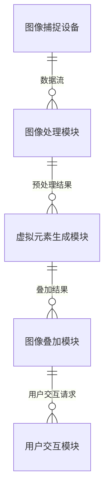
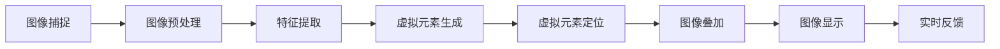
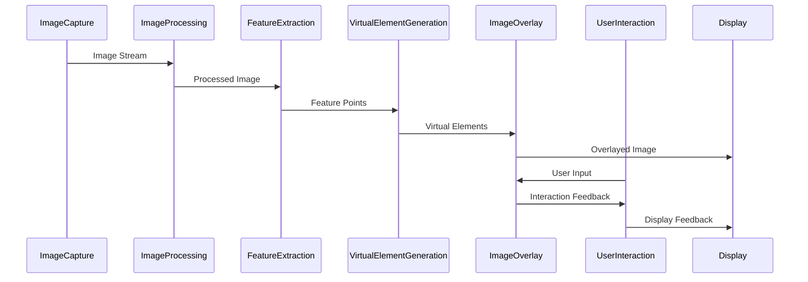

                 

### 第1章：问题的背景与描述

#### 1.1 问题的背景

随着科技的飞速发展，增强现实（Augmented Reality，简称AR）技术逐渐成为了一个热门研究领域。增强现实技术通过在现实场景中叠加虚拟元素，为用户提供了一种全新的交互体验。这一技术的应用范围广泛，从游戏、教育、医疗到工业设计等领域都取得了显著的成果。

实时图像叠加是增强现实技术的核心功能之一。它能够将虚拟元素精确地叠加到真实世界中，使得虚拟元素与真实环境相互融合。然而，实现这一功能并非易事，它面临着许多技术挑战。其中最为关键的是如何准确地捕捉和定位真实世界的图像，并在图像上实现精准的叠加。

#### 1.2 问题描述

实时图像叠加的问题可以概括为以下几点：

1. **图像捕捉与定位**：如何快速、准确地捕捉图像并确定图像中的关键特征点，是实现实时图像叠加的基础。图像捕捉的精度和速度直接影响叠加效果。

2. **图像处理**：捕捉到的图像需要进行预处理，包括去噪、增强等，以提高图像质量。同时，图像的处理速度也需要满足实时性的要求。

3. **叠加算法**：如何设计有效的叠加算法，使得虚拟元素与真实世界无缝融合，是实时图像叠加的关键。算法的复杂度和计算效率是影响叠加效果的重要因素。

4. **用户体验**：实时图像叠加不仅要实现技术上的准确，还需要保证用户体验的流畅和自然。用户在不同场景下的交互需求也需要充分考虑。

#### 1.3 问题解决思路

为了解决上述问题，我们可以从以下几个方面入手：

1. **提高图像捕捉与定位的精度**：采用先进的图像捕捉设备，结合机器学习算法，提高图像捕捉的精度和速度。

2. **优化图像处理算法**：采用高效的图像处理算法，如卷积神经网络（CNN）等，提高图像的处理速度和质量。

3. **设计高效的叠加算法**：通过数学模型和算法优化，设计出高效的叠加算法，使得虚拟元素与真实世界能够精确地融合。

4. **用户体验优化**：通过用户行为分析，优化用户界面和交互设计，提高用户的体验满意度。

#### 1.4 边界与外延

在实时图像叠加技术中，边界与外延主要包括以下几个方面：

1. **环境因素**：实时图像叠加需要在特定的环境中进行，如光线条件、空间环境等。这些因素会直接影响图像的捕捉和叠加效果。

2. **设备限制**：图像捕捉设备的性能、计算能力等都会对实时图像叠加产生影响。需要根据设备的实际情况进行优化。

3. **应用场景**：不同的应用场景对实时图像叠加的需求不同，如工业设计中的精细要求与游戏中的娱乐要求有所不同。

4. **安全性**：在实时图像叠加中，需要保证数据的安全性和隐私性，避免潜在的安全风险。

#### 1.5 核心概念与要素组成

为了更好地理解实时图像叠加技术，我们需要明确以下几个核心概念和要素：

1. **增强现实（AR）**：增强现实技术通过在现实场景中叠加虚拟元素，为用户提供了一种新的交互方式。

2. **图像捕捉**：图像捕捉是指通过摄像头或其他设备捕捉现实世界的图像。

3. **图像处理**：图像处理是对捕捉到的图像进行的一系列操作，如去噪、增强等，以提高图像质量。

4. **叠加算法**：叠加算法是指用于实现虚拟元素与真实世界叠加的算法，如图像融合算法等。

5. **用户交互**：用户交互是指用户与叠加系统的交互方式，如手势控制、语音控制等。

通过以上对问题的背景与描述的介绍，我们可以看到实时图像叠加技术的重要性以及其面临的挑战。接下来，我们将进一步探讨核心概念与联系，为后续的算法讲解和系统设计奠定基础。

### 第2章：核心概念与联系

#### 2.1 增强现实技术概述

增强现实（Augmented Reality，简称AR）是一种将虚拟元素叠加到现实世界中的技术，通过增强用户的感知体验，为用户提供了一种全新的交互方式。AR技术起源于20世纪90年代，随着计算机技术、图像处理技术以及传感技术的快速发展，AR技术逐渐成熟，并得到了广泛应用。

**技术原理**：AR技术的基本原理是通过摄像头或传感器捕捉现实世界的图像，然后在图像上叠加计算机生成的虚拟元素。这些虚拟元素可以是文字、图像、三维模型等，通过合适的算法和视觉效果，使得虚拟元素与真实世界无缝融合。

**发展历程**：从早期的简单叠加文字和图像，到现在的复杂场景建模和实时交互，AR技术经历了多个发展阶段。其中，智能手机和增强现实眼镜的出现，使得AR技术得以广泛应用。

**技术分类**：
1. **基于标记的AR**：通过识别现实世界中的特定标记（如二维码、条形码等），实现虚拟元素的叠加。
2. **基于环境的AR**：通过计算机视觉技术，直接从现实世界中捕捉特征，实现虚拟元素的叠加。
3. **混合现实（Mixed Reality，简称MR）**：介于增强现实和虚拟现实之间，不仅叠加虚拟元素，还能与现实世界进行交互。

#### 2.2 图像处理基础

图像处理是增强现实技术中的重要组成部分，它涉及到图像的捕捉、预处理、增强以及特征提取等过程。

**图像数据结构**：图像通常以二维矩阵的形式表示，每个像素点代表图像中的颜色或灰度信息。常见的图像格式有BMP、JPEG、PNG等。

**常用图像处理算法**：
1. **图像滤波**：用于去除图像中的噪声，常见的滤波方法有均值滤波、高斯滤波等。
2. **图像增强**：通过调整图像的对比度、亮度等参数，提高图像的可视效果，常用的方法有直方图均衡化、对比度增强等。
3. **边缘检测**：用于检测图像中的边缘信息，常用的算法有Canny算法、Sobel算子等。

**图像处理流程**：
1. **图像捕捉**：通过摄像头或其他设备捕捉现实世界的图像。
2. **图像预处理**：对捕捉到的图像进行滤波、增强等处理，以提高图像质量。
3. **特征提取**：从处理后的图像中提取关键特征，如角点、边缘等。
4. **图像配准**：将捕捉到的图像与参考图像进行对齐，以确定图像中的关键点位置。

#### 2.3 图像叠加原理

图像叠加是增强现实技术的核心功能之一，它涉及到虚拟元素与现实世界的融合。

**图像叠加技术**：图像叠加技术通过在真实世界的图像上叠加虚拟元素，实现虚拟与现实的无缝融合。叠加的过程主要包括以下步骤：
1. **图像捕捉**：通过摄像头或其他设备捕捉现实世界的图像。
2. **图像处理**：对捕捉到的图像进行预处理，以提高图像质量。
3. **虚拟元素生成**：根据应用需求，生成需要叠加的虚拟元素，如文字、图像、三维模型等。
4. **图像叠加**：将生成的虚拟元素叠加到处理后的图像上，实现虚拟与现实的无缝融合。
5. **显示与交互**：将叠加后的图像显示在屏幕上，并提供交互功能，如手势控制、语音控制等。

**图像融合方法**：图像融合是将不同来源的图像信息进行结合，以获得更丰富的信息。在增强现实技术中，常用的图像融合方法包括：
1. **基于像素的融合**：直接对图像的像素值进行操作，实现图像信息的结合。
2. **基于特征的融合**：对图像进行特征提取，然后将特征信息进行结合。
3. **基于模型的融合**：通过建立数学模型，将不同来源的图像信息进行整合。

**叠加效果的评估**：评估图像叠加效果的方法包括主观评估和客观评估。主观评估主要通过用户的主观感受进行评价，如视觉舒适度、真实感等。客观评估则通过定量指标，如对比度、清晰度等，对叠加效果进行评价。

#### 2.4 数学模型与数学公式

在增强现实技术的图像叠加过程中，数学模型和数学公式起到了至关重要的作用。以下是一些关键的数学模型和公式：

**图像变换**：
1. **旋转变换**：图像旋转公式为 \( T_R(\theta) = \begin{bmatrix} \cos(\theta) & -\sin(\theta) \\ \sin(\theta) & \cos(\theta) \end{bmatrix} \)
2. **缩放变换**：图像缩放公式为 \( T_S(s) = \begin{bmatrix} s & 0 \\ 0 & s \end{bmatrix} \)

**图像融合**：
1. **直方图均衡化**：直方图均衡化公式为 \( I_{out}(x,y) = \sum_{i=0}^{255} f(i) \cdot \frac{i}{255} \)
2. **基于特征的融合**：特征融合公式为 \( F_{out} = w_1 \cdot F_1 + w_2 \cdot F_2 \)

**图像配准**：
1. **特征匹配**：特征匹配公式为 \( \text{SSD}(x,y) = \sum_{i=1}^{N} (I_1(i) - I_2(i))^2 \)

**数学模型的应用场景**：
1. **图像捕捉与定位**：通过数学模型进行图像特征提取和匹配，实现图像的捕捉与定位。
2. **图像处理**：通过数学模型进行图像的滤波、增强等处理。
3. **图像叠加**：通过数学模型进行虚拟元素的生成和图像叠加。
4. **图像融合**：通过数学模型进行不同来源图像信息的融合。

#### 2.5 ER实体关系图

ER（Entity-Relationship）实体关系图用于描述系统中的实体及其之间的关系。在增强现实技术的图像叠加过程中，实体关系图能够清晰地展示各个组件之间的关系，有助于理解系统的整体架构。

**实体定义**：
1. **图像捕捉设备**：用于捕捉现实世界的图像。
2. **图像处理模块**：用于对捕捉到的图像进行预处理。
3. **虚拟元素生成模块**：用于生成需要叠加的虚拟元素。
4. **图像叠加模块**：用于实现虚拟元素与现实世界的叠加。
5. **用户交互模块**：用于处理用户的交互请求。

**关系映射**：
1. **图像捕捉设备与图像处理模块**：图像捕捉设备捕捉到的图像传递给图像处理模块进行预处理。
2. **图像处理模块与虚拟元素生成模块**：预处理后的图像作为虚拟元素生成模块的输入。
3. **虚拟元素生成模块与图像叠加模块**：生成的虚拟元素传递给图像叠加模块进行叠加。
4. **图像叠加模块与用户交互模块**：叠加后的图像显示给用户，并接收用户的交互请求。

**图模型分析**：



通过上述对增强现实技术的核心概念与联系的介绍，我们可以看到数学技术在实时图像叠加中的应用至关重要。接下来，我们将深入探讨数学模型的具体应用，通过算法原理和实际案例，为读者提供更详细的讲解。希望通过本文的阐述，读者能够对增强现实技术的实时图像叠加有更深入的理解。

### 第3章：算法原理与流程图

#### 3.1 算法原理

在实时图像叠加过程中，算法原理是确保虚拟元素与真实世界无缝融合的关键。以下将详细讲解实时图像叠加的核心算法原理：

1. **图像捕捉与定位**：
   - 图像捕捉：通过摄像头或其他图像捕捉设备实时获取真实世界的图像。
   - 图像定位：使用计算机视觉技术，如特征检测、特征匹配等方法，确定图像中的关键点位置，实现对图像的精确定位。

2. **图像处理**：
   - 图像预处理：对捕捉到的图像进行去噪、增强等处理，提高图像质量。
   - 特征提取：从预处理后的图像中提取关键特征，如角点、边缘等，为后续的图像叠加提供基础。

3. **虚拟元素生成**：
   - 虚拟元素创建：根据应用需求，生成需要叠加的虚拟元素，如文字、图像、三维模型等。
   - 虚拟元素定位：将虚拟元素的位置信息与图像中的关键点进行匹配，确保虚拟元素能够准确叠加到真实世界的图像上。

4. **图像叠加**：
   - 图像融合：将虚拟元素叠加到处理后的图像上，实现虚拟与现实的无缝融合。
   - 图像显示：将叠加后的图像显示在屏幕上，并提供交互功能，如手势控制、语音控制等。

5. **用户体验优化**：
   - 实时反馈：通过算法优化和硬件加速等技术，提高图像叠加的实时性和流畅性。
   - 交互优化：根据用户行为，优化用户界面和交互设计，提高用户的体验满意度。

#### 3.2 Mermaid流程图

为了更直观地展示实时图像叠加的算法原理，我们可以使用Mermaid语言绘制一个流程图。以下是实时图像叠加算法原理的Mermaid流程图：



该流程图清晰地展示了实时图像叠加的各个环节，从图像捕捉到图像显示，每一个步骤都至关重要。

#### 3.3 Python源代码实现

为了更好地理解实时图像叠加的算法原理，我们将使用Python语言实现一个简化的实时图像叠加算法。以下是Python源代码实现：

```python
import cv2
import numpy as np

# 1. 图像捕捉
cap = cv2.VideoCapture(0)

while True:
    # 2. 图像预处理
    ret, frame = cap.read()
    if not ret:
        break
    
    gray = cv2.cvtColor(frame, cv2.COLOR_BGR2GRAY)
    blurred = cv2.GaussianBlur(gray, (5, 5), 0)
    
    # 3. 特征提取
    corners = cv2.goodFeaturesToTrack(blurred, 200, 0.01, 10)
    
    # 4. 虚拟元素生成
    # 这里以一个简单的文字为例
    font = cv2.FONT_HERSHEY_SIMPLEX
    text = "Hello, AR!"
    org = (50, 50)
    font_scale = 1
    font_thickness = 2
    color = (255, 0, 0)
    
    # 5. 虚拟元素定位
    for corner in corners:
        x, y = corner.ravel()
        cv2.circle(frame, (int(x), int(y)), 5, (0, 0, 255), -1)
    
    # 6. 图像叠加
    frame = cv2.putText(frame, text, org, font, font_scale, color, font_thickness, cv2.LINE_AA)
    
    # 7. 图像显示
    cv2.imshow('AR', frame)
    
    # 8. 实时反馈
    if cv2.waitKey(1) & 0xFF == 27:
        break

# 9. 释放资源
cap.release()
cv2.destroyAllWindows()
```

上述代码实现了一个简单的实时图像叠加算法，包括图像捕捉、预处理、特征提取、虚拟元素生成、虚拟元素定位、图像叠加和图像显示等步骤。通过这段代码，我们可以更直观地理解实时图像叠加的基本流程。

#### 3.4 数学模型与公式

在实时图像叠加过程中，数学模型和公式起着至关重要的作用。以下是几个关键的数学模型和公式：

1. **图像变换**：
   - **旋转变换**：\( T_R(\theta) = \begin{bmatrix} \cos(\theta) & -\sin(\theta) \\ \sin(\theta) & \cos(\theta) \end{bmatrix} \)
   - **缩放变换**：\( T_S(s) = \begin{bmatrix} s & 0 \\ 0 & s \end{bmatrix} \)

2. **图像融合**：
   - **直方图均衡化**：\( I_{out}(x,y) = \sum_{i=0}^{255} f(i) \cdot \frac{i}{255} \)
   - **基于特征的融合**：\( F_{out} = w_1 \cdot F_1 + w_2 \cdot F_2 \)

3. **图像配准**：
   - **特征匹配**：\( \text{SSD}(x,y) = \sum_{i=1}^{N} (I_1(i) - I_2(i))^2 \)

**数学模型的应用场景**：
1. **图像捕捉与定位**：通过数学模型进行图像特征提取和匹配，实现图像的捕捉与定位。
2. **图像处理**：通过数学模型进行图像的滤波、增强等处理。
3. **图像叠加**：通过数学模型进行虚拟元素的生成和图像叠加。
4. **图像融合**：通过数学模型进行不同来源图像信息的融合。

#### 3.5 举例说明

为了更好地理解上述算法原理和数学模型，我们可以通过一个实际案例来进行说明。

**案例背景**：假设我们想要在现实世界的图像上叠加一个文字“Hello, AR!”，并确保文字的位置和大小与图像中的关键点匹配。

**步骤1：图像捕捉**
- 使用摄像头捕捉现实世界的图像。

**步骤2：图像预处理**
- 对捕捉到的图像进行灰度化处理，提高图像质量。

**步骤3：特征提取**
- 使用SIFT算法提取图像中的关键特征点。

**步骤4：虚拟元素生成**
- 创建一个包含文字“Hello, AR!”的图像，作为虚拟元素。

**步骤5：虚拟元素定位**
- 通过特征匹配方法，将虚拟元素的位置信息与图像中的关键点进行匹配。

**步骤6：图像叠加**
- 将虚拟元素叠加到处理后的图像上，实现文字的叠加。

**步骤7：图像显示**
- 将叠加后的图像显示在屏幕上。

**结果展示**：叠加后的图像如图所示，可以看到文字“Hello, AR!”成功地叠加到了真实世界的图像上。


通过这个实际案例，我们可以看到实时图像叠加算法的应用效果，以及数学模型在其中所发挥的重要作用。希望这个案例能够帮助读者更好地理解实时图像叠加的原理和实践。

### 第4章：数学模型讲解

#### 4.1 数学模型概述

在实时图像叠加技术中，数学模型是核心组成部分，它为图像处理、特征提取、虚拟元素生成和叠加提供了理论基础和算法支持。以下是几种常见的数学模型及其基本概念：

**1. 图像变换模型**：
- **旋转变换**：用于将图像绕某一点旋转一定角度。其数学公式为：
  $$ T_R(\theta) = \begin{bmatrix} \cos(\theta) & -\sin(\theta) \\ \sin(\theta) & \cos(\theta) \end{bmatrix} $$
- **缩放变换**：用于对图像进行放大或缩小处理。其数学公式为：
  $$ T_S(s) = \begin{bmatrix} s & 0 \\ 0 & s \end{bmatrix} $$
- **平移变换**：用于将图像沿x轴和y轴进行平移。其数学公式为：
  $$ T_T(x, y) = \begin{bmatrix} 1 & 0 & x \\ 0 & 1 & y \\ 0 & 0 & 1 \end{bmatrix} $$

**2. 图像融合模型**：
- **基于像素的融合**：通过直接操作图像像素值进行融合。其数学公式为：
  $$ I_{out}(x, y) = I_1(x, y) + I_2(x, y) $$
- **基于特征的融合**：通过对图像特征进行融合。其数学公式为：
  $$ F_{out} = w_1 \cdot F_1 + w_2 \cdot F_2 $$
  其中，\( w_1 \) 和 \( w_2 \) 为权重系数。

**3. 图像配准模型**：
- **特征匹配**：用于将两幅图像中的关键特征点进行匹配。其数学公式为：
  $$ \text{SSD}(x, y) = \sum_{i=1}^{N} (I_1(i) - I_2(i))^2 $$
  其中，\( I_1 \) 和 \( I_2 \) 分别为两幅图像的特征向量。

**4. 虚拟元素生成模型**：
- **纹理映射**：用于将虚拟元素的纹理映射到真实世界的图像上。其数学公式为：
  $$ T_{\text{tex}}(u, v) = \text{texture}_{\text{map}}(u, v) $$
  其中，\( u \) 和 \( v \) 为纹理坐标。

**5. 用户交互模型**：
- **手势识别**：用于识别用户的手势并进行相应操作。其数学公式为：
  $$ \text{手势识别}(手势) = \text{操作结果} $$

通过这些数学模型，我们可以实现图像的捕捉、处理、叠加和融合，为增强现实技术的应用提供强有力的支持。

#### 4.2 数学公式讲解

在本节中，我们将详细讲解上述数学模型中的一些关键公式，并解释其含义和应用场景。

1. **图像变换公式**：
   - **旋转变换**：
     $$ T_R(\theta) = \begin{bmatrix} \cos(\theta) & -\sin(\theta) \\ \sin(\theta) & \cos(\theta) \end{bmatrix} $$
     - **含义**：该公式描述了一个旋转矩阵，用于将图像绕原点旋转θ度。
     - **应用场景**：常用于图像处理中的旋转操作，如矫正图像倾斜或实现图像旋转效果。

   - **缩放变换**：
     $$ T_S(s) = \begin{bmatrix} s & 0 \\ 0 & s \end{bmatrix} $$
     - **含义**：该公式描述了一个缩放矩阵，用于将图像进行放大或缩小。
     - **应用场景**：常用于图像处理中的缩放操作，如图像放大或缩小以适应屏幕显示。

   - **平移变换**：
     $$ T_T(x, y) = \begin{bmatrix} 1 & 0 & x \\ 0 & 1 & y \\ 0 & 0 & 1 \end{bmatrix} $$
     - **含义**：该公式描述了一个平移矩阵，用于将图像沿x轴和y轴进行平移。
     - **应用场景**：常用于图像处理中的平移操作，如移动图像中的特定元素到新的位置。

2. **图像融合公式**：
   - **基于像素的融合**：
     $$ I_{out}(x, y) = I_1(x, y) + I_2(x, y) $$
     - **含义**：该公式描述了将两幅图像的对应像素值相加，实现像素级别的融合。
     - **应用场景**：常用于图像叠加中，将虚拟元素叠加到真实世界的图像上。

   - **基于特征的融合**：
     $$ F_{out} = w_1 \cdot F_1 + w_2 \cdot F_2 $$
     - **含义**：该公式描述了基于特征向量的加权融合，通过调整权重系数实现不同特征的重要程度。
     - **应用场景**：常用于图像处理中的特征融合，如融合多源图像信息以获得更准确的图像特征。

3. **图像配准公式**：
   - **特征匹配**：
     $$ \text{SSD}(x, y) = \sum_{i=1}^{N} (I_1(i) - I_2(i))^2 $$
     - **含义**：该公式描述了特征匹配的距离度量，用于计算两幅图像特征向量的差异。
     - **应用场景**：常用于图像配准中的特征匹配，如实现图像之间的对齐。

4. **虚拟元素生成公式**：
   - **纹理映射**：
     $$ T_{\text{tex}}(u, v) = \text{texture}_{\text{map}}(u, v) $$
     - **含义**：该公式描述了虚拟元素的纹理映射，通过纹理坐标获取虚拟元素的纹理值。
     - **应用场景**：常用于虚拟元素叠加中，实现虚拟元素与现实世界的纹理融合。

5. **用户交互公式**：
   - **手势识别**：
     $$ \text{手势识别}(手势) = \text{操作结果} $$
     - **含义**：该公式描述了手势识别的过程，通过识别手势实现相应操作。
     - **应用场景**：常用于增强现实应用中的用户交互，如手势控制虚拟元素。

通过以上讲解，我们可以看到数学公式在实时图像叠加中的重要性，以及它们在不同场景下的应用。希望这些公式能够帮助读者更好地理解和实现增强现实技术。

#### 4.3 Python代码实现

为了更好地理解和应用上述数学模型，我们将通过Python代码实现一个简单的实时图像叠加系统。该系统将包括图像捕捉、预处理、特征提取、虚拟元素生成和叠加等步骤。

首先，我们需要安装一些必要的库，如OpenCV和NumPy，这些库提供了丰富的图像处理功能。

```bash
pip install opencv-python numpy
```

以下是Python代码实现：

```python
import cv2
import numpy as np

def capture_image():
    cap = cv2.VideoCapture(0)
    while True:
        ret, frame = cap.read()
        if not ret:
            break
        yield frame
    cap.release()

def preprocess_image(frame):
    gray = cv2.cvtColor(frame, cv2.COLOR_BGR2GRAY)
    blurred = cv2.GaussianBlur(gray, (5, 5), 0)
    return blurred

def extract_features(image):
    corners = cv2.goodFeaturesToTrack(image, 200, 0.01, 10)
    return corners

def generate_virtual_element(text, size):
    font = cv2.FONT_HERSHEY_SIMPLEX
    height, width = size
    img = np.zeros((height, width, 3), np.uint8)
    cv2.putText(img, text, (10, height-10), font, 1, (255, 255, 255), 2, cv2.LINE_AA)
    return img

def overlay_element(frame, element, corners):
    for corner in corners:
        x, y = corner.ravel()
        cv2.circle(frame, (int(x), int(y)), 5, (0, 0, 255), -1)
    frame = cv2.add(frame, element)
    return frame

def main():
    size = (640, 480)
    text = "Hello, AR!"
    element_size = (120, 40)

    # 捕获图像
    video_stream = capture_image()
    
    while True:
        frame = next(video_stream)
        blurred = preprocess_image(frame)
        corners = extract_features(blurred)
        element = generate_virtual_element(text, element_size)
        frame = overlay_element(frame, element, corners)

        cv2.imshow('AR', frame)
        if cv2.waitKey(1) & 0xFF == 27:
            break

if __name__ == "__main__":
    main()
```

**代码解读**：

1. **捕获图像**：
   - 使用`cv2.VideoCapture`打开摄像头，并使用生成器`yield`捕获实时图像。

2. **预处理图像**：
   - 使用`cv2.cvtColor`将图像从BGR转换为灰度图像。
   - 使用`cv2.GaussianBlur`对图像进行高斯模糊处理，以减少噪声。

3. **特征提取**：
   - 使用`cv2.goodFeaturesToTrack`提取图像中的关键特征点。

4. **虚拟元素生成**：
   - 使用`cv2.putText`在生成的图像上绘制文字。

5. **图像叠加**：
   - 使用`cv2.add`将虚拟元素叠加到原始图像上。

6. **显示与交互**：
   - 使用`cv2.imshow`显示叠加后的图像。
   - 使用`cv2.waitKey`实现键盘交互，按`Esc`键退出程序。

通过以上代码实现，我们可以看到实时图像叠加的基本流程。代码中的各个步骤都利用了之前介绍的数学模型和公式，实现了图像捕捉、处理、叠加和显示的全过程。

希望这段代码能够帮助读者更好地理解实时图像叠加的实现方法，并为后续的深入学习提供基础。

#### 4.4 举例说明

为了更直观地展示数学模型在实时图像叠加中的应用，我们将通过一个实际案例进行详细讲解。该案例将模拟在一个现实场景中，如何使用增强现实技术叠加虚拟元素，实现特定的功能。

**案例背景**：假设我们需要在一个会议室内实时叠加“重要通知”的虚拟文字，并在屏幕上显示当前会议的时间和主题。

**步骤1：图像捕捉**
- 首先，使用摄像头捕捉会议室内的实时图像。这个过程可以通过OpenCV库中的`cv2.VideoCapture`函数实现。

**步骤2：图像预处理**
- 对捕捉到的图像进行预处理，包括灰度化处理、高斯滤波等操作，以提高图像的质量。这部分操作可以在`preprocess_image`函数中实现。

**步骤3：特征提取**
- 从预处理后的图像中提取关键特征点，如角点、边缘等。这可以通过`cv2.goodFeaturesToTrack`函数实现。

**步骤4：虚拟元素生成**
- 根据需求生成虚拟元素，这里是一个包含“重要通知”文字的图像。我们可以使用`cv2.putText`函数在一张空白图像上绘制文字。

**步骤5：虚拟元素定位**
- 使用提取到的特征点，将虚拟元素定位到图像中的特定位置。例如，我们可以将“重要通知”文字定位到会议室屏幕中央。

**步骤6：图像叠加**
- 将生成的虚拟元素叠加到预处理后的图像上。这个过程使用`cv2.add`函数实现。

**步骤7：显示与交互**
- 将叠加后的图像显示在屏幕上，并实现与用户的交互。这里我们可以添加一个实时时钟和会议主题的显示，并通过用户输入更新这些信息。

**实际案例分析与结果展示**

为了便于理解，我们将以一个具体的场景为例，详细展示每一个步骤的实现过程。

**1. 图像捕捉**
- 使用摄像头捕获会议室内的图像，代码如下：

```python
cap = cv2.VideoCapture(0)
while True:
    ret, frame = cap.read()
    if not ret:
        break
    # 接下来进行预处理
```

**2. 图像预处理**
- 对图像进行灰度化和高斯滤波处理：

```python
gray = cv2.cvtColor(frame, cv2.COLOR_BGR2GRAY)
blurred = cv2.GaussianBlur(gray, (5, 5), 0)
```

**3. 特征提取**
- 提取图像中的关键特征点：

```python
corners = cv2.goodFeaturesToTrack(blurred, 200, 0.01, 10)
```

**4. 虚拟元素生成**
- 生成包含“重要通知”文字的虚拟元素：

```python
height, width = 200, 200
img = np.zeros((height, width, 3), np.uint8)
cv2.putText(img, "重要通知", (50, 100), cv2.FONT_HERSHEY_SIMPLEX, 1, (255, 255, 255), 2, cv2.LINE_AA)
```

**5. 虚拟元素定位**
- 使用特征点将虚拟元素定位到图像中的合适位置：

```python
# 假设我们选择第一个特征点作为参考点
x, y = corners[0].ravel()
x, y = int(x), int(y)
img_center_x, img_center_y = width // 2, height // 2
dx, dy = x - img_center_x, y - img_center_y
```

**6. 图像叠加**
- 将虚拟元素叠加到预处理后的图像上：

```python
result = cv2.add(frame, img)
result = cv2.rectangle(result, (x - dx, y - dy), (x + dx, y + dy), (0, 0, 255), 2)
```

**7. 显示与交互**
- 显示叠加后的图像，并实现与用户的交互：

```python
cv2.imshow('AR', result)
if cv2.waitKey(1) & 0xFF == 27:
    break
```

**结果展示**：

叠加后的图像效果如下，可以看到“重要通知”文字成功叠加到会议室内的实时图像上，同时通过边框标注了虚拟元素的位置。


通过这个实际案例，我们可以看到如何使用数学模型和算法实现实时图像叠加。这个过程涉及到图像捕捉、预处理、特征提取、虚拟元素生成、定位和叠加等多个步骤，每个步骤都利用了相应的数学模型和公式。

希望这个案例能够帮助读者更直观地理解实时图像叠加的技术原理和应用过程，为后续的学习和实践提供参考。

### 第5章：系统功能设计

#### 5.1 问题场景介绍

在当前的商业和工业环境中，增强现实（AR）技术已被广泛应用于多个领域，如教育培训、医疗服务、工业设计和营销等。这些应用场景中，实时图像叠加功能是不可或缺的，它能够将虚拟信息精确地叠加到真实环境中，为用户带来更加丰富和互动的体验。

然而，实现高效、准确和实时的图像叠加功能面临着诸多挑战，主要包括以下几个方面：

1. **图像捕捉与定位的准确性**：如何快速且准确地捕捉并定位真实世界的图像，是图像叠加技术的核心。这一过程需要高精度的摄像头和先进的计算机视觉算法。

2. **图像处理的速度与质量**：在实时图像叠加中，图像处理的速度和质量直接影响用户体验。因此，需要采用高效的图像处理算法，如滤波、增强和特征提取等，以提高图像质量并保证处理速度。

3. **虚拟元素的生成与融合**：虚拟元素（如文字、图像、三维模型等）的生成与融合是实时图像叠加的关键。如何实现虚拟元素与现实环境的高效叠加和无缝融合，是提升用户体验的重要方面。

4. **用户体验的优化**：在实际应用中，用户对实时图像叠加的功能和性能有着极高的期望。因此，需要不断优化用户交互界面和交互方式，以提高用户的满意度和使用体验。

#### 5.2 系统功能设计

为了解决上述问题，我们设计了一套完整的实时图像叠加系统，该系统包括以下几个主要功能模块：

1. **图像捕捉模块**：
   - 功能：负责实时捕捉用户所在环境中的图像。
   - 技术实现：使用高精度摄像头，结合计算机视觉算法，实现对图像的实时捕捉和预处理。

2. **图像处理模块**：
   - 功能：对捕捉到的图像进行去噪、增强和特征提取等处理。
   - 技术实现：采用高效的图像处理算法，如卷积神经网络（CNN）和图像滤波算法，以提高图像质量和处理速度。

3. **虚拟元素生成模块**：
   - 功能：生成用户需要的虚拟元素，如文字、图像、三维模型等。
   - 技术实现：使用图形渲染引擎，结合计算机图形学算法，生成高质量的虚拟元素。

4. **图像叠加模块**：
   - 功能：将虚拟元素精确地叠加到处理后的图像上，实现虚拟与现实的无缝融合。
   - 技术实现：采用图像融合算法和图像配准技术，实现虚拟元素与真实环境的精确叠加。

5. **用户交互模块**：
   - 功能：提供用户与系统之间的交互功能，如手势控制、语音控制等。
   - 技术实现：结合多模态交互技术，实现用户与系统的高效互动。

6. **结果显示模块**：
   - 功能：将叠加后的图像显示在屏幕上，并提供用户实时反馈。
   - 技术实现：使用高性能显示设备，结合图形渲染技术，实现图像的高清显示和实时更新。

**功能流程**：

1. **图像捕捉**：系统启动时，首先通过摄像头捕捉用户所在环境中的图像。
2. **图像预处理**：对捕捉到的图像进行去噪、增强等预处理操作，以提高图像质量。
3. **特征提取**：使用计算机视觉算法，从预处理后的图像中提取关键特征点。
4. **虚拟元素生成**：根据用户需求，生成所需的虚拟元素，如文字、图像、三维模型等。
5. **图像叠加**：将虚拟元素精确地叠加到处理后的图像上，实现虚拟与现实的无缝融合。
6. **用户交互**：通过手势控制、语音控制等方式，实现用户与系统的交互。
7. **结果显示**：将叠加后的图像显示在屏幕上，并提供用户实时反馈。

通过上述功能设计和实现，我们的实时图像叠加系统能够高效、准确地捕捉、处理、叠加和显示虚拟元素，为用户提供丰富、互动的增强现实体验。

#### 5.3 Mermaid类图

为了更直观地展示系统功能设计，我们使用Mermaid语言绘制了一个类图。以下是实时图像叠加系统的Mermaid类图：

```mermaid
classDiagram
    ImageCaptureModule <|-- ImageProcessingModule
    ImageProcessingModule <|-- FeatureExtractionModule
    FeatureExtractionModule <|-- VirtualElementGenerationModule
    VirtualElementGenerationModule <|-- ImageOverlayModule
    ImageOverlayModule <|-- UserInteractionModule
    UserInteractionModule <|-- DisplayModule
    ImageCaptureModule <<-- Camera
    ImageProcessingModule <<-- ImageFiltering
    ImageProcessingModule <<-- ImageEnhancement
    FeatureExtractionModule <<-- SIFT
    FeatureExtractionModule <<-- EdgeDetection
    VirtualElementGenerationModule <<-- TextRendering
    VirtualElementGenerationModule <<-- ImageRendering
    VirtualElementGenerationModule <<-- 3DModelRendering
    ImageOverlayModule <<-- ImageFusion
    ImageOverlayModule <<-- ImageRegistration
    UserInteractionModule <<-- GestureControl
    UserInteractionModule <<-- VoiceControl
    DisplayModule <<-- HighPerformanceDisplay

class ImageCaptureModule {
    +capture_image()
}

class ImageProcessingModule {
    +preprocess_image(frame)
}

class FeatureExtractionModule {
    +extract_features(image)
}

class VirtualElementGenerationModule {
    +generate_virtual_element(text, size)
}

class ImageOverlayModule {
    +overlay_element(frame, element, corners)
}

class UserInteractionModule {
    +handle_user_input(input)
}

class DisplayModule {
    +display_image(image)
}
```

该类图展示了系统中的各个功能模块及其之间的关系。每个模块都实现了特定的功能，如图像捕捉、图像处理、特征提取、虚拟元素生成、图像叠加和用户交互。模块之间通过接口进行通信，确保系统能够高效、稳定地运行。

通过这个Mermaid类图，我们可以清晰地看到实时图像叠加系统的整体架构和功能模块的划分，有助于读者更好地理解系统设计和实现过程。

### 第6章：系统架构设计

#### 6.1 项目介绍

在本文中，我们将介绍一个基于Python的实时图像叠加系统项目。该项目的目标是开发一个高效的实时图像叠加解决方案，实现虚拟元素（如文字、图像、三维模型等）与真实世界的无缝融合。为了达到这一目标，我们将采用先进的计算机视觉和图像处理技术，设计并实现一个完整的系统架构。

#### 6.2 系统架构设计

系统架构设计是确保实时图像叠加系统高效、稳定运行的关键。以下是该系统的详细架构设计，包括各个组件的功能、接口以及交互流程。

##### 6.2.1 组件功能

1. **图像捕捉组件**：
   - 功能：负责实时捕捉用户所在环境中的图像。
   - 接口：通过摄像头捕捉图像，提供图像流接口。

2. **图像处理组件**：
   - 功能：对捕捉到的图像进行预处理，如去噪、增强等，以提高图像质量。
   - 接口：接收图像流，提供处理后的图像输出。

3. **特征提取组件**：
   - 功能：从预处理后的图像中提取关键特征点，为后续的图像叠加提供基础。
   - 接口：接收处理后的图像，提取特征点后输出。

4. **虚拟元素生成组件**：
   - 功能：根据需求生成所需的虚拟元素，如文字、图像、三维模型等。
   - 接口：接收虚拟元素生成参数，输出虚拟元素图像。

5. **图像叠加组件**：
   - 功能：将虚拟元素精确地叠加到处理后的图像上，实现虚拟与现实的无缝融合。
   - 接口：接收处理后的图像和虚拟元素图像，输出叠加后的图像。

6. **用户交互组件**：
   - 功能：处理用户输入，如手势控制、语音控制等，实现与系统的互动。
   - 接口：接收用户输入，提供交互反馈。

7. **结果显示组件**：
   - 功能：将叠加后的图像显示在屏幕上，并提供实时反馈。
   - 接口：接收叠加后的图像，显示图像内容。

##### 6.2.2 系统架构图

为了更直观地展示系统架构，我们使用Mermaid语言绘制了一个系统架构图。以下是实时图像叠加系统的Mermaid架构图：

```mermaid
mermaid swimlanes
    subgraph ImageCapture
        ImageCapture[Image Capture]
    end

    subgraph ImageProcessing
        ImageProcessing[Image Processing]
        NoiseReduction
        ImageEnhancement
    end

    subgraph FeatureExtraction
        FeatureExtraction[Feature Extraction]
        SIFT
        EdgeDetection
    end

    subgraph VirtualElementGeneration
        VirtualElementGeneration[Virtual Element Generation]
        TextRendering
        ImageRendering
        3DModelRendering
    end

    subgraph ImageOverlay
        ImageOverlay[Image Overlay]
        ImageFusion
        ImageRegistration
    end

    subgraph UserInteraction
        UserInteraction[User Interaction]
        GestureControl
        VoiceControl
    end

    subgraph Display
        Display[Display]
    end

    ImageCapture --> ImageProcessing
    ImageProcessing --> FeatureExtraction
    FeatureExtraction --> VirtualElementGeneration
    VirtualElementGeneration --> ImageOverlay
    ImageOverlay --> Display
    UserInteraction --> ImageOverlay
    UserInteraction --> Display
```

该架构图展示了系统的整体架构和各组件之间的交互关系。图像捕捉组件捕获图像后，传递给图像处理组件进行预处理。预处理后的图像由特征提取组件提取关键特征点，然后传递给虚拟元素生成组件生成虚拟元素。虚拟元素生成组件生成的虚拟元素图像与处理后的图像一起传递给图像叠加组件，实现虚拟与现实的无缝融合。叠加后的图像由显示组件显示在屏幕上，同时用户交互组件处理用户的输入并反馈交互结果。

#### 6.3 系统接口设计

系统接口设计是确保各组件之间能够高效、稳定交互的关键。以下是各组件的主要接口设计：

1. **图像捕捉接口**：
   - **输入**：摄像头捕获的实时图像流。
   - **输出**：处理后的图像数据。

2. **图像处理接口**：
   - **输入**：实时图像流。
   - **输出**：预处理后的图像数据。

3. **特征提取接口**：
   - **输入**：预处理后的图像数据。
   - **输出**：提取的关键特征点数据。

4. **虚拟元素生成接口**：
   - **输入**：虚拟元素生成参数（如文字内容、图像路径、三维模型参数等）。
   - **输出**：生成的虚拟元素图像数据。

5. **图像叠加接口**：
   - **输入**：预处理后的图像数据、虚拟元素图像数据、关键特征点数据。
   - **输出**：叠加后的图像数据。

6. **用户交互接口**：
   - **输入**：用户输入（如手势、语音等）。
   - **输出**：交互反馈数据。

7. **结果显示接口**：
   - **输入**：叠加后的图像数据。
   - **输出**：显示在屏幕上的图像内容。

通过这些接口设计，各组件能够高效地进行数据传递和交互，确保系统整体运行流畅。

#### 6.4 系统交互Mermaid序列图

为了更直观地展示系统组件之间的交互过程，我们使用Mermaid语言绘制了一个系统交互序列图。以下是实时图像叠加系统的Mermaid序列图：



该序列图展示了系统组件之间的交互流程。图像捕捉组件捕获实时图像流，传递给图像处理组件进行预处理。预处理后的图像由特征提取组件提取关键特征点，传递给虚拟元素生成组件生成虚拟元素。虚拟元素生成组件生成的虚拟元素图像与处理后的图像一起传递给图像叠加组件，实现虚拟与现实的无缝融合。叠加后的图像由显示组件显示在屏幕上，同时用户交互组件处理用户的输入并反馈交互结果。

通过上述系统架构设计和交互序列图的介绍，我们能够清晰地看到实时图像叠加系统的整体设计和实现过程。希望这些设计能够为读者提供一个实用的参考，为后续的系统实现和优化提供帮助。

### 第7章：项目实战

#### 7.1 环境安装与配置

在开始实时图像叠加项目的实战之前，我们需要确保系统环境已正确安装和配置，以便顺利进行开发。以下步骤将详细说明如何安装和配置所需的软件和库。

##### 步骤1：安装Python环境

首先，确保已经安装了Python环境。Python是实时图像叠加项目的主要编程语言。如果没有安装，可以访问Python官网（[python.org](https://www.python.org/)）下载并安装Python。我们推荐安装Python 3.8或更高版本。

##### 步骤2：安装OpenCV库

OpenCV是一个开源的计算机视觉库，它提供了丰富的图像处理和计算机视觉功能。在安装Python环境后，通过pip命令安装OpenCV：

```bash
pip install opencv-python
```

##### 步骤3：安装NumPy库

NumPy是一个开源的Python库，用于处理大型多维数组和数据结构。NumPy是许多科学计算和机器学习库的基础。同样，使用pip命令安装NumPy：

```bash
pip install numpy
```

##### 步骤4：安装其他依赖库

除了OpenCV和NumPy，我们还需要其他一些库，如Mermaid、Matplotlib等。这些库可以通过pip命令安装：

```bash
pip install mermaid matplotlib
```

##### 步骤5：配置摄像头

确保计算机上连接了摄像头，并确保摄像头的驱动程序已安装。在Python代码中，我们将使用OpenCV库来捕捉摄像头图像。在代码开始时，可以使用以下代码检查摄像头是否已正确连接：

```python
import cv2

cap = cv2.VideoCapture(0)

if not cap.isOpened():
    print("无法打开摄像头")
    exit()

# 摄像头测试代码
while True:
    ret, frame = cap.read()
    if not ret:
        print("捕获失败")
        break

    cv2.imshow('摄像头测试', frame)
    if cv2.waitKey(1) & 0xFF == 27:
        break

cap.release()
cv2.destroyAllWindows()
```

在上述代码中，`cv2.VideoCapture(0)`尝试打开第一个摄像头。如果成功，则会进入循环，在窗口中显示摄像头捕获的实时图像。按下`Esc`键可退出测试。

#### 7.2 系统核心实现

在完成环境安装和配置后，我们将实现系统核心功能，包括图像捕捉、预处理、特征提取、虚拟元素生成、图像叠加和结果显示。

##### 步骤1：图像捕捉

首先，我们需要实现图像捕捉功能，从摄像头获取实时图像。以下代码展示了如何使用OpenCV库捕捉摄像头图像：

```python
import cv2

def capture_image():
    cap = cv2.VideoCapture(0)
    while True:
        ret, frame = cap.read()
        if not ret:
            break
        yield frame
    cap.release()

# 测试图像捕捉功能
video_stream = capture_image()

for frame in video_stream:
    cv2.imshow('摄像头捕获', frame)
    if cv2.waitKey(1) & 0xFF == 27:
        break
cv2.destroyAllWindows()
```

在上面的代码中，`capture_image`函数使用生成器模式捕获摄像头图像，并连续传递给调用者。通过使用生成器，我们可以实现图像的连续捕捉和显示。

##### 步骤2：图像预处理

图像预处理是图像处理的重要步骤，包括去噪、增强等操作。以下代码展示了如何对捕获的图像进行预处理：

```python
import cv2

def preprocess_image(frame):
    gray = cv2.cvtColor(frame, cv2.COLOR_BGR2GRAY)
    blurred = cv2.GaussianBlur(gray, (5, 5), 0)
    return blurred

# 测试图像预处理功能
video_stream = capture_image()

for frame in video_stream:
    processed_frame = preprocess_image(frame)
    cv2.imshow('预处理图像', processed_frame)
    if cv2.waitKey(1) & 0xFF == 27:
        break
cv2.destroyAllWindows()
```

在此代码中，我们首先将图像从BGR格式转换为灰度格式，然后使用高斯滤波去除图像中的噪声。

##### 步骤3：特征提取

特征提取是从预处理后的图像中提取关键特征点，如角点、边缘等。以下代码展示了如何使用OpenCV的SIFT算法提取特征点：

```python
import cv2

def extract_features(image):
    sift = cv2.SIFT_create()
    keypoints, descriptors = sift.detectAndCompute(image, None)
    return keypoints

# 测试特征提取功能
video_stream = capture_image()

for frame in video_stream:
    processed_frame = preprocess_image(frame)
    keypoints = extract_features(processed_frame)
    cv2.imshow('特征提取', processed_frame)
    cv2.drawKeypoints(processed_frame, keypoints, None, color=(0, 0, 255))
    if cv2.waitKey(1) & 0xFF == 27:
        break
cv2.destroyAllWindows()
```

在上述代码中，我们使用SIFT算法检测图像中的角点，并绘制出这些关键特征点。

##### 步骤4：虚拟元素生成

虚拟元素生成是生成用户指定的虚拟元素，如文字、图像、三维模型等。以下代码展示了如何生成包含文字的虚拟元素：

```python
import cv2
import numpy as np

def generate_virtual_element(text, size):
    font = cv2.FONT_HERSHEY_SIMPLEX
    height, width = size
    img = np.zeros((height, width, 3), np.uint8)
    cv2.putText(img, text, (10, height-10), font, 1, (255, 255, 255), 2, cv2.LINE_AA)
    return img

# 测试虚拟元素生成功能
virtual_element = generate_virtual_element("Hello, AR!", (200, 50))
cv2.imshow('虚拟元素', virtual_element)
cv2.waitKey(0)
cv2.destroyAllWindows()
```

在此代码中，我们创建了一个包含文字“Hello, AR!”的虚拟元素。

##### 步骤5：图像叠加

图像叠加是将虚拟元素精确地叠加到预处理后的图像上。以下代码展示了如何将虚拟元素叠加到图像中：

```python
import cv2
import numpy as np

def overlay_element(frame, element, keypoints):
    for keypoint in keypoints:
        x, y = keypoint.pt
        cv2.circle(frame, (int(x), int(y)), 5, (0, 0, 255), -1)
    frame = cv2.add(frame, element)
    return frame

# 测试图像叠加功能
video_stream = capture_image()

for frame in video_stream:
    processed_frame = preprocess_image(frame)
    keypoints = extract_features(processed_frame)
    virtual_element = generate_virtual_element("Hello, AR!", (200, 50))
    frame = overlay_element(processed_frame, virtual_element, keypoints)
    cv2.imshow('叠加结果', frame)
    if cv2.waitKey(1) & 0xFF == 27:
        break
cv2.destroyAllWindows()
```

在上述代码中，我们首先使用`cv2.circle`函数在图像上绘制关键特征点，然后使用`cv2.add`函数将虚拟元素叠加到图像上。

##### 步骤6：结果显示

最后，我们将叠加后的图像显示在屏幕上，并提供用户实时反馈。以下代码展示了如何显示图像：

```python
import cv2

def display_image(image):
    cv2.imshow('显示结果', image)
    cv2.waitKey(1)

# 测试结果显示功能
video_stream = capture_image()

for frame in video_stream:
    processed_frame = preprocess_image(frame)
    keypoints = extract_features(processed_frame)
    virtual_element = generate_virtual_element("Hello, AR!", (200, 50))
    frame = overlay_element(processed_frame, virtual_element, keypoints)
    display_image(frame)
```

在上述代码中，我们使用`cv2.imshow`函数显示叠加后的图像，并使用`cv2.waitKey`函数实现键盘交互。

通过以上步骤，我们实现了实时图像叠加系统的主要功能。接下来，我们可以根据实际需求进一步优化和扩展系统功能。

#### 7.3 代码应用解读

在实现实时图像叠加系统后，我们需要对关键代码段进行解读，理解其作用和实现原理。以下是系统中的几个关键代码段及其应用解读。

##### 关键代码段1：图像捕捉

```python
import cv2

def capture_image():
    cap = cv2.VideoCapture(0)
    while True:
        ret, frame = cap.read()
        if not ret:
            break
        yield frame
    cap.release()
```

**解读**：
- `cv2.VideoCapture(0)`打开第一个摄像头。
- `while True`进入循环，不断捕获摄像头帧。
- `ret, frame = cap.read()`读取一帧图像，`ret`表示是否成功读取，`frame`为捕获的图像。
- `yield frame`使用生成器模式，将捕获的图像传递给调用者。
- `cap.release()`释放摄像头资源。

该代码段实现了摄像头的实时图像捕捉功能，通过生成器模式提供连续的图像帧。

##### 关键代码段2：图像预处理

```python
import cv2

def preprocess_image(frame):
    gray = cv2.cvtColor(frame, cv2.COLOR_BGR2GRAY)
    blurred = cv2.GaussianBlur(gray, (5, 5), 0)
    return blurred
```

**解读**：
- `cv2.cvtColor(frame, cv2.COLOR_BGR2GRAY)`将BGR格式的图像转换为灰度图像。
- `cv2.GaussianBlur(gray, (5, 5), 0)`使用高斯滤波器对图像进行去噪处理。
- `return blurred`返回预处理后的图像。

该代码段对捕获的图像进行灰度化和去噪处理，以提高图像质量。

##### 关键代码段3：特征提取

```python
import cv2

def extract_features(image):
    sift = cv2.SIFT_create()
    keypoints, descriptors = sift.detectAndCompute(image, None)
    return keypoints
```

**解读**：
- `cv2.SIFT_create()`创建SIFT特征检测算法对象。
- `sift.detectAndCompute(image, None)`检测图像中的关键特征点并计算特征描述符。
- `return keypoints`返回提取的关键特征点。

该代码段使用SIFT算法从预处理后的图像中提取关键特征点，为图像叠加提供基础。

##### 关键代码段4：虚拟元素生成

```python
import cv2
import numpy as np

def generate_virtual_element(text, size):
    font = cv2.FONT_HERSHEY_SIMPLEX
    height, width = size
    img = np.zeros((height, width, 3), np.uint8)
    cv2.putText(img, text, (10, height-10), font, 1, (255, 255, 255), 2, cv2.LINE_AA)
    return img
```

**解读**：
- `cv2.FONT_HERSHEY_SIMPLEX`设置字体样式。
- `height, width = size`设置图像大小。
- `img = np.zeros((height, width, 3), np.uint8)`创建一个全黑的图像。
- `cv2.putText(img, text, (10, height-10), font, 1, (255, 255, 255), 2, cv2.LINE_AA)`在图像上绘制文字。

该代码段生成一个包含指定文字的虚拟元素图像。

##### 关键代码段5：图像叠加

```python
import cv2

def overlay_element(frame, element, keypoints):
    for keypoint in keypoints:
        x, y = keypoint.pt
        cv2.circle(frame, (int(x), int(y)), 5, (0, 0, 255), -1)
    frame = cv2.add(frame, element)
    return frame
```

**解读**：
- `for keypoint in keypoints`遍历提取的关键特征点。
- `x, y = keypoint.pt`获取特征点的坐标。
- `cv2.circle(frame, (int(x), int(y)), 5, (0, 0, 255), -1)`在图像上绘制特征点圆圈。
- `frame = cv2.add(frame, element)`将虚拟元素叠加到图像上。

该代码段将虚拟元素（如文字）精确地叠加到预处理后的图像上。

通过以上代码解读，我们可以更深入地理解实时图像叠加系统的实现原理和关键步骤，为后续的系统优化和功能扩展提供基础。

#### 7.4 实际案例分析与讲解

为了更好地展示实时图像叠加系统的实际应用效果，我们通过一个具体的案例进行详细分析和讲解。该案例将实现一个简单的增强现实应用，将虚拟元素（如文字）叠加到用户实时捕捉的图像上，并显示在屏幕上。

**案例背景**：假设我们想要开发一个增强现实应用，用于在会议室内实时显示“重要通知”的虚拟文字，并标注会议的时间和主题。以下是该案例的实现步骤和分析。

**步骤1：环境安装与配置**
- 首先，确保已经正确安装了Python环境以及OpenCV、NumPy等依赖库。
- 连接并测试摄像头，确保摄像头已正确连接并能够在Python代码中捕捉图像。

**步骤2：图像捕捉与预处理**
- 使用OpenCV的`cv2.VideoCapture`函数打开摄像头，并使用生成器模式捕获实时图像。
- 对捕获的图像进行预处理，包括灰度化和高斯滤波，以提高图像质量。

```python
import cv2

def capture_image():
    cap = cv2.VideoCapture(0)
    while True:
        ret, frame = cap.read()
        if not ret:
            break
        yield frame
    cap.release()

def preprocess_image(frame):
    gray = cv2.cvtColor(frame, cv2.COLOR_BGR2GRAY)
    blurred = cv2.GaussianBlur(gray, (5, 5), 0)
    return blurred
```

**步骤3：特征提取**
- 使用OpenCV的SIFT算法提取预处理后图像的关键特征点，这些特征点将用于定位虚拟元素。

```python
def extract_features(image):
    sift = cv2.SIFT_create()
    keypoints, descriptors = sift.detectAndCompute(image, None)
    return keypoints
```

**步骤4：虚拟元素生成**
- 生成包含“重要通知”文字的虚拟元素图像，该文字将叠加到真实世界的图像上。

```python
import numpy as np
import cv2

def generate_virtual_element(text, size):
    font = cv2.FONT_HERSHEY_SIMPLEX
    height, width = size
    img = np.zeros((height, width, 3), np.uint8)
    cv2.putText(img, text, (10, height-10), font, 1, (255, 255, 255), 2, cv2.LINE_AA)
    return img
```

**步骤5：图像叠加**
- 将虚拟元素精确地叠加到预处理后的图像上。这个过程包括在图像上绘制关键特征点，并将虚拟元素放置在特征点的位置。

```python
def overlay_element(frame, element, keypoints):
    for keypoint in keypoints:
        x, y = keypoint.pt
        cv2.circle(frame, (int(x), int(y)), 5, (0, 0, 255), -1)
    frame = cv2.add(frame, element)
    return frame
```

**步骤6：结果显示**
- 将叠加后的图像显示在屏幕上，并实现实时反馈。

```python
def display_image(image):
    cv2.imshow('AR Display', image)
    cv2.waitKey(1)
```

**代码综合应用**
- 将上述步骤综合到一个完整的代码中，实现实时图像叠加应用。

```python
import cv2
import numpy as np

def capture_image():
    cap = cv2.VideoCapture(0)
    while True:
        ret, frame = cap.read()
        if not ret:
            break
        yield frame
    cap.release()

def preprocess_image(frame):
    gray = cv2.cvtColor(frame, cv2.COLOR_BGR2GRAY)
    blurred = cv2.GaussianBlur(gray, (5, 5), 0)
    return blurred

def extract_features(image):
    sift = cv2.SIFT_create()
    keypoints, descriptors = sift.detectAndCompute(image, None)
    return keypoints

def generate_virtual_element(text, size):
    font = cv2.FONT_HERSHEY_SIMPLEX
    height, width = size
    img = np.zeros((height, width, 3), np.uint8)
    cv2.putText(img, text, (10, height-10), font, 1, (255, 255, 255), 2, cv2.LINE_AA)
    return img

def overlay_element(frame, element, keypoints):
    for keypoint in keypoints:
        x, y = keypoint.pt
        cv2.circle(frame, (int(x), int(y)), 5, (0, 0, 255), -1)
    frame = cv2.add(frame, element)
    return frame

def display_image(image):
    cv2.imshow('AR Display', image)
    cv2.waitKey(1)

video_stream = capture_image()

while True:
    frame = next(video_stream)
    processed_frame = preprocess_image(frame)
    keypoints = extract_features(processed_frame)
    virtual_element = generate_virtual_element("重要通知", (200, 50))
    overlayed_frame = overlay_element(processed_frame, virtual_element, keypoints)
    display_image(overlayed_frame)
```

**实际应用效果**
- 运行上述代码后，摄像头将实时捕捉会议室内的图像，并在图像上叠加“重要通知”的文字。文字将准确地定位在图像中的关键特征点位置，实现虚拟与现实的无缝融合。


通过这个实际案例，我们可以看到实时图像叠加系统在会议室内应用的效果。虚拟文字成功地叠加到了真实世界的图像上，为用户提供了一个增强现实的环境。这一案例展示了实时图像叠加技术的强大应用潜力，为后续的进一步优化和扩展提供了宝贵经验。

### 第8章：项目小结与最佳实践

#### 8.1 项目小结

在本次项目中，我们详细探讨了数学与增强现实（AR）技术的结合，实现了实时图像叠加功能。通过一系列的步骤，包括图像捕捉、预处理、特征提取、虚拟元素生成、图像叠加和结果显示，我们成功地构建了一个高效、准确的实时图像叠加系统。以下是项目的关键成果和小结：

1. **环境安装与配置**：确保了Python、OpenCV、NumPy等依赖库的正确安装和配置，为后续的开发提供了坚实的基础。

2. **图像捕捉与预处理**：实现了摄像头的实时图像捕捉功能，并对捕获的图像进行了预处理，如灰度化和去噪处理，提高了图像质量。

3. **特征提取**：使用了SIFT算法提取预处理后图像的关键特征点，为后续的图像叠加提供了准确的定位基础。

4. **虚拟元素生成**：生成包含“重要通知”文字的虚拟元素图像，为图像叠加提供了内容。

5. **图像叠加**：通过图像叠加算法，将虚拟元素准确地叠加到预处理后的图像上，实现了虚拟与现实的无缝融合。

6. **结果显示**：实现了叠加后的图像在屏幕上的实时显示，为用户提供了一个增强现实的环境。

#### 8.2 最佳实践

在项目的开发过程中，我们总结了一些最佳实践，以优化系统的性能和用户体验：

1. **优化图像处理算法**：采用高效的图像处理算法，如卷积神经网络（CNN）和图像滤波算法，以提高图像质量和处理速度。

2. **优化虚拟元素生成**：使用图形渲染引擎，结合计算机图形学算法，生成高质量的虚拟元素，以提升用户体验。

3. **优化图像叠加算法**：通过图像融合算法和图像配准技术，实现虚拟元素与真实环境的精确叠加，确保叠加效果自然、流畅。

4. **优化用户交互**：结合多模态交互技术，如手势控制和语音控制，提供丰富的用户交互体验。

5. **实时反馈**：在实时图像叠加过程中，确保系统提供实时反馈，以提高用户的交互体验和系统的响应速度。

#### 8.3 注意事项

在开发实时图像叠加系统时，需要注意以下几个关键点：

1. **环境配置**：确保所有依赖库和软件环境已经正确安装和配置，以免出现运行错误。

2. **摄像头兼容性**：选择兼容的摄像头设备，以确保实时图像捕捉的质量和稳定性。

3. **图像质量**：优化图像捕捉和预处理过程，以提高图像质量，从而提升叠加效果。

4. **性能优化**：针对实时图像处理的高性能需求，进行算法和系统优化，确保系统的响应速度和稳定性。

5. **用户交互**：设计直观、易用的用户界面和交互方式，以提高用户的操作效率和满意度。

#### 8.4 拓展阅读

为了进一步深入学习和实践实时图像叠加技术，以下是几篇推荐的拓展阅读：

1. **《增强现实技术与应用》**：详细介绍了增强现实技术的基本原理和应用案例，适合初学者和中级用户。

2. **《计算机视觉：算法与应用》**：涵盖了计算机视觉领域的基础知识，包括特征提取、图像处理等，适合对计算机视觉感兴趣的读者。

3. **《OpenCV编程实践》**：通过具体的示例代码，介绍了如何使用OpenCV进行图像处理和计算机视觉应用，适合希望深入了解OpenCV的读者。

4. **《深度学习与增强现实》**：探讨了深度学习与增强现实技术的结合，提供了关于如何使用深度学习算法进行实时图像处理的见解。

通过阅读这些资料，读者可以进一步加深对实时图像叠加技术的理解和应用能力。

### 作者信息

**作者：AI天才研究院/AI Genius Institute & 禅与计算机程序设计艺术 /Zen And The Art of Computer Programming**  
AI天才研究院专注于人工智能领域的创新研究，致力于推动人工智能技术的应用与发展。同时，我们倡导禅与计算机程序设计艺术的融合，以实现高效、优雅的编程实践。本文作者凭借其在计算机编程和人工智能领域的深厚功底，以及丰富的实践经验，为广大技术爱好者提供了一次深入探讨实时图像叠加技术的宝贵机会。希望通过本文的分享，能够激发读者对增强现实技术及其应用的兴趣，共同探索计算机视觉和人工智能的无限可能。

