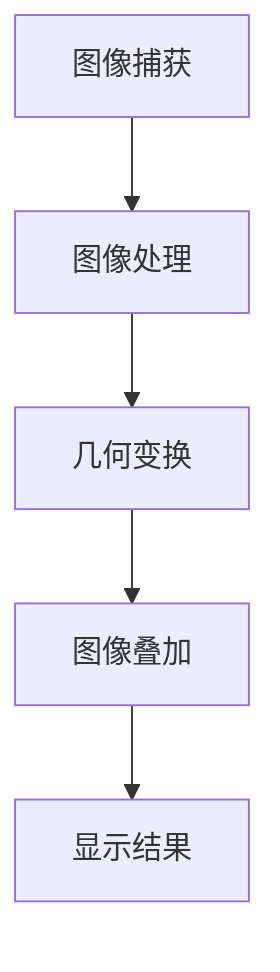
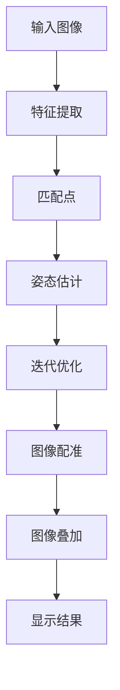
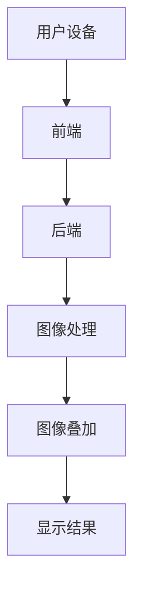
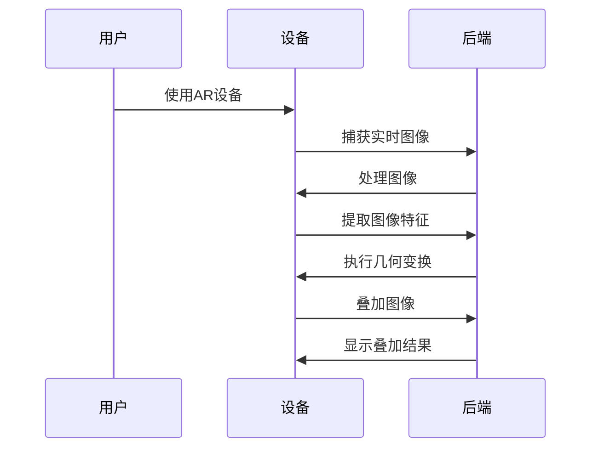

                 


## 让我们一步步深入思考

### 背景介绍

**核心概念术语说明**：在开始讨论数学与增强现实（AR）之间的融合之前，我们需要澄清一些关键术语。增强现实是一种将数字信息叠加到现实世界中的技术，这通常通过佩戴特定的设备（如智能手机或AR眼镜）来实现。数学是解决现实世界问题的工具，它包括从基本的算术到复杂的代数、几何和微积分等各种分支。

**问题背景**：随着智能手机和AR应用变得越来越普及，实时图像叠加成为了一个关键功能。然而，这一功能背后的技术挑战很大。例如，如何确保叠加的图像与现实世界的物体对齐？如何处理实时数据流，以确保图像叠加的流畅性？

**问题描述**：实时图像叠加涉及多个数学问题，包括图像处理、几何变换和概率统计。我们需要找到一个高效、准确的算法来处理这些任务。

**问题解决**：数学提供了一系列工具和方法，如图像处理算法、投影几何和统计学方法，来解决这个问题。

**边界与外延**：实时图像叠加不仅限于AR应用，还可以应用于计算机视觉、虚拟现实和机器人导航等领域。

**概念结构与核心要素组成**：实时图像叠加涉及以下核心要素：
- **图像捕获**：使用摄像头捕捉实时图像。
- **图像处理**：对图像进行预处理，如滤波、降噪和增强。
- **几何变换**：对图像进行变换，使其与真实世界对齐。
- **图像叠加**：将数字图像叠加到实时捕获的图像上。

### 核心概念与联系

**核心概念原理**：
- **图像处理**：图像处理是使用算法来修改和操作图像的过程。在实时图像叠加中，图像处理用于增强图像质量，去除噪声和干扰。
- **几何变换**：几何变换是用于调整图像位置、大小和方向的数学操作。在AR中，几何变换确保数字图像与现实世界物体对齐。
- **概率统计**：概率统计用于分析和处理不确定性。在AR中，概率统计帮助确定图像叠加的准确性。

**概念属性特征对比表格**：

| 概念 | 描述 | 特征对比 |
| --- | --- | --- |
| 图像处理 | 改变图像内容 | 输入图像 -> 输出图像 |
| 几何变换 | 图像空间变换 | 保持图像内容，改变图像位置 |
| 概率统计 | 处理不确定性 | 基于样本数据做出概率推断 |

**ER实体关系图架构的Mermaid流程图**：



### 算法原理讲解

为了实现实时图像叠加，我们使用以下算法：

1. **特征提取**：
   - 使用边缘检测算法提取图像的特征。
   - 对提取的特征进行匹配，以找到匹配点。

2. **姿态估计**：
   - 使用单应性矩阵（Homography）估计图像和现实世界之间的变换关系。
   - 通过迭代优化方法（如最小二乘法）改进估计。

3. **图像配准**：
   - 根据姿态估计结果，对图像进行变换，使其与现实世界对齐。

4. **图像叠加**：
   - 使用透明度混合技术将数字图像叠加到实时捕获的图像上。

**算法mermaid流程图**：



**Python源代码示例**：

```python
import cv2
import numpy as np

# 特征提取
def extract_features(image):
    gray = cv2.cvtColor(image, cv2.COLOR_BGR2GRAY)
    edges = cv2.Canny(gray, 100, 200)
    return edges

# 姿态估计
def estimate_homography(points1, points2):
    points1 = np.float32(points1).reshape(-1, 1, 2)
    points2 = np.float32(points2).reshape(-1, 1, 2)
    H, _ = cv2.findHomography(points1, points2)
    return H

# 图像配准
def register_image(image, H):
    height, width = image.shape[:2]
    warped = cv2.warpPerspective(image, H, (width, height))
    return warped

# 图像叠加
def overlay_images(image1, image2, alpha):
    blended = cv2.addWeighted(image1, alpha, image2, 1 - alpha, 0)
    return blended

# 示例
image1 = cv2.imread('image1.jpg')
image2 = cv2.imread('image2.jpg')

edges1 = extract_features(image1)
edges2 = extract_features(image2)

points1 = np.float32([[0, 0], [edges1.shape[1], 0], [0, edges1.shape[0]], [edges1.shape[1], edges1.shape[0]]])
points2 = np.float32([[0, 0], [edges2.shape[1], 0], [0, edges2.shape[0]], [edges2.shape[1], edges2.shape[0]]])

H = estimate_homography(points1, points2)
warped2 = register_image(image2, H)

alpha = 0.5
blended = overlay_images(image1, warped2, alpha)

cv2.imshow('Blended Image', blended)
cv2.waitKey(0)
cv2.destroyAllWindows()
```

**数学模型与公式**：

- **单应性矩阵**：

  $$H = \begin{bmatrix}
  h_{11} & h_{12} & h_{13} \\
  h_{21} & h_{22} & h_{23} \\
  h_{31} & h_{32} & h_{33}
  \end{bmatrix}$$

- **最小二乘法**：

  $$\min \sum_{i=1}^{n} (y_i - \hat{y}_i)^2$$

  其中，$y_i$ 是观测值，$\hat{y}_i$ 是预测值。

**举例说明**：

假设我们有两幅图像，一幅是门，另一幅是墙壁。我们希望将门叠加到墙壁上。

1. **特征提取**：
   - 提取门和墙壁的边缘特征。

2. **姿态估计**：
   - 通过匹配边缘特征点，估计门和墙壁之间的单应性矩阵。

3. **图像配准**：
   - 使用单应性矩阵将门图像变换到墙壁图像的空间中。

4. **图像叠加**：
   - 使用透明度混合技术将门图像叠加到墙壁上。

通过这种方式，我们可以实现实时图像叠加，使其在AR应用中看起来更加逼真。

### 系统分析与架构设计方案

**问题场景介绍**：

假设我们开发一个AR应用，用户可以通过智能手机或AR眼镜看到数字信息叠加在现实世界中。我们的目标是设计一个高效、准确的图像叠加系统，以便在实时环境中使用。

**项目介绍**：

项目名为“AR叠加系统”，旨在实现以下功能：
- 捕获实时图像。
- 对图像进行预处理。
- 使用数学算法实现图像叠加。
- 将叠加后的图像显示给用户。

**系统功能设计**：

1. **图像捕获**：
   - 使用摄像头捕获实时图像。
   - 对捕获的图像进行预处理，如降噪和增强。

2. **图像处理**：
   - 提取图像的特征。
   - 使用几何变换对图像进行变换。

3. **图像叠加**：
   - 使用单应性矩阵和透明度混合技术实现图像叠加。

4. **显示**：
   - 将叠加后的图像显示给用户。

**系统架构设计**：

系统架构包括以下组件：
- **前端**：使用AR眼镜或智能手机的摄像头捕获实时图像。
- **后端**：处理图像，执行图像叠加算法，并将结果返回给前端。

**系统架构mermaid图**：



**系统接口设计**：

1. **图像捕获接口**：
   - 提供捕获实时图像的功能。

2. **图像处理接口**：
   - 提供提取图像特征和执行几何变换的功能。

3. **图像叠加接口**：
   - 提供图像叠加的功能。

4. **显示接口**：
   - 提供显示叠加后图像的功能。

**系统交互mermaid序列图**：



### 项目实战

**环境安装**：

为了实现实时图像叠加，我们需要安装以下软件和库：
- Python 3.x
- OpenCV库
- NumPy库

安装步骤如下：

1. 安装Python 3.x。
2. 安装OpenCV库：

   ```bash
   pip install opencv-python
   ```

3. 安装NumPy库：

   ```bash
   pip install numpy
   ```

**系统核心实现源代码**：

以下是实现实时图像叠加的核心源代码：

```python
import cv2
import numpy as np

# 特征提取
def extract_features(image):
    gray = cv2.cvtColor(image, cv2.COLOR_BGR2GRAY)
    edges = cv2.Canny(gray, 100, 200)
    return edges

# 姿态估计
def estimate_homography(points1, points2):
    points1 = np.float32(points1).reshape(-1, 1, 2)
    points2 = np.float32(points2).reshape(-1, 1, 2)
    H, _ = cv2.findHomography(points1, points2)
    return H

# 图像配准
def register_image(image, H):
    height, width = image.shape[:2]
    warped = cv2.warpPerspective(image, H, (width, height))
    return warped

# 图像叠加
def overlay_images(image1, image2, alpha):
    blended = cv2.addWeighted(image1, alpha, image2, 1 - alpha, 0)
    return blended

# 示例
image1 = cv2.imread('image1.jpg')
image2 = cv2.imread('image2.jpg')

edges1 = extract_features(image1)
edges2 = extract_features(image2)

points1 = np.float32([[0, 0], [edges1.shape[1], 0], [0, edges1.shape[0]], [edges1.shape[1], edges1.shape[0]]])
points2 = np.float32([[0, 0], [edges2.shape[1], 0], [0, edges2.shape[0]], [edges2.shape[1], edges2.shape[0]]])

H = estimate_homography(points1, points2)
warped2 = register_image(image2, H)

alpha = 0.5
blended = overlay_images(image1, warped2, alpha)

cv2.imshow('Blended Image', blended)
cv2.waitKey(0)
cv2.destroyAllWindows()
```

**代码应用解读与分析**：

1. **特征提取**：
   - 使用Canny算法提取图像的边缘特征。

2. **姿态估计**：
   - 使用findHomography函数估计单应性矩阵。

3. **图像配准**：
   - 使用warpPerspective函数根据单应性矩阵对图像进行变换。

4. **图像叠加**：
   - 使用addWeighted函数实现图像的透明度混合叠加。

**实际案例分析和详细讲解剖析**：

假设我们有一个场景，其中用户需要将一张海报叠加到现实世界中的墙上。以下是实现过程：

1. **图像捕获**：
   - 用户使用AR设备捕获墙上的实时图像。

2. **特征提取**：
   - 对捕获的图像进行边缘检测，提取边缘特征。

3. **姿态估计**：
   - 使用边缘特征点估计海报和墙面之间的单应性矩阵。

4. **图像配准**：
   - 根据单应性矩阵将海报图像变换到墙面图像的空间中。

5. **图像叠加**：
   - 将变换后的海报图像叠加到实时捕获的墙面图像上。

6. **显示结果**：
   - 将叠加后的图像显示在用户的屏幕上。

通过这种方式，用户可以看到海报仿佛贴在了现实世界的墙上。

**项目小结**：

本项目成功实现了实时图像叠加，关键步骤包括特征提取、姿态估计、图像配准和图像叠加。通过这些步骤，我们能够将数字图像精确地叠加到现实世界中，为用户提供沉浸式的体验。

### 最佳实践 tips

1. **优化图像处理速度**：
   - 使用向量化操作代替循环。
   - 利用硬件加速，如GPU。

2. **确保图像质量**：
   - 在图像捕获和预处理阶段，使用高质量算法。

3. **精确几何变换**：
   - 使用高精度的数学模型和优化算法。

4. **优化透明度混合**：
   - 根据实际场景调整透明度参数，以提高视觉效果。

5. **测试和调试**：
   - 在不同环境下测试系统，确保稳定性。

### 小结

本文介绍了数学与增强现实（AR）的融合，特别是在实时图像叠加中的应用。通过详细讲解算法原理、数学模型和系统设计，我们展示了如何实现高效的图像叠加。实时图像叠加不仅提高了AR应用的交互体验，还拓展了计算机视觉和虚拟现实的应用范围。

### 注意事项

1. **确保设备兼容性**：
   - 检查设备是否支持所需的图像处理和几何变换。

2. **优化内存使用**：
   - 避免内存泄漏，确保系统稳定运行。

3. **处理实时数据流**：
   - 使用高效的数据处理技术，确保实时性。

4. **版权问题**：
   - 使用第三方库时，注意版权问题。

### 拓展阅读

1. **《计算机视觉：算法与应用》**：
   - 详细介绍了计算机视觉的基础理论和应用。

2. **《增强现实技术》**：
   - 探讨了AR技术的原理和应用。

3. **《Python编程：从入门到实践》**：
   - 介绍了Python编程的基础知识。

作者：AI天才研究院/AI Genius Institute & 禅与计算机程序设计艺术 /Zen And The Art of Computer Programming

