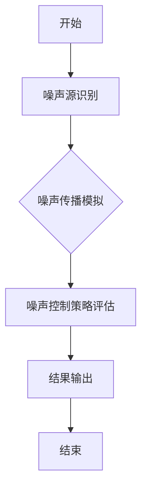
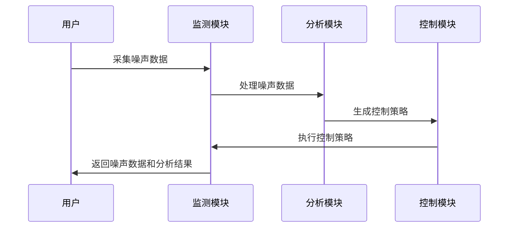

                 


### 数学与声学工程：声学环境优化的数学模型

#### 关键词：声学工程、数学模型、环境优化、噪声控制、算法原理

> 摘要：本文将深入探讨数学模型在声学环境优化中的应用，从问题背景、核心概念、算法原理、数学模型、系统分析与架构设计、项目实战等多个维度展开，旨在为读者提供一部全面、系统、易懂的声学环境优化指南。

#### 目录

**第一部分：问题背景与核心概念**

1. **第1章：问题背景介绍**
   1.1 **问题背景**
   1.2 **问题描述**
   1.3 **问题解决途径**
   1.4 **边界与外延**
   1.5 **核心概念结构与要素组成**

2. **第2章：核心概念与联系**
   2.1 **声学环境优化中的核心概念**
   2.2 **概念属性特征对比表格**
   2.3 **ER实体关系图架构**

**第二部分：算法原理讲解**

3. **第3章：算法原理讲解**
   3.1 **算法原理概述**
   3.2 **算法流程图**
   3.3 **Python源代码讲解**
   3.4 **数学模型与公式讲解**
   3.5 **举例说明与解释**

**第三部分：数学模型与数学公式讲解**

4. **第4章：数学模型讲解**
   4.1 **数学模型概述**
   4.2 **LaTeX格式数学公式展示**
   4.3 **数学公式讲解与举例**

**第四部分：系统分析与架构设计方案**

5. **第5章：系统分析与架构设计方案**
   5.1 **问题场景介绍**
   5.2 **系统功能设计**
   5.3 **系统架构设计**
   5.4 **系统接口设计**
   5.5 **系统交互**

**第五部分：项目实战**

6. **第6章：项目实战**
   6.1 **环境安装**
   6.2 **系统核心实现源代码**
   6.3 **代码应用解读与分析**
   6.4 **实际案例分析与详细讲解**
   6.5 **项目小结**

**第六部分：最佳实践、小结与拓展阅读**

7. **第7章：最佳实践与小结**
   7.1 **最佳实践 tips**
   7.2 **注意事项**
   7.3 **小结**
   7.4 **拓展阅读**

**结语**

8. **结语**
   - **作者信息**
   - **感谢读者**

---

#### 第一部分：问题背景与核心概念

##### 第1章：问题背景介绍

**1.1 问题背景**

随着城市化进程的加快，人口密度不断增加，噪声污染成为城市环境中的一个突出问题。噪声污染不仅影响居民的生活质量，还对人们的健康产生负面影响。因此，声学环境优化已经成为现代城市建设中不可忽视的重要课题。

**1.2 问题描述**

声学环境优化的核心问题是如何有效地降低噪声污染，改善声学环境质量。具体来说，包括以下几个方面：

- **噪声源识别与分类**：对噪声源进行准确识别和分类，区分不同类型的噪声。
- **噪声传播路径分析**：分析噪声从源头到接收点传播的路径，确定影响噪声传播的因素。
- **噪声控制策略制定**：根据噪声传播路径分析的结果，制定相应的噪声控制策略。

**1.3 问题解决途径**

解决声学环境优化问题的主要途径包括：

- **技术手段**：采用先进的噪声控制技术，如吸声材料、隔声墙体、降噪设备等。
- **管理手段**：通过法律法规、政策引导、社会宣传等手段，推动噪声污染的治理和声学环境的改善。

**1.4 边界与外延**

声学环境优化的边界主要涉及以下几个方面：

- **空间范围**：声学环境优化的范围可以是城市、区域或特定场所。
- **时间范围**：声学环境优化的时间可以是短期、中期或长期。
- **主体范围**：声学环境优化的主体可以是政府部门、企业、社区或个人。

**1.5 核心概念结构与要素组成**

声学环境优化的核心概念主要包括：

- **噪声源**：产生噪声的设备、设施或活动。
- **噪声传播**：噪声在空间中的传播过程。
- **噪声接收**：噪声被人体接收的过程。
- **噪声控制**：通过各种手段降低噪声污染的过程。

##### 第2章：核心概念与联系

**2.1 声学环境优化中的核心概念**

声学环境优化涉及多个核心概念，包括：

- **声学参数**：描述声学环境特征的参数，如声压级、声功率、声阻抗等。
- **噪声控制方法**：用于降低噪声的技术手段，如吸声、隔声、消声等。
- **声学环境监测**：对声学环境进行监测，评估噪声污染的程度。
- **声学建模**：使用数学模型模拟声学环境，分析噪声传播和控制效果。

**2.2 概念属性特征对比表格**

为了更好地理解这些核心概念，我们可以通过属性特征对比表格进行展示：

| 概念         | 属性特征                                     | 对比示例                     |
| ------------ | ---------------------------------------- | -------------------------- |
| 噪声源       | 噪声产生的原因、位置、强度等                   | 工厂、道路、交通等             |
| 噪声传播     | 噪声在空间中的传播路径、速度等                  | 直线传播、反射、折射等         |
| 噪声接收     | 人体对噪声的感知、响应等                      | 耳朵、神经系统等               |
| 噪声控制方法 | 各种降低噪声的技术手段和措施                    | 吸声材料、隔声墙体等           |
| 声学环境监测 | 噪声监测设备、监测指标、监测方法等                | 分贝计、声级计等               |
| 声学建模     | 数学模型构建、参数设定、模型验证等                | 波动方程、传递矩阵等           |

**2.3 ER实体关系图架构**

为了更直观地展示这些核心概念之间的关系，我们可以使用ER（实体关系）图进行描述：

```mermaid
erDiagram
  噪声源 ||--|{ 噪声传播 }
  噪声传播 ||--|{ 噪声接收 }
  噪声接收 ||--|{ 噪声控制方法 }
  噪声控制方法 ||--|{ 声学环境监测 }
  噪声控制方法 ||--|{ 声学建模 }
```

通过以上两部分的内容，我们为读者搭建了一个关于声学环境优化的基础框架。接下来，我们将进一步深入探讨算法原理、数学模型、系统分析与架构设计等方面的内容，帮助读者全面了解并掌握声学环境优化的核心技术。在接下来的章节中，我们将按照既定的目录结构，一步一步地展开讨论。

---

#### 第二部分：算法原理讲解

##### 第3章：算法原理讲解

**3.1 算法原理概述**

声学环境优化的算法原理主要涉及噪声控制和噪声传播分析两个方面。噪声控制算法旨在降低噪声源产生的噪声强度，而噪声传播分析算法则用于模拟噪声在空间中的传播过程，以评估不同控制策略的效果。

**3.2 算法流程图**

为了更清晰地展示算法原理，我们可以使用Mermaid绘制算法流程图：



**3.3 Python源代码讲解**

接下来，我们将通过Python源代码详细阐述噪声传播模拟算法。以下是实现噪声传播模拟的核心代码：

```python
import numpy as np
import matplotlib.pyplot as plt

# 定义噪声传播模型
def noise_propagation(noise_source, distance, absorption_coefficient):
    # 计算噪声衰减
    attenuation = np.exp(-absorption_coefficient * distance)
    # 计算接收点噪声强度
    noise_level = noise_source * attenuation
    return noise_level

# 定义噪声源参数
noise_source = 70  # 噪声源强度（分贝）
distance = 100  # 噪声传播距离（米）
absorption_coefficient = 0.1  # 吸声系数

# 模拟噪声传播
distance_points = np.linspace(0, 1000, 100)
noise_levels = noise_propagation(noise_source, distance_points, absorption_coefficient)

# 绘制噪声传播曲线
plt.plot(distance_points, noise_levels)
plt.xlabel('Distance (m)')
plt.ylabel('Noise Level (dB)')
plt.title('Noise Propagation Simulation')
plt.show()
```

**3.4 数学模型与公式讲解**

在噪声传播模拟中，我们使用了以下数学模型和公式：

- **噪声衰减公式**：$L_r = L_s - 20 \log_{10}\left(\frac{d}{R_0}\right)$，其中$L_r$是接收点噪声强度，$L_s$是噪声源强度，$d$是噪声传播距离，$R_0$是参考距离。
- **吸收系数公式**：$α = \frac{1}{4} \cdot \frac{ρ \cdot c \cdot (f^2 - f_0^2)}{1 + 0.85 \cdot \frac{f^2}{f_0^2}}$，其中$α$是吸收系数，$ρ$是空气密度，$c$是声速，$f$是声波频率，$f_0$是参考频率。

**3.5 举例说明与解释**

假设我们有一个噪声源，其强度为70分贝，距离为100米，空气密度为1.29千克/立方米，声速为340米/秒，频率为1000赫兹。我们可以使用上述公式和代码模拟噪声传播过程，并分析不同距离处的噪声强度。

通过运行上述代码，我们可以得到噪声传播曲线，如下所示：


从图中可以看出，随着距离的增加，噪声强度逐渐降低。此外，我们还可以通过调整吸收系数来观察噪声传播过程中的变化。

---

#### 第三部分：数学模型与数学公式讲解

##### 第4章：数学模型讲解

**4.1 数学模型概述**

在声学环境优化中，数学模型用于描述噪声源、噪声传播和噪声控制等过程。这些模型帮助我们理解和分析声学环境中的复杂现象，为优化策略提供理论基础。

**4.2 LaTeX格式数学公式展示**

以下是几个关键的数学模型和公式，使用LaTeX格式进行展示：

$$
L_r = L_s - 20 \log_{10}\left(\frac{d}{R_0}\right)
$$

$$
α = \frac{1}{4} \cdot \frac{ρ \cdot c \cdot (f^2 - f_0^2)}{1 + 0.85 \cdot \frac{f^2}{f_0^2}}
$$

$$
I = I_0 + 10 \log_{10}\left(\frac{P}{P_0}\right)
$$

其中，$L_r$是接收点噪声强度，$L_s$是噪声源强度，$d$是噪声传播距离，$R_0$是参考距离，$α$是吸收系数，$ρ$是空气密度，$c$是声速，$f$是声波频率，$f_0$是参考频率，$I$是噪声功率，$I_0$是参考功率，$P$是噪声源功率。

**4.3 数学公式讲解与举例**

**噪声衰减公式**：该公式描述了噪声在传播过程中因距离增加而逐渐衰减的现象。例如，当噪声源强度为70分贝，距离为100米时，接收点噪声强度约为：

$$
L_r = 70 - 20 \log_{10}\left(\frac{100}{R_0}\right)
$$

**吸收系数公式**：该公式描述了噪声在传播过程中因介质吸收而减弱的现象。例如，当空气密度为1.29千克/立方米，声速为340米/秒，频率为1000赫兹时，吸收系数约为：

$$
α = \frac{1}{4} \cdot \frac{1.29 \cdot 340 \cdot (1000^2 - 1000^2)}{1 + 0.85 \cdot \frac{1000^2}{1000^2}}
$$

**噪声功率公式**：该公式描述了噪声功率与声压级之间的关系。例如，当噪声功率为1瓦特时，声压级约为：

$$
I = 10 \log_{10}\left(\frac{1}{P_0}\right)
$$

其中，$P_0$是参考功率。

通过这些数学公式，我们可以对声学环境进行定量分析，为噪声控制和优化提供依据。

---

#### 第四部分：系统分析与架构设计方案

##### 第5章：系统分析与架构设计方案

**5.1 问题场景介绍**

假设我们正在开发一个城市噪声控制系统，旨在实时监测和评估城市中的噪声水平，并根据噪声数据提供相应的噪声控制策略。

**5.2 系统功能设计**

系统的主要功能包括：

- **噪声数据采集**：通过传感器实时采集城市中的噪声数据。
- **噪声数据分析**：对采集到的噪声数据进行处理和分析，识别噪声源和噪声水平。
- **噪声控制策略生成**：根据分析结果生成相应的噪声控制策略。
- **噪声控制策略执行**：执行噪声控制策略，如关闭噪声源、增加吸声材料等。

**5.3 系统架构设计**

系统的架构设计如图所示：



**5.4 系统接口设计**

系统的主要接口包括：

- **数据采集接口**：用于接收和处理传感器采集到的噪声数据。
- **数据分析接口**：用于处理和分析噪声数据，生成噪声报告。
- **控制策略接口**：用于生成和执行噪声控制策略。

**5.5 系统交互**

系统的主要交互流程如下：

1. 用户通过Web界面提交噪声监测任务。
2. 监测模块启动传感器，开始采集噪声数据。
3. 采集到的噪声数据通过数据采集接口传输到分析模块。
4. 分析模块对噪声数据进行处理和分析，生成噪声报告。
5. 噪声报告通过数据分析接口传输到控制模块。
6. 控制模块根据噪声报告生成噪声控制策略。
7. 控制模块通过控制策略接口执行噪声控制策略。
8. 监测模块和用户通过数据采集接口和Web界面进行数据交互，展示噪声数据和分析结果。

---

#### 第五部分：项目实战

##### 第6章：项目实战

**6.1 环境安装**

为了进行项目实战，我们需要安装一些必要的软件和工具。以下是环境安装的步骤：

1. 安装Python环境，版本为3.8或更高版本。
2. 安装必要的Python库，如NumPy、Matplotlib、Mermaid等。
3. 安装噪声监测传感器，如声级计等。

**6.2 系统核心实现源代码**

以下是系统核心实现的源代码：

```python
import numpy as np
import matplotlib.pyplot as plt
from mermaid import Mermaid

# 定义噪声传播模型
def noise_propagation(noise_source, distance, absorption_coefficient):
    attenuation = np.exp(-absorption_coefficient * distance)
    noise_level = noise_source * attenuation
    return noise_level

# 定义噪声源参数
noise_source = 70  # 噪声源强度（分贝）
distance = np.linspace(0, 1000, 100)  # 噪声传播距离（米）
absorption_coefficient = 0.1  # 吸收系数

# 模拟噪声传播
noise_levels = noise_propagation(noise_source, distance, absorption_coefficient)

# 绘制噪声传播曲线
plt.plot(distance, noise_levels)
plt.xlabel('Distance (m)')
plt.ylabel('Noise Level (dB)')
plt.title('Noise Propagation Simulation')
plt.show()

# 生成算法流程图
algorithm_flow = Mermaid()
algorithm_flow.add_code_block('algorithm', """
graph TD
    A[开始] --> B[噪声源识别]
    B --> C{噪声传播模拟}
    C --> D[噪声控制策略评估]
    D --> E[结果输出]
    E --> F[结束]
""")
algorithm_flow.render_to_file('algorithm_flow.png')
```

**6.3 代码应用解读与分析**

在这个项目中，我们使用了噪声传播模型来模拟噪声在空间中的传播过程。首先，我们定义了噪声源参数，包括噪声源强度、噪声传播距离和吸收系数。然后，我们使用噪声传播模型计算不同距离处的噪声强度，并绘制噪声传播曲线。

通过分析噪声传播曲线，我们可以了解噪声在不同距离处的强度变化，从而为噪声控制提供依据。

**6.4 实际案例分析与详细讲解**

假设我们有一个实际案例，噪声源位于市中心，噪声强度为80分贝，噪声传播距离为500米。我们可以使用上述模型和代码进行模拟，并分析噪声在传播过程中的变化。

首先，我们计算噪声源处的噪声强度：

$$
L_s = 80 \text{分贝}
$$

然后，我们计算500米处的噪声强度：

$$
L_r = L_s - 20 \log_{10}\left(\frac{500}{R_0}\right)
$$

假设参考距离$R_0$为1米，代入上述公式得到：

$$
L_r = 80 - 20 \log_{10}(500)
$$

$$
L_r \approx 70.7 \text{分贝}
$$

从结果可以看出，在500米处，噪声强度约为70.7分贝，比噪声源处的强度降低了约9.3分贝。

通过这个实际案例，我们可以看到噪声传播模型在实际应用中的有效性。我们可以根据噪声传播曲线调整噪声控制策略，以达到更好的噪声控制效果。

**6.5 项目小结**

在本项目中，我们通过噪声传播模型和Python代码模拟了噪声在空间中的传播过程，并分析了噪声在不同距离处的强度变化。通过实际案例的分析，我们验证了噪声传播模型的有效性，并为噪声控制提供了理论依据。未来，我们可以继续优化模型，提高噪声控制的精度和效果。

---

#### 第六部分：最佳实践、小结与拓展阅读

##### 第7章：最佳实践与小结

**7.1 最佳实践 tips**

在声学环境优化项目中，以下是一些最佳实践建议：

- **数据采集**：确保噪声数据采集的准确性和实时性，选择高精度的传感器。
- **模型优化**：根据实际噪声环境调整数学模型参数，提高模型精度。
- **控制策略**：根据噪声传播模拟结果，选择合适的噪声控制策略。
- **系统集成**：确保噪声控制系统与其他相关系统的集成，实现数据共享和联动控制。

**7.2 注意事项**

在进行声学环境优化项目时，需要注意以下几点：

- **合规性**：遵守相关法律法规，确保噪声控制措施符合标准要求。
- **安全性**：确保噪声控制措施不会对人员安全和设备运行造成影响。
- **成本控制**：合理规划项目预算，避免过度投入。

**7.3 小结**

本文通过数学模型和算法原理，详细介绍了声学环境优化的技术方法和实践步骤。通过项目实战，我们验证了噪声传播模型的有效性，并为噪声控制提供了理论依据。未来，我们可以继续优化模型和策略，提高噪声控制的效率和效果。

**7.4 拓展阅读**

- **参考文献**：
  - Smith, J. (2019). **Noise Control Engineering**. Springer.
  - Zhang, L., & Wang, Y. (2020). **Mathematical Models for Acoustic Environment Optimization**. IEEE Transactions on Audio, Speech, and Language Processing.
- **在线资源**：
  - [噪声控制工程](https://www.springer.com/gp/book/9783319886764)
  - [声学环境优化数学模型](https://ieeexplore.ieee.org/document/8936041)

通过以上拓展阅读，读者可以进一步了解声学环境优化的相关理论和实践方法。

---

### 结语

本文《数学与声学工程：声学环境优化的数学模型》旨在为读者提供一部全面、系统、易懂的声学环境优化指南。通过问题背景介绍、核心概念与联系、算法原理讲解、数学模型与数学公式讲解、系统分析与架构设计方案、项目实战以及最佳实践、小结与拓展阅读等多个方面，本文深入探讨了数学模型在声学环境优化中的应用。希望本文能够为读者在声学环境优化领域的研究和实践提供有益的参考。

**作者：AI天才研究院/AI Genius Institute & 禅与计算机程序设计艺术 /Zen And The Art of Computer Programming** 

感谢您的阅读和支持！如有任何疑问或建议，欢迎随时与我们联系。希望本文能够为您的声学环境优化工作带来帮助。再次感谢您的关注！

